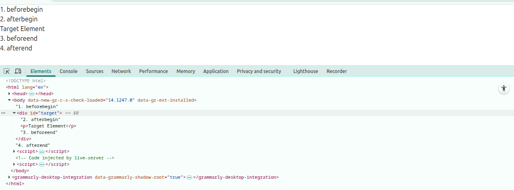

<h1 id="part-2-DOM" align="center">Part 2: DOM</h1>


<h2 id="css-and-class-styling" align="center">CSS and Class Styling</h2>
<h3 id="css-styling" align="center">CSS Styling</h3>

<h3 id="style-property">Style Property:</h3>
<p>style property is used to get or set inline styles of an HTML element using JavaScript.</p>

```html
<!DOCTYPE html>
<html lang="en">

<head>
    <meta charset="UTF-8">
    <meta name="viewport" content="width=device-width, initial-scale=1.0">
    <link href="https://cdn.jsdelivr.net/npm/daisyui@5" rel="stylesheet" type="text/css" />
    <script src="https://cdn.jsdelivr.net/npm/@tailwindcss/browser@4"></script>

    <title>Element Properties</title>
</head>

<body>
    <div id="box" style="color: red;">Hello</div>

    <script>
        const box = document.getElementById("box");

        console.log(box.style.color); // "red"
        box.style.backgroundColor = "yellow";
    </script>
</body>

</html>
```

```html
<!DOCTYPE html>
<html lang="en">

<head>
    <meta charset="UTF-8">
    <meta name="viewport" content="width=device-width, initial-scale=1.0">
    <title>Document</title>
</head>

<body>
    <header>
        <h1>Welcome to my DOM</h1>
        <p>Lorem ipsum dolor sit amet consectetur adipisicing elit. Voluptatibus, natus! Dolorem voluptate provident rem
            eligendi eaque, odit fugiat sed tenetur corporis vel, laudantium veniam accusantium sunt adipisci blanditiis
            dolore vitae?</p>
    </header>
    <main id="main-container">
        <section>
            <h1>My Awesome DOM de baba</h1>
            <ul>
                <li>Jalali Set</li>
                <li>Shafayet</li>
                <li>bonobash</li>
                <li>DOM de re baba</li>
            </ul>
        </section>
        <section class="fruits-container">
            <h1 id="fruits-title" class="some-class random-class blue-bg">Fruits I like</h1>
            <ul>
                <li>Apple</li>
                <li>Banana</li>
                <li>Carrot</li>
            </ul>
        </section>
        <section id="places-container" class="large-text">
            <h1 id="places-title">Places I like to visit</h1>
            <ul id="places-list">
                <li class="important-places">Soondarban</li>
                <li class="important-places">bandorban</li>
                <li class="important-places">Kataban</li>
                <li class="other-place">shalbon</li>
            </ul>
        </section>
    </main>


    <script>
        const sections = document.querySelectorAll("section")
        /*
        if we need classes just write it document.querySelectorAll(.className)
        if we need ids just write it document.querySelectorAll(#idName)
        */
        console.log(sections);
        for (const section of sections) {
            console.log(section);
        }
        for (const section of sections) {
            section.style.border = "2px solid red";
            section.style.borderRadius = '8px';
            section.style.padding = "20px";
            section.style.margin = "10px";
            section.style.backgroundColor = "skyBlue";
        }
        const placesContainer = document.getElementById("places-container");
        placesContainer.style.backgroundColor = "yellow";

        // add and remove css class
        placesContainer.classList.add("text-center");
        placesContainer.classList.remove("large-text");

    </script>
</body>

</html>
```


<p><strong>Note:</strong> JS follow camelCase css names:</p>

| CSS Name           | JavaScript Style Name |
| ------------------ | --------------------- |
| `background-color` | `backgroundColor`     |
| `font-size`        | `fontSize`            |
| `z-index`          | `zIndex`              |
| `border-radius`    | `borderRadius`        |


<h3 id="cssText-property">cssText property:</h3>
<ul>
<li>Lets you set multiple styles at once as a string.</li>
<li>Overwrites all existing inline styles.</li>
</ul>

```html
<!DOCTYPE html>
<html lang="en">

<head>
    <meta charset="UTF-8">
    <meta name="viewport" content="width=device-width, initial-scale=1.0">
    <link href="https://cdn.jsdelivr.net/npm/daisyui@5" rel="stylesheet" type="text/css" />
    <script src="https://cdn.jsdelivr.net/npm/@tailwindcss/browser@4"></script>

    <title>Element Properties</title>
</head>

<body>
    <div id="box" style="color: red;">Hello</div>

    <script>
        const box = document.getElementById("box");

        box.style.cssText = "color: white; background: black; padding: 10px;";
    </script>
</body>

</html>
```


<h3 id="class-styling" align="center">Class Styling:</h3>

<h4 id="className-property">className Property:</h4>

```html
<!DOCTYPE html>
<html lang="en">

<head>
    <meta charset="UTF-8">
    <meta name="viewport" content="width=device-width, initial-scale=1.0">
    <link href="https://cdn.jsdelivr.net/npm/daisyui@5" rel="stylesheet" type="text/css" />
    <script src="https://cdn.jsdelivr.net/npm/@tailwindcss/browser@4"></script>

    <title>Element Properties</title>
</head>

<body>
    <div id="card" class="text-6xl bg-red-500">Hello</div>


    <script>
        const card = document.getElementById("card");

        // Accessing and modifying class
        console.log(card.className);      // "text-6xl bg-red-500"
        card.className = "text-2xl bg-green-500";     // Replaces all classes
    </script>
</body>

</html>
```

<h4 id="classList-methods">classList methods</h4>
<p>classList gives you a powerful interface to manage individual classes.</p>

```html
<!DOCTYPE html>
<html lang="en">

<head>
    <meta charset="UTF-8">
    <meta name="viewport" content="width=device-width, initial-scale=1.0">
    <link href="https://cdn.jsdelivr.net/npm/daisyui@5" rel="stylesheet" type="text/css" />
    <script src="https://cdn.jsdelivr.net/npm/@tailwindcss/browser@4"></script>

    <title>Element Properties</title>
</head>

<body>
    <!DOCTYPE html>
    <html lang="en">

    <head>
        <meta charset="UTF-8">
        <meta name="viewport" content="width=device-width, initial-scale=1.0">
        <link href="https://cdn.jsdelivr.net/npm/daisyui@5" rel="stylesheet" type="text/css" />
        <script src="https://cdn.jsdelivr.net/npm/@tailwindcss/browser@4"></script>

        <title>Element Properties</title>
    </head>

    <body>
        <div id="card" class="text-6xl bg-red-500">Hello</div>


        <script>
            const card = document.getElementById("card");

            // Add class
            card.classList.add("text-white");

            // Remove class
            card.classList.remove("text-6xl");

            // Check if a class exists
            console.log(card.classList.contains("text-white")); // true

            // replace class
            card.classList.replace("bg-red-500", "bg-blue-500");
        </script>
    </body>

    </html>
</body>

</html>
```
<hr>


<h2 id="Creating-Adding-and-Removing-Elements-methods" align="center">Creating, Adding and Removing Elements methods<h2>

<h3 id="creating-elements" align="center">Creating Elements</h3>
<ul>

<li>
<h4 id="createElement()">createElement()</h4>
<ul>
<li>Creates a new element node.</li>
<li>Does not automatically add it to the DOM — you must insert it manually.</li>
</ul>

```html
<!DOCTYPE html>
<html lang="en">

<head>
    <meta charset="UTF-8">
    <meta name="viewport" content="width=device-width, initial-scale=1.0">
    <title>Element Properties</title>

    <link href="https://cdn.jsdelivr.net/npm/daisyui@5" rel="stylesheet" type="text/css" />
    <script src="https://cdn.jsdelivr.net/npm/@tailwindcss/browser@4"></script>
</head>

<body>

    <script>
        const div = document.createElement("div");
        div.innerText = "Hello World";
        // div.textContent = "Hello WOrld"
        div.className = "bg-blue-500 text-white p-4 rounded-lg shadow-lg";
        document.body.appendChild(div); // Adds to the page
    </script>
</body>

</html>
```

```html
<!DOCTYPE html>
<html lang="en">

<head>
    <meta charset="UTF-8">
    <meta name="viewport" content="width=device-width, initial-scale=1.0">
    <title>Document</title>
</head>

<body>
    <header>
        <h1>Welcome to my DOM</h1>
        <p>Lorem ipsum dolor sit amet consectetur adipisicing elit. Voluptatibus, natus! Dolorem voluptate provident rem
            eligendi eaque, odit fugiat sed tenetur corporis vel, laudantium veniam accusantium sunt adipisci blanditiis
            dolore vitae?</p>
    </header>
    <main id="main-container">
        <section>
            <h1>My Awesome DOM de baba</h1>
            <ul>
                <li>Jalali Set</li>
                <li>Shafayet</li>
                <li>bonobash</li>
                <li>DOM de re baba</li>
            </ul>
        </section>
        <section class="fruits-container">
            <h1 id="fruits-title" class="some-class random-class blue-bg">Fruits I like</h1>
            <ul>
                <li>Apple</li>
                <li>Banana</li>
                <li>Carrot</li>
            </ul>
        </section>
        <section id="places-container" class="large-text">
            <h1 id="places-title">Places I like to visit</h1>
            <ul id="places-list">
                <li class="important-places">Soondarban</li>
                <li class="important-places">bandorban</li>
                <li class="important-places">Kataban</li>
                <li class="other-place">shalbon</li>
            </ul>
        </section>
    </main>


    <script>
        // where to add
        const placesList = document.getElementById("places-list");
        // what to add
        const li = document.createElement("li");
        li.innerText = "pahertoli";
        // add the child
        placesList.appendChild(li);
    </script>
</body>

</html>
```

```html
<!DOCTYPE html>
<html lang="en">

<head>
    <meta charset="UTF-8">
    <meta name="viewport" content="width=device-width, initial-scale=1.0">
    <title>Document</title>
</head>

<body>
    <header>
        <h1>Welcome to my DOM</h1>
        <p>Lorem ipsum dolor sit amet consectetur adipisicing elit. Voluptatibus, natus! Dolorem voluptate provident rem
            eligendi eaque, odit fugiat sed tenetur corporis vel, laudantium veniam accusantium sunt adipisci blanditiis
            dolore vitae?</p>
    </header>
    <main id="main-container">
        <section>
            <h1>My Awesome DOM de baba</h1>
            <ul>
                <li>Jalali Set</li>
                <li>Shafayet</li>
                <li>bonobash</li>
                <li>DOM de re baba</li>
            </ul>
        </section>
        <section class="fruits-container">
            <h1 id="fruits-title" class="some-class random-class blue-bg">Fruits I like</h1>
            <ul>
                <li>Apple</li>
                <li>Banana</li>
                <li>Carrot</li>
            </ul>
        </section>
        <section id="places-container" class="large-text">
            <h1 id="places-title">Places I like to visit</h1>
            <ul id="places-list">
                <li class="important-places">Soondarban</li>
                <li class="important-places">bandorban</li>
                <li class="important-places">Kataban</li>
                <li class="other-place">shalbon</li>
            </ul>
        </section>
    </main>


    <script>
        const mainContainer = document.getElementById("main-container");

        const section = document.createElement("section");
        const h1 = document.createElement("h1");
        h1.innerText = "Favorite Food list";
        section.appendChild(h1);

        const ul = document.createElement("ul");
        section.appendChild(ul);

        const li1 = document.createElement("li");
        li1.innerText = "biriyani";
        ul.appendChild(li1);

        const li2 = document.createElement("li");
        li2.innerText = "kaschi";
        ul.appendChild(li2);

        const li3 = document.createElement("li");
        li3.innerText = "morogPolaw";
        ul.appendChild(li3);

        mainContainer.appendChild(section);
        console.log(document.getElementsByTagName("section.innerHTML"));

        // Set Inner HTML Directly
        const sectionDress = document.createElement("section");
        sectionDress.innerHTML = `
        <h1>My Dress Section </h2>
            <ul>
                <li>T-shirt</li>    
                <li>longi</li>    
                <li>sendel genji</li>    
            </ul>
        `
        mainContainer.appendChild(sectionDress)
    </script>
</body>

</html>
```
</li>

<li>
<h4 id="createTextNode()">createTextNode()</h4>
<ul><li>Creates a text node (just text, no HTML).</li></ul>

```html
<!DOCTYPE html>
<html lang="en">

<head>
    <meta charset="UTF-8">
    <meta name="viewport" content="width=device-width, initial-scale=1.0">
    <title>Element Properties</title>

    <link href="https://cdn.jsdelivr.net/npm/daisyui@5" rel="stylesheet" type="text/css" />
    <script src="https://cdn.jsdelivr.net/npm/@tailwindcss/browser@4"></script>
</head>

<body>

    <script>
        const p = document.createElement("p");
        const text = document.createTextNode("This is a text node");
        p.appendChild(text);
        document.body.appendChild(p);
    </script>
</body>

</html>
```
</li>

<li>
<h4 id="createDocumentFragment()">createDocumentFragment()</h4>
<ul>
<li>A lightweight container for temporary DOM storage.</li>
<li>Useful for inserting many nodes at once.</li>
</ul>

```html
<!DOCTYPE html>
<html lang="en">

<head>
    <meta charset="UTF-8">
    <meta name="viewport" content="width=device-width, initial-scale=1.0">
    <title>Element Properties</title>
</head>

<body>
    <ul id="myList"></ul>

    <script>
        const fragment = document.createDocumentFragment();

        for (let i = 1; i <= 3; i++) {
            let li = document.createElement("li");
            li.innerText = `Item ${i}`;
            fragment.appendChild(li);
        }

        document.getElementById("myList").appendChild(fragment);

    </script>
</body>

</html>
```
</li>

<li>
<h4 id="cloneNode()">cloneNode()</h4>
<ul>
<li>Creates a copy of an element.</li>
<li>cloneNode(true) → deep clone (includes children).</li>
<li>cloneNode(false) → shallow clone (element only).</li>
</ul>

```html
<!DOCTYPE html>
<html lang="en">

<head>
    <meta charset="UTF-8">
    <meta name="viewport" content="width=device-width, initial-scale=1.0">
    <title>Element Properties</title>

    <link href="https://cdn.jsdelivr.net/npm/daisyui@5" rel="stylesheet" type="text/css" />
    <script src="https://cdn.jsdelivr.net/npm/@tailwindcss/browser@4"></script>
</head>

<body>
    <div id="original">
        <h2>Hello</h2>
        <p>This is a paragraph.</p>
    </div>

    <script>
        const original = document.getElementById("original");

        // Shallow Clone (no children)
        const shallowClone = original.cloneNode(false);
        document.body.appendChild(shallowClone); // nothing show in the page
        console.log("Shallow Clone:", shallowClone.outerHTML);
        /*
        Shallow Clone: <div id="original"></div>
        */

        // Deep Clone (includes children)
        const deepClone = original.cloneNode(true);
        document.body.appendChild(deepClone);
        console.log("Deep Clone:", deepClone.outerHTML);
        /*
        Deep Clone: <div id="original">
            <h2>Hello</h2>
            <p>This is a paragraph.</p>
        </div>
        */
    </script>
</body>

</html>
```
</li>

</ul>


<h3 id="adding-elements" align="center">Adding Elements</h3>
<ul>

<li>
<h4>appendChild()</h4>
<ul><li>Adds a node as the last child of a parent.</li></ul>

```html
<!DOCTYPE html>
<html lang="en">

<head>
    <meta charset="UTF-8">
    <meta name="viewport" content="width=device-width, initial-scale=1.0">
    <title>Element Properties</title>
</head>

<body>
    <ul>
        <li>Hello</li>
    </ul>

    <script>
        const li = document.createElement("li");
        li.innerText = "Hi";
        document.querySelector("ul").appendChild(li);
    </script>
</body>

</html>
```
</li>

<li>
<h4 id="insertBefore()">insertBefore()</h4>
<ul><li>Inserts a node before a reference node.</li></ul>

```html
<!DOCTYPE html>
<html lang="en">

<head>
    <meta charset="UTF-8">
    <meta name="viewport" content="width=device-width, initial-scale=1.0">
    <title>Element Properties</title>
</head>

<body>
    <ul>
        <li>Hello</li>
    </ul>

    <script>
        const ul = document.querySelector("ul");
        const li = document.createElement("li");
        li.innerText = "Hi";
        ul.insertBefore(li, ul.firstChild);
    </script>
</body>

</html>
```
</li>

<li>
<h4 id="insertAdjacentElement()">insertAdjacentElement()</h4>
<ul>
<li>Inserts an element relative to another element.</li>
<li>Position Options:</li>
<ul>
<li>"beforebegin" → before element itself</li>
<li>"afterbegin" → inside element, before first child</li>
<li>"beforeend" → inside element, after last child</li>
<li>"afterend" → after element itself</li>
</ul>
</ul>

```html
<!DOCTYPE html>
<html lang="en">

<head>
    <meta charset="UTF-8">
    <meta name="viewport" content="width=device-width, initial-scale=1.0">
    <title>Element Properties</title>

    <link href="https://cdn.jsdelivr.net/npm/daisyui@5" rel="stylesheet" type="text/css" />
    <script src="https://cdn.jsdelivr.net/npm/@tailwindcss/browser@4"></script>
</head>

<body>
    <div id="target">
        <p>Target Element</p>
    </div>

    <script>
        const target = document.getElementById("target");

        // beforebegin
        const beforeBeginEl = document.createElement("div");
        beforeBeginEl.textContent = '1. beforebegin';
        target.insertAdjacentElement("beforebegin", beforeBeginEl);

        // afterbegin
        const afterBeginEl = document.createElement("div");
        afterBeginEl.textContent = '2. afterbegin';
        target.insertAdjacentElement("afterbegin", afterBeginEl);

        // beforeend
        const beforeEndEl = document.createElement("div");
        beforeEndEl.textContent = '3. beforeend';
        target.insertAdjacentElement("beforeend", beforeEndEl);

        // afterend
        const afterEndEl = document.createElement("div");
        afterEndEl.textContent = '4. afterend';
        target.insertAdjacentElement("afterend", afterEndEl);
    </script>
</body>

</html>
```
</li>

<li>
<h4 id="insertAdjacentHTML()">insertAdjacentHTML()</h4>
<ul><li>Same as insertAdjacentElement(), but here you can inset HTML directly at a position:</li></ul>

```html
<!DOCTYPE html>
<html lang="en">

<head>
    <meta charset="UTF-8">
    <meta name="viewport" content="width=device-width, initial-scale=1.0">
    <title>Element Properties</title>

    <link href="https://cdn.jsdelivr.net/npm/daisyui@5" rel="stylesheet" type="text/css" />
    <script src="https://cdn.jsdelivr.net/npm/@tailwindcss/browser@4"></script>
</head>

<body>
    <div id="target">
        <p>Target Element</p>
    </div>

    <script>
        const target = document.getElementById("target");

        // beforebegin
        target.insertAdjacentHTML("beforebegin", "<div>1. beforebegin</div>");

        // afterbegin
        target.insertAdjacentHTML("afterbegin", "<div>2. afterbegin</div>");

        // beforeend
        target.insertAdjacentHTML("beforeend", "<div>3. beforeend</div>");

        // afterend
        target.insertAdjacentHTML("afterend", "<div>4. afterend</div>");
    </script>
</body>

</html>
```
</li>

<li>
<h4 id="insertAdjacentText()">insertAdjacentText()</h4>
<ul><li>Same as insertAdjacentElement() and insertAdjacentHTML(), but here you just inset plain text at a position:</li></ul>

```html
<!DOCTYPE html>
<html lang="en">

<head>
    <meta charset="UTF-8">
    <meta name="viewport" content="width=device-width, initial-scale=1.0">
    <title>Element Properties</title>

    <link href="https://cdn.jsdelivr.net/npm/daisyui@5" rel="stylesheet" type="text/css" />
    <script src="https://cdn.jsdelivr.net/npm/@tailwindcss/browser@4"></script>
</head>

<body>
    <div id="target">
        <p>Target Element</p>
    </div>

    <script>
        const target = document.getElementById("target");

        // beforebegin
        target.insertAdjacentText("beforebegin", "1. beforebegin");

        // afterbegin
        target.insertAdjacentText("afterbegin", "2. afterbegin");

        // beforeend
        target.insertAdjacentText("beforeend", "3. beforeend");

        // afterend
        target.insertAdjacentText("afterend", "4. afterend");
    </script>
</body>

</html>
```

</li>

<li>
<h4 id="before()-parpend()-append()-after()">before(), parpend(), append(), after()</h4>
<p>Can insert nodes or strings directly.</p>
<ul>
<li>before() → before element itself</li>
<li>prepend() → inside element, before first child</li>
<li>append() → inside element, after last child</li>
<li>after() → after element itself</li>
</ul>

```html
<!DOCTYPE html>
<html lang="en">

<head>
    <meta charset="UTF-8">
    <meta name="viewport" content="width=device-width, initial-scale=1.0">
    <title>Element Properties</title>
</head>

<body>
    <ul id="ul">
        <li>Item</li>
    </ul>
    <br><br>
    <br><br>
    <ol id="ol">
        <li>Item</li>
    </ol>

    <script>
        const UlList = document.querySelector("ul");

        // create string directly
        UlList.before("Before Item");
        UlList.prepend("First Item ");
        UlList.append("Last Item");
        UlList.after("After Item");


        const olList = document.querySelector("ol");

        // Create elements directly
        const beforeItem = document.createElement("li");
        beforeItem.textContent = "Before Item";
        olList.before(beforeItem);

        const firstItem = document.createElement("li");
        firstItem.textContent = "First Item";
        olList.prepend(firstItem);

        const lastItem = document.createElement("li");
        lastItem.textContent = "Last Item";
        olList.append(lastItem);

        const afterItem = document.createElement("li");
        afterItem.textContent = "After Item";
        olList.after(afterItem);


    </script>
</body>

</html>
```

</li>

</ul>


<h3 id="removing-elements" align="center">Removing Elements</h3>
<ul>
<li>
<h4>removeChild()</h4>
<ul><li>Removes a child node from its parent.</li></ul>

```html
<!DOCTYPE html>
<html lang="en">

<head>
    <meta charset="UTF-8">
    <meta name="viewport" content="width=device-width, initial-scale=1.0">
    <title>Element Properties</title>

    <link href="https://cdn.jsdelivr.net/npm/daisyui@5" rel="stylesheet" type="text/css" />
    <script src="https://cdn.jsdelivr.net/npm/@tailwindcss/browser@4"></script>
</head>

<body>
    <ul>
        <li>Hello</li>
        <li>World</li>
    </ul>

    <script>
        const list = document.querySelector("ul");
        const lastItem = list.lastElementChild;
        list.removeChild(lastItem);
    </script>
</body>

</html>
```
</li>

<li>
<h4 id="remove()">remove()</h4>
<ul><li>Removes the element directly.</li></ul>

```html
<!DOCTYPE html>
<html lang="en">

<head>
    <meta charset="UTF-8">
    <meta name="viewport" content="width=device-width, initial-scale=1.0">
    <title>Element Properties</title>

    <link href="https://cdn.jsdelivr.net/npm/daisyui@5" rel="stylesheet" type="text/css" />
    <script src="https://cdn.jsdelivr.net/npm/@tailwindcss/browser@4"></script>
</head>

<body>
    <ul>
        <li>Hello</li>
        <li>World</li>
    </ul>

    <script>
        document.querySelector("ul").remove();
    </script>
</body>

</html>
```
</li>
<li>
<h4 id="replaceChild()">replaceChild()</h4>
<ul><li>Replaces one child with another.</li></ul>

```html
<!DOCTYPE html>
<html lang="en">

<head>
    <meta charset="UTF-8">
    <meta name="viewport" content="width=device-width, initial-scale=1.0">
    <title>Element Properties</title>

    <link href="https://cdn.jsdelivr.net/npm/daisyui@5" rel="stylesheet" type="text/css" />
    <script src="https://cdn.jsdelivr.net/npm/@tailwindcss/browser@4"></script>
</head>

<body>
    <ul>
        <li>Hello</li>
        <li>World</li>
    </ul>

    <script>
        const list = document.querySelector("ul");
        const oldItem = list.lastElementChild;
        const newItem = document.createElement("li");
        newItem.textContent = "New Item";
        list.replaceChild(newItem, oldItem);
    </script>
</body>

</html>
```
</li>

<li>
<h4 id="replaceWith()">replaceWith()</h4>
<ul><li>Replaces an element directly.</li></ul>

```html
<!DOCTYPE html>
<html lang="en">

<head>
    <meta charset="UTF-8">
    <meta name="viewport" content="width=device-width, initial-scale=1.0">
    <title>Element Properties</title>

    <link href="https://cdn.jsdelivr.net/npm/daisyui@5" rel="stylesheet" type="text/css" />
    <script src="https://cdn.jsdelivr.net/npm/@tailwindcss/browser@4"></script>
</head>

<body>
    <p>Hello World</p>

    <script>
        const p = document.querySelector("p");
        const h = document.createElement("h1");
        h.innerText = "Hello World 2";

        p.replaceWith(h);
    </script>
</body>

</html>
```
</li>
</ul>

<hr>


<h2 id="event" align="center">Event</h2>


<h3  align="center" id="event-basic">Event Basic</h3>

<h4 id="what-is-event">What is events:</h4>
<p>Events are signals that something has happened — like a button click, key press, page load, etc. You can "listen" for these events and run code in response.</p>

<h4 id="event-object">Event Object:</h4>
<p>Every event has an associated event object that contains information about the event.</p>

```html
<!DOCTYPE html>
<html lang="en">

<head>
    <meta charset="UTF-8">
    <meta name="viewport" content="width=device-width, initial-scale=1.0">
    <title>Title</title>
</head>

<body>
    <button id="myBtn">Click Me</button>

    <script>
        document.getElementById('myBtn').addEventListener('click', function (event) {
            console.log(event); // Event object - PointerEvent {isTrusted: true, …}
            console.log(event.type); // click
            console.log(event.target); // Button element - <button id="myBtn">Click Me</button>
        });
    </script>
</body>

</html>
```

<h4 id="preventDefault()">preventDefault():</h4>
<p>Stops the browser’s default behavior.</p>

```html
<!DOCTYPE html>
<html lang="en">

<head>
    <meta charset="UTF-8">
    <meta name="viewport" content="width=device-width, initial-scale=1.0">
    <title>Title</title>
</head>

<body>
    <a href="https://example.com" id="link">Click Me</a>

    <script>
        document.getElementById("link").addEventListener("click", (event) => {
            event.preventDefault(); // Prevents redirect
            alert("Default action prevented!");
        });
    </script>

</body>

</html>
```


<h3 align="center" id="adding-event-listeners">Adding Events</h3>

<h4 id="addEventListener()">addEventListener():</h4>

```html
<!DOCTYPE html>
<html lang="en">

<head>
    <meta charset="UTF-8">
    <meta name="viewport" content="width=device-width, initial-scale=1.0">
    <title>Title</title>
</head>

<body>
    <button id="btns">Click Me</button>

    <script>
        document.getElementById("btns").addEventListener("click", function () {
            alert("Button clicked");
        });
    </script>
</body>

</html>
```

```html
<!DOCTYPE html>
<html lang="en">

<head>
    <meta charset="UTF-8">
    <meta name="viewport" content="width=device-width, initial-scale=1.0">
    <title>Document</title>
</head>

<h1 id="heading-text">Event Handler</h1>
<button id="btn-update-heading">Update Heading</button> <br><br>

<h1 id="heading-text2">Event Handler</h1>
<button id="btn-update-heading2">Update Heading</button> <br><br>

<p id="no-name">No Name</p>
<input type="text" id="input-field">
<button id="btn">Update</button>

<script>
    document.getElementById("btn-update-heading").addEventListener("click", function () {
        const h1 = document.getElementsByTagName("h1");
        h1[0].innerText = "I am change by the event handler";
    })

    document.getElementById("btn-update-heading2").addEventListener("click", function () {
        const originalHeading = document.getElementById("heading-text2");
        originalHeading.innerText = "I am changed by the event handler";
    })

    document.getElementById("btn").addEventListener("click", () => {
        const getInputFieldValue = document.getElementById("input-field").value;
        const setName = document.getElementById("no-name");
        setName.innerText = getInputFieldValue;
    })
</script>
</body>

</html>
```


<h4 id="removeEventListener()">removeEventListener():</h4>
<p>To remove the event listener, you need to use the same function reference for both addEventListener() and removeEventListener().</p>

```html
<!DOCTYPE html>
<html lang="en">

<head>
    <meta charset="UTF-8">
    <meta name="viewport" content="width=device-width, initial-scale=1.0">
    <title>Title</title>
</head>

<body>
    <button id="btns">Click Me</button>

    <script>
        /*
        document.getElementById("btns").addEventListener("click", function () {
            alert("Button clicked");
        });
        document.getElementById("btns").removeEventListener("click", function () {
            alert("Button clicked");
        });
        */
        // The above removeEventListener will not work because the function reference is different.
        // To remove the event listener, you need to use the same function reference for both cases.
        const alertFunction = () => {
            alert("Button clicked");
        };
        document.getElementById("btns").addEventListener("click", alertFunction);
        document.getElementById("btns").removeEventListener("click", alertFunction);
    </script>
</body>

</html>
```

<h4 id="onClick-vs-addEventListener()">onClick vs addEventListener():</h4>

<p>With onclick perperty you can't add multiple event handler function. If you assign more than one evet handler to onclick, it overwrites the previous one.</p>

```html
<!DOCTYPE html>
<html lang="en">

<head>
    <meta charset="UTF-8">
    <meta name="viewport" content="width=device-width, initial-scale=1.0">
    <title>Title</title>
</head>

<body>
    <button id="btn" onclick="alert('Inline clicked')">Click Me</button>

    <script>
        const btn = document.getElementById("btn");

        btn.onclick = function () {
            console.log("First handler");
        };

        btn.onclick = function () {
            console.log("Second handler"); // Only this one runs
        };
    </script>

</body>

</html>
```

<p>But, with addEventListener() methods you can add multiple event handler function.</p>

```html
<!DOCTYPE html>
<html lang="en">

<head>
    <meta charset="UTF-8">
    <meta name="viewport" content="width=device-width, initial-scale=1.0">
    <title>Title</title>
</head>

<body>
    <button id="btn">Click Me</button>

    <script>
        const btn = document.getElementById("btn");

        btn.addEventListener("click", function () {
            console.log("First handler");
        });

        btn.addEventListener("click", function () {
            console.log("Second handler");
        });
    </script>
</body>

</html>
```

<p>Add a events on a button with onClick event handler and addEventListener() method:</p>

```html
<!DOCTYPE html>
<html lang="en">

<head>
    <meta charset="UTF-8">
    <meta name="viewport" content="width=device-width, initial-scale=1.0">
    <title>Document</title>
</head>

<body>
    <!-- Option 1 -->
    <button onclick="console.log(3)">Click Me</button>
    <button onclick="console.log(7)">Click Me</button>
    <button onclick="console.log('I am Clicked')">Click Me</button>

    <!-- option 2 -->
    <button onclick="makeYellow()">Make Yellow</button>
    <button onclick="makeRed()">Make Red</button>

    <!-- option 3 -->
    <button id="btn-make-blue">Make Blue</button>
    <button id="btn-make-purple">Make Purple</button>

    <!-- option 4 -->
    <button id="btn-make-green">Make Green</button>
    <button id="btn-make-pink">Make Pink</button>

    <script>
        // option 2
        function makeYellow() {
            document.body.style.backgroundColor = "yellow";
        }
        function makeRed() {
            document.body.style.backgroundColor = "red";
        }

        // option 3
        const btnMakeBlue = document.getElementById("btn-make-blue");
        btnMakeBlue.onclick = function () {
            document.body.style.backgroundColor = "blue";
        }

        const btnMakePurple = document.getElementById("btn-make-purple");
        btnMakePurple.onclick = function () {
            document.body.style.backgroundColor = "purple";
        }

        // option 4 (best practice)
        document.getElementById("btn-make-green").addEventListener("click", function () {
            document.body.style.backgroundColor = "green";
        });

        document.getElementById("btn-make-pink").addEventListener("click", () => {
            document.body.style.backgroundColor = "pink";
        });
    </script>
</body>

</html>
```

<h3 align="center" id="common-events">Common Events</h3>
 <ul>
  <li><strong>Mouse Events</strong>
    <ul>
      <li><code>click</code> – Single click on an element</li>
      <li><code>dblclick</code> – Double click</li>
      <li><code>mousedown</code> – Mouse button pressed</li>
      <li><code>mouseup</code> – Mouse button released</li>
      <li><code>mousemove</code> – Mouse moves over an element</li>
      <li><code>mouseenter</code> – Mouse enters an element (no bubbling)</li>
      <li><code>mouseleave</code> – Mouse leaves an element (no bubbling)</li>
      <li><code>mouseover</code> – Mouse moves onto an element</li>
      <li><code>mouseout</code> – Mouse moves off an element</li>
      <li><code>contextmenu</code> – Right-click opens context menu</li>
    </ul>
  </li>

  <li><strong>Keyboard Events</strong>
    <ul>
      <li><code>keydown</code> – Key is pressed</li>
      <li><code>keypress</code> – Key is pressed (deprecated)</li>
      <li><code>keyup</code> – Key is released</li>
    </ul>
  </li>

  <li><strong>Form Events</strong>
    <ul>
      <li><code>submit</code> – Form is submitted</li>
      <li><code>reset</code> – Form is reset</li>
      <li><code>change</code> – Form element value changes</li>
      <li><code>input</code> – User input changes (real-time)</li>
      <li><code>focus</code> – Element gains focus</li>
      <li><code>blur</code> – Element loses focus</li>
      <li><code>focusin</code> – Focus enters a descendant (bubbles)</li>
      <li><code>focusout</code> – Focus leaves a descendant (bubbles)</li>
    </ul>
  </li>

  <li><strong>Clipboard Events</strong>
    <ul>
      <li><code>copy</code> – User copies content</li>
      <li><code>cut</code> – User cuts content</li>
      <li><code>paste</code> – User pastes content</li>
    </ul>
  </li>

  <li><strong>Drag and Drop Events</strong>
    <ul>
      <li><code>drag</code> – Element is being dragged</li>
      <li><code>dragstart</code> – Dragging starts</li>
      <li><code>dragend</code> – Dragging ends</li>
      <li><code>dragenter</code> – Dragged item enters drop target</li>
      <li><code>dragleave</code> – Dragged item leaves drop target</li>
      <li><code>dragover</code> – Dragged item is over drop target</li>
      <li><code>drop</code> – Dragged item is dropped</li>
    </ul>
  </li>

  <li><strong>Touch Events (Mobile)</strong>
    <ul>
      <li><code>touchstart</code> – Finger touches screen</li>
      <li><code>touchend</code> – Finger is lifted off screen</li>
      <li><code>touchmove</code> – Finger moves on screen</li>
      <li><code>touchcancel</code> – Touch is canceled</li>
    </ul>
  </li>

  <li><strong>Pointer Events</strong>
    <ul>
      <li><code>pointerdown</code> – Pointer is pressed</li>
      <li><code>pointerup</code> – Pointer is released</li>
      <li><code>pointermove</code> – Pointer moves</li>
      <li><code>pointerover</code> – Pointer enters element</li>
      <li><code>pointerout</code> – Pointer leaves element</li>
      <li><code>pointerenter</code> – Pointer enters (no bubbling)</li>
      <li><code>pointerleave</code> – Pointer leaves (no bubbling)</li>
      <li><code>pointercancel</code> – Pointer action canceled</li>
    </ul>
  </li>

  <li><strong>Focus Events</strong>
    <ul>
      <li><code>focus</code> – Element gets focus</li>
      <li><code>blur</code> – Element loses focus</li>
      <li><code>focusin</code> – Focus enters child (bubbles)</li>
      <li><code>focusout</code> – Focus leaves child (bubbles)</li>
    </ul>
  </li>

  <li><strong>Window Events</strong>
    <ul>
      <li><code>load</code> – Page or resource loaded</li>
      <li><code>unload</code> – Page is unloading (deprecated)</li>
      <li><code>beforeunload</code> – User tries to leave page</li>
      <li><code>resize</code> – Window is resized</li>
      <li><code>scroll</code> – User scrolls page or element</li>
      <li><code>error</code> – Error loading resource</li>
      <li><code>hashchange</code> – URL hash (#) changes</li>
      <li><code>popstate</code> – History changes (back/forward)</li>
    </ul>
  </li>

  <li><strong>Media Events</strong>
    <ul>
      <li><code>play</code> – Media playback starts</li>
      <li><code>pause</code> – Media is paused</li>
      <li><code>ended</code> – Media has finished playing</li>
      <li><code>volumechange</code> – Volume is changed</li>
      <li><code>timeupdate</code> – Current playback time updates</li>
      <li><code>durationchange</code> – Media duration changes</li>
      <li><code>loadeddata</code> – Media data loaded</li>
      <li><code>loadedmetadata</code> – Media metadata loaded</li>
      <li><code>seeking</code> – Seeking begins</li>
      <li><code>seeked</code> – Seeking ends</li>
      <li><code>stalled</code> – Media data stalled</li>
      <li><code>suspend</code> – Loading is suspended</li>
      <li><code>waiting</code> – Waiting for data</li>
    </ul>
  </li>

  <li><strong>Animation Events</strong>
    <ul>
      <li><code>animationstart</code> – CSS animation starts</li>
      <li><code>animationend</code> – CSS animation ends</li>
      <li><code>animationiteration</code> – Animation repeats</li>
    </ul>
  </li>

  <li><strong>Transition Events</strong>
    <ul>
      <li><code>transitionstart</code> – CSS transition starts</li>
      <li><code>transitionend</code> – CSS transition ends</li>
      <li><code>transitionrun</code> – Transition is running</li>
      <li><code>transitioncancel</code> – Transition canceled</li>
    </ul>
  </li>

  <li><strong>Wheel Events</strong>
    <ul>
      <li><code>wheel</code> – Mouse wheel is used</li>
    </ul>
  </li>

  <li><strong>Composition Events</strong>
    <ul>
      <li><code>compositionstart</code> – Text input starts (IME)</li>
      <li><code>compositionupdate</code> – Text input updates</li>
      <li><code>compositionend</code> – Text input ends</li>
    </ul>
  </li>

  <li><strong>Other Events</strong>
    <ul>
      <li><code>DOMContentLoaded</code> – HTML loaded and parsed</li>
      <li><code>visibilitychange</code> – Tab becomes hidden or visible</li>
      <li><code>online</code> – Browser goes online</li>
      <li><code>offline</code> – Browser goes offline</li>
      <li><code>message</code> – Message received (e.g., from iframe)</li>
      <li><code>storage</code> – Local/session storage changed</li>
      <li><code>animationcancel</code> – Animation is canceled</li>
      <li><code>toggle</code> – `details` element is toggled</li>
    </ul>
  </li>
</ul>


<h3 align="center" id="event-flow">Event Flow</h3>
<p>Event Flow describes how events travel through the DOM tree. When you click, type, or interact with a webpage, the event doesn’t go straight to the target element. It flows through three phases:</p>

<ol>
<li>Capturing: Event starts from the root and goes down.</li>
<li>Target: The actual element that triggered the event.</li>
<li>Bubbling: Event goes back up to the root.</li>
</ol>

```html
<!DOCTYPE html>
<html>

<body>
    <div id="outer">
        <div id="inner">
            <button id="button">Click me</button>
        </div>
    </div>
    <script>
        document.getElementById("outer").addEventListener("click", () => {
            console.log("Outer Div")
        })
        document.getElementById("inner").addEventListener("click", () => {
            console.log("Inner Div")
        })
        document.getElementById("button").addEventListener("click", () => {
            console.log("Button")
        })
    </script>
</body>

</html>
```


<p>When You click the button, the event flow would be:</p>
<ol>
<li>Capturing: document → outer div → inner div → button</li>
<li>Target: button (the actual target)</li>
<li>Bubbling: button → inner div → outer div → document</li>
</ol>


<h4 id="useCapture-paramenter">UseCapture paramenter:</h4>
<p>In the event flow phase, the useCapture parameter controls when the event handler runs:</p>
<ul>
<li>If useCapture is set to true, the event listener executes during the capturing phase </li>
<li>If useCapture is set to false (default), the listener runs during the bubbling phase </li>
</ul>

```html
<!DOCTYPE html>
<html>

<body>
    <div id="outer">
        <div id="inner">
            <button id="button">Click me</button>
        </div>
    </div>
    <script>
        document.getElementById("outer").addEventListener("click", () => {
            console.log("Outer Div")
        }, true)
        document.getElementById("inner").addEventListener("click", () => {
            console.log("Inner Div")
        })
        document.getElementById("button").addEventListener("click", () => {
            console.log("Button")
        })
        /*
        Outer Div
        Button
        Inner Div
        */
    </script>
</body>

</html>
```
```html
<!DOCTYPE html>
<html>

<body>
    <div id="outer">
        <div id="inner">
            <button id="button">Click me</button>
        </div>
    </div>
    <script>
        document.getElementById("outer").addEventListener("click", () => {
            console.log("Outer Div")
        })
        document.getElementById("inner").addEventListener("click", () => {
            console.log("Inner Div")
        }, true)
        document.getElementById("button").addEventListener("click", () => {
            console.log("Button")
        })
        /*
        Inner Div
        Button
        Outer Div
        */
    </script>
</body>

</html>
```

<h4 id="stopPropagation()">stopPropagation():</h4>
<p>event.stopPropagation() method used to stop the event from bubbling up.</p>

```html
<!DOCTYPE html>
<html>

<body>
    <div id="outer">
        <div id="inner">
            <button id="button">Click me</button>
        </div>
    </div>
    <script>
        document.getElementById("outer").addEventListener("click", () => {
            console.log("Outer Div")
        });

        document.getElementById("inner").addEventListener("click", () => {
            console.log("Inner Div")
        });

        document.getElementById("button").addEventListener("click", (event) => {
            console.log("Button");
            event.stopPropagation(); // Stop the event here
        });

        // output: Button
    </script>
</body>

</html>

```

<h4 id="stopImmediatePropagation()">stopImmediatePropagation():</h4>
<p>Does everything stopPropagation() does, plus It also stops other listeners on the same element from executing.</p>

<p>with stopPropagation()</p>

```html
<!DOCTYPE html>
<html>

<body>
    <div id="outer">
        <div id="inner">
            <button id="button">Click me</button>
        </div>
    </div>

    <script>
        document.getElementById("outer").addEventListener("click", () => {
            console.log("Outer Div");
        });

        document.getElementById("inner").addEventListener("click", () => {
            console.log("Inner Div");
        });

        // Two handlers on the same button
        document.getElementById("button").addEventListener("click", (event) => {
            console.log("Button Handler 1");
            event.stopPropagation();
        });

        document.getElementById("button").addEventListener("click", () => {
            console.log("Button Handler 2");
        });

        /*
        Button Handler 1
        Button Handler 2
        */
    </script>
</body>

</html>
```
<p>With stopImmediatePropagation()</p>

```html
<!DOCTYPE html>
<html>

<body>
    <div id="outer">
        <div id="inner">
            <button id="button">Click me</button>
        </div>
    </div>

    <script>
        document.getElementById("outer").addEventListener("click", () => {
            console.log("Outer Div");
        });

        document.getElementById("inner").addEventListener("click", () => {
            console.log("Inner Div");
        });

        // Two handlers on the same button
        document.getElementById("button").addEventListener("click", (event) => {
            console.log("Button Handler 1");
            event.stopImmediatePropagation();
        });

        document.getElementById("button").addEventListener("click", () => {
            console.log("Button Handler 2");
        });

        /*
        Button Handler 1
        */
    </script>
</body>

</html>
```


<h4 id="event-delegation">Event Delegation:</h4>
<p>Event Delegation is a technique where you attach a single event listener to a parent element instead of attaching listeners to each child element individually. This takes advantage of event bubbling, where an event on a child element "bubbles up" to its parent.</p>

<p>Without Delegation</p>

```html
<!DOCTYPE html>
<html lang="en">

<head>
    <meta charset="UTF-8">
    <meta name="viewport" content="width=device-width, initial-scale=1.0">
    <title>Title</title>
</head>

<body>

    <ul>
        <li>Item 1</li>
        <li>Item 2</li>
        <li>Item 3</li>
    </ul>

    <script>
        const items = document.querySelectorAll("li");
        // items.forEach(item => {
        //     item.addEventListener("click", function () {
        //         alert("You clicked " + item.textContent);
        //     });
        // });
        // or
        for (const item of items) {
            item.addEventListener("click", () => {
                alert(`You clicked ${item.innerText}`); 
            })
        }
    </script>
</body>

</html>
```
<p>Problems:</P>
<ul>
<li>You must manually attach listeners to every li.</il>
<li>Won’t work for new li that added dynamically.</li>
</ul>

<p>With Delegation:</p>

```html
<!DOCTYPE html>
<html lang="en">

<head>
    <meta charset="UTF-8">
    <meta name="viewport" content="width=device-width, initial-scale=1.0">
    <title>Title</title>
</head>

<body>

    <ul id="list">
        <li>Item 1</li>
        <li>Item 2</li>
        <li>Item 3</li>
    </ul>

    <script>
        const list = document.getElementById("list");

        list.addEventListener("click", (e) => {
            console.log(e.target.tagName) // LI
            if (e.target.tagName === "LI") {
                alert("You Clicked " + event.target.innerText);
            }
        })

    </script>
</body>

</html>
```

<ul>
<li>Capturing Phase : document → html → body → ul → li (clicked)
</li>
<li>Target Phase : li (Item 2)</li>
<li>Bubbling Phase : li → ul → body → html → document
</li>
</ul>


<p>Witout Delegation (Won’t work for new li that added dynamically.):</p>

```html
<!DOCTYPE html>
<html lang="en">

<head>
    <meta charset="UTF-8">
    <meta name="viewport" content="width=device-width, initial-scale=1.0">
    <title>Title</title>
</head>

<body>

    <ul id="todo-list">
        <li>Task 1</li>
    </ul>
    <button id="add-task">Add Task</button>

    <script>
        const list = document.getElementById("todo-list");
        const addTask = document.getElementById("add-task");

        addTask.addEventListener("click", function () {
            const li = document.createElement("li");
            li.textContent = "New Task";
            list.appendChild(li);
        });

        const items = document.querySelectorAll("li");
        items.forEach(item => {
            item.addEventListener("click", function () {
                alert("You clicked " + item.textContent);
            });
        });
    </script>

</body>

</html>
```

<p>With Delegations:</p>

```html
<!DOCTYPE html>
<html lang="en">

<head>
    <meta charset="UTF-8">
    <meta name="viewport" content="width=device-width, initial-scale=1.0">
    <title>Title</title>
</head>

<body>

    <ul id="todo-list">
        <li>Task 1</li>
    </ul>
    <button id="add-task">Add Task</button>

    <script>
        const list = document.getElementById("todo-list");
        const addTask = document.getElementById("add-task");

        addTask.addEventListener("click", function () {
            const li = document.createElement("li");
            li.innerText = "New Task";
            list.appendChild(li);
        });

        list.addEventListener("click", function (e) {
            if (e.target.tagName === "LI") {
                alert("Clicked: " + e.target.textContent);
            }
        });
    </script>

</body>

</html>
```


<h3 id="event-examples">Event Examples:</h3>

<h4 id="create-a-comment-box-and-display-comment">create a comment box and display comment:</h4>

```html
<!DOCTYPE html>
<html lang="en">

<head>
    <meta charset="UTF-8">
    <meta name="viewport" content="width=device-width, initial-scale=1.0">
    <title>Document</title>
    <style>
        .comment {
            border: 2px solid blue;
            background-color: lightcyan;
            margin: 10px;
            padding: 10px;
            border-radius: 5px;
        }
    </style>
</head>

<body>
    <h1>My Awesome comment box. write What in you mind!!!</h1>

    <section>
        <h2>All comments Here:</h2>

        <div id="comment-container">
            <p class="comment">This is the first comment.</p>
            <p class="comment">This is the second comment.</p>
            <p class="comment">This is the third comment.</p>
        </div>

        <textarea name="" id="comment-text-box" cols="60" rows="5"></textarea>
        <br>
        <button id="btn-post-comment">Post Comment</button>
    </section>

    <script>
        // step 1: set a event handler to the button
        document.getElementById("btn-post-comment").addEventListener("click", () => {
            // step 2: get the text, written in the comment text area
            const commentTextBox = document.getElementById("comment-text-box");
            const newComment = commentTextBox.value;
            // step 3: get the parent node where to publish comment
            const commentContainer = document.getElementById("comment-container");
            //step 4: create a comment paragraph and add the "comment" class to it for style
            const commentElement = document.createElement('p');
            commentElement.classList.add("comment");
            // step 5: set the text get form the newComment
            commentElement.innerText = newComment;
            // step 6: append the new p tag to the parent node
            commentContainer.appendChild(commentElement);
            // step 7: clean the text area
            commentTextBox.value = "";
        })
    </script>
</body>

</html>
```


<h4 id="simple-delete-confirmation-button">Simple delete confirmation button:</h4>

```html
<!DOCTYPE html>
<html lang="en">

<head>
    <meta charset="UTF-8">
    <meta name="viewport" content="width=device-width, initial-scale=1.0">
    <title>Document</title>
    <style>
        .comment {
            border: 2px solid blue;
            background-color: lightcyan;
            margin: 10px;
            padding: 10px;
            border-radius: 5px;
        }
    </style>
</head>

<body>
    <h1 id="secret-info">My Secret Info</h1>

    <input type="text" id="input-delete" placeholder="write delete">
    <button id="btn-delete" disabled>Delete</button>

    <script>
        document.getElementById("input-delete").addEventListener("keyup", (event) => {

            const text = event.target.value;
            console.log(text);
            const btnDelete = document.getElementById("btn-delete");

            if (text === "delete") {
                btnDelete.removeAttribute("disabled");
                const secretInfo = document.getElementById("secret-info");
                secretInfo.style.display = "none";
            }
            else {
                btnDelete.setAttribute("disabled", true);
            }
        })
    </script>
</body>

</html>
```


<hr>


## Test


### forEach method (only for array):

forEach is an array method in JavaScript that loops through each element of an array and calls a callback function for each element.

```js
const numbers = [1, 2, 3];
numbers.forEach(function (num) {
    console.log(num); // 1 2 3
});

// or

const num2 = [4, 5, 6];
num2.forEach(num2 => console.log(num2)) // 4 5 6
```

```js
const arr = [4, 5, 6];

function myCallback(value, index, array) {
  console.log(value, index, array);
}

arr.forEach(myCallback);

/*
Output:
4 0 [4, 5, 6]
5 1 [4, 5, 6]
6 2 [4, 5, 6]
*/
```

**Behind the scenes:**

```js
Array.prototype.forEach = function(callback) {
  for (let i = 0; i < this.length; i++) {
    // Call the callback function for each element
    callback(this[i], i, this);
  }
};
```
Here, 
- Array = This is the built-in JavaScript constructor for creating arrays.

```js
const arr = [1, 2, 3];  // shorthand way to create an array
const arr2 = new Array(1, 2, 3); // create array using constructor
```

- prototype = Every constructor function in JavaScript has a prototype object to share methods. This is where shared methods (like forEach, map, filter, etc.) are stored. That way, these methods are not recreated for every array but instead reused.

- forEach = This is one of those reusable prototype methods. Any array can use it because arrays inherit it from Array.prototype.

- this = Inside the forEach method, this refers to the array that called the method.

**Manual forEach Simulation**

```js
function myForEach(array, callback) {
  for (let i = 0; i < array.length; i++) {
    callback(array[i], i, array);
  }
}

const arr = [4, 5, 6];

function myCallback(value, index, array) {
  console.log(value, index, array);
}

myForEach(arr, myCallback);

/*
Output:
4 0 [4, 5, 6]
5 1 [4, 5, 6]
6 2 [4, 5, 6]
*/

```

### Behind the secne of for..in

```js
const object = { name: 'John', age: 30, city: 'NYC' };

// Step 1: store all enumerable property names using loop from the object
const enumerableKeys = []; 

// Get all own property names of the object (both enumerable + non-enumerable)
const ownKeys = Object.getOwnPropertyNames(object); 
console.log("Own property names of object:", ownKeys);
// 👉 ["name", "age", "city"]

for (let i = 0; i < ownKeys.length; i++) {
    const key = ownKeys[i];
    console.log("\nChecking property:", key);

    // Get the property descriptor of this key
    const descriptor = Object.getOwnPropertyDescriptor(object, key); 
    console.log("Descriptor:", descriptor);
    // Example: { value: "John", writable: true, enumerable: true, configurable: true }

    // Only keep keys that are enumerable (descriptor.enumerable === true)
    if (descriptor.enumerable) {
        enumerableKeys.push(key);
        console.log("Added to enumerableKeys:", key);
    } else {
        console.log("Skipped (not enumerable):", key);
    }
}

console.log("\nEnumerable keys so far (own props only):", enumerableKeys);

// Step 2: Collect enumerable properties from prototype chain
let currentPrototype = Object.getPrototypeOf(object); 
console.log("\nInitial prototype of object:", currentPrototype);

while (currentPrototype !== null) {
    console.log("\n--- Checking prototype:", currentPrototype, "---");

    // Get all own property names of the current prototype
    const prototypeKeys = Object.getOwnPropertyNames(currentPrototype); 
    console.log("Own property names of this prototype:", prototypeKeys);

    for (let i = 0; i < prototypeKeys.length; i++) {
        const key = prototypeKeys[i];
        console.log("   Checking prototype property:", key);

        // Get property descriptor of this prototype key
        const descriptor = Object.getOwnPropertyDescriptor(currentPrototype, key); 
        console.log("   Descriptor:", descriptor);

        // If the property is enumerable AND not already collected
        if (descriptor.enumerable && !enumerableKeys.includes(key)) {
            enumerableKeys.push(key);
            console.log("   --> Added to enumerableKeys:", key);
        } else {
            console.log("   --> Skipped (either not enumerable or already added):", key);
        }
    }

    // Move up to the next prototype in the chain
    currentPrototype = Object.getPrototypeOf(currentPrototype);
    console.log("Moving up to next prototype:", currentPrototype);
}

// Step 4: Iterate through all enumerable keys we collected
console.log("\nFinal enumerableKeys list:", enumerableKeys);

for (let i = 0; i < enumerableKeys.length; i++) {
    const key = enumerableKeys[i];
    console.log(`\nLoop iteration for key: "${key}"`);

    // Print key
    console.log("Key:", key);

    // Print value from the original object
    console.log("Value:", object[key]); 
}
```