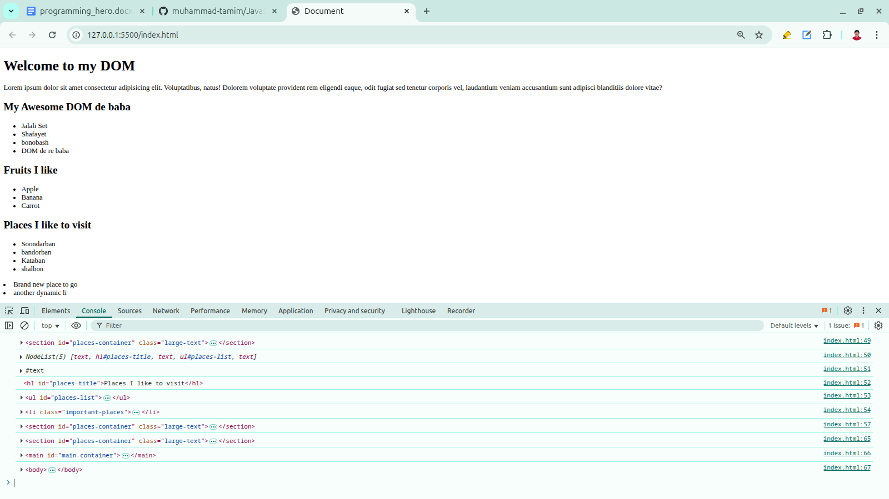
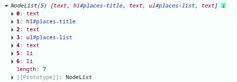
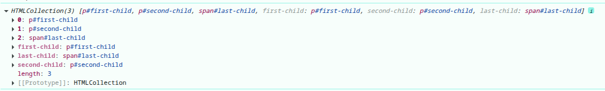
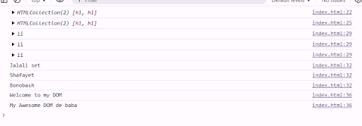
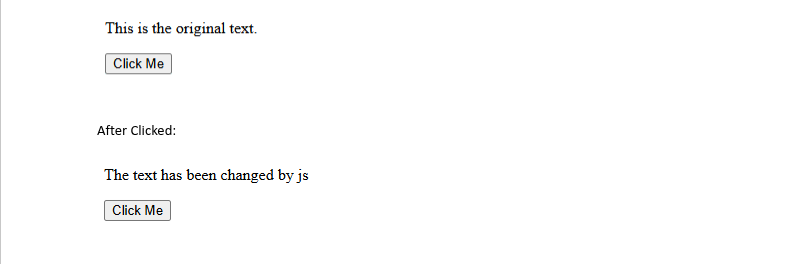
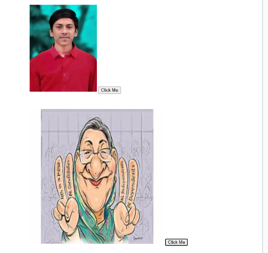
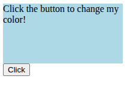
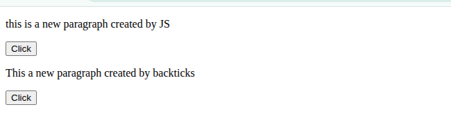

- object
  - Optional Properties
  - Readonly Properties
- array and tuple
- Type Alias, interface and intersection types
- Type Assertion
- Type Guards
  - Typeof
  - in Operator
  - Instanceof
  - Equality Narrowing
  - Truthiness Narrowing
  - Array.isArray()
  - User-defined type guards
- Generics
  - Constrain
    - with keyof 
  - conditional Types
  - Mapped Types
- utility types 
- OOP in TS:
  

## Data types:

### Primitive Types: 

In js we have 7 primitive data types: 

#### number

```ts
let age: number = 25;
let price: number = 99.99;
console.log(age, price); // 25 99.99
```

#### string

```ts
let name: string = "Tamim";
let greeting: string = `Hello, ${name}!`;
console.log(greeting); // Hello, Tamim!
```

#### bollean

```ts
let isAdmin: boolean = true;
let isLoggedIn: boolean = false;
console.log(isAdmin, isLoggedIn); // true false
```

#### null

```ts
let emptyValue: null = null;
console.log(emptyValue); // null
```

#### undefined

```ts
let notAssigned: undefined;
console.log(notAssigned); // undefined
```

#### symbol

```ts
const id: symbol = Symbol("id");
const id2: symbol = Symbol("id");
console.log(id === id2); // false, symbols are unique
```

#### bigint

```ts
let bigNumber: bigint = 123456789012345678901234567890n;
console.log(bigNumber); // 123456789012345678901234567890n
```

TypeScript also have this 7 primitive data types, but it's adds more extra 5 data types: 


#### any: 
any disables type checking and allows the variable to hold any type:

```ts
let data: any = 10;
data = "Hello";
data = "true"

let x; // any
let z = undefined // any

console.log(data) // true
```

####  unknown: 
Unknown (safer alternative to any), here you must perform type checking before using it:

```ts
let value: unknown = 30;

value = "Hello"

console.log(value.toUpperCase()) // value' is of type 'unknown'.
```  

```ts
let value: unknown = 30;

value = "Hello"

if (typeof value === "string") {
    console.log(value.toUpperCase()) // HELLO
}
```

```ts
const taka = (input: unknown) => {
    if (typeof input === "number") {
        console.log(input)
    }
    else if (typeof input === "string") {
        console.log(parseInt(input))
    }
    else {
        console.log("please add a valid input")
    }
}

taka(100) // 100
taka("100") // 100
taka(null) // please add a valid input
```

Note: any disables type checking. You can do anything with a variable of type any. TypeScript won’t stop you, even if the operation is unsafe.

```ts
let data: any = 10;
data = "Hello";
data = true;

console.log(data.toFixed()); // TypeError: data.toFixed is not a function
```

#### void: 
Represents no value, typically used as a return type for functions that don’t return anything:

```ts
function sayHello(): void {
    console.log("Hello")
}

sayHello() // Hello
```

#### never: 
represents a function that cannot produce a value at all aways throw an error or infinite loop:

```ts
function throwError(): never {
    throw new Error("Oops");
}

function infiniteLoop(): never {
    while(true) {}
}
```

####  litearl: 
Literal types allow you to assign exact values instead of general types.

```ts
let direction: "up" | "down" | "left" | "right";

direction = "up"
direction = "top" // Type '"top"' is not assignable to type '"up" | "down" | "left" | "right"'.

const user: {
    age: 18;
    name: string;
    location: string
} = {
    age: 18,
    name: "tamim",
    location: "barisal"
}
```


### Non-primitive types:

#### Arrays

```ts
let numbers: number[] = [1, 2, 3]
let names: string[] = ['a', 'b']

let mix: (string | number)[] = [1, "Hello"] // union array
```

#### Objects

```ts
let person: {
    name: string;
    age: number;
    isAdmin: boolean
} = {
    name: "Tamim",
    age: 20,
    isAdmin: true
}

// Optional Properties

let user: {
    name: string,
    age?: number
} = {
    name: "Tamim"
}

console.log(person)
console.log(user)
```

#### Classes: 
Classes are blueprints for creating objects with methods and properties.

```ts
class Person {
    name: string;
    age: number;

    constructor(name: string, age: number) {
        this.name = name;
        this.age = age;
    }

    greet() {
        console.log(`hi, i am ${this.name}`)
    }
}


const p1 = new Person("tamim", 20)
p1.greet() // hi, i am tamim
console.log(new Person("nasrin", 2)) // Person { name: 'nasrin', age: 2 }
```

#### Set: 
A collection of unique values: 

```ts 
const numbersSet = new Set<number>();
numbersSet.add(1)
numbersSet.add(2)
numbersSet.add(2)

console.log(numbersSet) // Set(2) { 1, 2 }
``` 

#### Map: 
A collection of key-value pairs, keys can be any type.

```ts
const userMap = new Map<number | boolean, string>();

userMap.set(1, "One")
userMap.set(true, "Yes")

console.log(userMap.get(1)) // One
console.log(userMap.get(true)) // Yes
```


#### Tuples: 
Tuples are fixed-length arrays with fixed types at each position.

```ts
let user: [string, number] = ['tamim', 20]

// let user2: number[] = [1, 2, 3, 4, 5] --> just a normal array
```

#### Enums: 
Enums allow you to define a set of named constant values. Means enums is a custom type that allows you to group related constant values under a single name. 

```ts
enum Days {
    saturday,
    sunday,
    monday
}

let dayName: Days = Days.saturday
console.log(dayName) // saturday


enum Direction {
    Up,
    Down,
    Left,
    Right
}

function movePlayer(dir: Direction) {
    if (dir === Direction.Up) console.log("Player moved up");
}

movePlayer(Direction.Up); // Player moved up
```

```ts
enum Category {
    Food = "food",
    Clothes = "clothes",
    Gadget = "gadget"
}

const product = {
    id: 101,
    type: Category.Gadget
}

console.log(product.type); // "gadget"
```

```ts
enum StatusCode {
    OK = 200,
    BAD_REQUEST = 400,
    NOT_FOUND = 404
}

function handleResponse(code: StatusCode) {
    if (code === StatusCode.OK) console.log("Success");
}
```


##### Enum Vs Union Types: 

Somethimes you don't need enums , a union might be better: 

```ts
enum Direction {
    Up,
    Down
}

type Direction = "Up" | "Down";
```

Note: when you use enum you must convert it to js file using type scipt compilier, you can use it by using 
`node test.ts` because TypeScript enum is not supported in strip-only mode

##### as const alternative of Enum:

```ts 
const UserRole = {
    Admin: "Admin",
    Editor: "Editor",
    Viewer: "Viewer"
} as const;

const canEdit = (role: keyof typeof UserRole) => {
    if (role === UserRole.Admin || role === UserRole.Editor) {
        return true
    }
    else {
        return false
    }
}

const isEditPermissable = canEdit(UserRole.Admin)
console.log(isEditPermissable) // true
```

```ts
const UserRole = {
    Admin: "ADMIN",
    Editor: "EDITOR",
    Viewer: "VIEWER"
} as const;

const canEdit = (role: (typeof UserRole)[keyof typeof UserRole]) => {
    if (role === UserRole.Admin || role === UserRole.Editor) {
        return true
    }
    else {
        return false
    }
}

const isEditPermissable = canEdit(UserRole.Admin)
console.log(isEditPermissable) // true
```

#### Interface: 
Defines the shape of an object: 

```ts
// without interface
const user2: {
    name: string;
    age: number;
    isAdmin?: boolean
} = {
    name: "nasrin",
    age: 11,
    isAdmin: false
}

// with interface
interface User {
    name: string;
    age: number;
    isAdmin?: boolean; // Optional
}

const user1: User = {
    name: "tamim",
    age: 20
}


console.log(user1)
console.log(user2)
```

```ts
// with type alias
type Friends = string[]
const friends: Friends = ["A", "B", "C"]

// with interface
interface iFriends {
    [index: number]: string
}
const friends2: iFriends = ["D", "E", "F"]
```

```ts
// with type alias
type Add = (num1: number, num2: number) => number
const add1: Add = (num1, num2) => num1 + num2

// with interface
interface iAdd {
    (number1: number, number2: number): number
}
const add2: iAdd = (number1, number2) => number1 + number2
```

Note: type interface and alias are same things, we can use one of them based on our preference. bur remember we can't use interface for primitive data types. 

Note: interface not suppoer intersection like this, so for this case we must use extends: 

```ts
type User = {
    name: string;
    age: number
}

type Role = {
    role: 'admin' | 'user'
}

type UserWithRole = User & Role

const user1: UserWithRole = {
    name: "x",
    age: 1,
    role: 'user'
}


interface User2 {
    name: string;
    age: number
}


interface IUserWithRole extends User2 {
    role: 'admin' | 'user'
}

const user2: IUserWithRole = {
    name: "x",
    age: 1,
    role: 'user'
}
```

#### Type Alias: 
Create a custom type name, can be primitive, union, intersection, object, etc.

```ts
// Without type alias
const user1: {
    id: number;
    name: string;
    isAdmin?: boolean; // optional property
} = {
    id: 1,
    name: "Tamim",
    isAdmin: true
}

// with type alias
type User = {
    id: number;
    name: string;
    isAdmin?: boolean; // optional property
};

const user2: User = {
    id: 2,
    name: "Nasrin"
};

const user3: User = {
    id: 3,
    name: "Kuddus"
};

// without type alias
const sum = (n1: number, n2: number): number => {
    return n1 + n2
}

// with type alias
type Add = (num1: number, num2: number) => number
const add: Add = (num1, num2) => {
    return num1 + num2
}
```


#### Union Type: 
A value can be one type OR another: 

```ts
let id: number | string;

id = 234
id = 'id123'


type Role = "admin" | "user"

const DashBoard = (role: Role) => {
    if (role === "admin") {
        console.log("admin dashboard")
    }
    else if (role === "user") {
        console.log("user dashboard")
    }
    else {
        console.log("Please login")
    }
}
```

#### Intersection Type:

Combines multiple types; value must satisfy all types.

```ts
type Name = { name: string }
type Age = { age: number }

type Person = Name & Age;

const p1: Person = {
    name: "tamim",
    age: 20
}
```


## Type Assertion: 

Sometimes TypeScript doesn’t know the exact type and infers too loosely (like unknown, any, or union types). Type assertion lets you override TypeScript's type and force a value to be treated as a specific type. we used type assertion for third party packages also where they dont have type support.

Two Ways to write type assertion: 

- as syntax(recomended):

```ts
let data: unknown = "TypeScript";
let str = data as string;
console.log(str.toUpperCase());

type User = {
    name: string;
    age: number;
};

let data = {} as User;
data.name = "Tamim";
data.age = 20;

let anything: any;

anything = 22.000;

(anything as number).toFixed(1)

const taka = (input: number | string): number | string | undefined => {
    if (typeof input === "number") {
        return input
    }
    else if (typeof input === "string") {
        return parseInt(input)
    }
}

const result1 = taka(100) as number
const result2 = taka('100') as number
console.log(result1, result1) // 100 100
```

- angel bracket syntax(<>)

Note: This syntax is not allowed in jsx(react) files

```ts
let data: unknown = "TypeScript";
let str = <string>data;
console.log(str.toUpperCase());
```

## Generics:
Generics allow you to write reusable code that works with multiple types while keeping strong type safety.

```ts
type GenericArray<T> = Array<T>

// const strArray: string[] = ['a', 'b', 'c']
const strArray: GenericArray<string> = ['a', 'b', 'c']

// const numArray: number[] = [1, 2, 3]
const numArray: GenericArray<number> = [1, 2, 3]

// const boolArray: boolean[] = [true, false, true]
const boolArray: GenericArray<boolean> = [true, false, true]
```

```ts
type Coordinates<X, Y> = [X, Y]

const coordinates1: Coordinates<number, number> = [20, 30]
const coordinates2: Coordinates<string, string> = ['20', '30']
```

```ts
// type GenericArray<T> = Array<T>

// const userList: GenericArray<{ name: string, age: number }> = [
//     {
//         name: 'x',
//         age: 20
//     },
//     {
//         name: 'y',
//         age: 24,
//     },
//     {
//         name: 'z',
//         age: 30
//     }
// ]


type GenericArray<T> = Array<T>

type User = {
    name: string,
    age: number
}

const userList: GenericArray<User> = [
    {
        name: 'x',
        age: 20
    },
    {
        name: 'y',
        age: 24,
    },
    {
        name: 'z',
        age: 30
    }
]
```

```ts
interface Developer<T, X = null> {
    name: string;
    salary: number;
    device: {
        brand: string;
        model: string;
        releasedYear: string
    };
    smartWatch: T;
    bike?: X
}

interface PoorWatch {
    heartRate: string;
    stopWatch: boolean
}

const poorDeveloper: Developer<PoorWatch> = {
    name: 'x',
    salary: 20,
    device: {
        brand: 'oppo',
        model: "a5s",
        releasedYear: '2005'
    },
    smartWatch: {
        heartRate: '56',
        stopWatch: true
    },
    bike: null
}

const richDeveloper: Developer<{
    heartRate: string;
    stopWatch: boolean;
    calling: boolean;
    ai: boolean
}, { brand: "yamaha" }> = {
    name: 'x',
    salary: 20,
    device: {
        brand: 'oppo',
        model: "a5s",
        releasedYear: '2005'
    },
    smartWatch: {
        heartRate: '56',
        stopWatch: true,
        calling: true,
        ai: true
    }
}
```

```ts
// const createArrayWithString = (value: string) => [value]
// const createArrayWithNumber = (value: number) => [value]
// const createArrayWithUserObj = (value: { id: number, name: string }) => [value]

// const arrString = createArrayWithString('Apple')
// const arrNumber = createArrayWithNumber(10)
// const arrObj = createArrayWithUserObj({ id: 3, name: "x" })

const createArrayWithGeneric = <T>(value: T) => [value]

const arrString = createArrayWithGeneric('Apple')
const arrNumber = createArrayWithGeneric(10)
const arrObj = createArrayWithGeneric({ id: 3, name: "x" })


const createArrayWithTuple = (param1: string, param2: string) => [param1, param2]

const createArrayTupleWithGeneric = <X, Y>(param1: X, param2: Y) => [param1, param2]
const res1 = createArrayTupleWithGeneric("tamim", false)
const res2 = createArrayTupleWithGeneric(222, { name: "tamim" })


const addStudentToCourse = <T>(studentInfo: T) => {
    return { course: "Next Level", ...studentInfo }
};

const student1 = {
    id: 123,
    name: "tamim",
    hasPen: true
}

const student2 = {
    id: 32434,
    name: "zunker",
    hasCar: true,
    isMarried: true
}

const result = addStudentToCourse(student1)
```

### Constrain:

Generic constraints allow you to restrict what types are allowed in a generic. we do this using the keyword extends.

Why Constrain: Because sometimes you want a function to be flexible, but not too flexible.

```ts
function printName<T extends { name: string }>(person: T) {
    console.log(person.name)
}

printName({ name: "tamim", age: 20 }) // Tamim
printName({ age: 20 }) // Object literal may only specify known properties, and 'age' does not exist in type '{ name: string; }'.
```

#### Using Constrain with primitive types: 

```ts
function toArray<T extends string | number>(value: T): T[] {
    return [value]
}

toArray("Hello")
toArray(20)
toArray(true) //  Argument of type 'boolean' is not assignable to parameter of type 'string | number'.
```

#### Constraint With Arrays:

```ts
function getFirst<T extends any[]>(arr: T) {
    return arr[0]
}

getFirst([1, 2, 3])
getFirst(['1', '2'])
getFirst("Hello") // Argument of type 'string' is not assignable to parameter of type 'any[]'.
```

#### Constraint With Interfaces & Type Aliases

```ts
interface Person {
    name: string;
}

function greet<T extends Person>(value: T) {
    console.log("Hello", value.name);
}

greet({ name: "Tamim", id: 1 });   // ok
greet({ id: 1 });                  // ❌ error
```

```ts

type student = { id: number, name: string }

const addStudentToCourse = <T extends student>(studentInfo: T) => {
    return {
        course: "Next Lavel",
        ...studentInfo
    }
}

const student1 = {
    id: 123,
    name: "tamim",
    hasPen: true
}

const student2 = {
    name: "zunker",
    hasCar: true,
    isMarried: true
}

const result1 = addStudentToCourse(student1)
const result2 = addStudentToCourse(student2) // error
```

#### Constraint With keyof (Important!):

```ts
function getProperty<T, K extends keyof T>(obj: T, key: K) {
    return obj[key];
}

const user = {
    name: "Tamim",
    age: 20
};

getProperty(user, "name"); // ok
getProperty(user, "age");  // ok
getProperty(user, "location");  // Argument of type '"location"' is not assignable to parameter of type '"name" | "age"'.
```

```ts
type User = {
    id: number,
    name: string,
    address: {
        city: string
    }
}

const user: User = {
    id: 222,
    name: "mezba",
    address: {
        city: "Barisal"
    }
}

// const myId = user["id"]
// const myName = user["name"]
// const address = user["address"]
// console.log(myId, myName, address) // 222 mezba { city: 'Barisal' }

const getPropertyFromObj = <X,>(obj: X, key: keyof X) => {
    return obj[key]
}

const result = getPropertyFromObj(user, "name")
console.log(result) // mezba

const product = {
    brand: "apple"
}
const student = {
    id: 123,
    class: 5
}

const result2 = getPropertyFromObj(product, "brand")
const result3 = getPropertyFromObj(student, "id")

console.log(result2, result3) // apple 123
```


### Conditionl Types: 

Conditional types allow you to choose a type based on a condition, similar to an if/else, but inside the type system.

syntax: 

```
T extends U ? X : Y
```
- If T extends (matches) U, return X else Y

```ts
type A = null;
type B = undefined

type c = A extends number ? true : B extends undefined ? true : false
```
```ts
type RichPeopleVehicle = {
    bike: string;
    car: string;
    ship: string;
}

type CheckVehicle<T> = T extends keyof RichPeopleVehicle ? true : false

type HasBike = CheckVehicle<"bike">
```

```ts
type IsNumber<T> = T extends number ? "YES" : "NO";

type A = IsNumber<number>;   // "YES"
type B = IsNumber<string>;   // "NO"
```

### Mapped Types: 
Mapped types allow you to create new types by transforming existing types. 

```ts
type Person = {
    name: string;
    age: number;
};

type CopyPerson = {
    [K in keyof Person]: Person[K];
};


type AreaOfNum = {
    height: number;
    width: number;
}

// type AreaOfString = {
//     height: string;
//     width: string;
// }

type Area<T> = {
    [key in keyof T]: T[key]
}

const area1: Area<{ height: string; width: number }> = {
    height: '50',
    width: 40
}
```

## Utility Types: 
TypeScript provides several built-in utility types that help you transform existing types and create new types from them.

Utility types are extremely important because they save you time, reduce code duplication, and let you write cleaner, more flexible TypeScript.

- Partial<> : Makes all Properties of a type optional: 

```ts
type User = {
    name: string;
    age: number;
}

type PartialUser = Partial<User>;

const user: PartialUser = {
    name: "Tamim" // age is optional
}
```

- Required<>: Opposite of Partial — makes all properties required.

```ts
type User = {
    name?: string;
    age?: number;
}

type RequiredUser = Required<User>;

const user: RequiredUser = {
    name: "Tamim",
    age: 20
}
```
- Readonly<>: Makes all properties immutable (cannot be changed):

```ts
type User = {
    name: string;
    age: number;
}

const user: Readonly<User> = {
    name: "Tamim",
    age: 20
};

// or
const user2 = Readonly<user>

user.age = 21; // ❌ Error: cannot modify readonly property
```

- Record <K, T>: Used to create an object with specific key type K and value type T:

```ts
type Scores = Record<string, number>;

const studentScores: Scores = {
    Tamim: 34,
    John: 40,
}

// manual version of recoard
type Scores = {
    [key: string]: number;
};

const studentScores: Scores = {
    Tamim: 34,
    John: 40,
    Math: 100,
};
```

- Pick<>: Selects specific properties from a type:

```ts
type User = {
    name: string;
    age: number;
    email: string;
}

type UserPreview = Pick<User, "name" | "email">;

const data: UserPreview = {
    name: "Tamim",
    email: "t@gmail.com"
}
```

- Omit<>: Opposite of Pick — removes specific properties:

```ts
type User = {
    name: string;
    age: number;
    email: string;
}

type WithoutEmail = Omit<User, "email">;

const user: WithoutEmail = {
    name: "Tamim",
    age: 20
}
```

- Exclude<>: Removes types from a union:

```ts
type Letters = "a" | "b" | "c";
type RemoveB = Exclude<Letters, "b">; 
// "a" | "c"
```

- Extract<>: Opposite of Exclude, keeps only matching types: 

```ts
type Letters = "a" | "b" | "c";
type OnlyB = Extract<Letters, "b" | "d">;
// "b"
```

- NonNullable<>: Removes null and undefined:

```ts
type Maybe = string | null | undefined;

type Clean = NonNullable<Maybe>;
// string
```

- ReadOnlyArray<>: Cereates a readonly array: 

```ts
const numbers: ReadonlyArray<number> = [1, 2, 3];

numbers.push(4); // ❌ Error
numbers[0] = 10; // ❌ Error
```

## OOP in TypeScript: 

### How to create a class: 

```ts
class Animal {
    name: string;
    species: string;
    sound: string;

    constructor(name: string, species: string, sound: string) {
        this.name = name
        this.species = species
        this.sound = sound
    }

    makeSound() {
        console.log(`The ${this.species} is making sound`)
    }
}

const dog = new Animal("Tommy", "dog", "ghaw")
console.log(dog) // Animal { name: 'Tommy', species: 'dog', sound: 'ghaw' }
console.log(dog.name) // Tommy
dog.makeSound()

const cat = new Animal("nany", "cat", "miaw")
console.log(cat) // Animal { name: 'nany', species: 'cat', sound: 'miaw' }
console.log(cat.name) // nany
```

Or using parameter properties: 

```ts
class Animal {

    constructor(public name: string, public species: string, public sound: string) { }

    makeSound() {
        console.log(`The ${this.species} is making sound`)
    }
}

const dog = new Animal("Tommy", "dog", "ghaw")
console.log(dog) // Animal { name: 'Tommy', species: 'dog', sound: 'ghaw' }
console.log(dog.name) // Tommy
dog.makeSound()

const cat = new Animal("nany", "cat", "miaw")
console.log(cat) // Animal { name: 'nany', species: 'cat', sound: 'miaw' }
console.log(cat.name) // nany
```

Note: for now you have to compile this code using TSC

### Access Modifiers: 

Access modifiers control visibility of class properties and methods. They determine where a property or method can be accessed.

#### public (default):
Accessible everywhere: inside class, subclasses, and outside

```ts
class Person {
    public name: string;      // public (default)
    public age: number;       // public

    constructor(name: string, age: number) {
        this.name = name;
        this.age = age;
    }

    public introduce() {
        console.log(`Hi, I am ${this.name} and I am ${this.age} years old.`);
    }
}

const p = new Person("Tamim", 20);

console.log(p.name);     // ✔ Accessible
console.log(p.age);      // ✔ Accessible
p.introduce();           // ✔ Accessible
```

#### protected: 

Accessible inside the class and subclasses, Cannot be accessed outside the class

```ts
class Animal {
    protected type: string;

    constructor(type: string) {
        this.type = type;
    }

    protected makeSound() {
        console.log(`${this.type} makes a sound.`);
    }
}

class Dog extends Animal {
    public bark() {
        console.log(`Barking as a ${this.type}`);   // ✔ allowed (protected)
        this.makeSound();                           // ✔ allowed (protected)
    }
}

const d = new Dog("Dog");

d.bark();          // ✔ allowed
d.type;            // ❌ ERROR — protected
d.makeSound();     // ❌ ERROR — protected
```

#### Private: 

Accessible only inside the class, Cannot be accessed outside or by subclasses

```ts
class BankAccount {
    private balance: number;

    constructor(initialBalance: number) {
        this.balance = initialBalance;
    }

    public deposit(amount: number) {
        this.balance += amount;
    }

    public getBalance() {
        return this.balance;    // ✔ Allowed
    }
}

const acc = new BankAccount(1000);

acc.deposit(500);         // ✔ Allowed

console.log(acc.getBalance());  // ✔ Allowed

console.log(acc.balance);   // ❌ ERROR — balance is private
```

#### All in one mixed example

```ts
class BackAccount {
    readonly userId: number;
    protected userName: string;
    private userBalance: number;

    constructor(userId: number, userName: string, userBalance: number) {
        this.userId = userId;
        this.userName = userName;
        this.userBalance = userBalance;
    }
    addBalance(balance: number) {
        this.userBalance += balance
    }
}

class StudentBankAccount extends BackAccount {
    test() {
        // console.log(this.balance) // Property 'balance' does not exist on type 'StydentBankAccount'.
        console.log(this.userName)
    }
}

const myAccount = new BackAccount(111, 'Tamim', 100);
myAccount.addBalance(100)
console.log(myAccount)
```

### Getter and Setter: 
- A getter is used to read a private/protected property.
- A setter is used to update/change a private/protected property.

```ts
class BackAccount {
    readonly userId: number;
    protected userName: string;
    private _userBalance: number;

    constructor(userId: number, userName: string, userBalance: number) {
        this.userId = userId;
        this.userName = userName;
        this._userBalance = userBalance;
    }

    // setter
    // addBalance(balance: number) {
    //     this._userBalance += balance
    // }
    set addBalance(balance: number) {
        this._userBalance += balance
    }

    // getter
    // getBalance() {
    //     return this._userBalance
    // }
    get getBalance() {
        return this._userBalance
    }
}


const myAccount = new BackAccount(111, 'Tamim', 100);
// myAccount.addBalance(100)
// console.log(myAccount.getBalance())

// setter
myAccount.addBalance = 100

// getter
console.log(myAccount.getBalance)
```

```ts
class Product {
    private _price: number;

    constructor(price: number) {
        this._price = price;
    }

    get price() {
        return this._price;
    }

    set price(value: number) {
        if (value <= 0) {
            throw new Error("Price must be greater than 0");
        }
        this._price = value;
    }
}

const p = new Product(100);
console.log(p.price);  // ✔ 100

p.price = 150;  
console.log(p.price);  // ✔ 150

p.price = 0;           // ❌ ERROR
```

### Static: 

In TypeScript, the static keyword is used to create class-level properties and methods. Normally, when you create a class, each object (instance) gets its own copy of properties and methods. But static properties/methods belong to the class itself, not to the object.


```ts
// Without static
class Counter {
    count: number = 0;

    increment() {
        return this.count += 1
    }
    decrement() {
        return this.count -= 1
    }
}

const instance1 = new Counter()
console.log(instance1.increment()) // 1 
console.log(instance1.increment()) // 2
console.log(instance1.increment()) // 3

const instance2 = new Counter()
console.log(instance2.increment()) // 1
console.log(instance2.increment()) // 2
```

```ts
// with static
class Counter {
    static count: number = 0;

    static increment() {
        return Counter.count += 1
    }
    static decrement() {
        return Counter.count -= 1
    }
}

console.log(Counter.increment()) // 1 
console.log(Counter.increment()) // 2
console.log(Counter.increment()) // 3
console.log(Counter.increment()) // 4
console.log(Counter.increment()) // 5
```

### Inharitance(1st pillr of OOP):

Inheritance allows one class to inherit properties and methods from another class.

```ts
class Parent {
    name: string;
    age: number;
    address: string;

    constructor(name: string, age: number, address: string) {
        this.name = name;
        this.age = age;
        this.address = address
    }

    getSleep(hours: number) {
        console.log(`${this.name} sleep ${hours} a day`)
    }
}


class Student extends Parent { }

class Teacher extends Parent {
    designation: string; // own properties

    constructor(name: string, age: number, address: string, designation: string) {
        super(name, age, address)
        this.designation = designation
    }

    // own methods
    takeClass(numberOfClass: number) {
        console.log(`${this.name} ${numberOfClass} hours class nan`)
    }
}

const student1 = new Student("x", 20, "barisal")
student1.getSleep(15)

const teacher1 = new Teacher("y", 20, "dhaka", "Senior Teacher")
teacher1.takeClass(4)
```
### Polymorphism(2nd pillar of OOP)
Polymorphism means one method can have different behaviors depending on the object that calls it.

```ts
class Person {
    getSleep() {
        console.log(`I am a normal person, I sleep for 8 hours`);
    }
}

class Student extends Person {
    getSleep() {
        console.log(`i am a student, i sleep 7 hours`);
    }
}

class NextLevelDeveloper extends Person {
    getSleep() {
        console.log(`I am a next level developer. I sleep for 6 hours`)
    }
}

const getSleepingHours = (param: Person) => {
    param.getSleep()
}

const person1 = new Person()
const person2 = new Student()
const person3 = new NextLevelDeveloper()

getSleepingHours(person1)
getSleepingHours(person2)
getSleepingHours(person3) 
```

```ts
class Shape {
    getArea(): number {
        return 0;
    }
}

class Circle extends Shape {
    radius: number;
    constructor(radius: number) {
        super()
        this.radius = radius
    }

    getArea(): number {
        return Math.PI * this.radius * this.radius
    }
}

class Rectangle extends Shape {
    height: number;
    width: number;
    constructor(height: number, width: number) {
        super()
        this.height = height
        this.width = width
    }
    getArea(): number {
        return this.height * this.width
    }
}

const getArea = (param: Shape) => {
    console.log(param.getArea())
}

const shape1 = new Shape()
const shape2 = new Circle(10)
const shape3 = new Rectangle(10, 20)

getArea(shape1)
getArea(shape2)
getArea(shape3)
```

```ts
class Animal {
    speak() {
        console.log("Animal makes a sound");
    }
}

class Dog extends Animal {
    speak() {
        console.log("Dog barks");
    }
}

class Cat extends Animal {
    speak() {
        console.log("Cat meows");
    }
}

function makeAnimalSpeak(a: Animal) {
    a.speak();
}

makeAnimalSpeak(new Dog()); // "Dog barks"
makeAnimalSpeak(new Cat()); // "Cat meows"
```

### Abstruction(3rd piller of OOP)

Abstraction means showing only the important information and hiding unnecessary details using:
- abstract classes
- abstract methods

```ts
// using interface
interface MediaPlayer {
    play(): void
    pause(): void
    stop(): void
}

class MusicPlayer implements MediaPlayer {
    play() {
        console.log("Playing Music....")
    }
    pause() {
        console.log("Music paused....")
    }
    stop() {
        console.log("Music Stopped...")
    }
}

const customPlayer = new MusicPlayer()
customPlayer.play()
```

```ts
// using abstract class and methods
abstract class MediaPlayer {
    abstract play(): void
    abstract pause(): void
    abstract stop(): void
}

class MusicPlayer extends MediaPlayer {
    play() {
        console.log("Playing Music....")
    }
    pause() {
        console.log("Music paused....")
    }
    stop() {
        console.log("Music Stopped...")
    }
}

const customPlayer = new MusicPlayer()
customPlayer.play()
```

```ts
abstract class Vehicle {
    abstract start(): void; // abstract method (no body)
    
    stop() {
        console.log("Vehicle stopped.");
    }
}

class Car extends Vehicle {
    start() {
        console.log("Car engine started.");
    }
}

const c = new Car();
c.start(); // ✔
c.stop();  // ✔
```

### Encapsulation(4th piller of OOP)

Encapsulation means wrapping data (properties) and behavior (methods) inside a class and protecting them using access modifiers.

```ts
class BackAccount {
    readonly userId: number;
    protected userName: string;
    private userBalance: number;

    constructor(userId: number, userName: string, userBalance: number) {
        this.userId = userId;
        this.userName = userName;
        this.userBalance = userBalance;
    }
    addBalance(balance: number) {
        this.userBalance += balance
    }
}

class StudentBankAccount extends BackAccount {
    test() {
        // console.log(this.balance) // Property 'balance' does not exist on type 'StydentBankAccount'.
        console.log(this.userName)
    }
}

const myAccount = new BackAccount(111, 'Tamim', 100);
myAccount.addBalance(100)
console.log(myAccount)
```

```ts
class BankAccount {
    private _balance: number = 0;

    deposit(amount: number) {
        if (amount <= 0) {
            throw new Error("Deposit must be positive");
        }
        this._balance += amount;
    }

    withdraw(amount: number) {
        if (amount > this._balance) {
            throw new Error("Insufficient balance");
        }
        this._balance -= amount;
    }

    get balance() {
        return this._balance; // getter
    }
}

const acc = new BankAccount();
acc.deposit(1000);
acc.withdraw(300);

console.log(acc.balance); // ✔ 700
// acc._balance = 5000;   // ❌ ERROR (private)
```

## Type Guards:

Type guards help TypeScript narrow a variable’s type at runtime.

When a variable can have multiple possible types (union type), TypeScript needs extra information to know what operations are safe. A type guard tells TypeScript At this point, the value is this type.

### typeof type guards:

```ts
function printValue(v: string | number) {
    if (typeof v === "string") {
        console.log(v.toUpperCase()); // string methods allowed
    } else {
        console.log(v.toFixed(2)); // number methods allowed
    }
}
```

```ts
type NumOrStr = number | string

const add = (num1: NumOrStr, num2: NumOrStr) => {

    if (typeof num1 === 'number' && typeof num2 === 'number') {
        return num1 + num2
    }
    else {
        return num1.toString() + num2.toString()
    }

}

const result1 = add(2, 2)
const result2 = add("2", 2)

console.log(result1, result2)
```

### in Operator Type Guard:

Checks if a property exists in the object: 

```ts
type Admin = { username: string; isAdmin: true };
type User  = { username: string };

function checkRole(person: Admin | User) {
    if ("isAdmin" in person) {
        console.log("Admin user");
    } else {
        console.log("Normal user");
    }
}
```

```ts
type NormalUser = {
    name: string;
}

type AdminUser = {
    name: string;
    role: "admin";
}

const getUserInfo = (user: NormalUser | AdminUser) => {

    if ('role' in user) {
        console.log(user.name, user.role)
    }
    else {
        console.log(user.name)
    }

}

getUserInfo({ name: "Normal" })
```


### Instanceof Type Guards: 

Used for classes.

```ts
class Person {
    name: string;

    constructor(name: string) {
        this.name = name
    }
    getSleep(hours: number) {
        console.log(`he sleep ${hours} daily`)
    }
}

class Student extends Person {
    constructor(name: string) {
        super(name)
    }

    doStudy(hours: number) {
        console.log(`he study ${hours} daily`)
    }
}

class Teacher extends Person {
    constructor(name: string) {
        super(name)
    }

    takeClass(hours: number) {
        console.log(`i take ${hours} of class`)
    }
}

const isStudent = (user: Person) => {
    return user instanceof Student
}
const isTeacher = (user: Person) => {
    return user instanceof Teacher
}

const getUserInfo = (user: Person) => {
    if (isStudent(user)) {
        user.doStudy(10)
    }
    else if (isTeacher(user)) {
        user.takeClass(5)
    }
    else {
        user.getSleep(20)
    }
}

const person1 = new Person("x miya")
const student1 = new Student("student kamrul")
const Teacher1 = new Teacher("teacher lotip")

getUserInfo(person1)
getUserInfo(student1)
getUserInfo(Teacher1)
```

### Equality Narrowing:

Using ===, !== to narrow types.

```ts
function compare(a: string | number, b: string | number) {
    if (a === b) {
        console.log("Same values");
    }
}
```

### Truthiness Narrowing:

TypeScript narrows based on truthy/falsy values.

```ts
function print(msg?: string) {
    if (msg) {
        console.log(msg.toUpperCase());
    }
}
```

### Array.isArray() Type Guard:

```ts
function process(x: string | string[]) {
    if (Array.isArray(x)) {
        console.log("Array:", x.join(", "));
    } else {
        console.log("String:", x.toUpperCase());
    }
}
```


## part 2: DOM
<!-- Part 2 -->
<h1 id="part-2-DOM" align="center">Part 2: DOM</h1>

<h2 id="dom-fundamentals" align="center">Introduction</h2>

<h3 id="what-is-dom">What is DOM:</h3>
<p>DOM (Document Object Model) is a programming interface provided by the browser that represents an HTML as a <a href="#hierarchical">hierarchical</a> tree structure where each element is a node. It allows JavaScript to access, manipulate, and update the html elements, structure, and style of a web page dynamically.</p>


<h3 id="dom-tree-structure">DOM Tree Structure:</h3>
<p>The DOM represents your document as a tree structure. Every HTML element becomes a "node" in this tree.</p>


<h4>Note:</h4>
<ul>
<li>Node: The generic term for any item in the DOM tree</li>
<li>Element Node: A specific type of node that represents HTML tags</li>
</ul>


<h3 id="parent-child-and-sibling-relationships">Parent, Child, and Sibling Relationships:</h3>


| 🔢 Category  | 🏷️ Property               | 🔍 Description                                                         |
| ----------- | ------------------------ | --------------------------------------------------------------------- |
| **Parent**  | `parentNode`             | Returns the parent **node** of the current node                       |
|             | `parentElement`          | Returns the parent **element**, or `null` if parent is not an element |
| **Child**   | `children`               | Returns a list of child **elements only**                             |
|             | `childNodes`             | Returns all child **nodes** (elements, text, comments, etc.)          |
|             | `firstElementChild`      | Returns the **first child element**                                   |
|             | `firstChild`             | Returns the **first child node** (could be text)                      |
|             | `lastElementChild`       | Returns the **last child element**                                    |
|             | `lastChild`              | Returns the **last child node** (could be text)                       |
| **Sibling** | `nextElementSibling`     | Returns the **next sibling element**                                  |
|             | `nextSibling`            | Returns the **next sibling node** (can be text)                       |
|             | `previousElementSibling` | Returns the **previous sibling element**                              |
|             | `previousSibling`        | Returns the **previous sibling node** (can be text)                   |


<h4>Example 1:</h4>

```html
<!DOCTYPE html>
<html lang="en">

<head>
    <meta charset="UTF-8">
    <meta name="viewport" content="width=device-width, initial-scale=1.0">
    <title>Document Object Model</title>
</head>

<body>
    <div id="parent">
        <p id="first-child">First paragraph</p>
        <p id="second-child">Second paragraph</p>
        <span id="last-child">Span element</span>
    </div>

    <script>
        const parent = document.getElementById('parent');
        const firstChild = document.getElementById('first-child');
        const secondChild = document.getElementById('second-child');
        const lastChild = document.getElementById('last-child');

        // Parent relationships
        console.log(firstChild.parentNode);        // The div element
        console.log(firstChild.parentElement);     // Also the div element

        // Child relationships
        console.log(parent.children);              // All child elements (gives a HTML Collections)
        console.log(parent.firstElementChild);     // First p element
        console.log(parent.lastElementChild);      // The span element

        // Sibling relationships
        console.log(firstChild.nextElementSibling);    // Second p element
        console.log(firstChild.previousElementSibling); // null (no previous sibling)
        console.log(secondChild.nextElementSibling);   // Span element
        console.log(secondChild.previousElementSibling); // First p element
    </script>
</body>

</html>
```


<p>In the above example:</p>
<ul>
<li>The div is the parent of all three elements inside it</li>
<li>The p and span elements are children of the div</li>
<li>The two p elements and the span are siblings to each other</li>
</ul>

<h4>Example 2:</h4>

```html
<!DOCTYPE html>
<html lang="en">

<head>
    <meta charset="UTF-8">
    <meta name="viewport" content="width=device-width, initial-scale=1.0">
    <title>Document</title>
</head>

<body>
    <header>
        <h1>Welcome to my DOM</h1>
        <p>Lorem ipsum dolor sit imamet consectetur adipisicing elit. Voluptatibus, natus! Dolorem voluptate provident rem
            eligendi eaque, odit fugiat sed tenetur corporis vel, laudantium veniam accusantium sunt adipisci blanditiis
            dolore vitae?</p>
    </header>
    <main id="main-container">
        <section>
            <h1>My Awesome DOM de baba</h1>
            <ul>
                <li>Jalali Set</li>
                <li>Shafayet</li>
                <li>bonobash</li>
                <li>DOM de re baba</li>
            </ul>
        </section>
        <section class="fruits-container">
            <h1 id="fruits-title" class="some-class random-class blue-bg">Fruits I like</h1>
            <ul>
                <li>Apple</li>
                <li>Banana</li>
                <li>Carrot</li>
            </ul>
        </section>
        <section id="places-container" class="large-text">
            <h1 id="places-title">Places I like to visit</h1>
            <ul id="places-list">
                <li class="important-places">Soondarban</li>
                <li class="important-places">bandorban</li>
                <li class="important-places">Kataban</li>
                <li class="other-place">shalbon</li>
            </ul>
        </section>
    </main>


    <script>
        const placesContainer = document.getElementById("places-container");
        console.log(placesContainer);
        console.log(placesContainer.childNodes);
        console.log(placesContainer.firstChild);
        console.log(placesContainer.childNodes[1]);
        console.log(placesContainer.childNodes[3]);
        console.log(placesContainer.childNodes[3].childNodes[5]);

        const placesUL = document.querySelector("#places-container");
        console.log(placesUL);
        const newLI = document.createElement("li");
        newLI.innerText = "Brand new place to go";
        placesUL.appendChild(newLI);
        const newLI2 = document.createElement("li");
        newLI2.innerText = "another dynamic li";
        placesUL.appendChild(newLI2);

        console.log(placesUL);
        console.log(placesUL.parentNode);
        console.log(placesUL.parentNode.parentNode);
    </script>
</body>

</html>
```


<h3 id="dom-collection">DOM Collection:</h3>
<p>A DOM Collection is a special array-like object that holds a group of nodes or elements from the Document Object Model (DOM).
DOM collection is array like means you can access items with indexes, and can use .length properties but since it's not actually array so, you can't use map(), filter(), find() etc, unless converted.</p>

<h4>Common DOM Collection Types:</h4>

| Collection       | Description                                                                  |
| ---------------- | ---------------------------------------------------------------------------- |
| `NodeList`       | Is a collection of nodes (can include elements, text nodes, comments, etc.). |
| `HTMLCollection` | An HTMLCollection contains only HTML elements (not text nodes or comments).  |
| `childNodes`     | NodeList of **all types** of child nodes                                     |
| `NamedNodeMap`   | Collection of attribute nodes of an element                                  |
| `DOMTokenList`   | Collection of classes                                                        |




  

<h3 id="document-object">Document Object:</h3>
<p>The document object is your entry point to the entire DOM. It represents the whole HTML document and provides methods to access and manipulate everything within it.</p>

```html
<!DOCTYPE html>
<html lang="en">

<head>
    <meta charset="UTF-8">
    <meta name="viewport" content="width=device-width, initial-scale=1.0">
    <title>Document Object Model</title>
</head>

<body>
    <h1>Welcome to My Page</h1>
    <p>This is a simple HTML document.</p>

    <script>
        // Document object properties
        console.log(document);                  // Document object
        console.log(document.documentElement);  // <html> element
        console.log(document.head);             // <head> element  
        console.log(document.body);             // <body> element
        console.log(document.title);            // Page title
        console.log(document.URL);              // Current URL
        console.log(document.domain);           // Domain name
        console.log(document.forms);            // All forms in the document
        console.log(document.images);           // All images in the document
        console.log(document.links);            // All links in the document
        console.log(document.scripts);          // All scripts in the document
    </script>
</body>

</html>
```


<h3 id="dom-vs-bom">DOM VS BOM:</h3>
<table>
<tr>
<th>DOM</th>
<th>BOM</th>
</tr>
<tr>
<td>Controls the document content</td>
<td>Controls browser features outside the document</td>
</tr>
<tr>
<td>Standardized (don't varies between browsers)</td>
<td>Not standardized (varies between browsers)</td>
</tr>
<tr>
<td>Accessed Using document object</td>
<td>Accessed Using window object</td>
</tr>
</table>

```html
<!DOCTYPE html>
<html lang="en">

<head>
    <meta charset="UTF-8">
    <meta name="viewport" content="width=device-width, initial-scale=1.0">
    <title>Document Object Model</title>
</head>

<body>
    <h1 id="myHeading"></h1>

    <script>
        // DOM
        const heading = document.getElementById("myHeading");
        heading.innerText = "Hello from DOM!";

        // BOM
        const url = window.location.href;
        console.log("Current URL:", url);

        window.alert("Welcome to BOM");
    </script>
</body>

</html>
```


      

<h3>Q&A:</h3>
<ul>
  <li>
    <p><strong>hierarchical: </strong>Hierarchical means things are arranged like a tree, where:</p>
    <ul>
      <li>One item is at the top (called the root).</li>
      <li>Other items are under it, like branches and sub-branches.</li>
      <li>Each item can have children and a parent.</li>
    </ul>
  </li>
</ul>
<hr>


<h2 id="dom-traversing" align="center">DOM Traversing</h2>
<p>DOM traversing means navigating the DOM tree from one node to another using relationships like parent, child, and sibling.</p>

<p>It allows you to:</p>

<ul>
<li>Find elements relative to a selected element</li>
<li>Move between nodes (parents, children, siblings)</li>
<li>Manipulate structure dynamically (add/remove/update nodes)</li>
</ul>


<h3 id="parentNode-vs-parentElement">parentNode vs parentElement:</h3>
<p>Both parentNode and parentElement are used to access the parent of a node in the DOM, But:</p>
<ul>
<li>parentNode returns any type of parent node.</li>
<li>parentElement returns only if the parent is an Element node</li>
</ul>


```html
<!DOCTYPE html>
<html lang="en">

<head>
    <meta charset="UTF-8">
    <meta name="viewport" content="width=device-width, initial-scale=1.0">
    <title>DOM Traversing</title>
</head>

<body>

    <div id="container">
        <p id="child">Hello</p>
    </div>


    <script>
        const child = document.getElementById("child");

        console.log(child.parentNode); // <div id="container">...</div>
        console.log(child.parentElement); // <div id="container">...</div>

        console.log(document.body.parentNode); // <html>...</html>
        console.log(document.body.parentElement); // <html>...</html>

        console.log(document.documentElement.parentNode); // #document (http://127.0.0.1:5500/index.html)
        console.log(document.documentElement.parentElement); // null
    </script>

</body>

</html>
```


<h3 id="childNodes-vs-children">childNodes vs children:</h3>
<ul>
<li>childNodes: Returns all types of nodes.</li>
<li>children: returns only element nodes.</li>
</ul>

```html
<!DOCTYPE html>
<html lang="en">

<head>
    <meta charset="UTF-8">
    <meta name="viewport" content="width=device-width, initial-scale=1.0">
    <title>DOM Traversing</title>
</head>

<body>

    <ul id="list">
        <li>Item 1</li>
        <li>Item 2</li>
        <!-- A comment -->
        <li>Item 3</li>
    </ul>


    <script>
        const list = document.getElementById("list");

        console.log(list.childNodes);
        // NodeList(9) [text, li, text, li, text, li, text, comment, text]

        console.log(list.children);
        // HTMLCollection(3) [li, li, li]

    </script>

</body>

</html>
```


<h3 id="firstChild-vs-firstElementChild">firstChild vs firstElementChild:</h3>
<ul>
<li>firstChild: Returns the first child node, which may be: (text, element etc)</li>
<li>firstElementChild: Returns only the first element child.</li>
</ul>

```html
<!DOCTYPE html>
<html lang="en">

<head>
    <meta charset="UTF-8">
    <meta name="viewport" content="width=device-width, initial-scale=1.0">
    <title>DOM Traversing</title>
</head>

<body>

    <div id="wrapper">
        <!-- whitespace -->
        <h2>Heading</h2>
    </div>


    <script>
        const wrapper = document.getElementById("wrapper");

        console.log(wrapper.firstChild);         // #text
        console.log(wrapper.firstElementChild);  // <h2>Heading</h2>

    </script>

</body> 

</html>
```


<h3 id="lastChild-vs-lastElementChild">lastChild vs lastElementChild:</h3>
<p>Same as above but accesses the last child node instead.</p>

```html
<!DOCTYPE html>
<html lang="en">

<head>
    <meta charset="UTF-8">
    <meta name="viewport" content="width=device-width, initial-scale=1.0">
    <title>DOM Traversing</title>
</head>

<body>

    <div id="wrapper">
        <!-- whitespace -->
        <h2>Heading</h2>
        <!-- comment -->
    </div>


    <script>
        const wrapper = document.getElementById("wrapper");

        console.log(wrapper.lastChild); // #text
        console.log(wrapper.lastElementChild); // <h2>Heading</h2>

    </script>

</body>

</html>
```


<h3 id="nextSibling-vs-nextElementSibling">nextSibling vs nextElementSibling:</h3>
<ul>
<li>nextSibling: Returns the next sibling node.</li>
<li>nextElementSibling: return only next sibling element node</li>
</ul>

```html
<!DOCTYPE html>
<html lang="en">

<head>
    <meta charset="UTF-8">
    <meta name="viewport" content="width=device-width, initial-scale=1.0">
    <title>DOM Traversing</title>
</head>

<body>

    <div>
        <p id="p1">One</p>
        <!-- comment -->
        <p id="p2">Two</p>
    </div>


    <script>
        const firstP = document.getElementById("p1");

        console.log(firstP.nextSibling);         // #text
        console.log(firstP.nextElementSibling);  // <p id="p2">Two</p>

    </script>

</body>

</html>
```


<h3 id="previousSibling-vs-previousElementSibling">previousSibling vs previousElementSibling:</h3>
<p>Same as above, but but accesses the previous sibling instead of next.</p>

```html
<!DOCTYPE html>
<html lang="en">

<head>
    <meta charset="UTF-8">
    <meta name="viewport" content="width=device-width, initial-scale=1.0">
    <title>DOM Traversing</title>
</head>

<body>

    <div>
        <p id="p1">One</p>
        <!-- comment -->
        <p id="p2">Two</p>
    </div>


    <script>
        const secondP = document.getElementById("p2");

        console.log(secondP.previousSibling);         // #text
        console.log(secondP.previousElementSibling);  // <p id="p1">One</p>

    </script>

</body>

</html>
```


<hr>


<h2 id="element-selecting-methods" align="center">Elements selecting methods</h2>

<ol>

<li>
<h4 id="getElementById()">getElementById():</h4>
<p>Selects a single element by its id attribute:</p>

```html
<!DOCTYPE html>
<html lang="en">

<head>
    <meta charset="UTF-8">
    <meta name="viewport" content="width=device-width, initial-scale=1.0">
    <title>DOM Elements selecting methods</title>
</head>

<body>
    <h1 id="title">Hello World</h1>

    <script>
        const element = document.getElementById("title");
        console.log(element); // Output: <h1 id="title">Hello World</h1>
        console.log(element.tagName); // Output: H1
        console.log(element.id); // Output: title
        console.log(element.className); // Output: (empty string, since no class is assigned)
        console.log(element.innerText) // output: Hello World
        console.log(element.innerHTML); // Output: Hello World
        console.log(element.textContent); // Output: Hello World
        console.log(element.outerHTML); // Output: <h1 id="title">Hello World
    </script>
</body>

</html>
```

</li>

<li>
<h4 id="getElementsByClassName()">getElementsByClassName()</h4>
<p>Selects all elements with the given class name:</p>

```html
<!DOCTYPE html>
<html lang="en">

<head>
    <meta charset="UTF-8">
    <meta name="viewport" content="width=device-width, initial-scale=1.0">
    <title>DOM Elements selecting methods</title>
</head>

<body>
    <p class="note">Note 1</p>
    <p class="note">Note 2</p>

    <script>
        const elements = document.getElementsByClassName("note");
        console.log(elements); // Output: HTMLCollection(2) [p.note, p.note]
        for (let el of elements) {
            console.log(el.innerHTML); // Output: Note 1, Note 2
        }
    </script>

</body>

</html>
```
</li>

<li>
<h4 id="getElementsByTagName()">getElementsByTagName():</h4>
<p>Selects all elements with the specified tag name:</p>

```html
<!DOCTYPE html>
<html lang="en">

<head>
    <meta charset="UTF-8">
    <meta name="viewport" content="width=device-width, initial-scale=1.0">
    <title>DOM Elements selecting methods</title>
</head>

<body>
    <ul>
        <li>Apple</li>
        <li>Banana</li>
    </ul>

    <script>
        const items = document.getElementsByTagName("li");
        console.log(items) // HTMLCollection(2) [li, li]
        for (let item of items) {
            console.log(item.innerHTML); // Output: Apple, Banana
        }
    </script>
</body>

</html>
```

```html
<!DOCTYPE html>
<html lang="en">

<head>
    <meta charset="UTF-8">
    <meta name="viewport" content="width=device-width, initial-scale=1.0">
    <title>Document</title>
</head>

<body>
    <header>
        <h1>Welcome to my DOM</h1>
    </header>

    <main>
        <h1>My Awesome DOM de baba</h1>
        <ul>
            <li>Jalali set</li>
            <li>Shafayet</li>
            <li>Bonobash</li>
        </ul>
    </main>

    <script>
        console.log(document.getElementsByTagName('h1'));

        const heading = document.getElementsByTagName('h1');
        console.log(heading);

        const liCollection = document.getElementsByTagName('li');
        for (const li of liCollection) {
            console.log(li);
        }
        for (const li of liCollection) {
            console.log(li.innerText);
        }
        const allHeadings = document.getElementsByTagName("h1");
        for (const h1 of allHeadings) {
            console.log(h1.innerText);
        }
    </script>
</body>

</html>
```


</li>

<li>
<h4 id="getElementsByName()">getElementsByName():</h4>
<p>Selects elements with a specific name attribute. Mostly used with input, code, textarea, or select :</p>

```html
<!DOCTYPE html>
<html lang="en">

<head>
    <meta charset="UTF-8">
    <meta name="viewport" content="width=device-width, initial-scale=1.0">
    <title>DOM Elements selecting methods</title>
</head>

<body>
    <input type="text" name="username" value="Muhammad">
    <input type="text" name="username" value="Tamim">

    <script>
        const inputs = document.getElementsByName("username");
        console.log(inputs); // NodeList(2) [input, input]
        console.log(inputs[0]); // This will log the first input element 
        console.log(inputs[1]); // This will log the second input element
        for (let input of inputs) {
            console.log(input); // This will log each input element 
        }
        inputs.forEach(input => input.value = "Tamim");
    </script>

</body>

</html>
```

</li>

<li>
<h4 id="querySelector()">querySelector():</h4>
<p>Selects the first element that matches a CSS selector:</p>

```html
<!DOCTYPE html>
<html lang="en">

<head>
    <meta charset="UTF-8">
    <meta name="viewport" content="width=device-width, initial-scale=1.0">
    <title>DOM Elements selecting methods</title>
</head>

<body>
    <div class="card">Card 1</div>
    <div class="card">Card 2</div>

    <div>
        <p>One</p>
        <p>Two</p>
    </div>

    <input type="text" name="userName" value="Tamim">
    <input type="text" name="age">

    <script>
        const firstCard = document.querySelector(".card");
        console.log(firstCard.textContent); // Output: Card 1

        const paragraph = document.querySelector("div > p");
        console.log(paragraph.innerHTML) // Output: One

        const input = document.querySelector("input[name='userName']");
        console.log(input.value); // Output: Tamim

        const input2 = document.querySelector("input[name='age']");
        input2.value = "25"; // Set value to 25
    </script>

</body>

</html>
```
</li>

<li>
<h4 id="querySelectorAll()">querySelectorAll():</h4>
<p>Selects all elements that match a CSS selector:</p>

```html
<!DOCTYPE html>
<html lang="en">

<head>
    <meta charset="UTF-8">
    <meta name="viewport" content="width=device-width, initial-scale=1.0">
    <title>DOM Elements selecting methods</title>
</head>

<body>
    <p class="note">Note A</p>
    <p class="note">Note B</p>

    <div>
        <p>One</p>
        <p>Two</p>
    </div>

    <script>
        const notes = document.querySelectorAll(".note");
        notes.forEach(note => console.log(note.innerHTML)); // Output: Note A, Note B

        const paragraphs = document.querySelectorAll("div > p");
        console.log(paragraphs); // NodeList(2) [p, p]
        for (const paragraph of paragraphs) {
            console.log(paragraph.innerHTML); // Output: One, Two
        }
    </script>

</body>

</html>
```
</li>

</ol>


<h3>Examples:</h3>

<ul>

<li>
<h4>All methods at a time:</h4>

```html
<!DOCTYPE html>
<html lang="en">

<head>
    <meta charset="UTF-8">
    <meta name="viewport" content="width=device-width, initial-scale=1.0">
    <title>Document</title>
</head>

<body>
    <header>
        <h1>Welcome to my DOM</h1>
        <p>Lorem ipsum dolor sit amet consectetur adipisicing elit. Voluptatibus, natus! Dolorem voluptate provident rem
            eligendi eaque, odit fugiat sed tenetur corporis vel, laudantium veniam accusantium sunt adipisci blanditiis
            dolore vitae?</p>
    </header>
    <main id="main-container">
        <section>
            <h1>My Awesome DOM de baba</h1>
            <ul>
                <li>Jalali Set</li>
                <li>Shafayet</li>
                <li>bonobash</li>
                <li>DOM de re baba</li>
            </ul>
        </section>
        <section class="fruits-container">
            <h1 id="fruits-title" class="some-class random-class blue-bg">Fruits I like</h1>
            <ul>
                <li>Apple</li>
                <li>Banana</li>
                <li>Carrot</li>
            </ul>
        </section>
        <section id="places-container" class="large-text">
            <h1 id="places-title">Places I like to visit</h1>
            <ul id="places-list">
                <li class="important-places">Soondarban</li>
                <li class="important-places">bandorban</li>
                <li class="important-places">Kataban</li>
                <li class="other-place">shalbon</li>
            </ul>
        </section>
    </main>


    <script>
        const liCollection = document.getElementsByTagName('li');
        console.log(liCollection);
        for (const li of liCollection) {
            console.log(li.innerText);
        }

        // option -1: getElementByTagName
        const allHeadings = document.getElementsByTagName('h1');
        for (const h1 of allHeadings) {
            console.log(h1.innerText);
        }

        // option -2: getElementById
        const fruitsTitle = document.getElementById('fruits-title');
        fruitsTitle.innerText = "Fruits changed by JS";

        // option -3: getElementsByClassName
        const places = document.getElementsByClassName('important-places');
        for (const place of places) {
            console.log(place.innerText);
        }

        // option -4: querySelector
        const placesContainer = document.querySelector('#places-container');
        console.log(placesContainer);

        // option -5: querySelectorAll
        const someLi = document.querySelectorAll('.fruits-container li');
        console.log(someLi);
        for (const li of someLi) {
            console.log(li.innerText);
        }
    </script>
</body>

</html>
```


</li>


<li>
<h4>change all the HTML elements in the page:</h4>

```html
<!DOCTYPE html>
<html lang="en">

<head>
    <meta charset="UTF-8">
    <meta name="viewport" content="width=device-width, initial-scale=1.0">
    <title>Document Object Model</title>
</head>

<body>
    <p id="demo">This is the original text.</p>
    <button id="changeTextBtn">Click Me</button>

    <script>
        document.getElementById("changeTextBtn").addEventListener("click", function () {
            document.getElementById("demo").innerText = "The text has been changed by js";
            // or
            /* document.getElementById("demo").innerContent = "The text has been changed by js";
             Note: we basically use innerText more than the innerContent 
            */
        });
    </script>
</body>

</html>
```


</li>

<li>
<h4>change the HTML attributes in the page:</h4>

```html
<!DOCTYPE html>
<html lang="en">

<head>
    <meta charset="UTF-8">
    <meta name="viewport" content="width=device-width, initial-scale=1.0">
    <title>Document Object Model</title>
</head>

<body>
    
    <button id="btn">Click Me</button>


    <script>
        document.getElementById("btn").addEventListener("click", function () {
            // update the attributes
            document.getElementById("myImage").src = "hasuApa.jpg";
            document.getElementById("myImage").width = "400";

            // set a new attribute and value
            document.getElementById("myImage").setAttribute("height", "400");
        })
    </script>
</body>

</html>
```


</li>

<li>
<h4>remove existing HTML elements:</h4>

```html
<!DOCTYPE html>
<html lang="en">

<head>
    <meta charset="UTF-8">
    <meta name="viewport" content="width=device-width, initial-scale=1.0">
    <title>Document Object Model</title>
</head>

<body>
    <div id="myDiv" style="width: 200px; height: 100px; background-color: lightblue;">
        <p>Click the button to change my color!</p>
    </div>

    <button id="btn">Click</button>

    <script>
        document.getElementById("btn").addEventListener("click", function () {
            document.getElementById("myDiv").remove();
        });
    </script>
</body>

</html>
```



</li>


<li>
<h4>add new HTML elements and attributes:</h4>

```html
<!DOCTYPE html>
<html lang="en">

<head>
    <meta charset="UTF-8">
    <meta name="viewport" content="width=device-width, initial-scale=1.0">
    <title>Document Object Model</title>
</head>

<body>
    <div id="divContainer1">

    </div>

    <button id="btn1">Click</button>

    <div id="divContainer2">

    </div>

    <button id="btn2">Click</button>


    <script>
        document.getElementById("btn1").addEventListener("click", function () {
            const newParagraph = document.createElement("p");
            newParagraph.innerText = "this is a new paragraph created by JS";
            document.getElementById("divContainer1").appendChild(newParagraph);

        });
        // alternatively you can use temple literal (backticks ``)
        document.getElementById("btn2").addEventListener("click", function () {
            document.getElementById("divContainer2").innerHTML += `
        <p>This a new paragraph created by backticks</p>
        `;
        });
    </script>
</body>

</html>
```


</li>


<li>
<h4>change all the CSS styles in the page:</h4>

```html
<!DOCTYPE html>
<html lang="en">

<head>
    <meta charset="UTF-8">
    <meta name="viewport" content="width=device-width, initial-scale=1.0">
    <title>Document Object Model</title>
</head>

<body>
    <div id="myDiv" style="width: 200px; height: 100px; background-color: lightblue;">
        <p>Click the button to change my color!</p>
    </div>

    <button id="btn">Click</button>

    <script>
        document.getElementById("btn").addEventListener("click", function () {
            document.getElementById("myDiv").style.backgroundColor = "yellow";
        });
    </script>
</body>

</html>
```


</li>

<li>
<h4>add, remove, or toggle a CSS class on a DOM element:</h4>

```html 
<!DOCTYPE html>
<html>

<head>
    <title>classList Example</title>
    <style>
        .active {
            color: green;
            font-weight: bold;
        }

        .hidden {
            display: none;
        }

        .highlight {
            background-color: yellow;
        }
    </style>
</head>

<body>
    <h1 id="title">Hello World</h1>
    <h1 class="hidden">This is hidden</h1>

    <button id="addBtn">Add Class</button>
    <button id="removeBtn">Remove Class</button>
    <button id="toggleBtn">Toggle Class</button>

    <script>
        const heading = document.getElementById("title");
        const hiddenHeading = document.querySelector("h1.hidden");

        // Add class
        document.getElementById("addBtn").addEventListener("click", () => {
            heading.classList.add("active"); // adds green + bold
        });

        // Remove class
        document.getElementById("removeBtn").addEventListener("click", () => {
            hiddenHeading.classList.remove("hidden"); // ensures it's visible
        });

        // Toggle class
        document.getElementById("toggleBtn").addEventListener("click", () => {
            heading.classList.toggle("highlight"); // yellow bg on/off
        });
    </script>
</body>

</html>
```


</li>

</ul>

<hr>


<h2 id="content-manipulation" align="center">Content Manipulation</h2>

<h3 id="innerHTML-vs-outerHTML-vs-textContent-vs-innerText">innerHTML vs outerHTML vs textContent vs innerText:</h3>

| Property      | Returns...                                 | Includes Tags | Includes Hidden Text  | Editable |
| ------------- | ------------------------------------------ | ------------- | --------------------- | -------- |
| `innerHTML`   | HTML content **inside** the element        | ✅ Yes         | ✅ Yes                 | ✅ Yes    |
| `outerHTML`   | Full HTML **including the element itself** | ✅ Yes         | ✅ Yes                 | ✅ Yes    |
| `textContent` | All text (even hidden) without HTML        | ❌ No          | ✅ Yes                 | ✅ Yes    |
| `innerText`   | Only **visible** text (like in UI)         | ❌ No          | ❌ No (ignores hidden) | ✅ Yes    |


```html
<!DOCTYPE html>
<html lang="en">

<head>
    <meta charset="UTF-8">
    <meta name="viewport" content="width=device-width, initial-scale=1.0">
    <title>DOM Traversing</title>
</head>

<body>

    <div id="demo">
        Hello <span style="display:none">Hidden</span> World
    </div>

    <script>
        const el = document.getElementById("demo");

        console.log(el.innerHTML);   // "Hello <span style="display:none">Hidden</span> World"
        console.log(el.outerHTML); // "<div id="demo">Hello <span style="display:none">Hidden</span> World</div>"
        console.log(el.textContent); // "Hello Hidden World"
        console.log(el.innerText);   // "Hello World"
    </script>

</body>

</html>
```

```html

```
<hr>


<h2 id="Element-Attributes-and-Properties" align="center">Element Attributes and Properties</h2>

<h3 id="element-attributes" align="center">Element Attributes<h3>

<h4 id="getAttribute()-setAttribute()-removeAttribute()-and-hasAttribute()">getAttribute(), setAttribute(), removeAttribute() and hasAttribute():</h4>

```html
<!DOCTYPE html>
<html lang="en">

<head>
    <meta charset="UTF-8">
    <meta name="viewport" content="width=device-width, initial-scale=1.0">
    <title>DOM Traversing</title>
</head>

<body>

    <a id="link" href="https://example.com">Visit</a>

    <input type="checkbox" checked>

    <script>
        const a = document.getElementById("link");

        console.log(a.getAttribute("href"));  // "https://example.com"
        a.setAttribute("target", "_blank");
        console.log(a.getAttribute("target")); // "_blank"

        a.removeAttribute("target");
        console.log(a.hasAttribute("target")); // false
        console.log(a.hasAttribute("href"));  // true


        const chk = document.querySelector("input");

        console.log(chk.hasAttribute("checked")); // true
        chk.removeAttribute("checked");

    </script>

</body>

</html>
```

<h4 id="attributes-property">attributes property:</h4>
<p>Returns a NamedNodeMap of all attributes on the element.</p>

```html
<!DOCTYPE html>
<html lang="en">

<head>
    <meta charset="UTF-8">
    <meta name="viewport" content="width=device-width, initial-scale=1.0">
    <title>DOM Traversing</title>
</head>

<body>

    <a id="link" href="https://example.com">Visit</a>


    <script>
        const a = document.getElementById("link");

        console.log(a.attributes); // NamedNodeMap {0: id, 1: href, id: id, href: href, length: 2}

        for (let attr of a.attributes) {
            console.log(attr.name + " = " + attr.value);
        }

        /*
        id = link
        href = https://example.com
        */
    </script>

</body>

</html>
```


<h3 id="element-properties" align="center">Element properties</h3>

<h4 id="id-className-classList">id, className, classList:</h4>

```html
<!DOCTYPE html>
<html lang="en">

<head>
    <meta charset="UTF-8">
    <meta name="viewport" content="width=device-width, initial-scale=1.0">
    <link href="https://cdn.jsdelivr.net/npm/daisyui@5" rel="stylesheet" type="text/css" />
    <script src="https://cdn.jsdelivr.net/npm/@tailwindcss/browser@4"></script>

    <title>Element Properties</title>
</head>

<body>

    <div id="box" class="text-red-500 bg-green-600 border-10 border-blue-500 p-6">Hello Worlds</div>

    <script>
        const box = document.getElementById("box");

        console.log(box.id); // box
        console.log(box.className); // text-red-500 bg-green-600 border-10 border-blue-500 p-6
        console.log(box.classList); 
        // DOMTokenList(5) ['text-red-500', 'bg-green-600', 'border-10', 'border-blue-500', 'p-6' value: 'text-red-500 bg-green-600 border-10 border-blue-500 p-6']

        // classList methods
        box.classList.add("text-6xl");
        box.classList.remove("text-red-500");
        console.log(box.classList.contains("text-6xl")); // true
        console.log(box.classList.contains("text-red-500")); // false
    </script>

</body>

</html>
```

<h3 id="tagName-vs-nodeName">tagName vs nodeName:</h3>
<p>Both give the tag name of an element, but nodeName works for any node, tagName only for elements node</p>

```html
<!DOCTYPE html>
<html lang="en">

<head>
    <meta charset="UTF-8">
    <meta name="viewport" content="width=device-width, initial-scale=1.0">
    <link href="https://cdn.jsdelivr.net/npm/daisyui@5" rel="stylesheet" type="text/css" />
    <script src="https://cdn.jsdelivr.net/npm/@tailwindcss/browser@4"></script>

    <title>Element Properties</title>
</head>

<body>
    <div id="myDiv">
        Hello, <span>World!</span>
    </div>

    <script>
        const divElement = document.getElementById("myDiv");

        // tagName and nodeName of the element
        console.log(divElement.tagName);     // DIV
        console.log(divElement.nodeName);   // DIV

        // Let's look at a text node
        const textNode = divElement.firstChild;

        console.log(textNode.nodeName);       // #text
        console.log(textNode.tagName); // This will be undefined

        // Let's check the <span> tag inside the div
        const spanElement = divElement.querySelector("span");
        console.log(spanElement.tagName);   // SPAN
        console.log(spanElement.nodeName); // SPAN
    </script>
</body>

</html>
```

<h3 id="nodeType-and-nodeValue">nodeType and nodeValue:</h3>

```html
<!DOCTYPE html>
<html lang="en">

<head>
    <meta charset="UTF-8">
    <meta name="viewport" content="width=device-width, initial-scale=1.0">
    <link href="https://cdn.jsdelivr.net/npm/daisyui@5" rel="stylesheet" type="text/css" />
    <script src="https://cdn.jsdelivr.net/npm/@tailwindcss/browser@4"></script>

    <title>Element Properties</title>
</head>

<body>
    <div id="box" class="text-red-500 bg-green-600 border-10 border-blue-500 p-6"></div>

    <script>
        console.log(box.nodeType);   // 1 (Element note)

        const textNode = document.createTextNode("Hello");
        console.log(textNode.nodeType);   // 3 (text node)
        console.log(textNode.nodeValue); // "Hello"
    </script>
</body>

</html>
```

```
1 → Element Node (<tag>)

3 → Text Node ("Text inside tag")

8 → Comment Node (<!-- comment -->)

9 → Document Node (document)
```

<h4 id="form-element-properties"> Form Element Properties:</h4>

```html
<!DOCTYPE html>
<html lang="en">

<head>
    <meta charset="UTF-8">
    <meta name="viewport" content="width=device-width, initial-scale=1.0">
    <link href="https://cdn.jsdelivr.net/npm/daisyui@5" rel="stylesheet" type="text/css" />
    <script src="https://cdn.jsdelivr.net/npm/@tailwindcss/browser@4"></script>

    <title>Element Properties</title>
</head>

<body>
    <input id="nameInput" value="Tamim">
    <input type="checkbox" id="subscribe" checked>
    <select id="options">
        <option selected>One</option>
        <option>Two</option>
    </select>

    <script>
        const input = document.getElementById("nameInput");
        console.log(input.value); // "Tamim"

        const checkbox = document.getElementById("subscribe");
        console.log(checkbox.checked); // true

        const select = document.getElementById("options");
        console.log(select.value); // "One"
    </script>
</body>

</html>
```

<hr>


<h2 id="css-and-class-styling" align="center">CSS and Class Styling</h2>
<h3 id="css-styling" align="center">CSS Styling</h3>

<h3 id="style-property">Style Property:</h3>
<p>style property is used to get or set inline styles of an HTML element using JavaScript.</p>

```html
<!DOCTYPE html>
<html lang="en">

<head>
    <meta charset="UTF-8">
    <meta name="viewport" content="width=device-width, initial-scale=1.0">
    <link href="https://cdn.jsdelivr.net/npm/daisyui@5" rel="stylesheet" type="text/css" />
    <script src="https://cdn.jsdelivr.net/npm/@tailwindcss/browser@4"></script>

    <title>Element Properties</title>
</head>

<body>
    <div id="box" style="color: red;">Hello</div>

    <script>
        const box = document.getElementById("box");

        console.log(box.style.color); // "red"
        box.style.backgroundColor = "yellow";
    </script>
</body>

</html>
```

```html
<!DOCTYPE html>
<html lang="en">

<head>
    <meta charset="UTF-8">
    <meta name="viewport" content="width=device-width, initial-scale=1.0">
    <title>Document</title>
</head>

<body>
    <header>
        <h1>Welcome to my DOM</h1>
        <p>Lorem ipsum dolor sit amet consectetur adipisicing elit. Voluptatibus, natus! Dolorem voluptate provident rem
            eligendi eaque, odit fugiat sed tenetur corporis vel, laudantium veniam accusantium sunt adipisci blanditiis
            dolore vitae?</p>
    </header>
    <main id="main-container">
        <section>
            <h1>My Awesome DOM de baba</h1>
            <ul>
                <li>Jalali Set</li>
                <li>Shafayet</li>
                <li>bonobash</li>
                <li>DOM de re baba</li>
            </ul>
        </section>
        <section class="fruits-container">
            <h1 id="fruits-title" class="some-class random-class blue-bg">Fruits I like</h1>
            <ul>
                <li>Apple</li>
                <li>Banana</li>
                <li>Carrot</li>
            </ul>
        </section>
        <section id="places-container" class="large-text">
            <h1 id="places-title">Places I like to visit</h1>
            <ul id="places-list">
                <li class="important-places">Soondarban</li>
                <li class="important-places">bandorban</li>
                <li class="important-places">Kataban</li>
                <li class="other-place">shalbon</li>
            </ul>
        </section>
    </main>


    <script>
        const sections = document.querySelectorAll("section")
        /*
        if we need classes just write it document.querySelectorAll(.className)
        if we need ids just write it document.querySelectorAll(#idName)
        */
        console.log(sections);
        for (const section of sections) {
            console.log(section);
        }
        for (const section of sections) {
            section.style.border = "2px solid red";
            section.style.borderRadius = '8px';
            section.style.padding = "20px";
            section.style.margin = "10px";
            section.style.backgroundColor = "skyBlue";
        }
        const placesContainer = document.getElementById("places-container");
        placesContainer.style.backgroundColor = "yellow";

        // add and remove css class
        placesContainer.classList.add("text-center");
        placesContainer.classList.remove("large-text");

    </script>
</body>

</html>
```


<p><strong>Note:</strong> JS follow camelCase css names:</p>

| CSS Name           | JavaScript Style Name |
| ------------------ | --------------------- |
| `background-color` | `backgroundColor`     |
| `font-size`        | `fontSize`            |
| `z-index`          | `zIndex`              |
| `border-radius`    | `borderRadius`        |


<h3 id="cssText-property">cssText property:</h3>
<ul>
<li>Lets you set multiple styles at once as a string.</li>
<li>Overwrites all existing inline styles.</li>
</ul>

```html
<!DOCTYPE html>
<html lang="en">

<head>
    <meta charset="UTF-8">
    <meta name="viewport" content="width=device-width, initial-scale=1.0">
    <link href="https://cdn.jsdelivr.net/npm/daisyui@5" rel="stylesheet" type="text/css" />
    <script src="https://cdn.jsdelivr.net/npm/@tailwindcss/browser@4"></script>

    <title>Element Properties</title>
</head>

<body>
    <div id="box" style="color: red;">Hello</div>

    <script>
        const box = document.getElementById("box");

        box.style.cssText = "color: white; background: black; padding: 10px;";
    </script>
</body>

</html>
```


<h3 id="class-styling" align="center">Class Styling:</h3>

<h4 id="className-property">className Property:</h4>

```html
<!DOCTYPE html>
<html lang="en">

<head>
    <meta charset="UTF-8">
    <meta name="viewport" content="width=device-width, initial-scale=1.0">
    <link href="https://cdn.jsdelivr.net/npm/daisyui@5" rel="stylesheet" type="text/css" />
    <script src="https://cdn.jsdelivr.net/npm/@tailwindcss/browser@4"></script>

    <title>Element Properties</title>
</head>

<body>
    <div id="card" class="text-6xl bg-red-500">Hello</div>


    <script>
        const card = document.getElementById("card");

        // Accessing and modifying class
        console.log(card.className);      // "text-6xl bg-red-500"
        card.className = "text-2xl bg-green-500";     // Replaces all classes
    </script>
</body>

</html>
```

<h4 id="classList-methods">classList methods</h4>
<p>classList gives you a powerful interface to manage individual classes.</p>

```html
<!DOCTYPE html>
<html lang="en">

<head>
    <meta charset="UTF-8">
    <meta name="viewport" content="width=device-width, initial-scale=1.0">
    <link href="https://cdn.jsdelivr.net/npm/daisyui@5" rel="stylesheet" type="text/css" />
    <script src="https://cdn.jsdelivr.net/npm/@tailwindcss/browser@4"></script>

    <title>Element Properties</title>
</head>

<body>
    <!DOCTYPE html>
    <html lang="en">

    <head>
        <meta charset="UTF-8">
        <meta name="viewport" content="width=device-width, initial-scale=1.0">
        <link href="https://cdn.jsdelivr.net/npm/daisyui@5" rel="stylesheet" type="text/css" />
        <script src="https://cdn.jsdelivr.net/npm/@tailwindcss/browser@4"></script>

        <title>Element Properties</title>
    </head>

    <body>
        <div id="card" class="text-6xl bg-red-500">Hello</div>


        <script>
            const card = document.getElementById("card");

            // Add class
            card.classList.add("text-white");

            // Remove class
            card.classList.remove("text-6xl");

            // Check if a class exists
            console.log(card.classList.contains("text-white")); // true

            // replace class
            card.classList.replace("bg-red-500", "bg-blue-500");
        </script>
    </body>

    </html>
</body>

</html>
```
<hr>


<h2 id="Creating-Adding-and-Removing-Elements-methods" align="center">Creating, Adding and Removing Elements methods<h2>

<h3 id="creating-elements" align="center">Creating Elements</h3>
<ul>

<li>
<h4 id="createElement()">createElement()</h4>
<ul>
<li>Creates a new element node.</li>
<li>Does not automatically add it to the DOM — you must insert it manually.</li>
</ul>

```html
<!DOCTYPE html>
<html lang="en">

<head>
    <meta charset="UTF-8">
    <meta name="viewport" content="width=device-width, initial-scale=1.0">
    <title>Element Properties</title>

    <link href="https://cdn.jsdelivr.net/npm/daisyui@5" rel="stylesheet" type="text/css" />
    <script src="https://cdn.jsdelivr.net/npm/@tailwindcss/browser@4"></script>
</head>

<body>

    <script>
        const div = document.createElement("div");
        div.innerText = "Hello World";
        // div.textContent = "Hello WOrld"
        div.className = "bg-blue-500 text-white p-4 rounded-lg shadow-lg";
        document.body.appendChild(div); // Adds to the page
    </script>
</body>

</html>
```

```html
<!DOCTYPE html>
<html lang="en">

<head>
    <meta charset="UTF-8">
    <meta name="viewport" content="width=device-width, initial-scale=1.0">
    <title>Document</title>
</head>

<body>
    <header>
        <h1>Welcome to my DOM</h1>
        <p>Lorem ipsum dolor sit amet consectetur adipisicing elit. Voluptatibus, natus! Dolorem voluptate provident rem
            eligendi eaque, odit fugiat sed tenetur corporis vel, laudantium veniam accusantium sunt adipisci blanditiis
            dolore vitae?</p>
    </header>
    <main id="main-container">
        <section>
            <h1>My Awesome DOM de baba</h1>
            <ul>
                <li>Jalali Set</li>
                <li>Shafayet</li>
                <li>bonobash</li>
                <li>DOM de re baba</li>
            </ul>
        </section>
        <section class="fruits-container">
            <h1 id="fruits-title" class="some-class random-class blue-bg">Fruits I like</h1>
            <ul>
                <li>Apple</li>
                <li>Banana</li>
                <li>Carrot</li>
            </ul>
        </section>
        <section id="places-container" class="large-text">
            <h1 id="places-title">Places I like to visit</h1>
            <ul id="places-list">
                <li class="important-places">Soondarban</li>
                <li class="important-places">bandorban</li>
                <li class="important-places">Kataban</li>
                <li class="other-place">shalbon</li>
            </ul>
        </section>
    </main>


    <script>
        // where to add
        const placesList = document.getElementById("places-list");
        // what to add
        const li = document.createElement("li");
        li.innerText = "pahertoli";
        // add the child
        placesList.appendChild(li);
    </script>
</body>

</html>
```

```html
<!DOCTYPE html>
<html lang="en">

<head>
    <meta charset="UTF-8">
    <meta name="viewport" content="width=device-width, initial-scale=1.0">
    <title>Document</title>
</head>

<body>
    <header>
        <h1>Welcome to my DOM</h1>
        <p>Lorem ipsum dolor sit amet consectetur adipisicing elit. Voluptatibus, natus! Dolorem voluptate provident rem
            eligendi eaque, odit fugiat sed tenetur corporis vel, laudantium veniam accusantium sunt adipisci blanditiis
            dolore vitae?</p>
    </header>
    <main id="main-container">
        <section>
            <h1>My Awesome DOM de baba</h1>
            <ul>
                <li>Jalali Set</li>
                <li>Shafayet</li>
                <li>bonobash</li>
                <li>DOM de re baba</li>
            </ul>
        </section>
        <section class="fruits-container">
            <h1 id="fruits-title" class="some-class random-class blue-bg">Fruits I like</h1>
            <ul>
                <li>Apple</li>
                <li>Banana</li>
                <li>Carrot</li>
            </ul>
        </section>
        <section id="places-container" class="large-text">
            <h1 id="places-title">Places I like to visit</h1>
            <ul id="places-list">
                <li class="important-places">Soondarban</li>
                <li class="important-places">bandorban</li>
                <li class="important-places">Kataban</li>
                <li class="other-place">shalbon</li>
            </ul>
        </section>
    </main>


    <script>
        const mainContainer = document.getElementById("main-container");

        const section = document.createElement("section");
        const h1 = document.createElement("h1");
        h1.innerText = "Favorite Food list";
        section.appendChild(h1);

        const ul = document.createElement("ul");
        section.appendChild(ul);

        const li1 = document.createElement("li");
        li1.innerText = "biriyani";
        ul.appendChild(li1);

        const li2 = document.createElement("li");
        li2.innerText = "kaschi";
        ul.appendChild(li2);

        const li3 = document.createElement("li");
        li3.innerText = "morogPolaw";
        ul.appendChild(li3);

        mainContainer.appendChild(section);
        console.log(document.getElementsByTagName("section.innerHTML"));

        // Set Inner HTML Directly
        const sectionDress = document.createElement("section");
        sectionDress.innerHTML = `
        <h1>My Dress Section </h2>
            <ul>
                <li>T-shirt</li>    
                <li>longi</li>    
                <li>sendel genji</li>    
            </ul>
        `
        mainContainer.appendChild(sectionDress)
    </script>
</body>

</html>
```
</li>

<li>
<h4 id="createTextNode()">createTextNode()</h4>
<ul><li>Creates a text node (just text, no HTML).</li></ul>

```html
<!DOCTYPE html>
<html lang="en">

<head>
    <meta charset="UTF-8">
    <meta name="viewport" content="width=device-width, initial-scale=1.0">
    <title>Element Properties</title>

    <link href="https://cdn.jsdelivr.net/npm/daisyui@5" rel="stylesheet" type="text/css" />
    <script src="https://cdn.jsdelivr.net/npm/@tailwindcss/browser@4"></script>
</head>

<body>

    <script>
        const p = document.createElement("p");
        const text = document.createTextNode("This is a text node");
        p.appendChild(text);
        document.body.appendChild(p);
    </script>
</body>

</html>
```
</li>

<li>
<h4 id="createDocumentFragment()">createDocumentFragment()</h4>
<ul>
<li>A lightweight container for temporary DOM storage.</li>
<li>Useful for inserting many nodes at once.</li>
</ul>

```html
<!DOCTYPE html>
<html lang="en">

<head>
    <meta charset="UTF-8">
    <meta name="viewport" content="width=device-width, initial-scale=1.0">
    <title>Element Properties</title>
</head>

<body>
    <ul id="myList"></ul>

    <script>
        const fragment = document.createDocumentFragment();

        for (let i = 1; i <= 3; i++) {
            let li = document.createElement("li");
            li.innerText = `Item ${i}`;
            fragment.appendChild(li);
        }

        document.getElementById("myList").appendChild(fragment);

    </script>
</body>

</html>
```
</li>

<li>
<h4 id="cloneNode()">cloneNode()</h4>
<ul>
<li>Creates a copy of an element.</li>
<li>cloneNode(true) → deep clone (includes children).</li>
<li>cloneNode(false) → shallow clone (element only).</li>
</ul>

```html
<!DOCTYPE html>
<html lang="en">

<head>
    <meta charset="UTF-8">
    <meta name="viewport" content="width=device-width, initial-scale=1.0">
    <title>Element Properties</title>

    <link href="https://cdn.jsdelivr.net/npm/daisyui@5" rel="stylesheet" type="text/css" />
    <script src="https://cdn.jsdelivr.net/npm/@tailwindcss/browser@4"></script>
</head>

<body>
    <div id="original">
        <h2>Hello</h2>
        <p>This is a paragraph.</p>
    </div>

    <script>
        const original = document.getElementById("original");

        // Shallow Clone (no children)
        const shallowClone = original.cloneNode(false);
        document.body.appendChild(shallowClone); // nothing show in the page
        console.log("Shallow Clone:", shallowClone.outerHTML);
        /*
        Shallow Clone: <div id="original"></div>
        */

        // Deep Clone (includes children)
        const deepClone = original.cloneNode(true);
        document.body.appendChild(deepClone);
        console.log("Deep Clone:", deepClone.outerHTML);
        /*
        Deep Clone: <div id="original">
            <h2>Hello</h2>
            <p>This is a paragraph.</p>
        </div>
        */
    </script>
</body>

</html>
```
</li>

</ul>


<h3 id="adding-elements" align="center">Adding Elements</h3>
<ul>

<li>
<h4>appendChild()</h4>
<ul><li>Adds a node as the last child of a parent.</li></ul>

```html
<!DOCTYPE html>
<html lang="en">

<head>
    <meta charset="UTF-8">
    <meta name="viewport" content="width=device-width, initial-scale=1.0">
    <title>Element Properties</title>
</head>

<body>
    <ul>
        <li>Hello</li>
    </ul>

    <script>
        const li = document.createElement("li");
        li.innerText = "Hi";
        document.querySelector("ul").appendChild(li);
    </script>
</body>

</html>
```
</li>

<li>
<h4 id="insertBefore()">insertBefore()</h4>
<ul><li>Inserts a node before a reference node.</li></ul>

```html
<!DOCTYPE html>
<html lang="en">

<head>
    <meta charset="UTF-8">
    <meta name="viewport" content="width=device-width, initial-scale=1.0">
    <title>Element Properties</title>
</head>

<body>
    <ul>
        <li>Hello</li>
    </ul>

    <script>
        const ul = document.querySelector("ul");
        const li = document.createElement("li");
        li.innerText = "Hi";
        ul.insertBefore(li, ul.firstChild);
    </script>
</body>

</html>
```
</li>

<li>
<h4 id="insertAdjacentElement()">insertAdjacentElement()</h4>
<ul>
<li>Inserts an element relative to another element.</li>
<li>Position Options:</li>
<ul>
<li>"beforebegin" → before element itself</li>
<li>"afterbegin" → inside element, before first child</li>
<li>"beforeend" → inside element, after last child</li>
<li>"afterend" → after element itself</li>
</ul>
</ul>

```html
<!DOCTYPE html>
<html lang="en">

<head>
    <meta charset="UTF-8">
    <meta name="viewport" content="width=device-width, initial-scale=1.0">
    <title>Element Properties</title>

    <link href="https://cdn.jsdelivr.net/npm/daisyui@5" rel="stylesheet" type="text/css" />
    <script src="https://cdn.jsdelivr.net/npm/@tailwindcss/browser@4"></script>
</head>

<body>
    <div id="target">
        <p>Target Element</p>
    </div>

    <script>
        const target = document.getElementById("target");

        // beforebegin
        const beforeBeginEl = document.createElement("div");
        beforeBeginEl.textContent = '1. beforebegin';
        target.insertAdjacentElement("beforebegin", beforeBeginEl);

        // afterbegin
        const afterBeginEl = document.createElement("div");
        afterBeginEl.textContent = '2. afterbegin';
        target.insertAdjacentElement("afterbegin", afterBeginEl);

        // beforeend
        const beforeEndEl = document.createElement("div");
        beforeEndEl.textContent = '3. beforeend';
        target.insertAdjacentElement("beforeend", beforeEndEl);

        // afterend
        const afterEndEl = document.createElement("div");
        afterEndEl.textContent = '4. afterend';
        target.insertAdjacentElement("afterend", afterEndEl);
    </script>
</body>

</html>
```
</li>

<li>
<h4 id="insertAdjacentHTML()">insertAdjacentHTML()</h4>
<ul><li>Same as insertAdjacentElement(), but here you can inset HTML directly at a position:</li></ul>

```html
<!DOCTYPE html>
<html lang="en">

<head>
    <meta charset="UTF-8">
    <meta name="viewport" content="width=device-width, initial-scale=1.0">
    <title>Element Properties</title>

    <link href="https://cdn.jsdelivr.net/npm/daisyui@5" rel="stylesheet" type="text/css" />
    <script src="https://cdn.jsdelivr.net/npm/@tailwindcss/browser@4"></script>
</head>

<body>
    <div id="target">
        <p>Target Element</p>
    </div>

    <script>
        const target = document.getElementById("target");

        // beforebegin
        target.insertAdjacentHTML("beforebegin", "<div>1. beforebegin</div>");

        // afterbegin
        target.insertAdjacentHTML("afterbegin", "<div>2. afterbegin</div>");

        // beforeend
        target.insertAdjacentHTML("beforeend", "<div>3. beforeend</div>");

        // afterend
        target.insertAdjacentHTML("afterend", "<div>4. afterend</div>");
    </script>
</body>

</html>
```
</li>

<li>
<h4 id="insertAdjacentText()">insertAdjacentText()</h4>
<ul><li>Same as insertAdjacentElement() and insertAdjacentHTML(), but here you just inset plain text at a position:</li></ul>

```html
<!DOCTYPE html>
<html lang="en">

<head>
    <meta charset="UTF-8">
    <meta name="viewport" content="width=device-width, initial-scale=1.0">
    <title>Element Properties</title>

    <link href="https://cdn.jsdelivr.net/npm/daisyui@5" rel="stylesheet" type="text/css" />
    <script src="https://cdn.jsdelivr.net/npm/@tailwindcss/browser@4"></script>
</head>

<body>
    <div id="target">
        <p>Target Element</p>
    </div>

    <script>
        const target = document.getElementById("target");

        // beforebegin
        target.insertAdjacentText("beforebegin", "1. beforebegin");

        // afterbegin
        target.insertAdjacentText("afterbegin", "2. afterbegin");

        // beforeend
        target.insertAdjacentText("beforeend", "3. beforeend");

        // afterend
        target.insertAdjacentText("afterend", "4. afterend");
    </script>
</body>

</html>
```

</li>

<li>
<h4 id="before()-parpend()-append()-after()">before(), parpend(), append(), after()</h4>
<p>Can insert nodes or strings directly.</p>
<ul>
<li>before() → before element itself</li>
<li>prepend() → inside element, before first child</li>
<li>append() → inside element, after last child</li>
<li>after() → after element itself</li>
</ul>

```html
<!DOCTYPE html>
<html lang="en">

<head>
    <meta charset="UTF-8">
    <meta name="viewport" content="width=device-width, initial-scale=1.0">
    <title>Element Properties</title>
</head>

<body>
    <ul id="ul">
        <li>Item</li>
    </ul>
    <br><br>
    <br><br>
    <ol id="ol">
        <li>Item</li>
    </ol>

    <script>
        const UlList = document.querySelector("ul");

        // create string directly
        UlList.before("Before Item");
        UlList.prepend("First Item ");
        UlList.append("Last Item");
        UlList.after("After Item");


        const olList = document.querySelector("ol");

        // Create elements directly
        const beforeItem = document.createElement("li");
        beforeItem.textContent = "Before Item";
        olList.before(beforeItem);

        const firstItem = document.createElement("li");
        firstItem.textContent = "First Item";
        olList.prepend(firstItem);

        const lastItem = document.createElement("li");
        lastItem.textContent = "Last Item";
        olList.append(lastItem);

        const afterItem = document.createElement("li");
        afterItem.textContent = "After Item";
        olList.after(afterItem);


    </script>
</body>

</html>
```

</li>

</ul>


<h3 id="removing-elements" align="center">Removing Elements</h3>
<ul>
<li>
<h4>removeChild()</h4>
<ul><li>Removes a child node from its parent.</li></ul>

```html
<!DOCTYPE html>
<html lang="en">

<head>
    <meta charset="UTF-8">
    <meta name="viewport" content="width=device-width, initial-scale=1.0">
    <title>Element Properties</title>

    <link href="https://cdn.jsdelivr.net/npm/daisyui@5" rel="stylesheet" type="text/css" />
    <script src="https://cdn.jsdelivr.net/npm/@tailwindcss/browser@4"></script>
</head>

<body>
    <ul>
        <li>Hello</li>
        <li>World</li>
    </ul>

    <script>
        const list = document.querySelector("ul");
        const lastItem = list.lastElementChild;
        list.removeChild(lastItem);
    </script>
</body>

</html>
```
</li>

<li>
<h4 id="remove()">remove()</h4>
<ul><li>Removes the element directly.</li></ul>

```html
<!DOCTYPE html>
<html lang="en">

<head>
    <meta charset="UTF-8">
    <meta name="viewport" content="width=device-width, initial-scale=1.0">
    <title>Element Properties</title>

    <link href="https://cdn.jsdelivr.net/npm/daisyui@5" rel="stylesheet" type="text/css" />
    <script src="https://cdn.jsdelivr.net/npm/@tailwindcss/browser@4"></script>
</head>

<body>
    <ul>
        <li>Hello</li>
        <li>World</li>
    </ul>

    <script>
        document.querySelector("ul").remove();
    </script>
</body>

</html>
```
</li>
<li>
<h4 id="replaceChild()">replaceChild()</h4>
<ul><li>Replaces one child with another.</li></ul>

```html
<!DOCTYPE html>
<html lang="en">

<head>
    <meta charset="UTF-8">
    <meta name="viewport" content="width=device-width, initial-scale=1.0">
    <title>Element Properties</title>

    <link href="https://cdn.jsdelivr.net/npm/daisyui@5" rel="stylesheet" type="text/css" />
    <script src="https://cdn.jsdelivr.net/npm/@tailwindcss/browser@4"></script>
</head>

<body>
    <ul>
        <li>Hello</li>
        <li>World</li>
    </ul>

    <script>
        const list = document.querySelector("ul");
        const oldItem = list.lastElementChild;
        const newItem = document.createElement("li");
        newItem.textContent = "New Item";
        list.replaceChild(newItem, oldItem);
    </script>
</body>

</html>
```
</li>

<li>
<h4 id="replaceWith()">replaceWith()</h4>
<ul><li>Replaces an element directly.</li></ul>

```html
<!DOCTYPE html>
<html lang="en">

<head>
    <meta charset="UTF-8">
    <meta name="viewport" content="width=device-width, initial-scale=1.0">
    <title>Element Properties</title>

    <link href="https://cdn.jsdelivr.net/npm/daisyui@5" rel="stylesheet" type="text/css" />
    <script src="https://cdn.jsdelivr.net/npm/@tailwindcss/browser@4"></script>
</head>

<body>
    <p>Hello World</p>

    <script>
        const p = document.querySelector("p");
        const h = document.createElement("h1");
        h.innerText = "Hello World 2";

        p.replaceWith(h);
    </script>
</body>

</html>
```
</li>
</ul>

<hr>


<h2 id="event" align="center">Event</h2>


<h3  align="center" id="event-basic">Event Basic</h3>

<h4 id="what-is-event">What is events:</h4>
<p>Events are signals that something has happened — like a button click, key press, page load, etc. You can "listen" for these events and run code in response.</p>

<h4 id="event-object">Event Object:</h4>
<p>Every event has an associated event object that contains information about the event.</p>

```html
<!DOCTYPE html>
<html lang="en">

<head>
    <meta charset="UTF-8">
    <meta name="viewport" content="width=device-width, initial-scale=1.0">
    <title>Title</title>
</head>

<body>
    <button id="myBtn">Click Me</button>

    <script>
        document.getElementById('myBtn').addEventListener('click', function (event) {
            console.log(event); // Event object - PointerEvent {isTrusted: true, …}
            console.log(event.type); // click
            console.log(event.target); // Button element - <button id="myBtn">Click Me</button>
        });
    </script>
</body>

</html>
```

<h4 id="preventDefault()">preventDefault():</h4>
<p>Stops the browser’s default behavior.</p>

```html
<!DOCTYPE html>
<html lang="en">

<head>
    <meta charset="UTF-8">
    <meta name="viewport" content="width=device-width, initial-scale=1.0">
    <title>Title</title>
</head>

<body>
    <a href="https://example.com" id="link">Click Me</a>

    <script>
        document.getElementById("link").addEventListener("click", (event) => {
            event.preventDefault(); // Prevents redirect
            alert("Default action prevented!");
        });
    </script>

</body>

</html>
```


<h3 align="center" id="adding-event-listeners">Adding Events</h3>

<h4 id="addEventListener()">addEventListener():</h4>

```html
<!DOCTYPE html>
<html lang="en">

<head>
    <meta charset="UTF-8">
    <meta name="viewport" content="width=device-width, initial-scale=1.0">
    <title>Title</title>
</head>

<body>
    <button id="btns">Click Me</button>

    <script>
        document.getElementById("btns").addEventListener("click", function () {
            alert("Button clicked");
        });
    </script>
</body>

</html>
```

```html
<!DOCTYPE html>
<html lang="en">

<head>
    <meta charset="UTF-8">
    <meta name="viewport" content="width=device-width, initial-scale=1.0">
    <title>Document</title>
</head>

<h1 id="heading-text">Event Handler</h1>
<button id="btn-update-heading">Update Heading</button> <br><br>

<h1 id="heading-text2">Event Handler</h1>
<button id="btn-update-heading2">Update Heading</button> <br><br>

<p id="no-name">No Name</p>
<input type="text" id="input-field">
<button id="btn">Update</button>

<script>
    document.getElementById("btn-update-heading").addEventListener("click", function () {
        const h1 = document.getElementsByTagName("h1");
        h1[0].innerText = "I am change by the event handler";
    })

    document.getElementById("btn-update-heading2").addEventListener("click", function () {
        const originalHeading = document.getElementById("heading-text2");
        originalHeading.innerText = "I am changed by the event handler";
    })

    document.getElementById("btn").addEventListener("click", () => {
        const getInputFieldValue = document.getElementById("input-field").value;
        const setName = document.getElementById("no-name");
        setName.innerText = getInputFieldValue;
    })
</script>
</body>

</html>
```


<h4 id="removeEventListener()">removeEventListener():</h4>
<p>To remove the event listener, you need to use the same function reference for both addEventListener() and removeEventListener().</p>

```html
<!DOCTYPE html>
<html lang="en">

<head>
    <meta charset="UTF-8">
    <meta name="viewport" content="width=device-width, initial-scale=1.0">
    <title>Title</title>
</head>

<body>
    <button id="btns">Click Me</button>

    <script>
        /*
        document.getElementById("btns").addEventListener("click", function () {
            alert("Button clicked");
        });
        document.getElementById("btns").removeEventListener("click", function () {
            alert("Button clicked");
        });
        */
        // The above removeEventListener will not work because the function reference is different.
        // To remove the event listener, you need to use the same function reference for both cases.
        const alertFunction = () => {
            alert("Button clicked");
        };
        document.getElementById("btns").addEventListener("click", alertFunction);
        document.getElementById("btns").removeEventListener("click", alertFunction);
    </script>
</body>

</html>
```

<h4 id="onClick-vs-addEventListener()">onClick vs addEventListener():</h4>

<p>With onclick perperty you can't add multiple event handler function. If you assign more than one evet handler to onclick, it overwrites the previous one.</p>

```html
<!DOCTYPE html>
<html lang="en">

<head>
    <meta charset="UTF-8">
    <meta name="viewport" content="width=device-width, initial-scale=1.0">
    <title>Title</title>
</head>

<body>
    <button id="btn" onclick="alert('Inline clicked')">Click Me</button>

    <script>
        const btn = document.getElementById("btn");

        btn.onclick = function () {
            console.log("First handler");
        };

        btn.onclick = function () {
            console.log("Second handler"); // Only this one runs
        };
    </script>

</body>

</html>
```

<p>But, with addEventListener() methods you can add multiple event handler function.</p>

```html
<!DOCTYPE html>
<html lang="en">

<head>
    <meta charset="UTF-8">
    <meta name="viewport" content="width=device-width, initial-scale=1.0">
    <title>Title</title>
</head>

<body>
    <button id="btn">Click Me</button>

    <script>
        const btn = document.getElementById("btn");

        btn.addEventListener("click", function () {
            console.log("First handler");
        });

        btn.addEventListener("click", function () {
            console.log("Second handler");
        });
    </script>
</body>

</html>
```

<p>Add a events on a button with onClick event handler and addEventListener() method:</p>

```html
<!DOCTYPE html>
<html lang="en">

<head>
    <meta charset="UTF-8">
    <meta name="viewport" content="width=device-width, initial-scale=1.0">
    <title>Document</title>
</head>

<body>
    <!-- Option 1 -->
    <button onclick="console.log(3)">Click Me</button>
    <button onclick="console.log(7)">Click Me</button>
    <button onclick="console.log('I am Clicked')">Click Me</button>

    <!-- option 2 -->
    <button onclick="makeYellow()">Make Yellow</button>
    <button onclick="makeRed()">Make Red</button>

    <!-- option 3 -->
    <button id="btn-make-blue">Make Blue</button>
    <button id="btn-make-purple">Make Purple</button>

    <!-- option 4 -->
    <button id="btn-make-green">Make Green</button>
    <button id="btn-make-pink">Make Pink</button>

    <script>
        // option 2
        function makeYellow() {
            document.body.style.backgroundColor = "yellow";
        }
        function makeRed() {
            document.body.style.backgroundColor = "red";
        }

        // option 3
        const btnMakeBlue = document.getElementById("btn-make-blue");
        btnMakeBlue.onclick = function () {
            document.body.style.backgroundColor = "blue";
        }

        const btnMakePurple = document.getElementById("btn-make-purple");
        btnMakePurple.onclick = function () {
            document.body.style.backgroundColor = "purple";
        }

        // option 4 (best practice)
        document.getElementById("btn-make-green").addEventListener("click", function () {
            document.body.style.backgroundColor = "green";
        });

        document.getElementById("btn-make-pink").addEventListener("click", () => {
            document.body.style.backgroundColor = "pink";
        });
    </script>
</body>

</html>
```

<h3 align="center" id="common-events">Common Events</h3>
 <ul>
  <li><strong>Mouse Events</strong>
    <ul>
      <li><code>click</code> – Single click on an element</li>
      <li><code>dblclick</code> – Double click</li>
      <li><code>mousedown</code> – Mouse button pressed</li>
      <li><code>mouseup</code> – Mouse button released</li>
      <li><code>mousemove</code> – Mouse moves over an element</li>
      <li><code>mouseenter</code> – Mouse enters an element (no bubbling)</li>
      <li><code>mouseleave</code> – Mouse leaves an element (no bubbling)</li>
      <li><code>mouseover</code> – Mouse moves onto an element</li>
      <li><code>mouseout</code> – Mouse moves off an element</li>
      <li><code>contextmenu</code> – Right-click opens context menu</li>
    </ul>
  </li>

  <li><strong>Keyboard Events</strong>
    <ul>
      <li><code>keydown</code> – Key is pressed</li>
      <li><code>keypress</code> – Key is pressed (deprecated)</li>
      <li><code>keyup</code> – Key is released</li>
    </ul>
  </li>

  <li><strong>Form Events</strong>
    <ul>
      <li><code>submit</code> – Form is submitted</li>
      <li><code>reset</code> – Form is reset</li>
      <li><code>change</code> – Form element value changes</li>
      <li><code>input</code> – User input changes (real-time)</li>
      <li><code>focus</code> – Element gains focus</li>
      <li><code>blur</code> – Element loses focus</li>
      <li><code>focusin</code> – Focus enters a descendant (bubbles)</li>
      <li><code>focusout</code> – Focus leaves a descendant (bubbles)</li>
    </ul>
  </li>

  <li><strong>Clipboard Events</strong>
    <ul>
      <li><code>copy</code> – User copies content</li>
      <li><code>cut</code> – User cuts content</li>
      <li><code>paste</code> – User pastes content</li>
    </ul>
  </li>

  <li><strong>Drag and Drop Events</strong>
    <ul>
      <li><code>drag</code> – Element is being dragged</li>
      <li><code>dragstart</code> – Dragging starts</li>
      <li><code>dragend</code> – Dragging ends</li>
      <li><code>dragenter</code> – Dragged item enters drop target</li>
      <li><code>dragleave</code> – Dragged item leaves drop target</li>
      <li><code>dragover</code> – Dragged item is over drop target</li>
      <li><code>drop</code> – Dragged item is dropped</li>
    </ul>
  </li>

  <li><strong>Touch Events (Mobile)</strong>
    <ul>
      <li><code>touchstart</code> – Finger touches screen</li>
      <li><code>touchend</code> – Finger is lifted off screen</li>
      <li><code>touchmove</code> – Finger moves on screen</li>
      <li><code>touchcancel</code> – Touch is canceled</li>
    </ul>
  </li>

  <li><strong>Pointer Events</strong>
    <ul>
      <li><code>pointerdown</code> – Pointer is pressed</li>
      <li><code>pointerup</code> – Pointer is released</li>
      <li><code>pointermove</code> – Pointer moves</li>
      <li><code>pointerover</code> – Pointer enters element</li>
      <li><code>pointerout</code> – Pointer leaves element</li>
      <li><code>pointerenter</code> – Pointer enters (no bubbling)</li>
      <li><code>pointerleave</code> – Pointer leaves (no bubbling)</li>
      <li><code>pointercancel</code> – Pointer action canceled</li>
    </ul>
  </li>

  <li><strong>Focus Events</strong>
    <ul>
      <li><code>focus</code> – Element gets focus</li>
      <li><code>blur</code> – Element loses focus</li>
      <li><code>focusin</code> – Focus enters child (bubbles)</li>
      <li><code>focusout</code> – Focus leaves child (bubbles)</li>
    </ul>
  </li>

  <li><strong>Window Events</strong>
    <ul>
      <li><code>load</code> – Page or resource loaded</li>
      <li><code>unload</code> – Page is unloading (deprecated)</li>
      <li><code>beforeunload</code> – User tries to leave page</li>
      <li><code>resize</code> – Window is resized</li>
      <li><code>scroll</code> – User scrolls page or element</li>
      <li><code>error</code> – Error loading resource</li>
      <li><code>hashchange</code> – URL hash (#) changes</li>
      <li><code>popstate</code> – History changes (back/forward)</li>
    </ul>
  </li>

  <li><strong>Media Events</strong>
    <ul>
      <li><code>play</code> – Media playback starts</li>
      <li><code>pause</code> – Media is paused</li>
      <li><code>ended</code> – Media has finished playing</li>
      <li><code>volumechange</code> – Volume is changed</li>
      <li><code>timeupdate</code> – Current playback time updates</li>
      <li><code>durationchange</code> – Media duration changes</li>
      <li><code>loadeddata</code> – Media data loaded</li>
      <li><code>loadedmetadata</code> – Media metadata loaded</li>
      <li><code>seeking</code> – Seeking begins</li>
      <li><code>seeked</code> – Seeking ends</li>
      <li><code>stalled</code> – Media data stalled</li>
      <li><code>suspend</code> – Loading is suspended</li>
      <li><code>waiting</code> – Waiting for data</li>
    </ul>
  </li>

  <li><strong>Animation Events</strong>
    <ul>
      <li><code>animationstart</code> – CSS animation starts</li>
      <li><code>animationend</code> – CSS animation ends</li>
      <li><code>animationiteration</code> – Animation repeats</li>
    </ul>
  </li>

  <li><strong>Transition Events</strong>
    <ul>
      <li><code>transitionstart</code> – CSS transition starts</li>
      <li><code>transitionend</code> – CSS transition ends</li>
      <li><code>transitionrun</code> – Transition is running</li>
      <li><code>transitioncancel</code> – Transition canceled</li>
    </ul>
  </li>

  <li><strong>Wheel Events</strong>
    <ul>
      <li><code>wheel</code> – Mouse wheel is used</li>
    </ul>
  </li>

  <li><strong>Composition Events</strong>
    <ul>
      <li><code>compositionstart</code> – Text input starts (IME)</li>
      <li><code>compositionupdate</code> – Text input updates</li>
      <li><code>compositionend</code> – Text input ends</li>
    </ul>
  </li>

  <li><strong>Other Events</strong>
    <ul>
      <li><code>DOMContentLoaded</code> – HTML loaded and parsed</li>
      <li><code>visibilitychange</code> – Tab becomes hidden or visible</li>
      <li><code>online</code> – Browser goes online</li>
      <li><code>offline</code> – Browser goes offline</li>
      <li><code>message</code> – Message received (e.g., from iframe)</li>
      <li><code>storage</code> – Local/session storage changed</li>
      <li><code>animationcancel</code> – Animation is canceled</li>
      <li><code>toggle</code> – `details` element is toggled</li>
    </ul>
  </li>
</ul>


<h3 align="center" id="event-flow">Event Flow</h3>
<p>Event Flow describes how events travel through the DOM tree. When you click, type, or interact with a webpage, the event doesn’t go straight to the target element. It flows through three phases:</p>

<ol>
<li>Capturing: Event starts from the root and goes down.</li>
<li>Target: The actual element that triggered the event.</li>
<li>Bubbling: Event goes back up to the root.</li>
</ol>

```html
<!DOCTYPE html>
<html>

<body>
    <div id="outer">
        <div id="inner">
            <button id="button">Click me</button>
        </div>
    </div>
    <script>
        document.getElementById("outer").addEventListener("click", () => {
            console.log("Outer Div")
        })
        document.getElementById("inner").addEventListener("click", () => {
            console.log("Inner Div")
        })
        document.getElementById("button").addEventListener("click", () => {
            console.log("Button")
        })
    </script>
</body>

</html>
```


<p>When You click the button, the event flow would be:</p>
<ol>
<li>Capturing: document → outer div → inner div → button</li>
<li>Target: button (the actual target)</li>
<li>Bubbling: button → inner div → outer div → document</li>
</ol>


<h4 id="useCapture-paramenter">UseCapture paramenter:</h4>
<p>In the event flow phase, the useCapture parameter controls when the event handler runs:</p>
<ul>
<li>If useCapture is set to true, the event listener executes during the capturing phase </li>
<li>If useCapture is set to false (default), the listener runs during the bubbling phase </li>
</ul>

```html
<!DOCTYPE html>
<html>

<body>
    <div id="outer">
        <div id="inner">
            <button id="button">Click me</button>
        </div>
    </div>
    <script>
        document.getElementById("outer").addEventListener("click", () => {
            console.log("Outer Div")
        }, true)
        document.getElementById("inner").addEventListener("click", () => {
            console.log("Inner Div")
        })
        document.getElementById("button").addEventListener("click", () => {
            console.log("Button")
        })
        /*
        Outer Div
        Button
        Inner Div
        */
    </script>
</body>

</html>
```
```html
<!DOCTYPE html>
<html>

<body>
    <div id="outer">
        <div id="inner">
            <button id="button">Click me</button>
        </div>
    </div>
    <script>
        document.getElementById("outer").addEventListener("click", () => {
            console.log("Outer Div")
        })
        document.getElementById("inner").addEventListener("click", () => {
            console.log("Inner Div")
        }, true)
        document.getElementById("button").addEventListener("click", () => {
            console.log("Button")
        })
        /*
        Inner Div
        Button
        Outer Div
        */
    </script>
</body>

</html>
```

<h4 id="stopPropagation()">stopPropagation():</h4>
<p>event.stopPropagation() method used to stop the event from bubbling up.</p>

```html
<!DOCTYPE html>
<html>

<body>
    <div id="outer">
        <div id="inner">
            <button id="button">Click me</button>
        </div>
    </div>
    <script>
        document.getElementById("outer").addEventListener("click", () => {
            console.log("Outer Div")
        });

        document.getElementById("inner").addEventListener("click", () => {
            console.log("Inner Div")
        });

        document.getElementById("button").addEventListener("click", (event) => {
            console.log("Button");
            event.stopPropagation(); // Stop the event here
        });

        // output: Button
    </script>
</body>

</html>

```

<h4 id="stopImmediatePropagation()">stopImmediatePropagation():</h4>
<p>Does everything stopPropagation() does, plus It also stops other listeners on the same element from executing.</p>

<p>with stopPropagation()</p>

```html
<!DOCTYPE html>
<html>

<body>
    <div id="outer">
        <div id="inner">
            <button id="button">Click me</button>
        </div>
    </div>

    <script>
        document.getElementById("outer").addEventListener("click", () => {
            console.log("Outer Div");
        });

        document.getElementById("inner").addEventListener("click", () => {
            console.log("Inner Div");
        });

        // Two handlers on the same button
        document.getElementById("button").addEventListener("click", (event) => {
            console.log("Button Handler 1");
            event.stopPropagation();
        });

        document.getElementById("button").addEventListener("click", () => {
            console.log("Button Handler 2");
        });

        /*
        Button Handler 1
        Button Handler 2
        */
    </script>
</body>

</html>
```
<p>With stopImmediatePropagation()</p>

```html
<!DOCTYPE html>
<html>

<body>
    <div id="outer">
        <div id="inner">
            <button id="button">Click me</button>
        </div>
    </div>

    <script>
        document.getElementById("outer").addEventListener("click", () => {
            console.log("Outer Div");
        });

        document.getElementById("inner").addEventListener("click", () => {
            console.log("Inner Div");
        });

        // Two handlers on the same button
        document.getElementById("button").addEventListener("click", (event) => {
            console.log("Button Handler 1");
            event.stopImmediatePropagation();
        });

        document.getElementById("button").addEventListener("click", () => {
            console.log("Button Handler 2");
        });

        /*
        Button Handler 1
        */
    </script>
</body>

</html>
```


<h4 id="event-delegation">Event Delegation:</h4>
<p>Event Delegation is a technique where you attach a single event listener to a parent element instead of attaching listeners to each child element individually. This takes advantage of event bubbling, where an event on a child element "bubbles up" to its parent.</p>

<p>Without Delegation</p>

```html
<!DOCTYPE html>
<html lang="en">

<head>
    <meta charset="UTF-8">
    <meta name="viewport" content="width=device-width, initial-scale=1.0">
    <title>Title</title>
</head>

<body>

    <ul>
        <li>Item 1</li>
        <li>Item 2</li>
        <li>Item 3</li>
    </ul>

    <script>
        const items = document.querySelectorAll("li");
        // items.forEach(item => {
        //     item.addEventListener("click", function () {
        //         alert("You clicked " + item.textContent);
        //     });
        // });
        // or
        for (const item of items) {
            item.addEventListener("click", () => {
                alert(`You clicked ${item.innerText}`); 
            })
        }
    </script>
</body>

</html>
```
<p>Problems:</P>
<ul>
<li>You must manually attach listeners to every li.</il>
<li>Won’t work for new li that added dynamically.</li>
</ul>

<p>With Delegation:</p>

```html
<!DOCTYPE html>
<html lang="en">

<head>
    <meta charset="UTF-8">
    <meta name="viewport" content="width=device-width, initial-scale=1.0">
    <title>Title</title>
</head>

<body>

    <ul id="list">
        <li>Item 1</li>
        <li>Item 2</li>
        <li>Item 3</li>
    </ul>

    <script>
        const list = document.getElementById("list");

        list.addEventListener("click", (e) => {
            console.log(e.target.tagName) // LI
            if (e.target.tagName === "LI") {
                alert("You Clicked " + event.target.innerText);
            }
        })

    </script>
</body>

</html>
```

<ul>
<li>Capturing Phase : document → html → body → ul → li (clicked)
</li>
<li>Target Phase : li (Item 2)</li>
<li>Bubbling Phase : li → ul → body → html → document
</li>
</ul>


<p>Witout Delegation (Won’t work for new li that added dynamically.):</p>

```html
<!DOCTYPE html>
<html lang="en">

<head>
    <meta charset="UTF-8">
    <meta name="viewport" content="width=device-width, initial-scale=1.0">
    <title>Title</title>
</head>

<body>

    <ul id="todo-list">
        <li>Task 1</li>
    </ul>
    <button id="add-task">Add Task</button>

    <script>
        const list = document.getElementById("todo-list");
        const addTask = document.getElementById("add-task");

        addTask.addEventListener("click", function () {
            const li = document.createElement("li");
            li.textContent = "New Task";
            list.appendChild(li);
        });

        const items = document.querySelectorAll("li");
        items.forEach(item => {
            item.addEventListener("click", function () {
                alert("You clicked " + item.textContent);
            });
        });
    </script>

</body>

</html>
```

<p>With Delegations:</p>

```html
<!DOCTYPE html>
<html lang="en">

<head>
    <meta charset="UTF-8">
    <meta name="viewport" content="width=device-width, initial-scale=1.0">
    <title>Title</title>
</head>

<body>

    <ul id="todo-list">
        <li>Task 1</li>
    </ul>
    <button id="add-task">Add Task</button>

    <script>
        const list = document.getElementById("todo-list");
        const addTask = document.getElementById("add-task");

        addTask.addEventListener("click", function () {
            const li = document.createElement("li");
            li.innerText = "New Task";
            list.appendChild(li);
        });

        list.addEventListener("click", function (e) {
            if (e.target.tagName === "LI") {
                alert("Clicked: " + e.target.textContent);
            }
        });
    </script>

</body>

</html>
```


<h3 id="event-examples">Event Examples:</h3>

<h4 id="create-a-comment-box-and-display-comment">create a comment box and display comment:</h4>

```html
<!DOCTYPE html>
<html lang="en">

<head>
    <meta charset="UTF-8">
    <meta name="viewport" content="width=device-width, initial-scale=1.0">
    <title>Document</title>
    <style>
        .comment {
            border: 2px solid blue;
            background-color: lightcyan;
            margin: 10px;
            padding: 10px;
            border-radius: 5px;
        }
    </style>
</head>

<body>
    <h1>My Awesome comment box. write What in you mind!!!</h1>

    <section>
        <h2>All comments Here:</h2>

        <div id="comment-container">
            <p class="comment">This is the first comment.</p>
            <p class="comment">This is the second comment.</p>
            <p class="comment">This is the third comment.</p>
        </div>

        <textarea name="" id="comment-text-box" cols="60" rows="5"></textarea>
        <br>
        <button id="btn-post-comment">Post Comment</button>
    </section>

    <script>
        // step 1: set a event handler to the button
        document.getElementById("btn-post-comment").addEventListener("click", () => {
            // step 2: get the text, written in the comment text area
            const commentTextBox = document.getElementById("comment-text-box");
            const newComment = commentTextBox.value;
            // step 3: get the parent node where to publish comment
            const commentContainer = document.getElementById("comment-container");
            //step 4: create a comment paragraph and add the "comment" class to it for style
            const commentElement = document.createElement('p');
            commentElement.classList.add("comment");
            // step 5: set the text get form the newComment
            commentElement.innerText = newComment;
            // step 6: append the new p tag to the parent node
            commentContainer.appendChild(commentElement);
            // step 7: clean the text area
            commentTextBox.value = "";
        })
    </script>
</body>

</html>
```


<h4 id="simple-delete-confirmation-button">Simple delete confirmation button:</h4>

```html
<!DOCTYPE html>
<html lang="en">

<head>
    <meta charset="UTF-8">
    <meta name="viewport" content="width=device-width, initial-scale=1.0">
    <title>Document</title>
    <style>
        .comment {
            border: 2px solid blue;
            background-color: lightcyan;
            margin: 10px;
            padding: 10px;
            border-radius: 5px;
        }
    </style>
</head>

<body>
    <h1 id="secret-info">My Secret Info</h1>

    <input type="text" id="input-delete" placeholder="write delete">
    <button id="btn-delete" disabled>Delete</button>

    <script>
        document.getElementById("input-delete").addEventListener("keyup", (event) => {

            const text = event.target.value;
            console.log(text);
            const btnDelete = document.getElementById("btn-delete");

            if (text === "delete") {
                btnDelete.removeAttribute("disabled");
                const secretInfo = document.getElementById("secret-info");
                secretInfo.style.display = "none";
            }
            else {
                btnDelete.setAttribute("disabled", true);
            }
        })
    </script>
</body>

</html>
```


<hr>


## Test


### forEach method (only for array):

forEach is an array method in JavaScript that loops through each element of an array and calls a callback function for each element.

```js
const numbers = [1, 2, 3];
numbers.forEach(function (num) {
    console.log(num); // 1 2 3
});

// or

const num2 = [4, 5, 6];
num2.forEach(num2 => console.log(num2)) // 4 5 6
```

```js
const arr = [4, 5, 6];

function myCallback(value, index, array) {
  console.log(value, index, array);
}

arr.forEach(myCallback);

/*
Output:
4 0 [4, 5, 6]
5 1 [4, 5, 6]
6 2 [4, 5, 6]
*/
```

**Behind the scenes:**

```js
Array.prototype.forEach = function(callback) {
  for (let i = 0; i < this.length; i++) {
    // Call the callback function for each element
    callback(this[i], i, this);
  }
};
```
Here, 
- Array = This is the built-in JavaScript constructor for creating arrays.

```js
const arr = [1, 2, 3];  // shorthand way to create an array
const arr2 = new Array(1, 2, 3); // create array using constructor
```

- prototype = Every constructor function in JavaScript has a prototype object to share methods. This is where shared methods (like forEach, map, filter, etc.) are stored. That way, these methods are not recreated for every array but instead reused.

- forEach = This is one of those reusable prototype methods. Any array can use it because arrays inherit it from Array.prototype.

- this = Inside the forEach method, this refers to the array that called the method.

**Manual forEach Simulation**

```js
function myForEach(array, callback) {
  for (let i = 0; i < array.length; i++) {
    callback(array[i], i, array);
  }
}

const arr = [4, 5, 6];

function myCallback(value, index, array) {
  console.log(value, index, array);
}

myForEach(arr, myCallback);

/*
Output:
4 0 [4, 5, 6]
5 1 [4, 5, 6]
6 2 [4, 5, 6]
*/

```

### Behind the secne of for..in

```js
const object = { name: 'John', age: 30, city: 'NYC' };

// Step 1: store all enumerable property names using loop from the object
const enumerableKeys = []; 

// Get all own property names of the object (both enumerable + non-enumerable)
const ownKeys = Object.getOwnPropertyNames(object); 
console.log("Own property names of object:", ownKeys);
// 👉 ["name", "age", "city"]

for (let i = 0; i < ownKeys.length; i++) {
    const key = ownKeys[i];
    console.log("\nChecking property:", key);

    // Get the property descriptor of this key
    const descriptor = Object.getOwnPropertyDescriptor(object, key); 
    console.log("Descriptor:", descriptor);
    // Example: { value: "John", writable: true, enumerable: true, configurable: true }

    // Only keep keys that are enumerable (descriptor.enumerable === true)
    if (descriptor.enumerable) {
        enumerableKeys.push(key);
        console.log("Added to enumerableKeys:", key);
    } else {
        console.log("Skipped (not enumerable):", key);
    }
}

console.log("\nEnumerable keys so far (own props only):", enumerableKeys);

// Step 2: Collect enumerable properties from prototype chain
let currentPrototype = Object.getPrototypeOf(object); 
console.log("\nInitial prototype of object:", currentPrototype);

while (currentPrototype !== null) {
    console.log("\n--- Checking prototype:", currentPrototype, "---");

    // Get all own property names of the current prototype
    const prototypeKeys = Object.getOwnPropertyNames(currentPrototype); 
    console.log("Own property names of this prototype:", prototypeKeys);

    for (let i = 0; i < prototypeKeys.length; i++) {
        const key = prototypeKeys[i];
        console.log("   Checking prototype property:", key);

        // Get property descriptor of this prototype key
        const descriptor = Object.getOwnPropertyDescriptor(currentPrototype, key); 
        console.log("   Descriptor:", descriptor);

        // If the property is enumerable AND not already collected
        if (descriptor.enumerable && !enumerableKeys.includes(key)) {
            enumerableKeys.push(key);
            console.log("   --> Added to enumerableKeys:", key);
        } else {
            console.log("   --> Skipped (either not enumerable or already added):", key);
        }
    }

    // Move up to the next prototype in the chain
    currentPrototype = Object.getPrototypeOf(currentPrototype);
    console.log("Moving up to next prototype:", currentPrototype);
}

// Step 4: Iterate through all enumerable keys we collected
console.log("\nFinal enumerableKeys list:", enumerableKeys);

for (let i = 0; i < enumerableKeys.length; i++) {
    const key = enumerableKeys[i];
    console.log(`\nLoop iteration for key: "${key}"`);

    // Print key
    console.log("Key:", key);

    // Print value from the original object
    console.log("Value:", object[key]); 
}
```