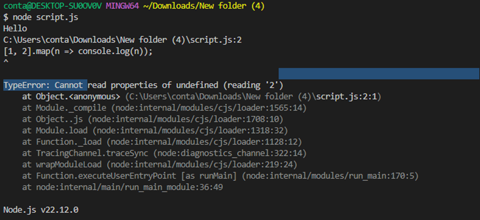
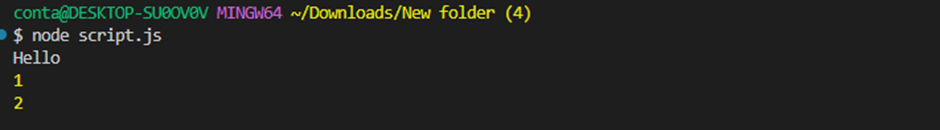
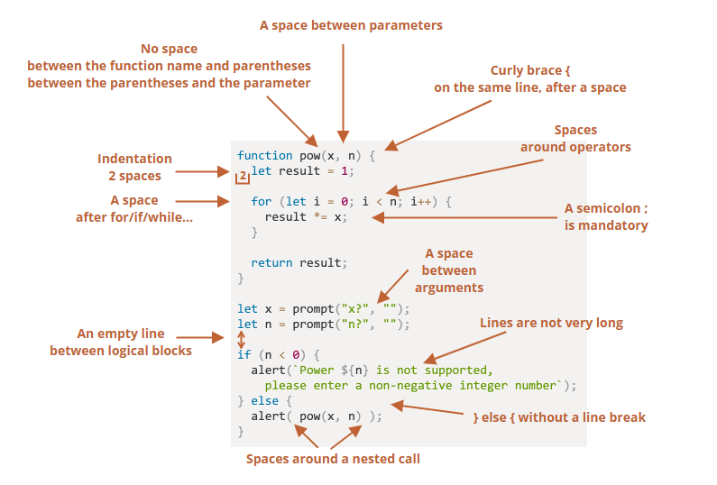

<h1 align="center">JavaScript Notes</h1>

<h2>Table of Contents</h2>

<ul>
  <li><a href="#part-1-the-javascript-language">Part 1: The JavaScript Language</a></li>
   <ul>
    <li><a href="#chapter-1-an-introduction">Chapter 1: An Introduction</a></li>
    <ul >
        <li><a href="#1-an-introduction-to-javaScript">1.1 An Introduction to JavaScript</a></li>
    </ul>
   <li><a href="#chapter-2-javascript-fundamentals">Chapter 2: JavaScript Fundamentals</a></li>
   <ul>
        <li><a href="#2.1-hello-world">2.1 Hello, world!</a></li>
        <li><a href="#2.2-code-structure">2.2: Code structure</a></li>
        <li><a href="#2-3-variables">2.3: variables</a></li>
        <li><a href="#2.4-data-types">2.4: Data Types</a></li>
        <li><a href="#2.5-basic-operators">2.5: Basic Operator</a></li>
        <li><a href="#2.6-function">2.6: Function</a></li>
        <li><a href="#2.7-arrow-function">2.7: Arrow Function</a></li>
    </ul>
    <li><a href="#chapter-3-code-quality">Chapter 3: Code Quality</a></li>
    <ul>
        <li><a href="#3.1-coding-style">3.1: Coding Style</a></li>
    </ul>
    <li><a href="#chapter-4-objects-the-basics">Chapter 4: Objects: the basics</a></li>
    <ul>
        <li><a href="#4.1-objects">4.1: Objects</a></li>
        <li><a href="#4.2-objects-references-and-copying">4.2: Object references and copying</a></li>
    </ul>
  </ul>
  <li><a href="#part-2-browser-document-events-interfaces">Part 2: Browser: Document, Events, Interfaces</a></li>
  <li><a href="#part-3-additional-articles">Additional articles</a></li>
</ul>

<!-- part 1: -->
<h1 id="#part-1-the-javascript-language" align="center">Part 1: The JavaScript Language</h1>

<!-- chapter 1: -->
<h2 id="chapter-1-an-introduction" align="center">Chapter 1: An Introduction</h2>

<!-- 1. -->
<h3 id="1-an-introduction-to-javaScript" align="center">1.1 An Introduction to JavaScript</h3>

<h3 id="what-is-javascript">What is JavaScript:</h3>

JavaScript is a programming language for the web. The programs in JavaScript are called scripts because they are small, dynamic, and interpreted pieces of code designed to run in the browser without compiling the entire program.

JavaScript code is written and send to the browser as plain text, not compiled machine code. Unlike some other programming languages (such as C, C++, or Java) that require compilation of the whole program before running, JavaScript is interpreted and just-in-time compiled in the browser at runtime. In this way, JavaScript is fundamentally different from compiled languages like C, C++, and Java, which need to be processed by a compiler before running.

<h3 id="javascript-history">JavaScript History:</h3>

In 1995, Brendan Eich, a developer at Netscape Communications Corporation, created JavaScript. Eich initially joined Netscape with the intention of implementing the Scheme programming language in the browser. However, Netscape’s management wanted the Scheme language syntax resemble and look similar to Java. As a result, Eich decided to designed a new language that combined:

<ul>
  <li>The functionality of Scheme programming language</li>
  <li>The object-orientation of Self programming language</li>
  <li>And The syntax of Java programming language</li>
</ul>

He completed the first version of the language called Mocha (the internal name during early development by Brendan Eich at Netscape; it was never officially released under this name) in just 10 days in May 1995.

<ul>
  <li><strong>LiveScript (September 1995)</strong> – The first version of the language released to the public was called LiveScript, included with the beta version of Netscape Navigator 2.0 Browser.</li>
  
<strong>Note:</strong> Alongside the language, Eich also built the first JavaScript engine, called SpiderMonkey, written in C, to run LiveScript in the Navigator browser.

</ul>
<ul>
  <li><strong>JavaScript (December 1995)</strong> – The final name, officially announced in collaboration with Sun Microsystems</li>
  <li><strong>ES1 (1997)</strong> - First official standardized version of JavaScript</li>
</ul>

<strong>Note:</strong> 
In June 1997 JavaScript was submitted to ECMA (European Computer Manufacturers Association) International to create a standard version of the language, so all browsers could implement it consistently. 
So, ECMAScript is the official name of the JavaScript standard and ES1, ES2, ES6 etc. are its version numbers.

<h3 id="why-did-javascript-need-a-standard-version">Why Did JavaScript Need a Standard Version:</h3>

When JavaScript was first created in 1995 by Netscape, it was only implemented in their browser Netscape Navigator. Shortly, Microsoft launched its own browser, Internet Explorer, and included its own version of JavaScript called JScript. As a result, two distinct versions of JavaScript were emerged in the market:

<ul>
  <li>JavaScript in Netscape Navigator</li>
  <li>JScript in Internet Explorer</li>
</ul>

<strong>The Problems:</strong>

<ul>
  <li>Different browsers had slightly different implementations of JavaScript.</li>
  <li>Some features worked in one browser but not in another.</li>
  <li>This caused a lot of bugs and confusion for web developers.</li>
  <li>Developers had to write browser-specific code, which made websites harder to build and maintain.</li>
</ul>

<strong>The Solution:</strong> 
To solve this problem, Netscape submitted JavaScript to ECMA International in June 1997, so they could create a standardized specification of the language. This standard was named ECMAScript.

<strong>Purpose of ECMAScript:</strong>

<ul>
  <li>Make sure all browsers follow the same rules for JavaScript.</li>
  <li>Allow developers to write code that works consistently across all browsers.</li>
  <li>Ensure the future growth and evolution of the language.</li>
</ul>

<h3 id="javascript-engines">JavaScript Engines:</h3>

A JavaScript engine is a program built into web browsers (and platforms like Node.js) that is responsible for executing JavaScript code.

It takes the JavaScript you write, then:

<ol>
  <li>Parse (JavaScript engine turns your code into an AST)</li>
  <li>Compile to Bytecode (The AST is compiled into bytecode, an intermediate form between your original JavaScript code and the machine code your computer’s CPU understands.)</li>
  <li>Interpret (The engine executes the bytecode step-by-step using an interpreter.)</li>
  <li>JIT Compilation (The engine detects frequently executed “hot” code and compiles it into machine code. On subsequent runs, it skips parsing and interpreting these parts, running the machine code directly for much faster execution.)</li>
</ol>

<strong>Key Concepts:</strong>

<ul>
  <li><strong>Abstract Syntax Tree (AST):</strong> 
  An AST is a tree-like structure that represents the syntax and structure of your code. 
  Each part of your code becomes a node, and all nodes are connected to each other in a hierarchy — just like branches in a tree.</li>
</ul>

<strong>Example:</strong>

<strong>JS Code:</strong> 
<code>let x = 5 + 3;</code>

<strong>Abstract Syntax Tree (AST):</strong>

<pre>
{
  "type": "Program",
  "body": [
    {
      "type": "VariableDeclaration",
      "kind": "let",
      "declarations": [
        {
          "type": "VariableDeclarator",
          "id": {
            "type": "Identifier",
            "name": "x"
          },
          "init": {
            "type": "BinaryExpression",
            "operator": "+",
            "left": {
              "type": "Literal",
              "value": 5,
              "raw": "5"
            },
            "right": {
              "type": "Literal",
              "value": 3,
              "raw": "3"
            }
          }
        }
      ]
    }
  ],
  "sourceType": "script"
}
</pre>

Here, every "type" in the AST (e.g., "Program", "VariableDeclaration", "Literal") is a node.

<!-- chapter 2 -->
<h2 id="chapter-2-javascript-fundamentals" align="center">Chapter 2: JavaScript Fundamentals</h2>

<!-- 2.1 -->
<h3 id="2.1-hello-world" align="center">2.1: Hello, world!</h3>

<pre><code>console.log("Hello World");
</code></pre>

<h3 id="whats-happened-behind-the-code">What’s happed behind the code:</h3>
<ol>
  <li>The statement sends to the JavaScript Engine</li>
  <li>Parsing</li>
  <li>Compiling AST to Bytecode</li>
  <li>Interpretation (The engine executes the bytecode step-by-step using an interpreter.)</li>
  <li>JIT Compilation</li>
  <li>Calling the <code>log()</code> function:
    <ul>
      <li><code>console</code> is a global object</li>
      <li><code>log</code> is a property of the <code>console</code> object, and its value is a function.</li>
    </ul>
  </li>
</ol>

So, <code>console.log("Hello World")</code> is a function call with the string <code>"Hello World"</code> as an argument.

The <code>log()</code> function takes the argument and tells the engine to print it to the DevTools console or the Node.js terminal.

<!-- 2.2 -->
<h3 id="2.2-code-structure" align="center">2.2: Code structure</h3>

<h3 id="what-is-the-difference-between-statement-program-and-code">What is the difference between statement, program and code:</h3>

<ul>
  <li><strong>statement:</strong> A single instruction in a programming language that performs an action.</li>
  <li><strong>code:</strong> Any written instructions in a programming language, from one line to many.</li>
  <li><strong>program:</strong> A complete set of code written in a programming language to solve a problem or perform a task.</li>
</ul>

<h3 id="semicolons">Semicolons:</h3>

In most cases, semicolons are optional in JavaScript because the language uses a feature called Automatic Semicolon Insertion (ASI) to handle missing semicolons.

For example, this code works perfectly fine without them:

<pre><code>console.log('Hello')
console.log('World')
</code></pre>

But there are cases where ASI fails, which can lead to unexpected behavior or even errors. 
Take this example:

<pre><code>console.log("Hello")
[1, 2].map(n => console.log(n));
</code></pre>

This code shows an error like this: 

The reason we got an error because without a semicolon after <code>console.log("Hello")</code> statement, JavaScript merges the next line into the same statement, like this:

<pre><code>console.log("Hello")[1, 2].map(n => console.log(n));
</code></pre>

and this is not a valid statement in JavaScript, but if you used proper semicolon after <code>console.log("hello")</code>, it will work completely fine as expected:

<pre><code>console.log("Hello");
[1, 2].map(n => console.log(n));
</code></pre>

<!-- 2.3 -->
<h3 id="2-3-variables" align="center">2.3: Variables</h3>

A variable is a “named storage” for data. We can declare variables to store data by using the keywords (A keyword is a reserved word that has a special meaning in the language):

<ul>
  <li>var: the old way to declare variables (function-scoped or global-scoped if not function-scoped, can be redeclared and updated in the same scope).</li>
  <li>let: the modern way to declare variables (block-scoped, can be updated but not redeclared in the same scope).</li>
  <li>const: declares constant variables (block-scoped, cannot be reassigned or redeclared; must be initialized at the time of declaration).</li>
</ul>

<strong>Variable Declaration:</strong>

<pre><code>let message;
</code></pre>

<strong>Variable Initialization:</strong>

<pre><code>let message = 'Hello World';
</code></pre>

<strong>Variable assignment:</strong>

<pre><code>let message = 'Hello World';
message = 'Hello Universe'
</code></pre>

<strong>Note:</strong> initialization gives a variable its first value, while assignment gives a variable a new value after it has been initialized.

<h3 id="difference-between-var-and-let">Difference between <code>var</code> and <code>let</code>:</h3>

<table>
  <thead>
    <tr>
      <th><code>var</code></th>
      <th><code>let</code></th>
    </tr>
  </thead>
  <tbody>
    <tr>
      <td>
        var is function scope:  
        It means a variable declared with var is accessible anywhere inside the same function, no matter which block it was declared in.
        <pre><code>function testScope() {
    if (true) {
        var x = 10;
    }
    console.log(x); // output: 10 
}
testScope();</code></pre>
      </td>
      <td>
        let is block-scoped:  
        It means a variable declared with let is accessible only inside the block {} where it is declared.
        <pre><code>function testScope() {
    if (true) {
        let x = 10;
    }
    console.log(x); // output: Error
}
testScope();</code></pre>
      </td>
    </tr>
    <tr>
      <td>
        Global-scoped (if not in a function):  
        If you declare a variable using var outside any function, even inside a block (like if, for), it becomes globally scoped.
        <pre><code>if (true) {
    var test = true; 
}
console.log(test); // output: true</code></pre>
      </td>
      <td>
        Still block-scoped:  
        let remains limited to the block, even when declared outside any function.
        <pre><code>if (true) {
    let test = true;
}
console.log(test); // output: error</code></pre>
      </td>
    </tr>
    <tr>
      <td>
        Allows redeclaration:
        <pre><code>var user = 'tamim';
var user;
user = 'Muhammad Tamim'
console.log(user) // Output: Muhammad Tamim</code></pre>
      </td>
      <td>
        Does not allow redeclaration:
        <pre><code>let user;
let user; // SyntaxError:</code></pre>
      </td>
    </tr>
  </tbody>
</table>

<h3 id="var-hoisting-issue">var hoisting issue:</h3>

In JavaScript, var declarations are hoisted — this means the declaration is moved to the top of the function (or top of the global scope if outside a function) during the JavaScript parsing phase.

<h4>Example 1:</h4>

<pre><code>function sayHi() {
    phrase = "Hello";
    console.log(phrase);

    var phrase;
}
sayHi(); // Output: "Hello"
</code></pre>

<pre><code>/**
 * Behind the scene:
 function sayHi() {
  var phrase;         // Declaration is hoisted
  phrase = "Hello";   // Assignment stays in place
  console.log(phrase);
}
 */</code></pre>

<h4>Example 2:</h4>

<pre><code>function sayHi() {
    phrase = "Hello"; 

    if (false) {
        var phrase; 
    }

    console.log(phrase);
}
sayHi(); // ✅ Output: "Hello"
</code></pre>

<h4>Example 3:</h4>

<pre><code>function sayHi() {
    console.log(phrase);

    var phrase = "Hello";
}
sayHi(); // Output: undefined
</code></pre>

<pre><code>/**
 *Behind the scene:
 function sayHi() {
  var phrase;           // Hoisted declaration
  console.log(phrase);  //  undefined (no value yet)
  phrase = "Hello";     // Assignment happens here
} 
 */</code></pre>

<!-- 2.4 -->
<h3 id="2.4-data-types" align="center">2.4: Data Types</h3>

A data type defines the kind of value a variable can hold (like a Number, String, Boolean, etc.)

JavaScript is a <strong>dynamically typed language</strong>, which means:

<ul>
  <li>You don’t have to declare the type of a variable.</li>
  <li>The type is determined automatically based on the value you assign.</li>
</ul>

<pre><code>let message = "hello"; // string
message = 123456;      // number
</code></pre>

There are 8 data types in JavaScript:

<ul>
  <li><strong>7 primitive data types:</strong></li>
  <ul>
    <li><strong>number</strong> – Represents both integers and floating-point numbers. 
      Example: <code>let age = 25;</code>
    </li>
    <li><strong>bigint</strong> – Used for integers larger than <code>253 - 1</code>. 
      Example: <code>let big = 12345678901234567890n;</code>
    </li>
    <li><strong>string</strong> – Represents text, enclosed in single or double quotes. 
      Example: <code>let name = "Tamim";</code>
    </li>
    <li><strong>boolean</strong> – Represents true or false. 
      Example: <code>let isLoggedIn = true;</code>
    </li>
    <li><strong>null</strong> – Represents intentional "no value". 
      Example: <code>let data = null;</code>
    </li>
    <li><strong>undefined</strong> – A variable declared but not assigned any value. 
      Example: <code>let result;</code>
    </li>
    <li><strong>symbol</strong> – Represents a unique and immutable value, mainly used as object property keys. 
      Example: <code>let id = Symbol("userID");</code>
    </li>
  </ul>

<li><strong>1 non-primitive data type:</strong>
  <ul>
    <li><strong>object</strong> – In JavaScript, any data that is not a primitive (like numbers or strings) is treated as an object. Objects can hold multiple values and provide more flexibility. It includes:
      <ul>
        <li><strong>Object Literals</strong>: Used to store related data as key-value pairs. This is the most common way to define objects. 
          Example: <code>let user = { name: "Tamim", age: 20 };</code>
        </li>
        <li><strong>Arrays</strong>: A special type of object that stores ordered collections of values using numeric indexes. It comes with built-in methods like <code>push()</code>, <code>pop()</code>, <code>length</code>, etc. 
          Example: <code>let colors = ["red", "green", "blue"];</code>
        </li>
        <li><strong>Functions</strong>: Functions in JavaScript are objects that can be executed (called). They can also have properties and be passed as arguments. 
          Example: <code>function greet() { console.log("Hello"); }</code>
        </li>
      </ul>
    </li>
  </ul>
</li>

<h3 id="the-typeof-operator">The typeof operator:</h3>
<pre>
<code>
console.log(typeof undefined); // "undefined"

console.log(typeof 0); // "number"

console.log(typeof 10n); // "bigint"

console.log(typeof true); // "boolean"

console.log(typeof "foo"); // "string"

console.log(typeof Symbol("id")); // "symbol"

console.log(typeof Math); // "object"  

console.log(typeof null); // "object"  

console.log(typeof alert); 
/*
you will get "function" as output 
if you use browser console, in node 
you will get "undefined"
*/  
</code>
</pre>

<strong>Note:</strong>

<ul>
  <li>typeof null return "object", but null is a primitive data type.
  </li>
  <li>typeof alert returns "function", but functions are technically objects. 
  </li>
</ul>

<!-- 2.5 -->
<h3 id="2.5-basic-operators" align="center">2.4: Basic operators</h3>

<strong>operator:</strong> An operator is a special symbol or keyword that performs an operation on one or more values. 
Example: +, -, !, typeof

<h3>** (Exponentiation) Operator:</h3>

a ** b = a b

Example:

<pre>
<code>console.log(2 ** 2); // 2² = 4
console.log(2 ** 3); // 2³ = 8
console.log(2 ** 4); // 2⁴ = 16
console.log(4 ** (1 / 2)); // 2 (power of 1/2 is the same as a square root)
console.log(8 ** (1 / 3)); // 2 (power of 1/3 is the same as a cubic root)
</code>
</pre>

<h3>String concatenation with + operator</h3>
<pre>
<code>let s = "my" + "string";
console.log(s); // mystring
</code>
</pre>

<strong>Note:</strong> if any of the operands is a string, then the other one is converted to a string too. 
<small><strong>operand : </strong>An operand is the value that an operator works on. For example, in 5 * 2, the operands are 5 and 2.</small>

<pre>
<code>console.log('1' + 2); // "12"
console.log(2 + '1'); // "21"
console.log(2 + 2 + '1'); // "41" and not "221"
console.log('1' + 2 + 2); // "122" and not "14"
</code>
</pre>

<strong>Note: </strong>The + is the only operator that supports strings concatenation. Other arithmetic operators work only with numbers and always convert their operands to numbers.

<pre>
<code>console.log(6 - '2'); // 4, converts '2' to a number
console.log('6' / '2'); // 3, converts both operands to numbers
</code>
</pre>

<h3>Pre Increment / Decrement:</h3>
<pre>
<code>let i = 10;
let x = ++i;
console.log(i); // 11
console.log(x); // 11
</code>
</pre>

Explanation: : Here, i is incremented to 11 first, and then this new value is assigned to x. Both i and x are 11 after this operation.

<h3>post Increment / Decrement:</h3>
<pre>
<code>let i = 10;
let x = i++;
console.log(i); // 11
console.log(x); // 10
</code>
</pre>

Explanation: here, First, the value of i (which is 10) is assigned to the variable x. After that, i is incremented, so i becomes 11.

<strong>Note:</strong>

<ul>
<li>Pre-increment (++i): First increments the value of i, then assigns it.</li>
<li>Post-increment (i++): First assigns the value, then increments it.</li>
</ul>

<h3>String comparison:</h3>

To see whether a string is greater than another, JavaScript uses the so-called lexicographical algorithm.

How lexicographical algorithm works:

<ol>
  <li>Strings are compared character by character from left to right.</li>
  <li>Each character is compared based on its Unicode value.</li>
  <li>The first difference determines the result.</li>
  <li>If all characters are equal and lengths differ, the shorter string is considered smaller.</li>
</ol>

<pre><code>console.log('Z' > 'A'); // true
console.log('hello' == 'hello'); // true
console.log('Glow' > 'Glee'); // true
console.log('Be' < 'Bee'); // true
</code></pre>

<h3>Difference between == and === :</h3>
<pre><code>console.log(0 == false); // 0 == 0 true
console.log('' == false); // 0 == 0 true
</code></pre>

In both cases, JavaScript uses type conversion to convert different data types (string/boolean) into numbers before comparing with ==.

<strong>Solution:</strong> === strictly checks both value and data type. If one of them missing, it immediately returns false.

<pre><code>console.log(0 === false); // false
console.log('' === false); // false
console.log(0 === 0); // true
console.log('' === ''); // true
</code></pre>

<h3>Comparison with null and undefined:</h3>
<pre><code>console.log(null === undefined); // false
console.log(null >= undefined); // false
console.log(null < undefined); // false
console.log(null == undefined); // true
// this is a special rule. If you use ==, null and undefined are considered equal.
</code></pre>

<h3>null vs 0:</h3>
 <pre><code>console.log(null > 0);  // false
console.log(null == 0); // false because == has special rules for null: null only equals for undefined, not anything else.
console.log(null >= 0); // true , because == and >= are not same.
</code></pre>

<h3>undefined vs 0:</h3>
 <pre><code>console.log(undefined > 0); // false 
console.log(undefined < 0); // false 
console.log(undefined == 0); // false
// undefined is converted to NaN in numeric comparisons
</code></pre>

<h3>Ternary operator(? :):</h3>

syntax:

<pre><code>condition ? true part : false part</code></pre>

Example:

<pre><code>// with conditional statement
let age = 18;
let message;

if (age >= 18) {
    message = "You are an adult";
} else {
    message = "You are a minor";
}
console.log(message);
</code></pre>

<pre><code>// with ternary operator
let age = 18;
let message = (age >= 18) ? "You are an adult" : "You are a minor";
console.log(message);
</code></pre>

<!-- 2.6 -->
<h3 id="2.6-function" align="center">2.6: Function</h3>

A Function is a block of reusable code that perform a specific task when it is called.

<pre><code>function calcSum(a, b) {
    console.log(a + b);
}

calcSum(1, 2); // 3
</code></pre>    

<strong>Note:</strong>

<ul>
  <li>1, 2 are arguments</li>
  <li>a, b are parameters</li>
</ul>

<h3>What is the difference between return and no return in a function?</h3>
<pre><code>function calcSum(a, b) {
    const result = a + b;
}

console.log(calcSum(1, 2)); // undefined
</code></pre>    

In this example, the function calculates something, but it doesn't return anything.
So when we call sum(1, 2), the calculation happens inside the function, but we can’t access or use the result outside.
You just call the function, and that’s all — no control or output comes back.

<pre><code>function calcSum(a, b) {
    const result = a + b;
    return result;
}

console.log(calcSum(1, 2)); // 3
const functionResult = calcSum(3, 4);
console.log(functionResult + 5); // 12

</code></pre>    

In this example, the function not only does the work, but it also returns the result to us. This means we can store it, reuse it, or do more operations with it.

You can think of it like this:

We order a coffee from a robot. The robot’s job is to make the coffee. But the robot’s owner teaches it something special, When someone orders coffee, don’t just make it — also serve it on the table.

That’s how <code>return</code> works in a function.

<ul>
  <li>Without <code>return</code>, the robot just makes the coffee — but you don’t get it.</li>
  <li>With <code>return</code>, the robot <strong>makes</strong> the coffee and <strong>gives it to you</strong>.</li>
</ul>

<h3>Default Parameter:</h3>

In JavaScript, default parameters allow you to set default values for function parameters. If no arguments is passed when the function is called, the default parameter will be used.

<pre><code>function showGreet(name = "Guest") {
  console.log("Hello, " + name + "!");
}
showGreet("Tamim"); // Output: Hello, Tamim!
showGreet();        // Output: Hello, Guest!
</code></pre>

<h3>Naming a function:</h3>

Functions are actions. So their name is usually a verb. It should be brief, as accurate as possible and describe what the function does, so that someone reading the code gets an indication of what the function does.

<pre><code>showMessage()     // shows a message
getAge()          // returns the age (gets it somehow)
calcSum()         // calculates a sum and returns the result
createForm()      // creates a form (and usually returns it)
checkPermission() // checks a permission, returns true/false
</code></pre>

<h3>One function – one action rules:</h3>

A function should do exactly what is suggested by its name, no more.

Two independent actions usually deserve two functions, even if they are usually called together (in that case we can make a 3rd function that calls those two).

<pre><code>// Bad example:

function handleUserRegistration(user) {
  // Validate user input
  if (!user.username || !user.email || !user.password) {
    throw new Error("Missing required fields");
  }

  // Hash password
  const hashedPassword = hashFunction(user.password);

  // Save user to database
  database.insert({ ...user, password: hashedPassword });

  // Log registration event
  logger.log(`User ${user.username} registered at ${new Date()}`);

  // Send confirmation email
  emailService.sendConfirmation(user.email, user.username);
}</code></pre>

<pre><code>// Good example:

function validateUserInput(user) {
  if (!user.username || !user.email || !user.password) {
    throw new Error("Missing required fields");
  }
}

function hashPassword(password) {
  return hashFunction(password);
}

function saveUser(user, hashedPassword) {
  database.insert({ ...user, password: hashedPassword });
}

function logRegistration(username) {
  logger.log(`User ${username} registered at ${new Date()}`);
}

function sendConfirmationEmail(email, username) {
  emailService.sendConfirmation(email, username);
}

// Orchestrating function
function handleUserRegistration(user) {
  validateUserInput(user);
  const hashedPassword = hashPassword(user.password);
  saveUser(user, hashedPassword);
  logRegistration(user.username);
  sendConfirmationEmail(user.email, user.username);
}
</code></pre>

<h3 id="2.7-arrow-function" align="center">2.7: Arrow Function</h3>

Arrow functions are a shorter way to write functions in JavaScript. They were introduced in ES6 (2015).

Examples:

<strong>No Parameter, No Return:</strong>

<pre><code>const greet = () => console.log("Hello!");

greet(); // Output: Hello!

// or

const greet2 = () => {
    console.log("Hello!");
};
greet2(); // Output: Hello!
</code></pre>

<strong>Single Parameter, Single Line, No Return:</strong> 
<small>(Parentheses are optional for single parameter)</small>

<pre><code>const square = x => x * x;
console.log(square(5)); // Output: 25
</code></pre>

<strong>Multiple Parameter and statement:</strong> 
<small>( {} required for return )</small>

<pre><code>const multiply = (a, b) => {
  const result = a * b;
  return result;
};
console.log(multiply(3, 4)); // Output: 12
</code></pre>

<!-- chapter 3: -->
<h2 id="chapter-3-code-quality" align="center">Code Quality</h2>

<!-- 3.1 -->
<h3 id="3.1-coding-style" align="center">3.1 Coding Style</h3>

<h3>Curly Braces:</h3>

In most JavaScript projects curly braces are written in “Egyptian” style with the opening brace on the same line as the corresponding keyword – not on a new line. There should also be a space before the opening bracket, like this:

<pre><code>if (10 > 5) {
    console.log("10 is greater than 5");
}</code></pre>

Bad Curly Braces code:

<pre><code>if (10 > 5) { console.log("10 is greater than 5"); }

// or

if (10 > 5)
console.log("10 is greater than 5");</code></pre>

<h3>Indents:</h3>

Use proper line break where needed

<pre><code>function pow(x, n) {
    let result = 1;
    //              <--
    for (let i = 0; i < n; i++) {
        result *= x;
    }
    //              <--
    return result;
}</code></pre>

<h3>Function Placement:</h3>

If you are writing several “helper” functions then follow the "Code first, then functions" style. That’s because when reading code, we first want to know what it does. If the code goes first, then it becomes clear from the start. Then, maybe we won’t need to read the functions at all, especially if their names are descriptive of what they actually do. 

<pre><code>// the code which uses the functions
let elem = createElement();
setHandler(elem);
walkAround();

// --- helper functions ---
function createElement() {
  ...
}

function setHandler(elem) {
  ...
}

function walkAround() {
  ...
  }</code></pre>

<!-- chapter 4: -->
<h2 id="chapter-4-objects-the-basics" align="center">Chapter 4: Objects: the basics</h2>

<!-- 4.1 -->
<h3 id="4.1-objects" align="center">4.1: Objects</h3>

An object is a collection of key-value pairs called properties. where key is a string (also called a “property name”), and value can be anything.

<pre><code>let user = {   
  name: "John",  
  age: 30        
}
</code></pre>

In the user object, there are two properties:

<ol>
  <li>The first property has the key "name" and the value "John".</li>
  <li>The second one has the key "age" and the value 30.</li>
</ol>

The user object can be imagined as a cabinet with two signed files labeled “name” and “age”:

We can add, remove and read files from it at any time by the using of dot or bracket notation:

<pre><code>let user = {
    name: "John",
    age: 30
}
console.log(user.name); // John
console.log(user.age); // 30
user.location = "USA";
console.log(user.location); // USA
delete user.location;
console.log(user.location); // undefined
</code></pre>

We can also use multi-word property names, but then they must be quoted and when read the peppery value we need to use bracket notation.

<pre><code>let user = {
    name: "John",
    age: 30,
    "like birds": true,
}
console.log(user["like birds"]); // true
</code></pre>

In real code, we often use existing variables as values for property names:

<pre><code>function makeUser(name, age) {
    return {
        name: name,
        age: age,
    };
}

let user = makeUser("John", 30);
console.log(user.name); // John
</code></pre>

In the example above, properties have the same names as variables. so in this case we can use shorthand technique:

<pre><code>function makeUser(name, age) {
    return {
        name,
        age
    };
}

let user = makeUser("John", 30);
console.log(user.name); // John
</code></pre>

<h3>Property existence test, “in” operator:</h3>

<pre><code>let user = {
    name: "John",
    age: 30,
}

console.log("age" in user); // true, user.age exists
console.log("location" in user); // false, user.location doesn't exist
</code></pre>

<h3>The "for..in" loop</h3>

<pre><code>let user = {
    name: "John",
    age: 30,
    isAdmin: true
};

for (let key in user) {
    console.log(key);  // name, age, isAdmin
    console.log(user[key]); // John, 30, true
}
</code></pre>

<!-- 4.2 -->
<h3 id="4.2-objects-references-and-copying" align="center">4.2: Objects References and Copying</h3>

One of the fundamental differences of objects versus primitives is that objects are stored and copied “by reference”, whereas primitive values: strings, numbers, booleans, etc – are always copied “as a whole value”.

That’s easy to understand if we look a bit under the hood of what happens when we copy a value. Let’s start with a primitive, such as a string.
 
Here we put a copy of message into phrase:

<pre><code>let message = "Hello!";
let phrase = message;
</code></pre>

As a result we have two independent variables, each one storing the string "Hello!".

A variable doesn’t hold the object directly. It just holds a reference (or pointer) to where the object is stored in memory.

Let’s look at an example of such a variable:

<pre><code>let user = {
  name: "John"
};</code></pre>

The object is stored somewhere in memory (at the right of the picture), while the user variable (at the left) has a “reference” to it.

<strong>When an object variable is copied, the reference is copied, but the object itself is not duplicated:</strong>

<pre><code>let user = { name: "John" };

let admin = user; // copy the reference</code></pre>

Now we have two variables, each storing a reference to the same object:

As you can see, there’s still one object, but now with two variables that reference it.
 
We can use either variable to access the object and modify its contents:

<pre><code>let user = { name: 'John' };

let admin = user;

admin.name = 'Pete'; // changed by the "admin" reference

console.log(user.name); // 'Pete', 
console.log(admin.name); // 'Pete', </code></pre>

<h3>Const objects can be modified?</h3>

An important side effect of storing objects as references is that an object declared as const can be modified.

<pre><code>const user = {
    name: "John"
};

user.name = "Pete";

console.log(user.name); // Pete
</code></pre>

<h3>Cloning and merging and Object.assign:</h3>

So, copying an object variable creates one more reference to the same object.
 
But what if we need to duplicate an object?
 
We can create a new object and replicate the structure of the existing one, by iterating over its properties and copying them on the primitive level.
 
Like this:

<pre><code>let user = {
    name: "John",
    age: 30
};

let clone = {}; // the new empty object

// let's copy all user properties into it
for (let key in user) {
    clone[key] = user[key];
}

// now clone is a fully independent object with the same content
clone.name = "Pete"; // changed the data in it

console.log(user.name); // still John in the original object
console.log(clone.name); // but Pete in the clone
</code></pre>

We can also use the method <strong>Object.assign</strong>:

The syntax is:

<pre><code>Object.assign(dest, ...sources)</code></pre>
<ul>
  <li>The first argument dest is a target object.</li>
  <li>Further arguments is a list of source objects.</li>
</ul>

It copies the properties of all source objects into the target dest, and then returns it as the result.

<pre><code>let user = { name: "John" };
let permissions1 = { canView: true };
let permissions2 = { canEdit: true };

// copies all properties from permissions1 and permissions2 into user
Object.assign(user, permissions1, permissions2);

// now user = { name: "John", canView: true, canEdit: true }
console.log(user.name); // John
console.log(user.canView); // true
console.log(user.canEdit); // true
</code></pre>

We also can use Object.assign to perform a simple object cloning:

<pre><code>let user = {
    name: "John",
    age: 30
};

let clone = Object.assign({}, user);

console.log(clone.name); // John
console.log(clone.age); // 30
</code></pre>

<h3>Nested cloning:</h3>

<pre><code>let user = {
    name: "John",
    sizes: {
        height: 182,
        width: 50
    }
};

let clone = Object.assign({}, user);

console.log(user.sizes === clone.sizes); // true, same object

user.sizes.width = 60;   // Modify the original object
console.log(clone.sizes.width); // 60, get the result from the other one
</code></pre>

To fix that and make user and clone truly separate objects, we should use a cloning loop that examines each value of user[key] and, if it’s an object, then replicate its structure as well. That is called a “structured cloning”.The call structuredClone(object) clones the object with all nested properties:

<pre><code>let user = {
    name: "John",
    sizes: {
        height: 182,
        width: 50
    }
};

let clone = structuredClone(user);

console.log(user.sizes === clone.sizes); // false, different objects

user.sizes.width = 60;    // change a property from one place
console.log(clone.sizes.width); // 50, not related
</code></pre>

