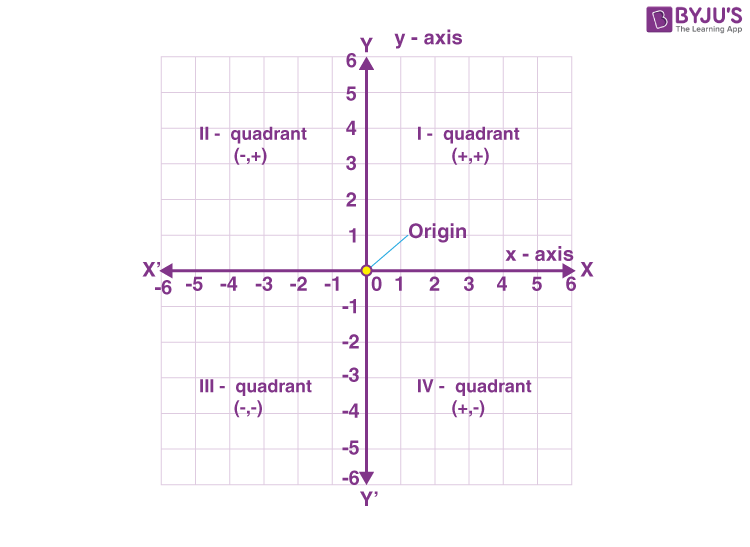
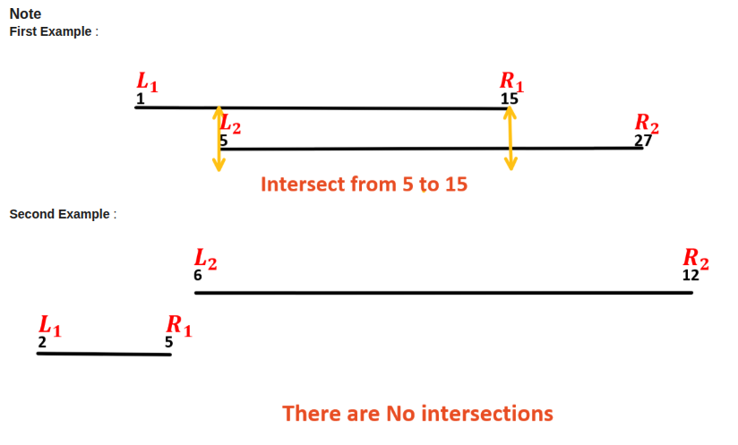
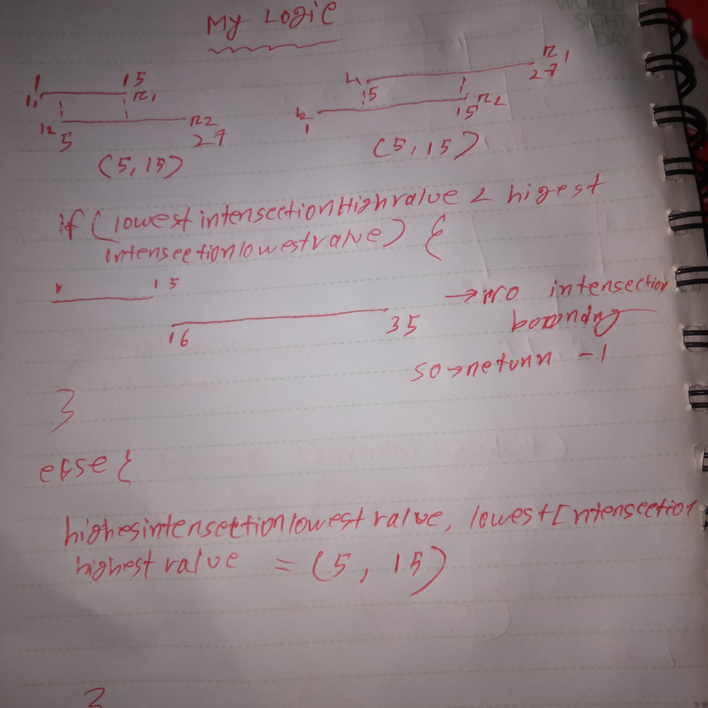
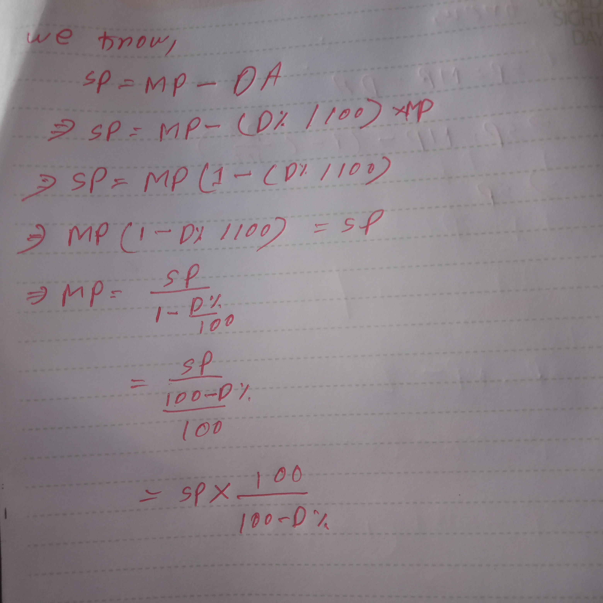
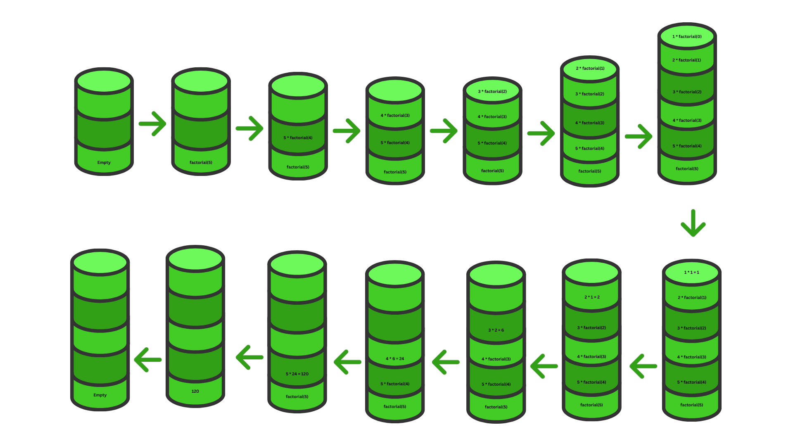

<h1 align="center">JavaScript Notes</h1>


- [Part 1: The JavaScript Language](#part-1-the-javascript-language)
  - [An Introduction to Javascript](#an-introduction-to-javascript)
    - [What is JavaScript:](#what-is-javascript)
    - [JavaScript History:](#javascript-history)
    - [Why Did JavaScript Need a Standard Version:](#why-did-javascript-need-a-standard-version)
    - [JavaScript Engines:](#javascript-engines)
    - [Hello World](#hello-world)
    - [Why JavaScript is one of the most hated language:](#why-javascript-is-one-of-the-most-hated-language)
  - [Variables](#variables)
    - [Difference between var, let and const:](#difference-between-var-let-and-const)
    - [Hoisting](#hoisting)
    - [Scope](#scope)
    - [Scope Chain](#scope-chain)
    - [Variable naming conventions:](#variable-naming-conventions)
    - [How to write a long variable name](#how-to-write-a-long-variable-name)
  - [Data Types](#data-types)
    - [7 Primitive Data Types:](#7-primitive-data-types)
      - [1. Number](#1-number)
      - [2. BigInt](#2-bigint)
      - [3. String](#3-string)
      - [4. Boolean](#4-boolean)
      - [5. Null](#5-null)
      - [6. Undefined](#6-undefined)
        - [When we got undefined:](#when-we-got-undefined)
    - [1 Non-Primitive Data Types:](#1-non-primitive-data-types)
      - [8. Object](#8-object)
    - [Type Conversion:](#type-conversion)
  - [Operator](#operator)
    - [Arithmetic Operators (+, -, \*, /, %, \*\*):](#arithmetic-operators-------)
    - [Assignment Operators (=, +=, -=, \*=, /=):](#assignment-operators------)
    - [Increment / Decrement Operators (--, ++):](#increment--decrement-operators----)
    - [Comparison Operator (\>, \<, \>=, \<=, ==, ===, !=, !==):](#comparison-operator--------)
      - [String comparison:](#string-comparison)
        - [How to convert letter to unicode or Ascii values:](#how-to-convert-letter-to-unicode-or-ascii-values)
        - [How to convert Ascii values to letter:](#how-to-convert-ascii-values-to-letter)
      - [Difference between == and ===:](#difference-between--and-)
    - [Logical Operators (\&\&, ||, ! ,, !!):](#logical-operators-----)
    - [Conditional Operators (if, else, else if, ? :, switch case):](#conditional-operators-if-else-else-if---switch-case)
      - [Truthy and Falsy values:](#truthy-and-falsy-values)
    - [Others Operators](#others-operators)
      - [typeof operator:](#typeof-operator)
      - [rest operator:](#rest-operator)
      - [spread operator:](#spread-operator)
      - [Nullish Coalescing operator (??):](#nullish-coalescing-operator-)
      - [|| vs ??:](#-vs-)
    - [Operator Precedence:](#operator-precedence)
  - [Problem solving: Variables, Data Types and Operators:](#problem-solving-variables-data-types-and-operators)
  - [Loops](#loops)
    - [for loop:](#for-loop)
    - [while loop:](#while-loop)
    - [do while loop:](#do-while-loop)
    - [for..of loop (for iterables: string, array, set, map, NodeList, HTMLCollection):](#forof-loop-for-iterables-string-array-set-map-nodelist-htmlcollection)
    - [for..in loop (for objects):](#forin-loop-for-objects)
    - [forEach method (only for array):](#foreach-method-only-for-array)
  - [function](#function)
    - [What is the difference between return and no return in a function?](#what-is-the-difference-between-return-and-no-return-in-a-function)
    - [Default Parameter:](#default-parameter)
    - [CallBack Function](#callback-function)
    - [callback hell:](#callback-hell)
    - [Arrow Function:](#arrow-function)
    - [Difference between arrow function and normal function](#difference-between-arrow-function-and-normal-function)
    - [Anonymous function](#anonymous-function)
    - [Recursion](#recursion)
    - [Closure](#closure)
    - [Difference between callback function, recursion and closure](#difference-between-callback-function-recursion-and-closure)
  - [string](#string)
    - [Strings are immutable:](#strings-are-immutable)
    - [Quotes:](#quotes)
    - [String Property:](#string-property)
    - [String Methods:](#string-methods)
  - [Objects:](#objects)
    - [Different ways to make an Object](#different-ways-to-make-an-object)
    - [Object.keys(), Object.Values() and Object.entries() methods:](#objectkeys-objectvalues-and-objectentries-methods)
    - [Object.freeze() vs Object.seal()](#objectfreeze-vs-objectseal)
    - [Dot Notation VS Bracket Notation:](#dot-notation-vs-bracket-notation)
    - [Property existence test:](#property-existence-test)
    - [Objects References and Copying:](#objects-references-and-copying)
    - [Const objects can be modified?](#const-objects-can-be-modified)
    - [Cloning and merging, Object.assign and structuredClone():](#cloning-and-merging-objectassign-and-structuredclone)
    - [Nested cloning:](#nested-cloning)
    - [Object Methods](#object-methods)
    - [Optional Chaining (?.)](#optional-chaining-)
    - [Date Object:](#date-object)
    - [Math Object:](#math-object)
  - [array](#array)
    - [for..of loop](#forof-loop)
    - [Array Methods](#array-methods)
  - [Destructuring](#destructuring)
    - [Array Destructuring](#array-destructuring)
    - [Object Destructuring](#object-destructuring)
    - [Destructuring in Function Parameters](#destructuring-in-function-parameters)
  - [set](#set)
    - [creating a set](#creating-a-set)
    - [Adding \& Removing Values](#adding--removing-values)
    - [Checking \& Size](#checking--size)
    - [Iterating Over a Set](#iterating-over-a-set)
    - [Convert Set ↔ Array](#convert-set--array)
  - [map](#map)
    - [Creating a Map](#creating-a-map)
    - [Adding \& Updating Values](#adding--updating-values)
    - [Getting \& Checking Values](#getting--checking-values)
    - [Deleting \& Clearing](#deleting--clearing)
    - [Iterating Over a Map](#iterating-over-a-map)
  - [Iterables](#iterables)
  - [AutoBoxing](#autoboxing)
  - [Strict Mode](#strict-mode)
  - [Error Handling](#error-handling)
    - [Common JS Errors:](#common-js-errors)
      - [SyntaxError:](#syntaxerror)
      - [ReferenceError](#referenceerror)
      - [TypeError](#typeerror)
  - [Js Modules: Import and export](#js-modules-import-and-export)
    - [Export:](#export)
    - [Import:](#import)
  - [Local Storage and Session Storage](#local-storage-and-session-storage)
    - [local storage methods:](#local-storage-methods)
    - [Update the Local Storage key and values:](#update-the-local-storage-key-and-values)
  - [Asynchronous and Synchronous JavaScript](#asynchronous-and-synchronous-javascript)
    - [Synchronous Javascript](#synchronous-javascript)
    - [Asynchronous JavaScript](#asynchronous-javascript)
    - [Web API:](#web-api)
    - [Event loop:](#event-loop)
    - [setTimeOut() and setInterval()](#settimeout-and-setinterval)
    - [JSON, promise, fetch, async/await](#json-promise-fetch-asyncawait)
      - [JSON](#json)
      - [promise](#promise)
      - [fetch](#fetch)
      - [async/await:](#asyncawait)
- [Part 2: DOM](#part-2-dom)
  - [An Introduction To the DOM](#an-introduction-to-the-dom)
  - [DOM Traversing](#dom-traversing)
  - [Elements selecting methods](#elements-selecting-methods)
  - [Content Manipulation](#content-manipulation)
  - [Element Attributes and Element Properties](#element-attributes-and-element-properties)
  - [CSS and Class Styling](#css-and-class-styling)
  - [Creating, Adding and Removing Element Methods](#creating-adding-and-removing-element-methods)
  - [Events](#events)
- [Part 3: JS Exercise](#part-3-js-exercise)
  - [Operator Problems](#operator-problems)
  - [Loop Problems](#loop-problems)
  - [String Problems](#string-problems)
  - [Array Problems](#array-problems)
  - [Object Problems](#object-problems)
  - [Function Problems](#function-problems)

---


# Part 1: The JavaScript Language

## An Introduction to Javascript

### What is JavaScript:

JavaScript is a: 
- scripting language 
  - A scripting language is a programming language that is executed by an interpreter, which translates the code into machine code and runs it line by line (or step by step) at runtime, instead of compiling the entire program into machine code beforehand.
    - Compile time → when the code is being converted into machine code (before execution start).
    - Runtime → when the  code is actually being executed.
    

- Single Threaded
  - meaning it executes one task at a time in sequence.

- Non-blocking 
  - doesn’t wait for asynchronous operation like (setTimeout() or fetch())

- Dynamically Typed
  - meaning variables in JS do not need a type declaration

- Event-Driven
  - JavaScript responds to events like clicks, key presses, key up etc.

- First-Class Functions
  - meaning they can be stored in variables, passed as arguments, or returned from other functions.

- Cross-Platform
  - JS can run in browsers, servers (Node.js), and mobile apps.

- Object-Oriented
  - Because it supports core OOP concepts such as:
    - Encapsulation, Inheritance, Polymorphism, Abstraction

### JavaScript History:
In 1995, Brendan Eich, a developer at Netscape Communications Corporation, created JavaScript. Eich initially joined Netscape with the intention of implementing the Scheme programming language in the browser. However, Netscape’s management wanted the Scheme language syntax resemble and look similar to Java. As a result, Eich decided to designed a new language that combined:

- The functionality of Scheme programming language
- The object-orientation of Self programming language
- And The syntax of Java programming language

He completed the first version of the language called Mocha in just 10 days in May 1995.

- LiveScript (September 1995) – The first version of the language released to the public was called LiveScript, included with the beta version of Netscape Navigator 2.0 Browser.  
  
    Note: Alongside the language, Eich also built the first JavaScript engine written in C, to run LiveScript in the Navigator browser.

- JavaScript (December 1995) – The final name, officially announced in collaboration with Sun Microsystems

  - Why netscape collaborate with Sun Microsystems?  
  
    The main reason is Marketing and Branding. Sun Microsystems was the creator of the Java programming language, which was very popular and highly hyped at the time. To take advantage of this popularity, Netscape wanted their new scripting language (originally called Mocha, later renamed LiveScript) to gain more attention. So, they partnered with Sun Microsystems and renamed their language to JavaScript, even though Java and JavaScript are completely different languages with different purposes and designs.

- ES1 (1997) - First official standardized version of JavaScript 
  
    In June 1997 JavaScript was submitted to ECMA (European Computer Manufacturers Association) International to create a standard version of the language, so all browsers could implement it consistently.
    So, ECMAScript is the official name of the JavaScript standard and ES1, ES2, ES6 etc. are its version numbers.


### Why Did JavaScript Need a Standard Version:
When JavaScript was first created in 1995 by Netscape, it was only implemented in their browser Netscape Navigator. Shortly, Microsoft launched its own browser, Internet Explorer, and included its own version of JavaScript called JScript. As a result, two distinct versions of JavaScript were emerged in the market:

- JavaScript in Netscape Navigator
- JScript in Internet Explorer

so, Different browsers had slightly different implementations of JavaScript. Some features worked in one browser but not in another. This caused a lot of bugs and confusion for web developers. Developers had to write browser-specific code, which made websites harder to build and maintain.

To solve this problem, Netscape submitted JavaScript to ECMA International in June 1997, so they could create a standardized specification of the language. This standard was named ECMAScript.

### JavaScript Engines:
A JavaScript engine is a program built into web browsers (and platforms like Node.js) that is responsible for executing JavaScript code.

It takes the JavaScript you write and processes it in the following steps:

1. Parsing
     - Parsing is the process where the JavaScript engine reads your code and breaks it down into a structured format (called an AST – Abstract Syntax Tree) so it can understand and execute it.
       -  **Abstract Syntax Tree (AST):** An AST is a tree-like structure that represents the syntax and structure of your code. Each part of your code becomes a node, and all nodes are connected to each other.
```bash
let x = 5 + 3;

Ast format:
{
  "type": "Program",
  "body": [
    {
      "type": "VariableDeclaration",
      "kind": "let",
      "declarations": [
        {
          "type": "VariableDeclarator",
          "id": {
            "type": "Identifier",
            "name": "x"
          },
          "init": {
            "type": "BinaryExpression",
            "operator": "+",
            "left": {
              "type": "Literal",
              "value": 5,
              "raw": "5"
            },
            "right": {
              "type": "Literal",
              "value": 3,
              "raw": "3"
            }
          }
        }
      ]
    }
  ],
  "sourceType": "script"
}        
```

2. Compiling the AST to Bytecode
   - **Bytecode:** Is an intermediate from between your original JavaScript code and the machine code.
3. Execution: Execution has two phase, interpreting and JIT compilation (if applicable)
   - Interpreting
     - Is a process where the interpreter convert bytecode into machine code, and then executes it line by line or step by step.
   - JIT Compilation (if applicable)
     - JIT(Just In Time) Compilation is a process where the JS engine detects frequently executed “hot” code and convert it into machine code using JIT compiler. On future executions, the engine can skip parsing, compiling to bytecode, and interpreting, and instead run the precompiled hot code directly for better performance.

### Hello World

```console.log("Hello World");```

**What’s happened behind the code:**
The statement sends to the JavaScript Engine
- Parsing
- Compiling AST to Bytecode
- executing (Interpreting or JIT compilation) 
  - After interpreting of JIT compilation the  engines execute `console.log("Hello World")`
    - here
      - console is a global object provided by the environment (browser or Node.js).
      - log is a method of the console object.
      - so, Calling console.log("Hello World") passes the string "Hello World" as an argument to that log method, which then prints it to the web browser console or terminal (in Node.js).
**Note:**
- statement: A single instruction in a programming language
  - ```console.log("Hello World");```
- code: Any written instructions in a programming language, from one line to many. 
  - ```console.log("Hello World");```
- program: A complete set of code written in a programming language to solve a problem or perform a task by (input → processing → output)..
  - Find the largest number in an array
- Method: when a function is stored as a property of an object, it’s called a method.

### Why JavaScript is one of the most hated language:

1. Weird Type Conversions: 

```js
console.log(1 + "2");   // "12"  (number + string = string)
console.log("2" - 1);   // 1     (string - number = number)
console.log("2" + 1);   // "21"  (string + number = string)
```

```js
console.log(true + false); // 1
console.log(1 < 2 < 3);    // true
console.log(3 < 2 < 1);    // true but 3 < 2 → false, 2 < 1 → false
```

```js
console.log([] + []) // ''
console.log([] + {}) // [object Object]
console.log({} + []) // 0
console.log({} + {}) // NaN
```

2. The == Disaster: 

```jsx
console.log(0 == false);   // true
console.log('' == false);  // true
console.log(null == undefined); // true
console.log([] == false);  // true
console.log([] == 0);      // true
console.log([] == ![]);    // true 😵
```

```jsx
console.log(0 == "0") // true
console.log(0 == []) // true
console.log("0" == []) // true
```

3. null and undefined Confusion:

JavaScript has two different “nothing” values — null and undefined.

```jsx
console.log(typeof null); // "object" ❌ (bug from 1995!)
console.log(typeof undefined); // "undefined"
console.log(null === undefined) // false
```
Even the creator of JavaScript admitted this was a mistake, but it’s too late to fix now — it would break 
millions of websites.

Note: 
- Undefined = a variable has no value assigned 
- Null = a variable has been intentionally assigned empty

1. NaN Has an Identity Crisis

```js
typeof NaN; // "number" - Wait what? “Not-a-Number” is a number?!

console.log(NaN == NaN)
console.log(NaN === NaN)
```
Note: NaN is the only value in JavaScript that is not equal to itself.

5. The “this” Keyword Madness:

this loses its context when the method is called separately. That’s why people call it one of the most confusing parts of JavaScript.

```jsx
const user = {
    name: "Tamim",
    sayHi() {
        console.log("hi", this.name);
    },
    sayHey() {
        console.log("hey", user.name)
    }
};

user.sayHi(); // Tamim ✅
user.sayHey(); // hey Tamim ✅

const hi = user.sayHi;
hi();      // undefined ❌

const hey = user.sayHey
hey() // hey Tamim
```

Because this depends on how the function is called, not where it’s written. 😡 Many developers spend hours debugging “why this is undefined.”


That’s why developers say:
👉 Always use ===, not ==.

6. Too Many Ways to Say “Hi”: 

```jsx
function sayHi() {}
const sayHi = function() {}
const sayHi = () => {}
```

## Variables
A variable is a “named storage” for data. We can declare variables to store data by using keywords:

Note: A keyword is a reserved word that has a special meaning in the language. 

- var: the old way to declare variables 
- let: the modern way to declare variables 
- const: declares constant variables

**Variable Declaration:**

`let message;`

**Variable Initialization:**

`let message = 'Hello World';`

**Variable assignment:**

```js
let message = 'Hello World';
message = 'Hello Universe'
```
**Note:** initialization gives a variable its first value, while assignment gives a variable a new value after it has been initialized.

### Difference between var, let and const:

<table>
<tr>
<th>var</th>
<th>let</th>
<th>const</th>
</tr>
<tr>
<td>Function-scoped (global scope if not in a function)

```js
function testScope() {
    if (true) {
        var x = 10;
    }
    console.log(x); // output: 10 
}
// console.log(x); // ReferenceError: x is not defined
testScope();
```

```js
if (true) {
    var test = true; 
}
console.log(test); // output: true
```

</td>
<td>Block-scoped

```js
function testScope() {
    if (true) {
        let x = 10;
    }
    console.log(x); // ReferenceError: x is not defined
}
testScope();
```

```js
if (true) {
    let test = true;
}
console.log(test); // ReferenceError: x is not defined
```

</td>
<td>Block-scoped

```js
function testScope() {
    if (true) {
        const x = 10;
    }
    console.log(x); // // ReferenceError: x is not defined
}
testScope();
```

```js
if (true) {
    const test = true;
}
console.log(test); // ReferenceError: x is not defined
```

</td>
</tr>
<tr>
<td>
Hoisted and initialized with undefined.

```js
console.log(a); // undefine
var a = 10;
```

</td>
<td>
Hoisted but not initialized

```js
console.log(b); // ReferenceError: Cannot access 'b' before initialization
let b = 20;
```

</td>
<td>
Hoisted but not initialized

```js
console.log(b); // ReferenceError: Cannot access 'b' before initialization
const b = 20;
```

</td>
</tr>
<tr>
<td>
Can be re-declared and re-assign in the same scope.

```js
var a = 10;
var a = 20;  //  Allowed
a = 30;      //  Allowed
console.log(a); // 30
```

</td>
<td>
Cannot be re-declared but can re-assign in the same scope.

```js
let b = 10;
// let b = 20;  // Error: re-declaration not allowed
b = 20;        //  Re-assignment allowed
console.log(b); // 20
```

</td>
<td>
Cannot be re-declared and re-assign in the same scope.

```js
const c = 10;
// c = 20;      // Error: cannot reassign
// const c = 30; // Error: cannot re-declare
console.log(c); // 10
```

</td>
</tr>
<tr>
<td>
Declaring var globally adds it to window object as a property (in browsers).

</td>
<td>
Declaring let doesn't globally add it to window object as a property (in browsers).

```js
let a = 10;

console.log(window);
console.log(window.a); // undefined
```

</td>
<td>
Declaring const doesn't globally adds it to window object as a property (in browsers).

```js
const a = 10;

console.log(window);
console.log(window.a); // undefined
```

</td>
</tr>
</table>

### Hoisting
Hoisting is a behavior in JavaScript where variable and function declarations are moved to the top of their scope during parsing and compiling the AST to Bytecode phase, before the code is executed by interpreter or JIT compiler(if applicable).

### Scope
Scope determines where variables can be accessed in your code. There are 4 types of scopes in js:

1. Block Scope:  
   
A variable has block scope if it is declared with let or const inside a curly braces { }. It is accessible only within that block.

```js
if (true) {
    let age = 25;
    const city = "Dhaka";
    console.log(age, city); // 25 Dhaka
}

console.log(age);  //  ReferenceError: age is not defined
console.log(city); //  ReferenceError: city is not defined
```

2. Function Scope:  
   
A variable has function scope if it is declared inside a function. It is accessible only within that function.

```js
function sayHello() {
    let message = "Hello";
    console.log(message); // Hello    
}

sayHello();
console.log(message); // ReferenceError: message is not defined
```

3. Global Scope:  
   
A variable has global scope if it is declared outside of any function or block. It is accessible from anywhere in the code.

```js
let name = "Tamim";

function greet() {
    console.log("Hi", name); // Hi Tamim
}

greet();
console.log(name); // Tamim
```

4. Lexical Scope:  
    
Lexical scope means You can access variables from outer to inner scope, but not from inner to outer scope.

```js
let outerVar = "I am outer";

function outerFunction() {
    let innerVar1 = "I am inner1";

    function innerFunction() {
        let innerVar2 = "I am inner2"
        console.log(outerVar); // I am outer
        console.log(innerVar1); // I am inner1
    }

    innerFunction();

    console.log(innerVar2) // ReferenceError: innerVar2 is not defined
}

outerFunction();

console.log(innerVar1); // ReferenceError: innerVar1 is not defined
```

### Scope Chain
When you try to access a variable:
- JavaScript first looks in the current scope
- If not found, it goes to the outer scope
- This continues until it reaches the global scope

```js
let num = 1;

function outerFunction() {
    let num = 2;

    function innerFunction() {
        let num = 3;

        console.log(num);
    }

    innerFunction();
    console.log(num);
}

outerFunction();
console.log(num);

/*
3
2
1
*/
```

### Variable naming conventions:
- Names must start with a letter, underscore _, or dollar sign $
- Names can contain letters, digits, _, and $ — but no spaces or symbols
- Names are Case-sensitive
- Names Cannot contain JavaScript reserved keywords

### How to write a long variable name
- Snake Case = `let my_current_home_address = "Barisal";`
- Camel Case (recommended) = `let myCurrentHomeAddress = "Barisal";`
- Pascal Case = `let MyCurrentHomeAddress = "Barisal";`


## Data Types

A data type defines the kind of value a variable can hold (like a Number, String, Boolean, etc.)

JavaScript is a dynamically typed language, which means:
- You don’t have to declare the type of a variable.
- The type is determined automatically based on the value you assign.

```js
let message = "hello"; // string
message = 123456;      // number
```

There are 8 data types in JavaScript:


### 7 Primitive Data Types:

#### 1. Number 
Represents both integers and floating-point numbers. 
    
```js
let age = 25;
let money = 25.5345;

console.log("Age:", age); // Outputs: Age: 25
console.log("Money:", money.toFixed(2)); // Outputs: Money: 25.53
```

#### 2. BigInt

JavaScript Numbers are only accurate up to 15 digits, but BigInt can represent an integer of any size, limited only by available memory.

There are two ways to create a BigInt:

```js
// Using an integer literal with an n suffix:
let x = 12345123451234512345n
// Using the BigInt() constructor with a string:
let y = BigInt("12345123451234512345");

console.log(x, y) // 12345123451234512345n 12345123451234512345n
```

#### 3. String

#### 4. Boolean 
   
Represents true or false.

```js
let isMarried = false;
let isSingle = true;
```

#### 5. Null  
   
Represents intentional "no value".

```js
let data = null;
console.log(data) // null
```

#### 6. Undefined  
   
It is a primitive data type and default value given by JavaScript when JavaScript expects a value but doesn’t find one:

##### When we got undefined:

- a variable Declared but not initialized

```js
let a;
console.log(a); // undefined
```

- Function without a return value

```js
function greet() {}
console.log(greet()); // undefined
```

- Accessing a non-existing object property

```js
let obj = { name: "Alice" };
console.log(obj.age); // undefined
```

- Accessing an array element that doesn’t exist

```js
let arr = [1, 2, 3];
console.log(arr[5]); // undefined
```

- IF Function parameters are not provided

```js
function sum(a, b) {
  console.log(b);
}
sum(5); // undefined
```

- Explicit assignment

```js
let x = undefined;
console.log(x); // undefined
```

7. Symbol

Represents a unique and immutable value, mainly used to create unique identifiers for object properties.

```js
let id = Symbol();
console.log(typeof id); // "symbol"

const name = "tamim";
let a = Symbol(name);
let b = Symbol(name);
console.log(a === b); // false
```

### 1 Non-Primitive Data Types:

#### 8. Object  
   
In JavaScript, any data that is not a primitive type is considered an object type. The three most commonly used object types are:

- object
- array
- function 
  
### Type Conversion:

With global functions:

```js
console.log(parseInt("123"));       // 123
console.log(parseInt("12.34"));     // 12
console.log(parseInt("100px"));     // 100
console.log(parseInt("abc"));       // NaN
console.log(parseInt(true));        // NaN
console.log(parseInt(false));       // NaN
console.log(parseInt(""));          // NaN

console.log(parseFloat("10"));         // 10
console.log(parseFloat("12.34"));     // 12.34
console.log(parseFloat("100px"));     // 100
console.log(parseFloat("3.14hello")); // 3.14
console.log(parseFloat("abc"));       // NaN
console.log(parseFloat(true));       // NaN
console.log(parseFloat(false));       // NaN
console.log(parseFloat(""));        // NaN

// For Number all the behavior are same like parseInt and parseFloat but 
// number can also convert true, false and emptyString "" to boolean number
console.log(Number(true));       // 1
console.log(Number(false));      // 0
console.log(Number(""));         // 0


console.log(String(123));       // "123"
console.log(String(true));      // "true"
console.log(String(false));     // "false"
console.log(String(null));      // "null"
console.log(String(undefined)); // "undefined"
console.log(String([1, 2, 3])); // "1,2,3"

// Boolean follows js truthy and falsy values
console.log(Boolean(0));           // false
console.log(Boolean(1));           // true
console.log(Boolean(""));          // false
console.log(Boolean("Tamim"));     // true
console.log(Boolean(null));        // false
console.log(Boolean(undefined));   // false
console.log(Boolean([]));          // true (empty array is truthy)
console.log(Boolean({}));          // true (empty object is truthy)
```

with methods:

```js
console.log((123).toString());       // "123"
console.log(true.toString());      // "true"
console.log(false.toString());     // "false"
// console.log(null.toString());      // TypeError
// console.log(undefined.toString()); // TypeError
console.log([1, 2, 3].toString()); // "1,2,3"

console.log((12.3456).toFixed(2)); // "12.35"

console.log(12.3456.toPrecision(4)); // "12.35"
console.log(12.3456789.toPrecision(5)); // "12.346"

```

## Operator

An Operator is a special symbol that tells the program to performs a specific operation on one or more values.

### Arithmetic Operators (+, -, *, /, %, **):

```js
console.log(2 + 3); // 5
console.log(5 - 2); // 3
console.log(4 * 2); // 8

console.log(10 / 50); // 0.2
console.log(10 % 50) // 10
console.log(50 / 10) // 5
console.log(50 % 10) // 0
```
Note: For a perfect division, the dividend > divisor.

<h4>** (Exponentiation):</h4>
<p>a ** b = a<sup> b</sup></p>

```js
console.log(2 ** 2); // 2² = 4
console.log(2 ** 3); // 2³ = 8
console.log(2 ** 4); // 2⁴ = 16
console.log(4 ** (1 / 2)); // 2 (power of 1/2 is the same as a square root)
console.log(8 ** (1 / 3)); // 2 (power of 1/3 is the same as a cubic root)
```

**String concatenation with +:**

```js
let s = "my" + "string";
console.log(s); // mystring
```

Note: If any of the operands is a string, then the other one is converted to a string too.

```js
console.log('1' + 2); // "12"
console.log(2 + '1'); // "21"
console.log(2 + 2 + '1'); // "41" and not "221"
console.log('1' + 2 + 2); // "122" and not "14"
```

Note: The + is the only operator that supports strings concatenation. Other arithmetic operators work only with numbers and always convert their operands to numbers.

```js
console.log(6 - '2'); // 4, converts '2' to a number
console.log('6' / '2'); // 3, converts both operands to numbers
```

### Assignment Operators (=, +=, -=, *=, /=):

```js
let x = 10;
x += 5;  // x = x + 5
x -= 2;  // x = x - 2
x *= 3;  // x = x * 3
x /= 2;  // x = x / 2
```

### Increment / Decrement Operators (--, ++):

**Pre Increment / Decrement:**

```js
let i = 10;
let x = ++i;
console.log(i); // 11
console.log(x); // 11
```

**post Increment / Decrement:**

```js
let i = 10;
let x = i++;
console.log(i); // 11
console.log(x); // 10
```

Note: 
- Pre-increment (++i): First increments the value of i, then assigns it.
- Post-increment (i++): First assigns the value of i, then increments it.

### Comparison Operator (>, <, >=, <=, ==, ===, !=, !==):

```js
console.log(5 > 3);     // true
console.log(5 < 3);     // false
console.log(5 >= 5);    // true
console.log(3 <= 2);    // false
console.log(5 == '5');  // true
console.log(5 === '5'); // false
console.log(5 != '5');  // false
console.log(5 !== '5'); // true
```

#### String comparison:

To see whether a string is greater than another, JavaScript uses the so-called lexicographical algorithm.

How lexicographical algorithm works:
- Strings are compared character by character from left to right.
- Each character is compared based on its Unicode value.
- The first difference determines the result.
- If all characters are equal and lengths differ, the shorter string is considered smaller.

```js
console.log('B' > 'A'); // true
console.log('abcd' == 'abcd'); // true
console.log('abcd' > 'abcc'); // true
console.log('Bc' < 'Bce'); // true
```


##### How to convert letter to unicode or Ascii values:

```js
console.log('a'.charCodeAt(0)); // Output: 97
console.log('a'.codePointAt(0)); // Output: 97
```

##### How to convert Ascii values to letter:

```js
console.log(String.fromCharCode(97)); // Output: 'a'
console.log(String.fromCodePoint(97)); // Output: 'a'
```

#### Difference between == and ===:

```js
console.log(0 == false); // 0 == 0 true
console.log('' == false); // 0 == 0 true
```
In both cases, JavaScript uses type conversion to convert different data types (string/boolean) into numbers before comparing with ==.

=== strictly checks both value and data type. If one of them missing, it immediately returns false.

```js
console.log(0 === false); // false
console.log('' === false); // false
console.log(0 === 0); // true
console.log('' === ''); // true
```


### Logical Operators (&&, ||, ! ,, !!):

```js
let age = 25;
if (age > 18 && age < 30) {
    console.log("Young Adult");
}
// Young Adult

const isLoggedIn = true;
const userName = "Tamim";

isLoggedIn && console.log("Welcome, " + userName);
// Output: Welcome, Tamim

const isMingle = false;

isMingle || console.log("Sad for you!");
// Sad for you

let day = "Saturday";
if (day === "Saturday" || day === "Sunday") {
    console.log("Weekend");
}
// weekend

let loggedIn = false;
if (!loggedIn) {
    console.log("Please log in");
}
// Please log in

let username = "Tamim";

if (!!username) {
    console.log("Username is set");
} else {
    console.log("Please enter a username");
}
// Username is set

console.log(!!"hello"); // true
console.log(!!42); // true
console.log(!!{}); // true
console.log(!![]); // true

console.log(!!""); // false
console.log(!!0); // false
console.log(!!null); // false
console.log(!!undefined); // false
console.log(!!NaN); // false
```

### Conditional Operators (if, else, else if, ? :, switch case):

```js
let age = 20;

if (age < 18) {
  console.log("Minor");
} else if (age === 18) {
  console.log("Exactly 18");
} else {
  console.log("Adult");
}
```

**Ternary operator(? :):**

syntax:

```condition ? true part : false part```

```js

let age = 18;
let message;

if (age >= 18) {
    message = "You are an adult";
} else {
    message = "You are a minor";
}
console.log(message);
```

```js
// with ternary operator
let age = 18;
let message = (age >= 18) ? "You are an adult" : "You are a minor";
console.log(message);
```

**switch...case:**

```js

let color = "green";

switch (color) {
  case "red":
    console.log("Stop");
    break;
  case "green":
    console.log("Go");
    break;
  case "yellow":
    console.log("Wait");
    break;
  default:
    console.log("Unknown color");
}
// switch checks one variable against multiple cases and runs the matched block.
```

#### Truthy and Falsy values:

In JavaScript, any value used in a conditional statement gets automatically converted to true or false.

There are 6 total falsy values in js, everything else is truthy:

- false
- 0
- ""
- null
- undefined
- NaN

```js
// None of the console.log() will run because all the values are falsy.

if (false) console.log('Falsy');
if (0) console.log('Falsy');
if (-0) console.log('Falsy');
if (0n) console.log('Falsy');
if ("") console.log('Falsy');
if (null) console.log('Falsy');
if (undefined) console.log('Falsy');
if (NaN) console.log('Falsy');
```

### Others Operators

#### typeof operator:

```js
console.log(typeof 0); // "number"
console.log(typeof 10n); // "bigint"
console.log(typeof true); // "boolean"
console.log(typeof "foo"); // "string"
console.log(typeof Symbol("id")); // "symbol"
console.log(typeof null); // object
console.log(typeof undefined); // undefined


console.log(typeof NaN); // number
```


#### rest operator:

Rest operator gathers values into an array or object.

It is used defining things like Function parameters, array destructuring, object destructuring.

- rest in function parameter:
```js

function multiply(multiplier, ...numbers) {
    console.log(multiplier);
    console.log(numbers);

}

multiply(2, 1, 2, 3);

/*
2
[ 1, 2, 3 ]
*/
```

- rest in array destructuring:

```js
const [first, ...rest] = [1, 2, 3, 4];
console.log(first); // 1
console.log(rest);  // [2, 3, 4]
```

- rest in object destructuring:

```js
const user = { name: "Tamim", age: 21, country: "BD" };
const { name, ...rest } = user;

console.log(name); // Tamim
console.log(rest); // { age: 21, country: "BD" }
```

#### spread operator:
Spreads operator breaks an array or object into individual values. 

It is Used in Function parameter, array literals and object literals.

- in function parameter:

```js
function greet(a, b, c) {
    console.log(a, b, c);
}

const args = [1, 2, 3];
greet(args); // [ 1, 2, 3 ] undefined undefined
greet(...args); // 1 2 3
console.log(...args) // 1 2 3
```

- In Arrays literal:

```js
const num1 = [1, 2];
const num2 = [3, 4];
const all = [...num1, ...num2];
console.log(all); // [1, 2, 3, 4]

console.log(...all) // 1 2 3 4
console.log(Math.max(...all)) // 4
console.log(Math.min(...all)) // 1
```

- In Objects literal:

```js
const user1 = { name: "Tamim" };
const user2 = { age: 21 };
const merged = { ...user1, ...user2 };
console.log(merged); // { name: "Tamim", age: 21 }
```

Note: A literal means a fixed value written directly in the code. It represents a value exactly as it is, without calculation or computation.

```js
let age = 25;      // 25 is a number literal
let name = "Tamim"; // "Tamim" is a string literal
let numbers = [1, 2, 3]; // [1,2,3] is an array literal
```


#### Nullish Coalescing operator (??):

The nullish coalescing operator (??) is used to provide a default value when a variable is null or undefined.

```js
function greet(name) {
  let user = name ?? "Guest";
  console.log("Hello, " + user);
}

greet(null);   // Hello, Guest
greet("John"); // Hello, John
```

```js
let user = {
    age: 0,
    name: ""
};

console.log(user?.name ?? "Anonymous"); // "" (not nullish)
console.log(user?.email ?? "No email"); // "No email"

const user2 = {
    name: 'Rahim',
    address: { city: 'Dhaka' }
};

const city = user2?.address?.city ?? "City not available";
console.log(city); // Dhaka


const postalCode = user?.address?.postalCode ?? "Postal code not available";
console.log(postalCode); // Postal code not available
```

```js
let a;
let b = null;
let c = undefined;
let d = "Hello";

let result = a ?? b ?? c ?? d ?? "Fallback";
console.log(result); // "Hello"
```

#### || vs ??:

```js
let value1 = 0;
let result1 = value1 || 100;
let result2 = value1 ?? 100;

console.log(result1); // 100 (because 0 is falsy)
console.log(result2); // 0   (because 0 is NOT null or undefined)
```

You cannot mix ?? with || or && without parentheses:

```js
// SyntaxError:
let result = null || undefined ?? "Default";

// Fix:
let result = (null || undefined) ?? "Default";
```


### Operator Precedence:

| Operator      | Precedence                | Associativity |
| ------------- | ------------------------- | ------------- |
| `*`, `/`, `%` | 21 (high)                 | Left to Right |
| `+`, `-`      | 20 (low, because 20 < 21) | Left to Right |

example: 

```js
console.log(4 + 2 - 2 * 4 / 2) //  2

/*
- 2 * 4 → 8
- 8 / 2 → 4
- 4 + 2 → 6
- 6 - 4 → 2
*/
```


## Problem solving: Variables, Data Types and Operators:

**1. Say Hello to JS:**

Given a name S. Print "Hello, (name)" without parentheses.

| Input      | Output            |
| ---------- | ----------------- |
| programmer | Hello, programmer |


My Solution: 

```js
const s = "programmer"
console.log("Hello,", s); // Hello, programmer
console.log(`hello, ${s}`); // Hello, programmer
```

**2. Basic Data Types:**

You are given four numbers and one string in a single line of input. Your task is to print each value on a new line, in the same order as the input.

However:
- The second number should be treated as a BigInt (because it’s very large).
- The last number (the fifth value) must be printed with exactly one digit after the decimal point.

| Input                                        | Output         |
| -------------------------------------------- | -------------- |
| 3 12345123451234512345n a 334.23 14049.30493 | 3              |
|                                              | 12345678912345 |
|                                              | a              |
|                                              | 334.23         |
|                                              | 14049.3        |


My Solution: 

```js
const input = "3 12345123451234512345n a 334.23 14049.30493";
const inputArray = input.split(" ");

const secondElement = inputArray[1]
const secondElementArray = secondElement.split("")
secondElementArray.pop(secondElementArray.length - 1)
const secondElementArrayToString = secondElementArray.join("")
inputArray[1] = secondElementArrayToString

inputArray[4] = Number(inputArray[4]).toFixed(1)

for (const singleInput of inputArray) {
    console.log(singleInput)
}

/*
3
12345123451234512345
a
334.23
14049.3
*/
```

Better Solution:

```js
const input = "3 12345123451234512345n a 334.23 14049.30493";
const inputArray = input.split(" ");

// Convert BigInt string to BigInt → then to string (removes "n")
inputArray[1] = BigInt(inputArray[1].replace("n", "")).toString();

// Format the last number to 1 decimal place
inputArray[4] = Number(inputArray[4]).toFixed(1);

// Print all
for (const value of inputArray) {
    console.log(value);
}

/*
3
12345123451234512345
a
334.23
14049.3
*/
```

```js
const input = "3 12345123451234512345n a 334.23 14049.30493";
const [intVal, bigIntVal, charVal, floatVal, doubleVal] = input.split(" ");

console.log(intVal);
console.log(BigInt(bigIntVal.replace("n", "")).toString());
console.log(charVal);
console.log(floatVal);
console.log(Number(doubleVal).toFixed(1));

/*
3
12345123451234512345
a
334.23
14049.3
*/
```

**3. Simple Calculator:**

Given two numbers X and Y. Print the summation and multiplication and subtraction of these 2 numbers.

| Input | Output      |
| ----- | ----------- |
| 5 10  | 5 + 10 = 15 |
|       | 5 * 10 = 50 |
|       | 5 - 10 = -5 |


My Solution: 

```jsx
const num1 = 5;
const num2 = 10;

console.log(`${num1} + ${num2} = ${num1 + num2}`)
console.log(`${num1} * ${num2} = ${num1 * num2}`)
console.log(`${num1} - ${num2} = ${num1 - num2}`)

/*
5 + 10 = 15
5 * 10 = 50
5 - 10 = -5
*/
```

**4. Difference:**

Given four numbers A, B, C and D. Print the result of the following equation:

X = (A * B) - (C * D).

| Input | Output           |
| ----- | ---------------- |
| 1234  | Difference = -10 |
| 2345  | Difference = -14 |
| 4523  | Difference = 14  |


My Solution: 

```js
function calculateEquation(a, b, c, d) {
    const equation = a * b - c * d
    return equation
}

const equationResult = calculateEquation(1, 2, 3, 4);
console.log(equationResult) // -10
```

**5. Area of a Circle:**

Given a number R calculate the area of a circle using the following formula:

Area = π * R²

Note: consider π = 3.141592653.

| Input | Output       |
| ----- | ------------ |
| 2.00  | 12.566370612 |


My Solution: 

```js
function AreaOfACircle(pi, R) {
    // return equation = pi * Math.pow(R, 2)
    return equation = pi * (R ** 2)
}

const result = AreaOfACircle(3.141592653, 2.00);
console.log(result) // 12.566370612
```


**6. Summation from 1 to N:**

Given a number N. Print the summation of the numbers that is between 1 and N (inclusive).

| Input | Output |
| ----- | ------ |
| 3     | 6      |
| 10    | 55     |

My Solution: 

```js
function summationFrom1toN(N) {
    let sum = 0;
    for (let i = 1; i <= N; i++) {
        sum += i;
    }
    return sum;
}

console.log(summationFrom1toN(3)); // 6
```

Better Solution:

```js
function summationFrom1toN(N) {
  return (N * (N + 1)) / 2;
}

console.log(summationFrom1toN(3));  // 6

// Note: sum of all numbers from 1 to N using the formula: N*(N+1)/2
```

**7. Two Numbers**

Given 2 numbers A and B. Print floor, ceil and round of A/B

| Input | Output           |
| ----- | ---------------- |
| 10 3  | floor 10 / 3 = 3 |
|       | ceil 10 / 3 = 4  |
|       | round 10 / 3 = 3 |
| 10 4  | floor 10 / 4 = 2 |
|       | ceil 10 / 4 = 3  |
|       | round 10 / 4 = 3 |
| 10 6  | floor 10 / 6 = 1 |
|       | ceil 10 / 6 = 2  |
|       | round 10 / 6 = 2 |


My Solution: 

```js
function divisionOfAB(A, B) {

    console.log(`floor ${A} / ${B} = ${Math.floor(A / B)}`)
    console.log(`ceil ${A} / ${B} = ${Math.ceil(A / B)}`)
    console.log(`round ${A} / ${B} = ${Math.round(A / B)}`)

}

divisionOfAB(10, 3);

/*
floor 10 / 3 = 3
ceil 10 / 3 = 4
round 10 / 3 = 3
 */
```

**8. Welcome for you with conditions:**

Given two numbers A and B. Print "Yes" if A is greater than or equal to B. Otherwise print "No".

| Input | Output |
| ----- | ------ |
| 10 9  | Yes    |
| 5 5   | Yes    |
| 5 7   | No     |


My Solution: 

```js
function greaterThanOrEqual(A, B) {
    if (A >= B) {
        console.log("Yes")
    }
    else {
        console.log("No")
    }
}

greaterThanOrEqual(10, 9);
```

**9. Multiples:**

Given two numbers A and B. Print "Multiples" if A is multiple of B or vice versa. Otherwise print "No Multiples".

Note: 
- A is Multiple of B if: A % B == 0; 12 % 3 == 0  // true → 12 is a multiple of 3
- B is Multiple of A if: B % A == 0; 3 % 12 == 0  // false → 3 is NOT a multiple of 12


| Input | Output       |
| ----- | ------------ |
| 9 3   | Multiples    |
| 6 24  | Multiples    |
| 12 5  | No Multiples |

My Solution: 

```js
function findMultiplesOrNot(A, B) {
    if (A % B === 0 || B % A === 0) {
        console.log("Multiples")
    }
    else {
        console.log("No Multiples")
    }
}

findMultiplesOrNot(9, 3); // Multiples
```

**10. Max and Min:**

Given 3 numbers A, B and C, Print the minimum and the maximum numbers.

| Input    | Output |
| -------- | ------ |
| 1 2 3    | 1 3    |
| -1 -2 -3 | -3 -1  |
| 10 20 -5 | -5 20  |

My Solution: 

```js
function findMaxAndMin(A, B, C) {
    const max = findMax(A, B, C)
    const min = findMin(A, B, C)

    console.log(min, max)
}
function findMax(A, B, C) {
    if (A >= B && A >= C) {
        return A;
    }
    else if (B >= A && B >= C) {
        return B;
    }
    else {
        return C;
    }
}
function findMin(A, B, C) {
    if (A <= B && A <= C) {
        return A;
    }
    else if (B <= A && B <= C) {
        return B;
    }
    else {
        return C;
    }
}

findMaxAndMin(1, 2, 3); // 1 2 3
```

Better Solution: 

```js
function findMaxAndMin(A, B, C) {
  const max = Math.max(A, B, C);
  const min = Math.min(A, B, C);
  console.log(min, max);
}

findMaxAndMin(1, 2, 3);     // 1 3
```

**11. The Brothers:**

Given two person names. Each person has {"the first name" + "the second name"}. Determine whether they are brothers or not.

Note: The two persons are brothers if they share the same second name.

| Input          | Output       |
| -------------- | ------------ |
| bassam ramadan | ARE Brothers |
| ayman salah    |              |
| ali salah      | ARE Brothers |
| ahmed ramadan  |              |
| ali kamel      | NOT          |
| ali salah      |              |

My Solution: 

```js
function findBrothersOrNot(person1, person2) {
    const person1LastName = person1.split(" ").slice(-1).join("")
    const person2LastName = person2.split(" ").slice(-1).join("")
    /*
    const person1LastName = person1.split(" ").slice(-1)[0];
    const person2LastName = person2.split(" ").slice(-1)[0];
    */
    if (person1LastName === person2LastName) {
        console.log("ARE Brothers")
    }
    else {
        console.log("NOT")
    }
}

const person1 = "bassam ramadan";
const person2 = "ahmed ramadan";

findBrothersOrNot(person1, person2); // ARE Brothers
```

Better Solution: 

```js
function findBrothersOrNot(person1, person2) {
  const [, lastName1] = person1.split(" ");
  const [, lastName2] = person2.split(" ");
  
  console.log(lastName1 === lastName2 ? "ARE Brothers" : "NOT");
}

findBrothersOrNot("bassam ramadan", "ahmed ramadan"); // ARE Brothers
findBrothersOrNot("ali kamel", "ali salah");  // NOT
```

```jsx
function findBrothersOrNot(person1, person2) {
  const lastName1 = person1.split(" ").at(-1);
  const lastName2 = person2.split(" ").at(-1);
  
  console.log(lastName1 === lastName2 ? "ARE Brothers" : "NOT");
}

findBrothersOrNot("bassam ramadan", "ahmed ramadan"); // ARE Brothers
findBrothersOrNot("ali kamel", "ali salah");  // NOT

// Note: .at(-1) method can directly access the last element of an array.
```

**12. Capital or Small Or Digit:**

Given a letter X. Determine whether X is Digit or Alphabet and if it is Alphabet determine if it is Capital Case or Small Case.

Note:

Digits in ASCII '0' = 48,'9' = 57 
Capital letters in ASCII 'A' = 65, 'Z' = 90
Small letters in ASCII 'a' = 97,'z' = 122

| Input | Output     |
| ----- | ---------- |
| A     | ALPHA      |
|       | IS CAPITAL |
| 9     | IS DIGIT   |
| a     | ALPHA      |
|       | IS SMALL   |


My Solution: 

```js
function findCapitalSmallOrDigit(X) {

    let letter = X;

    if (X >= 1 && X <= 9) {
        letter = X.toString()
    }

    const asciiValue = letter.charCodeAt(0)

    if (asciiValue >= 48 && asciiValue <= 57) {
        console.log("IS DIGIT")
    }
    else if (asciiValue >= 65 && asciiValue <= 90) {
        console.log("ALPHA\nIS CAPITAL")
    }
    else if (asciiValue >= 97 && asciiValue <= 122) {
        console.log(`ALPHA
IS SMALL`)
    }
}

findCapitalSmallOrDigit("A");
findCapitalSmallOrDigit(9);
findCapitalSmallOrDigit("a");

/*
ALPHA
IS CAPITAL
IS DIGIT
ALPHA
IS SMALL
*/
```

Better Solutions: 

```js
function findCapitalSmallOrDigit(X) {
  const ascii = X.toString().charCodeAt(0);

  if (ascii >= 48 && ascii <= 57) {
    console.log("IS DIGIT");
  } 
  else if (ascii >= 65 && ascii <= 90) {
    console.log("ALPHA\nIS CAPITAL");
  } 
  else if (ascii >= 97 && ascii <= 122) {
    console.log("ALPHA\nIS SMALL");
  } 
}

findCapitalSmallOrDigit("A");
findCapitalSmallOrDigit(9);
findCapitalSmallOrDigit("a");
```

```js
function findCapitalSmallOrDigit(X) {

 const value = X.toString();

  if (/[0-9]/.test(value)) {
    console.log("IS DIGIT");
  } 
  else if (/[A-Z]/.test(value)) {
    console.log("ALPHA\nIS CAPITAL");
  } 
  else if (/[a-z]/.test(value)) {
    console.log("ALPHA\nIS SMALL");
  }
}

findCapitalSmallOrDigit("A");
findCapitalSmallOrDigit(9);
findCapitalSmallOrDigit("a");
```

```js
function findCapitalSmallOrDigit(X) {

 const value = X.toString();

  if (!isNaN(value)) {
    console.log("IS DIGIT");
  } 
  else if (value === value.toUpperCase()) {
    console.log("ALPHA\nIS CAPITAL");
  } 
  else {
    console.log("ALPHA\nIS SMALL");
  }
}
  
findCapitalSmallOrDigit("A");
findCapitalSmallOrDigit(9);
findCapitalSmallOrDigit("a");
```

**13. Char:**

Given a letter X. If the letter is lowercase print the letter after converting it from lowercase letter to uppercase letter. Otherwise print the letter after converting it from uppercase letter to lowercase letter

Note : difference between 'a' and 'A' in ASCII is 32 .

| Input | Output |
| ----- | ------ |
| a     | A      |
| A     | a      |

My Solution: 

```js
function convertingLowercaseOrUppercase(X) {
    const ascii = X.charCodeAt(0)

    if (/[A-Z]/.test(X)) {
        const sum = ascii + 32;
        const asciiToAlpha = String.fromCharCode(sum);
        console.log(asciiToAlpha)
    }
    else {
        const sub = ascii - 32;
        const asciiToAlpha = String.fromCharCode(sub);
        console.log(asciiToAlpha)
    }
}

convertingLowercaseOrUppercase("a"); // A
convertingLowercaseOrUppercase("A"); // a
```

Better Solutions: 

```js
function toggleCase(X) {
  if (X === X.toUpperCase()) {
    console.log(X.toLowerCase());
  } else {
    console.log(X.toUpperCase());
  }
}

toggleCase("a"); // A
toggleCase("A"); // a
```

```js
```

**14. Calculator:**

Given a mathematical expression. The expression will be one of the following expressions: A+B, A−B, A∗B and A/B. Print the result of the mathematical expression.

Note: For the dividing operation you should print the division without any fractions.

| Input | Output |
| ----- | ------ |
| 7+54  | 61     |
| 17*10 | 170    |

My Solution: 

```js
function calculateExpression(num1, operator, num2) {
    switch (operator) {
        case "+":
            console.log(num1 + num2)
            break
        case "-":
            console.log(num1 - num2)
            break
        case "*":
            console.log(num1 * num2)
            break
        case "/":
            console.log(Math.floor(num1 / num2))
            break
        default:
            console.log("Unknown operator")
    }
}

calculateExpression(7, '+', 54); // 61
calculateExpression(17, '*', 10); // 170
```

Better Solutions:

```js
function calculateExpression(num1, operator, num2) {
  const operations = {
    '+': num1 + num2,
    '-': num1 - num2,
    '*': num1 * num2,
    '/': Math.floor(num1 / num2),
  };

  console.log(operations[operator] ?? "Unknown operator");
}

calculateExpression(7, '+', 54);  // 61
calculateExpression(17, '*', 10); // 170
```

**15. Digits Summation:**

Given two numbers N and M. Print the summation of their last digits.

| Input | Output |
| ----- | ------ |
| 13 12 | 5      |

My Solution: 

```js
function digitsSummation(N, M) {
    const NLastDigit = parseInt(getLastDigit(N))
    const MLastDigit = parseInt(getLastDigit(M))
    return NLastDigit + MLastDigit
}

function getLastDigit(number) {
    // const stringNumber = String(number)
    const stringNumber = number.toString()
    if (stringNumber.length === 1) {
        return number;
    }
    else {
        const arrayNumber = stringNumber.split("")
        const lastIndex = arrayNumber.length - 1;
        const lastElement = arrayNumber[lastIndex]
        return lastElement
    }
}
const result = digitsSummation(13, 12);
console.log(result) // 5
```

Better Solution: 

```js
function digitsSummation(N, M) {
    const lastDigitN = N % 10;
    const lastDigitM = M % 10;
    return lastDigitN + lastDigitM;
}

console.log(digitsSummation(13, 12)); // 5

// Note: for any number, n % 10 gives its last digit. 
```

```js
function digitsSummation(N, M) {
  const lastDigitN = Number(N.toString().slice(-1));
  const lastDigitM = Number(M.toString().slice(-1));
  return lastDigitN + lastDigitM;
}

console.log(digitsSummation(13, 12)); // 5
```

**16. First Digit:**

Given a number X. Print "EVEN" if the first digit of X is even number. Otherwise print "ODD".

| Input | Output |
| ----- | ------ |
| 4569  | EVEN   |
| 3569  | ODD    |

My Solution: 

```js
function findFirstDigit(X) {
    const length = X.toString().length;

    let devisor = "1"
    for (let i = 1; i < length; i++) {
        devisor += "0"
    }

    const firstDigit = X / parseInt(devisor)
    const firstDigitWithOutFraction = Math.floor(firstDigit)

    if (firstDigitWithOutFraction % 2 === 0) {
        console.log("EVEN")
    }
    else {

        console.log("ODD")
    }

}

findFirstDigit(4569); // EVEN
findFirstDigit(3569); // ODD

// first digit formula = N/10^(number of digits - 1) --> n/10^(log10(n))
```

better Solutions: 

```js
function findFirstDigit(X) {
  const firstDigit = Number(X.toString()[0]);
  console.log(firstDigit % 2 === 0 ? "EVEN" : "ODD");
}

findFirstDigit(4569); // EVEN
findFirstDigit(3569); // ODD
```

```js
function findFirstDigit(X) {
  while (X >= 10) {
    X = Math.floor(X / 10);
  }
  console.log(X % 2 === 0 ? "EVEN" : "ODD");
}

findFirstDigit(4569); // EVEN
findFirstDigit(3569); // ODD
```

```js
function findFirstDigit(X) {
  const firstDigit = Math.floor(X / Math.pow(10, Math.floor(Math.log10(X))));
  console.log(firstDigit % 2 === 0 ? "EVEN" : "ODD");
}

findFirstDigit(4569); // EVEN
findFirstDigit(3569); // ODD
```

Note: 
- $\log_b(x) = y$
- $\log_{10}(280) = 2.447 = 2$
- $\log_{10}(100) = 2$
- $\displaystyle 10^2 = 100$


**17. The Last 2 Digits:**

Given 4 numbers A, B, C and D. Print the last 2 digits from their Multiplication.

Note: The Multiplication of 4 numbers is 5 * 7 * 2 * 4 = 280 so the answer will be the last 2 digits which are 80.

| Input   | Output |
| ------- | ------ |
| 5 7 2 4 | 80     |
| 3 9 9 9 | 87     |

My Solution: 

```js
function last2Digits(A, B, C, D) {
    const multiplication = A * B * C * D;
    const lastTwoDigits = multiplication % 100;

    console.log(lastTwoDigits)
}

last2Digits(5, 7, 2, 4); // 80
last2Digits(3, 9, 9, 9); // 87

// Note: for any number, n % 100 gives its last two digits.
```


**18. Coordinated of a Point:**

Given two numbers X, Y which donate coordinates of a point in 2D plan. Determine in which quarter does it belong.



Note:
- Print Q1, Q2, Q3, Q4 according to the quarter in which the point belongs to.
- Print "Origem" (0, 0) If the point is at the origin.
- Print "Eixo X" (X, 0) If the point is over X axis.
- Print "Eixo Y" (0, Y) if the point is over Y axis.

| Input    | Output |
| -------- | ------ |
| 4.5 -2.2 | Q4     |
| 0.1 0.1  | Q1     |

My Solution: 

```js
function FindCoordinates(X, Y) {
    if (X > 0 && Y > 0) {
        console.log('Q1')
    }
    else if (X < 0 && Y > 0) {
        console.log('Q2')
    }
    else if (X < 0 && Y < 0) {
        console.log('Q3')
    }
    else if (X > 0 && Y < 0) {
        console.log('Q4')
    }
    else if (X > 0 && Y === 0) {
        console.log("Eixo X")
    }
    else if (X === 0 && Y > 0) {
        console.log("Eixo Y")
    }
    else if (X === 0 && Y === 0) {
        console.log('Origem')
    }

}

FindCoordinates(4.5, -2.2); // Q4
FindCoordinates(0.1, 0.1); // Q1
```

Better Solution: 

```js
function findCoordinates(X, Y) {
    if (X === 0 && Y === 0) {
        console.log("Origem");
    } 
    else if (Y === 0) {
        console.log("Eixo X");
    } 
    else if (X === 0) {
        console.log("Eixo Y");
    } 
    else if (X > 0 && Y > 0) {
        console.log("Q1");
    } 
    else if (X < 0 && Y > 0) {
        console.log("Q2");
    } 
    else if (X < 0 && Y < 0) {
        console.log("Q3");
    } 
    else {
        console.log("Q4");
    }
}

findCoordinates(4.5, -2.2); // Q4
findCoordinates(0.1, 0.1);  // Q1
```

**19. Age in Days:**

Given a Number N corresponding to a person's age (in days). Print his age in years, months and days, followed by its respective message "years", "months", "days".

Note: consider the whole year has 365 days and 30 days per month.

| Input | Output   |
| ----- | -------- |
| 400   | 1 years  |
|       | 1 months |
|       | 5 days   |
| 800   | 2 years  |
|       | 2 months |
|       | 10 days  |
| 30    | 0 years  |
|       | 1 months |
|       | 0 days   |

My Solution: 

```js
function findAgeInDays(N) {
    let years = 0
    let months = 0
    let days = 0;

    if (N >= 365) {
        years = Math.floor(N / 365);
        days = N % 365;
    }
    else {
        days = N
    }

    if (N >= 30) {
        months = Math.floor(days / 30);
        days = days % 30
    }

    console.log(`
${years} years
${months} months
${days} days
`)

}

findAgeInDays(400);

/*
1 years
1 months
5 days
*/
```

**20. Interval:**

Given a number X. Determine in which of the following intervals the number X belongs to:

[0,25], (25,50], (50,75], (75,100]

- if X belongs to any of the above intervals print "Interval " followed by the interval.
- if X does not belong to any of the above intervals print "Out of Intervals".

Note:
- The symbol '(' represents greater than.
- The symbol ')' represents smaller than.
- The symbol '[' represents greater than or equal.
- The symbol ']' represents smaller than or equal.

For example:

- [0,25] indicates numbers between 0 and 25.0000, including both.
- (25,50] indicates numbers greater than 25: (25.00001) up to 50.0000000.

| Input | Output            |
| ----- | ----------------- |
| 25.1  | Interval (25,50]  |
| 25.0  | Interval [0, 25]  |
| 100.0 | Interval (75,100] |
| -25.2 | Out of Intervals  |

My Solution: 

```js
function findInterval(X) {
    if (X >= 0 && X <= 25) {
        console.log("Interval [0,25]")
    }
    else if (X > 25 && X <= 50) {
        console.log("Interval (25,50]")
    }
    else if (X > 50 && X <= 75) {
        console.log("Interval (50,75]")
    }
    else if (X > 75 && X <= 100) {
        console.log("Interval (75,100]")
    }
    else {
        console.log("Out of Intervals")
    }
}

findInterval(25.1); // Interval (25,50]
findInterval(25.0); // Interval [0,25]
findInterval(100.0); // Interval (75,100]
findInterval(-25.2); // Out of Intervals
```

**21. Two Intervals:**

Given the boundaries of 2 intervals. Print the boundaries of their intersection.

Note: Boundaries mean the two ends of an interval which are the starting number and the ending number.



If there is an intersection between these 2 intervals print its boundaries , otherwise print -1.

| Input     | Output |
| --------- | ------ |
| 1 15 5 27 | 5 15   |
| 5 27 1 15 | 5 15   |
| 2 5 6 12  | -1     |

My Solution: 

```js
function findTwoInterval(l1, r1, l2, r2) {

    const interval1Difference = r1 - l1
    const interval2Difference = r2 - l2

    let highestInterval = []
    let lowestInterval = []

    if (interval1Difference > interval2Difference) {
        highestInterval = [l1, r1]
        lowestInterval = [l2, r2]
    }
    else {
        highestInterval = [l2, r2]
        lowestInterval = [l1, r1]
    }

    const highestIntervalLowestValue = highestInterval[0]
    const lowestIntervalHighestValue = lowestInterval[1]

    if (lowestIntervalHighestValue < highestIntervalLowestValue) {
        console.log(-1)
    }
    else {
        const boundariesOfTwoIntersections = [highestIntervalLowestValue, lowestIntervalHighestValue]
        console.log(...boundariesOfTwoIntersections)
    }
}


findTwoInterval(1, 15, 5, 27); // 5 15
findTwoInterval(5, 27, 1, 15); // 5 15
findTwoInterval(2, 5, 6, 12); // -1
```
Logic: 



Better Solution: 

```js
function findTwoIntervals(l1, r1, l2, r2) {
    const left = Math.max(l1, l2);
    const right = Math.min(r1, r2);

    if (left <= right) {
        console.log(left, right);
    } else {
        console.log(-1);
    }
}

findTwoIntervals(1, 15, 5, 27); // 5 15
findTwoIntervals(5, 27, 1, 15); // 5 15
findTwoIntervals(2, 5, 6, 12);  // -1
```

Logic: 

- Left boundary = max(l1, l2)
- Right boundary = min(r1, r2)

If the left boundary ≤ right boundary → intersection exists
Otherwise → no intersection (print -1)

**22. Sort Numbers:**

Given three numbers A, B, C. Print these numbers in ascending order followed by a blank line and then the values in the sequence as they were read.

| Input   | Output |
| ------- | ------ |
| 3 -2 1  | -2     |
|         | 1      |
|         | 3      |
|         |        |
|         | 3      |
|         | -2     |
|         | 1      |
| -2 10 0 |        |
|         | -2     |
|         | 0      |
|         | 10     |
|         |        |
|         | -2     |
|         | 10     |
|         | 0      |

My Solution: 

```js
function sortNumbers(A, B, C) {

    const numbers = [A, B, C];

    let sortedNumbers = [...numbers];

    for (let i = 0; i < sortedNumbers.length - 1; i++) {
        for (let j = i + 1; j < sortedNumbers.length; j++) {
            if (sortedNumbers[i] >= sortedNumbers[j]) {
                let temp = sortedNumbers[i]
                sortedNumbers[i] = sortedNumbers[j]
                sortedNumbers[j] = temp;
            }
        }
    }

    for (let number of sortedNumbers) {
        console.log(number)
    }

    console.log("")

    for (let number of numbers) {
        console.log(number)
    }

}

sortNumbers(3, -2, 1); 

/*
-2
1
3

3
-2
1
*/
```

Better Solution: 

```js
function sortNumbers(A, B, C) {
    const numbers = [A, B, C];
    const sorted = [...numbers].sort((a, b) => a - b);
    // a - b = ascending sort, b - a = descending sort

    for (let n of sorted) console.log(n);
    console.log("");
    for (let n of numbers) console.log(n);
}

sortNumbers(3, -2, 1);

/*
-2
1
3

3
-2
1
*/
```

```js
// Note: works only for 3 numbers

function sortNumbers(A, B, C) {
    const min = Math.min(A, B, C);
    const max = Math.max(A, B, C);
    const mid = A + B + C - min - max;

    console.log(`${min}\n${mid}\n${max}\n`);
    console.log(`${A}\n${B}\n${C}`);
}

sortNumbers(3, -2, 1);

```

**23. Float or Int:**

Given a number N. Determine whether N is float number or integer number.

- If N is integer number then print "int" followed by the integer part separated by space.
- If N is float number then print "float" followed by the integer part and decimal part separated by space.

| Input   | Output          |
| ------- | --------------- |
| 234.000 | int 234         |
| 534.958 | float 534 0.958 |

My Solution: 

```js
function FindFloatOrInt(N) {

    const floatValue = N - parseInt(N)

    if (floatValue === 0) {
        console.log("int", parseInt(N))
    }
    else {
        console.log("float", parseInt(N), parseFloat(floatValue.toFixed(3)))
    }

    /*
    Separate decimal(floating) part: 
    - (floating number - its integer part) 
    - or (floating number % 1)
    */
}

FindFloatOrInt(234.000); // int 234
FindFloatOrInt(534.958); // float 534 0.958
```

**24. Mathematical Expression:**

Given a mathematical expression. The expression will be one of the following expressions:

- A + B = C, A - B = C and A * B = C

where A, B, C are three numbers, S is the sign between A and B, and Q the '=' sign

Print "Yes" If the expression is Right , Otherwise print the right answer of the expression.

| Input       | Output |
| ----------- | ------ |
| 5 + 10 = 15 | Yes    |
| 3 - 1 = 2   | Yes    |
| 2 * 10 = 19 | 20     |

My Solution: 

```js
function findExpressionRightOrWrong(A, S, B, Q, C) {

    let expressionResult = 0;

    if (S === '+') {
        expressionResult = A + B
    }
    else if (S === '-') {
        expressionResult = A - B
    }
    else if (S === '*') {
        expressionResult = A * B
    }
    else if (S === '/') {
        expressionResult = A / B
    }

    if (expressionResult === C) {
        console.log("Yes")
    }
    else {
        console.log(expressionResult)
    }

}

findExpressionRightOrWrong(5, '+', 10, '=', 15); // Yes
findExpressionRightOrWrong(3, '-', 1, '=', 2); // Yes
findExpressionRightOrWrong(2, '*', 10, '=', 19); // 20
```

Better Solutions:

```js
function findExpressionRightOrWrong(A, S, B, Q, C) {
    let result;

    switch (S) {
        case '+':
            result = A + B;
            break;
        case '-':
            result = A - B;
            break;
        case '*':
            result = A * B;
            break;
        case '/':
            result = A / B;
            break;
        default:
            console.log("Invalid operator");
            return;
    }

    console.log(result === C ? "Yes" : result);
}

findExpressionRightOrWrong(5, '+', 10, '=', 15); // Yes
findExpressionRightOrWrong(3, '-', 1, '=', 2);   // Yes
findExpressionRightOrWrong(2, '*', 10, '=', 19); // 20
```

**25. Comparison:**

Given a comparison symbol S between two numbers A and B. Determine whether it is Right or Wrong.

- The comparison is as follows: A < B, A > B, A = B.

Where A, B are two integer numbers and S refers to the sign between them.

| Input | Output |
| ----- | ------ |
| 5 > 4 | Right  |
| 9 < 1 | Wrong  |
| 4 = 4 | Right  |

My Solution: 

```js
function comparisonRightOrWrong(A, S, B) {

    if (S === ">") {
        if (A > B) {
            console.log("Right")
        }
        else {
            console.log("Wrong")
        }
    }
    else if (S === '<') {
        if (A < B) {
            console.log("Right")
        }
        else {
            console.log("Wrong")
        }
    }
    else if (S === '=') {
        if (A === B) {
            console.log("Right")
        }
        else {
            console.log("Wrong")
        }
    }

}

comparisonRightOrWrong(5, '>', 4); // Right
comparisonRightOrWrong(9, '<', 1); // Wrong
comparisonRightOrWrong(4, '=', 4); // Right
```

Better Solution: 

```js
function comparisonRightOrWrong(A, S, B) {

    let isRight;

    switch (S) {
        case '>':
            isRight = A > B;
            break
        case '<':
            isRight = A < B;
            break
        case '=':
            isRight = A === B;
            break
    }

    console.log(isRight ? "Right" : "Wrong")

}

comparisonRightOrWrong(5, '>', 4); // Right
comparisonRightOrWrong(9, '<', 1); // Wrong
comparisonRightOrWrong(4, '=', 4); // Right
```

**26. Hard Compare:**

Given 4 numbers A,B,C and D. If AB > CD print "YES" otherwise, print "NO".


| Input   | Output |
| ------- | ------ |
| 3 2 5 4 | NO     |
| 5 2 4 2 | YES    |
| 5 2 5 2 | NO     |


My Solution: 

```js
function comparison(A, B, C, D) {

    if (A ** B > C ** D) { // (Math.pow(A, B) > Math.pow(C, D))
        console.log("YES")
    }
    else {
        console.log("NO")
    }

}

comparison(3, 2, 5, 4); // NO
comparison(5, 2, 4, 2); // YES
comparison(5, 2, 5, 2); // NO
```
Note: if we calculate hug number using ** (exponentiation), it will overflow or lose precision (since JS numbers are float64, not arbitrary-precision).

Better Solution: 

```js
function comparison(A, B, C, D) {
    if (B * Math.log(A) > D * Math.log(C)) {
        console.log("YES");
    } else {
        console.log("NO");
    }
}

comparison(3, 2, 5, 4); // NO
comparison(5, 2, 4, 2); // YES
comparison(5, 2, 5, 2); // NO
```

Note: $\log(x^y)$ = y.log(x) = ** = Math.pow()

**27. Winter Sale:**

The winter sale began, and Mrs. Sarah wants to buy a T-shirt for her son. The T-shirt has a ticket that indicates a discount of X% and its price P after the discount. She now wants to know the price before the discount to know if the discount was worthy. Help her!

Print the price of the T-shirt before the discount rounded up to two decimal places.


Note: 

**Basic Discount Terminology:**
- Marked Price (MP): The original price before discount.
- Discount(%) (D%): The reduction rate applied to the marked price.
- Discount Amount (DA): The actual amount reduced from the marked price.
- Selling price (SP): The price after discount 


**Primary Formula:**
- SP = MP - DA 
- DA = (Discount% / 100) * MP
- Find Discount Percentage (D%):

we know, SP = MP - DA
        ==> SP = MP - (D% / 100) * MP
        ==> SP = MP * (1 - D% /100)
        ==> SP / MP = 1 - (D% / 100) [Device both sides by MP]
        ==> (SP / MP) - 1 =  - (D% / 100) 
        ==> ( -(SP / MP) + 1) * 100 = D%  [multiply both side by -100] 
        ==> ( 1 -(SP / MP)) * 100 = D%   
        ==>  D% = ( 1 -(SP / MP)) * 100 
        ==>  D% = ( (MP / MP) -(SP / MP)) * 100 [Any number ÷ itself = 1]
        ==>  D% =  ((MP - SP) / MP) * 100 

| Input | Output |
| ----- | ------ |
| 20 80 | 100.00 |
| 15 20 | 23.53  |

My Solution: 

```js
function getMarkedPrice(X, P) {

    const discountPercentage = X
    const SellingPrice = P
    const MarkedPrice = parseFloat((SellingPrice * (100 / (100 - discountPercentage))).toFixed(2))
    console.log(MarkedPrice)

}

getMarkedPrice(20, 80); // 100
getMarkedPrice(15, 20); // 23.53
```


**28. Memo and Momo:**

Memo and Momo are playing a game. Memo will choose a positive number a, and Momo will choose a positive number b.

Your task is to tell them who will win according to the following rules:

- If both a and b are divisible by k, both of them win and you should print "Both".
- If a is divisible by k but b isn't, Memo wins and you should print "Memo".
- If b is divisible by k but a isn't, Momo wins and you should print "Momo".
- If both a and b are not divisible by k, no one wins and you should print "No One".

| Input   | Output |
| ------- | ------ |
| 15 7 3  | Memo   |
| 22 10 2 | Both   |

My Solution: 

```js
function findDivisible(a, b, k) {

    if (a % k === 0 && b % k === 0) {
        console.log("Both")
    }
    else if (a % k === 0) {
        console.log("Memo")
    }
    else if (b % k === 0) {
        console.log("Momo")
    }
    else {
        console.log("No One")
    }

}

findDivisible(15, 7, 3); // Memo
findDivisible(22, 10, 2); // Both
```

**29. Next Alphabet:**

Given a lowercase alphabet character C. You have to print the next character in the alphabet.

Note: The next letter to z is a.

| Input | Output |
| ----- | ------ |
| a     | b      |


My Solution:

```js
function findNextAlphabet(C) {

    let asciiValue = C.charCodeAt(0)


    if (asciiValue >= 97 && asciiValue < 122) {
        asciiValue += 1;
    }
    if (asciiValue === 122) {
        asciiValue = 97
    }

    const letter = String.fromCharCode(asciiValue)
    console.log(letter)
}

findNextAlphabet('a'); // b
```

**30. Ali Baba and Puzzles:**

One day, Ali Baba had an easy puzzle that he couldn't solve. The puzzle consisted of 4 numbers and his task was to check whether he could get the fourth number using arithmetic operators (+,−,×) between the other three numbers; so that each operator is used only once.

a □ b □ c = d

| Input    | Output |
| -------- | ------ |
| 3 4 5 23 | YES    |
| 9 5 3 7  | YES    |
| 1 2 3 1  | NO     |

My Solution: 

```js
function findArithmeticResult(a, b, c, d) {
    if (
        a + (b - c) === d || a + b - c === d ||
        (a + b) * c === d || a + b * c === d ||
        (a - b) + c === d || a - b + c === d ||
        (a - b) * c === d || a - b * c === d ||
        a * (b + c) === d || a * b + c === d ||
        a * (b - c) === d || a * b - c === d
    ) {
        console.log("Yes")
    }
    else {
        console.log("NO")
    }

}

findArithmeticResult(3, 4, 5, 23); // YES
findArithmeticResult(9, 5, 3, 7); // YES
findArithmeticResult(1, 2, 3, 1); // NO
```

Note: 
- Number of operator combination: For 3 numbers (a, b, c) and two slots (a_b_c): 
    - $3^2$ = 9
```
+ +, + -, + *
- +, - -, - *
* +, * -, * *
```
- Number of Parentheses: For 3 numbers, there are 2 unique ways to group them:
 
```
(a op b) op c
a op (b op c)
```

So , Total Unique Expression:
  - $3^2$ * 2 = 18  

In our case we just need:

```
+ -, + *
- +,  - *
* +, * -, 
```

  - $3^2$ * 2 = 18 - 6 (because we can't repeat operator) = 12 

Better Solutions: 

```js
function findArithmeticResult(a, b, c, d) {
    const expressions = [
        a + (b - c), a + b - c,
        (a + b) * c, a + b * c,
        (a - b) + c, a - b + c,
        (a - b) * c, a - b * c,
        a * (b + c), a * b + c,
        a * (b - c), a * b - c
    ]

    console.log(expressions.includes(d) ? "YES" : "NO")

}

findArithmeticResult(3, 4, 5, 23); // YES
findArithmeticResult(9, 5, 3, 7); // YES
findArithmeticResult(1, 2, 3, 1); // NO
```

**31. Interval Sweep:**

Given two numbers a and b. You have to answer with "YES" if there is a non-empty interval consisting of numbers from l to r
(l,l+1,l+2,...,r) with a odd numbers and b even numbers, or "NO" otherwise.

Input:

Only one line containing two numbers a and b (0≤a,b≤100)the number of odd numbers and the number of even numbers in the interval respectively.

| Input | Output |
| ----- | ------ |
| 2 3   | YES    |
| 3 1   | NO     |

Note: 

Example 1 :

some valid intervale's that contain 2 odd numbers and 3 even numbers can be:

l=6,r=10 contains numbers (6,7,8,9,10)

l=14,r=18 contains numbers (14,15,16,17,18)

My Solution:

```js
function findInterval(a, b) {
    if (a === 0 && b === 0) {
        console.log("NO");
        return;
    }

    if (Math.abs(a - b) <= 1) {
        console.log("YES");
    } else {
        console.log("NO");
    }
}

findInterval(2, 3); // YES
findInterval(3, 1); // NO

```

| Interval      | Evens | Odds | a-b |
| ------------- | ----- | ---- | --- |
| [1,2]         | 1     | 1    | 0   |
| [1,2,3]       | 1     | 2    | 1   |
| [1,2,3,4]     | 2     | 2    | 0   |
| [1,2,3,4,5]   | 2     | 3    | 1   |
| [2,3,4,5,6]   | 3     | 2    | 1   |
| [2,3,4,5,6,7] | 3     | 3    | 0   |

Since consecutive interval alternate between even and odd, the difference between their counts can never exceed 1.

**33. Katryoshka:**

The Egyptian football team will be in Russia for the World Cup. Of course, they all would like to buy souvenirs for their families. Luckily, they met the king of souvenirs Matryoshka who is famous for his masterpiece Katryoshka. He makes it using different wooden pieces: eyes, mouths and bodies. He can form a nice Katryoshka using one of the following combinations:

- Two eyes and one body.
- Two eyes, one mouth, and one body.
- One eye, one mouth, and one body.

If the king has n eyes, m mouths and k bodies, what is the largest number of Katryoshkas he can make?

| Input    | Output |
| -------- | ------ |
| 1 2 3    | 1      |
| 0 11 2   | 0      |
| 90 24 89 | 57     |

My Solution: 

```js
function findLargestNumberOfKatryoshkas(n, m, k) {

    let eyes = n
    let mouths = m
    let bodies = k
    let katryoshka = 0

    if (eyes > 0 && mouths > 0 && bodies > 0) {
        const minWoodenPieces = Math.min(eyes, mouths, bodies)
        eyes -= minWoodenPieces
        mouths -= minWoodenPieces
        bodies -= minWoodenPieces
        katryoshka += minWoodenPieces;
    }
    if (eyes >= 2 && bodies > 0) {
        eyes /= 2;
        bodies -= eyes;
        katryoshka += eyes;
    }
    if (eyes >= 2 && mouths > 0 && bodies > 0) {
        eyes /= 2;
        mouths -= eyes
        bodies -= eyes
        katryoshka += eyes
    }

    console.log(katryoshka)
}

findLargestNumberOfKatryoshkas(1, 2, 3); // 1
findLargestNumberOfKatryoshkas(0, 11, 2); // 0
findLargestNumberOfKatryoshkas(90, 24, 89); // 57
```

Better Solution: 

```js
function findLargestNumberOfKatryoshkas(n, m, k) {
  let count = 0;

  // Step 1: Make as many (2 eyes + 1 mouth + 1 body) as possible
  let type2 = Math.min(Math.floor(n / 2), m, k);
  count += type2;
  n -= type2 * 2;
  m -= type2;
  k -= type2;

  // Step 2: Make as many (1 eye + 1 mouth + 1 body) as possible
  let type3 = Math.min(n, m, k);
  count += type3;
  n -= type3;
  m -= type3;
  k -= type3;

  // Step 3: Make as many (2 eyes + 1 body) as possible
  let type1 = Math.min(Math.floor(n / 2), k);
  count += type1;
  n -= type1 * 2;
  k -= type1;

  console.log(count);
}

findLargestNumberOfKatryoshkas(1, 2, 3);   // 1
findLargestNumberOfKatryoshkas(0, 11, 2);  // 0
findLargestNumberOfKatryoshkas(90, 24, 89); // 57
```

**34. Lucky Numbers:**

A number of two digits is lucky if one of its digits is divisible by the other.

For example, 39, 82, and 55 are lucky, while 79 and 43 are not.

Given a number between 10 and 99, determine whether it is lucky or not.

| Input | Output |
| ----- | ------ |
| 39    | YES    |
| 64    | NO     |

My Solution: 

```
function findDivisibleOrNot(num) {
    const firstNum = Math.floor(num / 10);
    const secondNum = num % 10;
    if (firstNum % secondNum === 0 || secondNum % firstNum === 0) {
        console.log("YES")
    }
    else {
        console.log("NO")
    }
}

findDivisibleOrNot(39); // YES
findDivisibleOrNot(64); // NO
```

## Loops

### for loop:

```js
for (let i = 0; i < 5; i++) {
    console.log(i); // 0 1 2 3 4
}

// With break and continue

for (let i = 1; i <= 10; i++) {
  if (i % 2 === 0) {
    continue; // skip even numbers
  }

  if (i === 7) {
    break; // stop the loop when i is 7
  }

  console.log(i);
}
/*
1
3
5
*/
```

### while loop:

```js
let i = 0;
while (i < 5) {
    console.log(i); // 0 1 2 3 4
    i++;
}
```

### do while loop:

```js
let i = 0;
do {
    console.log(i); // 0 1 2 3 4
    i++;
} while (i < 5);
```

### for..of loop (for iterables: string, array, set, map, NodeList, HTMLCollection):

```js
// with array
const arr = [1, 2, 3];

for (const element of arr) {
    console.log(element); //  1 2 3
}

// with string
const str = 'hello';

for (const value of str) {
    console.log(value); // h e l l o
}
```

**How for..of loop work behind the scenes:**

An iterable is any object (like Array, String, Set, Map, NodeList, HTMLCollection, etc.) that has a built-in method at the key Symbol.iterator. Calling `arr[Symbol.iterator]()` returns an iterator object, which can be used to access the elements one by one using its next() method.

  - Iterator = An object that provides a way to access iterable items one by one using a next() method.
    - Each time we call `iterator.next()` it returns a object, that has:
      - value → the current element
      - done → false if there are more elements, true when iteration is finished

```js
const arr = [1, 2, 3];

const iterator = arr[Symbol.iterator](); // get iterator object

console.log(iterator.next()); // { value: 1, done: false }
console.log(iterator.next()); // { value: 2, done: false }
console.log(iterator.next()); // { value: 3, done: false }
console.log(iterator.next()); // { value: undefined, done: true }
```

So, When you write a for...of loop,

```js
const arr = [1, 2, 3];**

for (const element of arr) {
    console.log(element); //  1 2 3
}
```

the JavaScript engine automatically transforms it into something like this:**

```js
const iterable = [1, 2, 3];

// Get the iterator object
const iterator = iterable[Symbol.iterator]();

// Get the first result
let result = iterator.next();

while (!result.done) {
  // Extract the current value
  const value = result.value;
  
  console.log(value); // 1, 2, 3
  
  result = iterator.next();
}
```


### for..in loop (for objects):

```js
const obj = {
    a: 1,
    b: 2
};

for (const key in obj) {
    console.log(key, obj[key]);
}
/*
a 1
b 2
*/
```

**How for..in loop work behind the scenes:**
Every object has enumerable properties that can be iterated over.
- If a property is non-enumerable, that means it is hidden and we cannot loop over it.
- By default, properties are enumerable (visible).
- When we use for...in, the JavaScript engine internally:
  - Gets all enumerable property names (keys) of the object.
  - Also looks through the prototype chain to include inherited enumerable properties.
  - Creates an internal list of these property names.
  - Iterates over this list one by one, assigning each property name to your loop variable.


So, When you write a for...in loop,

```js
const obj = { name: 'John', age: 30, city: 'NYC' };

for (const key in obj) {
    console.log(key); // name age city
    console.log(obj[key]); // John 30 NYC
}
```

the JavaScript engine automatically transforms it into something like this:

```js
const object = { name: 'John', age: 30, city: 'NYC' };

// Step 1: store all enumerable property names using loop from the object
const enumerableKeys = []; 

// Get all own property names of the object (both enumerable + non-enumerable)
const ownKeys = Object.getOwnPropertyNames(object); 
console.log("Own property names of object:", ownKeys);
// 👉 ["name", "age", "city"]

for (let i = 0; i < ownKeys.length; i++) {
    const key = ownKeys[i];
    console.log("\nChecking property:", key);

    // Get the property descriptor of this key
    const descriptor = Object.getOwnPropertyDescriptor(object, key); 
    console.log("Descriptor:", descriptor);
    // Example: { value: "John", writable: true, enumerable: true, configurable: true }

    // Only keep keys that are enumerable (descriptor.enumerable === true)
    if (descriptor.enumerable) {
        enumerableKeys.push(key);
        console.log("Added to enumerableKeys:", key);
    } else {
        console.log("Skipped (not enumerable):", key);
    }
}

console.log("\nEnumerable keys so far (own props only):", enumerableKeys);

// Step 2: Collect enumerable properties from prototype chain
let currentPrototype = Object.getPrototypeOf(object); 
console.log("\nInitial prototype of object:", currentPrototype);

while (currentPrototype !== null) {
    console.log("\n--- Checking prototype:", currentPrototype, "---");

    // Get all own property names of the current prototype
    const prototypeKeys = Object.getOwnPropertyNames(currentPrototype); 
    console.log("Own property names of this prototype:", prototypeKeys);

    for (let i = 0; i < prototypeKeys.length; i++) {
        const key = prototypeKeys[i];
        console.log("   Checking prototype property:", key);

        // Get property descriptor of this prototype key
        const descriptor = Object.getOwnPropertyDescriptor(currentPrototype, key); 
        console.log("   Descriptor:", descriptor);

        // If the property is enumerable AND not already collected
        if (descriptor.enumerable && !enumerableKeys.includes(key)) {
            enumerableKeys.push(key);
            console.log("   --> Added to enumerableKeys:", key);
        } else {
            console.log("   --> Skipped (either not enumerable or already added):", key);
        }
    }

    // Move up to the next prototype in the chain
    currentPrototype = Object.getPrototypeOf(currentPrototype);
    console.log("Moving up to next prototype:", currentPrototype);
}

// Step 4: Iterate through all enumerable keys we collected
console.log("\nFinal enumerableKeys list:", enumerableKeys);

for (let i = 0; i < enumerableKeys.length; i++) {
    const key = enumerableKeys[i];
    console.log(`\nLoop iteration for key: "${key}"`);

    // Print key
    console.log("Key:", key);

    // Print value from the original object
    console.log("Value:", object[key]); 
}
```

**Why for...in is not recommended for arrays:**

- Return string index not number

```js
const arr = [10, 20, 30];

for (const index in arr) {
    console.log(typeof index); // "string" not "number"
    console.log(index + 1); // "01" "11" "21" (string concatenation!)
}
```

- Includes Custom Properties as a index

```js
const arr = [1, 2, 3];
arr.name = "myArray"; // Custom property

for (const key in arr) {
    console.log(key); // "0" "1" "2" "name"
}
```

- Includes Inherited Properties from Prototype

```js
Array.prototype.customProp = "inherited";
const arr = [1, 2, 3];

for (const key in arr) {
    console.log(key); // "0" "1" "2" "customProp" 
}
``` 

- No Guaranteed Order 

```js
const arr = [1, 2, 3];
arr["10"] = "ten";
arr["5"] = "five";
arr["a"] = "letter a";
arr["1.5"] = "one point five";

for (const key in arr) {
    console.log(key);
    // Possible order: "0" "1" "2" "5" "10" "a" "1.5"
}
```

### forEach method (only for array):

forEach is an array method in JavaScript that loops through each element of an array and calls a callback function for each element.

```js
const numbers = [1, 2, 3];
numbers.forEach(function (num) {
    console.log(num); // 1 2 3
});

// or

const num2 = [4, 5, 6];
num2.forEach(num2 => console.log(num2)) // 4 5 6
```

```js
const arr = [4, 5, 6];

function myCallback(value, index, array) {
  console.log(value, index, array);
}

arr.forEach(myCallback);

/*
Output:
4 0 [4, 5, 6]
5 1 [4, 5, 6]
6 2 [4, 5, 6]
*/
```

**Behind the scenes:**

```js
Array.prototype.forEach = function(callback) {
  for (let i = 0; i < this.length; i++) {
    // Call the callback function for each element
    callback(this[i], i, this);
  }
};
```
Here, 
- Array = This is the built-in JavaScript constructor for creating arrays.

```js
const arr = [1, 2, 3];  // shorthand way to create an array
const arr2 = new Array(1, 2, 3); // create array using constructor
```

- prototype = Every constructor function in JavaScript has a prototype object to share methods. This is where shared methods (like forEach, map, filter, etc.) are stored. That way, these methods are not recreated for every array but instead reused.

- forEach = This is one of those reusable prototype methods. Any array can use it because arrays inherit it from Array.prototype.

- this = Inside the forEach method, this refers to the array that called the method.

**Manual forEach Simulation**

```js
function myForEach(array, callback) {
  for (let i = 0; i < array.length; i++) {
    callback(array[i], i, array);
  }
}

const arr = [4, 5, 6];

function myCallback(value, index, array) {
  console.log(value, index, array);
}

myForEach(arr, myCallback);

/*
Output:
4 0 [4, 5, 6]
5 1 [4, 5, 6]
6 2 [4, 5, 6]
*/

```

## function

A Function is a block of reusable code that perform a specific task when it is called.

```js
function calcSum(a, b) {
    console.log(a + b);
}

calcSum(1, 2); // 3
```

**Note:**

*   1, 2 are arguments
*   a, b are parameters

### What is the difference between return and no return in a function?

```js
function calcSum(a, b) {
    const result = a + b;
}

console.log(calcSum(1, 2)); // undefined
```

In this example, the function calculates something, but it doesn't return anything. So when we call sum(1, 2), the calculation happens inside the function, but we can’t access or use the result outside. we just call the function, and that’s all — no control or output comes back.

```js
function calcSum(a, b) {
    const result = a + b;
    return result;
}

console.log(calcSum(1, 2)); // 3
const functionResult = calcSum(3, 4);
console.log(functionResult + 5); // 12

```

In this example, the function not only does the work, but it also returns the result to us. This means we can store it, reuse it, or do more operations with it.

You can think of it like this:

We order a coffee from a robot. The robot’s job is to make the coffee. But the robot’s owner teaches it something special, When someone orders coffee, don’t just make it — also serve it on the table.

That’s how `return` works in a function.

*   Without `return`, the robot just makes the coffee — but you don’t get it.
*   With `return`, the robot makes the coffee and gives it to you.

so,

If a function returns a value, you can store it in a variable and use it for further operations. If a function does not return anything, you just call the function, but you can’t use its output for further operations.

### Default Parameter:

In JavaScript, default parameters allow you to set default values for function parameters. If no arguments is passed when the function is called, the default parameter will be used.

```
function showGreet(name = "Guest") {
  console.log("Hello, " + name + "!");
}
showGreet("Tamim"); // Output: Hello, Tamim!
showGreet();        // Output: Hello, Guest!
```

### CallBack Function

A callback function is a function that is passed as an argument to another function and is executed by that function at a later time.

```js
// A function that takes another function as a callback
function greet(name, callback) {
  console.log("Hello " + name);
  callback(); 
}

function sayGoodbye() {
  console.log("Goodbye!");
}

greet("Tamim", sayGoodbye); // passing sayGoodbye function as a callback function

// Output:
// Hello Tamim
// Goodbye!
```
here, SayGoodbye is a callback function, because we pass it into another function and them executed in that function.

```js
function calculate(a, b, operation) {
  return operation(a, b);
}

function add(x, y) {
  return x + y;
}

console.log(calculate(5, 3, add)); // 8

// 'add' is the callback function because we passed that function as an argument to another function.
```

### callback hell:

When we write too many nested callback functions that are hard to read and maintain, it is called callback hell.

```js
// Example: Simulating steps with nested callbacks
setTimeout(() => {
  console.log("Step 1: Start project");
  
  setTimeout(() => {
    console.log("Step 2: Do research");
    
    setTimeout(() => {
      console.log("Step 3: Build features");
      
      setTimeout(() => {
        console.log("Step 4: Test project");
        
        setTimeout(() => {
          console.log("Step 5: Deploy project");
        }, 1000);
        
      }, 1000);
      
    }, 1000);
    
  }, 1000);
  
}, 1000);
```

### Arrow Function:

Arrow functions are a shorter way to write functions in JavaScript. They were introduced in ES6.

Examples:

```
const greet = () => console.log("Hello!");
greet(); // Output: Hello!


const greet2 = () => {
    console.log("Hello!");
};
greet2(); // Output: Hello!


const square = x => x * x;
console.log(square(5)); // Output: 25


const multiply = (a, b) => {
    const result = a * b;
    return result;
};
console.log(multiply(3, 4)); // Output: 12
```

### Difference between arrow function and normal function

- Normal function: Must use return.
- Arrow function: Can omit {} and return for single-expression functions.

```js
// Normal function
function multiply(a, b) {
  return a * b;
}

// Arrow function with implicit return
const multiplyArrow = (a, b) => a * b;
```

- Normal functions: this depends on how the function is called.
- Arrow functions: this depends on where the function is defined (lexical scope).

```js
const person = {
  name: "Alice",
  greetNormal: function() {
    setTimeout(function() {
      console.log("Normal: " + this.name); // undefined, because setTimeout fuciton dont have name property
    }, 1000);
  },
  greetArrow: function() {
    setTimeout(() => {
      console.log("Arrow: " + this.name); // Alice
    }, 1000);
  }
};

person.greetNormal();
person.greetArrow();
```

- Normal function: arguments is available.
- Arrow function: arguments is not available.

```js
function normalFunc(a, b) {
  console.log(arguments); // [1, 2]
}
normalFunc(1, 2);

const arrowFunc = (a, b) => console.log(arguments); // ReferenceError
arrowFunc(1, 2);
```

- Normal function: Can be used as a constructor
- Arrow function: Cannot be used as a constructor.

```js
function Person(name, age) {
  this.name = name;
  this.age = age;
}

const p1 = new Person("Alice", 25);
console.log(p1.name); // Alice
console.log(p1.age);  // 25
```

```js
const PersonArrow = (name, age) => {
  this.name = name;
  this.age = age;
};

const p2 = new PersonArrow("Bob", 30); // ❌ TypeError: PersonArrow is not a constructor
console.log(p2.name); 
console.log(p2.age);  
```

- normal function are not ideal for callback
- Arrow functions are ideal for callbacks, especially with array methods like map, filter, forEach.

```js
const numbers = [1, 2, 3, 4, 5];

const squaredNormal = numbers.map(function(num) {
  return num * num;
});

console.log(squaredNormal); // [1, 4, 9, 16, 25]
```

```js
const numbers = [1, 2, 3, 4, 5];

const squaredArrow = numbers.map(num => num * num);

console.log(squaredArrow); // [1, 4, 9, 16, 25]
```


### Anonymous function

An anonymous function is simply a function without a name since we dint get any name of that function means we cant re-use that funciton.

```js
// Named function
function sayHello() {
    console.log("Hello!");
}

// Anonymous function (stored in a variable)
const sayHi = function() {
    console.log("Hi!");
};

// Arrow function (always anonymous)
const sayHey = () => {
    console.log("Hey!");
};
```

**Common Use Cases for Anonymous Functions:**

- Event Handlers: 
  
```js
const button = document.getElementById('myButton');

// Anonymous function as event handler
button.addEventListener('click', function() {
    console.log('Button clicked!');
});

// Arrow function event handler
button.addEventListener('click', () => {
    console.log('Button clicked with arrow function!');
});
```

- Array Methods (Higher-Order Functions)

```js
const numbers = [1, 2, 3, 4, 5];

// map with anonymous function
const doubled = numbers.map(function (num) {
    return num * 2;
});

// filter with arrow function
const evens = numbers.filter(num => num % 2 === 0);

// forEach with anonymous function
numbers.forEach(function (num, index) {
    console.log(`Index ${index}: ${num}`);
});


console.log(doubled); // [2, 4, 6, 8, 10]
console.log(evens);   // [2, 4]

/*
Index 0: 1
Index 1: 2
Index 2: 3
Index 3: 4
Index 4: 5
[ 2, 4, 6, 8, 10 ]
[ 2, 4 ]
*/
```

- callbacks functions
  
```js
// Promise with anonymous functions
fetch('https://jsonplaceholder.typicode.com/todos/1')
    .then(function(response) {
        return response.json();
    })
    .then(function(data) {
        console.log(data);
    })

/**
 * Here, we passed anonymous callback functions as arguments to .then().
 * When the Promise is resolved, JavaScript automatically calls these functions
 * and provides the resolved values (first the response, then the data).
 */


// Same with arrow functions
fetch('https://jsonplaceholder.typicode.com/todos/1')
    .then(response => response.json())
    .then(data => console.log(data))

/*
{ userId: 1, id: 1, title: 'delectus aut autem', completed: false }
{ userId: 1, id: 1, title: 'delectus aut autem', completed: false }
*/
```


### Recursion

Recursion is a technique where a recursive function calls itself.

Note:
- Recursive function; The actual function that calls itself.
- Recursion: The process or technique of a function calling itself.

```js
function a() {
    const a = 10;
    console.log('inside a', a);
}
function b() {
    const b = 20;
    a();
    console.log('inside b', b);
}

function c() {
    const c = 30;
    b();
    console.log('inside c', c);
}
c();

/*
inside a 10
inside b 20
inside c 30
*/
```

**what is Call Stack:**

A call stack is a data structure that keeps track of function calls in a Last-In-First-Out (LIFO) manner. When a recursive function calls itself, here's what happens:

- new frame creation and stack growing
- Base case reached and stack un-winding

*   New Frame Creation: Each function call creates a new "stack frame" containing the function's parameters, local variables, and return address
*   Stack Growth: These frames pile up on top of each other as the recursion goes deeper
*   Base Case Reached: When the base case is hit, the recursion stops adding new frames
*   Stack Unwinding: Functions start returning values and their frames are removed from the stack in reverse order

  

**How the recursion Works:**

A recursive function typically has two main components:

1.  **Base Case:** The part where the recursive function stops the recursion based on a condition. It ensures that the function does not call itself infinitely, which prevents a stack overflow.
    - **Stack OverFlow:** A stack overflow is an error that happens when the call stack gets full.
    
    ```js
    function greeting() {
        console.log("Hello, world!");
        greeting();
    }
    greeting(); // RangeError: Maximum call stack size exceeded
    ```
2.  **Recursive Case:** The part where the recursive function calls itself.
    
**Example:** 

Find Factorial Using Recursion:

```js
function factorial(n) {
  if (n === 0) { // base case
    return 1; 
  }
  return n * factorial(n - 1); // recursive case
}

console.log(factorial(5)); // 120

// stack growing
/**
 * Returns 5 * factorial(4)
 * Returns 4 * factorial(3)
 * Returns 3 * factorial(2)
 * Returns 2 * factorial(1)
 * Returns 1 * factorial(0)
*/

// base case: n === 0 → return 1

// Stack unwinding

/**
 * return  1 * 1 = 1
 * return  2 * 1 = 2
 * return  3 * 2 = 6
 * return  4 * 6 = 24
 * return  5 * 24 = 120
*/
```

call stack:



    
### Closure

A closure is a function technique where an inner function remembers the variables from its outer function, even after that outer function has finished executing.


```js
function secretCounter() {
    let count = 0;

    return function () {
        count++;
        console.log("Count is: " + count);
    };
}

const counter = secretCounter();

counter(); // Count is: 1
counter(); // Count is: 2
counter(); // Count is: 3
```

```js
function bankAccount(initialBalance) {
  let balance = initialBalance;

  return {
    deposit: function(amount) {
      balance += amount;
      console.log("Deposited: " + amount + " | Balance: " + balance);
    },
    withdraw: function(amount) {
      if (amount <= balance) {
        balance -= amount;
        console.log("Withdrew: " + amount + " | Balance: " + balance);
      } else {
        console.log("Insufficient funds!");
      }
    }
  };
}

const account = bankAccount(100);
account.deposit(50);   // Deposited: 50 | Balance: 150
account.withdraw(70);  // Withdrew: 70 | Balance: 80
account.withdraw(200); // Insufficient funds!
```

```js
function makeMultiplier(multiplier) {
  return function(num) {
    return num * multiplier;
  };
}

const double = makeMultiplier(2);
const triple = makeMultiplier(3);

console.log(double(5)); // 10
console.log(triple(5)); // 15
```

explanation: 

When we call

```const double = makeMultiplier(2);```

it returns:

```js
function(num) {
    return num * 2;
};
```
Now double holds this function, and it also remembers that multiplier = 2 (because of closure).
So when we call double(5), it returns: ```return 5 * 2;```

### Difference between callback function, recursion and closure
- callback function: A function that is passed as an argument to another function
- recursion: A technique where a function calls itself.
- closure: A technique where an inner function remembers the variables from its outer function

## string

A string in JavaScript is a primitive data type that represents text, enclosed in single quotes, double quotes, or backticks. Strings are iterable but immutable, meaning you cannot modify them directly. 

Also Strings are not objects by default, but when you use object-like features (such as accessing values by index like an array, or calling methods and properties), JavaScript automatically converts them behind the scenes into a temporary String object using autoBoxing.


### Strings are immutable:

That's mean you can't change characters directly:

```js
let str = "Hello";
str[0] = "Y";
console.log(str); // "Hello" (not "Yello")
```

You must create a new string instead:

```js
let str = "Hello";
let newStr = "Y" + str.slice(1);
console.log(newStr); // "Yello"
```


### Quotes:

JavaScript supports three types of quotes for working with strings.

1.  Single Quotes (''):

```js
const name = 'Tamim';
console.log(name); // Tamim
```

1.  Double Quotes (""):

```js
const language = "JavaScript";
console.log(language); // JavaScript
```

3.  Backticks (``):

Backticks are more powerful than single/double quotes. They were introduced in ES6 (2015) and allow for:

-  Multiline Strings (No need for \n):

```js
const multiline = `This is line 1
This is line 2
This is line 3`;
console.log(multiline);
```

-  Insert Variables Directly:

```js
const name = "Tamim";
const age = 20;

const info = `My name is ${name} and I am ${age} years old.`;
console.log(info);
// My name is Tamim and I am 20 years old.
```

-  Expression Evaluation:

```js
console.log(`5 + 7 = ${5 + 7}`); // 5 + 7 = 12
```

### String Property:

.length is the only string property, and it’s very commonly used.

```js
const str = "JavaScript";
console.log(str.length); // 10
```

### String Methods:

- **Case Conversion:**
    
```js
console.log("hello".toUpperCase()); // "HELLO"
console.log("WORLD".toLowerCase()); // "world"
console.log('Interface'[0].toLowerCase()); // 'i'
```
    
- **Searching in Strings:**
    
```js
console.log("JavaScript".includes("Script")); // true
console.log("JavaScript".startsWith("Java")); // true
console.log("JavaScript".endsWith("Script")); // true
console.log("hello world".indexOf("world")); // 6
console.log("banana".indexOf("a"));      // 1 → first "a"
console.log("banana".indexOf("a", 2));   // 3 → next "a" after index 2
console.log("banana".indexOf("z"));      // -1 → not found
```
    
- **Extracting Part of a String:**
    
slice(start, end):
        
```js
const text = "JavaScript";

console.log(text.slice(0, 4));    // "Java" (from index 0 to 3)
console.log(text.slice(4))        // "Script" (from index 4 to the end)
console.log(text.slice(-4, -1));  // "rip" (start at the 4th position from the right, end at the 2nd position from the right)
```
    
- **Joining and Splitting:**
    
- split() → converts a string to array
- join() → converts an array to string

```js
const str = "Hello";
const split = str.split("")
console.log(split) // [ 'H', 'e', 'l', 'l', 'o' ]

const join = split.join("");
console.log(join)
```
    
- **trim() - for removing white space before and after:**
    
```js
const str = " hello world! ";
const trimmedStr = str.trim();
console.log(trimmedStr); // Output: "hello world!"
```
    
- **trimStart()/trimEnd() or trimLeft()/trimRight()- for removing white space from specific side:**
    
```js
const str = "          hello world! ";
console.log(str) // Output: "          hello world! "

const trimmedStr = str.trimStart();
const trimmedEndStr = str.trimEnd();
console.log(trimmedStr); // Output: "hello world! "
console.log(trimmedEndStr); // Output: "          hello world!"
```
    
- **Replacing and Repeating:**
    
```js
let str = "purple-color";
let result = str.replace("-color", "");
console.log(result); // "purple"

/*
We replaced "-color" with an empty string"" →  An empty string "" is not " " (a space), or any characters. empty string means nothing.
 
So we’re left with only "purple".
*/

console.log("I like cats. cats are sweet".replace("cats", "dogs")); // I like dogs. cats are sweet
console.log("I like cats. cats are sweet".replaceAll('cats', "dogs")); // "I like dogs. dogs are sweet"
console.log("ha".repeat(3)); // "hahaha"
```
    
- **includes, startsWith, endsWith:**
    
```js
const message = "Hello, Tamim!";
console.log(message.includes("Tamim")); // true
console.log(message.includes("hello")); // false (case-sensitive)

const greeting = "JavaScript is fun!";
console.log(greeting.startsWith("Java"));   // true
console.log(greeting.startsWith("Script")); // false
console.log(greeting.startsWith("Script", 4)); // true (starts checking from index 4)

const fileName = "report.pdf";
console.log(fileName.endsWith(".pdf"));  // true
console.log(fileName.endsWith(".txt"));  // false
console.log("JavaScript".endsWith("Script", 10)); // true
console.log("JavaScript".endsWith("Java", 4));    // true
```
    
- **concat:**
    
```js
const str1 = "Hello";
const str2 = "World";
const result = str1.concat(" ", str2);
console.log(result); // "Hello World"

const result2 = "I".concat(" love", " JavaScript");
console.log(result2); // "I love JavaScript"
```
    
- **String Reverse:**
    
```js
const sentence = 'hello';
let reverse = '';
for (const letter of sentence) {
    reverse = letter + reverse;
}
console.log(reverse); // olleh


// or using build in methods
const str = "hello";
const reversed = str.split("").reverse().join("");
console.log(reversed); // Output: "olleh"

const split = str.split("");
console.log(split); // Output: ['h', 'e', 'l', 'l', 'o']

const reversedArray = split.reverse();
console.log(reversedArray); // Output: ['o', 'l', 'l', 'e', 'h']

const joined = reversedArray.join("");
console.log(joined); // Output: "olleh"
```
    
- **padStart**   
  
```js
    let num = "5";
    console.log(num.padStart(3, "0")); // "005"
```
- Original string: "5" (length 1)
- Target length: 3
- Pad with "0" at the start until length becomes 3 → "005"

## Objects:

An object is a collection of key-value pairs (property). where key is a string or symbol, and value can be anything.

- key + value = property


```js
let user = {   
  name: "John",  
  age: 30        
}
```

In the user object, there are two properties:

1.  The first property has the key "name" and the value "John".
2.  The second one has the key "age" and the value 30.

The user object can be imagined as a cabinet with two signed files labeled “name” and “age”:


We can add, remove and read files from it at any time by the using of dot or bracket notation:

```js
let user = {
    name: "John",
    age: 30
}

console.log(user.name); // John
console.log(user.age); // 30
user.location = "USA";
console.log(user.location); // USA
delete user.location;
console.log(user.location); // undefined
```

We can also use multi-word property names, but then they must be quoted and when read the peppery value we need to use bracket notation.

```js
let user = {
    name: "John",
    age: 30,
    "like birds": true,
}
console.log(user["like birds"]); // true
```

In real code, we often use existing variables as values for property names:

```js
function makeUser(name, age) {
    return {
        name: name,
        age: age,
    };
}

let user = makeUser("John", 30);
console.log(user.name); // John
```

In the example above, properties have the same names as variables. so in this case we can use shorthand technique:

```js
function makeUser(name, age) {
    return {
        name,
        age
    };
}

let user = makeUser("John", 30);
console.log(user.name); // John
```

### Different ways to make an Object

```js
const pen = {
    brand: "Parker",
    color: "blue",
    type: "ballpoint",
    price: 10,
}
console.log(pen);

const pen2 = new Object(); // new Object() = Creates an empty object by calling the built-in Object constructor
pen2.brand = "Pilot";
pen2.color = "black";
pen2.type = "gel";
pen2.price = 12;
console.log(pen2);

const pen3 = Object.create({}); // also describe this
pen3.brand = "Bic";
pen3.color = "red";
pen3.type = "fountain";
pen3.price = 8;
console.log(pen3);
```    

### Object.keys(), Object.Values() and Object.entries() methods:

```js
const computer = {
    brand: 'lenovo',
    price: 35000,
    processor: 'intel',
    ssd: '512gb'
};

const keys = Object.keys(computer);
console.log(keys); // [ 'brand', 'price', 'processor', 'ssd' ]

const values = Object.values(computer);
console.log(values); // [ 'lenovo', 35000, 'intel', '512gb' ]

const entries = Object.entries(computer);
console.log(entries);

/*
[
  [ 'brand', 'lenovo' ],
  [ 'price', 35000 ],
  [ 'processor', 'intel' ],
  [ 'ssd', '512gb' ]
]
*/
```

### Object.freeze() vs Object.seal()

**Object.freeze():**

Object.freeze() freezes an object. This means:

-   You cannot add new properties.
-   You cannot delete existing properties.
-   You cannot modify existing property values.
-   The object becomes immutable.

```js
const person = {
    name: "Alice",
    age: 25
};

Object.freeze(person);

person.age = 30;
person.city = "NY";
delete person.name;

console.log(person);
// Output: { name: "Alice", age: 25 }
```

Note:

Object.freeze() only freezes the immediate properties. If object properties are objects themselves, those nested objects can still be mutated unless they are frozen separately.

```js
const user = {
    name: "Bob",
    address: {
        city: "Paris"
    }
};

Object.freeze(user);
user.address.city = "London";

console.log(user.address.city); // "London"

// with deep Freeze
function deepFreeze(obj) {
    // Freeze the current object
    Object.freeze(obj);

    // Loop through all property values
    for (const value of Object.values(obj)) {
        // If the value is a non-null object, recursively freeze it
        if (value && typeof value === "object") {
            deepFreeze(value);
        }
    }

    return obj;
}

// Example
const deepObj = {
    level1: {
        level2: {
            value: 42
        }
    }
};

deepFreeze(deepObj);

deepObj.level1.level2.value = 100;
console.log(deepObj.level1.level2.value); // 42
```

**Object.seal():**

Object.seal() seals an object. This means:

-   You cannot add new properties.
-   You cannot delete existing properties.
-   **But you can modify existing property values.**

```js
const car = {
    brand: "Toyota",
    year: 2020
};

Object.seal(car);

car.year = 2022;
car.color = "red";
delete car.brand;

console.log(car);
// { brand: "Toyota", year: 2022 }
```

Note:

Object.seal also doesn’t affect nested objects.

**How to Check if Object is Frozen or Sealed:**

```js
const obj = { a: 1 };

Object.freeze(obj);
console.log(Object.isFrozen(obj)); // true
console.log(Object.isSealed(obj)); // true, because frozen objects are also sealed

const obj2 = { b: 2 };
Object.seal(obj2);
console.log(Object.isFrozen(obj2)); // false
console.log(Object.isSealed(obj2)); // true
```

### Dot Notation VS Bracket Notation:

| Situation                                | Dot Notation | Bracket Notation |
| ---------------------------------------- | ------------ | ---------------- |
| Property name has **spaces**             | ❌            | ✅                |
| Property name has **special characters** | ❌            | ✅                |
| Property name starts with a **number**   | ❌            | ✅                |
| Property accessed via **variable**       | ❌            | ✅                |
| Used in a **loop**                       | ❌            | ✅                |
| Key is from **JSON**                     | ❌            | ✅                |
| Nested **dynamic access**                | ❌            | ✅                |

example:

- Property Name Has Spaces:
    
    ```js
    const user = {
      "first name": "Tamim",
      "last name": "Hossain"
    };
    
    console.log(user["first name"]);  //  "Tamim"
    // console.log(user.first name);  //  SyntaxError
    ```
    
- Property Name Starts with a Number:
    
    ```js  
    const errorCodes = {
      "404": "Not Found",
      "500": "Internal Server Error"
    };
    
    console.log(errorCodes["404"]); //  "Not Found"
    // console.log(errorCodes.404); //  SyntaxError
    ```
    
- Property Name Has Special Characters:
    
    ```js
    const config = {
      "api-key": "123abc",
      "user@domain": "admin"
    };
    
    console.log(config["api-key"]);       //  "123abc"
    console.log(config["user@domain"]);   //  "admin"
    // console.log(config.api-key);       //  Error: undefined - interpreted as subtraction
    ```
    
- Accessing Property Using a Variable:
    
    ```js
    const key = "username";
    const user = {
      username: "Tamim"
    };
    
    console.log(user[key]);     //  "Tamim"
    // console.log(user.key);   //  undefined (literally looks for 'key' property)
    ```
    
- Looping Through Object Keys:
    
```js
const scores = {
    Alice: 90,
    Bob: 80,
    Charlie: 85
};

for (let name in scores) {
    console.log(`${name}: ${scores[name]}`);
}
/*
Alice: 90
Bob: 80
Charlie: 85
*/

for (let name in scores) {
    console.log(`${name}: ${scores.name}`);
}

/*
Alice: undefined
Bob: undefined
Charlie: undefined
*/
```
Note: You must use bracket notation in loops for keys because keys are comes dynamically behind the scenes in for..in loop.
    
- Working with JSON Data:
    
    ```js
    const jsonData = {
      "user-info": {
        "first name": "Tamim",
        "last name": "Hossain"
      }
    };
    
    console.log(jsonData["user-info"]["first name"]); 
    console.log(user-info.first name) // error
    ```
    
- Nested Dynamic Access:
    
```js
const data = {
    settings: {
        theme: "dark",
        layout: "grid"
    }
};

const section = "settings";
const prop = "theme";

console.log(data[section][prop]); //  "dark"
console.log(data.section.prop) // TypeError: Cannot read properties of undefined
```


### Property existence test:

With in operator:

```js
let user = {
    name: "John",
    age: 30,
}

console.log("age" in user); // true, user.age exists
console.log("location" in user); // false, user.location doesn't exist
```

With includes() method:

```js
const profile = {
    name: "Rahim",
    age: 28,
    city: "Dhaka",
};

const profileKeys = Object.keys(profile);
const hasName = profileKeys.includes("name");
console.log(hasName); // Output: true
```

With hasOwnProperty() method:

```js
const profile = {
    name: "Rahim",
    age: 28,
    city: "Dhaka",
};

const hasName = profile.hasOwnProperty("name");
console.log(hasName); // Output: true
```

### Objects References and Copying:

One of the fundamental differences of objects versus primitives is that objects are stored and copied “by reference”, whereas primitive values: strings, numbers, booleans, etc – are always copied “as a whole value”.

That’s easy to understand if we look a bit under the hood of what happens when we copy a value. Let’s start with a primitive, such as a string.  
Here we put a copy of message into phrase:

```js
let message = "Hello!";
let phrase = message;
```

As a result we have two independent variables, each one storing the string "Hello!".


A variable doesn’t hold the object directly. It just holds a reference (or pointer) to where the object is stored in memory.

Let’s look at an example of such a variable:

```js
let user = {
  name: "John"
};
```


The object is stored somewhere in memory (at the right of the picture), while the user variable (at the left) has a “reference” to it.

**When an object variable is copied, the reference is copied, but the object itself is not duplicated:**

```js
let user = { name: "John" };

let admin = user; // copy the reference
```

Now we have two variables, each storing a reference to the same object:


As you can see, there’s still one object, but now with two variables that reference it.  
We can use one of theat  variables to access the object and modify its contents:

```js
let user = { name: 'John' };

let admin = user;

admin.name = 'Pete'; // changed by the "admin" reference

console.log(user.name); // 'Pete', 
console.log(admin.name); // 'Pete', 
```

### Const objects can be modified?

An important side effect of storing objects as references is that an object declared as const can be modified.

```js
const user = {
    name: "John"
};

user.name = "Pete";

console.log(user.name); // Pete
```

### Cloning and merging, Object.assign and structuredClone():

So, copying an object variable creates one more reference to the same object.  
But what if we need to duplicate an object?  
We can create a new object and replicate the structure of the existing one, by iterating over its properties and copying them on the primitive level.  
Like this:

```js
let user = {
    name: "John",
    age: 30
};

let clone = {}; // the new empty object

// let's copy all user properties into it
for (let key in user) {
    clone[key] = user[key];

}

console.log(clone); // { name: "John", age: 30 }
console.log(user); // { name: "John", age: 30 } 

clone.name = "Pete"; // changed the data in it

console.log(user.name); // still John in the original object
console.log(clone.name); // but Pete in the clone

console.log(clone); // { name: "Pete", age: 30 }
console.log(user); // { name: "John", age: 30 }
```

We can also use the method **Object.assign**:

The syntax is:

```js
Object.assign(dest, ...sources)
```

-   The first argument dest is a target object.
-   Further arguments is a list of source objects.

It copies the properties of all source objects into the target dest, and then returns it as the result.

```js
let user = { name: "John" };
let permissions1 = { canView: true };
let permissions2 = { canEdit: true };

// copies all properties from permissions1 and permissions2 into user
Object.assign(user, permissions1, permissions2);

// now user = { name: "John", canView: true, canEdit: true }
console.log(user.name); // John
console.log(user.canView); // true

permissions2.canEdit = false
console.log(permissions2.canEdit) // false

console.log(user.canEdit); // true

```


```js
let user = {
    name: "John",
    age: 30
};

let clone = Object.assign({}, user);

console.log(clone.name); // John
console.log(clone.age); // 30
```

### Nested cloning:

```js
let user = {
    name: "John",
    sizes: {
        height: 182,
        width: 50
    }
};

let clone = Object.assign({}, user);

console.log(user.sizes === clone.sizes); // true, same object

user.sizes.width = 60;   // Modify the original object
console.log(clone.sizes.width); // 60, get the result from the other one
```

To fix this, we can use **structuredClone(object)**, which creates a deep copy of the object, including all nested properties  :

```js
let user = {
    name: "John",
    sizes: {
        height: 182,
        width: 50
    }
};

let clone = structuredClone(user);

console.log(user.sizes === clone.sizes); // false, different objects

user.sizes.width = 60;    // change a property from one place
console.log(clone.sizes.width); // 50, not related
```

### Object Methods

A method is a function that is defined as a property of an object. It represents an action that the object can perform and can access the object’s data using the this keyword.

Example:

```js
let user = {
    name: "Tamim",
    // Method shorthand (recommended)
    sayHello() {
        console.log("Hello, I'm " + this.name);
    },
    // method without shorthand
    sayHi: function () {
        console.log("Hi, I'm " + this.name);
    }
};
user.sayHello(); // Output: Hello, I'm Tamim
user.sayHi(); // Output: Hi, I'm Tamim
```
-   sayHello ia a method of user object
-   It uses this.name to access the object’s own data.

Technically, it’s also possible to access the object without this:

```js
let user = {
    name: "Tamim",
    sayHello() {
        console.log("Hello, I'm " + user.name);
    },

};
user.sayHello(); // Output: Hello, I'm Tamim
```

But such code is unreliable. If we decide to copy user to another variable, e.g. admin = user and overwrite user with something else, then it will access the wrong object:

```js
let user = {
    name: "Tamim",
    sayHello() {
        console.log(user.name);
    },
};

let admin = user;
user = null;
admin.sayHello(); // Cannot read properties of null (reading 'sayHello')
```

If we used this.name instead of user.name, then the code work:

```js
let user = {
    name: "Tamim",
    sayHello() {
        console.log(this.name);
    },
};

let admin = user;
user = null;
admin.sayHello(); // Tamim
```

### Optional Chaining (?.)

Optional Chaining(?.) is a safe way to access deeply nested properties without getting an error if something is undefined or null.

Without Optional Chaining:

```js
const user = {};
console.log(user.address.city); // error: Cannot read properties of undefined (reading 'city')
```

With Optional Chaining:

```js
const user = {};
console.log(user.address?.city); // undefined
```

if address is undefined or null optional chaining stops accessing .city and returns undefined instead of throwing an error.

we can also use optional chaining for calling method:

```js
const user = {
    sayHi() {
        console.log("Hi!");
    }
};

user.sayHi?.();     // Hi!
user.sayBye?.();    // Nothing happens, no error or undefined
```

### Date Object:

Date is a built-in object in JavaScript that represents a single moment in time — down to the millisecond. Under the hood, it stores time as the number of milliseconds since January 1, 1970 (UTC) (called the Unix Epoch).

- Current Date & Time:

```js
const now = new Date();
console.log(now); // 2025-07-22T05:57:06.058Z
```

- Get Parts of a Date:

```js
const date = new Date();

console.log(date.getFullYear()); // 2025
console.log(date.getMonth());    // Returns month (0–11)
console.log(date.getDate());     // Day of the month (1–31)
console.log(date.getDay());      // Day of the week (0–6), 0 = sunday
console.log(date.getHours());    // Hours (0–23)
console.log(date.getMinutes());  // Minutes (0–59)
console.log(date.getSeconds());  // Seconds (0–59)
```

- Date Formatting (Readable Strings):

| Option                     | Description                                   | Example Output               |
| -------------------------- | --------------------------------------------- | ---------------------------- |
| `weekday`                  | `"long"`, `"short"`, `"narrow"`               | `Friday`, `Fri`, `F`         |
| `year`                     | `"numeric"`, `"2-digit"`                      | `2025`, `25`                 |
| `month`                    | `"numeric"`, `"2-digit"`, `"long"`, `"short"` | `1`, `01`, `Feb`, `February` |
| `day`                      | `"numeric"`, `"2-digit"`                      | `3`, `03`                    |
| `hour`, `minute`, `second` | `"numeric"`, `"2-digit"`                      | `2 PM`, `02 PM`              |
| `hour12`                   | `true` / `false` (12h or 24h)                 | `2:30 PM` / `14:30`          |
| `timeZone`                 | e.g. `"UTC"`, `"Asia/Dhaka"`                  | converts to that zone        |


```js
const date = new Date();
console.log(date.toString());      // Mon Aug 04 2025 01:14:18 GMT+0600 (Bangladesh Standard Time)
console.log(date.toDateString());  // Mon Aug 04 2025
console.log(date.toTimeString());  // 01:14:18 GMT+0600 (Bangladesh Standard Time)


console.log(date.toLocalString()) // 8/4/2025 1:15:24 AM
console.log(date.toLocaleDateString()); // 8/4/2025
console.log(date.toLocaleTimeString()); // 1:15:24 AM


console.log(date.toLocaleString("en-US", {
  weekday: "long",
  year: "numeric",
  month: "long",
  day: "numeric",
  hour: "2-digit",
  minute: "2-digit",
}));
// Friday, October 31, 2025, 02:45 PM


console.log(date.toLocaleDateString("bn-BD", {
  weekday: "long",
  year: "numeric",
  month: "long",
  day: "numeric"
}));
// শুক্রবার, ৩১ অক্টোবর, ২০২৫

```

Note: if you don't specify time zone, js Uses your system’s local time: 

```js
console.log(date.toLocaleString("en-US")); 
// 10/31/2025, 1:09:40 PM

console.log(date.toLocaleString("en-US", { timeZone: "Asia/Dhaka" }));
// 10/31/2025, 1:09:40 PM (Bangladesh = UTC+6)

console.log(date.toLocaleString("en-US", { timeZone: "UTC" }));
// 10/31/2025, 7:09:40 AM

console.log(date.toLocaleString("en-US", { timeZone: "America/New_York" }));
// 10/31/2025, 3:09:40 AM (New York = UTC-4)
```

### Math Object:

Math Properties:

```js
console.log(Math.PI);       // 3.141592653589793
```

Math Methods:

```js
console.log(Math.round(4.5)); // 5 
/*
Rounds to the nearest integer:
if number >= .5, it rounds up to the next integer
if number < .5, it rounds down to the previous integer
*/
console.log(Math.floor(4.9));   // 4 → Rounds down
console.log(Math.ceil(4.1));    // 5 → Rounds up
console.log(Math.trunc(4.9));   // 4 → Removes decimal part (not supported IE)


console.log(Math.pow(2, 3));    // 8 → 2 to the power of 3
console.log(Math.sqrt(25));     // 5 → Square root of 25
console.log(Math.abs(-7));      // 7 → remove negative sign

console.log(Math.min(3, 1, 7)); // 1 → Smallest number
console.log(Math.max(3, 1, 7)); // 7 → Largest number

console.log(Math.random());     // Random decimal between 0 (inclusive) and 1 (exclusive) = 0.9424061987261064
console.log(Math.random() * 10); // Random decimal between 0 (inclusive) and 10 (exclusive) = 5.058496963060374
console.log(Math.random() * 100); // Random decimal between 0 (inclusive) and 100 (exclusive) = 65.20503567629157
console.log(Math.floor(Math.random() * 10)); // Random integer between 0 (inclusive) and 10 (exclusive) = 3
console.log(Math.floor(Math.random() * 100)); // Random integer between 0 (inclusive) and 100 (exclusive) = 28
```

## array 
An array is a special type of object used to store multiple values of different data types in a single variable, organized as an ordered and indexed collection. That’s why arrays use square bracket notation like `arr[0]` to access elements — this syntax actually comes from object property access: `obj[key]`. In arrays, the variable `arr` is the object, and the index numbers are keys.

**Array Declaration:**

```js
let fruits = []
```

**Array Initialization:**

```js
let fruits = ['apple', 'orange', 'plum']
```

**Array Assignment:**

```js
let fruits = ['apple', 'orange', 'plum'];
fruits[2] = 'mango';
console.log(fruits); // [ 'apple', 'orange', 'mango' ]
```

**Get the length of an array using length property:**

```js
let fruits = ["Apple", "Orange", "Plum"];
console.log(fruits.length); // 3
```

Since, array are object so it copied by reference, means Assigning an array to another variable does not create a new array. They both point to the same memory address:

```js
let fruits = ["Banana"]

let arr = fruits; // copy by reference (two variables reference the same array)

console.log(arr === fruits); // true

arr.push("Pear"); // modify the array by reference

console.log(fruits); // [ 'Banana', 'Pear' ] - 2 items now
```

### for..of loop

One of the oldest ways to cycle array items is the for loop over indexes:

```js
let arr = ["Apple", "Orange", "Pear"];

for (let i = 0; i < arr.length; i++) {
    console.log(arr[i]);
}
```

```js
let fruits = ["Apple", "Orange", "Plum"];

// iterates over array elements
for (let fruit of fruits) {
    console.log(fruit);
}
```

Technically, because arrays are objects, it is also possible to use for..in, but it gives you the keys (like "0", "1", or even custom properties) instead of the actual values.

```js
const fruits = ["apple", "banana", "mango"];
fruits.custom = "extra"; // adding a property to the array

for (const key in fruits) {
    console.log(key); // 0, 1, 2, custom
}
```

### Array Methods

1.  Adding / Removing Elements

    - push/pop and unshift/shift:
    
    | Operation                                        | Method    |
    | ------------------------------------------------ | --------- |
    | Adds element to end and returns the new length   | push()    |
    | Remove the last element and returns the element  | pop()     |
    | Adds element to start and returns the new length | unshift() |
    | Remove the first element and returns the element | shift()   |
    
    ```js
    let fruits = ["Apple", "Orange", "Plum"];
    
    console.log(fruits.push('Mango')) // 4
    console.log(fruits); // [ 'Apple', 'Orange', 'Plum', 'Mango' ]
    console.log(fruits.pop()); // Mango
    console.log(fruits); // [ 'Apple', 'Orange', 'Plum' ]
    
    console.log(fruits.unshift('Mango')) // 4
    console.log(fruits); // [ 'Mango', 'Apple', 'Orange', 'Plum' ]
    console.log(fruits.shift()); // Mango
    console.log(fruits); // [ 'Apple', 'Orange', 'Plum' ]
    ```
    
    #### Why push/pop run fast and unshift/shift are slow?
    
    
    
    push() and pop() are fast because they work at the end of an array, where JavaScript can simply add or remove an item without affecting the positions of other elements.
    
    On the other hand, shift() and unshift() are slow because they work at the beginning of the array. When you remove the first item with shift(), JavaScript has to move every remaining element one position to the left. Similarly, when you use unshift() to add an item to the beginning, all existing elements must shift one position to the right. These shifts take more time and processing, especially when the array is large.
    
    - splice(start, deleteCount, ...items) – Modify array by remove, add, or replace elements and returns removed items:
    
    ```js
    let arr = ["I", "study", "JavaScript"];
    // from index 1 remove 1 element
    console.log(arr.splice(1, 1));  // [ 'study' ]
    console.log(arr); // [ 'I', 'JavaScript' ]
    
    
    let arr2 = ["I", "study", "JavaScript", "right", "now"];
    // remove 3 first elements and replace them with another
    console.log(arr2.splice(0, 3, "Let's", "dance")); // [ 'I', 'study', 'JavaScript' ]
    console.log(arr2) // ["Let's", "dance", "right", "now"]
    
    
    let arr3 = ["I", "study", "JavaScript"];
    // from index 2, delete 0, then insert "complex" and "language"
    console.log(arr3.splice(2, 0, "complex", "language")); // []
    console.log(arr3); // [ 'I', 'study', 'complex', 'language', 'JavaScript' ]
    
    
    let arr4 = [1, 2, 5];
    // from index -1 (one step from the end) delete 0 elements, then insert 3 and 4
    console.log(arr4.splice(-1, 0, 3, 4));[]
    console.log(arr4); // [ 1, 2, 3, 4, 5 ]
    ```
    
    - slice(start, end) – Returns a shallow copy from start to before end, doesn't change original:
    
    ```js
    let arr = ["t", "e", "s", "t"];
    
    console.log(arr.slice(1, 3)); // [ 'e', 's' ]
    console.log(arr); // [ 't', 'e', 's', 't' ]
    console.log(arr.slice(-2)); // [ 's', 't' ]
    console.log(arr.slice()) // [ 't', 'e', 's', 't' ]
    ```
    
    Note:
    - Use splice() when you want to change the original array (remove/insert/replace).
    - Use slice() when you want a copy of part of the array, without changing the original.

2. Searching / Location

   - indexOf(item) – Returns the index of the first match, or -1:
    
    ```js
    let arr = [1, 2, 3];
    
    console.log(arr.indexOf(2)); // 1
    console.log(arr.indexOf(4)); // -1
    ```
    
   - lastIndexOf(item) – Returns the index of the last match, or -1:
    
    ```js
    let arr = [1, 2, 2, 3];
    
    console.log(arr.lastIndexOf(2)); // 2
    console.log(arr.lastIndexOf(5)); // -1
    ```
    
   - includes(item) – Returns true if array contains item, or false:
    
    ```js
    let arr = [1, 2, 3];
    
    console.log(arr.includes(2)); // true
    console.log(arr.includes(5)) // false
    ```
    

3.  Iteration / Transformation

    | Method      | Purpose                                                    | Returns                         | Modifies Original Array |
    | ----------- | ---------------------------------------------------------- | ------------------------------- | ----------------------- |
    | `map()`     | Returns a new array by applying a function to each element | ✅ New array                     | ❌ No                    |
    | `forEach()` | Executes a function for each element; no return value      | ❌ No return                     | ❌ No                    |
    | `filter()`  | Filters elements based on a condition                      | ✅ New filtered array            | ❌ No                    |
    | `find()`    | Finds the **first** element that matches a condition       | ✅ Single element or `undefined` | ❌ No                    |

    - forEach(callback) – Executes a function for each element; no return value:
    
    ```js
    let arr = [1, 2, 3]
    arr.forEach(n => console.log(n * 2)); // 2 4 6       
    ```
    
    ```js
    const products = [
        { id: 1, name: "iPhone", color: "golden", price: 1200, brand: "apple" },
        { id: 2, name: "Galaxy S23", color: "black", price: 1000, brand: "samsung" },
        { id: 3, name: "Pixel 8", color: "white", price: 900, brand: "google" },
        { id: 4, name: "OnePlus 11", color: "green", price: 800, brand: "oneplus" },
        { id: 5, name: "Xperia 5", color: "blue", price: 950, brand: "sony" }
    ]
    
    products.forEach(product => console.log(product))
    
    /*
        { id: 1, name: "iPhone", color: "golden", price: 1200, brand: "apple" },
        { id: 2, name: "Galaxy S23", color: "black", price: 1000, brand: "samsung" },
        { id: 3, name: "Pixel 8", color: "white", price: 900, brand: "google" },
        { id: 4, name: "OnePlus 11", color: "green", price: 800, brand: "oneplus" },
        { id: 5, name: "Xperia 5", color: "blue", price: 950, brand: "sony" }
    */
    ```
    
    - map(callback) – return a new array by applying function to each element:
    
    ```js
    let arr = [1, 2, 3]
    let arr2 = arr.map(n => n * 2);
    console.log(arr) // [ 1, 2, 3 ]
    console.log(arr2) // [ 2, 4, 6 ]
    ```
    
    ```js
    // using map for just printf (not recommended)
    const numbers = [1, 2, 3, 4, 5];
    
    const newNumber = numbers.map(number => console.log(number))
    
    console.log(newNumber) // [ undefined, undefined, undefined, undefined, undefined ]
    ```
    
    ```js
    // using map for both element and index
    const names = ["tamim", "nasrin", "maria"];
    
    const newNames = names.map((element, index) => console.log(element, index))
    
    /*
    tamim 0
    nasrin 1
    maria 2
     */
    ```
    
    ```js
    const products = [
        { id: 1, name: "iPhone", color: "golden", price: 1200, brand: "apple" },
        { id: 2, name: "Galaxy S23", color: "black", price: 1000, brand: "samsung" },
        { id: 3, name: "Pixel 8", color: "white", price: 900, brand: "google" },
        { id: 4, name: "OnePlus 11", color: "green", price: 800, brand: "oneplus" },
        { id: 5, name: "Xperia 5", color: "blue", price: 950, brand: "sony" }
    ]
    
    const productNames = products.map(product => product.name);
    console.log(productNames)
    
    // [ 'iPhone', 'Galaxy S23', 'Pixel 8', 'OnePlus 11', 'Xperia 5' ]
    ```
    
    - filter(callback) – return a new array with elements that pass the test:
    
    ```js
    let arr = [1, 2, 3, 4]
    let arr2 = arr.filter(n => n % 2 === 0);
    console.log(arr) // [ 1, 2, 3, 4 ]
    console.log(arr2) // [ 2, 4 ]
    ```
    
    ```js
    const products = [
        { id: 1, name: "iPhone", color: "golden", price: 1200, brand: "apple" },
        { id: 2, name: "Galaxy S23", color: "black", price: 1000, brand: "samsung" },
        { id: 3, name: "Pixel 8", color: "white", price: 900, brand: "google" },
        { id: 4, name: "OnePlus 11", color: "green", price: 800, brand: "oneplus" },
        { id: 5, name: "Xperia 5", color: "blue", price: 950, brand: "sony" }
    ]
    
    const filterProducts = products.filter(product => product.price >= 1000)
    console.log(filterProducts);
    
    /*
        { id: 1, name: "iPhone", color: "golden", price: 1200, brand: "apple" },
        { id: 2, name: "Galaxy S23", color: "black", price: 1000, brand: "samsung" },
    */
    
    const expensiveProducts = products.filter(product => product.price >= 5000);
    console.log(expensiveProducts); // []
    ```
    
    - find(callback) – Returns the first element that matches:
    
    ```js
    
    let arr = [1, 2, 3, 4, 5];
    const result = arr.find(n => n > 2);
    console.log(result); // 3
    ```
    
    ```js
    const products = [
        { id: 1, name: "iPhone", color: "golden", price: 1200, brand: "apple" },
        { id: 2, name: "Galaxy S23", color: "black", price: 1000, brand: "samsung" },
        { id: 3, name: "Pixel 8", color: "white", price: 900, brand: "google" },
        { id: 4, name: "OnePlus 11", color: "green", price: 800, brand: "oneplus" },
        { id: 5, name: "Xperia 5", color: "blue", price: 950, brand: "sony" }
    ]
    
    const foundProduct = products.find(product => product.brand === "apple");
    console.log(foundProduct)
    
    /*
        { id: 1, name: "iPhone", color: "golden", price: 1200, brand: "apple" },
    */
    
    const foundColor = products.find(product => product.color === "pink");
    console.log(foundColor) // undefined
    ```
    
    - findIndex(callback) – Returns the index of the first element that matches:
    
    ```js
    let arr = [1, 2, 3, 4, 5];
    const result = arr.findIndex(n => n > 2);
    console.log(result); // 2
    ```
    
    - reduce()– Reduces array to a single value:
    
    Syntax:
    
    ```js
    reduce((accumulator, currentValue) => ..., initialValue);
    ```
    
    ```js
    const numbers = [1, 2, 3, 4];
    
    // without reduce method
    
    let acc = 0;
    for (let i = 0; i < numbers.length; i++) {
        acc = acc + numbers[i];
    }
    console.log(acc); // Output: 10
    
    // with reduce method
    
    const result = numbers.reduce((accumulator, currentValue) => accumulator + currentValue, 0);
    console.log(result); // Output: 10
    ```
    
    Here,
    
    -   accumulator = keeps the result
    -   0 = The staring value of accumulator
    -   currentValue = the current element of the array
    
    

4.  Reordering / Combining

    - concat(...arrays) – Returns a new array by merging arrays/values:
    
    ```js
    let arr = [1, 2];
    const arr2 = arr.concat([3, 4], 5);
    console.log(arr); // [ 1, 2 ]
    console.log(arr2); // [ 1, 2, 3, 4, 5 ]
    ```
    
    - join(separator) – Returns a string by joining array elements using the given separator:
    
    ```js
    let arr = ["a", "b", "c"];
    let arr2 = arr.join("-");
    console.log(arr); // [ 'a', 'b', 'c' ]
    console.log(arr2); // a-b-c
    
    const arr = ['Hello', 'World'];
    let arr3 = arr.join(" ");
    console.log(arr); // ['Hello', 'World']
    console.log(arr3); // Hello World
    ```
    
    - split(separator) – Splits a string into an array using the given separator:
    
    ```js
    let str = "a-b-c";
    let result = str.split("-");
    console.log(str);    // "a-b-c"
    console.log(result); // [ 'a', 'b', 'c' ]
    
    const str = 'Hello World';
    let arr2 = str.split(" ");
    console.log(str); // Hello World
    console.log(arr2); // ['Hello', 'World']
    ```
    
    **Note:** join used on arrays to convert them into a string and split used on strings to convert them a array.
    
    - reverse() – Reverses the array:
    
    ```js
    let arr = [1, 2, 3];
    console.log(arr.reverse()) // [ 3, 2, 1 ]
    ```
    
    - sort – return a new sorted array:
    
    ```js
    let arr = [3, 1, 2];
    console.log(arr.sort())  // default lexicographic: [1,2,3]
    
    // but in this case default sort fails:
    let arr2 = [1, 2, 15];
    console.log(arr2.sort()) // [ 1, 15, 2 ]
    ```
    
    The order became 1, 15, 2. Incorrect. But why?
    
    In JavaScript, the default behavior of sort() is lexicographic (dictionary-like) sorting. This means:
    
    -   It converts elements to strings.
    -   Then it compares those strings using Unicode (UTF-16) code unit values.
    thats why, "1" vs "2" → "1" comes first "2" vs "15" → "1" comes before "2" so "15" comes before "2" So the result becomes: [1, 15, 2]
    
    To fix it, we need to use a custom compare function to sort it by js sort() method. js sort() method used this custom function internally to determine the correct sorting.
    
    ```js
    let arr2 = [1, 2, 15];
    console.log(arr2.sort((a, b) => a - b)); // [1, 2, 15]
    ```
    
    How it works:
    
    `(a, b) => a - b this function returns:`
    -   Negative number (a - b < 0) → keep a before b
    -   Positive number (a - b > 0) → place b before a
    -   Zero (a - b === 0) → leave a and b unchanged

5. Others

- some() –Return true if any element passes the test, else false:
    
```js
let arr = [1, 2, 3];
const arr2 = arr.some(n => n > 2);
console.log(arr2) // true
```
    
- every() –Return true if all element passes the test, else false:
    
```js
let arr = [1, 2, 3];
const arr2 = arr.every(n => n > 2);
console.log(arr2) // false
```

- at(index) – Returns element at index; supports negative indexing:
    
```js
// With at method
let fruits = ["Apple", "Orange", "Plum"];
    
console.log(fruits.at(-1)); // Plum
    
// without at method
let fruits = ["Apple", "Orange", "Plum"];
console.log(fruits[fruits.length - 1]); // Plum
```
    
- Array.isArray(value) – Return true if value is an array, else false:
    
```js
    
const arr = [1, 2]
const result = Array.isArray(arr);
console.log(result) // true       
```
    
- fill(value, start?, end?) – Fills array with value:
    
```js
const arr = [1, 2, 3]
arr.fill(0, 1);
console.log(arr) // [ 1, 0, 0 ]
```
    
- flat(depth): Returns a new array after concatenating all the nested arrays up to the given depth:
    
```js
// Default depth (1)

const arr = [1, 2, [3, 4]];
const flatArr = arr.flat();
console.log(flatArr); // Output: [1, 2, 3, 4]

// Deeper nesting with depth = 2

const arr = [1, 2, [3, 4, [5, 6]]];
const flatArr = arr.flat(2);
console.log(flatArr); // Output: [1, 2, 3, 4, 5, 6]

// Infinite depth (Infinity)

const arr = [1, [2, [3, [4]]]];
const flatArr = arr.flat(Infinity);
console.log(flatArr); // Output: [1, 2, 3, 4]
```

## Destructuring

Destructuring means breaking apart arrays or objects and assigning their values to variables in a clean and short way.

### Array Destructuring
    
Basic Syntax:

```js
const arr = [1, 2, 3];

const [a, b, c] = arr;
console.log(a); // 1
console.log(b); // 2
console.log(c); // 3
```

Skip Items:

```js
const colors = ["red", "green", "blue"];

const [first, , third] = colors;

console.log(first); // red
console.log(third); // blue
```

Default Values:

```js
const arr = [10];

const [x, y = 100] = arr;

console.log(x); // 10
console.log(y); // 100
```Swap Variables :

```js
let a = 1;
let b = 2;

[a, b] = [b, a];

console.log(a); // 2
console.log(b); // 1
```

rest Operator (...):

```js
const nums = [1, 2, 3, 4];

const [first, ...rest] = nums;

console.log(first); // 1
console.log(rest);  // [2, 3, 4]
```

### Object Destructuring
    

Basic Syntax:

```js
const person = {
  name: "Tamim",
  age: 21
};

const { name, age } = person;

console.log(name); // Tamim
console.log(age);  // 21
```

Rename Variables:

```js
const person = {
  name: "Tamim",
  age: 21
};

const { name: fullName, age: years } = person;

console.log(fullName); // Tamim
console.log(years);    // 21
```

Default Values:

```js
const person = {
  name: "Tamim"
};

const { name, age = 20 } = person;

console.log(name); // Tamim
console.log(age);  // 20
```

Nested Destructuring:

```js
const user = {
  id: 1,
  profile: {
    username: "tamim",
    email: "tamim@example.com"
  }
};

const {
  profile: { username, email }
} = user;

console.log(username); // tamim
```

Rest Operator in Object:

```js
const user = {
  name: "Tamim",
  age: 21,
  country: "BD"
};

const { name, ...others } = user;

console.log(name);   // Tamim
console.log(others); // { age: 21, country: "BD" }
```

### Destructuring in Function Parameters
    

Array Parameters:

```js
function greet([first, second]) {
    console.log("Hello", first, second);
}
greet(["Tamim", "Ahmed"]); // Hello Tamim Ahmed
```

Object Parameters:

```js
function displayUser({ name, age }) {
    console.log(`${name} is ${age} years old.`);
}

displayUser({ name: "Tamim", age: 21 }); // Tamim is 21 years old.
```

## set
A Set in JavaScript is a collection of unique values (no duplicates allowed).

- Stores unique values
- Methods: add, delete, has, clear
- Iteration: for...of, forEach
- Use cases: remove duplicates, track unique items

### creating a set

```js
// Create an empty Set
const mySet = new Set();

// Create a Set with initial values
const numbers = new Set([1, 2, 3, 4, 4, 5]); // duplicates ignored

console.log(numbers); // Set(5) {1, 2, 3, 4, 5}
```

### Adding & Removing Values

```js
const fruits = new Set();

fruits.add("Apple");
fruits.add("Banana");
fruits.add("Apple"); // ignored, already exists

console.log(fruits); // Set(2) {"Apple", "Banana"}

// Remove a value
fruits.delete("Banana");
console.log(fruits); // Set(1) {"Apple"}

// Clear all values
fruits.clear();
console.log(fruits); // Set(0) {}
```

### Checking & Size

```js
const letters = new Set(["a", "b", "c"]);

console.log(letters.has("b")); // true
console.log(letters.has("z")); // false

console.log(letters.size); // 3
```

### Iterating Over a Set

```js
const colors = new Set(["red", "green", "blue"]);

// Using for...of
for (let color of colors) {
  console.log(color);
}

// Using forEach
colors.forEach((value) => {
  console.log(value);
});
```

### Convert Set ↔ Array

```js
const nums = [1, 2, 2, 3, 4, 4];
const uniqueNums = new Set(nums); // remove duplicates
console.log(uniqueNums); // Set {1, 2, 3, 4}

// Convert back to array
const uniqueArray = [...uniqueNums];
console.log(uniqueArray); // [1, 2, 3, 4]
```


## map
A Map in JavaScript is a collection of key-value pairs.

- Stores key-value pairs
- Unlike objects(keys must be Strings or Symbols only), her keys can be any type.
- Methods: set, get, delete, has, clear
- Iteration: for...of, forEach
- Use cases: frequency count, caching, dictionary-like storage

### Creating a Map

```js
// Empty Map
const myMap = new Map();

// Map with initial key-value pairs
const user = new Map([
  ["name", "Alice"],
  ["age", 25]
]);

console.log(user); // Map(2) {"name" => "Alice", "age" => 25}
```

### Adding & Updating Values

```js
const student = new Map();

student.set("name", "Bob");
student.set("age", 21);

// Update existing key
student.set("age", 22);

console.log(student);
// Map(2) {"name" => "Bob", "age" => 22}
```

### Getting & Checking Values

```js
console.log(student.get("name")); // Bob
console.log(student.has("age"));  // true
console.log(student.has("roll")); // false

console.log(student.size); // 2
```

### Deleting & Clearing

```js
student.delete("age");
console.log(student); // Map(1) {"name" => "Bob"}

student.clear();
console.log(student); // Map(0) {}
```

### Iterating Over a Map

```js
const person = new Map([
  ["name", "Alice"],
  ["age", 25],
  ["city", "New York"]
]);

// for...of
for (let [key, value] of person) {
  console.log(`${key}: ${value}`);
}

// forEach
person.forEach((value, key) => {
  console.log(`${key}: ${value}`);
});
```


## Iterables   

An iterable is any object (like Array, String, Set, Map, NodeList, HTMLCollection, etc.) that has a built-in method at the key Symbol.iterator. Calling `arr[Symbol.iterator]()` returns an iterator object, which can be used to access the elements one by one using its next() method.

  - Iterator = An object that provides a way to access iterable items one by one using a next() method.
    - Each time we call `iterator.next()` it returns a object, that has:
      - value → the current element
      - done → false if there are more elements, true when iteration is finished

```js
const arr = [1, 2, 3];

const iterator = arr[Symbol.iterator](); // get iterator object

console.log(iterator.next()); // { value: 1, done: false }
console.log(iterator.next()); // { value: 2, done: false }
console.log(iterator.next()); // { value: 3, done: false }
console.log(iterator.next()); // { value: undefined, done: true }
```

JavaScript features like for...of loop, spread operator (...), and destructuring automatically use this Symbol.iterator under the hood.

**behind the scene of for..of:**

On array:

```js
const arr = [1, 2, 3];

for (const element of arr) {
    console.log(element); //  1 2 3
}
```

```js
const iterable = [1, 2, 3];

// Get the iterator object
const iterator = iterable[Symbol.iterator]();

// Get the first result
let result = iterator.next();

while (!result.done) {
  // Extract the current value
  const value = result.value;
  
  console.log(value); // 1, 2, 3
  
  result = iterator.next();
}
```

On String:

```js
const str = "hello";

for (const value of str) {
    console.log(value); // hello 
}
```

```js
const iterable = "hello";

// Get the iterator object
const iterator = iterable[Symbol.iterator]();

// Get the first result
let result = iterator.next();

while (!result.done) {
  // Extract the current value
  const value = result.value;
  
  console.log(value); // hello
  
  result = iterator.next();
}
```

On Set: 

```js
let mySet = new Set([1, 2, 2, 3]);

for (let val of mySet) {
    console.log(val); // 1 2 3
}
```

```js
let iterable = new Set([1, 2, 2, 3]);

// Get the iterator object
const iterator = iterable[Symbol.iterator]();

// Get the first result
let result = iterator.next();

while (!result.done) {
  // Extract the current value
  const value = result.value;
  
  console.log(value); // 1 2 3
  
  result = iterator.next();
}
```

On Map:

```js
let myMap = new Map([
    ["name", "Alice"],
    ["age", 22]
]);

for (let [key, value] of myMap) {
    console.log(key, ":", value);
}
/*
name : Alice
age : 22
*/
```

```js
let iterable = new Map([
    ["name", "Alice"],
    ["age", 22]
]);

// Get the iterator object
const iterator = iterable[Symbol.iterator]();

// Get the first result
let result = iterator.next();

while (!result.done) {
  // Extract the current value
  const value = result.value;
  
  console.log(value); 
  
  result = iterator.next();
}

/*
name : Alice
age : 22
*/
```


**behind the scene of spread operator:**

```js
const str = "ABC";
console.log([...str]);  // [ 'A', 'B', 'C' ]
```

```js
let iterable = "ABC";

// Get the iterator object
const iterator = iterable[Symbol.iterator]();

// Get the first result
let result = iterator.next();

const spread = [];

while (!result.done) {
  // Extract the current value
  const value = result.value;
  
  spread.push(value)

  result = iterator.next();
}

console.log(spread) // [ 'A', 'B', 'C' ]

```

**Behind the scene of destructuring:**

```js
let arr = [1, 2, 3];
let [a, b] = arr;

console.log(a, b); // 1 2
```

Destructuring [a, b] = arr internally calls the iterator for each element.

```js
let iterator = [1, 2, 3];

// Get the iterator object
const iterator = arr[Symbol.iterator]();

const a = iterator.next().value;
const b = iterator.next().value;

console.log(a, b); // 1 2
```


Note:
Even though Array, Set, and Map have a .forEach() method that lets you iterate over their elements, it is not part of the iterable protocol.

- .forEach() is a separate method that executes a callback for each element.
- It works differently from for...of and does not rely on Symbol.iterator.
- It is only available on Array, Set, and Map.


## AutoBoxing

Autoboxing in JavaScript is the automatic conversion of primitive data types (like string, number, boolean) into temporary object so you can use object methods and properties on them. JavaScript automatically wraps the primitive value in its object temporarily, whenever you access a property or method. After the operation, the object is discarded.

**Autoboxing with string:**

```js
let str = "hello";
console.log(str.length); // 5
console.log(str.toUpperCase()); // "HELLO"
```

Behind the scenes, Autoboxing convert string to temporary object:

```js
let temp = new String(str); // temporary object
temp.length;               // 5
temp.toUpperCase();        // "HELLO"
```

**Autoboxing with Numbers:**

```js
let num = 42;

console.log(num.toString()); // "42"
console.log(num.toFixed(2)); // "42.00"
```
Behind the scenes:

```js
let tempNum = new Number(num); // temporary object
tempNum.toString();            // "42"
tempNum.toFixed(2);            // "42.00"
```

## Strict Mode

In JavaScript, "use strict"; is a directive that activates Strict Mode, which is a stricter set of rules for executing your JavaScript code.

It helps you

-  Catch common mistakes earlier
-  Prevent silent errors
-  Write cleaner, safer code

**Key Effects of Strict Mode:**

- No undeclared variables
    
    ```js
    // without strict mode
    x = 5;
    console.log(x); // 5
    ```
    
    ```js
    // with strict mode
    "use strict"
    
    x = 5;
    console.log(x); // ReferenceError: x is not defined
    ```
    
- No duplicate parameter names
    
    ```js
    
    // without strict mode
    
    function sum(a, a) {
        return a + a;
    }
    
    console.log(sum(2, 2)); // 4
    ```
    
    ```js
    // with strict mode
    
    "use strict";
    function sum(a, a) { // SyntaxError: Duplicate parameter name not allowed in this context
        return a + a;
    }
    console.log(sum(2, 2));
    ```

## Error Handling

try...catch is used to handle errors in JavaScript so your code doesn't crash. Instead of stopping the program when an error happens, you can catch the error and respond gracefully.

**Without try...catch :**

```js
let x = y + 10; // Error: y is not defined
console.log("This line will not run");
```

**With try...catch:**

```js
try {
    let x = y + 10; // Error here
} catch (err) {
    console.log("Something went wrong!");
}
console.log("This line will run");
```

**err vs err.message vs err.name:**

```js
try {
    let x = y + 10; // Error here
} catch (err) {
    console.log(err.name); // ReferenceError
    console.log(err.message); // y is not defined
    console.log(err); // full error message
    console.log(err.stack); // full error message
}
console.log("This line will run");
```

**Finally block:**

finally runs after try and catch, no matter what.

```js
try {
    let result = 10 / 2;
    console.log(result);
} catch (err) {
    console.log("Error:", err.message);
} finally {
    console.log("Cleanup: This runs no matter what.");
}
/*
5
Cleanup: This runs no matter what.
*/
```

```js
try {
    let result = 10 / y;
    console.log(result);
} catch (err) {
    console.log("Error:", err.message);
} finally {
    console.log("Cleanup: This runs no matter what.");
}
/*
Error: y is not defined
Cleanup: This runs no matter what.
*/
```

### Common JS Errors:

#### SyntaxError: 
Syntax error happens when JavaScript code is not written correctly.

```js

// Missing parenthesis:
console.log("Hello world"

// Unexpected token:
let a = 10
let b = 20;
console.log(a + b)

// Using reserved keywords for variable names:
let let = 5;

// not using quotes properly for string:
let greeting = "Hello;

// Invalid object literal:
let obj = { name: "Tamim", age: }; 
```

#### ReferenceError
Reference Error happens when you use a variable that hasn’t been declared.

```js

// Undeclared variable:
console.log(x); // ReferenceError: x is not defined

// Misspelled variable name:
let username = "Tamim";
console.log(usernme);

// Variable used outside its block:
{
    let a = 5;
}
console.log(a);

// Accessing variable before declaration: 
console.log(y);
let y = 10;

// Function-scoped variable not declared:
function test() {
    console.log(nonExistent);
}
test();
```

#### TypeError
Type Error happens when a value is used in an invalid way (e.g., calling non-function, accessing property of undefined, etc.)

```js

// Calling something that's not a function:
let num = 10;
num();

// Accessing property of undefined:
let user;
console.log(user.name);

// Using string like an object:
let str = "hello";
str.push("!");

// Invalid assignment:
const age = 25;
age = 30;

// Accessing array index of null:
let arr = null;
arr[0];

// Incorrect method on type:
let number = 123;
number.toUpperCase();

// Using array as object incorrectly:
let nums = [1, 2, 3];
console.log(nums.name.first);
```


## Js Modules: Import and export

### Export:

There are Three main ways to export from a file:

1. Named Export: You export multiple values by name

```js
// math.js
export const PI = 3.14;
export function add(x, y) {
  return x + y;
}
export const multiply = (x, y) => x * y;
```

2. Default Export: You export only one default value form a file. A file can have only one default export

```js
// greet.js
export default function greet(name) {
  return `Hello, ${name}`;
}
```

3.  Name export and default export in a same file:

```js
// utils.js
export const sayHi = () => console.log("Hi!");

export default function sayHello(name) {
  console.log(`Hello, ${name}`);
}
```

### Import:

```js
import { PI, add, multiply } from './math.js';
import greet from './greet.js';
import sayHello, { sayHi } from './utils.js';

console.log(PI);          // 3.14
console.log(add(2, 3));   // 5
console.log(multiply(2, 3)); // 6
console.log(greet('Tamim')); // Hello, Tamim

sayHi(); // Hi!
sayHello('Tamim'); // Hello, Tamim
```

You can Rename imported file name with as:

```js
import {add as sum} from './math.js';

console.log(sum(2, 3));   // 5
```

## Local Storage and Session Storage

localStorage is a Web Storage API feature that allows you to store key-value pairs in the browser with no expiration date. Data stored in localStorage persists even after the browser is closed.

Note: LocalStorage stores strings only

So, If you want to store objects, arrays, or any other non-string data types, you need to convert them into strings using JSON.stringify() before storing.

Similarly, when retrieving the data, use JSON.parse() to convert the string back into its original format.

**Note:** 
localStorage and sessionStorage use the same methods and approach. The only difference is data lifespan:
- localStorage → persists until manually cleared
- sessionStorage → cleared when the tab or browser is closed

### local storage methods:

- setItem(key, value): 
Stores a key-value pair (as string) in local storage.

```html
<!DOCTYPE html>
<html lang="en">

<head>
    <meta charset="UTF-8">
    <meta name="viewport" content="width=device-width, initial-scale=1.0">
    <title>Document</title>
</head>

<body>
    <script>
        const user = {
            username: "Tamim",
            country: "Bangladesh"
        };
        localStorage.setItem("user", JSON.stringify(user));
    </script>
</body>

</html>
```


- getItem(key):
Retrieves the value associated with a key.

```html
<!DOCTYPE html>
<html lang="en">

<head>
    <meta charset="UTF-8">
    <meta name="viewport" content="width=device-width, initial-scale=1.0">
    <title>Document</title>
</head>

<body>
    <script>
        const user = {
            username: "Tamim",
            country: "Bangladesh"
        };
        localStorage.setItem("user", JSON.stringify(user));


        const userData = localStorage.getItem("user");
        console.log(userData);

        const userObj = JSON.parse(userData);
        console.log(userObj);
    </script>
</body>

</html>
```


- removeItem(key):
Removes a specific key-value pair from local storage.

```html
<!DOCTYPE html>
<html lang="en">

<head>
    <meta charset="UTF-8">
    <meta name="viewport" content="width=device-width, initial-scale=1.0">
    <title>Document</title>
</head>

<body>
    <script>
        const user = {
            username: "Tamim",
            country: "Bangladesh"
        };
        const user2 = {
            username: "Nasrin",
            country: "Canada"
        }
        localStorage.setItem("user", JSON.stringify(user));
        localStorage.setItem("user2", JSON.stringify(user2));

        console.log(localStorage.getItem("user")) // {"username":"Tamim","country":"Bangladesh"}
        console.log(localStorage.getItem("user2")) // {"username":"Nasrin","country":"Canada"}

        localStorage.removeItem("user"); 

        console.log(localStorage.getItem("user")) // null
        console.log(localStorage.getItem("user2")) // {"username":"Nasrin","country":"Canada"}

    </script>
</body>

</html>
```

- clear():
Deletes all data from local storage.

```html
<!DOCTYPE html>
<html lang="en">

<head>
    <meta charset="UTF-8">
    <meta name="viewport" content="width=device-width, initial-scale=1.0">
    <title>Document</title>
</head>

<body>
    <script>
        const user = {
            username: "Tamim",
            country: "Bangladesh"
        };
        const user2 = {
            username: "Nasrin",
            country: "Canada"
        }
        localStorage.setItem("user", JSON.stringify(user));
        localStorage.setItem("user2", JSON.stringify(user2));

        console.log(localStorage.getItem("user")) // {"username":"Tamim","country":"Bangladesh"}
        console.log(localStorage.getItem("user2")) // {"username":"Nasrin","country":"Canada"}

        localStorage.clear("user");

        console.log(localStorage.getItem("user")) // null
        console.log(localStorage.getItem("user2")) // null
    </script>
</body>

</html>
```

- length:
Returns the number of key-value pairs in storage.

```html
<!DOCTYPE html>
<html lang="en">

<head>
    <meta charset="UTF-8">
    <meta name="viewport" content="width=device-width, initial-scale=1.0">
    <title>Document</title>
</head>

<body>
    <script>
        const user = {
            username: "Tamim",
            country: "Bangladesh"
        };
        const user2 = {
            username: "Nasrin",
            country: "Canada"
        }
        localStorage.setItem("user", JSON.stringify(user));
        localStorage.setItem("user2", JSON.stringify(user2));

        console.log(localStorage.length) // 2
    </script>
</body>

</html>
```

- key(index):
Returns the key name at the specified index.

```html
<!DOCTYPE html>
<html lang="en">

<head>
    <meta charset="UTF-8">
    <meta name="viewport" content="width=device-width, initial-scale=1.0">
    <title>Document</title>
</head>

<body>
    <script>
        const user = {
            username: "Tamim",
            country: "Bangladesh"
        };
        const user2 = {
            username: "Nasrin",
            country: "Canada"
        }
        localStorage.setItem("user", JSON.stringify(user));
        localStorage.setItem("user2", JSON.stringify(user2));

        console.log(localStorage.key(0)) // user
        console.log(localStorage.key(1)) // user2
    </script>
</body>

</html>
```

### Update the Local Storage key and values:

In localStorage, key name are immutable and values are mutable, thats means, you can't change the key name directly. If you want to change the key name, you must:
- Get the value of the old name
- Save it under the new name
- Remove the old name

```js
<!DOCTYPE html>
<html lang="en">

<head>
    <meta charset="UTF-8">
    <meta name="viewport" content="width=device-width, initial-scale=1.0">
    <title>Document</title>
</head>

<body>
    <script>
        const user = {
            userName: "Tamim",
            country: "Bangladesh"
        };

        localStorage.setItem("user", JSON.stringify(user));
        console.log(JSON.parse(localStorage.getItem("user"))) // {username: 'Tamim', country: 'Bangladesh'}

        // Change key name
        const oldValue = localStorage.getItem("user")
        localStorage.setItem("userData", oldValue);
        localStorage.removeItem("user");

        console.log(localStorage.getItem("user")) // null
        console.log(JSON.parse(localStorage.getItem("userData"))) // {username: 'Tamim', country: 'Bangladesh'}


        // change value
        const value = JSON.parse(localStorage.getItem("userData"));
        value.userName = "Muhammad Tamim";
        localStorage.setItem("userData", JSON.stringify(value))

        console.log(JSON.parse(localStorage.getItem("userData"))) // {userName: 'Muhammad Tamim', country: 'Bangladesh'}
    </script>
</body>

</html>
```

```html
<!DOCTYPE html>
<html lang="en">

<head>
    <meta charset="UTF-8">
    <meta name="viewport" content="width=device-width, initial-scale=1.0">
    <title>Document</title>
</head>

<body>

    <input type="text" id="productName" placeholder="write you product name">
    <input type="number" id="productQuantity" placeholder="write you product quantity">
    <input type="submit" id="btn" value="Add to local storage">

    <ul id="listContainer">

    </ul>

    <script>
        document.getElementById("btn").addEventListener("click", () => {
            // get the the input fields
            const productName = document.getElementById("productName");
            const productQuantity = document.getElementById("productQuantity");

            // get the input field value
            const name = productName.value;
            const quantity = productQuantity.value;

            // clear the input fields
            productName.value = "";
            productQuantity.value = "";

            // Initialize an empty cart object
            let cart = {};

            // check if the cart are already exists in the localStorage or not
            const checkChart = localStorage.getItem("cart");
            if (checkChart) {
                // if the cart value exist to the localStorage replace the cart = {} empty object to the local storage new value 
                cart = JSON.parse(checkChart);
            }

            // add/update chart object
            cart[name] = quantity;
            /*
            If the product name already exists, its quantity is updated.
            If the product name is new, it’s added alongside the old ones.
            */

            // convert the cart object into JSON String and store it in localStorage
            const convertObjToJsonString = JSON.stringify(cart);
            localStorage.setItem("cart", convertObjToJsonString);

            // get the cart ul list container
            const listContainer = document.getElementById("listContainer");
            listContainer.innerHTML = ""; // clear the list before re-render to avoid duplicate

            // add li to ul
            for (const product in cart) {
                const li = document.createElement("li");
                li.innerText = `${product}: ${cart[product]}`;
                listContainer.appendChild(li);
            }
        })
    </script>
</body>

</html>
```


## Asynchronous and Synchronous JavaScript

### Synchronous Javascript

**Single Threaded:**
JavaScript is a single-threaded, synchronous language, which means it executes one task at a time, in a specific order from top to bottom.

```js

console.log("Task 1");
console.log("Task 2");
console.log("Task 3");

/*
Task 1
Task 2
Task 3
*/

console.log(1);
console.log(2);
doSomething();
console.log(4);
console.log(5);
console.log(6);

function doSomething() {
    console.log(3);
}

/*
1
2
3
4
5
6
*/
```

### Asynchronous JavaScript
By default, JavaScript runs code in a synchronous way — meaning it executes one task at a time, in the order they appear.

However, JavaScript can also perform asynchronous tasks like setTimeout(), setInterval(), promise, async/await etc.

Behind the scenes, when an asynchronous method is called:

- JavaScript hands it off to the browser (Web API)
- Then continues to run other code without waiting. Once all synchronous tasks are done, the Event Loop picks up the asynchronous callback and adds it to the call stack to execute.

So, asynchronous methods like setTimeout() and setInterval() do not change the single-threaded, synchronous nature of JavaScript — they just work alongside it, using the event loop to manage timing and order.


### Web API:

A Web API is a feature provided by the browser (or the environment like Node.js) that JavaScript can use to do extra things, like:

- setTimeout(), setInterval()
- Make HTTP requests (fetch)
- Handle user events (clicks, input)
- Work with the DOM
- Use browser storage (localStorage, sessionStorage)

### Event loop:

The event loop checks if JavaScript is done with all synchronous tasks, and if so, it moves asynchronous tasks (like timers or API calls) back into the code to be run.

**Why Do We Need the Event Loop?**

JavaScript is:

- Single-threaded: can do only one thing at a time
- Non-blocking: doesn’t wait for slow tasks (setTimeout() or fetch())

so, After parsing, compiling, and interpreting the code, the JavaScript engine uses these key parts:
- Call Stack - runs your js code synchronously with FIFO structure
- Web Apis - Handles async tasks
- Callback Queue - When async tasks are ready, they’re added here
- Event Loop - Constantly checks, is the call stack empty? If yes → moves tasks from callback queue into the stack to be run

```js
console.log("Start");

setTimeout(() => {
    console.log("Timer done");
}, 2000);

console.log("End");

/*
Start
End
Timer done
*/
```

Behind the Scenes:
- Start → Call Stack → runs
- setTimeout() → Web API → starts timer
- End → Call Stack → runs
- After 2 sec, callback goes to Callback Queue
- Event Loop sees the stack, if empty it moves callback to Call Stack → runs "Timer done"


### setTimeOut() and setInterval()

**setTimeOut():**

setTimeout() runs a function once after a specified delay (in milliseconds).

```js

console.log(1);

console.log(2);
setTimeout(() => {
    console.log(3)
});
console.log(4);
console.log(5);
console.log(6);

/*
1
2
4
5
6
3 - runs 0 second delay
*/
```

```js

console.log(1);
console.log(2);
setTimeout(() => {
    console.log(3)
}, 4000);
console.log(4);
console.log(5);
console.log(6);

/*
1
2
4
5
6
3 - runs 4 second delay
*/
```

```js
// With Parameters
function greet(name) {
    console.log("Hello, " + name);
}

setTimeout(greet, 3000, "Tamim"); // After 3 seconds
```

**setInterval():**
setInterval() runs a function again and again, with a fixed time delay between each call.

```js
// runs infinitely with one seconde delay
setInterval(() => {
    console.log("I print every 1 second");
}, 1000);
```

```js
// Count every second
let count = 1;
const id = setInterval(() => {
    console.log("Count:", count);
    count++;
}, 1000);
```

```js

// Stop setInterval() with clearInterval(id)
let i = 1;
const id = setInterval(() => {
    console.log("i =", i);
    i++;
    if (i > 5) {
        clearInterval(id); // Stop after 5 times
    }
}, 1000);
```

### JSON, promise, fetch, async/await

Before learning about Promises, fetch(), and async/await, it’s important to understand the format of data that APIs usually return. Most APIs return data in JSON format:

#### JSON
JSON stands for JavaScript Object Notation — it's a lightweight data format used to store and exchange data, especially in APIs. JSON looks like JavaScript objects, but it's always a string With double quotes only ("").

**JSON.stringify() — Convert JS → JSON string:**

```js

const user = {
    name: "Tamim",
    age: 21
};

const jsonString = JSON.stringify(user);
console.log(jsonString); // {"name":"Tamim","age":21}
console.log(typeof jsonString); // string 
```

**JSON.parse() — Convert JSON string → JS object:**

```js
const jsonStr = '{"name":"Tamim","age":21}';

const obj = JSON.parse(jsonStr);
console.log(obj); // { name: 'Tamim', age: 21 }
console.log(typeof obj); // object 
```

#### promise
A Promise is a JavaScript object that represents the eventual completion or failure of an asynchronous operation.

Promise States:
- Pending - operation initial stage
- Resolved(fulfilled) - if the operation is successful
- Rejected - if the operation fails

Basic Syntax:

```js
let promise = new Promise(function (resolve, reject) {
  // async task
});
```

You can use below methods to work with the result of a promise:

.then() - Called when the promise is resolved (fulfilled)
.catch() - Called when the promise is rejected (error)
.finally() - must Called, no matter whatever the promise was fulfilled or rejected 

```js
let promise = new Promise(function (resolve, reject) {
    let success = true;

    if (success) {
        resolve("Operation successful!");
    } else {
        reject("Operation failed.");
    }
});

promise
    .then((result) => {
        console.log(result);
    })
    .catch((error) => {
        console.log(error);
    })
    .finally(() => {
        console.log("Promise is settled (fulfilled or rejected).");
    });
```

```js
// Promise.all([]) --> Waits for all promises to resolve

const moneyRequest = new Promise((resolve, reject) => {
    setTimeout(() => resolve("Request submitted!"), 1000);
});

const transferMoney = new Promise((resolve, reject) => {
    setTimeout(() => resolve("Money transferred!"), 2000);
});

const payFee = new Promise((resolve, reject) => {
    setTimeout(() => resolve("Fee paid!"), 1500);
});

Promise.all([moneyRequest, transferMoney, payFee])
    .then((results) => {
        console.log(results);
    })
    .catch((error) => {
        console.log("Error: ", error);
    });

// [ 'Request submitted!', 'Money transferred!', 'Fee paid!' ]
```

#### fetch

The fetch() method is used to make HTTP requests (like GET, POST, PUT, PATCH, DElETE etc.) to servers and APIs.It returns a Promise that resolves to the Response object.

**Basic GET Request:**
```js
fetch("https://jsonplaceholder.typicode.com/posts/1")
    .then(response => console.log(response))
    .catch(err => console.log(err))

/*
 Response {
  status: 200,
  statusText: 'OK',
  headers: Headers {
    date: 'Wed, 30 Jul 2025 17:07:22 GMT',
    'content-type': 'application/json; charset=utf-8',
    'transfer-encoding': 'chunked',
    connection: 'keep-alive',
    'access-control-allow-credentials': 'true',
    'cache-control': 'max-age=43200',
    etag: 'W/"124-yiKdLzqO5gfBrJFrcdJ8Yq0LGnU"',
    expires: '-1',
    nel: '{"report_to":"heroku-nel","response_headers":["Via"],"max_age":3600,"success_fraction":0.01,"failure_fraction":0.1}',
    pragma: 'no-cache',
    'report-to': '{"group":"heroku-nel","endpoints":[{"url":"https://nel.heroku.com/reports?s=kHphepdcLXRPrx%2BR4ZbooXWDa6BR1Tm0fJq5WhSVlp4%3D\\u0026sid=e11707d5-02a7-43ef-b45e-2cf4d2036f7d\\u0026ts=1753671479"}],"max_age":3600}',
    'reporting-endpoints': 'heroku-nel="https://nel.heroku.com/reports?s=kHphepdcLXRPrx%2BR4ZbooXWDa6BR1Tm0fJq5WhSVlp4%3D&sid=e11707d5-02a7-43ef-b45e-2cf4d2036f7d&ts=1753671479"',
    server: 'cloudflare',
    vary: 'Origin, Accept-Encoding',
    via: '2.0 heroku-router',
    'x-content-type-options': 'nosniff',
    'x-powered-by': 'Express',
    'x-ratelimit-limit': '1000',
    'x-ratelimit-remaining': '999',
    'x-ratelimit-reset': '1753671494',
    age: '22154',
    'cf-cache-status': 'HIT',
    'content-encoding': 'br',
    'cf-ray': '967673b27a628801-SIN',
    'alt-svc': 'h3=":443"; ma=86400'
  },
  body: ReadableStream { locked: false, state: 'readable', supportsBYOB: true },
  bodyUsed: false,
  ok: true,
  redirected: false,
  type: 'basic',
  url: 'https://jsonplaceholder.typicode.com/posts/1'
}
*/
```

```js
fetch("https://jsonplaceholder.typicode.com/posts/1")
    .then(res => res.text()) // See the raw JSON text
    .then(txt => console.log("Raw JSON string:", txt));
/*
Raw JSON string: {
  "userId": 1,
  "id": 1,
  "title": "sunt aut facere repellat provident occaecati excepturi optio reprehenderit",
  "body": "quia et suscipit\nsuscipit recusandae consequuntur expedita et cum\nreprehenderit molestiae ut ut quas totam\nnostrum rerum est autem sunt rem eveniet architecto"
}
*/
```
convert response JSON into a JavaScript object using response.json()

```js
fetch("https://jsonplaceholder.typicode.com/posts/1")
    .then(res => res.json()) // convert response JSON into object
    .then(data => console.log(data));

/*
{
  userId: 1,
  id: 1,
  title: 'sunt aut facere repellat provident occaecati excepturi optio reprehenderit',
  body: 'quia et suscipit\n' +
    'suscipit recusandae consequuntur expedita et cum\n' +
    'reprehenderit molestiae ut ut quas totam\n' +
    'nostrum rerum est autem sunt rem eveniet architecto'
}
*/
```
Dynamically Display data:

```js
<!DOCTYPE html>
<html lang="en">

<head>
    <meta charset="UTF-8">
    <meta name="viewport" content="width=device-width, initial-scale=1.0">
    <title>Document</title>
</head>

<body>
    <button id="btn">Click me for load user</button>

    <div>
        <ul id="users">

        </ul>
    </div>

    <script>
        document.getElementById("btn").addEventListener("click", () => {
            fetch("https://jsonplaceholder.typicode.com/users")
                .then(response => response.json())
                .then(data => showUser(data));
        })

        const showUser = (users) => {
            const userContainer = document.getElementById("users")

            for (const user of users) {
                const li = document.createElement("li");
                li.innerText = user.name;
                userContainer.appendChild(li)
            }
        }
    </script>
</body>

</html>
```


```js
<!DOCTYPE html>
<html lang="en">

<head>
    <meta charset="UTF-8">
    <meta name="viewport" content="width=device-width, initial-scale=1.0">
    <title>Document</title>
    <style>
        .card {
            border: 2px solid red;
            margin: 5px;
            padding: 10px;
            text-align: center;
            background-color: aqua;
        }
    </style>
</head>

<body>

    <h1>Load All Post:</h1>

    <div id="postContainer">

    </div>

    <script>
        const handlePost = () => {
            // Making a fetch request to get the posts form the JSONPlaceholder API
            fetch("https://jsonplaceholder.typicode.com/posts")
                .then(response => response.json())
                .then(data => displayPost(data));
        }


        const displayPost = (posts) => {
            const postContainer = document.getElementById("postContainer")

            for (const post of posts) {
                const div = document.createElement("div");
                div.classList.add("card")
                div.innerHTML = `
                <h1>${post.title}</h1>
                <p>${post.body}</p>
                `
                postContainer.appendChild(div);
            }
        }
        handlePost()
    </script>
</body>

</html>
```


#### async/await:

async and await are modern JavaScript keywords that allow you to write asynchronous code that looks like synchronous code. They are used to work with Promises more cleanly.

- async - Used to declare an async function that returns a Promise if the promise resolved.
- await - Used inside an async function to pause execution until a Promise resolves.If the Promise is rejected, it throws an error that you can catch with try...catch.

Note: Normally, try...catch only works for synchronous code. However, when you use await, JavaScript pauses execution like it does for synchronous code — that allowing try...catch to catch async errors just like sync ones. This is why try...catch works with await, even though the operation is asynchronous.

```js
// Without arrow function
async function fetchData() {
    try {
        const response = await fetch("https://jsonplaceholder.typicode.com/users/1");
        const data = await response.json();
        console.log(data);
    }
    catch (error) {
        console.error('Error:', error);
    }
}

fetchData();
```

```js
// With arrow function
const fetchData = async () => {
    try {
        const response = await fetch("https://jsonplaceholder.typicode.com/users/1");
        const data = await response.json();
        console.log(data);
    }
    catch (error) {
        console.error('Error:', error);
    }
}

fetchData();
```


# Part 2: DOM
## An Introduction To the DOM
## DOM Traversing
## Elements selecting methods
## Content Manipulation
## Element Attributes and Element Properties
## CSS and Class Styling
## Creating, Adding and Removing Element Methods
## Events

# Part 3: JS Exercise
## Operator Problems
## Loop Problems
## String Problems
## Array Problems
## Object Problems
## Function Problems


