<h1 align="center">JavaScript Notes</h1>

<h2>Table of Contents</h2>

<ul>
  <li><a href="#part-1-the-javascript-language">Part 1: The JavaScript Language</a></li>
    <ul >
        <li><a href="#an-introduction-to-javaScript">An Introduction to JavaScript</a></li>
        <ul>
          <li><a href="#what-is-javaScript">What is JavaScript</a></li>
          <li><a href="#javascript-history">JavaScript History</a></li>
          <li><a href="#why-did-javascript-need-a-standard-version">Why did javascript need a standard version.</a></li>
          <li><a href="#javascript-engines">Javascript Engines</a></li>
          <li><a href="#netscape-mozila-firefox-transition">Netscape - Mozilla - Firefox: The Transition</a></li>
        </ul>
        <li><a href="#hello-world">Hello, world!</a></li>
        <li><a href="#variables">variables</a></li>
        <ul>
          <li><a href="#scope">Scope</a></li>
          <li><a href="#difference-between-var-and-let">Difference between var and let</a></li>
           <li><a href="#var-hoisting-issue">var Hoisting Issue</a></li>
          <li><a href="#variable-naming-convention">Variable naming convention</a></li>
          <li><a href="#how-to-write-long-variable-name">How to write a long variable name</a></li>
        </ul>
        <li><a href="#memory-management">Memory Management</a></li>
        <li><a href="#operators">Operator</a></li>
           <ul>
            <li><a href="#arithmetic-operator">Arithmetic Operator</a></li>
            <li><a href="#assignment-operator">Assignment Operator</a></li>
            <li><a href="#increment-decrement-operator">Increment/Decrement Operator</a></li>
            <li><a href="#comparison-operator">Comparison Operator</a></li>
            <li><a href="#logical-operator">Logical Operator</a></li>
            <li><a href="#conditional-operator">Conditional Operator</a></li>
            <ul>
            <li><a href="#truthy-and-falsy-values">Truthy and Falsy Values</a></li>
            </ul>
            <li><a href="#others-operator">Others Operator</a></li>
            <ul>
              <li><a href="#the-typeof-operator">typeof Operator</a></li>
              <li><a href="#rest-spread">Rest and Spread Operator</a></li>
              <li><a href="#nullish-coalescing-operator">Nullish Coalescing operator</a></li>
            </ul>
           </ul>
              <li><a href="#loops">Loops</a></li>
              <ul>
                <li><a href="#for-loop">for Loop</a></li>
                <li><a href="#while-loop">while Loop</a></li>
                <li><a href="#do-while-loop">do-while Loop</a></li>
                <li><a href="#for-of-loop">for-of Loop</a></li>
                <li><a href="#for-each-method">fo-each Method</a></li>
                <li><a href="#for-in-loop">for-in Loop</a></li>
              </ul>
        <li><a href="#data-types">Data Types</a></li>
        <ul>
          <li><a href="#7-primitive-data-types">7 Primitive Data Types</a></li>
          <ul>
            <li><a href="#number">Number</a></li>
            <ul>
              <li><a href="#math-methods">Math Methods</a></li>
              <li><a href="#type-conversion-methods">Type Conversion Methods</a></li>
            </ul>
            <li><a href="#bigint">BigInt</a></li>
            <li><a href="#string">String</a></li>
            <ul>
              <li><a href="#string-methods">String Methods</a></li>
            </ul>
            <li><a href="#boolean">Boolean</a></li>
            <li><a href="#null">Null</a></li>
            <li><a href="#undefined">Undefined</a></li>
            <li><a href="#symbol">Symbol</a></li>
          </ul>
          <li><a href="#1-non-primitive-data-types">1 Non-primitive data types (Objects)</a></li>
          <ul>
            <li><a href="#object">Object</a></li>
            <ul>
            <li><a href="#different-ways-to-declare-an-object">Different ways to declare an object</a></li>
             <li><a href="#object.keys-and-object.Values">Object.keys() and Object.Values() method</a></li>
             <li><a href="#Object.freeze()vsObject.seal()">Object.freeze() vs Object.seal()</a></li>
            <li><a href="#in-operator">Property existence test</a></li>
            <li><a href="#for-in">for-in Loop</a></li>
            <li><a href="#object-reference-and-copying">Object References and Coping</a></li>
            <li><a href="#cloning-and-merging-and-object.assign">Cloning and merging, Object.assign and structuredClone()</a></li>
            <li><a href="#object-methods">Object Methods</a></li>
            <li><a href="#constructor-function-and-new-operator">Constructor function and new operator</a></li>
            <li><a href="#optional-chaining">Optional Chaining</a></li>
            <li><a href="#date">Date</a></li>
            </ul>
            <li><a href="#function">Function</a></li>
            <ul>
            <li><a href="#what-is-the-difference-between-return-and-no-return">What is the difference between return and no return</a></li>
            <li><a href="#default-parameter">Default parameter</a></li>
            <li><a href="#arrow-function">Arrow function</a></li>
            <li><a href="#recursion">Recursion</a></li>
            <li><a href="#closure">Closure</a></li>
            </ul>
            <li><a href="#array">Array</a></li>
            <ul>
              <li><a href="#for-of">for of</a></li>
              <li><a href="#array-methods">Array Methods</a></li>
              <ul>
                  <li><a href="#adding-removing-elements">Adding /
                  Removing Elements</a></li>
                  <ul>
                      <li><a href="#push/pop-and-unshift/shift">Push / pop and unshift / shift</a></li>
                      <li><a href="#splice">splice</a></li>
                      <li><a href="#slice">slice</a></li>
                  </ul>
                    <li><a href="#searching-location">Searching / Location</a></li>
                    <ul>
                        <li><a href="#indexof">indexOf</a></li>
                        <li><a href="#lastIndexOf">lastIndexOf</a></li>
                        <li><a href="#includes">Includes</a></li>
                    </ul>
                    <li><a href="#iteration-transformation">Iteration / Transformation</a></li>
                    <ul>
                            <li><a href="#forEach">forEach</a></li>
                            <li><a href="#map">map</a></li>
                            <li><a href="#filter">filter</a></li>
                            <li><a href="#find">find</a></li>
                            <li><a href="#findIndex">findIndex</a></li>
                            <li><a href="#reduce">reduce</a></li>
                    </ul>
                      <li><a href="#reordering-combining">Reordering / Combining</a></li>
                      <ul>
                          <li><a href="#concat">concat</a></li>
                          <li><a href="#join">join</a></li>
                          <li><a href="#reverse">reverse</a></li>
                          <li><a href="#sort">sort</a></li>
                      </ul>
                      <li><a href="#others">Others</a></li>
                      <ul>
                          <li><a href="#some">some</a></li>
                          <li><a href="#every">every</a></li>
                          <li><a href="#at">at</a></li>
                          <li><a href="#isArray">isArray</a></li>
                          <li><a href="#fill">Fill</a></li>
                          <li><a href="#flat">Flat</a></li>
                      </ul>
              </ul>
            </ul>
        </ul>
        <li><a href="#destructuring">Destructuring</a></li>
        <ul>
          <li><a href="#array-destructuring">Array Destructuring</a></li>
          <li><a href="#object-destructuring">Object Destructuring</a></li>
          <li><a href="#destructuring-function-parameters">Destructuring function parameters</a></li>
        </ul>
        <li><a href="#error-handling">Error Handling</a></li>
        <ul><li><a href="#common-js-errors">Commonjs JS Errors</a></li></ul>
        <li><a href="#import-and-export">Js Modules: Import and export</a></li>
        <li><a href="#regular-expression">Regular Expression</a></li>
        <ul>
        <li><a href="#common-regex-methods">Common RegEX Methods</a></li>
        <li><a href="#anchors">anchors</a></li>
        <li><a href="#flags">Flags</a></li>
        <li><a href="#basic-patterns">Basic Patterns</a></li>
        <li><a href="#quantifiers">Quantifiers</a></li>
        <li><a href="#escaping-special-characters">Escaping Special Characters</a></li>
        </ul>
        <li><a href="#asynchronous-JavaScript">Asynchronous and Synchronous JavaScript</a></li>
        <ul>
        <li><a href="#synchronous-javascript">Synchronous JavaScript</a></li>
        <li><a href="#asynchronous-javascript">Asynchronous JavaScript</a></li>
        <ul>
        <li><a href="#setTimeOut-setInterval">setTimeOut() and setInterval()</a></li>
        <li><a href="#promise-fetch-async/await">Promise, fetch, async/await</a></li>
        </ul>
        </ul>
    </ul>
  <li><a href="#part-2-DOM">Part 2: DOM</a></li>
  
  <ul>

  <li><a href="#dom-fundamentals">DOM Fundamentals</a></li>
  <ul>
    <li><a href="#html-vs-dom">Html VS DOM</a></li>
    <li><a href="#dom-tree-structure">DOM Tree Structure</a></li>
    <li><a href="#document-object">Document Object</a></li>
    <li><a href="#parent-child-and-sibling-relationships">Parent, Child, and Sibling Relationships</a></li>
    <li><a href="#dom-vs-bom">DOM VS BOM:</a></li>
  </ul>

  <li><a href="#element-selecting-methods">Elements selecting methods</a></li>
  <ul>
    <li><a href="#getElementById()">getElementById()</a></li>
    <li><a href="#getElementsByClassName()">getElementsByClassName()</a></li>
    <li><a href="#getElementsByTagName()">getElementsByTagName()</a></li>
    <li><a href="#querySelector()">querySelector()</a></li>
    <li><a href="#querySelectorAll()">querySelectorAll()</a></li>
  </ul>

  <li><a href="#dom-traversing">DOM Traversing</a></li>
  <ul>
    <li><a href="#parentNode-vs-parentElement">parentNode vs parentElement</a></li>
    <li><a href="#childNodes-vs-children">childNodes vs children</a></li>
    <li><a href="#firstChild-vs-firstElementChild">firstChild vs firstElementChild</a></li>
    <li><a href="#lastChild-vs-lastElementChild">lastChild vs lastElementChild</a></li>
    <li><a href="#nextSibling-vs-nextElementSibling">nextSibling vs nextElementSibling</a></li>
    <li><a href="#previousSibling-vs-previousElementSibling">previousSibling vs previousElementSibling</a></li>
  </ul>

  <li><a href="#content-manipulation">Content Manipulation</a></li>
  <ul>
    <li><a href="#innerHTML-vs-outerHTML-vs-textContent-vs-innerText">innerHTML vs outerHTML vs textContent vs innerText</a></li>
  </ul>
  
  <li><a href="#element-attributes-and-properties">Element Attributes and Properties</a></li>
  <ul>
    <li><a href="#element-attributes">Element Attributes</a></li>
    <ul>
      <li><a href="#getAttribute()-setAttribute()-removeAttribute()-and-hasAttribute()">getAttribute(), setAttribute(), removeAttribute() and hasAttribute()</a></li>
      <li><a href="#attributes-property">attributes property</a></li>
    </ul>
    <li><a href="#element-properties">Element properties</a></li>
    <ul>
      <li><a href="#id-className-classList">id, className, classList</a></li>
      <li><a href="#tagName-vs-nodeName">tagName vs nodeName</a></li>
      <li><a href="#nodeType-and-nodeValue">nodeType and nodeValue</a></li>
      <li><a href="#Form-element-properties:">Form Element Properties:</a></li>
    </ul>
  </ul>

  <li><a href="#css-and-class-styling">CSS and Class Styling</a></li>
  <ul>
    <li><a href="#css-styling">CSS Styling</a></li>
    <ul>
      <li><a href="#style-property">Style Property</a></li>
      <li><a href="#cssText-property">cssText Property</a></li>
      <li><a href="#getComputerStyle()-method">getComputedStyle() method</a></li>
    </ul>
    <li><a href="#class-styling">Class Styling:</a></li>
    <ul>
      <li><a href="#className-property">className property</a></li>
      <li><a href="#classList-methods">classList methods</a></li>
    </ul>
  </ul>

  <li><a href="#part-2-DOM">Creating, Adding and Removing Elements methods</a></li>
  <ul>
    <li><a href="#creating-elements">Creating Elements</a></li>
    <ul>
      <li><a href="#createElement()">createElement()</a></li>
      <li><a href="#createTextNode()">createTextNode()</a></li>
      <li><a href="#createDocumentFragment()">createDocumentFragment()</a></li>
      <li><a href="#cloneNode()">cloneNode()</a></li>
    </ul>
    <li><a href="#adding-elements">Adding Elements</a></li>
      <ul>
        <li><a href="#appendChild()">appendChild()</a></li>
        <li><a href="#insertBefore()">insertBefore()</a></li>
        <li><a href="#insrtAdjacentElement()">insertAdjacentElement()</a></li>
        <li><a href="#insertAdjacentHTML()">insertAdjacentHTML()</a></li>
        <li><a href="#insertAdjacentText()">insertAdjacentText()</a></li>
        <li><a href="#before()-parpend()-append()-after()">before(), prepend(), append(), after()</a></li>
    </ul>
    <li><a href="#removing-elements">Removing Elements</a></li>
      <ul>
        <li><a href="#removeChild()">removeChild()</a></li>
        <li><a href="#remove()">remove()</a></li>
        <li><a href="#replaceChild()">replaceChild()</a></li>
        <li><a href="#replaceWith()">replaceWith()</a></li>
      </ul>
  </ul>

  <li><a href="#event-handling">Event Handling</a></li>
  <ul>
    <li><a href="#event-basic">Event Basic</a></li>
      <ul>
        <li><a href="#what-is-events">What is Events</a></li>
        <li><a href="#common-event-types">Common Event Types:</a></li>
        <li><a href="#event-object">Event Object:</a></li>
        <li><a href="#preventDefault()">preventDefault()</a></li>
        <li><a href="#stopPropagation()">StopPropagation()</a></li>
      </ul>
    <li><a href="#adding-event-listeners">Adding Event Listeners</a></li>
      <ul>
        <li><a href="#addEventListener()">addEventListener()</a></li>
        <li><a href="#removeEventListener()">removeEventListener()</a></li>
        <li><a href="#onClick-vs-addEventListener()">onClick vs addEventListener()</a></li>
      </ul>
    <li><a href="#event-flow">Event Flow</a></li>
    <li><a href="#common-events">Common Events</a></li>
    <li><a href="#event-delegation">Event Delegation</a></li>
  </ul>
  
  <ul>

</ul>
<hr>

<!-- part 1: -->
<h1 id="#part-1-the-javascript-language" align="center">Part 1:<br>The JavaScript Language</h1>


<h3 id="an-introduction-to-javaScript" align="center">An Introduction to JavaScript:</h3>

<h3 id="what-is-javaScript">What is JavaScript:</h3>
<p>JavaScript is a programming language for the web. The programs in JavaScript are called scripts because they are small, dynamic, and <a href="#interpreter">interpreted</a> pieces of code designed to run in the browser without <a href="#compiler">compiling</a> the entire program.</p>
<p>JavaScript code is written and send to the browser as plain text, not compiled machine code. Unlike some other programming languages (such as C, C++, or Java) that require compilation of the whole program before running, JavaScript is <a href="#interpreter">interpreted</a> and <a href="#just-in-time-compiled">just-in-time compiled</a> in the browser at <a href="#runtime">runtime</a>. In this way, JavaScript is fundamentally different from compiled languages like C, C++, and Java, which need to be processed by a <a href="#compiler">compiler</a> before running.</p>

<h3 id="javascript-history">JavaScript History:</h3>
<p>In 1995, Brendan Eich, a developer at Netscape Communications Corporation, created JavaScript. Eich initially joined Netscape with the intention of implementing the Scheme programming language in the browser. However, Netscape’s management wanted the Scheme language syntax resemble and look similar to Java. As a result, Eich decided to designed a new language that combined:</p>
<ul>
  <li>The functionality of Scheme programming language</li>
  <li>The object-orientation of Self programming language</li>
  <li>And The syntax of Java programming language</li>
</ul>
<p>He completed the first version of the language called <a href="#mocha">Mocha</a> in just 10 days in May 1995.</p>
<ul>
  <li><strong>LiveScript (September 1995)</strong> – The first version of the language released to the public was called LiveScript, included with the beta version of Netscape Navigator 2.0 Browser.</li>
  
<p><strong>Note:</strong> Alongside the language, Eich also built the first JavaScript engine written in C, to run LiveScript in the Navigator browser.
</p>
</ul>
<ul>
  <li><strong>JavaScript (December 1995)</strong> – The final name, officially announced in collaboration with Sun Microsystems</li>
  <p><strong>Why netscape collaborate with Sun Microsystems?</strong></p>
  <p>The main reason is Marketing and Branding:</p>
  <ul>
    <li>
    Sun Microsystems was the creator of the Java programming language, which was very popular and highly hyped at the time. To take advantage of this popularity, Netscape wanted their new scripting language (originally called Mocha, later renamed LiveScript) to gain more attention. So, they partnered with Sun Microsystems and renamed their language to JavaScript, even though Java and JavaScript are completely different languages with different purposes and designs.
</li>
</ul>
  <li>
    <strong>ES1 (1997)</strong> - First official standardized version of JavaScript
  </li>
<p><strong>Note:</strong><br>
In June 1997 JavaScript was submitted to ECMA (European Computer Manufacturers Association) International to create a standard version of the language, so all browsers could implement it consistently.<br>
So, ECMAScript is the official name of the JavaScript standard and ES1, ES2, ES6 etc. are its version numbers.</p>
</ul>
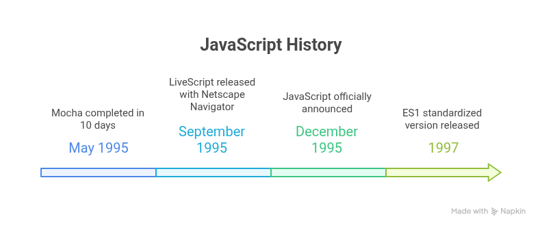

<h3 id="why-did-javascript-need-a-standard-version">Why Did JavaScript Need a Standard Version:</h3>
<p>When JavaScript was first created in 1995 by Netscape, it was only implemented in their browser Netscape Navigator. Shortly, Microsoft launched its own browser, Internet Explorer, and included its own version of JavaScript called JScript. As a result, two distinct versions of JavaScript were emerged in the market:</p>
<ul>
  <li>JavaScript in Netscape Navigator</li>
  <li>JScript in Internet Explorer</li>
</ul>
<p><strong>The Problems:</strong></p>
<ul>
  <li>Different browsers had slightly different implementations of JavaScript.</li>
  <li>Some features worked in one browser but not in another.</li>
  <li>This caused a lot of bugs and confusion for web developers.</li>
  <li>Developers had to write browser-specific code, which made websites harder to build and maintain.</li>
</ul>
<p><strong>The Solution:</strong><br>
To solve this problem, Netscape submitted JavaScript to ECMA International in June 1997, so they could create a standardized specification of the language. This standard was named ECMAScript.</p>

<h3 id="javascript-engines">JavaScript Engines:</h3>
<p>A JavaScript engine is a program built into web browsers (and platforms like Node.js) that is responsible for executing JavaScript code.</p>
<p>It takes the JavaScript you write, then:</p>
<ol>
  <li><a href="#parsing">Parsing</a></li>
  <li>Compiling the <a href="#AST">AST</a> to <a href="#bytecode">Bytecode</a></li>
  <li ><a href="#interpreter">Interpreting</a></li>
  <li id="just-in-time-compiled"><a href="#jit-compilation">JIT Compilation</a></li>
</ol>


<h3 id="netscape-mozila-firefox-transition">Netscape - Mozilla - Firefox: The Transition</h3>
<p>
In the early 1990s, Netscape Navigator was one of the first widely used web browsers. It played a major role in popularizing JavaScript, which was originally built to run inside this browser.

However, by the late 1990s, Netscape began to lose market share due to intense competition from Microsoft’s Internet Explorer, which was bundled for free with Windows. As Internet Explorer dominated the browser market, Netscape couldn't keep up.

So, in 1998, Netscape open-sourced its browser code for the community to build a better browser based on Netscape’s technology. This open-source version was called Mozilla.
However, the early Mozilla browser was slow and bloated, as it still relied heavily on legacy Netscape code.

As a solution, in 2004 Mozilla developers created a lighter, faster, standalone browser called Firefox.
</p>


<h3>Q&A:</h3>
<ol>
<li id="runtime"><strong>Runtime:</strong> Browser runtime refers to the environment provided by the web browser where JavaScript code is executed using a JavaScript engine.</li>
<li id="compiler"><strong>Compiler: </strong>A compiler is a special program that performs compilation — it takes your source code and translates it into machine code</li>
<li id="mocha"><strong>Mocha:</strong> The internal name during early development by Brendan Eich at Netscape; it was never officially released under this name.</li>
<li>
  <p id="parsing"><strong>Parsing: </strong>Parsing is the process where the JavaScript engine reads your code and breaks it down into a structured format (called an AST – Abstract Syntax Tree) so it can understand and execute it.</p>
</li>
<li id="AST">
  <p><strong>Abstract Syntax Tree (AST):</strong><br>
  An AST is a tree-like structure that represents the syntax and structure of your code.
  Each part of your code becomes a node, and all nodes are connected to each other.</p>

<p><strong>Example:</strong></p>
<p><strong>JS Code:</strong><br>
<code>let x = 5 + 3;</code></p>

<p><strong>AST format:</strong></p>
<pre><code>
{
  "type": "Program",
  "body": [
    {
      "type": "VariableDeclaration",
      "kind": "let",
      "declarations": [
        {
          "type": "VariableDeclarator",
          "id": {
            "type": "Identifier",
            "name": "x"
          },
          "init": {
            "type": "BinaryExpression",
            "operator": "+",
            "left": {
              "type": "Literal",
              "value": 5,
              "raw": "5"
            },
            "right": {
              "type": "Literal",
              "value": 3,
              "raw": "3"
            }
          }
        }
      ]
    }
  ],
  "sourceType": "script"
}
</code></pre>

<p>Here, every "type" in the AST (e.g., "Program", "VariableDeclaration", "Literal") is a node.</p>
</li>
<li id="bytecode">
  <p><strong>Bytecode: </strong>Is an intermediate from between your original JavaScript code and the machine.</p>
</li>
<li>
  <p id="interpreter"><strong>Interpreting:</strong> Is a process where the JS engine executes the bytecode step-by-step using an interpreter.</p>
</li>
<li>
  <p id="jit-compilation"><strong>JIT (Just In time) Compilation: </strong>Is a process where the JS engine detects frequently executed “hot” code and compiles it into machine code. On future runs, the engines skips parsing, compiling AST to Bytecode, interpreting and running the machine code directly for faster execution.</p>
</li>
</ol>
<hr>


<h3 id="hello-world" align="center">Hello, world!</h3>

<pre><code>console.log("Hello World");
</code></pre>

<h3 id="whats-happened-behind-the-code">What’s happened behind the code:</h3>
<ol>
  <li>The <a href="#statement">statement</a> sends to the JavaScript Engine</li>
  <li>Parsing</li>
  <li>Compiling AST to Bytecode</li>
  <li>Interpretation</li>
  <li>JIT Compilation</li>
  <li>Calling the <code>log()</code> <a href="#method">method</a> inside the console object.
    <ul>
      <li><code>console</code> is a global object provided by the environment (browser or Node.js)</li>
      <li><code>log</code> is a method of the <code>console</code> object.</li>
      <p>So, <code>console.log("Hello World")</code> is a method call with <code>"Hello World"</code> as its argument.</p>
    </ul>
  </li>
</ol>

<h3>Q&A:</h3>
<ol>
  <li id="statement"><strong>statement:</strong> A single instruction in a programming language that performs an action.</li>
  <li><strong>code:</strong> Any written instructions in a programming language, from one line to many.</li>
  <li><strong>program:</strong> A complete set of code written in a programming language to solve a problem or perform a task.</li>
  <li id="method"><strong>Method: </strong>when a function is stored as a property of an object, it’s called a method.</li>
</ol>
<hr>


<h3 id="variables" align="center">Variables</h3>

<p>A variable is a “named storage” for data. We can declare variables to store data by using the <a href="#keyword">keywords</a>:</p>

<ul>
  <li>var: the old way to declare variables (function-scoped or global-scoped if not function-scoped, can be redeclared and updated in the same scope).</li>
  <li>let: the modern way to declare variables (block-scoped, can be updated but not redeclared in the same scope).</li>
  <li>const: declares constant variables (block-scoped, cannot be reassigned or redeclared; must be initialized at the time of declaration).</li>
</ul>

<p><strong>Variable Declaration:</strong></p>
<pre><code>let message;
</code></pre>

<p><strong>Variable Initialization:</strong></p>
<pre><code>let message = 'Hello World';
</code></pre>

<p><strong>Variable assignment:</strong></p>
<pre><code>let message = 'Hello World';
message = 'Hello Universe'
</code></pre>

<p><strong>Note:</strong> initialization gives a variable its first value, while assignment gives a variable a new value after it has been initialized.</p>


<h3 id="scope">Scope</h3>
<p>Scope determines where variables can be accessed or referenced in your code. There are 4 types of scopes in js:</p>
<ul>
<li>Block Scope</li>
<p>A variable has block scope if it is declared with let or const inside a block ({ }). It is accessible only within that block.</p>

<pre><code>
if (true) {
  let age = 25;
  const city = "Dhaka";
  console.log(age, city); // 25 Dhaka
}

console.log(age);  //  Error
console.log(city); //  Error
</code></pre>

<li>Function Scope</li>
<p>A variable has function scope if it is declared inside a function. It is accessible only within that function.</p>

<pre><code>
function sayHello() {
    let message = "Hello";
    console.log(message); // Hello    
}

sayHello();
console.log(message); // Error: message is not defined
</code></pre>

<li>Global Scope</li>
<p>A variable has global scope if it is declared outside of any function or block. It is accessible from anywhere in the code.</p>

<pre><code>
let name = "Tamim";

function greet() {
    console.log("Hi", name); // Hi Tamim
}

greet();
console.log(name); // Tamim
</code></pre>

<li>Lexical Scope (Static Scope)</li>
<p>Lexical scope means You can access variables from outer to inner scope,
but not from inner to outer scope.</p>

<pre><code>
function outer() {
    let outerVar = "I'm outer";

    function inner() {
        console.log(outerVar); //  Lexical scope
    }

    inner();
}
outer(); // Output: I'm outer
</code></pre>

</ul>

<h4>Scope Chain</h4>
<p>When you try to access a variable:</p>
<ul>
<li>JavaScript first looks in the current scope</li>
<li>If not found, it goes to the outer scope</li>
<li>This continues until it reaches the global scope</li>
</ul>

<pre><code>

let globalVar = "Global";

function outer() {
    let outerVar = "Outer";

    function inner() {
        let innerVar = "Inner";
        console.log(globalVar);
        console.log(outerVar);
        console.log(innerVar);
    }

    inner();
}

outer();

/*
Global 
Outer
Inner
*/s
</code></pre>


<h3 id="difference-between-var-and-let">Difference between <code>var</code> and <code>let</code>:</h3>

<table>
  <thead>
    <tr>
      <th><code>var</code></th>
      <th><code>let</code></th>
    </tr>
  </thead>
  <tbody>
    <tr>
      <td>
        var is function scope:<br><br>
        It means a variable declared with var is accessible anywhere inside the same function, no matter which block it was declared in.
        <pre><code>function testScope() {
    if (true) {
        var x = 10;
    }
    console.log(x); // output: 10 
}
testScope();</code></pre>
      </td>
      <td>
        let is block-scoped:<br><br>
        It means a variable declared with let is accessible only inside the block {} where it is declared.
        <pre><code>function testScope() {
    if (true) {
        let x = 10;
    }
    console.log(x); // output: Error
}
testScope();</code></pre>
      </td>
    </tr>
    <tr>
      <td>
        Global-scoped (if not in a function):<br><br>
        If you declare a variable using var outside any function, even inside a block (like if, for), it becomes globally scoped.
        <pre><code>if (true) {
    var test = true; 
}
console.log(test); // output: true</code></pre>
      </td>
      <td>
        Still block-scoped:<br><br>
        let remains limited to the block, even when declared outside any function.
        <pre><code>if (true) {
    let test = true;
}
console.log(test); // output: error</code></pre>
      </td>
    </tr>
    <tr>
      <td>Allows redeclaration:
        <pre><code>var user = 'tamim';
var user;
user = 'Muhammad Tamim'
console.log(user) // Output: Muhammad Tamim</code></pre>
      </td>
      <td>Does not allow redeclaration:
        <pre><code>let user;
let user; // SyntaxError:</code></pre>
      </td>
    </tr>
  </tbody>
</table>

<h3 id="var-hoisting-issue">var hoisting issue:</h3>

<p>In JavaScript, var declarations are hoisted — this means the declaration is moved to the top of the function (or top of the global scope if outside a function) during the JavaScript parsing phase.</p>

<h4>Example 1:</h4>

<pre><code>function sayHi() {
    phrase = "Hello";
    console.log(phrase);

    var phrase;
}
sayHi(); // Output: "Hello"
</code></pre>

<pre><code>/**
 * Behind the scene:
 function sayHi() {
  var phrase;         // Declaration is hoisted
  phrase = "Hello";   // Assignment stays in place
  console.log(phrase);
}
 */</code></pre>

<h4>Example 2:</h4>

<pre><code>function sayHi() {
    phrase = "Hello"; 

    if (false) {
        var phrase; 
    }

    console.log(phrase);
}
sayHi(); // Output: "Hello"
</code></pre>

<h4>Example 3:</h4>

<pre><code>function sayHi() {
    console.log(phrase);

    var phrase = "Hello";
}
sayHi(); // Output: undefined
</code></pre>

<pre><code>/**
 *Behind the scene:
 function sayHi() {
  var phrase;           // Hoisted declaration
  console.log(phrase);  //  undefined (no value yet)
  phrase = "Hello";     // Assignment happens here
} 
 */</code></pre>

<h3 id="variable-naming-convention">Variable naming conventions:</h3>
<ul>
<li>Names must start with a letter, underscore _, or dollar sign $</li>
<li>Names can contain letters, digits, _, and $ — but no spaces or symbols</li>
<li>Names are Case-sensitive</li>
<li>Names Cannot contain JavaScript reserved keywords</li>
</ul>


<h3 id="how-to-write-long-variable-name">How to write a long variable name</h3>
<ul>
<li><strong>Snake Case</strong> - let my_current_home_address = "Barisal";
</li>
<li><strong>Camel Case (recommended)</strong> - let myCurrentHomeAddress = "Barisal";
</li>
<li><strong>Pascal Case</strong> - let MyCurrentHomeAddress = "Barisal";</li>
</ul>


<h3>Q&A</h3>
<ol>
  <li id="keyword">A keyword is a reserved word that has a special meaning in the language.</li>
  <h4>Official Keywords (ES2024):</h4>
<pre><code>
await      break      case       catch      class
const      continue   debugger   default    delete
do         else       enum       export     extends
false      finally    for        function   if
import     in         instanceof new        null
return     super      switch     this       throw
true       try        typeof     var        void
while      with       yield
</code></pre>
</ol>
<hr>


<h3 id="memory-management" align="center">Memory Management</h3>

<p>Memory management in JavaScript refers to how the JavaScript engine allocates, uses, and frees up memory as your code runs.</p>

<h4>Two Main Memory Phases in JS:</h4>
<ul>
<li>Allocation: JS reserves memory for your variables, objects, etc.</li>
<li>Release: automatically frees memory that’s no longer used by garbage collector to avoid <a href="#memory-leak">memory leak</a></li>
</ul>

<h4>How GC Decides What to Remove?</h4>
<p>It uses a concept called Reachability. Means a value is “reachable” if it can be accessed or used in some way.</p>
<p>Examples of reachable values:</p>
<ul>
<li>Any global variable</li>
<li>Local variables in currently running functions</li>
<li>Objects or values referenced by other reachable objects</li>
</ul>

<p>Example:</p>
<pre><code>
let user = {
  name: "Tamim"
};

user = null;
</code></pre>

<p>What happened:</p>
<ul>
<li>First, user references the object → memory is used.</li>
<li>Then user = null → the object is no longer reachable.</li>
<li>Garbage Collector will remove the object from memory.</li>
</ul>

<h3>Q&A</h3>
<ul>
<li>
<h3>Memory Leak:</h3>
<p>A memory leak happens when your program keeps using memory that it no longer needs.</p>
</li>
</ul>


<h3 id="operators" align="center">Operators</h3>

<p><strong>Operator:</strong> An Operator is a special symbol or keyword that performs an operation on one or more values.</p>


<h3>Different types of Operators:</h3>
<ul>
<li>                                                              
<h3 id="arithmetic-operator">Arithmetic Operators (+, -, *, /, %, **):</h3>

<pre><code>
console.log(2 + 3); // 5
console.log(5 - 2); // 3
console.log(4 * 2); // 8

console.log(10 / 50); // 0.2
console.log(10 % 50) // 10
console.log(50 / 10) // 5
console.log(50 % 10) // 0
// Note: For a perfect division, the dividend > divisor.
</code></pre>
  
<h3>** (Exponentiation):</h3>
<p>a ** b = a<sup> b</sup></p>

<p>Example:</p>
<pre>
<code>console.log(2 ** 2); // 2² = 4
console.log(2 ** 3); // 2³ = 8
console.log(2 ** 4); // 2⁴ = 16
console.log(4 ** (1 / 2)); // 2 (power of 1/2 is the same as a square root)
console.log(8 ** (1 / 3)); // 2 (power of 1/3 is the same as a cubic root)
</code>
</pre>


<h3>String concatenation with +:</h3>
<pre>
<code>let s = "my" + "string";
console.log(s); // mystring
</code>
</pre>

<p><strong>Note:</strong> If any of the <a href="#operands">operands</a> is a string, then the other one is converted to a string too.</br>
</p>

<pre>
<code>console.log('1' + 2); // "12"
console.log(2 + '1'); // "21"
console.log(2 + 2 + '1'); // "41" and not "221"
console.log('1' + 2 + 2); // "122" and not "14"
</code>
</pre>


<p><strong>Note: </strong>The + is the only operator that supports strings concatenation. Other arithmetic operators work only with numbers and always convert their operands to numbers.</p>

<pre>
<code>console.log(6 - '2'); // 4, converts '2' to a number
console.log('6' / '2'); // 3, converts both operands to numbers
</code>
</pre>
</li>

<li>
<h3 id="assignment-operator">Assignment Operators (=, +=, -=, *=, /=):</h3>
<pre><code>
let x = 10;
x += 5;  // x = x + 5
x -= 2;  // x = x - 2
x *= 3;  // x = x * 3
x /= 2;  // x = x / 2
</code></pre>
</li>

<li>
  <h3 id="increment-decrement-operator">Increment / Decrement Operators (--, ++):</h3>
<h4>Pre Increment / Decrement:</h4>
<pre>
<code>let i = 10;
let x = ++i;
console.log(i); // 11
console.log(x); // 11
</code>
</pre>
<p>Explanation: : Here, i is incremented to 11 first, and then this new value is assigned to x. Both i and x are 11 after this operation.</p>


<h4>post Increment / Decrement:</h4>
<pre>
<code>let i = 10;
let x = i++;
console.log(i); // 11
console.log(x); // 10
</code>
</pre>
<p>Explanation: here, First, the value of i (which is 10) is assigned to the variable x. After that, i is incremented, so i becomes 11.</p>

<p><strong>Note:</strong></p>
<ul>
<li>Pre-increment (++i): First increments the value of i, then assigns it.</li>
<li>Post-increment (i++): First assigns the value, then increments it.</li>
</ul>

</li>

<li>
  <h3 id="comparison-operator"> Comparison Operator (>, <, >=, <=, ==, ===, !=, !==):</h3>
  <pre><code>
console.log(5 > 3);     // true
console.log(5 < 3);     // false
console.log(5 >= 5);    // true
console.log(3 <= 2);    // false
console.log(5 == '5');  // true
console.log(5 === '5'); // false
console.log(5 != '5');  // false
console.log(5 !== '5'); // true
  </code></pre>

<h3>String comparison:</h3>
<p>To see whether a string is greater than another, JavaScript uses the so-called lexicographical algorithm.</p>

<p>How lexicographical algorithm works:</p>
<ol>
  <li>Strings are compared character by character from left to right.</li>
  <li>Each character is compared based on its Unicode value.</li>
  <li>The first difference determines the result.</li>
  <li>If all characters are equal and lengths differ, the shorter string is considered smaller.</li>
</ol>

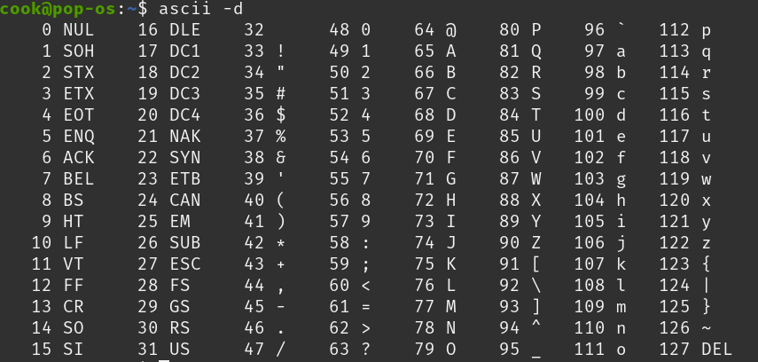

<pre><code>console.log('Z' > 'A'); // true
console.log('hello' == 'hello'); // true
console.log('Glow' > 'Glee'); // true
console.log('Be' < 'Bee'); // true
</code></pre>

<h4>How to see unicode or Ascii values in js:</h4>

<pre><code>
console.log('a'.charCodeAt(0)); // Output: 97
console.log('a'.codePointAt(0)); // Output: 97
</code></pre>

<h4>Difference between == and === :</h4>
<pre><code>console.log(0 == false); // 0 == 0 true
console.log('' == false); // 0 == 0 true
</code></pre>

<p>In both cases, JavaScript uses type conversion to convert different data types (string/boolean) into numbers before comparing with ==.</p>

<p><strong>Solution:</strong> === strictly checks both value and data type. If one of them missing, it immediately returns false.</p>

<pre><code>console.log(0 === false); // false
console.log('' === false); // false
console.log(0 === 0); // true
console.log('' === ''); // true
</code></pre>


<h4>Comparison with null and undefined:</h4>
<pre><code>console.log(null === undefined); // false
console.log(null >= undefined); // false
console.log(null < undefined); // false
console.log(null == undefined); // true
// this is a special rule. If you use ==, null and undefined are considered equal.
</code></pre>


<h4>null vs 0:</h4>
 <pre><code>console.log(null > 0);  // false
console.log(null == 0); // false
console.log(null >= 0); // true 
</code></pre>


<h4>undefined vs 0:</h4>
 <pre><code>console.log(undefined > 0); // false 
console.log(undefined < 0); // false 
console.log(undefined == 0); // false
// undefined is converted to NaN in numeric comparisons
</code></pre>
</li>

<li>
  <h3 id="logical-operator">Logical Operators (&&, ||, ! ,, !!)</h3>

<pre><code>
let age = 25;
if (age > 18 && age < 30) {
  console.log("Young Adult");
}

const isLoggedIn = true;
const userName = "Tamim";

isLoggedIn && console.log("Welcome, " + userName);
// Output: Welcome, Tamim


let day = "Saturday";
if (day === "Saturday" || day === "Sunday") {
  console.log("Weekend");
}

let loggedIn = false;
if (!loggedIn) {
  console.log("Please log in");
}

let username = "Tamim";

if (!!username) {
    console.log("Username is set"); // Username is set
} else {
    console.log("Please enter a username");
}

console.log(!!"hello"); // true
console.log(!!42); // true
console.log(!!{}); // true
console.log(!![]); // true

console.log(!!""); // false
console.log(!!0); // false
console.log(!!null); // false
console.log(!!undefined); // false
console.log(!!NaN); // false

</code></pre>
</li>

<li>
<h3 id="conditional-operator">Conditional Operators (if, else, else if, ? :, switch, case):</h3>

<pre><code>
let age = 20;

if (age < 18) {
  console.log("Minor");
} else if (age === 18) {
  console.log("Exactly 18");
} else {
  console.log("Adult");
}
</code></pre>
</li>

<h3>Ternary operator(? :):</h3>
<p>syntax:</p>
<pre><code>condition ? true part : false part</code></pre>

<p>Example:</p>

<pre><code>
let age = 18;
let message;

if (age >= 18) {
    message = "You are an adult";
} else {
    message = "You are a minor";
}
console.log(message);
</code></pre>

<pre><code>// with ternary operator
let age = 18;
let message = (age >= 18) ? "You are an adult" : "You are a minor";
console.log(message);
</code></pre>

<h3> switch...case:</h3>

<pre><code>
let color = "green";

switch (color) {
  case "red":
    console.log("Stop");
    break;
  case "green":
    console.log("Go");
    break;
  case "yellow":
    console.log("Wait");
    break;
  default:
    console.log("Unknown color");
}
// switch checks one variable against multiple cases and runs the matched block.
</code></pre>


<h3 id="truthy-and-falsy-values">Truthy and Falsy values:</h3>
<p>In JavaScript, any value used in a conditional statement gets automatically converted to true or false.</p>

<p>There are 8 total falsy values in js, everything else is truthy:</p>
<ol>
<li>false</li>
<li>0</li>
<li>-0</li>
<li>0n (BigInt)</li>
<li>""</li>
<li>null</li>
<li>undefined</li>
<li>NaN</li>
</ol>

<pre><code>
// None of the console.log() will run because all the values are falsy.

if (false) console.log('Falsy');
if (0) console.log('Falsy');
if (-0) console.log('Falsy');
if (0n) console.log('Falsy');
if ("") console.log('Falsy');
if (null) console.log('Falsy');
if (undefined) console.log('Falsy');
if (NaN) console.log('Falsy');
</code></pre>


</li>
<li>
  <h3 id="others-operator">Others Operators</h3>

<h4 id="the-typeof-operator">typeof operator:</h4>

<pre><code>
console.log(typeof undefined); // "undefined"

console.log(typeof 0); // "number"

console.log(typeof 10n); // "bigint"

console.log(typeof true); // "boolean"

console.log(typeof "foo"); // "string"

console.log(typeof Symbol("id")); // "symbol"

console.log(typeof Math); // "object"  

console.log(typeof null); // "object"  

console.log(typeof alert); 
/*
you will get "function" as output 
if you use browser console, in node 
you will get "undefined"
*/  
</code></pre>

<p><strong>Note:</strong></p>
<ul>
  <li>typeof null return "object", but null is a primitive data type.
  </li>
  <li>typeof alert returns "function", but functions are technically objects. 
  </li>
</ul>
</li>

<li>
<h3 id="rest-spread">rest and spread operator</h3>

<ol>
<li><h3>rest</h3></li>
<p>Rest gathers values into an array or object. It is used defining things like Function parameters, array destructuring, object destructuring.
</p>

<h4>In function parameter:</h4>

<pre><code>
function multiply(multiplier, ...numbers) {
    console.log(multiplier);
    console.log(numbers);

}

multiply(2, 1, 2, 3);
multiply(3, 4, 5, 6);

/*
2
[ 1, 2, 3 ]
3
[ 4, 5, 6 ]
*/
</code></pre>

<h4>In array destructuring:</h4>

<pre><code>
const [first, ...rest] = [1, 2, 3, 4];
console.log(first); // 1
console.log(rest);  // [2, 3, 4]
</code></pre>

<h4>In object destructuring:</h4>

<pre><code>
const user = { name: "Tamim", age: 21, country: "BD" };
const { name, ...rest } = user;

console.log(name); // Tamim
console.log(rest); // { age: 21, country: "BD" }
</code></pre>


<li><h3>spread</h3></li>
<p>Spreads (breaks) an array or object into individual values. It is Used in Function calls, array literals and object literals.
</p>

<h4>In function call:</h4>

<pre><code>
function greet(a, b, c) {
    console.log(a, b, c);
}

const args = [1, 2, 3];
greet(args); // [ 1, 2, 3 ] undefined undefined
greet(...args); // 1 2 3
console.log(...args) // 1 2 3
</code></pre>

<h4>In Arrays</h4>

<pre><code>
const 
nums1 = [1, 2];
const Block Scopenums2 = [3, 4];
const all = [...nums1, ...nums2];
console.log(all); // [1, 2, 3, 4]
</code></pre>


<h4>In Objects:</h4>
<pre><code>
const user1 = { name: "Tamim" };
const user2 = { age: 21 };
const merged = { ...user1, ...user2 };
console.log(merged); // { name: "Tamim", age: 21 }
</code></pre>
</li>
</ol>

<li>
<h3 id="Nullish-Coalescing-operator">Nullish Coalescing operator</h3>

<p>The nullish coalescing operator (??) is used to provide a default value when a variable is null or undefined.</p>

<h4>Use cases:</h4>

<ol>
<li>
<p>Providing default values:</p>

<pre><code>
function greet(name) {
  let user = name ?? "Guest";
  console.log("Hello, " + user);
}

greet(null);   // Hello, Guest
greet("John"); // Hello, John
</code></pre>
</li>
<li>
<p>Safely accessing object properties:</p>

<pre><code>
let user = {
    age: 0,
    name: ""
};

console.log(user?.name ?? "Anonymous"); // "" (not nullish)
console.log(user?.email ?? "No email"); // "No email"

const user2 = {
    name: 'Rahim',
    address: { city: 'Dhaka' }
};

const city = user2?.address?.city ?? "City not available";
console.log(city); // Dhaka


const postalCode = user?.address?.postalCode ?? "Postal code not available";
console.log(postalCode); // Postal code not available
</code></pre>
</li>
</ol>


<h4>|| vs ??:</h4>

<pre><code>
let value1 = 0;
let result1 = value1 || 100;
let result2 = value1 ?? 100;

console.log(result1); // 100 (because 0 is falsy)
console.log(result2); // 0   (because 0 is NOT null or undefined)
</code></pre>

<h4>Nested Nullish Coalescing:</h4>

<pre><code>
let a;
let b = null;
let c = undefined;
let d = "Hello";

let result = a ?? b ?? c ?? d ?? "Fallback";
console.log(result); // "Hello"

// It returns the first non-nullish value.
</code></pre>

<h4>You cannot mix ?? with || or && without parentheses:</h4>

<pre><code>
// SyntaxError:
let result = null || undefined ?? "Default";

// Fix:
let result = (null || undefined) ?? "Default";
</code></pre>
</li>

</ul>


<h3>Q&A:</h3>
<ol>
  <li id="operands">Operand : </strong>An operand is the value that an operator works on. For example, in 5 * 2, the operands are 5 and 2.</li>
</ol>
<hr>


<h3 id="loops" align="center">Loops</h3>

<h4 id="for-loop">for loop:</h4>

<pre><code>
for (let i = 0; i < 5; i++) {
    console.log(i); // 0 1 2 3 4
}

// With break and continue

for (let i = 1; i <= 10; i++) {
  if (i % 2 === 0) {
    continue; // skip even numbers
  }

  if (i === 7) {
    break; // stop the loop when i is 7
  }

  console.log(i);
}
/*
1
3
5
*/
</code></pre>

<h4 id="while-loop">while loop:</h4>

<pre><code>
let i = 0;
while (i < 5) {
    console.log(i); // 0 1 2 3 4
    i++;
}
</code></pre>


<h4 id="do-while-loop">do while loop:</h4>

<pre><code>
let i = 0;
do {
    console.log(i); // 0 1 2 3 4
    i++;
} while (i < 5);
</code></pre>


<h4 id="for-of-loop">for..of loop ( for <a href="#iterable">iterables</a>(array & string) ) :</h4>

<pre><code>
// with array
const arr = ['a', 'b', 'c'];

for (const element of arr) {
    console.log(element); //  a b c
}

// with string
const str = 'hello';

for (const value of str) {
    console.log(value); // h e l l o
}
</code></pre>

<h4 id="for-each-method">forEach method (only for array):</h4>

<pre><code>
const nums = [1, 2, 3];
nums.forEach(function (num) {
    console.log(num); // 1 2 3
});

// or

const num2 = [4, 5, 6];
num2.forEach(num2 => console.log(num2)) // 4 5 6
</code></pre>
<p>Note: It does not support break or continue.</p>

<h4 id="for-in-loop">for..in loop (for objects): </h4>

<pre><code>
const obj = {
    a: 1,
    b: 2
};

for (const key in obj) {
    console.log(key, obj[key]);
}
/*
a 1
b 2
*/
</code></pre>

<h3>Q&A:</h3>
<ul>
  <li id="iterable"><p><strong>Iterable: </strong>An iterable(array, string) is something that you can use in a for...of loop to get values one by one.</p></li>
  <p>Or you can say:</p>
  <p>If we use a for...of loop on arrays or strings, we get one value at a time —
That’s because arrays and strings are iterables,
and the act of looping one-by-one is called iteration.</p>
</ul>
<hr>


<h3 id="data-types" align="center">Data Types</h3>

<p>A data type defines the kind of value a variable can hold (like a Number, String, Boolean, etc.)</p>
<p>JavaScript is a <strong>dynamically typed language</strong>, which means:</p>
<ul>
  <li>You don’t have to declare the type of a variable.</li>
  <li>The type is determined automatically based on the value you assign.</li>
</ul>

<pre><code>let message = "hello"; // string
message = 123456;      // number
</code></pre>

<p>There are 8 data types in JavaScript:</p>
<ol>
<h4>7 Primitive Data Types:</h4>
<li>Number</li>
<li>BigInt</li>
<li>String</li>
<li>Boolean</li>
<li>Null</li>
<li>Undefined</li>
<li>Symbol</li>
<h4>1 Non-Primitive(object) Data Types:</h4>
<li>Object</li>
<h4>subtypes of the Object data type:</h4>
<ul>
  <li>object</li>
  <li>Function</li>
  <li>Array</li>
</ul>
</ol>

<h3 id="7-primitive-data-types" align="center">7 primitive data types</h3>

<h3 id="number" align="center">Number</h3>
<p><strong>number</strong> – Represents both integers and floating-point numbers.<br>
      Example: 
    </p>  

<pre><code>
let age = 25;
let money = 25.5345;

console.log("Age:", age); // Outputs: Age: 25
console.log("Money:", money.toFixed(2)); // Outputs: Money: 25.53
</code></pre>
    

<h3>Math Properties:</h3>
<pre><code>console.log(Math.PI);       // 3.141592653589793</code></pre>

<h3 id="math-methods">Math Methods:</h3>

<pre><code>console.log(Math.round(4.5)); // 5 
/*
Rounds to the nearest integer:
if number >= 0.5, it rounds up to the next integer
if number < 0.5, it rounds down to the previous integer
*/
console.log(Math.floor(4.9));   // 4 → Rounds down
console.log(Math.ceil(4.1));    // 5 → Rounds up
console.log(Math.trunc(4.9));   // 4 → Removes decimal part (not supported IE)


console.log(Math.pow(2, 3));    // 8 → 2 to the power of 3
console.log(Math.sqrt(25));     // 5 → Square root of 25
console.log(Math.abs(-7));      // 7 → remove negative sign

console.log(Math.min(3, 1, 7)); // 1 → Smallest number
console.log(Math.max(3, 1, 7)); // 7 → Largest number

console.log(Math.random());     // Random decimal between 0 (inclusive) and 1 (exclusive)
console.log(Math.random() * 10); // Random decimal between 0 (inclusive) and 10 (exclusive)
console.log(Math.random() * 100); // Random decimal between 0 (inclusive) and 100 (exclusive)
console.log(Math.floor(Math.random() * 10)); // Random integer between 0 (inclusive) and 10 (exclusive)
console.log(Math.floor(Math.random() * 100)); // Random integer between 0 (inclusive) and 100 (exclusive)
</code></pre>

<h3 id="type-conversion-methods">Type conversion methods: </h3>

<pre><code>
console.log(parseInt("123"));       // 123
console.log(parseInt("12.34"));     // 12
console.log(parseInt("100px"));     // 100
console.log(parseInt("abc"));       // NaN
console.log(parseInt(true));       // NaN

console.log(parseFloat("10"));         // 10
console.log(parseFloat("12.34"));     // 12.34
console.log(parseFloat("100px"));     // 100
console.log(parseFloat("3.14hello")); // 3.14
console.log(parseFloat("abc"));       // NaN

console.log(Number("5"));        // 5
console.log(Number("12.34"));    // 12.34
console.log(Number(true));       // 1
console.log(Number(false));      // 0
console.log(Number(""));         // 0
console.log(Number("hello"));    // NaN

console.log(String(123));       // "123"
console.log(String(true));      // "true"
console.log(String(false));     // "false"
console.log(String(null));      // "null"
console.log(String(undefined)); // "undefined"
console.log(String([1, 2, 3])); // "1,2,3"

console.log(Boolean(0));           // false
console.log(Boolean(1));           // true
console.log(Boolean(""));          // false
console.log(Boolean("Tamim"));     // true
console.log(Boolean(null));        // false
console.log(Boolean(undefined));   // false
console.log(Boolean([]));          // true (empty array is truthy)
console.log(Boolean({}));          // true (empty object is truthy)
</code></pre>

<hr>


<ul>
<h3 id="bigint" align="center">BigInt</h3>
    <p><strong>bigint</strong> – Used for integers larger than <code>2<sup>53</sup> - 1</code>.<br>
      Example: <code>let big = 12345678901234567890n;</code>
    </p>


<h3 id="string" align="center">String</h3>
    <p><strong>string</strong> – Represents text, enclosed in single or double quotes.<br>
      Example: 
      <pre><code>let name = "Tamim";
let myName = 'tamim';</code></pre>
    </p>

<h3>Quotes:</h3>
<p>JavaScript supports three types of quotes for working with strings.</p>

<ol>
  <li>Single Quotes ('...'):</li>

  <pre><code>const name = 'Tamim';
console.log(name); // Tamim</code></pre>
  
  <li>Double Quotes ("..."):</li>

  <pre><code>const language = "JavaScript";
console.log(language); // JavaScript</code></pre>

  <li>Backticks (`...`):</li>
  <p>Backticks are more powerful than single/double quotes. They were introduced in ES6 (2015) and allow for:</p>
  <ul>
    <li>Multiline Strings (<small>No need for \n</small>):</li>
    
  <pre><code>const multiline = `This is line 1
This is line 2
This is line 3`;
console.log(multiline);
</code></pre>
    
  <li>String Interpolation (Insert Variables Directly):</li>
  
  <pre><code>const name = "Tamim";
const age = 20;

const info = `My name is ${name} and I am ${age} years old.`;
console.log(info);
// My name is Tamim and I am 20 years old.
</code></pre>
  
  <li>Expression Evaluation:</li>  
  <pre><code>console.log(`5 + 7 = ${5 + 7}`); // 5 + 7 = 12</code></pre>
  </ul>
</ol>

<h3>String Property: </h3>
<p>.length is the only string property, and it’s very commonly used.</p>

<pre><code>const str = "JavaScript";
console.log(str.length); // 10
</code></pre>

<h3 id="string-methods">String Methods:</h3>

<ul>
<li>
<p><strong>Case Conversion:</strong><p>

<pre><code>console.log("hello".toUpperCase()); // "HELLO"
console.log("WORLD".toLowerCase()); // "world"
console.log('Interface'[0].toLowerCase()); // 'i'
</code></pre>
</li>

<li>
<p><strong> Searching in Strings:</strong></p>

<pre><code>console.log("JavaScript".includes("Script")); // true
console.log("JavaScript".startsWith("Java")); // true
console.log("JavaScript".endsWith("Script")); // true
console.log("hello world".indexOf("world")); // 6
</code></pre>

<p>Note: indexOf() method searches a string for a specific substring and returns the index (position) of the first match of found and -1 if nothing can be found.</p>
<p>syntax:</p>
<pre><code>string.indexOf(searchValue, startIndex);</code></pre>

<ul>
  <li>searchValue – the substring to find</li>
  <li>startIndex (optional) – where to start the search (default is 0)</li>
</ul>

<p>More Examples: </p>

<pre><code>console.log("banana".indexOf("a"));      // 1 → first "a"
console.log("banana".indexOf("a", 2));   // 3 → next "a" after index 2
console.log("banana".indexOf("z"));      // -1 → not found
</code></pre>
</li>
<li>
<h4>Extracting Part of a String: </h4>

<p>slice(start, end): </p>

<p>The slice() method returns a part of the string, starting from the given start index and ending just before the end index. If the second argument is not provided, the method extracts characters from the start index to the end of the string. Additionally, slice() supports negative values, which count from the end of the string instead of the beginning.</p>

<pre><code>const text = "JavaScript";

console.log(text.slice(0, 4));    // "Java" (from index 0 to 3)
console.log(text.slice(4))        // "Script" (from index 4 to the end)
console.log(text.slice(-4, -1));  // "rip" (start at the 4th position from the right, end at the 2nd position from the right)</code></pre>
</li>


<li>
<h4>Joining and Splitting:</h4>

<pre><code>const sentence = "I love JavaScript";
const words = sentence.split(" "); // ["I", "love", "JavaScript"]
console.log(words.join("-"));      // "I-love-JavaScript"
</code></pre>
</li>
<li>
<h4>trim() - for removing white space before and after:</h4>

<pre><code>
const str = " hello world! ";
const trimmedStr = str.trim();
console.log(trimmedStr); // Output: "hello world!"
</code></pre>
</li>
<li>
<h4>trimStart()/trimEnd() or trimLeft()/trimRight()- for removing white space from specific side:</h4>

<pre><code>
const str = "          hello world! ";
console.log(str) // Output: "          hello world! "

const trimmedStr = str.trimStart();
const trimmedEndStr = str.trimEnd();
console.log(trimmedStr); // Output: "hello world! "
console.log(trimmedEndStr); // Output: "          hello world!"
</code></pre>
</li>
<li>
<h4>Replacing and Repeating:</h4>

<pre><code>
console.log("I like cats. cats are sweet".replace("cats", "dogs")); // I like dogs. cats are sweet
console.log("I like cats. cats are sweet".replaceAll('cats', "dogs")); // "I like dogs. dogs are sweet"
console.log("ha".repeat(3)); // "hahaha"
</code></pre>
</li>


<li>
<h3>includes, startsWith, endsWith: </h3>

<pre><code>const message = "Hello, Tamim!";
console.log(message.includes("Tamim")); // true
console.log(message.includes("hello")); // false (case-sensitive)

const greeting = "JavaScript is fun!";
console.log(greeting.startsWith("Java"));   // true
console.log(greeting.startsWith("Script")); // false
console.log(greeting.startsWith("Script", 4)); // true (starts checking from index 4)

const fileName = "report.pdf";
console.log(fileName.endsWith(".pdf"));  // true
console.log(fileName.endsWith(".txt"));  // false
console.log("JavaScript".endsWith("Script", 10)); // true
console.log("JavaScript".endsWith("Java", 4));    // true</code></pre>
</li>
<li>
<h3>concat:</h3>

<pre><code>
const str1 = "Hello";
const str2 = "World";
const result = str1.concat(" ", str2);
console.log(result); // "Hello World"

const result2 = "I".concat(" love", " JavaScript");
console.log(result2); // "I love JavaScript"
</code></pre>
</li>


<li>
<h3>String Reverse:</h3>

<pre><code>
const sentence = 'hello';
let reverse = '';
for (const letter of sentence) {
    reverse = letter + reverse;
}
console.log(reverse); // olleh


// or using build in methods
const str = "hello";
const reversed = str.split("").reverse().join("");
console.log(reversed); // Output: "olleh"

const split = str.split("");
console.log(split); // Output: ['h', 'e', 'l', 'l', 'o']

const reversedArray = split.reverse();
console.log(reversedArray); // Output: ['o', 'l', 'l', 'e', 'h']

const joined = reversedArray.join("");
console.log(joined); // Output: "olleh"
</code></pre>
</li>
</ul>
</ul>

<h3>Strings are immutable:</h3>
<p>That's mean you can't change characters directly: </p>

<pre><code>let str = "Hello";
str[0] = "Y";
console.log(str); // "Hello" (not "Yello")
</code></pre>

<p> You must create a new string instead: </p>
<pre><code>let str = "Hello";
let newStr = "Y" + str.slice(1);
console.log(newStr); // "Yello"
</code></pre>
<hr>


<h3 id="boolean" align="center">Boolean</h3>
    <p><strong>boolean</strong> – Represents true or false.<br>
      Example: 
      <pre><code>let isMarried = false;
let isSingle = true;</code></pre>
    </p>


<h3 id="null" align="center">Null</h3>
    <p><strong>null</strong> – Represents intentional "no value".<br>
      Example: <code>let data = null;</code>
    </p>


<h3 id="undefined" align="center">Undefined</h3>    
<p><strong>undefined</strong> – It is a primitive data type and default value given by JavaScript when a variable:<br></p>

<ul>
<li>Is declared but not initialized</li>
<li>Is declared but not initialized</li>
<li>Doesn’t find the property you asked for</li>
</ul>

<h3>Common cases when you get undefined:</h3>
 
<pre><code>
//  Variable declared but not assigned
let a;
console.log(a); // undefined

// Function without return
function sayHello() {
    console.log("Hello");
}

const result = sayHello();
console.log(result); // undefined

// Accessing nonexistent object property
const user = { name: "Tamim" };
console.log(user.age); // undefined

// Array element is missing
const arr = [1, , 3];
console.log(arr[1]); // undefined

// Function parameter is not passed
function greet(name) {
    console.log("Hello " + name);
}

greet(); // Hello undefined

//  Return statement with no value
function test() {
    return;
}

console.log(test()); // undefined

// Destructuring failure
const person = { name: "Alice" };
const { age } = person;
console.log(age); // undefined
</code></pre>
    


<h3 id="symbol" align="center">Symbol</h3>
    <p><strong>symbol</strong> – Represents a unique and immutable value, mainly used to create unique identifiers for object properties.<br>
      Example: </p>
<pre><code>
let id = Symbol();

console.log(typeof id); // "symbol"

let a = Symbol("id");
let b = Symbol("id");
console.log(a === b); // false
</code></pre>


<h3 id="1-non-primitive-data-types" align="center">1 Non-Primitive Data Types (Object)</h3>
<p>In JavaScript, any data that is not a primitive is as an object. There are 3 commonly used objects in JavaScript (object, function, array):</p> 


<h3 id="object" align="center">Objects:</h3>

<p>An object is a collection of key-value pairs called properties. where key is a string (also called a “property name”), and value can be anything.</p>

<pre><code>let user = {   
  name: "John",  
  age: 30        
}
</code></pre>

<p>In the user object, there are two properties:</p>
<ol>
  <li>The first property has the key "name" and the value "John".</li>
  <li>The second one has the key "age" and the value 30.</li>
</ol>

<p>The user object can be imagined as a cabinet with two signed files labeled “name” and “age”:</p>
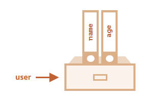

<p>We can add, remove and read files from it at any time by the using of dot or bracket notation:</p>

<pre><code>
let user = {
    name: "John",
    age: 30
}

console.log(user.name); // John
console.log(user.age); // 30
user.location = "USA";
console.log(user.location); // USA
delete user.location;
console.log(user.location); // undefined
</code></pre>

<p>We can also use multi-word property names, but then they must be quoted and when read the peppery value we need to use bracket notation.</p>

<pre><code>let user = {
    name: "John",
    age: 30,
    "like birds": true,
}
console.log(user["like birds"]); // true
</code></pre>

<p>In real code, we often use existing variables as values for property names:</p>

<pre><code>function makeUser(name, age) {
    return {
        name: name,
        age: age,
    };
}

let user = makeUser("John", 30);
console.log(user.name); // John
</code></pre>

<p>In the example above, properties have the same names as variables. so in this case we can use shorthand technique:</p>

<pre><code>function makeUser(name, age) {
    return {
        name,
        age
    };
}

let user = makeUser("John", 30);
console.log(user.name); // John
</code></pre>

<h3 id="different-ways-to-declare-an-object">Different ways to declare an Object</h3>

<pre><code>
const pen = {
    brand: "Parker",
    color: "blue",
    type: "ballpoint",
    price: 10,
}
console.log(pen);

const pen2 = new Object();
pen2.brand = "Pilot";
pen2.color = "black";
pen2.type = "gel";
pen2.price = 12;
console.log(pen2);

const pen3 = Object.create({});
pen3.brand = "Bic";
pen3.color = "red";
pen3.type = "fountain";
pen3.price = 8;
console.log(pen3);
</code></pre>


<h3 id="object.keys-and-object.Values">Object.keys(), Object.Values() amd Object.entries() methods:</h3>

<pre><code>

const computer = {
    brand: 'lenovo',
    price: 35000,
    processor: 'intel',
    ssd: '512gb'
};

const keys = Object.keys(computer);
console.log(keys); // [ 'brand', 'price', 'processor', 'ssd' ]

const values = Object.values(computer);
console.log(values); // [ 'lenovo', 35000, 'intel', '512gb' ]

const entries = Object.entries(computer);
console.log(entries);

/*
[
  [ 'brand', 'lenovo' ],
  [ 'price', 35000 ],
  [ 'processor', 'intel' ],
  [ 'ssd', '512gb' ]
]
*/
</code></pre>

<h3 id="Object.freeze()vsObject.seal()">Object.freeze() vs Object.seal()</h3>

<h3>Object.freeze():</h3>
<p>Object.freeze() freezes an object. This means:</p>
<ul>
<li>You cannot add new properties.</li>
<li>You cannot delete existing properties.</li>
<li>You cannot modify existing property values.</li>
<li>The object becomes immutable.</li>
</ul>

<pre><code>
const person = {
    name: "Alice",
    age: 25
};

Object.freeze(person);

person.age = 30;
person.city = "NY";
delete person.name;

console.log(person);
// Output: { name: "Alice", age: 25 }
</code></pre>

<h4>Note:</h4>
<p>Object.freeze() only freezes the immediate properties. If object properties are objects themselves, those nested objects can still be mutated unless they are frozen separately.</p>

<pre><code>
const user = {
    name: "Bob",
    address: {
        city: "Paris"
    }
};

Object.freeze(user);
user.address.city = "London";

console.log(user.address.city); // "London"

// with deep Freeze
function deepFreeze(obj) {
    Object.keys(obj).forEach(key => {
        if (typeof obj[key] === 'object' && obj[key] !== null) {
            deepFreeze(obj[key]);
        }
    });
    return Object.freeze(obj);
}

const deepObj = {
    level1: {
        level2: {
            value: 42
        }
    }
};

deepFreeze(deepObj);
deepObj.level1.level2.value = 100;
console.log(deepObj.level1.level2.value); // 42
</code></pre>

<h3>Object.seal():</h3>
<p>Object.seal() freezes an object. This means:</p>
<ul>
<li>You cannot add new properties.</li>
<li>You cannot delete existing properties.</li>
<li><strong>But you can modify existing property values.</strong></li>
</ul>

<pre><code>
const car = {
    brand: "Toyota",
    year: 2020
};

Object.seal(car);

car.year = 2022;
car.color = "red";
delete car.brand;

console.log(car);
// { brand: "Toyota", year: 2022 }
</code></pre>

<h4>Note:</h4>
<p>Object.seal also doesn’t affect nested objects.</p>

<h4>How to Check if Object is Frozen or Sealed:</h4>

<pre><code>
const obj = { a: 1 };

Object.freeze(obj);
console.log(Object.isFrozen(obj)); // true
console.log(Object.isSealed(obj)); // true, because frozen objects are also sealed

const obj2 = { b: 2 };
Object.seal(obj2);
console.log(Object.isFrozen(obj2)); // false
console.log(Object.isSealed(obj2)); // true
</code></pre>

<h3 id="in-operator">Property existence test:</h3>

<h4>With in operator:</h4>
<pre><code>let user = {
    name: "John",
    age: 30,
}

console.log("age" in user); // true, user.age exists
console.log("location" in user); // false, user.location doesn't exist
</code></pre>

<h4>With includes() method:</h4>

<pre><code>
const profile = {
    name: "Rahim",
    age: 28,
    city: "Dhaka",
};

const profileKeys = Object.keys(profile);
const hasName = profileKeys.includes("name");
console.log(hasName); // Output: true
</code></pre>

<h4>With hasOwnProperty() method:</h4>

<pre><code>
const profile = {
    name: "Rahim",
    age: 28,
    city: "Dhaka",
};

const hasName = profile.hasOwnProperty("name");
console.log(hasName); // Output: true
</code></pre>

<h3 id="for-in">The "for..in" loop</h3>

<pre><code>let user = {
    name: "John",
    age: 30,
    isAdmin: true
};

for (let key in user) {
    console.log(key);  // name, age, isAdmin
    console.log(user[key]); // John, 30, true
}
</code></pre>


<h3 id="object-reference-and-copying">Objects References and Copying:</h3>

<p>One of the fundamental differences of objects versus primitives is that objects are stored and copied “by reference”, whereas primitive values: strings, numbers, booleans, etc – are always copied “as a whole value”.</p>

<p>That’s easy to understand if we look a bit under the hood of what happens when we copy a value. Let’s start with a primitive, such as a string.
<br>
Here we put a copy of message into phrase:</p>

<pre><code>let message = "Hello!";
let phrase = message;
</code></pre>
<p>As a result we have two independent variables, each one storing the string "Hello!".</p>


<p>A variable doesn’t hold the object directly. It just holds a reference (or pointer) to where the object is stored in memory.</p>
<p>Let’s look at an example of such a variable:</p>
<pre><code>let user = {
  name: "John"
};</code></pre>

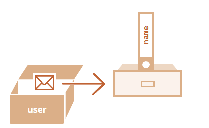
<p>The object is stored somewhere in memory (at the right of the picture), while the user variable (at the left) has a “reference” to it.</p>

<p><strong>When an object variable is copied, the reference is copied, but the object itself is not duplicated:</strong></p>

<pre><code>let user = { name: "John" };

let admin = user; // copy the reference</code></pre>

<p>Now we have two variables, each storing a reference to the same object:</p>
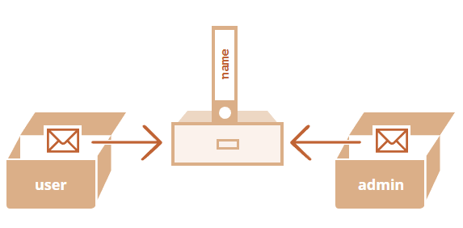

<p>As you can see, there’s still one object, but now with two variables that reference it.
<br>
We can use either variable to access the object and modify its contents:</p>

<pre><code>let user = { name: 'John' };

let admin = user;

admin.name = 'Pete'; // changed by the "admin" reference

console.log(user.name); // 'Pete', 
console.log(admin.name); // 'Pete', </code></pre>

<h4>Const objects can be modified?</h4>
<p>An important side effect of storing objects as references is that an object declared as const can be modified.</p>

<pre><code>const user = {
    name: "John"
};

user.name = "Pete";

console.log(user.name); // Pete
</code></pre>

<h3 id="cloning-and-merging-and-object.assign">Cloning and merging, Object.assign and structuredClone():</h3>

<p>So, copying an object variable creates one more reference to the same object.
<br>
But what if we need to duplicate an object?
<br>
We can create a new object and replicate the structure of the existing one, by iterating over its properties and copying them on the primitive level.
<br>
Like this:</p>

<pre><code>
let user = {
    name: "John",
    age: 30
};

let clone = {}; // the new empty object

// let's copy all user properties into it
for (let property in user) {
    clone[property] = user[property];
}

console.log(clone); // { name: "John", age: 30 }
console.log(user); // { name: "John", age: 30 } 

clone.name = "Pete"; // changed the data in it

console.log(user.name); // still John in the original object
console.log(clone.name); // but Pete in the clone

console.log(clone); // { name: "Pete", age: 30 }
console.log(user); // { name: "John", age: 30 }
</code></pre>

<p>We can also use the method <strong>Object.assign</strong>:</p>

<p>The syntax is:</p>
<pre><code>Object.assign(dest, ...sources)</code></pre>
<ul>
  <li>The first argument dest is a target object.</li>
  <li>Further arguments is a list of source objects.</li>
</ul>
<p>It copies the properties of all source objects into the target dest, and then returns it as the result.</p>

<pre><code>let user = { name: "John" };
let permissions1 = { canView: true };
let permissions2 = { canEdit: true };

// copies all properties from permissions1 and permissions2 into user
Object.assign(user, permissions1, permissions2);

// now user = { name: "John", canView: true, canEdit: true }
console.log(user.name); // John
console.log(user.canView); // true
console.log(user.canEdit); // true
</code></pre>

<p>We also can use Object.assign to perform a simple object cloning:</p>

<pre><code>let user = {
    name: "John",
    age: 30
};

let clone = Object.assign({}, user);

console.log(clone.name); // John
console.log(clone.age); // 30
</code></pre>

<h3>Nested cloning:</h3>

<pre><code>let user = {
    name: "John",
    sizes: {
        height: 182,
        width: 50
    }
};

let clone = Object.assign({}, user);

console.log(user.sizes === clone.sizes); // true, same object

user.sizes.width = 60;   // Modify the original object
console.log(clone.sizes.width); // 60, get the result from the other one
</code></pre>

<p>To fix that and make user and clone truly separate objects, we should use a cloning loop that examines each value of user[key] and, if it’s an object, then replicate its structure as well. That is called a “structured cloning”.The call <strong>structuredClone(object)</strong> clones the object with all nested properties:</p>

<pre><code>let user = {
    name: "John",
    sizes: {
        height: 182,
        width: 50
    }
};

let clone = structuredClone(user);

console.log(user.sizes === clone.sizes); // false, different objects

user.sizes.width = 60;    // change a property from one place
console.log(clone.sizes.width); // 50, not related
</code></pre>


<h3 id="object-methods">Object Methods</h3>
<p>A method is a function that is defined as a property of an object. It represents an action that the object can perform and can access the object’s data using the this keyword.</p>

<p>Example:</p>
<pre><code>let user = {
    name: "Tamim",
    // Method shorthand (recommended)
    sayHello() {
        console.log("Hello, I'm " + this.name);
    },
    // method without shorthand
    sayHi: function () {
        console.log("Hi, I'm " + this.name);
    }
};
user.sayHello(); // Output: Hello, I'm Tamim
user.sayHi(); // Output: Hi, I'm Tamim
</code></pre>

<ul>
  <li>sayHello ia a method of user object</li>
  <li>It uses this.name to access the object’s own data.</li>
</ul>

<p>Technically, it’s also possible to access the object without this: </p>

<pre><code>let user = {
    name: "Tamim",
    sayHello() {
        console.log("Hello, I'm " + user.name);
    },

};
user.sayHello(); // Output: Hello, I'm Tamim</code></pre>

<p>But such code is unreliable. If we decide to copy user to another variable, e.g. admin = user and overwrite user with something else, then it will access the wrong object:</p>

<pre><code>let user = {
    name: "Tamim",
    sayHello() {
        console.log(user.name);
    },
};

let admin = user;
user = null;
admin.sayHello(); // Cannot read properties of null (reading 'sayHello')</code></pre>

<p>If we used this.name instead of user.name inside the console, then the code would work:</p>

<pre><code>let user = {
    name: "Tamim",
    sayHello() {
        console.log(this.name);
    },
};

let admin = user;
user = null;
admin.sayHello(); // Tamim
</code></pre>


<h3 id="constructor-function-and-new-operator">Constructor function and "new" operator</h3>
<p>A constructor function is a regular function used to create multiple objects with the same structure and behavior. By convention, the name of a constructor function starts with a capital letter to distinguish it from regular functions.</p>

<pre><code>function Person(name, age) {
  this.name = name;
  this.age = age;
}</code></pre>

<ul>
  <li>Person is a constructor function.</li>
  <li>Inside it, this refers to the new object being created.</li>
</ul>

<p>You call a constructor function using the new operator:</p>

<pre><code>const p1 = new Person("Tamim", 20);
const p2 = new Person("Asha", 19);

console.log(p1.name); // Tamim
console.log(p2.age);  // 19
</code></pre>

<p><strong>What new Does Behind the Scenes:</strong></p>
<p>When you do new Person("Tamim", 20):</p>
<ul>
  <li>A new empty object is created: {}</li>
  <li>this inside the constructor is set to that new object</li>
  <li>Properties are added to this</li>
  <li>The object is returned automatically</li>
</ul>

<h3>When do we need a Constructor Function?</h3>
<p>Instead of writing the same object structure again and again, you use a constructor function to make it easier and cleaner.</p>

<p><strong>Without Constructor:</strong></p>
<pre><code>const user1 = {
  name: "Tamim",
  age: 20

};

const user2 = {
  name: "Asha",
  age: 19
};
// Repeat, repeat, repeat...</code></pre>

<p><strong>With Constructor Function and New operator:</strong></p>

<pre><code>function User(name, age) {
  this.name = name;
  this.age = age;
}

const user1 = new User("Tamim", 20);
const user2 = new User("Asha", 19);
</code></pre>
<hr>


<h3 id="optional-chaining">Optional Chaining (?.)</h3>

<p>Optional Chaining(?.) is a safe way to access deeply nested properties without getting an error if something is undefined or null.</p>

<p>Without Optional Chaining:</p>
<pre><code>const user = {};
console.log(user.address.city); // error: Cannot read properties of undefined (reading 'city')</code></pre>

<p>With Optional Chaining:</p>
<pre><code>const user = {};
console.log(user.address?.city); // undefined
</code></pre>

<p>if address is undefined or null optional chaining stops accessing .city and returns undefined instead of throwing an error.</p>

<p>we can also use optional chaining for calling method:</p>

<pre><code>const user = {
    sayHi() {
        console.log("Hi!");
    }
};

user.sayHi?.();     // Hi!
user.sayBye?.();    // Nothing happens, no error or undefined
</code></pre>


<h3 id="date">Date:</h3>
<p>Date is a built-in object in JavaScript that represents a single moment in time — down to the millisecond. Under the hood, it stores time as the number of milliseconds since January 1, 1970 (UTC) (called the Unix Epoch).</p>

<ul>
<li>Current Date & Time:</li>
<pre><code>const now = new Date();
console.log(now); // 2025-07-22T05:57:06.058Z
</code></pre>
<li>Get Parts of a Date:</li>
<pre><code>const date = new Date();

console.log(date.getFullYear()); // 2025
console.log(date.getMonth());    // 6 (July) → Month is 0-based
console.log(date.getDate());     // 21
console.log(date.getDay());      // 1 (Monday) → 0 = Sunday
console.log(date.getHours());    // 23
console.log(date.getMinutes());  // 5
console.log(date.getSeconds());  // 30
console.log(date.getMilliseconds()); // 123
</code></pre>

<li>Date Formatting (Readable Strings):</li>

<pre><code>
const date = new Date();
console.log(date.toString());      // Mon Aug 04 2025 01:14:18 GMT+0600 (Bangladesh Standard Time)
console.log(date.toDateString());  // Mon Aug 04 2025
console.log(date.toTimeString());  // 01:14:18 GMT+0600 (Bangladesh Standard Time)
console.log(date.toISOString());   // ISO format (for JSON, API)
console.log(date.toUTCString());   // 2025-08-03T19:14:18.638Z
console.log(date.toLocaleDateString()); // 8/4/2025
console.log(date.toLocaleTimeString()); // 1:15:24 AM
</code></pre>
</ul>

<hr>

<h3 id="function" align="center">Function</h3>
<p>A Function is a block of reusable code that perform a specific task when it is called.</p>

<pre><code>function calcSum(a, b) {
    console.log(a + b);
}

calcSum(1, 2); // 3
</code></pre>    

<p><strong>Note:</strong></p>
<ul>
  <li>1, 2 are arguments</li>
  <li>a, b are parameters</li>
</ul>

<h3 id="what-is-the-difference-between-return-and-no-return">What is the difference between return and no return in a function?</h3>
<pre><code>function calcSum(a, b) {
    const result = a + b;
}

console.log(calcSum(1, 2)); // undefined
</code></pre>    


<p>In this example, the function calculates something, but it doesn't return anything.
So when we call sum(1, 2), the calculation happens inside the function, but we can’t access or use the result outside.
we just call the function, and that’s all — no control or output comes back.</p>

<pre><code>function calcSum(a, b) {
    const result = a + b;
    return result;
}

console.log(calcSum(1, 2)); // 3
const functionResult = calcSum(3, 4);
console.log(functionResult + 5); // 12

</code></pre>    

<p>In this example, the function not only does the work, but it also returns the result to us. This means we can store it, reuse it, or do more operations with it.</p>

<p>You can think of it like this:</p>

<p>We order a coffee from a robot. The robot’s job is to make the coffee. But the robot’s owner teaches it something special, When someone orders coffee, don’t just make it — also serve it on the table.</p>

<p>That’s how <code>return</code> works in a function.</p>

<ul>
  <li>Without <code>return</code>, the robot just makes the coffee — but you don’t get it.</li>
  <li>With <code>return</code>, the robot <strong>makes</strong> the coffee and <strong>gives it to you</strong>.</li>
</ul>

<p>so,</p>
<p>
If a function returns a value, you can store it in a variable and use it for further operations. If a function does not return anything, you just call the function, but you can’t use its output for further operations.
</p>

<h3 id="callback function">CallBack Function</h3>
<p>A callback is a function passed as an argument to another function, to be called later.</p>

<pre><code>
function greet(name, callback) {
    callback(name); // call the callback function
}

function sayBye(name) {
    console.log("Bye! Bye " + name);
}

greet("Tamim", sayBye); // Bye! Bye Tamim
</code></pre>

<h3 id="default-parameter">Default Parameter:</h3>
<p>In JavaScript, default parameters allow you to set default values for function parameters. If no arguments is passed when the function is called, the default parameter will be used.</p>
<pre><code>function showGreet(name = "Guest") {
  console.log("Hello, " + name + "!");
}
showGreet("Tamim"); // Output: Hello, Tamim!
showGreet();        // Output: Hello, Guest!
</code></pre>
<hr/>

<h3 id="arrow-function">Arrow Function:</h3>
<p>Arrow functions are a shorter way to write functions in JavaScript. They were introduced in ES6 (2015).</p>

<p>Examples:</p>

<pre><code>const greet = () => console.log("Hello!");
greet(); // Output: Hello!


const greet2 = () => {
    console.log("Hello!");
};
greet2(); // Output: Hello!


const square = x => x * x;
console.log(square(5)); // Output: 25


const multiply = (a, b) => {
    const result = a * b;
    return result;
};
console.log(multiply(3, 4)); // Output: 12</code></pre>

<h3 id="recursion">Recursion</h3>

<p>Recursion is a technique where a function calls itself.</p>

<pre><code>
function a() {
    const a = 10;
    console.log('inside a', a);
}
function b() {
    const b = 20;
    a();
    console.log('inside b', b);
}

function c() {
    const c = 30;
    b();
    console.log('inside c', c);
}
c();

/*
inside a 10
inside b 20
inside c 30
*/
</code></pre>

<h4>How the Call Stack Works:</h4>
<p><strong>Call Stack:</strong> A call stack is a data structure that keeps track of function calls in a Last-In-First-Out (LIFO) manner. When a recursive function calls itself, here's what happens:</p>
<ul>
<li>New Frame Creation: Each function call creates a new "stack frame" containing the function's parameters, local variables, and return address</li>

<li>Stack Growth: These frames pile up on top of each other as the recursion goes deeper</li>

<li>Base Case Reached: When the base case is hit, the recursion stops adding new frames</li>

<li>Stack Unwinding: Functions start returning values and their frames are removed from the stack in reverse order</li>
</ul> 
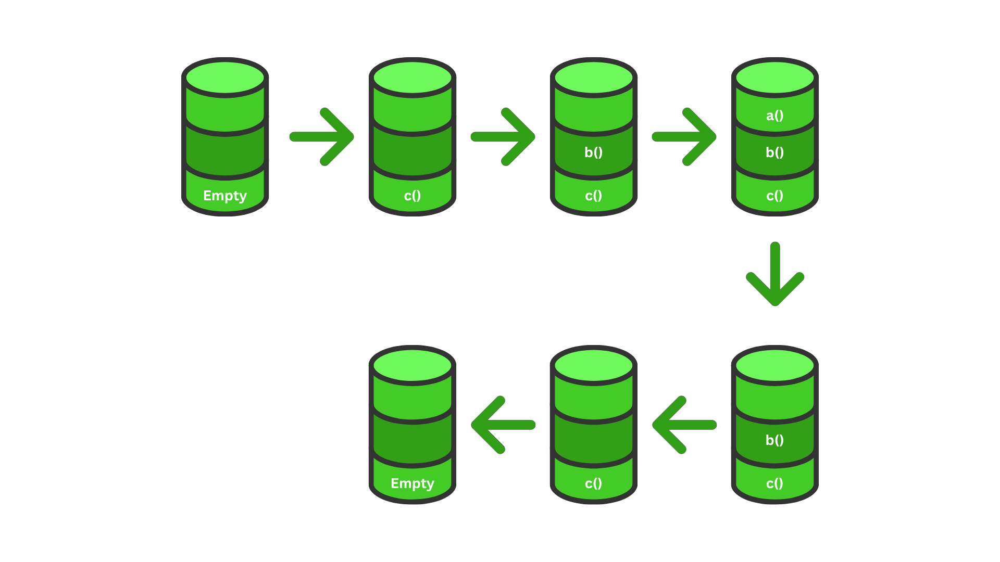

<br>

<h4>How the recursion Works:</h4>
<p>A recursive function typically has two main components:</p>
<ol>
<li><p><strong>Base Case:</strong> The part where the recursive function stops the recursion based on a condition. It ensures that the function does not call itself indefinitely, which prevents a <a href="#stack-overFlow">stack overflow.</a></p></li>

<li><p><strong>Recursive Case:</strong> The part where the recursive function calls itself.</p></li>
</ol>

<h4>Find Factorial Using Recursion:</h4>

<pre><code>
function factorial(n) {
  if (n === 0) { // base case
    return 1; 
  }
  return n * factorial(n - 1); // recursive case
}

console.log(factorial(5)); // 120
</code></pre>
<p>call stack:</p>


<h4>Q&A:</h4>
<ul>
<li id="stack-overFlow">
<p><strong>Stack OverFlow:</strong> A stack overflow is an error that happens when the call stack gets too full.</p>

<pre><code>
function greeting() {
    console.log("Hello, world!");
    greeting();
}
greeting(); // RangeError: Maximum call stack size exceeded
</code></pre>
</li>
</ul>


<h3 id="closure">Closure</h3>
<p>A closure is a function technique that remembers the variables from its outer scope, even after that outer function has finished executing.</p>

<h4>Closure Features</h4>
<ul>
<li>Keeps scope alive -	Inner function remembers variables from outer scope</li>
<li>Useful in data hiding -	Helps in making private variables</li>
<li>Doesn’t lose data -	Keeps values even after outer is gone</li>
</ul>

<pre><code>
function outer() {
    let name = "Tamim"; // outer variable

    function inner() {
        console.log("Hello " + name); // inner uses outer variable
    }

    return inner; // return inner function
}

const greet = outer(); // outer() is called, inner() is returned

greet(); // Hello Tamim 
</code></pre>

<pre><code>
function secretCounter() {
    let count = 0;

    return function () {
        count++;
        console.log("Count is: " + count);
    };
}

const counter = secretCounter();

counter(); // Count is: 1
counter(); // Count is: 2
counter(); // Count is: 3
</code></pre>


<hr>


<h3 id="array" align="center">Array:</h3>

<p>
An array is a special type of object used to store multiple values of different data types in a single variable, organized as an ordered and indexed collection. 
That’s why arrays use square bracket notation like <code>arr[0]</code> to access elements — this syntax actually comes from object property access: <code>obj[key]</code>. 
In arrays, the variable <code>arr</code> is the object, and the index numbers are keys.
</p>


<h4>Array Declaration:</h4>
<pre><code>let fruits = []</code></pre>

<h4>Array Initialization:</h4>
<pre>
<code>let fruits = ['apple', 'orange', 'plum']</code>
</pre>

<h4>Array Assignment:</h4>
<pre>
<code>let fruits = ['apple', 'orange', 'plum'];
fruits[2] = 'mango';
console.log(fruits); // [ 'apple', 'orange', 'mango' ]
</code>
</pre>


<h4>Get the length of an array using length property:</h4>
<pre><code>let fruits = ["Apple", "Orange", "Plum"];
console.log(fruits.length); // 3</code></pre>

<p>Since, array are object so it copied by reference, means Assigning an array to another variable does not create a new array.
They both point to the same memory address:</p>

<pre><code>
let fruits = ["Banana"]

let arr = fruits; // copy by reference (two variables reference the same array)

console.log(arr === fruits); // true

arr.push("Pear"); // modify the array by reference

console.log(fruits); // [ 'Banana', 'Pear' ] - 2 items now
</code></pre>


<h3 id="for-of">for..of loop</h3>
<p>One of the oldest ways to cycle array items is the for loop over indexes:</p>

<pre><code>
let arr = ["Apple", "Orange", "Pear"];

for (let i = 0; i < arr.length; i++) {
    console.log(arr[i]);
}
</code></pre>

<p><strong>With for..of loop</strong></p>

<pre><code>
let fruits = ["Apple", "Orange", "Plum"];

// iterates over array elements
for (let fruit of fruits) {
    console.log(fruit);
}
</code></pre>

<p>Technically, because arrays are objects, it is also possible to use for..in, but it gives you the keys (like "0", "1", or even custom properties) instead of the actual values.</p>

<pre><code>
const fruits = ["apple", "banana", "mango"];
fruits.custom = "extra"; // adding a property to the array

for (const key in fruits) {
    console.log(key); // 0, 1, 2, custom
}</code></pre>


<h3 id="array-methods">Array Methods</h3>

<ol>
  <li id="adding-removing-elements">Adding / Removing Elements</li>
  <ul>
    <li>
    <h4 id="push/pop-and-unshift/shift">push/pop and unshift/shift:</h4>
<table>
<tr>
  <th>Operation</th>
  <th>Method</th>
</tr>
<tr>
  <td>Adds element to end and returns the new length</td>
  <td>push()</td>
</tr>
<tr>
  <td>Remove the last element and returns the element</td>
  <td>pop()</td>
</tr>
<tr>
  <td>Adds element to start and returns the new length</td>
  <td>unshift()</td>
</tr>
<tr>
  <td>Remove the first element and returns the element</td>
  <td>shift()</td>
</tr>
</table>

<pre><code>
let fruits = ["Apple", "Orange", "Plum"];

console.log(fruits.push('Mango')) // 4
console.log(fruits); // [ 'Apple', 'Orange', 'Plum', 'Mango' ]
console.log(fruits.pop()); // Mango
console.log(fruits); // [ 'Apple', 'Orange', 'Plum' ]

console.log(fruits.unshift('Mango')) // 4
console.log(fruits); // [ 'Mango', 'Apple', 'Orange', 'Plum' ]
console.log(fruits.shift()); // Mango
console.log(fruits); // [ 'Apple', 'Orange', 'Plum' ]
</code></pre>

<h4>Why push/pop run fast and unshift/shift are slow?</h4>

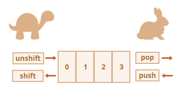

<p>push() and pop() are fast because they work at the end of an array, where JavaScript can simply add or remove an item without affecting the positions of other elements. </p>
<p>On the other hand, shift() and unshift() are slow because they work at the beginning of the array. When you remove the first item with shift(), JavaScript has to move every remaining element one position to the left. Similarly, when you use unshift() to add an item to the beginning, all existing elements must shift one position to the right. These shifts take more time and processing, especially when the array is large.</p>
    </li>
    <li>
      <h4 id="splice">splice(start, deleteCount, ...items) – Modify array by remove, add, or replace elements and returns removed items:</h4>

<pre><code>
let arr = ["I", "study", "JavaScript"];
// from index 1 remove 1 element
console.log(arr.splice(1, 1));  // [ 'study' ]
console.log(arr); // [ 'I', 'JavaScript' ]


let arr2 = ["I", "study", "JavaScript", "right", "now"];
// remove 3 first elements and replace them with another
console.log(arr2.splice(0, 3, "Let's", "dance")); // [ 'I', 'study', 'JavaScript' ]
console.log(arr2) // ["Let's", "dance", "right", "now"]


let arr3 = ["I", "study", "JavaScript"];
// from index 2, delete 0, then insert "complex" and "language"
console.log(arr3.splice(2, 0, "complex", "language")); // []
console.log(arr3); // [ 'I', 'study', 'complex', 'language', 'JavaScript' ]


let arr4 = [1, 2, 5];
// from index -1 (one step from the end) delete 0 elements, then insert 3 and 4
console.log(arr4.splice(-1, 0, 3, 4));[]
console.log(arr4); // [ 1, 2, 3, 4, 5 ]
</code></pre>

  </li>
    <li>
    <h4 id="slice">slice(start, end) – Returns a shallow copy from start to before end, doesn't change original:</h4>

<pre><code>
let arr = ["t", "e", "s", "t"];

console.log(arr.slice(1, 3)); // [ 'e', 's' ]
console.log(arr); // [ 't', 'e', 's', 't' ]
console.log(arr.slice(-2)); // [ 's', 't' ]
console.log(arr.slice()) // [ 't', 'e', 's', 't' ]
</code></pre>

  </li>
  </ul>
  <h4>Note: </h4>
<ul>
  <li>Use splice() when you want to change the original array (remove/insert/replace).</li>
  <li>Use slice() when you want a copy of part of the array, without changing the original.</li>
</ul>


  <li id="searching-location">Searching / Location</li>
  <ul>
    <li>
      <h4 id="indexof">indexOf(item) – Returns the index of the first match, or -1:</h4>

<pre><code>
let arr = [1, 2, 3];

console.log(arr.indexOf(2)); // 1
console.log(arr.indexOf(4)); // -1
</code></pre>

</li>
    <li>
      <h4 id="lastIndexOf">lastIndexOf(item) – Returns the index of the last match, or -1:</h4>

<pre><code>
let arr = [1, 2, 2, 3];

console.log(arr.lastIndexOf(2)); // 2
console.log(arr.lastIndexOf(5)); // -1
</code></pre>
  
  </li>
    <li>
      <h4 id="includes">includes(item) – Returns true if array contains item, or false:</h4>
      
<pre><code>
let arr = [1, 2, 3];

console.log(arr.includes(2)); // true
console.log(arr.includes(5)) // false
</code></pre>

</li>
</ul>

<li id="iteration-transformation">Iteration / Transformation</li>
    <ul>
      <li>
        <h4 id="forEach">forEach(callback) – Executes a function for each element; no return value:</h4>
        
<pre><code>
let arr = [1, 2, 3]
arr.forEach(n => console.log(n * 2)); // 2 4 6       
</code></pre>
      
</li>
      <li>
        <h4 id="map">map(callback) – return a new array by applying function to each element:</h4>

<pre><code>
let arr = [1, 2, 3]
let arr2 = arr.map(n => n * 2);
console.log(arr) // [ 1, 2, 3 ]
console.log(arr2) // [ 2, 4, 6 ]
</code></pre>
</li>
      <li>
        <h4 id="filter">filter(callback) – return a new array with elements that pass the test:</h4>
       
<pre><code>
let arr = [1, 2, 3, 4]
let arr2 = arr.filter(n => n % 2 === 0);
console.log(arr) // [ 1, 2, 3, 4 ]
console.log(arr2) // [ 2, 4 ]
</code></pre>
</li>
      <li>
        <h4 id="find">find(callback) – Returns the first element that matches:</h4>

<pre><code>
let arr = [1, 2, 3, 4, 5];
const result = arr.find(n => n > 2);
console.log(result); // 3
</code></pre>

</li>
    <li>
        <h4 id="findIndex">findIndex(callback) – Returns the index of the first element that matches:</h4>

<pre><code>
let arr = [1, 2, 3, 4, 5];
const result = arr.findIndex(n => n > 2);
console.log(result); // 2
</code></pre>

</li>
      <li>
        <h4 id="reduce">reduce()– Reduces array to a single value:</h4>
        <p>Syntax:</p>
        <pre><code>reduce((accumulator, currentValue) => ..., initialValue);</code></pre>

<pre><code>
const numbers = [1, 2, 3, 4];

// without reduce method

let acc = 0;
for (let i = 0; i < numbers.length; i++) {
    acc = acc + numbers[i];
}
console.log(acc); // Output: 10

// with reduce method

const result = numbers.reduce((accumulator, currentValue) => accumulator + currentValue, 0);
console.log(result); // Output: 10
</code></pre>
<p>Here,</p>
<ul>
<li>accumulator = keeps the result</li>
<li>0 = The staring value of accumulator</li>
<li>currentValue = the current element of the array</li>
</ul>
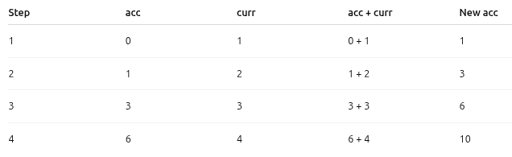

</ul>
  <li id="reordering-combining">Reordering / Combining</li>
    <ul>
      <li>
        <h4 id="concat">concat(...arrays) – Returns a new array by merging arrays/values:</h4>

<pre><code>
let arr = [1, 2];
const arr2 = arr.concat([3, 4], 5);
console.log(arr); // [ 1, 2 ]
console.log(arr2); // [ 1, 2, 3, 4, 5 ]
</code></pre>

</li>
<li>
<h4 id="join">join(separator) – Returns a string by joining array elements using the given separator:</h4>

<pre><code>
let arr = ["a", "b", "c"];
let arr2 = arr.join("-");
console.log(arr); // [ 'a', 'b', 'c' ]
console.log(arr2); // a-b-c

const arr = ['Hello', 'World'];
let arr3 = arr.join(" ");
console.log(arr); // ['Hello', 'World']
console.log(arr3); // Hello World
</code></pre>
</li>
<li>
<h4 id="split">split(separator) – Splits a string into an array using the given separator:</h4>

<pre><code>
let str = "a-b-c";
let result = str.split("-");
console.log(str);    // "a-b-c"
console.log(result); // [ 'a', 'b', 'c' ]

const str = 'Hello World';
let arr2 = str.split(" ");
console.log(str); // Hello World
console.log(arr2); // ['Hello', 'World']
</code></pre>

<p><strong>Note: </strong>join used on arrays to convert them into a string and split used on strings to convert them a array.</p>

</li>
<li>
<h4 id="reverse">reverse() – Reverses the array:</h4>

<pre><code>
let arr = [1, 2, 3];
console.log(arr.reverse()) // [ 3, 2, 1 ]
</code></pre>

</li>
      <li>
        <h4 id="sort">sort – return a new sorted array:</h4>
        
<pre><code>
let arr = [3, 1, 2];
console.log(arr.sort())  // default lexicographic: [1,2,3]

// but in this case default sort fails:
let arr2 = [1, 2, 15];
console.log(arr2.sort()) // [ 1, 15, 2 ]
</code></pre>

<p>The order became 1, 15, 2. Incorrect. But why?</p>
<p>In JavaScript, the default behavior of sort() is lexicographic (dictionary-like) sorting. This means: </p>
<ul>
<li>It converts elements to strings.</li>
<li>Then it compares those strings using Unicode (UTF-16) code unit values.</li>
thats why,
"1" vs "2" → "1" comes first 

"2" vs "15" → "1" comes before "2" so "15" comes before "2" 

So the result becomes: [1, 15, 2]
</ul>
<p>To fix it, we need to use a custom compare function to sort it by js sort() method. js sort() method used this custom function internally to determine the correct sorting.</p>

<pre><code>let arr2 = [1, 2, 15];
console.log(arr2.sort((a, b) => a - b)); // [1, 2, 15]
</code></pre>

<p>How it works:</p>
<code>(a, b) => a - b this function returns:</code>
<ul>
<li>Negative number (a - b < 0) → keep a before b</li>
<li>Positive number (a - b > 0) → place b before a</li>
<li>Zero (a - b === 0) → leave a and b unchanged</li>
</ul>

  </li>
    </ul>

  <li id="others">Others</li>
    <ul>
      <li>
        <h4 id="some">some() –Return true  if any element passes the test, else false:</h4>

<pre><code>
let arr = [1, 2, 3];
const arr2 = arr.some(n => n > 2);
console.log(arr2) // true
</code></pre>

</li>
      <li>
        <h4 id="every">every() –Return true  if all element passes the test, else false:</h4>

<pre><code>
let arr = [1, 2, 3];
const arr2 = arr.every(n => n > 2);
console.log(arr2) // false
</code></pre>
      
</li>
    </ul>
    <ul>
      <li>
      <h4 id="at">at(index) – Returns element at index; supports negative indexing:</h4>

<pre><code>// With at method
let fruits = ["Apple", "Orange", "Plum"];

console.log(fruits.at(-1)); // Plum

// without at method
let fruits = ["Apple", "Orange", "Plum"];
console.log(fruits[fruits.length - 1]); // Plum
</code></pre>
      
</li>
    </ul>
    <ul>
      <li>
        <h4 id="isArray">Array.isArray(value) – Return true if value is an array, else false:</h4>

<pre><code>
const arr = [1, 2]
const result = Array.isArray(arr);
console.log(result) // true       
</code></pre>
  </li>
      <li>
        <h4 id="fill">fill(value, start?, end?) – Fills array with value:</h4>
      
<pre><code>
const arr = [1, 2, 3]
arr.fill(0, 1);
console.log(arr) // [ 1, 0, 0 ]
</code></pre>

  </li>
<li>
  <h4 id="flat">flat(depth): Returns a new array after concatenating all the nested arrays up to the given depth:</h4>

<pre><code>
// Default depth (1)

const arr = [1, 2, [3, 4]];
const flatArr = arr.flat();
console.log(flatArr); // Output: [1, 2, 3, 4]

// Deeper nesting with depth = 2

const arr = [1, 2, [3, 4, [5, 6]]];
const flatArr = arr.flat(2);
console.log(flatArr); // Output: [1, 2, 3, 4, 5, 6]

// Infinite depth (Infinity)

const arr = [1, [2, [3, [4]]]];
const flatArr = arr.flat(Infinity);
console.log(flatArr); // Output: [1, 2, 3, 4]
</code></pre>
</li>

</ul>

</ol>

<hr>


<h3 id="destructuring" align="center">Destructuring</h3>
<p>Destructuring means breaking apart arrays or objects and assigning their values to variables in a clean and short way.</p>
<ul>
<li><h3 id="array-destructuring">Array Destructuring</h3></li>
<h4>Basic Syntax:</h4>

<pre><code>
const arr = [1, 2, 3];

const [a, b, c] = arr;
console.log(a); // 1
console.log(b); // 2
console.log(c); // 3
</code></pre>

<h4>Skip Items:</h4>

<pre><code>
const colors = ["red", "green", "blue"];

const [first, , third] = colors;

console.log(first); // red
console.log(third); // blue
</code></pre>


<h4>Default Values:</h4>

<pre><code>
const arr = [10];

const [x, y = 100] = arr;

console.log(x); // 10
console.log(y); // 100
</code></pre>

<h4>Swap Variables :</h4>

<pre><code>
let a = 1;
let b = 2;

[a, b] = [b, a];

console.log(a); // 2
console.log(b); // 1
</code></pre>

<h4>rest Operator (...):</h4>

<pre><code>
const nums = [1, 2, 3, 4];

const [first, ...rest] = nums;

console.log(first); // 1
console.log(rest);  // [2, 3, 4]
</code></pre>
<li><h3 id="object-destructuring">Object Destructuring</h3></li>

<h4>Basic Syntax:</h4>

<pre><code>
const person = {
  name: "Tamim",
  age: 21
};

const { name, age } = person;

console.log(name); // Tamim
console.log(age);  // 21
</code></pre>

<h4>Rename Variables:</h4>

<pre><code>
const person = {
  name: "Tamim",
  age: 21
};

const { name: fullName, age: years } = person;

console.log(fullName); // Tamim
console.log(years);    // 21
</code></pre>

<h4>Default Values:</h4>

<pre><code>
const person = {
  name: "Tamim"
};

const { name, age = 20 } = person;

console.log(name); // Tamim
console.log(age);  // 20
</code></pre>

<h4>Nested Destructuring:</h4>

<pre><code>
const user = {
  id: 1,
  profile: {
    username: "tamim",
    email: "tamim@example.com"
  }
};

const {
  profile: { username, email }
} = user;

console.log(username); // tamim
</code></pre>

<h4>Rest Operator in Object:</h4>

<pre><code>
const user = {
  name: "Tamim",
  age: 21,
  country: "BD"
};

const { name, ...others } = user;

console.log(name);   // Tamim
console.log(others); // { age: 21, country: "BD" }
</code></pre>

<li><h3 id="destructuring-function-parameters">Destructuring in Function Parameters</h3></li>

<h4>Array Parameters:</h4>

<pre><code>
function greet([first, second]) {
    console.log("Hello", first, second);
}
greet(["Tamim", "Ahmed"]); // Hello Tamim Ahmed
</code></pre>

<h4>Object Parameters:</h4>

<pre><code>
function displayUser({ name, age }) {
    console.log(`${name} is ${age} years old.`);
}

displayUser({ name: "Tamim", age: 21 }); // Tamim is 21 years old.
</code></pre>

</ul>
<hr>


<h3 id="error-handling" align="center">Error Handling</h3>

<p>try...catch is used to handle errors in JavaScript so your code doesn't crash. Instead of stopping the program when an error happens, you can catch the error and respond gracefully.</p>

<h4>Without try...catch :</h4>

<pre><code>
let x = y + 10; // Error: y is not defined
console.log("This line will not run");
</code></pre>

<h4>With try...catch :</h4>

<pre><code>
try {
    let x = y + 10; // Error here
} catch (err) {
    console.log("Something went wrong!");
}
console.log("This line will run");
</code></pre>

<h3>err vs err.message vs err.name</h4>

<pre><code>
try {
    let x = y + 10; // Error here
} catch (err) {
    console.log(err.name); // ReferenceError
    console.log(err.message); // y is not defined
    console.log(err); // full error message
    console.log(err.stack); // full error message
}
console.log("This line will run");
</code></pre>

<h3>Finally block:</h3>
<p>finally runs after try and catch, no matter what.</p>

<pre><code>
try {
    let result = 10 / 2;
    console.log(result);
} catch (err) {
    console.log("Error:", err.message);
} finally {
    console.log("Cleanup: This runs no matter what.");
}
/*
5
Cleanup: This runs no matter what.
*/
</code></pre>

<pre><code>
try {
    let result = 10 / y;
    console.log(result);
} catch (err) {
    console.log("Error:", err.message);
} finally {
    console.log("Cleanup: This runs no matter what.");
}
/*
Error: y is not defined
Cleanup: This runs no matter what.
*/
</code></pre>


<h3 id="common-js-errors">Common JS Errors:</h3>

<ul>
<li>
<h4>SyntaxError</h4>
<p>Syntax error happens when JavaScript code is not written correctly.</p>

<pre><code>
// Missing parenthesis:
console.log("Hello world"

// Unexpected token:
let a = 10
let b = 20;
console.log(a + b)

// Using reserved keywords for variable names:
let let = 5;

// not using quotes properly for string:
let greeting = "Hello;

// Invalid object literal:
let obj = { name: "Tamim", age: }; 
</code></pre>
</li>

<li>
<h4>ReferenceError</h4>
<p>Reference Error happens when you use a variable that hasn’t been declared.</p>

<pre><code>
// Undeclared variable:
console.log(x);

// Misspelled variable name:
let username = "Tamim";
console.log(usernme);

// Variable used outside its block:
{
    let a = 5;
}
console.log(a);

// Accessing variable before declaration: 
console.log(y);
let y = 10;

// Function-scoped variable not declared:
function test() {
    console.log(nonExistent);
}
test();
</code></pre>
</li>

<li>
<h4>TypeError</h4>
<p>Type Error happens when a value is used in an invalid way (e.g., calling non-function, accessing property of undefined, etc.)</p>
</li>

<pre><code>
// Calling something that's not a function:
let num = 10;
num();

// Accessing property of undefined:
let user;
console.log(user.name);

// Using string like an object:
let str = "hello";
str.push("!");

// Invalid assignment:
const age = 25;
age = 30;

// Accessing array index of null:
let arr = null;
arr[0];

// Incorrect method on type:
let number = 123;
number.toUpperCase();

// Using array as object incorrectly:
let nums = [1, 2, 3];
console.log(nums.name.first);
</code></pre>
</ul>

<hr>


<h3 id="import-and-export" align="center">JS Modules: Import and Export</h3>

<h3>Export:</h3>
<p>There are Three main ways to export from a file:</p>
<ol>
<li>Named Export: You export multiple values by name</li>

<pre><code>
// math.js
export const PI = 3.14;
export function add(x, y) {
  return x + y;
}
export const multiply = (x, y) => x * y;
</code></pre>
<li>Default Export: You export only one default value form a file</li>

<pre><code>
// greet.js
export default function greet(name) {
  return `Hello, ${name}`;
}
</code></pre>


<li>Name export and default export in a same file:</li>

<pre><code>
// utils.js
export const sayHi = () => console.log("Hi!");

export default function sayHello(name) {
  console.log(`Hello, ${name}`);
}
</code></pre>
<p>Note:  A file can have only one default export.</p>
</ol>

<h3>Import:</h3>

<pre><code>
import { PI, add, multiply } from './math.js';
import greet from './greet.js';
import sayHello, { sayHi } from './utils.js';

console.log(PI);          // 3.14
console.log(add(2, 3));   // 5
console.log(multiply(2, 3)); // 6
console.log(greet('Tamim')); // Hello, Tamim

sayHi(); // Hi!
sayHello('Tamim'); // Hello, Tamim
</code></pre>

<h4>You can Rename imported file name with as:</h4>

<pre><code>
import {add as sum} from './math.js';

console.log(sum(2, 3));   // 5
</code></pre>
<hr>


<h3 id="regular-expression" align="center">Regular Expression</h3>
<p>A regular expression (RegEx) is a pattern used to match character combinations in strings.</p>

<p>In JavaScript, RegEx is often used for:</p>
<ul>
<li>Validating input (e.g., email, phone number)</li>
<li>Searching/matching strings</li>
<li>Replacing patterns in text</li>
</ul>

<h3 id="common-regex-methods">Common RegEx Methods:</h3>
<ul>
<li>test() = Returns true if pattern matches</li>
<li>match() = Returns matching values (array or null)</li>
<li>replace() = Replace matched pattern</li>
<li>search() = Returns index of match or -1</li>
<li>split() = Split string by pattern</li>
</ul>

<pre><code>
const str = "I have a cat, a dog, and a cow.";
const pattern = /a/g;

/*
/a/ = matches the lowercase letter a
g = means global, so it finds all occurrences
*/

console.log("test():", pattern.test(str));       // true
console.log("match():", str.match(pattern));     // [ 'a', 'a', 'a', 'a', 'a' ]
console.log("replace():", str.replace(pattern, "*")); // I h*ve * c*t, * dog, *nd * cow.
console.log("search():", str.search(pattern));   // 3
console.log("split():", str.split(pattern));     // [ 'I h', 've ', ' c', 't, ', ' dog, ', 'nd ', ' cow.' ]
</code></pre>


<h3 id="anchors">Anchors:</h3>

<ul>

<li>^ = matches only the beginning of the entire string.</li>

<li>$ = matches only the end of the entire string.</li>

<li>\b = Word boundary (matches a boundary between a word character (a-z, A-Z, 0-9, _) and a non-word character like space, punctuation, etc. as a whole word, not inside others word)</li>
</ul>


<pre><code>
const str = "helloWorld hello world\nstart hello\nend";

console.log("^hello    :", str.match(/^hello/));
console.log("end$      :", str.match(/end$/));
console.log("\\bhello\\b:", str.match(/\bhello\b/g));

/*
^hello    : [
  'hello',
  index: 0,
  input: 'helloWorld hello world\nstart hello\nend',
  groups: undefined
]
end$      : [
  'end',
  index: 35,
  input: 'helloWorld hello world\nstart hello\nend',
  groups: undefined
]
\bhello\b: [ 'hello', 'hello' ]
*/
</code></pre>


<h3 id="flags">Flags:</h3>
<ul>
<li>g = Match all occurrences (not just the first one)</li>
<li>i = ignores the case</li>
<li>m = multiline (it changes how the ^ and $ anchors behave.)
<br>
without m (default behavior): 
<ul>
<li>^ matches only the beginning of the entire string.</li>
<li>$ matches only the end of the entire string.
</li>
</ul>
With m: 
<ul>
<li>^ matches the start of each line (right after a \n).</li>
<li>$ matches the end of each line (right before a \n).</li>
</ul>
</li>
</ul>

<pre><code>
const text = `Apple apple APPLE`;

console.log("g :", text.match(/apple/g));
console.log("i :", text.match(/apple/i));
console.log("gi:", text.match(/apple/gi));

/*
g : [ 'apple' ]
i : [ 'Apple', index: 0, input: 'Apple apple APPLE', groups: undefined ]
gi: [ 'Apple', 'apple', 'APPLE' ] 
*/
</code></pre>

<pre><code>
const str = "d\nhelloWorld hello world\nstart hello\nend";

console.log(str.match(/^hello/));
console.log(str.match(/^hello/m));

console.log(str.match(/hello$/));
console.log(str.match(/hello$/m));

/*
null
[
  'hello',
  index: 2,
  input: 'd\nhelloWorld hello world\nstart hello\nend',
  groups: undefined
]
null
[
  'hello',
  index: 31,
  input: 'd\nhelloWorld hello world\nstart hello\nend',
  groups: undefined
]
*/
</code></pre>


<h3 id="basic-patterns">Basic Patterns</h3>

<ul>

<li>
<h4>/abc/ = Matches the exact sequence "abc"</h4>

<pre><code>
const str1 = "I know my abc and 123.";
console.log(str1.match(/abc/));
/*
[
  'abc',
  index: 10,
  input: 'I know my abc and 123.',
  groups: undefined
]
*/
</code></pre>
</li>

<li>
<h4>/\d/ = Matches any digit (0–9)</h4>

<pre><code>
const str2 = "Room number is 405.";
console.log(str2.match(/\d/g));
// Output: [ '4', '0', '5' ]
</code></pre>
</li>

<li>
<h4>/\w/ → Matches any word character (a–z, A–Z, 0–9, _)</h4>

<pre><code>
const str3 = "Hi_123!";
console.log(str3.match(/\w/g));
// Output: [ 'H', 'i', '_', '1', '2', '3' ]
</code></pre>
</li>

<li>
<h4>/\s/ → Matches any whitespace character (space, tab, newline)</h4>

<pre><code>
const str4 = "Hello World! I am Tamim";
console.log(str4.match(/\s/g));
// Output: [ ' ', ' ', ' ', ' ' ]
</code></pre>
</li>

<li>
<h4>/./ → Matches any character (except newline)</h4>

<pre><code>
const str5 = "OK!";
console.log(str5.match(/./g));
// Output: [ 'O', 'K', '!' ]
</code></pre>
</li>

<li>
<h4>/[abc]/ → Matches a, b, or c</h4>

<pre><code>
const str6 = "bag of chips";
console.log(str6.match(/[abc]/g));
// Output: [ 'b', 'a', 'c' ]
</code></pre>
</li>

<li>
<h4>/[^abc]/ → Matches any character except a, b, or c</h4>

<pre><code>
const str7 = "abc123";
console.log(str7.match(/[^abc]/g));
// Output: [ '1', '2', '3' ]
</code></pre>
</li>

<li>
<h4>/[A-Z]/ → Matches any uppercase letter</h4>

<pre><code>
const str9 = "Hi There!";
console.log(str9.match(/[A-Z]/g));
// Output: [ 'H', 'T' ]
</code></pre>
</li>
</ul>


<h3 id="quantifiers">Quantifiers</h3>
<ul>
<li>/a+/ → 1 or more a</li>
<li>/a*/ → 0 or more a</li>
<li>/a?/ → 0 or 1 a</li>
<li>/a{2}/ → Exactly 2 as</li>
<li>/a{3,}/ → 3 or more as</li>
<li>/a{2,4}/ → Between 2 and 4 as</li>
</ul>

<pre><code>
const str = "aa aaaa a aaaa aaa aaaaaaa";

console.log("+     :", str.match(/a+/g));       // Match one or more continuous "a" characters.
console.log("*     :", str.match(/a*/g));       // Match zero or more continuous "a" characters.
console.log("?     :", str.match(/a?/g));       // Match zero or one "a" character.
console.log("{2}   :", str.match(/a{2}/g));     // Match exactly two "a" characters.
console.log("{3,}  :", str.match(/a{3,}/g));    // Match three or more "a" characters.
console.log("{2,4} :", str.match(/a{2,4}/g));   // Match between two and four "a" characters.

/*
+     : [ 'aa', 'aaaa', 'a', 'aaaa', 'aaa', 'aaaaaaa' ]
*     : [
  'aa',      '',
  'aaaa',    '',
  'a',       '',
  'aaaa',    '',
  'aaa',     '',
  'aaaaaaa', ''
]
?     : [
  'a', 'a', '',  'a', 'a', 'a', 'a',
  '',  'a', '',  'a', 'a', 'a', 'a',
  '',  'a', 'a', 'a', '',  'a', 'a',
  'a', 'a', 'a', 'a', 'a', ''
]
{2}   : [
  'aa', 'aa', 'aa',
  'aa', 'aa', 'aa',
  'aa', 'aa', 'aa'
]
{3,}  : [ 'aaaa', 'aaaa', 'aaa', 'aaaaaaa' ]
{2,4} : [ 'aa', 'aaaa', 'aaaa', 'aaa', 'aaaa', 'aaa' ]
*/
</code></pre>


<h3 id="escaping-special-characters">Escaping special characters</h3>
<p>If you want to match characters like ., ?, *, use a backslash(\)</p>

<pre><code>
let pattern = /\./;
console.log("google.com".match(pattern)); // [ '.', index: 6, input: 'google.com', groups: undefined ]
</code></pre>

<h3 id="real-world-examples">Ral world examples:</h3>
<ul>
<li>
<h4>Validate Email:</h4>

<pre><code>
const email = "tamim@gmail.com";
const emailPattern = /^[\w.-]+@[\w.-]+\.\w+$/;

console.log(emailPattern.test(email)); // true

/*
"tamim@gmail.com"

^           → Start of string
[\w.-]+     → "tamim"
@           → "@"
[\w.-]+     → "gmail"
\.          → "."
\w+         → "com"
$           → End of string 

 */
</code></pre>
</li>


<li>
<h4>Extract Digits</h4>

<pre><code>
let str = "Order #12345";
let digits = str.match(/\d+/); // ['12345']
console.log(digits); // [ '12345', index: 7, input: 'Order #12345', groups: undefined ]
console.log(digits[0]); // '12345'

/*
/d --> matches any digit (0-9)
+ --> matches one or more digits
/\d+/ --> matches one or more digits in a row
*/
</code></pre>
</li>

<li>
<h4>Remove Extra Spaces</h4>

<pre><code>
let messy = "  too    many    spaces ";
let clean = messy.replace(/\s+/g, " ").trim();
console.log(clean); // "too many spaces"

/*
\s --> Matches any whitespace character (space, tab, newline)
+ --> Matches one or more occurrences 
g --> Global search, match all occurrences in the string
*/
</code></pre>
</li>

</ul>
<hr>


<h3 id="asynchronous-JavaScript" align="center">Asynchronous and Synchronous JavaScript</h3>

<h3 id="synchronous-javascript" align="center">Synchronous JavaScript</h3>

<h4 id="single-threaded">Single Threaded:</h4>
<p>JavaScript is a single-threaded, synchronous language, which means it executes one task at a time, in a specific order from top to bottom.</p>

<pre><code>
console.log("Task 1");
console.log("Task 2");
console.log("Task 3");

/*
Task 1
Task 2
Task 3
*/

console.log(1);
console.log(2);
doSomething();
console.log(4);
console.log(5);
console.log(6);

function doSomething() {
    console.log(3);
}

/*
1
2
3
4
5
6
*/
</code></pre>


<h3 id="asynchronous-javascript"  align="center">Asynchronous JavaScript</h3>
<p>By default, JavaScript runs code in a synchronous way — meaning it executes one task at a time, in the order they appear.</p>
<p>However, JavaScript can also perform asynchronous tasks  like setTimeout(), setInterval(), promise, async/await etc.</p>
<p>Behind the scenes, when an asynchronous method is called:</p>
<ul>
<li>JavaScript hands it off to the browser (<a href="#web-api">Web API</a>)</li>
<li>Then continues to run other code without waiting. Once all synchronous tasks are done, the <a href="#event-loop">Event Loop</a> picks up the asynchronous callback and adds it to the call stack to execute.</li>
</ul>
<p>So, asynchronous methods like setTimeout() and setInterval() do not change the single-threaded, synchronous nature of JavaScript — they just work alongside it, using the event loop to manage timing and order.</p>


<h4 id="web-api">Web API:</h4>
<p>A Web API is a feature provided by the browser (or the environment like Node.js) that JavaScript can use to do extra things, like:</p>

<ul>
<li>setTimeout(), setInterval()</li>
<li>Make HTTP requests (fetch)</li>
<li>Handle user events (clicks, input)</li>
<li>Work with the DOM</li>
<li>Use browser storage (localStorage, sessionStorage)</li>
</ul>


<h4 id="event-loop">Event Loop:</h4>
<p>The event loop checks if JavaScript is done with all synchronous tasks, and if so, it moves asynchronous tasks (like timers or API calls) back into the code to be run.</p>

<p>Why Do We Need the Event Loop?</p>
<p>JavaScript is:</p>
<ul>
<li><strong>Single-threaded: </strong>can do only one thing at a time
</li>
<li><strong>Non-blocking: </strong>doesn’t wait for slow tasks (setTimeout() or fetch())
</li>
</ul>
<p>How Event Loop works:</p>

<p>After parsing, compiling, and interpreting the code, the JavaScript engine uses these key parts:</p>

<ul>
<li>Call Stack - runs your js code synchronously with FIFO structure</li>
<li>Web Apis - Handles async tasks </li>
<li>Callback Queue - When async tasks are ready, they’re added here</li>
<li>Event Loop - Constantly checks, is the call stack empty? If yes → moves tasks from callback queue into the stack to be run</li>
</ul>
<p>Example:</p>

<pre><code>
console.log("Start");

setTimeout(() => {
    console.log("Timer done");
}, 2000);

console.log("End");

/*
Start
End
Timer done
*/
</code></pre>


<p>Behind the Scenes:</p>
<ul>
<li>Start → Call Stack → runs</li>
<li>setTimeout() → Web API → starts timer</li>
<li>End → Call Stack → runs</li>
<li>After 2 sec, callback goes to Callback Queue</li>
<li>Event Loop sees the stack, if empty it moves callback to Call Stack → runs "Timer done"</li>
</ul>


<ol>
<li>
<h3 id="setTimeOut-setInterval">setTimeOut() and setInterval()</h3>

<h4>setTimeOut()</h4>
<p>setTimeout() runs a function once after a specified delay (in milliseconds).</p>

<pre><code>
console.log(1);

console.log(2);
setTimeout(() => {
    console.log(3)
});
console.log(4);
console.log(5);
console.log(6);

/*
1
2
4
5
6
3 - runs 0 second delay
*/
</code></pre>

<pre><code>
console.log(1);
console.log(2);
setTimeout(() => {
    console.log(3)
}, 4000);
console.log(4);
console.log(5);
console.log(6);

/*
1
2
4
5
6
3 - runs 4 second delay
*/
</code></pre>

<pre><code>
// With Parameters
function greet(name) {
    console.log("Hello, " + name);
}

setTimeout(greet, 3000, "Tamim"); // After 3 seconds
</code></pre>


<h4>setInterval()</h4>
<p>setInterval() runs a function again and again, with a fixed time delay between each call.</p>

<pre><code>
// runs infinitely with one seconde delay
setInterval(() => {
    console.log("I print every 1 second");
}, 1000);
</code></pre>

<pre><code>
// Count every second
let count = 1;
const id = setInterval(() => {
    console.log("Count:", count);
    count++;
}, 1000);
</code></pre>


<pre><code>
// Stop setInterval() with clearInterval(id)
let i = 1;
const id = setInterval(() => {
    console.log("i =", i);
    i++;
    if (i > 5) {
        clearInterval(id); // Stop after 5 times
    }
}, 1000);
</code></pre>
</li>
<li>
<h3 id="promise-fetch-async/await">Promise, Fetch, async/await</h3>

<p>Before learning about Promises, fetch(), and async/await, it’s important to understand the format of data that APIs usually return. Most APIs return data in JSON format:</p>

<p>JSON stands for JavaScript Object Notation — it's a lightweight data format used to store and exchange data, especially in APIs. JSON looks like JavaScript objects, but it's always a string With double quotes only ("").</p>

<h4 id="JSON.stringify()">JSON.stringify() — Convert JS → JSON string:</h4>

<pre><code>
const user = {
    name: "Tamim",
    age: 21
};

const jsonString = JSON.stringify(user);
console.log(jsonString); // {"name":"Tamim","age":21}
console.log(typeof jsonString); // string 
</code></pre>

<h4 id="JSON.parse()">JSON.parse() — Convert JSON string → JS object:</h4>

<pre><code>
const jsonStr = '{"name":"Tamim","age":21}';

const obj = JSON.parse(jsonStr);
console.log(obj); // { name: 'Tamim', age: 21 }
console.log(typeof obj); // object 
</code></pre>


<ul>
<li>
<h3 id="promise">Promise</h3>
<p>A Promise is a JavaScript object that represents the eventual completion or failure of an asynchronous operation.</p>

<h4>Promise States:</h4>
<ul>
  <li>Pending - operation initial stage</li>
  <li>Resolved(fulfilled) - if the operation is successful</li>
  <li>Rejected - if the operation fails</li>
</ul>

<h4>Basic Syntax:</h4>
<pre><code>
let promise = new Promise(function (resolve, reject) {
  // async task
});
</code></pre>

<p>You can use these methods to work with the result of a promise:</p>

<ul>
<li>.then() - Called when the promise is resolved (fulfilled)</li>
<li>.catch() - Called when the promise is rejected (error)</li>
<li>.finally() - Called regardless of whether the promise was fulfilled or rejected</li>
</ul>

<p>Example:</p>

<pre><code>
let promise = new Promise(function (resolve, reject) {
    let success = true;

    if (success) {
        resolve("Operation successful!");
    } else {
        reject("Operation failed.");
    }
});

promise
    .then((result) => {
        console.log(result);
    })
    .catch((error) => {
        console.log(error);
    })
    .finally(() => {
        console.log("Promise is settled (fulfilled or rejected).");
    });
</code></pre>

<pre><code>
// with Promise.all([]) --> Waits for all promises to resolve

const moneyRequest = new Promise((resolve, reject) => {
    setTimeout(() => resolve("Request submitted!"), 1000);
});

const transferMoney = new Promise((resolve, reject) => {
    setTimeout(() => resolve("Money transferred!"), 2000);
});

const payFee = new Promise((resolve, reject) => {
    setTimeout(() => resolve("Fee paid!"), 1500);
});

Promise.all([moneyRequest, transferMoney, payFee])
    .then((results) => {
        console.log(results);
    })
    .catch((error) => {
        console.log("Error: ", error);
    });

// [ 'Request submitted!', 'Money transferred!', 'Fee paid!' ]
</code></pre>
</li>
<li>
<h3 id="fetch">Fetch</h3>
<p>The fetch() method is used to make HTTP requests (like GET, POST, etc.) to servers and APIs.It returns a Promise that resolves to the Response object.</p>

<h4>Basic GET Request:</h4>

<pre><code>
// without Convert response to JSON

fetch("https://jsonplaceholder.typicode.com/posts/1")
    .then(response => console.log(response))
    .catch(err => console.log(err))

/*
 Response {
  status: 200,
  statusText: 'OK',
  headers: Headers {
    date: 'Wed, 30 Jul 2025 17:07:22 GMT',
    'content-type': 'application/json; charset=utf-8',
    'transfer-encoding': 'chunked',
    connection: 'keep-alive',
    'access-control-allow-credentials': 'true',
    'cache-control': 'max-age=43200',
    etag: 'W/"124-yiKdLzqO5gfBrJFrcdJ8Yq0LGnU"',
    expires: '-1',
    nel: '{"report_to":"heroku-nel","response_headers":["Via"],"max_age":3600,"success_fraction":0.01,"failure_fraction":0.1}',
    pragma: 'no-cache',
    'report-to': '{"group":"heroku-nel","endpoints":[{"url":"https://nel.heroku.com/reports?s=kHphepdcLXRPrx%2BR4ZbooXWDa6BR1Tm0fJq5WhSVlp4%3D\\u0026sid=e11707d5-02a7-43ef-b45e-2cf4d2036f7d\\u0026ts=1753671479"}],"max_age":3600}',
    'reporting-endpoints': 'heroku-nel="https://nel.heroku.com/reports?s=kHphepdcLXRPrx%2BR4ZbooXWDa6BR1Tm0fJq5WhSVlp4%3D&sid=e11707d5-02a7-43ef-b45e-2cf4d2036f7d&ts=1753671479"',
    server: 'cloudflare',
    vary: 'Origin, Accept-Encoding',
    via: '2.0 heroku-router',
    'x-content-type-options': 'nosniff',
    'x-powered-by': 'Express',
    'x-ratelimit-limit': '1000',
    'x-ratelimit-remaining': '999',
    'x-ratelimit-reset': '1753671494',
    age: '22154',
    'cf-cache-status': 'HIT',
    'content-encoding': 'br',
    'cf-ray': '967673b27a628801-SIN',
    'alt-svc': 'h3=":443"; ma=86400'
  },
  body: ReadableStream { locked: false, state: 'readable', supportsBYOB: true },
  bodyUsed: false,
  ok: true,
  redirected: false,
  type: 'basic',
  url: 'https://jsonplaceholder.typicode.com/posts/1'
}
*/

</code></pre>

<pre><code>
// With Convert response to JSON

fetch("https://jsonplaceholder.typicode.com/posts/1")
    .then(response => response.json())  // Convert response to JSON
    .then(data => console.log(data))    // Handle the data
    .catch(error => console.error("Error:", error));

/*
{
  userId: 1,
  id: 1,
  title: 'sunt aut facere repellat provident occaecati excepturi 
  optio reprehenderit',
  body: 'quia et suscipit\n' +
    suscipit recusandae consequuntur expedita et cum\n' +
    'reprehenderit molestiae ut ut quas totam\n' +
    'nostrum rerum est autem sunt rem eveniet architecto'
}
*/
</code></pre>
</li>
<li>
<h4>async / await</h4>
<p>async and await are modern JavaScript keywords that allow you to write asynchronous code that looks and behaves like synchronous code. They are used to work with Promises more cleanly.</p>
<ul>
<li>async - Used to declare an async function that returns a Promise if the promise resolved.</li>
<li>await - Used inside an async function to pause execution until a Promise resolves.If the Promise is rejected, it throws an error that you can catch with try...catch.</li>
</ul>

<p><strong>Note:</strong> Normally, try...catch only works for synchronous code. However, when you use await, JavaScript pauses execution like it does for synchronous code — that allowing try...catch to catch async errors just like sync ones. This is why try...catch works with await, even though the operation is asynchronous.</p>
   
<pre><code>
// Without arrow function

async function fetchData() {
    try {
        const response = await fetch("https://jsonplaceholder.typicode.com/users/1");
        const data = await response.json();
        console.log(data);
    }
    catch (error) {
        console.error('Error:', error);
    }
}

fetchData();
</code></pre>

<pre><code>
// With arrow function

const fetchData = async () => {
    try {
        const response = await fetch("https://jsonplaceholder.typicode.com/users/1");
        const data = await response.json();
        console.log(data);
    }
    catch (error) {
        console.error('Error:', error);
    }
}

fetchData();
</code></pre>
</li>

</ul>
</ol>
<hr>


<!-- Part 2 -->
<h1 id="part-2-DOM" align="center">Part 2: DOM</h1>

<h2 id="dom-fundamentals" align="center">DOM Fundamentals</h2>
<p>DOM (Document Object Model) is a programming interface provided by the browser that represents an HTML as a tree structure where each element is a node. It allows JavaScript to access, manipulate, and update the html elements, structure, and style of a web page dynamically.</p>

<h3 id="html-vs-dom">Html VS DOM:</h3>

```html
<!DOCTYPE html>
<html lang="en">

<head>
    <meta charset="UTF-8">
    <meta name="viewport" content="width=device-width, initial-scale=1.0">
    <title>Document Object Model</title>
</head>

<body>
    <!-- HTML (Static) -->
    <div id="container">
        <p>Hello World</p>
    </div>

    <script>
        // DOM (Dynamic)
        const container = document.getElementById('container');
        container.innerHTML = '<p>Hello JavaScript!</p>';
    </script>
</body>

</html>
```


<h3 id="dom-tree-structure">DOM Tree Structure:</h3>
<p>The DOM represents your document as a tree structure. Every HTML element becomes a "node" in this tree.</p>


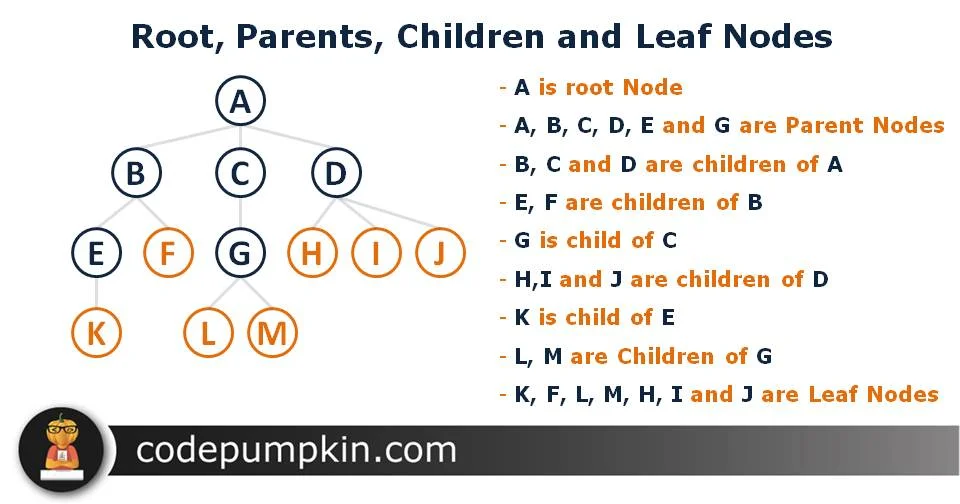

<h4>Note:</h4>
<ul>
<li>Node: The generic term for any item in the DOM tree</li>
<li>Element: A specific type of node that represents HTML tags</li>
</ul>


<h3 id="document-object">Document Object:</h3>
<p>The document object is your entry point to the entire DOM. It represents the whole HTML document and provides methods to access and manipulate everything within it.</p>

```html
<!DOCTYPE html>
<html lang="en">

<head>
    <meta charset="UTF-8">
    <meta name="viewport" content="width=device-width, initial-scale=1.0">
    <title>Document Object Model</title>
</head>

<body>
    <h1>Welcome to My Page</h1>
    <p>This is a simple HTML document.</p>

    <script>
        // Document object properties
        console.log(document);                  // Document object
        console.log(document.documentElement);  // <html> element
        console.log(document.head);             // <head> element  
        console.log(document.body);             // <body> element
        console.log(document.title);            // Page title
        console.log(document.URL);              // Current URL
        console.log(document.domain);           // Domain name
        console.log(document.forms);            // All forms in the document
        console.log(document.images);           // All images in the document
        console.log(document.links);            // All links in the document
        console.log(document.scripts);          // All scripts in the document
    </script>
</body>

</html>
```


<h3 id="parent-child-and-sibling-relationships">Parent, Child, and Sibling Relationships</h3>

```html
<!DOCTYPE html>
<html lang="en">

<head>
    <meta charset="UTF-8">
    <meta name="viewport" content="width=device-width, initial-scale=1.0">
    <title>Document Object Model</title>
</head>

<body>
    <div id="parent">
        <p id="first-child">First paragraph</p>
        <p id="second-child">Second paragraph</p>
        <span id="last-child">Span element</span>
    </div>

    <script>
        const parent = document.getElementById('parent');
        const firstChild = document.getElementById('first-child');
        const secondChild = document.getElementById('second-child');
        const lastChild = document.getElementById('last-child');

        // Parent relationships
        console.log(firstChild.parentNode);        // The div element
        console.log(firstChild.parentElement);     // Also the div element

        // Child relationships
        console.log(parent.children);              // All child elements
        console.log(parent.firstElementChild);     // First p element
        console.log(parent.lastElementChild);      // The span element

        // Sibling relationships
        console.log(firstChild.nextElementSibling);    // Second p element
        console.log(firstChild.previousElementSibling); // null (no previous sibling)
        console.log(secondChild.nextElementSibling);   // Span element
        console.log(secondChild.previousElementSibling); // First p element
    </script>
</body>

</html>
```
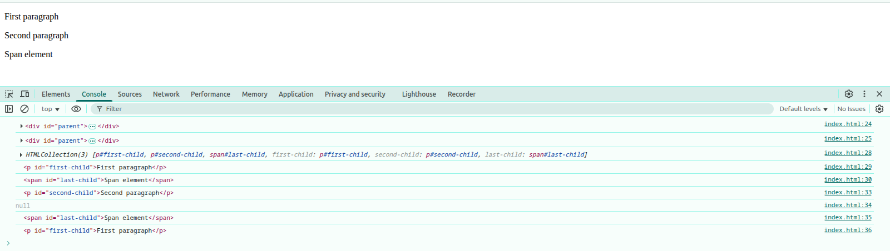

<p>In this code:</p>
<ul>
<li>The div is the parent of all three elements inside it</li>
<li>The p and span elements are children of the div</li>
<li>The two p elements and the span are siblings to each other</li>
</ul>


<h3 id="dom-vs-bom">DOM VS BOM:</h3>
<table>
<tr>
<th>DOM</th>
<th>BOM</th>
</tr>
<tr>
<td>Controls the document content</td>
<td>Controls browser features outside the document</td>
</tr>
<tr>
<td>Standardized by W3C/WHATWG</td>
<td>Not standardized (varies between browsers)</td>
</tr>
<tr>
<td>Accessed Using document object</td>
<td>Accessed Using window object</td>
</tr>
</table>

```html
<!DOCTYPE html>
<html lang="en">

<head>
    <meta charset="UTF-8">
    <meta name="viewport" content="width=device-width, initial-scale=1.0">
    <title>Document Object Model</title>
</head>

<body>
    <h1 id="myHeading">Hello World!</h1>

    <script>
        // DOM
        const heading = document.getElementById("myHeading");
        heading.textContent = "Hello from DOM!";

        // BOM
        const url = window.location.href;
        console.log("Current URL:", url);

        window.alert("Welcome to the DOM and BOM example!");
    </script>
</body>

</html>
```
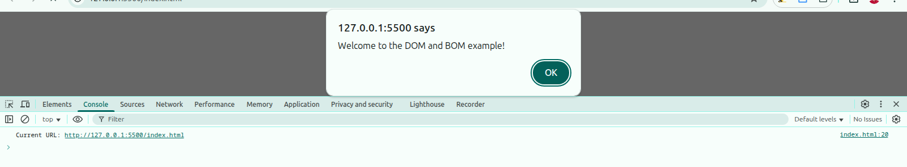
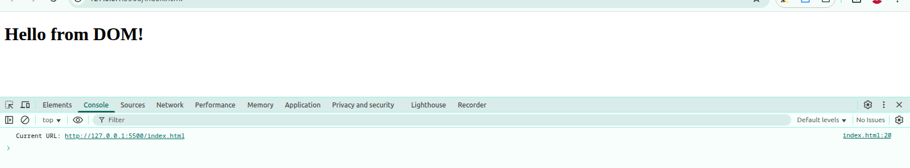

<hr>


<h2 id="element-selecting-methods" align="center">Elements selecting methods</h2>

<ol>

<li>
<h4 id="getElementById()">getElementById()</h4>
<p>Selects a single element by its id attribute:</p>

```html
<!DOCTYPE html>
<html lang="en">

<head>
    <meta charset="UTF-8">
    <meta name="viewport" content="width=device-width, initial-scale=1.0">
    <title>DOM Elements selecting methods</title>
</head>

<body>
    <h1 id="title">Hello World</h1>

    <script>
        const element = document.getElementById("title");
        console.log(element); // Output: <h1 id="title">Hello World</h1>
        console.log(element.tagName); // Output: H1
        console.log(element.id); // Output: title
        console.log(element.className); // Output: (empty string, since no class is assigned)
        console.log(element.innerHTML); // Output: Hello World
        console.log(element.textContent); // Output: Hello World
        console.log(element.outerHTML); // Output: <h1 id="title">Hello World
    </script>
</body>

</html>
```

</li>

<li>
<h4 id="getElementsByClassName()">getElementsByClassName()</h4>
<p>Selects all elements with the given class name:</p>

```html
<!DOCTYPE html>
<html lang="en">

<head>
    <meta charset="UTF-8">
    <meta name="viewport" content="width=device-width, initial-scale=1.0">
    <title>DOM Elements selecting methods</title>
</head>

<body>
    <p class="note">Note 1</p>
    <p class="note">Note 2</p>

    <script>
        const elements = document.getElementsByClassName("note");
        console.log(elements); // Output: HTMLCollection(2) [p.note, p.note]
        for (let el of elements) {
            console.log(el.innerHTML); // Output: Note 1, Note 2
        }
    </script>

</body>

</html>
```
</li>

<li>
<h4 id="getElementsByTagName()">getElementsByTagName()</h4>
<p>Selects all elements with the specified tag name:</p>

```html
<!DOCTYPE html>
<html lang="en">

<head>
    <meta charset="UTF-8">
    <meta name="viewport" content="width=device-width, initial-scale=1.0">
    <title>DOM Elements selecting methods</title>
</head>

<body>
    <ul>
        <li>Apple</li>
        <li>Banana</li>
    </ul>

    <script>
        const items = document.getElementsByTagName("li");
        console.log(items) // HTMLCollection(2) [li, li]
        for (let item of items) {
            console.log(item.innerHTML); // Output: Apple, Banana
        }
    </script>
</body>

</html>
```
</li>

<li>
<h4 id="getElementsByName()">getElementsByName()</h4>
<p>Selects elements with a specific name attribute. Mostly used with input, code, textarea, or select :</p>

```html
<!DOCTYPE html>
<html lang="en">

<head>
    <meta charset="UTF-8">
    <meta name="viewport" content="width=device-width, initial-scale=1.0">
    <title>DOM Elements selecting methods</title>
</head>

<body>
    <input type="text" name="username">
    <input type="text" name="username">

    <script>
        const inputs = document.getElementsByName("username");
        console.log(inputs); // This will log a NodeList of all input elements with name "username"
        console.log(inputs[0]); // This will log the first input element with name "username"
        console.log(inputs[1]); // This will log the second input element with name "username
        for (let input of inputs) {
            console.log(input); // This will log each input element with name "username"
        }
        inputs.forEach(input => input.value = "Tamim");
    </script>

</body>

</html>
```

</li>

<li>
<h4 id="querySelector()">querySelector()</h4>
<p>Selects the first element that matches a CSS selector:</p>

```html
<!DOCTYPE html>
<html lang="en">

<head>
    <meta charset="UTF-8">
    <meta name="viewport" content="width=device-width, initial-scale=1.0">
    <title>DOM Elements selecting methods</title>
</head>

<body>
    <div class="card">Card 1</div>
    <div class="card">Card 2</div>

    <div>
        <p>One</p>
        <p>Two</p>
    </div>

    <input type="text" name="userName" value="Tamim">
    <input type="text" name="age">

    <script>
        const firstCard = document.querySelector(".card");
        console.log(firstCard.textContent); // Output: Card 1

        const paragraph = document.querySelector("div > p");
        console.log(paragraph.innerHTML) // Output: One

        const input = document.querySelector("input[name='userName']");
        console.log(input.value); // Output: Tamim

        const input2 = document.querySelector("input[name='age']");
        input2.value = "25"; // Set value to 25
    </script>

</body>

</html>
```
</li>

<li>
<h4 id="querySelectorAll()">querySelectorAll()</h4>
<p>Selects all elements that match a CSS selector:</p>

```html
<!DOCTYPE html>
<html lang="en">

<head>
    <meta charset="UTF-8">
    <meta name="viewport" content="width=device-width, initial-scale=1.0">
    <title>DOM Elements selecting methods</title>
</head>

<body>
    <p class="note">Note A</p>
    <p class="note">Note B</p>

    <div>
        <p>One</p>
        <p>Two</p>
    </div>

    <script>
        const notes = document.querySelectorAll(".note");
        notes.forEach(note => console.log(note.innerHTML)); // Output: Note A, Note B

        const paragraphs = document.querySelectorAll("div > p");
        console.log(paragraphs); // NodeList(2) [p, p]
        for (const paragraph of paragraphs) {
            console.log(paragraph.innerHTML); // Output: One, Two
        }
    </script>

</body>

</html>
```
</li>

</ol>

<hr>


<h2 id="dom-traversing" align="center">DOM Traversing</h2>
<p>DOM traversing means navigating the DOM tree from one node to another using relationships like parent, child, and sibling.</p>

<p>It allows you to:</p>

<ul>
<li>Find elements relative to a selected element</li>
<li>Move between nodes (parents, children, siblings)</li>
<li>Manipulate structure dynamically (add/remove/update nodes)</li>
</ul>


<h3 id="parentNode-vs-parentElement">parentNode vs parentElement:</h3>
<p>Both parentNode and parentElement are used to access the parent of a node in the DOM, But:</p>
<ul>
<li>parentNode returns any type of parent node.</li>
<li>parentElement returns only if the parent is an Element node</li>
</ul>


```html
<!DOCTYPE html>
<html lang="en">

<head>
    <meta charset="UTF-8">
    <meta name="viewport" content="width=device-width, initial-scale=1.0">
    <title>DOM Traversing</title>
</head>

<body>

    <div id="container">
        <p id="child">Hello</p>
    </div>


    <script>
        const child = document.getElementById("child");

        console.log(child.parentNode); // <div id="container">...</div>
        console.log(child.parentElement); // <div id="container">...</div>

        console.log(document.body.parentNode); // <html>...</html>
        console.log(document.body.parentElement); // <html>...</html>

        console.log(document.documentElement.parentNode); // #document (http://127.0.0.1:5500/index.html)
        console.log(document.documentElement.parentElement); // null
    </script>

</body>

</html>
```

<h3 id="childNodes-vs-children">childNodes vs children:</h3>
<ul>
<li>childNodes: Returns all types of nodes.</li>
<li>children: returns only element nodes.</li>
</ul>

```html
<!DOCTYPE html>
<html lang="en">

<head>
    <meta charset="UTF-8">
    <meta name="viewport" content="width=device-width, initial-scale=1.0">
    <title>DOM Traversing</title>
</head>

<body>

    <ul id="list">
        <li>Item 1</li>
        <li>Item 2</li>
        <!-- A comment -->
        <li>Item 3</li>
    </ul>


    <script>
        const list = document.getElementById("list");

        console.log(list.childNodes);
        // NodeList(9) [text, li, text, li, text, li, text, comment, text]

        console.log(list.children);
        // HTMLCollection(3) [li, li, li]

    </script>

</body>

</html>
```

<h3 id="firstChild-vs-firstElementChild">firstChild vs firstElementChild:</h3>
<ul>
<li>firstChild: Returns the first child node, which may be: (text, element etc)</li>
<li>firstElementChild: Returns only the first element child.</li>
</ul>

```html
<!DOCTYPE html>
<html lang="en">

<head>
    <meta charset="UTF-8">
    <meta name="viewport" content="width=device-width, initial-scale=1.0">
    <title>DOM Traversing</title>
</head>

<body>

    <div id="wrapper">
        <!-- whitespace -->
        <h2>Heading</h2>
    </div>


    <script>
        const wrapper = document.getElementById("wrapper");

        console.log(wrapper.firstChild);         // #text
        console.log(wrapper.firstElementChild);  // <h2>Heading</h2>

    </script>

</body> 

</html>
```

<h3 id="lastChild-vs-lastElementChild">lastChild vs lastElementChild:</h3>
<p>Same as above but accesses the last child node instead.</p>

```html
<!DOCTYPE html>
<html lang="en">

<head>
    <meta charset="UTF-8">
    <meta name="viewport" content="width=device-width, initial-scale=1.0">
    <title>DOM Traversing</title>
</head>

<body>

    <div id="wrapper">
        <!-- whitespace -->
        <h2>Heading</h2>
        <!-- comment -->
    </div>


    <script>
        const wrapper = document.getElementById("wrapper");

        console.log(wrapper.lastChild); // #text
        console.log(wrapper.lastElementChild); // <h2>Heading</h2>

    </script>

</body>

</html>
```

<h3 id="nextSibling-vs-nextElementSibling">nextSibling vs nextElementSibling:</h3>
<ul>
<li>nextSibling: Returns the next sibling node.</li>
<li>nextElementSibling: return only next sibling element node</li>
</ul>

```html
<!DOCTYPE html>
<html lang="en">

<head>
    <meta charset="UTF-8">
    <meta name="viewport" content="width=device-width, initial-scale=1.0">
    <title>DOM Traversing</title>
</head>

<body>

    <div>
        <p id="p1">One</p>
        <!-- comment -->
        <p id="p2">Two</p>
    </div>


    <script>
        const firstP = document.getElementById("p1");

        console.log(firstP.nextSibling);         // #text
        console.log(firstP.nextElementSibling);  // <p id="p2">Two</p>

    </script>

</body>

</html>
```

<h3 id="previousSibling-vs-previousElementSibling">previousSibling vs previousElementSibling</h3>
<p>Same as above, but but accesses the previous sibling instead of next.</p>

```html
<!DOCTYPE html>
<html lang="en">

<head>
    <meta charset="UTF-8">
    <meta name="viewport" content="width=device-width, initial-scale=1.0">
    <title>DOM Traversing</title>
</head>

<body>

    <div>
        <p id="p1">One</p>
        <!-- comment -->
        <p id="p2">Two</p>
    </div>


    <script>
        const secondP = document.getElementById("p2");

        console.log(secondP.previousSibling);         // #text
        console.log(secondP.previousElementSibling);  // <p id="p1">One</p>

    </script>

</body>

</html>
```
<hr>


<h2 id="content-manipulation" align="center">Content Manipulation</h2>

<h3 id="innerHTML-vs-outerHTML-vs-textContent-vs-innerText">innerHTML vs outerHTML vs textContent vs innerText:</h3>

| Property      | Returns...                                 | Includes Tags | Includes Hidden Text  | Editable |
| ------------- | ------------------------------------------ | ------------- | --------------------- | -------- |
| `innerHTML`   | HTML content **inside** the element        | ✅ Yes         | ✅ Yes                 | ✅ Yes    |
| `outerHTML`   | Full HTML **including the element itself** | ✅ Yes         | ✅ Yes                 | ✅ Yes    |
| `textContent` | All text (even hidden) without HTML        | ❌ No          | ✅ Yes                 | ✅ Yes    |
| `innerText`   | Only **visible** text (like in UI)         | ❌ No          | ❌ No (ignores hidden) | ✅ Yes    |


```html
<!DOCTYPE html>
<html lang="en">

<head>
    <meta charset="UTF-8">
    <meta name="viewport" content="width=device-width, initial-scale=1.0">
    <title>DOM Traversing</title>
</head>

<body>

    <div id="demo">
        Hello <span style="display:none">Hidden</span> World
    </div>

    <script>
        const el = document.getElementById("demo");

        console.log(el.innerHTML);   // "Hello <span style="display:none">Hidden</span> World"
        console.log(el.outerHTML); // "<div id="demo">Hello <span style="display:none">Hidden</span> World</div>"
        console.log(el.textContent); // "Hello Hidden World"
        console.log(el.innerText);   // "Hello World"
    </script>

</body>

</html>
```
<hr>


<h2 id="Element-Attributes-and-Properties" align="center">Element Attributes and Properties</h2>

<h3 id="element-attributes" align="center">Element Attributes<h3>

<h4 id="getAttribute()-setAttribute()-removeAttribute()-and-hasAttribute()">getAttribute(), setAttribute(), removeAttribute() and hasAttribute():</h4>

```html
<!DOCTYPE html>
<html lang="en">

<head>
    <meta charset="UTF-8">
    <meta name="viewport" content="width=device-width, initial-scale=1.0">
    <title>DOM Traversing</title>
</head>

<body>

    <a id="link" href="https://example.com">Visit</a>

    <input type="checkbox" checked>

    <script>
        const a = document.getElementById("link");

        console.log(a.getAttribute("href"));  // "https://example.com"
        a.setAttribute("target", "_blank");
        console.log(a.getAttribute("target")); // "_blank"

        a.removeAttribute("target");
        console.log(a.hasAttribute("target")); // false
        console.log(a.hasAttribute("href"));  // true


        const chk = document.querySelector("input");

        console.log(chk.hasAttribute("checked")); // true
        chk.removeAttribute("checked");

    </script>

</body>

</html>
```

<h4 id="attributes-property">attributes property:</h4>
<p>Returns a NamedNodeMap of all attributes on the element.</p>

```html
<!DOCTYPE html>
<html lang="en">

<head>
    <meta charset="UTF-8">
    <meta name="viewport" content="width=device-width, initial-scale=1.0">
    <title>DOM Traversing</title>
</head>

<body>

    <a id="link" href="https://example.com">Visit</a>


    <script>
        const a = document.getElementById("link");

        console.log(a.attributes); // NamedNodeMap {0: id, 1: href, id: id, href: href, length: 2}

        for (let attr of a.attributes) {
            console.log(attr.name + " = " + attr.value);
        }

        /*
        id = link
        href = https://example.com
        */
    </script>

</body>

</html>
```


<h3 id="element-properties" align="center">Element properties</h3>

<h4 id="id-className-classList">id, className, classList:</h4>

```html
<!DOCTYPE html>
<html lang="en">

<head>
    <meta charset="UTF-8">
    <meta name="viewport" content="width=device-width, initial-scale=1.0">
    <link href="https://cdn.jsdelivr.net/npm/daisyui@5" rel="stylesheet" type="text/css" />
    <script src="https://cdn.jsdelivr.net/npm/@tailwindcss/browser@4"></script>

    <title>Element Properties</title>
</head>

<body>

    <div id="box" class="text-red-500 bg-green-600 border-10 border-blue-500 p-6">Hello Worlds</div>

    <script>
        const box = document.getElementById("box");

        console.log(box.id);
        console.log(box.className);
        console.log(box.classList);
        // DOMTokenList(5) ['text-red-500', 'bg-green-600', 'border-10', 'border-blue-500', 'p-6' value: 'text-red-500 bg-green-600 border-10 border-blue-500 p-6']

        // classList methods
        box.classList.add("text-6xl");
        box.classList.remove("text-red-500");
        console.log(box.classList.contains("text-6xl")); // true
        console.log(box.classList.contains("text-red-500")); // false
    </script>

</body>

</html>
```

<h3 id="tagName-vs-nodeName">tagName vs nodeName:</h3>
<p>Both give the tag name of an element, but nodeName works for any node, tagName only for elements node</p>

```html
<!DOCTYPE html>
<html lang="en">

<head>
    <meta charset="UTF-8">
    <meta name="viewport" content="width=device-width, initial-scale=1.0">
    <link href="https://cdn.jsdelivr.net/npm/daisyui@5" rel="stylesheet" type="text/css" />
    <script src="https://cdn.jsdelivr.net/npm/@tailwindcss/browser@4"></script>

    <title>Element Properties</title>
</head>

<body>
    <div id="myDiv">
        Hello, <span>World!</span>
    </div>

    <script>
        const divElement = document.getElementById("myDiv");

        // tagName and nodeName of the element
        console.log("divElement.tagName:", divElement.tagName);     // DIV
        console.log("divElement.nodeName:", divElement.nodeName);   // DIV

        // Let's look at a text node
        const textNode = divElement.firstChild;

        console.log("textNode.nodeName:", textNode.nodeName);       // #text
        console.log(textNode.tagName); // This will be undefined

        // Let's check the <span> tag inside the div
        const spanElement = divElement.querySelector("span");
        console.log("spanElement.tagName:", spanElement.tagName);   // SPAN
        console.log("spanElement.nodeName:", spanElement.nodeName); // SPAN
    </script>
</body>

</html>
```

<h3 id="nodeType-and-nodeValue">nodeType and nodeValue:</h3>

```html
<!DOCTYPE html>
<html lang="en">

<head>
    <meta charset="UTF-8">
    <meta name="viewport" content="width=device-width, initial-scale=1.0">
    <link href="https://cdn.jsdelivr.net/npm/daisyui@5" rel="stylesheet" type="text/css" />
    <script src="https://cdn.jsdelivr.net/npm/@tailwindcss/browser@4"></script>

    <title>Element Properties</title>
</head>

<body>
    <div id="box" class="text-red-500 bg-green-600 border-10 border-blue-500 p-6"></div>

    <script>
        console.log(box.nodeType);   // 1 (Element note)

        const textNode = document.createTextNode("Hello");
        console.log(textNode.nodeType);   // 3 (text node)
        console.log(textNode.nodeValue); // "Hello"
    </script>
</body>

</html>
```

```
1 → Element Node (<tag>)

3 → Text Node ("Text inside tag")

8 → Comment Node (<!-- comment -->)

9 → Document Node (document)
```

<h4 id="form-element-properties"> Form Element Properties:</h4>

```html
<!DOCTYPE html>
<html lang="en">

<head>
    <meta charset="UTF-8">
    <meta name="viewport" content="width=device-width, initial-scale=1.0">
    <link href="https://cdn.jsdelivr.net/npm/daisyui@5" rel="stylesheet" type="text/css" />
    <script src="https://cdn.jsdelivr.net/npm/@tailwindcss/browser@4"></script>

    <title>Element Properties</title>
</head>

<body>
    <input id="nameInput" value="Tamim">
    <input type="checkbox" id="subscribe" checked>
    <select id="options">
        <option selected>One</option>
        <option>Two</option>
    </select>

    <script>
        const input = document.getElementById("nameInput");
        console.log(input.value); // "Tamim"

        const checkbox = document.getElementById("subscribe");
        console.log(checkbox.checked); // true

        const select = document.getElementById("options");
        console.log(select.value); // "One"
    </script>
</body>

</html>
```

<hr>


<h2 id="css-and-class-styling" align="center">CSS and Class Styling</h2>
<h3 id="css-styling" align="center">CSS Styling</h3>

<h3 id="style-property">Style Property:</h3>
<p>style property is used to get or set inline styles of an HTML element using JavaScript.</p>

```html
<!DOCTYPE html>
<html lang="en">

<head>
    <meta charset="UTF-8">
    <meta name="viewport" content="width=device-width, initial-scale=1.0">
    <link href="https://cdn.jsdelivr.net/npm/daisyui@5" rel="stylesheet" type="text/css" />
    <script src="https://cdn.jsdelivr.net/npm/@tailwindcss/browser@4"></script>

    <title>Element Properties</title>
</head>

<body>
    <div id="box" style="color: red;">Hello</div>

    <script>
        const box = document.getElementById("box");

        console.log(box.style.color); // "red"
        box.style.backgroundColor = "yellow";
    </script>
</body>

</html>
```

<p><strong>Note:</strong> JS follow camelCase css names:</p>

| CSS Name           | JavaScript Style Name |
| ------------------ | --------------------- |
| `background-color` | `backgroundColor`     |
| `font-size`        | `fontSize`            |
| `z-index`          | `zIndex`              |
| `border-radius`    | `borderRadius`        |


<h3 id="cssText-property">cssText property:</h3>
<ul>
<li>Lets you set multiple styles at once as a string.</li>
<li>Overwrites all existing inline styles.</li>
</ul>

```html
<!DOCTYPE html>
<html lang="en">

<head>
    <meta charset="UTF-8">
    <meta name="viewport" content="width=device-width, initial-scale=1.0">
    <link href="https://cdn.jsdelivr.net/npm/daisyui@5" rel="stylesheet" type="text/css" />
    <script src="https://cdn.jsdelivr.net/npm/@tailwindcss/browser@4"></script>

    <title>Element Properties</title>
</head>

<body>
    <div id="box" style="color: red;">Hello</div>

    <script>
        const box = document.getElementById("box");

        box.style.cssText = "color: white; background: black; padding: 10px;";
    </script>
</body>

</html>
```

<h3 id="getComputedStyle()-method">getComputedStyle() method:</h3>
<p>getComputedStyle() method returns the final computed styles of an element (after applying all CSS rules: external, inline, inherited, default) for Read-only.</p>

```html
<!DOCTYPE html>
<html lang="en">

<head>
    <meta charset="UTF-8">
    <meta name="viewport" content="width=device-width, initial-scale=1.0">
    <title>Element Properties</title>

    <link href="https://cdn.jsdelivr.net/npm/daisyui@5" rel="stylesheet" type="text/css" />
    <script src="https://cdn.jsdelivr.net/npm/@tailwindcss/browser@4"></script>

    <style>
        #card {
            background-color: red;
            color: white;
            font-size: 24px;
            width: 300px;
        }
    </style>
</head>

<body>
    <div id="card" style="text-align: center;">Hello</div>

    <script>
        const box = document.getElementById("card");
        const styles = getComputedStyle(box);

        console.log(styles);          // Logs all computed styles object of the element
        console.log(styles.textAlign); // center
        console.log(styles.width);    //  300px
        console.log(styles.color);    // rgb(255, 255, 255)
    </script>
</body>

</html>
```


<h3 id="class-styling" align="center">Class Styling:</h3>

<h4 id="className-property">className Property:</h4>

```html
<!DOCTYPE html>
<html lang="en">

<head>
    <meta charset="UTF-8">
    <meta name="viewport" content="width=device-width, initial-scale=1.0">
    <link href="https://cdn.jsdelivr.net/npm/daisyui@5" rel="stylesheet" type="text/css" />
    <script src="https://cdn.jsdelivr.net/npm/@tailwindcss/browser@4"></script>

    <title>Element Properties</title>
</head>

<body>
    <div id="card" class="text-6xl bg-red-500">Hello</div>


    <script>
        const card = document.getElementById("card");

        // Accessing and modifying class
        console.log(card.className);      // "text-6xl bg-red-500"
        card.className = "text-2xl bg-green-500";     // Replaces all classes
    </script>
</body>

</html>
```

<h4 id="classList-methods">classList methods</h4>
<p>classList gives you a powerful interface to manage individual classes.</p>

```html
<!DOCTYPE html>
<html lang="en">

<head>
    <meta charset="UTF-8">
    <meta name="viewport" content="width=device-width, initial-scale=1.0">
    <link href="https://cdn.jsdelivr.net/npm/daisyui@5" rel="stylesheet" type="text/css" />
    <script src="https://cdn.jsdelivr.net/npm/@tailwindcss/browser@4"></script>

    <title>Element Properties</title>
</head>

<body>
    <!DOCTYPE html>
    <html lang="en">

    <head>
        <meta charset="UTF-8">
        <meta name="viewport" content="width=device-width, initial-scale=1.0">
        <link href="https://cdn.jsdelivr.net/npm/daisyui@5" rel="stylesheet" type="text/css" />
        <script src="https://cdn.jsdelivr.net/npm/@tailwindcss/browser@4"></script>

        <title>Element Properties</title>
    </head>

    <body>
        <div id="card" class="text-6xl bg-red-500">Hello</div>


        <script>
            const card = document.getElementById("card");

            // Add class
            card.classList.add("text-white");

            // Remove class
            card.classList.remove("text-6xl");

            // Check if a class exists
            console.log(card.classList.contains("text-white")); // true

            // replace class
            card.classList.replace("bg-red-500", "bg-blue-500");
        </script>
    </body>

    </html>
</body>

</html>
```
<hr>


<h2 id="Creating-Adding-and-Removing-Elements-methods" align="center">Creating, Adding and Removing Elements methods<h2>

<h3 id="creating-elements" align="center">Creating Elements</h3>
<ul>

<li>
<h4>createElement()</h4>
<ul>
<li>Creates a new element node.</li>
<li>Does not automatically add it to the DOM — you must insert it manually.</li>
</ul>

```html
<!DOCTYPE html>
<html lang="en">

<head>
    <meta charset="UTF-8">
    <meta name="viewport" content="width=device-width, initial-scale=1.0">
    <title>Element Properties</title>

    <link href="https://cdn.jsdelivr.net/npm/daisyui@5" rel="stylesheet" type="text/css" />
    <script src="https://cdn.jsdelivr.net/npm/@tailwindcss/browser@4"></script>
</head>

<body>

    <script>
        const div = document.createElement("div");
        div.textContent = "Hello World";
        div.className = "bg-blue-500 text-white p-4 rounded-lg shadow-lg";
        document.body.appendChild(div); // Adds to the page
    </script>
</body>

</html>
```
</li>

<li>
<h4 id="createTextNode()">createTextNode()</h4>
<ul><li>Creates a text node (just text, no HTML).</li></ul>

```html
<!DOCTYPE html>
<html lang="en">

<head>
    <meta charset="UTF-8">
    <meta name="viewport" content="width=device-width, initial-scale=1.0">
    <title>Element Properties</title>

    <link href="https://cdn.jsdelivr.net/npm/daisyui@5" rel="stylesheet" type="text/css" />
    <script src="https://cdn.jsdelivr.net/npm/@tailwindcss/browser@4"></script>
</head>

<body>

    <script>
        const p = document.createElement("p");
        const text = document.createTextNode("This is a text node");
        p.appendChild(text);
        document.body.appendChild(p);
    </script>
</body>

</html>
```
</li>

<li>
<h4 id="createDocumentFragment()">createDocumentFragment()</h4>
<ul>
<li>A lightweight container for temporary DOM storage.</li>
<li>Useful for inserting many nodes at once.</li>
</ul>

```html
<!DOCTYPE html>
<html lang="en">

<head>
    <meta charset="UTF-8">
    <meta name="viewport" content="width=device-width, initial-scale=1.0">
    <title>Element Properties</title>
</head>

<body>
    <ul id="myList"></ul>

    <script>
        const fragment = document.createDocumentFragment();

        for (let i = 1; i <= 3; i++) {
            let li = document.createElement("li");
            li.textContent = `Item ${i}`;
            fragment.appendChild(li);
        }

        document.getElementById("myList").appendChild(fragment);

    </script>
</body>

</html>
```
</li>

<li>
<h4 id="cloneNode()">cloneNode()</h4>
<ul>
<li>Creates a copy of an element.</li>
<li>cloneNode(true) → deep clone (includes children).</li>
<li>cloneNode(false) → shallow clone (element only).</li>
</ul>

```html
<!DOCTYPE html>
<html lang="en">

<head>
    <meta charset="UTF-8">
    <meta name="viewport" content="width=device-width, initial-scale=1.0">
    <title>Element Properties</title>

    <link href="https://cdn.jsdelivr.net/npm/daisyui@5" rel="stylesheet" type="text/css" />
    <script src="https://cdn.jsdelivr.net/npm/@tailwindcss/browser@4"></script>
</head>

<body>
    <div id="original">
        <h2>Hello</h2>
        <p>This is a paragraph.</p>
    </div>

    <script>
        const original = document.getElementById("original");

        // Shallow Clone (no children)
        const shallowClone = original.cloneNode(false);
        document.body.appendChild(shallowClone); // nothing show in the page
        console.log("Shallow Clone:", shallowClone.outerHTML);
        /*
        Shallow Clone: <div id="original"></div>
        */

        // Deep Clone (includes children)
        const deepClone = original.cloneNode(true);
        document.body.appendChild(deepClone);
        console.log("Deep Clone:", deepClone.outerHTML);
        /*
        Deep Clone: <div id="original">
            <h2>Hello</h2>
            <p>This is a paragraph.</p>
        </div>
        */
    </script>
</body>

</html>
```
</li>

</ul>


<h3 id="adding-elements" align="center">Adding Elements</h3>
<ul>

<li>
<h4>appendChild()</h4>
<ul><li>Adds a node as the last child of a parent.</li></ul>

```html
<!DOCTYPE html>
<html lang="en">

<head>
    <meta charset="UTF-8">
    <meta name="viewport" content="width=device-width, initial-scale=1.0">
    <title>Element Properties</title>
</head>

<body>
    <ul>
        <li>Hello</li>
    </ul>

    <script>
        const li = document.createElement("li");
        li.innerText = "Hi";
        document.querySelector("ul").appendChild(li);
    </script>
</body>

</html>
```
</li>

<li>
<h4 id="insertBefore()">insertBefore()</h4>
<ul><li>Inserts a node before a reference node.</li></ul>

```html
<!DOCTYPE html>
<html lang="en">

<head>
    <meta charset="UTF-8">
    <meta name="viewport" content="width=device-width, initial-scale=1.0">
    <title>Element Properties</title>
</head>

<body>
    <ul>
        <li>Hello</li>
    </ul>

    <script>
        const ul = document.querySelector("ul");
        const li = document.createElement("li");
        li.innerText = "Hi";
        ul.insertBefore(li, ul.firstChild);
    </script>
</body>

</html>
```
</li>

<li>
<h4 id="insertAdjacentElement()">insertAdjacentElement()</h4>
<ul>
<li>Inserts an element relative to another element.</li>
<li>Position Options:</li>
<ul>
<li>"beforebegin" → before element itself</li>
<li>"afterbegin" → inside element, before first child</li>
<li>"beforeend" → inside element, after last child</li>
<li>"afterend" → after element itself</li>
</ul>
</ul>

```html
<!DOCTYPE html>
<html lang="en">

<head>
    <meta charset="UTF-8">
    <meta name="viewport" content="width=device-width, initial-scale=1.0">
    <title>Element Properties</title>

    <link href="https://cdn.jsdelivr.net/npm/daisyui@5" rel="stylesheet" type="text/css" />
    <script src="https://cdn.jsdelivr.net/npm/@tailwindcss/browser@4"></script>
</head>

<body>
    <div id="target">
        <p>Target Element</p>
    </div>

    <script>
        const target = document.getElementById("target");

        // beforebegin
        const beforeBeginEl = document.createElement("div");
        beforeBeginEl.textContent = '1. beforebegin';
        target.insertAdjacentElement("beforebegin", beforeBeginEl);

        // afterbegin
        const afterBeginEl = document.createElement("div");
        afterBeginEl.textContent = '2. afterbegin';
        target.insertAdjacentElement("afterbegin", afterBeginEl);

        // beforeend
        const beforeEndEl = document.createElement("div");
        beforeEndEl.textContent = '3. beforeend';
        target.insertAdjacentElement("beforeend", beforeEndEl);

        // afterend
        const afterEndEl = document.createElement("div");
        afterEndEl.textContent = '4. afterend';
        target.insertAdjacentElement("afterend", afterEndEl);
    </script>
</body>

</html>
```
</li>

<li>
<h4 id="insertAdjacentHTML()">insertAdjacentHTML()</h4>
<ul><li>Same as insertAdjacentElement(), but here you can inset HTML directly at a position:</li></ul>

```html
<!DOCTYPE html>
<html lang="en">

<head>
    <meta charset="UTF-8">
    <meta name="viewport" content="width=device-width, initial-scale=1.0">
    <title>Element Properties</title>

    <link href="https://cdn.jsdelivr.net/npm/daisyui@5" rel="stylesheet" type="text/css" />
    <script src="https://cdn.jsdelivr.net/npm/@tailwindcss/browser@4"></script>
</head>

<body>
    <div id="target">
        <p>Target Element</p>
    </div>

    <script>
        const target = document.getElementById("target");

        // beforebegin
        target.insertAdjacentHTML("beforebegin", "<div>1. beforebegin</div>");

        // afterbegin
        target.insertAdjacentHTML("afterbegin", "<div>2. afterbegin</div>");

        // beforeend
        target.insertAdjacentHTML("beforeend", "<div>3. beforeend</div>");

        // afterend
        target.insertAdjacentHTML("afterend", "<div>4. afterend</div>");
    </script>
</body>

</html>
```
</li>

<li>
<h4 id="insertAdjacentText()">insertAdjacentText()</h4>
<ul><li>Same as insertAdjacentElement() and insertAdjacentHTML(), but here you just inset plain text at a position:</li></ul>

```html
<!DOCTYPE html>
<html lang="en">

<head>
    <meta charset="UTF-8">
    <meta name="viewport" content="width=device-width, initial-scale=1.0">
    <title>Element Properties</title>

    <link href="https://cdn.jsdelivr.net/npm/daisyui@5" rel="stylesheet" type="text/css" />
    <script src="https://cdn.jsdelivr.net/npm/@tailwindcss/browser@4"></script>
</head>

<body>
    <div id="target">
        <p>Target Element</p>
    </div>

    <script>
        const target = document.getElementById("target");

        // beforebegin
        target.insertAdjacentText("beforebegin", "1. beforebegin");

        // afterbegin
        target.insertAdjacentText("afterbegin", "2. afterbegin");

        // beforeend
        target.insertAdjacentText("beforeend", "3. beforeend");

        // afterend
        target.insertAdjacentText("afterend", "4. afterend");
    </script>
</body>

</html>
```
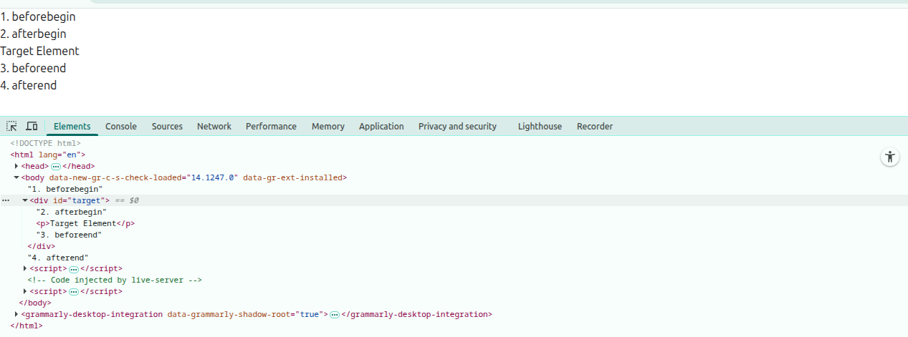
</li>

<li>
<h4 id="before()-parpend()-append()-after()">before(), parpend(), append(), after()</h4>
<p>Can insert nodes or strings directly.</p>
<ul>
<li>before() → before element itself</li>
<li>prepend() → inside element, before first child</li>
<li>append() → inside element, after last child</li>
<li>after() → after element itself</li>
</ul>

```html
<!DOCTYPE html>
<html lang="en">

<head>
    <meta charset="UTF-8">
    <meta name="viewport" content="width=device-width, initial-scale=1.0">
    <title>Element Properties</title>
</head>

<body>
    <ul id="ul">
        <li>Item</li>
    </ul>
    <br><br>
    <br><br>
    <ol id="ol">
        <li>Item</li>
    </ol>

    <script>
        const UlList = document.querySelector("ul");

        // create string directly
        UlList.before("Before Item");
        UlList.prepend("First Item ");
        UlList.append("Last Item");
        UlList.after("After Item");


        const olList = document.querySelector("ol");

        // Create elements directly
        const beforeItem = document.createElement("li");
        beforeItem.textContent = "Before Item";
        olList.before(beforeItem);

        const firstItem = document.createElement("li");
        firstItem.textContent = "First Item";
        olList.prepend(firstItem);

        const lastItem = document.createElement("li");
        lastItem.textContent = "Last Item";
        olList.append(lastItem);

        const afterItem = document.createElement("li");
        afterItem.textContent = "After Item";
        olList.after(afterItem);


    </script>
</body>

</html>
```
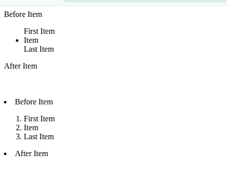
</li>

</ul>


<h3 id="removing-elements" align="center">Removing Elements</h3>
<ul>
<li>
<h4>removeChild()</h4>
<ul><li>Removes a child node from its parent.</li></ul>

```html
<!DOCTYPE html>
<html lang="en">

<head>
    <meta charset="UTF-8">
    <meta name="viewport" content="width=device-width, initial-scale=1.0">
    <title>Element Properties</title>

    <link href="https://cdn.jsdelivr.net/npm/daisyui@5" rel="stylesheet" type="text/css" />
    <script src="https://cdn.jsdelivr.net/npm/@tailwindcss/browser@4"></script>
</head>

<body>
    <ul>
        <li>Hello</li>
        <li>World</li>
    </ul>

    <script>
        const list = document.querySelector("ul");
        const lastItem = list.lastElementChild;
        list.removeChild(lastItem);
    </script>
</body>

</html>
```
</li>

<li>
<h4 id="remove()">remove()</h4>
<ul><li>Removes the element directly.</li></ul>

```html
<!DOCTYPE html>
<html lang="en">

<head>
    <meta charset="UTF-8">
    <meta name="viewport" content="width=device-width, initial-scale=1.0">
    <title>Element Properties</title>

    <link href="https://cdn.jsdelivr.net/npm/daisyui@5" rel="stylesheet" type="text/css" />
    <script src="https://cdn.jsdelivr.net/npm/@tailwindcss/browser@4"></script>
</head>

<body>
    <ul>
        <li>Hello</li>
        <li>World</li>
    </ul>

    <script>
        document.querySelector("ul").remove();
    </script>
</body>

</html>
```
</li>
<li>
<h4 id="replaceChild()">replaceChild()</h4>
<ul><li>Replaces one child with another.</li></ul>

```html
<!DOCTYPE html>
<html lang="en">

<head>
    <meta charset="UTF-8">
    <meta name="viewport" content="width=device-width, initial-scale=1.0">
    <title>Element Properties</title>

    <link href="https://cdn.jsdelivr.net/npm/daisyui@5" rel="stylesheet" type="text/css" />
    <script src="https://cdn.jsdelivr.net/npm/@tailwindcss/browser@4"></script>
</head>

<body>
    <ul>
        <li>Hello</li>
        <li>World</li>
    </ul>

    <script>
        const list = document.querySelector("ul");
        const oldItem = list.lastElementChild;
        const newItem = document.createElement("li");
        newItem.textContent = "New Item";
        list.replaceChild(newItem, oldItem);
    </script>
</body>

</html>
```
</li>

<li>
<h4 id="replaceWith()">replaceWith()</h4>
<ul><li>Replaces an element directly.</li></ul>

```html
<!DOCTYPE html>
<html lang="en">

<head>
    <meta charset="UTF-8">
    <meta name="viewport" content="width=device-width, initial-scale=1.0">
    <title>Element Properties</title>

    <link href="https://cdn.jsdelivr.net/npm/daisyui@5" rel="stylesheet" type="text/css" />
    <script src="https://cdn.jsdelivr.net/npm/@tailwindcss/browser@4"></script>
</head>

<body>
    <p>Hello World</p>

    <script>
        const p = document.querySelector("p");
        const h = document.createElement("h1");
        h.innerText = "Hello World 2";

        p.replaceWith(h);
    </script>
</body>

</html>
```
</li>
</ul>

<hr>


<h2 id="event-handling" align="center">Event Handling</h2>


<h3  align="center" id="event-basic">Event Basic</h3>

<h4 id="what-is-event">What is events:</h4>
<p>Events are signals that something has happened — like a button click, key press, page load, etc. You can "listen" for these events and run code in response.</p>

<h4 id="common-vent-types">Common Event Types:</h4>

<ul>
<li>click: When an element is clicked.</li>
<li>submit: When a form is submitted.</li>
<li>load: When the page or an image finishes loading.</li>
<li>keydown, keyup: Keyboard interactions.</li>
<li>mouseover, mouseout: Mouse movement events.</li>
</ul>

<h4 id="event-object">Event Object:</h4>
<p>Every event has an associated event object that contains information about the event.</p>

```html
<!DOCTYPE html>
<html lang="en">

<head>
    <meta charset="UTF-8">
    <meta name="viewport" content="width=device-width, initial-scale=1.0">
    <title>Title</title>
</head>

<body>
    <button id="myBtn">Click Me</button>

    <script>
        document.getElementById('myBtn').addEventListener('click', function (event) {
            console.log(event); // Event object - PointerEvent {isTrusted: true, …}
            console.log(event.type); // click
            console.log(event.target); // Button element - <button id="myBtn">Click Me</button>
        });
    </script>
</body>

</html>
```

<h4 id="preventDefault()">preventDefault():</h4>
<p>Stops the browser’s default behavior.</p>

```html
<!DOCTYPE html>
<html lang="en">

<head>
    <meta charset="UTF-8">
    <meta name="viewport" content="width=device-width, initial-scale=1.0">
    <title>Title</title>
</head>

<body>
    <a href="https://example.com" id="link">Click Me</a>

    <script>
        document.getElementById("link").addEventListener("click", (event) => {
            event.preventDefault(); // Prevents redirect
            alert("Default action prevented!");
        });
    </script>

</body>

</html>
```


<h4 id="stopPropagation()">StopPropagation()</h4>
<p>Stops the event from bubbling up to parent elements</p>

```html
<!DOCTYPE html>
<html lang="en">

<head>
    <meta charset="UTF-8">
    <meta name="viewport" content="width=device-width, initial-scale=1.0">
    <title>Title</title>
</head>

<body>
    <div id="parent">
        <button id="child">Click Me</button>
    </div>

    <script>
        document.getElementById("parent").addEventListener("click", () => {
            alert("Parent Clicked");
        });

        document.getElementById("child").addEventListener("click", (e) => {
            e.stopPropagation(); // Prevent parent click
            alert("Child Clicked");
        });
    </script>


</body>

</html>
```


<h3 align="center" id="adding-event-listeners">Adding Event Listeners</h3>

<h4 id="addEventListener()">addEventListener():</h4>

```html
<!DOCTYPE html>
<html lang="en">

<head>
    <meta charset="UTF-8">
    <meta name="viewport" content="width=device-width, initial-scale=1.0">
    <title>Title</title>
</head>

<body>
    <button id="btns">Click Me</button>

    <script>
        document.getElementById("btns").addEventListener("click", function () {
            alert("Button clicked");
        });
    </script>
</body>

</html>
```

<h4 id="removeEventListener()">removeEventListener():</h4>
<p>To remove the event listener, you need to use the same function reference for both addEventListener() and removeEventListener().</p>

```html
<!DOCTYPE html>
<html lang="en">

<head>
    <meta charset="UTF-8">
    <meta name="viewport" content="width=device-width, initial-scale=1.0">
    <title>Title</title>
</head>

<body>
    <button id="btns">Click Me</button>

    <script>
        /*
        document.getElementById("btns").addEventListener("click", function () {
            alert("Button clicked");
        });
        document.getElementById("btns").removeEventListener("click", function () {
            alert("Button clicked");
        });
        */
        // The above removeEventListener will not work because the function reference is different.
        // To remove the event listener, you need to use the same function reference for both cases.
        const alertFunction = () => {
            alert("Button clicked");
        };
        document.getElementById("btns").addEventListener("click", alertFunction);
        document.getElementById("btns").removeEventListener("click", alertFunction);
    </script>
</body>

</html>
```

<h4 id="onClick-vs-addEventListener()">onClick vs addEventListener():</h4>

<p>With onclick perperty you can't add multiple event handler function. If you assign more than one evet handler to onclick, it overwrites the previous one.</p>

```html
<!DOCTYPE html>
<html lang="en">

<head>
    <meta charset="UTF-8">
    <meta name="viewport" content="width=device-width, initial-scale=1.0">
    <title>Title</title>
</head>

<body>
    <button id="btn" onclick="alert('Inline clicked')">Click Me</button>

    <script>
        const btn = document.getElementById("btn");

        btn.onclick = function () {
            console.log("First handler");
        };

        btn.onclick = function () {
            console.log("Second handler"); // Only this one runs
        };
    </script>

</body>

</html>
```

<p>But, with addEventListener() methods you can add multiple event handler function.</p>

```html
<!DOCTYPE html>
<html lang="en">

<head>
    <meta charset="UTF-8">
    <meta name="viewport" content="width=device-width, initial-scale=1.0">
    <title>Title</title>
</head>

<body>
    <button id="btn">Click Me</button>

    <script>
        const btn = document.getElementById("btn");

        btn.addEventListener("click", function () {
            console.log("First handler");
        });

        btn.addEventListener("click", function () {
            console.log("Second handler");
        });
    </script>
</body>

</html>
```


<h3 align="center" id="event-flow">Event Flow</h3>
<p>DOM events go through 3 phases:</p>

<ol>
<li>Capturing: Event starts from the root and goes down.</li>
<li>Target: The actual element that triggered the event.</li>
<li>Bubbling: Event goes back up to the root.</li>
</ol>

```html
<!DOCTYPE html>
<html lang="en">

<head>
    <meta charset="UTF-8">
    <meta name="viewport" content="width=device-width, initial-scale=1.0">
    <title>Title</title>
</head>

<body>

    <div id="outer">
        Outer Div
        <div id="middle">
            Middle Div
            <div id="inner">
                Inner Div (Click Me)
            </div>
        </div>
    </div>

    <script>
        const outer = document.getElementById("outer");
        const middle = document.getElementById("middle");
        const inner = document.getElementById("inner");

        // Capturing Phase (3rd parameter = true)
        /*
        in the third argument true means that the event listener will be triggered during the capturing phase.
        If the third argument is false (by default), the event listener will be triggered during the bubbling phase
        */

        outer.addEventListener("click", () => {
            console.log("Outer DIV - Capturing");
        }, true);

        middle.addEventListener("click", () => {
            console.log("Middle DIV - Capturing");
        }, true);

        inner.addEventListener("click", () => {
            console.log("Inner DIV - Capturing");
        }, true);

        // Bubbling Phase (default, 3rd parameter = false)
        outer.addEventListener("click", () => {
            console.log("Outer DIV - Bubbling");
        });

        middle.addEventListener("click", () => {
            console.log("Middle DIV - Bubbling");
        });

        inner.addEventListener("click", () => {
            console.log("Inner DIV - Bubbling");
        });
    </script>

</body>

</html>
```

<h3 align="center" id="common-events">Common Events</h3>
 <ul>
    <li><strong>Mouse Events</strong>
      <ul>
        <li>click</li>
        <li>dblclick</li>
        <li>mousedown</li>
        <li>mouseup</li>
        <li>mousemove</li>
        <li>mouseenter</li>
        <li>mouseleave</li>
        <li>mouseover</li>
        <li>mouseout</li>
        <li>contextmenu</li>
      </ul>
    </li>
    <li><strong>Keyboard Events</strong>
      <ul>
        <li>keydown</li>
        <li>keypress</li> <!-- Deprecated -->
        <li>keyup</li>
      </ul>
    </li>
    <li><strong>Form Events</strong>
      <ul>
        <li>submit</li>
        <li>reset</li>
        <li>change</li>
        <li>input</li>
        <li>focus</li>
        <li>blur</li>
        <li>focusin</li>
        <li>focusout</li>
      </ul>
    </li>
    <li><strong>Clipboard Events</strong>
      <ul>
        <li>copy</li>
        <li>cut</li>
        <li>paste</li>
      </ul>
    </li>
    <li><strong>Drag and Drop Events</strong>
      <ul>
        <li>drag</li>
        <li>dragstart</li>
        <li>dragend</li>
        <li>dragenter</li>
        <li>dragleave</li>
        <li>dragover</li>
        <li>drop</li>
      </ul>
    </li>
    <li><strong>Touch Events (Mobile)</strong>
      <ul>
        <li>touchstart</li>
        <li>touchend</li>
        <li>touchmove</li>
        <li>touchcancel</li>
      </ul>
    </li>
    <li><strong>Pointer Events</strong>
      <ul>
        <li>pointerdown</li>
        <li>pointerup</li>
        <li>pointermove</li>
        <li>pointerover</li>
        <li>pointerout</li>
        <li>pointerenter</li>
        <li>pointerleave</li>
        <li>pointercancel</li>
      </ul>
    </li>
    <li><strong>Focus Events</strong>
      <ul>
        <li>focus</li>
        <li>blur</li>
        <li>focusin</li>
        <li>focusout</li>
      </ul>
    </li>
    <li><strong>Window Events</strong>
      <ul>
        <li>load</li>
        <li>unload</li>
        <li>beforeunload</li>
        <li>resize</li>
        <li>scroll</li>
        <li>error</li>
        <li>hashchange</li>
        <li>popstate</li>
      </ul>
    </li>
    <li><strong>Media Events</strong>
      <ul>
        <li>play</li>
        <li>pause</li>
        <li>ended</li>
        <li>volumechange</li>
        <li>timeupdate</li>
        <li>durationchange</li>
        <li>loadeddata</li>
        <li>loadedmetadata</li>
        <li>seeking</li>
        <li>seeked</li>
        <li>stalled</li>
        <li>suspend</li>
        <li>waiting</li>
      </ul>
    </li>
    <li><strong>Animation Events</strong>
      <ul>
        <li>animationstart</li>
        <li>animationend</li>
        <li>animationiteration</li>
      </ul>
    </li>
    <li><strong>Transition Events</strong>
      <ul>
        <li>transitionstart</li>
        <li>transitionend</li>
        <li>transitionrun</li>
        <li>transitioncancel</li>
      </ul>
    </li>
    <li><strong>Wheel Events</strong>
      <ul>
        <li>wheel</li>
      </ul>
    </li>
    <li><strong>Composition Events</strong>
      <ul>
        <li>compositionstart</li>
        <li>compositionupdate</li>
        <li>compositionend</li>
      </ul>
    </li>
    <li><strong>Other Events</strong>
      <ul>
        <li>DOMContentLoaded</li>
        <li>visibilitychange</li>
        <li>online</li>
        <li>offline</li>
        <li>message</li>
        <li>storage</li>
        <li>animationcancel</li>
        <li>toggle</li>
      </ul>
    </li>
  </ul>

<h3 align="center" id="event-delegation">Event Delegation</h3>
<p>Instead of adding listeners to every child, you add one listener to a common parent and use event.target to identify the clicked child.</p>


```html
<!DOCTYPE html>
<html lang="en">

<head>
    <meta charset="UTF-8">
    <meta name="viewport" content="width=device-width, initial-scale=1.0">
    <title>Title</title>
</head>

<body>

    <ul id="list">
        <li>Item 1</li>
        <li>Item 2</li>
    </ul>

    <script>
        document.getElementById("list").addEventListener("click", function (e) {
            if (e.target.tagName === "LI") {
                alert("Clicked: " + e.target.textContent);
            }
        });
    </script>


</body>

</html>
```
<hr>