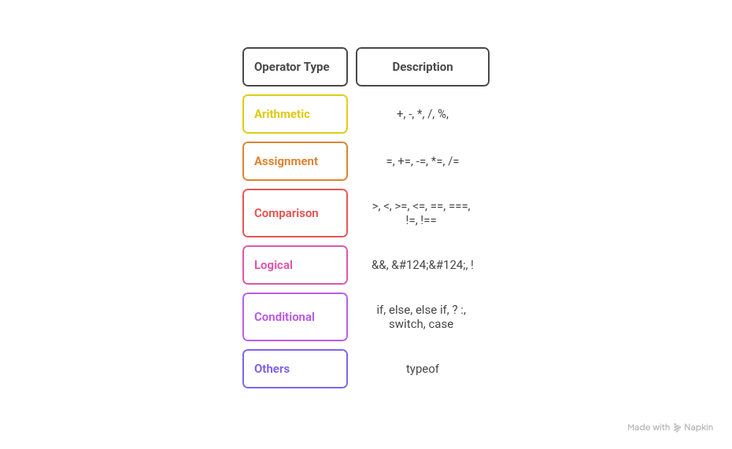
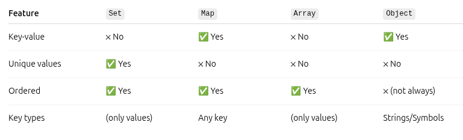

<h1 align="center">JavaScript Notes</h1>

<h2>Table of Contents</h2>

<ul>
  <li><a href="#part-1-the-javascript-language">Part 1: The JavaScript Language</a></li>
    <ul >
        <li><a href="#an-introduction-to-javaScript">An Introduction to JavaScript</a></li>
        <ul>
          <li><a href="#what-is-javaScript">What is JavaScript</a></li>
          <li><a href="#javascript-history">JavaScript History</a></li>
          <li><a href="#why-did-javascript-need-a-standard-version">Why did javascript need a standard version.</a></li>
          <li><a href="#javascript-engines">Javascript Engines</a></li>
          <li><a href="#netscape-mozila-firefox-transition">Netscape - Mozilla - Firefox: The Transition</a></li>
        </ul>
        <li><a href="#hello-world">Hello, world!</a></li>
        <li><a href="#variables">variables</a></li>
        <ul>
          <li><a href="#difference-between-var-and-let">Difference between var and let</a></li>
           <li><a href="#var-hoisting-issue">var Hoisting Issue</a></li>
        </ul>
           <li><a href="#operators">Operator</a></li>
           <ul>
            <li><a href="#assignment-operator">Assignment Operator</a></li>
            <li><a href="#increment-decrement-operator">Increment/Decrement Operator</a></li>
            <li><a href="#comparison-operator">Comparison Operator</a></li>
            <li><a href="#logical-operator">Logical Operator</a></li>
            <li><a href="#conditional-operator">Conditional Operator</a></li>
            <li><a href="#others-operator">Others Operator</a></li>
           </ul>
              <li><a href="#loops">Loops</a></li>
              <ul>
                <li><a href="#for-loop">for Loop</a></li>
                <li><a href="#while-loop">while Loop</a></li>
                <li><a href="#do-while-loop">do-while Loop</a></li>
                <li><a href="#for-of-loop">for-of Loop</a></li>
                <li><a href="#for-each-method">fo-each Method</a></li>
                <li><a href="#for-in-loop">for-in Loop</a></li>
              </ul>
        <li><a href="#data-types">Data Types</a></li>
        <ul>
          <li><a href="#7-primitive-data-types">7 Primitive Data Types</a></li>
          <ul>
            <li><a href="#number">Number</a></li>
            <ul>
              <li><a href="#math-methods">Math Methods</a></li>
            </ul>
            <li><a href="#bigint">BigInt</a></li>
            <li><a href="#string">String</a></li>
            <ul>
              <li><a href="#string-methods">String Methods</a></li>
            </ul>
            <li><a href="#boolean">Boolean</a></li>
            <li><a href="#null">Null</a></li>
            <li><a href="#undefined">Undefined</a></li>
            <li><a href="#symbol">Symbol</a></li>
          </ul>
          <li><a href="#1-non-primitive-data-types">1 Non-primitive data types (Object)</a></li>
          <ul>
            <li><a href="#object">Object</a></li>
            <ul>
            <li><a href="#in-operator">in Operator</a></li>
            <li><a href="#for-in">for-in Loop</a></li>
            <li><a href="#object-reference-and-copying">Object References and Coping</a></li>
            <li><a href="#cloning-and-merging-and-object.assign">Cloning and Merging and object.assign</a></li>
            <li><a href="#object-methods">Object Methods</a></li>
            <li><a href="#constructor-function-and-new-operator">Constructor function and new operator</a></li>
            <li><a href="#">for-in Loop</a></li>
            <li><a href="#optional-chaining">Optional Chaining</a></li>
            <li><a href="#date">Date</a></li>
            </ul>
            <li><a href="#function">Function</a></li>
            <ul>
            <li><a href="#what-is-the-difference-between-return-and-no-return">What is the difference between return and no return</a></li>
            <li><a href="#default-parameter">Default parameter</a></li>
            <li><a href="#arrow-function">Arrow function</a></li>
            <li><a href="#recursion">Recursion</a></li>
            </ul>
            <li><a href="#array">Array</a></li>
            <ul>
              <li><a href="#for-of">for of</a></li>
              <li><a href="#array-methods">Array Methods</a></li>
              <ul>
                  <li><a href="#adding-removing-elements">Adding /
                  Removing Elements</a></li>
                  <ul>
                      <li><a href="#push/pop-and-unshift/shift">Push / pop and unshift / shift</a></li>
                      <li><a href="#splice">splice</a></li>
                      <li><a href="#slice">slice</a></li>
                  </ul>
                    <li><a href="#searching-location">Searching / Location</a></li>
                    <ul>
                        <li><a href="#indexof">indexOf</a></li>
                        <li><a href="#lastIndexOf">lastIndexOf</a></li>
                        <li><a href="#includes">Includes</a></li>
                    </ul>
                    <li><a href="#iteration-transformation">Iteration / Transformation</a></li>
                    <ul>
                            <li><a href="#forEach">forEach</a></li>
                            <li><a href="#map">map</a></li>
                            <li><a href="#filter">filter</a></li>
                            <li><a href="#find">find</a></li>
                            <li><a href="#findIndex">findIndex</a></li>
                            <li><a href="#reduce">reduce</a></li>
                    </ul>
                      <li><a href="#reordering-combining">Reordering / Combining</a></li>
                      <ul>
                          <li><a href="#concat">concat</a></li>
                          <li><a href="#join">join</a></li>
                          <li><a href="#reverse">reverse</a></li>
                          <li><a href="#sort">sort</a></li>
                      </ul>
                      <li><a href="#others">Others</a></li>
                      <ul>
                          <li><a href="#some">some</a></li>
                          <li><a href="#every">every</a></li>
                          <li><a href="#at">at</a></li>
                          <li><a href="#isArray">isArray</a></li>
                          <li><a href="#fill">Fill</a></li>
                      </ul>
              </ul>
            </ul>
            <li><a href="#map-data-type">map</a></li>
            <ul>
               <li><a href="#looping-through-a-map">Looping through a map</a></li>
               <ul>
                 <li><a href="#map-for-of-loop">Using for of loop</a></li>
                <li><a href="#map-forEach-method">Using for each method</a></li>
                 <li><a href="#map-build-in-methods-for-keys,values-entries">Using Map build in methods: keys, values,entries</a></li>
               </ul>
                <li><a href="#basic-map-methods">Basic Map Methods</a></li>
                <ul>
                   <li><a href="#set()">set()</a></li>
                  <li><a href="#get()">get()</a></li>
                  <li><a href="#has()">has()</a></li>
                  <li><a href="#delete()">delete()</a></li>
                  <li><a href="#clear()">clear()</a></li>
                  <li><a href="#size">size</a></li>
                </ul>
                <li><a href="#converting">Converting</a></li>
                <ul>
                   <li><a href="#convert-map-to-array">Convert map to array</a></li>
                  <li><a href="#convert-map-to-object">Convert map to object</a></li>
                  <li><a href="#convert-object-to-map">Convert object to map</a></li>
                </ul>
                <li><a href="#map-keys-can-be-anything">map keys can be anything</a></li>
            </ul>
            <li><a href="#set">Set</a></li>
            <ul>
               <li><a href="#looping-through-a-set">Looping through a set</a></li>
               <ul>
                 <li><a href="#using-for-of">Using for of loop</a></li>
                <li><a href="#using-for-each">Using for each method</a></li>
               </ul>
                <li><a href="#basic-set-methods">Basic set Methods</a></li>
                <ul>
                   <li><a href="#set-add()">add()</a></li>
                  <li><a href="#set-has()">has()</a></li>
                  <li><a href="#set-delete()">delete()</a></li>
                  <li><a href="#set-clear()">clear()</a></li>
                  <li><a href="#set-size()">size</a></li>
                </ul>
                <li><a href="#set-converting">Converting</a></li>
                <ul>
                   <li><a href="#set-converting-set-to-array">Convert set to array</a></li>
                  <li><a href="#set-converting-array-to-set">Convert array to set</a></li>
                </ul>
                <li><a href="#set-can-store-any-type">set can store any types</a></li>
                <li><a href="#remove-duplicates-from-array">Remove duplicates from array</a></li>
                <li><a href="#set-vs-map-vs-array-vs-object">Set Vs Map Vs Array Vs Object</a></li>
            </ul>
          </ul>
        </ul>
        <li><a href="#destructuring">Destructuring</a></li>
        <ul>
          <li><a href="#array-destructuring">Array Destructuring</a></li>
          <li><a href="#object-destructuring">Object Destructuring</a></li>
          <li><a href="#destructuring-function-parameters">Destructuring function parameters</a></li>
        </ul>
        <li><a href="#json">JSON</a></li>
        <ul>
          <li><a href="#JSON.stringify()">JSON.stringify()</a></li>
          <li><a href="#JSON.parse()">JSON.parse()</a></li>
        </ul>
        <li><a href="#error-handling">Error Handling</a></li>
    </ul>
  <li><a href="#part-2-browser-document-events-interfaces">Part 2: Browser: Document, Events, Interfaces</a></li>
  <li><a href="#part-3-additional-articles">Additional articles</a></li>
</ul>

<!-- part 1: -->
<h1 id="#part-1-the-javascript-language" align="center">Part 1: The JavaScript Language</h1>

<h3 id="an-introduction-to-javaScript" align="center">An Introduction to JavaScript:</h3>

<h3 id="what-is-javaScript">What is JavaScript:</h3>

JavaScript is a programming language for the web. The programs in JavaScript are called scripts because they are small, dynamic, and <a href="#interpreter">interpreted</a> pieces of code designed to run in the browser without <a href="#compiler">compiling</a> the entire program.

JavaScript code is written and send to the browser as plain text, not compiled machine code. Unlike some other programming languages (such as C, C++, or Java) that require compilation of the whole program before running, JavaScript is <a href="#interpreter">interpreted</a> and <a href="#just-in-time-compiled">just-in-time compiled</a> in the browser at <a href="#runtime">runtime</a>. In this way, JavaScript is fundamentally different from compiled languages like C, C++, and Java, which need to be processed by a <a href="#compiler">compiler</a> before running.

<h3 id="javascript-history">JavaScript History:</h3>

In 1995, Brendan Eich, a developer at Netscape Communications Corporation, created JavaScript. Eich initially joined Netscape with the intention of implementing the Scheme programming language in the browser. However, Netscape’s management wanted the Scheme language syntax resemble and look similar to Java. As a result, Eich decided to designed a new language that combined:

<ul>
  <li>The functionality of Scheme programming language</li>
  <li>The object-orientation of Self programming language</li>
  <li>And The syntax of Java programming language</li>
</ul>

He completed the first version of the language called <a href="#mocha">Mocha</a> in just 10 days in May 1995.

<ul>
  <li><strong>LiveScript (September 1995)</strong> – The first version of the language released to the public was called LiveScript, included with the beta version of Netscape Navigator 2.0 Browser.</li>
  

<strong>Note:</strong> Alongside the language, Eich also built the first JavaScript engine written in C, to run LiveScript in the Navigator browser.

</ul>
<ul>
  <li><strong>JavaScript (December 1995)</strong> – The final name, officially announced in collaboration with Sun Microsystems</li>
  
<strong>Why netscape collaborate with Sun Microsystems?</strong>

  
The main reason is Marketing and Branding:

  <ul>
    <li>
    Sun Microsystems was the creator of the Java programming language, which was very popular and highly hyped at the time. To take advantage of this popularity, Netscape wanted their new scripting language (originally called Mocha, later renamed LiveScript) to gain more attention. So, they partnered with Sun Microsystems and renamed their language to JavaScript, even though Java and JavaScript are completely different languages with different purposes and designs.
</li>
</ul>
  <li>
    <strong>ES1 (1997)</strong> - First official standardized version of JavaScript
  </li>

<strong>Note:</strong> 
In June 1997 JavaScript was submitted to ECMA (European Computer Manufacturers Association) International to create a standard version of the language, so all browsers could implement it consistently. 
So, ECMAScript is the official name of the JavaScript standard and ES1, ES2, ES6 etc. are its version numbers.

</ul>

<h3 id="why-did-javascript-need-a-standard-version">Why Did JavaScript Need a Standard Version:</h3>

When JavaScript was first created in 1995 by Netscape, it was only implemented in their browser Netscape Navigator. Shortly, Microsoft launched its own browser, Internet Explorer, and included its own version of JavaScript called JScript. As a result, two distinct versions of JavaScript were emerged in the market:

<ul>
  <li>JavaScript in Netscape Navigator</li>
  <li>JScript in Internet Explorer</li>
</ul>

<strong>The Problems:</strong>

<ul>
  <li>Different browsers had slightly different implementations of JavaScript.</li>
  <li>Some features worked in one browser but not in another.</li>
  <li>This caused a lot of bugs and confusion for web developers.</li>
  <li>Developers had to write browser-specific code, which made websites harder to build and maintain.</li>
</ul>

<strong>The Solution:</strong> 
To solve this problem, Netscape submitted JavaScript to ECMA International in June 1997, so they could create a standardized specification of the language. This standard was named ECMAScript.

<h3 id="javascript-engines">JavaScript Engines:</h3>

A JavaScript engine is a program built into web browsers (and platforms like Node.js) that is responsible for executing JavaScript code.

It takes the JavaScript you write, then:

<ol>
  <li><a href="#parsing">Parsing</a></li>
  <li>Compiling the <a href="#AST">AST</a> to <a href="#bytecode">Bytecode</a></li>
  <li ><a href="#interpreter">Interpreting</a></li>
  <li id="just-in-time-compiled"><a href="#jit-compilation">JIT Compilation</a></li>
</ol>

<h3 id="netscape-mozila-firefox-transition">Netscape - Mozilla - Firefox: The Transition</h3>

In the early 1990s, Netscape Navigator was one of the first widely used web browsers. It played a major role in popularizing JavaScript, which was originally built to run inside this browser.

However, by the late 1990s, Netscape began to lose market share due to intense competition from Microsoft’s Internet Explorer, which was bundled for free with Windows. As Internet Explorer dominated the browser market, Netscape couldn't keep up.

So, in 1998, Netscape open-sourced its browser code for the community to build a better browser based on Netscape’s technology. This open-source version was called Mozilla.
However, the early Mozilla browser was slow and bloated, as it still relied heavily on legacy Netscape code.

As a solution, in 2004 Mozilla developers created a lighter, faster, standalone browser called Firefox.

<h3>Q&A:</h3>
<ol>
<li id="runtime"><strong>Runtime:</strong> Browser runtime refers to the environment provided by the web browser where JavaScript code is executed using a JavaScript engine.</li>
<li id="compiler"><strong>Compiler: </strong>A compiler is a special program that performs compilation — it takes your source code and translates it into machine code</li>
<li id="mocha"><strong>Mocha:</strong> The internal name during early development by Brendan Eich at Netscape; it was never officially released under this name.</li>
<li>
  
<strong>Parsing: </strong>Parsing is the process where the JavaScript engine reads your code and breaks it down into a structured format (called an AST – Abstract Syntax Tree) so it can understand and execute it.

</li>
<li id="AST">
  
<strong>Abstract Syntax Tree (AST):</strong> 
  An AST is a tree-like structure that represents the syntax and structure of your code.
  Each part of your code becomes a node, and all nodes are connected to each other.

<strong>Example:</strong>

<strong>JS Code:</strong> 
<code>let x = 5 + 3;</code>

<strong>AST format:</strong>

<pre><code>
{
  "type": "Program",
  "body": [
    {
      "type": "VariableDeclaration",
      "kind": "let",
      "declarations": [
        {
          "type": "VariableDeclarator",
          "id": {
            "type": "Identifier",
            "name": "x"
          },
          "init": {
            "type": "BinaryExpression",
            "operator": "+",
            "left": {
              "type": "Literal",
              "value": 5,
              "raw": "5"
            },
            "right": {
              "type": "Literal",
              "value": 3,
              "raw": "3"
            }
          }
        }
      ]
    }
  ],
  "sourceType": "script"
}
</code></pre>

Here, every "type" in the AST (e.g., "Program", "VariableDeclaration", "Literal") is a node.

</li>
<li id="bytecode">
  
<strong>Bytecode: </strong>Is an intermediate from between your original JavaScript code and the machine.

</li>
<li>
  
<strong>Interpreting:</strong> Is a process where the JS engine executes the bytecode step-by-step using an interpreter.

</li>
<li>
  
<strong>JIT (Just In time) Compilation: </strong>Is a process where the JS engine detects frequently executed “hot” code and compiles it into machine code. On future runs, the engines skips parsing, compiling AST to Bytecode, interpreting and running the machine code directly for faster execution.

</li>
</ol>

<h3 id="hello-world" align="center">Hello, world!</h3>

<pre><code>console.log("Hello World");
</code></pre>

<h3 id="whats-happened-behind-the-code">What’s happened behind the code:</h3>
<ol>
  <li>The <a href="#statement">statement</a> sends to the JavaScript Engine</li>
  <li>Parsing</li>
  <li>Compiling AST to Bytecode</li>
  <li>Interpretation</li>
  <li>JIT Compilation</li>
  <li>Calling the <code>log()</code> <a href="#method">method</a> inside the console object.
    <ul>
      <li><code>console</code> is a global object provided by the environment (browser or Node.js)</li>
      <li><code>log</code> is a method of the <code>console</code> object.</li>
      
So, <code>console.log("Hello World")</code> is a method call with <code>"Hello World"</code> as its argument.

    </ul>
  </li>
</ol>

<h3>Q&A:</h3>
<ol>
  <li id="statement"><strong>statement:</strong> A single instruction in a programming language that performs an action.</li>
  <li><strong>code:</strong> Any written instructions in a programming language, from one line to many.</li>
  <li><strong>program:</strong> A complete set of code written in a programming language to solve a problem or perform a task.</li>
  <li id="method"><strong>Method: </strong>when a function is stored as a property of an object, it’s called a method.</li>
</ol>

<h3 id="variables" align="center">Variables</h3>

A variable is a “named storage” for data. We can declare variables to store data by using the <a href="#keyword">keywords</a>:

<ul>
  <li>var: the old way to declare variables (function-scoped or global-scoped if not function-scoped, can be redeclared and updated in the same scope).</li>
  <li>let: the modern way to declare variables (block-scoped, can be updated but not redeclared in the same scope).</li>
  <li>const: declares constant variables (block-scoped, cannot be reassigned or redeclared; must be initialized at the time of declaration).</li>
</ul>

<strong>Variable Declaration:</strong>

<pre><code>let message;
</code></pre>

<strong>Variable Initialization:</strong>

<pre><code>let message = 'Hello World';
</code></pre>

<strong>Variable assignment:</strong>

<pre><code>let message = 'Hello World';
message = 'Hello Universe'
</code></pre>

<strong>Note:</strong> initialization gives a variable its first value, while assignment gives a variable a new value after it has been initialized.

<h3 id="difference-between-var-and-let">Difference between <code>var</code> and <code>let</code>:</h3>

<table>
  <thead>
    <tr>
      <th><code>var</code></th>
      <th><code>let</code></th>
    </tr>
  </thead>
  <tbody>
    <tr>
      <td>
        var is function scope:  
        It means a variable declared with var is accessible anywhere inside the same function, no matter which block it was declared in.
        <pre><code>function testScope() {
    if (true) {
        var x = 10;
    }
    console.log(x); // output: 10 
}
testScope();</code></pre>
      </td>
      <td>
        let is block-scoped:  
        It means a variable declared with let is accessible only inside the block {} where it is declared.
        <pre><code>function testScope() {
    if (true) {
        let x = 10;
    }
    console.log(x); // output: Error
}
testScope();</code></pre>
      </td>
    </tr>
    <tr>
      <td>
        Global-scoped (if not in a function):  
        If you declare a variable using var outside any function, even inside a block (like if, for), it becomes globally scoped.
        <pre><code>if (true) {
    var test = true; 
}
console.log(test); // output: true</code></pre>
      </td>
      <td>
        Still block-scoped:  
        let remains limited to the block, even when declared outside any function.
        <pre><code>if (true) {
    let test = true;
}
console.log(test); // output: error</code></pre>
      </td>
    </tr>
    <tr>
      <td>Allows redeclaration:
        <pre><code>var user = 'tamim';
var user;
user = 'Muhammad Tamim'
console.log(user) // Output: Muhammad Tamim</code></pre>
      </td>
      <td>Does not allow redeclaration:
        <pre><code>let user;
let user; // SyntaxError:</code></pre>
      </td>
    </tr>
  </tbody>
</table>

<h3 id="var-hoisting-issue">var hoisting issue:</h3>

In JavaScript, var declarations are hoisted — this means the declaration is moved to the top of the function (or top of the global scope if outside a function) during the JavaScript parsing phase.

<h4>Example 1:</h4>

<pre><code>function sayHi() {
    phrase = "Hello";
    console.log(phrase);

    var phrase;
}
sayHi(); // Output: "Hello"
</code></pre>

<pre><code>/**
 * Behind the scene:
 function sayHi() {
  var phrase;         // Declaration is hoisted
  phrase = "Hello";   // Assignment stays in place
  console.log(phrase);
}
 */</code></pre>

<h4>Example 2:</h4>

<pre><code>function sayHi() {
    phrase = "Hello"; 

    if (false) {
        var phrase; 
    }

    console.log(phrase);
}
sayHi(); // Output: "Hello"
</code></pre>

<h4>Example 3:</h4>

<pre><code>function sayHi() {
    console.log(phrase);

    var phrase = "Hello";
}
sayHi(); // Output: undefined
</code></pre>

<pre><code>/**
 *Behind the scene:
 function sayHi() {
  var phrase;           // Hoisted declaration
  console.log(phrase);  //  undefined (no value yet)
  phrase = "Hello";     // Assignment happens here
} 
 */</code></pre>

<h3>Q&A</h3>
<ol>
  <li id="keyword">A keyword is a reserved word that has a special meaning in the language.</li>
  <h4>Official Keywords (ES2024):</h4>
<pre><code>
await      break      case       catch      class
const      continue   debugger   default    delete
do         else       enum       export     extends
false      finally    for        function   if
import     in         instanceof new        null
return     super      switch     this       throw
true       try        typeof     var        void
while      with       yield
</code></pre>
</ol>

<h3 id="operators" align="center">Operators</h3>

<strong>Operator:</strong> An Operator is a special symbol or keyword that performs an operation on one or more values.

<h3>Different types of Operators:</h3>
<ul>
<li>                                                              
<h3 id="arithmetic-operator">Arithmetic Operators (+, -, *, /, %, **):</h3>

<pre><code>
console.log(2 + 3); // 5
console.log(5 - 2); // 3
console.log(4 * 2); // 8

console.log(10 / 50); // 0.2
console.log(10 % 50) // 10
console.log(50 / 10) // 5
console.log(50 % 10) // 0
// Note: For a perfect division, the dividend > divisor.
</code></pre>
  
<h3>** (Exponentiation):</h3>

a ** b = a b

Example:

<pre>
<code>console.log(2 ** 2); // 2² = 4
console.log(2 ** 3); // 2³ = 8
console.log(2 ** 4); // 2⁴ = 16
console.log(4 ** (1 / 2)); // 2 (power of 1/2 is the same as a square root)
console.log(8 ** (1 / 3)); // 2 (power of 1/3 is the same as a cubic root)
</code>
</pre>

<h3>String concatenation with +:</h3>
<pre>
<code>let s = "my" + "string";
console.log(s); // mystring
</code>
</pre>

<strong>Note:</strong> If any of the <a href="#operands">operands</a> is a string, then the other one is converted to a string too. 

<pre>
<code>console.log('1' + 2); // "12"
console.log(2 + '1'); // "21"
console.log(2 + 2 + '1'); // "41" and not "221"
console.log('1' + 2 + 2); // "122" and not "14"
</code>
</pre>

<strong>Note: </strong>The + is the only operator that supports strings concatenation. Other arithmetic operators work only with numbers and always convert their operands to numbers.

<pre>
<code>console.log(6 - '2'); // 4, converts '2' to a number
console.log('6' / '2'); // 3, converts both operands to numbers
</code>
</pre>
</li>

<li>
<h3 id="assignment-operator">Assignment Operators (=, +=, -=, *=, /=):</h3>
<pre><code>
let x = 10;
x += 5;  // x = x + 5
x -= 2;  // x = x - 2
x *= 3;  // x = x * 3
x /= 2;  // x = x / 2
</code></pre>
</li>

<li>
  <h3 id="increment-decrement-operator">Increment / Decrement Operators (--, ++):</h3>
<h4>Pre Increment / Decrement:</h4>
<pre>
<code>let i = 10;
let x = ++i;
console.log(i); // 11
console.log(x); // 11
</code>
</pre>

Explanation: : Here, i is incremented to 11 first, and then this new value is assigned to x. Both i and x are 11 after this operation.

<h4>post Increment / Decrement:</h4>
<pre>
<code>let i = 10;
let x = i++;
console.log(i); // 11
console.log(x); // 10
</code>
</pre>

Explanation: here, First, the value of i (which is 10) is assigned to the variable x. After that, i is incremented, so i becomes 11.

<strong>Note:</strong>

<ul>
<li>Pre-increment (++i): First increments the value of i, then assigns it.</li>
<li>Post-increment (i++): First assigns the value, then increments it.</li>
</ul>

</li>

<li>
  <h3 id="comparison-operator"> Comparison Operator (>, <, >=, <=, ==, ===, !=, !==):</h3>
  <pre><code>
console.log(5 > 3);     // true
console.log(5 < 3);     // false
console.log(5 >= 5);    // true
console.log(3 <= 2);    // false
console.log(5 == '5');  // true
console.log(5 === '5'); // false
console.log(5 != '5');  // false
console.log(5 !== '5'); // true
  </code></pre>

<h3>String comparison:</h3>

To see whether a string is greater than another, JavaScript uses the so-called lexicographical algorithm.

How lexicographical algorithm works:

<ol>
  <li>Strings are compared character by character from left to right.</li>
  <li>Each character is compared based on its Unicode value.</li>
  <li>The first difference determines the result.</li>
  <li>If all characters are equal and lengths differ, the shorter string is considered smaller.</li>
</ol>

<pre><code>console.log('Z' > 'A'); // true
console.log('hello' == 'hello'); // true
console.log('Glow' > 'Glee'); // true
console.log('Be' < 'Bee'); // true
</code></pre>

<h4>Difference between == and === :</h4>
<pre><code>console.log(0 == false); // 0 == 0 true
console.log('' == false); // 0 == 0 true
</code></pre>

In both cases, JavaScript uses type conversion to convert different data types (string/boolean) into numbers before comparing with ==.

<strong>Solution:</strong> === strictly checks both value and data type. If one of them missing, it immediately returns false.

<pre><code>console.log(0 === false); // false
console.log('' === false); // false
console.log(0 === 0); // true
console.log('' === ''); // true
</code></pre>

<h4>Comparison with null and undefined:</h4>
<pre><code>console.log(null === undefined); // false
console.log(null >= undefined); // false
console.log(null < undefined); // false
console.log(null == undefined); // true
// this is a special rule. If you use ==, null and undefined are considered equal.
</code></pre>

<h4>null vs 0:</h4>
 <pre><code>console.log(null > 0);  // false
console.log(null == 0); // false
console.log(null >= 0); // true 
</code></pre>

<h4>undefined vs 0:</h4>
 <pre><code>console.log(undefined > 0); // false 
console.log(undefined < 0); // false 
console.log(undefined == 0); // false
// undefined is converted to NaN in numeric comparisons
</code></pre>
</li>

<li>
  <h3 id="logical-operator">Logical Operators (&&, ||, !)</h3>

<pre><code>
let age = 25;
if (age > 18 && age < 30) {
  console.log("Young Adult");
}

let day = "Saturday";
if (day === "Saturday" || day === "Sunday") {
  console.log("Weekend");
}

let loggedIn = false;
if (!loggedIn) {
  console.log("Please log in");
}
</code></pre>
</li>

<li>
<h3 id="conditional-operator">Conditional Operators (if, else, else if, ? :, switch, case):</h3>

<pre><code>
let age = 20;

if (age < 18) {
  console.log("Minor");
} else if (age === 18) {
  console.log("Exactly 18");
} else {
  console.log("Adult");
}
</code></pre>
</li>

<h3>Ternary operator(? :):</h3>

syntax:

<pre><code>condition ? true part : false part</code></pre>

Example:

<pre><code>
let age = 18;
let message;

if (age >= 18) {
    message = "You are an adult";
} else {
    message = "You are a minor";
}
console.log(message);
</code></pre>

<pre><code>// with ternary operator
let age = 18;
let message = (age >= 18) ? "You are an adult" : "You are a minor";
console.log(message);
</code></pre>

<h3> switch...case:</h3>

<pre><code>
let color = "green";

switch (color) {
  case "red":
    console.log("Stop");
    break;
  case "green":
    console.log("Go");
    break;
  case "yellow":
    console.log("Wait");
    break;
  default:
    console.log("Unknown color");
}
// switch checks one variable against multiple cases and runs the matched block.
</code></pre>

</li>
<li>
  <h3 id="others-operator">Others Operators</h3>

<h4 id="the-typeof-operator">typeof operator:</h4>

<pre><code>
console.log(typeof undefined); // "undefined"

console.log(typeof 0); // "number"

console.log(typeof 10n); // "bigint"

console.log(typeof true); // "boolean"

console.log(typeof "foo"); // "string"

console.log(typeof Symbol("id")); // "symbol"

console.log(typeof Math); // "object"  

console.log(typeof null); // "object"  

console.log(typeof alert); 
/*
you will get "function" as output 
if you use browser console, in node 
you will get "undefined"
*/  
</code></pre>

<strong>Note:</strong>

<ul>
  <li>typeof null return "object", but null is a primitive data type.
  </li>
  <li>typeof alert returns "function", but functions are technically objects. 
  </li>
</ul>

</li>
</ul>

<h3>Q&A:</h3>
<ol>
  <li id="operands">Operand : </strong>An operand is the value that an operator works on. For example, in 5 * 2, the operands are 5 and 2.</li>
</ol>

<h3 id="loops" align="center">Loops</h3>

<h4 id="for-loop">for loop:</h4>
<pre><code>
for (let i = 0; i < 5; i++) {
    console.log(i); // 0 1 2 3 4
}
</code></pre>

<h4 id="while-loop">while loop:</h4>
<pre><code>
let i = 0;
while (i < 5) {
    console.log(i); // 0 1 2 3 4
    i++;
}
</code></pre>

<h4 id="do-while-loop">do while loop:</h4>
<pre><code>
let i = 0;
do {
    console.log(i); // 0 1 2 3 4
    i++;
} while (i < 5);
</code></pre>

<h4 id="for-of-loop">for..of loop ( for <a href="#iterable">iterables</a>(array & string) ) :</h4>

<pre><code>
// with array
const arr = ['a', 'b', 'c'];

for (const element of arr) {
    console.log(element); //  a b c
}

// with string
const str = 'hello';

for (const value of str) {
    console.log(value); // h e l l o
}
</code></pre>

<h4 id="for-each-method">forEach method (only for array):</h4>

<pre><code>
const nums = [1, 2, 3];
nums.forEach(function (num) {
    console.log(num); // 1 2 3
});

// or

const num2 = [4, 5, 6];
num2.forEach(num2 => console.log(num2)) // 4 5 6
</code></pre>

Note: It does not support break or continue.

<h4 id="for-in-loop">for..in loop (for objects): </h4>

<pre><code>
const obj = {
    a: 1,
    b: 2
};

for (const key in obj) {
    console.log(key, obj[key]);
}
/*
a 1
b 2
*/
</code></pre>

<h3>Q&A:</h3>
<ul>
  <li id="iterable">
<strong>Iterable: </strong>An iterable(array, string) is something that you can use in a for...of loop to get values one by one.
</li>
  
Or you can say:

  
If we use a for...of loop on arrays or strings, we get one value at a time —
That’s because arrays and strings are iterables,
and the act of looping one-by-one is called iteration.

</ul>

<h3 id="data-types" align="center">Data Types</h3>

A data type defines the kind of value a variable can hold (like a Number, String, Boolean, etc.)

JavaScript is a <strong>dynamically typed language</strong>, which means:

<ul>
  <li>You don’t have to declare the type of a variable.</li>
  <li>The type is determined automatically based on the value you assign.</li>
</ul>

<pre><code>let message = "hello"; // string
message = 123456;      // number
</code></pre>

There are 8 data types in JavaScript:

<h3 id="7-primitive-data-types" align="center">7 primitive data types</h3>

<h3 id="number" align="center">Number</h3>

<strong>number</strong> – Represents both integers and floating-point numbers. 
      Example: 
      <pre><code>let age = 25;
let money = 25.5;</code></pre>
    

<h3>Math Properties:</h3>
<pre><code>console.log(Math.PI);       // 3.141592653589793</code></pre>

<h3 id="math-methods">Math Methods:</h3>

<pre><code>console.log(Math.round(4.5)); // 5 
/*
Rounds to the nearest integer:
if number >= 0.5, it rounds up to the next integer
if number < 0.5, it rounds down to the previous integer
*/
console.log(Math.floor(4.9));   // 4 → Rounds down
console.log(Math.ceil(4.1));    // 5 → Rounds up
console.log(Math.trunc(4.9));   // 4 → Removes decimal part (not supported IE)

console.log(Math.pow(2, 3));    // 8 → 2 to the power of 3
console.log(Math.sqrt(25));     // 5 → Square root of 25
console.log(Math.abs(-7));      // 7 → remove negative sign

console.log(Math.min(3, 1, 7)); // 1 → Smallest number
console.log(Math.max(3, 1, 7)); // 7 → Largest number</code></pre>

<ul>
<h3 id="bigint" align="center">BigInt</h3>
    
<strong>bigint</strong> – Used for integers larger than <code>253 - 1</code>. 
      Example: <code>let big = 12345678901234567890n;</code>
    

<h3 id="string" align="center">String</h3>
    
<strong>string</strong> – Represents text, enclosed in single or double quotes. 
      Example: 
      <pre><code>let name = "Tamim";
let myName = 'tamim';</code></pre>
    

<h3>Quotes:</h3>

JavaScript supports three types of quotes for working with strings.

<ol>
  <li>Single Quotes ('...'):</li>

  <pre><code>const name = 'Tamim';
console.log(name); // Tamim</code></pre>
  
  <li>Double Quotes ("..."):</li>

  <pre><code>const language = "JavaScript";
console.log(language); // JavaScript</code></pre>

  <li>Backticks (`...`):</li>
  
Backticks are more powerful than single/double quotes. They were introduced in ES6 (2015) and allow for:

  <ul>
    <li>Multiline Strings (<small>No need for \n</small>):</li>
    
  <pre><code>const multiline = `This is line 1
This is line 2
This is line 3`;
console.log(multiline);
</code></pre>
    
  <li>String Interpolation (Insert Variables Directly):</li>
  
  <pre><code>const name = "Tamim";
const age = 20;

const info = `My name is ${name} and I am ${age} years old.`;
console.log(info);
// My name is Tamim and I am 20 years old.
</code></pre>
  
  <li>Expression Evaluation:</li>  
  <pre><code>console.log(`5 + 7 = ${5 + 7}`); // 5 + 7 = 12</code></pre>
  </ul>
</ol>

<h3>String Property: </h3>

.length is the only string property, and it’s very commonly used.

<pre><code>const str = "JavaScript";
console.log(str.length); // 10
</code></pre>

<h3 id="string-methods">String Methods:</h3>

<ul>
<li>

<strong>Case Conversion:</strong>

<pre><code>console.log("hello".toUpperCase()); // "HELLO"
console.log("WORLD".toLowerCase()); // "world"
console.log('Interface'[0].toLowerCase()); // 'i'
</code></pre>
</li>

<li>

<strong> Searching in Strings:</strong>

<pre><code>console.log("JavaScript".includes("Script")); // true
console.log("JavaScript".startsWith("Java")); // true
console.log("JavaScript".endsWith("Script")); // true
console.log("hello world".indexOf("world")); // 6
</code></pre>

Note: indexOf() method searches a string for a specific substring and returns the index (position) of the first match of found and -1 if nothing can be found.

syntax:

<pre><code>string.indexOf(searchValue, startIndex);</code></pre>

<ul>
  <li>searchValue – the substring to find</li>
  <li>startIndex (optional) – where to start the search (default is 0)</li>
</ul>

More Examples: 

<pre><code>console.log("banana".indexOf("a"));      // 1 → first "a"
console.log("banana".indexOf("a", 2));   // 3 → next "a" after index 2
console.log("banana".indexOf("z"));      // -1 → not found
</code></pre>
</li>
<li>
<h4>Extracting Part of a String: </h4>

slice(start, end): 

The slice() method returns a part of the string, starting from the given start index and ending just before the end index. If the second argument is not provided, the method extracts characters from the start index to the end of the string. Additionally, slice() supports negative values, which count from the end of the string instead of the beginning.

<pre><code>const text = "JavaScript";

console.log(text.slice(0, 4));    // "Java" (from index 0 to 3)
console.log(text.slice(4))        // "Script" (from index 4 to the end)
console.log(text.slice(-4, -1));  // "rip" (start at the 4th position from the right, end at the 2nd position from the right)</code></pre>
</li>
<li>
<h4>Replacing and Repeating:</h4>

<pre><code>console.log("I like cats".replace("cats", "dogs")); // "I like dogs"
console.log("ha".repeat(3)); // "hahaha"
</code></pre>
</li>
<li>
<h4>Joining and Splitting:</h4>

<pre><code>const sentence = "I love JavaScript";
const words = sentence.split(" "); // ["I", "love", "JavaScript"]
console.log(words.join("-"));      // "I-love-JavaScript"
</code></pre>
</li>

<li>
<h4>Removing Extra Spaces: </h4>

<pre><code>console.log("  hello world  ".trim()); // "hello world"
</code></pre>
</li>

<li>
<h3>includes, startsWith, endsWith: </h3>

<pre><code>const message = "Hello, Tamim!";
console.log(message.includes("Tamim")); // true
console.log(message.includes("hello")); // false (case-sensitive)

const greeting = "JavaScript is fun!";
console.log(greeting.startsWith("Java"));   // true
console.log(greeting.startsWith("Script")); // false
console.log(greeting.startsWith("Script", 4)); // true (starts checking from index 4)

const fileName = "report.pdf";
console.log(fileName.endsWith(".pdf"));  // true
console.log(fileName.endsWith(".txt"));  // false
console.log("JavaScript".endsWith("Script", 10)); // true
console.log("JavaScript".endsWith("Java", 4));    // true</code></pre>
</li>
</ul>

<h3>Strings are immutable:</h3>

That's mean you can't change characters directly: 

<pre><code>let str = "Hello";
str[0] = "Y";
console.log(str); // "Hello" (not "Yello")
</code></pre>

 You must create a new string instead: 

<pre><code>let str = "Hello";
let newStr = "Y" + str.slice(1);
console.log(newStr); // "Yello"
</code></pre>

<h3 id="boolean" align="center">Boolean</h3>
    
<strong>boolean</strong> – Represents true or false. 
      Example: 
      <pre><code>let isMarried = false;
let isSingle = true;</code></pre>
    

<h3 id="null" align="center">Null</h3>
    
<strong>null</strong> – Represents intentional "no value". 
      Example: <code>let data = null;</code>
    

<h3 id="undefined" align="center">Undefined</h3>    
    
<strong>undefined</strong> – A variable declared but not assigned. 
      Example: <pre><code>let result;
console.log(result) // undefined 
/* you declared a variable, but didn't assign a value. so js sets it to undefined by default. */</code></pre>
    

<h3 id="symbol" align="center">Symbol</h3>
    
<strong>symbol</strong> – Represents a unique and immutable value, mainly used to create unique identifiers for object properties. 
      Example: 

<pre><code>
let id = Symbol();

console.log(typeof id); // "symbol"

let a = Symbol("id");
let b = Symbol("id");
console.log(a === b); // false
</code></pre>
    

<h3 id="1-non-primitive-data-types" align="center">1 Non-Primitive Data Types (Object)</h3>

In JavaScript, any data that is not a primitive is as an object. There are 3 commonly used objects in JavaScript (object, function, array):
 

<h3 id="object" align="center">Objects:</h3>

An object is a collection of key-value pairs called properties. where key is a string (also called a “property name”), and value can be anything.

<pre><code>let user = {   
  name: "John",  
  age: 30        
}
</code></pre>

In the user object, there are two properties:

<ol>
  <li>The first property has the key "name" and the value "John".</li>
  <li>The second one has the key "age" and the value 30.</li>
</ol>

The user object can be imagined as a cabinet with two signed files labeled “name” and “age”:

We can add, remove and read files from it at any time by the using of dot or bracket notation:

<pre><code>
let user = {
    name: "John",
    age: 30
}

console.log(user.name); // John
console.log(user.age); // 30
user.location = "USA";
console.log(user.location); // USA
delete user.location;
console.log(user.location); // undefined
</code></pre>

We can also use multi-word property names, but then they must be quoted and when read the peppery value we need to use bracket notation.

<pre><code>let user = {
    name: "John",
    age: 30,
    "like birds": true,
}
console.log(user["like birds"]); // true
</code></pre>

In real code, we often use existing variables as values for property names:

<pre><code>function makeUser(name, age) {
    return {
        name: name,
        age: age,
    };
}

let user = makeUser("John", 30);
console.log(user.name); // John
</code></pre>

In the example above, properties have the same names as variables. so in this case we can use shorthand technique:

<pre><code>function makeUser(name, age) {
    return {
        name,
        age
    };
}

let user = makeUser("John", 30);
console.log(user.name); // John
</code></pre>

<h3 id="in-operator">Property existence test, “in” operator:</h3>

<pre><code>let user = {
    name: "John",
    age: 30,
}

console.log("age" in user); // true, user.age exists
console.log("location" in user); // false, user.location doesn't exist
</code></pre>

<h3 id="for-in">The "for..in" loop</h3>

<pre><code>let user = {
    name: "John",
    age: 30,
    isAdmin: true
};

for (let key in user) {
    console.log(key);  // name, age, isAdmin
    console.log(user[key]); // John, 30, true
}
</code></pre>

<h3 id="object-reference-and-copying">Objects References and Copying:</h3>

One of the fundamental differences of objects versus primitives is that objects are stored and copied “by reference”, whereas primitive values: strings, numbers, booleans, etc – are always copied “as a whole value”.

That’s easy to understand if we look a bit under the hood of what happens when we copy a value. Let’s start with a primitive, such as a string.
 
Here we put a copy of message into phrase:

<pre><code>let message = "Hello!";
let phrase = message;
</code></pre>

As a result we have two independent variables, each one storing the string "Hello!".

A variable doesn’t hold the object directly. It just holds a reference (or pointer) to where the object is stored in memory.

Let’s look at an example of such a variable:

<pre><code>let user = {
  name: "John"
};</code></pre>

The object is stored somewhere in memory (at the right of the picture), while the user variable (at the left) has a “reference” to it.

<strong>When an object variable is copied, the reference is copied, but the object itself is not duplicated:</strong>

<pre><code>let user = { name: "John" };

let admin = user; // copy the reference</code></pre>

Now we have two variables, each storing a reference to the same object:

As you can see, there’s still one object, but now with two variables that reference it.
 
We can use either variable to access the object and modify its contents:

<pre><code>let user = { name: 'John' };

let admin = user;

admin.name = 'Pete'; // changed by the "admin" reference

console.log(user.name); // 'Pete', 
console.log(admin.name); // 'Pete', </code></pre>

<h4>Const objects can be modified?</h4>

An important side effect of storing objects as references is that an object declared as const can be modified.

<pre><code>const user = {
    name: "John"
};

user.name = "Pete";

console.log(user.name); // Pete
</code></pre>

<h3 id="cloning-and-merging-and-object.assign">Cloning and merging and Object.assign:</h3>

So, copying an object variable creates one more reference to the same object.
 
But what if we need to duplicate an object?
 
We can create a new object and replicate the structure of the existing one, by iterating over its properties and copying them on the primitive level.
 
Like this:

<pre><code>
let user = {
    name: "John",
    age: 30
};

let clone = {}; // the new empty object

// let's copy all user properties into it
for (let property in user) {
    clone[property] = user[property];
}

console.log(clone); // { name: "John", age: 30 }
console.log(user); // { name: "John", age: 30 } 

clone.name = "Pete"; // changed the data in it

console.log(user.name); // still John in the original object
console.log(clone.name); // but Pete in the clone

console.log(clone); // { name: "Pete", age: 30 }
console.log(user); // { name: "John", age: 30 }
</code></pre>

We can also use the method <strong>Object.assign</strong>:

The syntax is:

<pre><code>Object.assign(dest, ...sources)</code></pre>
<ul>
  <li>The first argument dest is a target object.</li>
  <li>Further arguments is a list of source objects.</li>
</ul>

It copies the properties of all source objects into the target dest, and then returns it as the result.

<pre><code>let user = { name: "John" };
let permissions1 = { canView: true };
let permissions2 = { canEdit: true };

// copies all properties from permissions1 and permissions2 into user
Object.assign(user, permissions1, permissions2);

// now user = { name: "John", canView: true, canEdit: true }
console.log(user.name); // John
console.log(user.canView); // true
console.log(user.canEdit); // true
</code></pre>

We also can use Object.assign to perform a simple object cloning:

<pre><code>let user = {
    name: "John",
    age: 30
};

let clone = Object.assign({}, user);

console.log(clone.name); // John
console.log(clone.age); // 30
</code></pre>

<h3>Nested cloning:</h3>

<pre><code>let user = {
    name: "John",
    sizes: {
        height: 182,
        width: 50
    }
};

let clone = Object.assign({}, user);

console.log(user.sizes === clone.sizes); // true, same object

user.sizes.width = 60;   // Modify the original object
console.log(clone.sizes.width); // 60, get the result from the other one
</code></pre>

To fix that and make user and clone truly separate objects, we should use a cloning loop that examines each value of user[key] and, if it’s an object, then replicate its structure as well. That is called a “structured cloning”.The call <strong>structuredClone(object)</strong> clones the object with all nested properties:

<pre><code>let user = {
    name: "John",
    sizes: {
        height: 182,
        width: 50
    }
};

let clone = structuredClone(user);

console.log(user.sizes === clone.sizes); // false, different objects

user.sizes.width = 60;    // change a property from one place
console.log(clone.sizes.width); // 50, not related
</code></pre>

<h3 id="object-methods">Object Methods</h3>

A method is a function that is defined as a property of an object. It represents an action that the object can perform and can access the object’s data using the this keyword.

Example:

<pre><code>let user = {
    name: "Tamim",
    // Method shorthand (recommended)
    sayHello() {
        console.log("Hello, I'm " + this.name);
    },
    // method without shorthand
    sayHi: function () {
        console.log("Hi, I'm " + this.name);
    }
};
user.sayHello(); // Output: Hello, I'm Tamim
user.sayHi(); // Output: Hi, I'm Tamim
</code></pre>

<ul>
  <li>sayHello ia a method of user object</li>
  <li>It uses this.name to access the object’s own data.</li>
</ul>

Technically, it’s also possible to access the object without this: 

<pre><code>let user = {
    name: "Tamim",
    sayHello() {
        console.log("Hello, I'm " + user.name);
    },

};
user.sayHello(); // Output: Hello, I'm Tamim</code></pre>

But such code is unreliable. If we decide to copy user to another variable, e.g. admin = user and overwrite user with something else, then it will access the wrong object:

<pre><code>let user = {
    name: "Tamim",
    sayHello() {
        console.log(user.name);
    },
};

let admin = user;
user = null;
admin.sayHello(); // Cannot read properties of null (reading 'sayHello')</code></pre>

If we used this.name instead of user.name inside the console, then the code would work:

<pre><code>let user = {
    name: "Tamim",
    sayHello() {
        console.log(this.name);
    },
};

let admin = user;
user = null;
admin.sayHello(); // Tamim
</code></pre>

<h3 id="constructor-function-and-new-operator">Constructor function and "new" operator</h3>

A constructor function is a regular function used to create multiple objects with the same structure and behavior. By convention, the name of a constructor function starts with a capital letter to distinguish it from regular functions.

<pre><code>function Person(name, age) {
  this.name = name;
  this.age = age;
}</code></pre>

<ul>
  <li>Person is a constructor function.</li>
  <li>Inside it, this refers to the new object being created.</li>
</ul>

You call a constructor function using the new operator:

<pre><code>const p1 = new Person("Tamim", 20);
const p2 = new Person("Asha", 19);

console.log(p1.name); // Tamim
console.log(p2.age);  // 19
</code></pre>

<strong>What new Does Behind the Scenes:</strong>

When you do new Person("Tamim", 20):

<ul>
  <li>A new empty object is created: {}</li>
  <li>this inside the constructor is set to that new object</li>
  <li>Properties are added to this</li>
  <li>The object is returned automatically</li>
</ul>

<h3>When do we need a Constructor Function?</h3>

Instead of writing the same object structure again and again, you use a constructor function to make it easier and cleaner.

<strong>Without Constructor:</strong>

<pre><code>const user1 = {
  name: "Tamim",
  age: 20

};

const user2 = {
  name: "Asha",
  age: 19
};
// Repeat, repeat, repeat...</code></pre>

<strong>With Constructor Function and New operator:</strong>

<pre><code>function User(name, age) {
  this.name = name;
  this.age = age;
}

const user1 = new User("Tamim", 20);
const user2 = new User("Asha", 19);
</code></pre>

<h3 id="optional-chaining">Optional Chaining (?.)</h3>

Optional Chaining(?.) is a safe way to access deeply nested properties without getting an error if something is undefined or null.

Without Optional Chaining:

<pre><code>const user = {};
console.log(user.address.city); // error: Cannot read properties of undefined (reading 'city')</code></pre>

With Optional Chaining:

<pre><code>const user = {};
console.log(user.address?.city); // undefined
</code></pre>

if address is undefined or null optional chaining stops accessing .city and returns undefined instead of throwing an error.

we can also use optional chaining for calling method:

<pre><code>const user = {
    sayHi() {
        console.log("Hi!");
    }
};

user.sayHi?.();     // Hi!
user.sayBye?.();    // Nothing happens, no error or undefined
</code></pre>

<h3 id="date">Date:</h3>

Date is a built-in object in JavaScript that represents a single moment in time — down to the millisecond. Under the hood, it stores time as the number of milliseconds since January 1, 1970 (UTC) (called the Unix Epoch).

<ul>
<li>Current Date & Time:</li>
<pre><code>const now = new Date();
console.log(now); // 2025-07-22T05:57:06.058Z
</code></pre>
<li>Get Parts of a Date:</li>
<pre><code>const date = new Date();

console.log(date.getFullYear()); // 2025
console.log(date.getMonth());    // 6 (July) → Month is 0-based
console.log(date.getDate());     // 21
console.log(date.getDay());      // 1 (Monday) → 0 = Sunday
console.log(date.getHours());    // 23
console.log(date.getMinutes());  // 5
console.log(date.getSeconds());  // 30
console.log(date.getMilliseconds()); // 123
</code></pre>

<li>Date Formatting (Readable Strings):</li>
<pre><code>const date = new Date();

console.log(date.toString());      // Full string with time zone
console.log(date.toDateString());  // Only date
console.log(date.toTimeString());  // Only time
console.log(date.toISOString());   // ISO format (for JSON, API)
console.log(date.toUTCString());   // UTC time
console.log(date.toLocaleDateString()); // Local format (BD: 21/7/2025)
console.log(date.toLocaleTimeString()); // Local time
</code></pre>
</ul>

<h3 id="function" align="center">Function</h3>

A Function is a block of reusable code that perform a specific task when it is called.

<pre><code>function calcSum(a, b) {
    console.log(a + b);
}

calcSum(1, 2); // 3
</code></pre>    

<strong>Note:</strong>

<ul>
  <li>1, 2 are arguments</li>
  <li>a, b are parameters</li>
</ul>

<h3 id="what-is-the-difference-between-return-and-no-return">What is the difference between return and no return in a function?</h3>
<pre><code>function calcSum(a, b) {
    const result = a + b;
}

console.log(calcSum(1, 2)); // undefined
</code></pre>    

In this example, the function calculates something, but it doesn't return anything.
So when we call sum(1, 2), the calculation happens inside the function, but we can’t access or use the result outside.
we just call the function, and that’s all — no control or output comes back.

<pre><code>function calcSum(a, b) {
    const result = a + b;
    return result;
}

console.log(calcSum(1, 2)); // 3
const functionResult = calcSum(3, 4);
console.log(functionResult + 5); // 12

</code></pre>    

In this example, the function not only does the work, but it also returns the result to us. This means we can store it, reuse it, or do more operations with it.

You can think of it like this:

We order a coffee from a robot. The robot’s job is to make the coffee. But the robot’s owner teaches it something special, When someone orders coffee, don’t just make it — also serve it on the table.

That’s how <code>return</code> works in a function.

<ul>
  <li>Without <code>return</code>, the robot just makes the coffee — but you don’t get it.</li>
  <li>With <code>return</code>, the robot <strong>makes</strong> the coffee and <strong>gives it to you</strong>.</li>
</ul>

<h3 id="default-parameter">Default Parameter:</h3>

In JavaScript, default parameters allow you to set default values for function parameters. If no arguments is passed when the function is called, the default parameter will be used.

<pre><code>function showGreet(name = "Guest") {
  console.log("Hello, " + name + "!");
}
showGreet("Tamim"); // Output: Hello, Tamim!
showGreet();        // Output: Hello, Guest!
</code></pre>

<h3 id="arrow-function">Arrow Function:</h3>

Arrow functions are a shorter way to write functions in JavaScript. They were introduced in ES6 (2015).

Examples:

<pre><code>const greet = () => console.log("Hello!");
greet(); // Output: Hello!

const greet2 = () => {
    console.log("Hello!");
};
greet2(); // Output: Hello!

const square = x => x * x;
console.log(square(5)); // Output: 25

const multiply = (a, b) => {
    const result = a * b;
    return result;
};
console.log(multiply(3, 4)); // Output: 12</code></pre>

<h3 id="recursion">Recursion</h3>

Recursion is a technique where a function calls itself.

<pre><code>
function a() {
    const a = 10;
    console.log('inside a', a);
}
function b() {
    const b = 20;
    a();
    console.log('inside b', b);
}

function c() {
    const c = 30;
    b();
    console.log('inside c', c);
}
c();

/*
inside a 10
inside b 20
inside c 30
*/
</code></pre>

<h4>How the Call Stack Works:</h4>

<strong>Call Stack:</strong> A call stack is a data structure that keeps track of function calls in a Last-In-First-Out (LIFO) manner. When a recursive function calls itself, here's what happens:

<ul>
<li>New Frame Creation: Each function call creates a new "stack frame" containing the function's parameters, local variables, and return address</li>

<li>Stack Growth: These frames pile up on top of each other as the recursion goes deeper</li>

<li>Base Case Reached: When the base case is hit, the recursion stops adding new frames</li>

<li>Stack Unwinding: Functions start returning values and their frames are removed from the stack in reverse order</li>
</ul> 

 

<h4>How the recursion Works:</h4>

A recursive function typically has two main components:

<ol>
<li>
<strong>Base Case:</strong> The part where the recursive function stops the recursion based on a condition. It ensures that the function does not call itself indefinitely, which prevents a <a href="#stack-overFlow">stack overflow.</a>
</li>

<li>
<strong>Recursive Case:</strong> The part where the recursive function calls itself.
</li>
</ol>

<h4>Find Factorial Using Recursion:</h4>

<pre><code>
function factorial(n) {
  if (n === 0) {
    return 1; // base case
  }
  return n * factorial(n - 1); // recursive case
}

console.log(factorial(5)); // 120
</code></pre>

call stack:

<h4>Q&A:</h4>
<ul>
<li id="stack-overFlow">

<strong>Stack OverFlow:</strong> A stack overflow is an error that happens when the call stack gets too full.

<pre><code>
function greeting() {
    console.log("Hello, world!");
    greeting();
}
greeting(); // RangeError: Maximum call stack size exceeded
</code></pre>
</li>
</ul>

<h3 id="array" align="center">Array:</h3>

An array is a special type of object used to store multiple values of different data types in a single variable, organized as an ordered and indexed collection. 
That’s why arrays use square bracket notation like <code>arr[0]</code> to access elements — this syntax actually comes from object property access: <code>obj[key]</code>. 
In arrays, the variable <code>arr</code> is the object, and the index numbers are keys.

<h4>Array Declaration:</h4>
<pre><code>let fruits = []</code></pre>

<h4>Array Initialization:</h4>
<pre>
<code>let fruits = ['apple', 'orange', 'plum']</code>
</pre>

<h4>Array Assignment:</h4>
<pre>
<code>let fruits = ['apple', 'orange', 'plum'];
fruits[2] = 'mango';
console.log(fruits); // [ 'apple', 'orange', 'mango' ]
</code>
</pre>

<h4>Get the length of an array using length property:</h4>
<pre><code>let fruits = ["Apple", "Orange", "Plum"];
console.log(fruits.length); // 3</code></pre>

Since, array are object so it copied by reference, means Assigning an array to another variable does not create a new array.
They both point to the same memory address:

<pre><code>
let fruits = ["Banana"]

let arr = fruits; // copy by reference (two variables reference the same array)

console.log(arr === fruits); // true

arr.push("Pear"); // modify the array by reference

console.log(fruits); // [ 'Banana', 'Pear' ] - 2 items now
</code></pre>

<h3 id="for-of">for..of loop</h3>

One of the oldest ways to cycle array items is the for loop over indexes:

<pre><code>
let arr = ["Apple", "Orange", "Pear"];

for (let i = 0; i < arr.length; i++) {
    console.log(arr[i]);
}
</code></pre>

<strong>With for..of loop</strong>

<pre><code>
let fruits = ["Apple", "Orange", "Plum"];

// iterates over array elements
for (let fruit of fruits) {
    console.log(fruit);
}
</code></pre>

Technically, because arrays are objects, it is also possible to use for..in, but it gives you the keys (like "0", "1", or even custom properties) instead of the actual values.

<pre><code>
const fruits = ["apple", "banana", "mango"];
fruits.custom = "extra"; // adding a property to the array

for (const key in fruits) {
    console.log(key); // 0, 1, 2, custom
}</code></pre>

<h3 id="array-methods">Array Methods</h3>

<ol>
  <li id="adding-removing-elements">Adding / Removing Elements</li>
  <ul>
    <li>
    <h4 id="push/pop-and-unshift/shift">push/pop and unshift/shift:</h4>
<table>
<tr>
  <th>Operation</th>
  <th>Method</th>
</tr>
<tr>
  <td>Adds element to end and returns the new length</td>
  <td>push()</td>
</tr>
<tr>
  <td>Remove the last element and returns the element</td>
  <td>pop()</td>
</tr>
<tr>
  <td>Adds element to start and returns the new length</td>
  <td>unshift()</td>
</tr>
<tr>
  <td>Remove the first element and returns the element</td>
  <td>shift()</td>
</tr>
</table>

<pre><code>
let fruits = ["Apple", "Orange", "Plum"];

console.log(fruits.push('Mango')) // 4
console.log(fruits); // [ 'Apple', 'Orange', 'Plum', 'Mango' ]
console.log(fruits.pop()); // Mango
console.log(fruits); // [ 'Apple', 'Orange', 'Plum' ]

console.log(fruits.unshift('Mango')) // 4
console.log(fruits); // [ 'Mango', 'Apple', 'Orange', 'Plum' ]
console.log(fruits.shift()); // Mango
console.log(fruits); // [ 'Apple', 'Orange', 'Plum' ]
</code></pre>

<h4>Why push/pop run fast and unshift/shift are slow?</h4>

push() and pop() are fast because they work at the end of an array, where JavaScript can simply add or remove an item without affecting the positions of other elements. 

On the other hand, shift() and unshift() are slow because they work at the beginning of the array. When you remove the first item with shift(), JavaScript has to move every remaining element one position to the left. Similarly, when you use unshift() to add an item to the beginning, all existing elements must shift one position to the right. These shifts take more time and processing, especially when the array is large.

    </li>
    <li>
      <h4 id="splice">splice(start, deleteCount, ...items) – Modify array: remove, add, or replace elements; returns removed items:</h4>

<pre><code>
let arr = ["I", "study", "JavaScript"];
// from index 1 remove 1 element
console.log(arr.splice(1, 1));  // [ 'study' ]
console.log(arr); // [ 'I', 'JavaScript' ]

let arr2 = ["I", "study", "JavaScript", "right", "now"];
// remove 3 first elements and replace them with another
console.log(arr2.splice(0, 3, "Let's", "dance")); // [ 'I', 'study', 'JavaScript' ]
console.log(arr2) // now ["Let's", "dance", "right", "now"]

let arr3 = ["I", "study", "JavaScript"];
// from index 2, delete 0, then insert "complex" and "language"
console.log(arr3.splice(2, 0, "complex", "language")); // []
console.log(arr3); // "I", "study", "complex", "language", "JavaScript"

let arr4 = [1, 2, 5];
// from index -1 (one step from the end) delete 0 elements, then insert 3 and 4
console.log(arr4.splice(-1, 0, 3, 4));[]
console.log(arr4); // 1,2,3,4,5
</code></pre>

  </li>
    <li>
    <h4 id="slice">slice(start, end) – Returns a shallow copy from start to before end, doesn't change original:</h4>

<pre><code>
let arr = ["t", "e", "s", "t"];

console.log(arr.slice(1, 3)); // [ 'e', 's' ]
console.log(arr); // [ 't', 'e', 's', 't' ]
console.log(arr.slice(-2)); // [ 's', 't' ]
console.log(arr.slice()) // [ 't', 'e', 's', 't' ]
</code></pre>

  </li>
  </ul>

  <li id="searching-location">Searching / Location</li>
  <ul>
    <li>
      <h4 id="indexof">indexOf(item) – Returns the index of the first match, or -1:</h4>

<pre><code>
let arr = [1, 2, 3];

console.log(arr.indexOf(2)); // 1
console.log(arr.indexOf(4)); // -1
</code></pre>

</li>
    <li>
      <h4 id="lastIndexOf">lastIndexOf(item) – Returns the index of the last match, or -1:</h4>

<pre><code>
let arr = [1, 2, 2, 3];

console.log(arr.lastIndexOf(2)); // 2
console.log(arr.lastIndexOf(5)); // -1
</code></pre>
  
  </li>
    <li>
      <h4 id="includes">includes(item) – Returns true if array contains item, or false:</h4>
      
<pre><code>
let arr = [1, 2, 3];

console.log(arr.includes(2)); // true
console.log(arr.includes(5)) // false
</code></pre>

</li>
</ul>

<li id="iteration-transformation">Iteration / Transformation</li>
    <ul>
      <li>
        <h4 id="forEach">forEach(callback) – Executes a function for each element; no return value:</h4>
        
<pre><code>
let arr = [1, 2, 3]
arr.forEach(n => console.log(n * 2)); // 2 4 6       
</code></pre>
      
</li>
      <li>
        <h4 id="map">map(callback) – return a new array by applying function to each element:</h4>

<pre><code>
let arr = [1, 2, 3]
let arr2 = arr.map(n => n * 2);
console.log(arr) // [ 1, 2, 3 ]
console.log(arr2) // [ 2, 4, 6 ]
</code></pre>
</li>
      <li>
        <h4 id="filter">filter(callback) – return a new array with elements that pass the test:</h4>
       
<pre><code>
let arr = [1, 2, 3, 4]
let arr2 = arr.filter(n => n % 2 === 0);
console.log(arr) // [ 1, 2, 3, 4 ]
console.log(arr2) // [ 2, 4 ]
</code></pre>
</li>
      <li>
        <h4 id="find">find(callback) – Returns the first element that matches:</h4>

<pre><code>
let arr = [1, 2, 3, 4, 5];
const result = arr.find(n => n > 2);
console.log(result); // 3
</code></pre>

</li>
    <li>
        <h4 id="findIndex">findIndex(callback) – Returns the index of the first element that matches:</h4>

<pre><code>
let arr = [1, 2, 3, 4, 5];
const result = arr.findIndex(n => n > 2);
console.log(result); // 2
</code></pre>

</li>
      <li>
        <h4 id="reduce">reduce()– Reduces array to a single value:</h4>
        
Syntax:

        <pre><code>reduce((accumulator, currentValue) => ..., initialValue);</code></pre>

<pre><code>
let arr = [1, 2, 3, 4, 5]
let result = arr.reduce((sum, element) => sum + element, 0);
console.log(result) // 15
</code></pre>

</li>
    </ul>
  <li id="reordering-combining">Reordering / Combining</li>
    <ul>
      <li>
        <h4 id="concat">concat(...arrays) – Returns a new array by merging arrays/values:</h4>

<pre><code>
let arr = [1, 2];
const arr2 = arr.concat([3, 4], 5);
console.log(arr); // [ 1, 2 ]
console.log(arr2); // [ 1, 2, 3, 4, 5 ]
</code></pre>

</li>
      <li>
        <h4 id="join">join(separator) – Returns a string with elements joined by the separator:</h4>

<pre><code>
let arr = ["a", "b", "c"];
let arr2 = arr.join("-");
console.log(arr); // [ 'a', 'b', 'c' ]
console.log(arr2); // a-b-c
</code></pre>
</li>
      <li>
        <h4 id="reverse">reverse() – Reverses the array:</h4>

<pre><code>
let arr = [1, 2, 3];
console.log(arr.reverse()) // [ 3, 2, 1 ]
</code></pre>

</li>
      <li>
        <h4 id="sort">sort – return a new sorted array:</h4>
        
<pre><code>
let arr = [3, 1, 2];
console.log(arr.sort())  // default lexicographic: [1,2,3]

// but in this case default sort fails:
let arr2 = [1, 2, 15];
console.log(arr2.sort()) // [ 1, 15, 2 ]
</code></pre>

The order became 1, 15, 2. Incorrect. But why?

In JavaScript, the default behavior of sort() is lexicographic (dictionary-like) sorting. This means: 

<ul>
<li>It converts elements to strings.</li>
<li>Then it compares those strings using Unicode (UTF-16) code unit values.</li>
thats why,
"1" vs "2" → "1" comes first 

"2" vs "15" → "1" comes before "2" so "15" comes before "2" 

So the result becomes: [1, 15, 2]
</ul>

To fix it, we need to use a custom compare function to sort it by js sort() method. js sort() method used this custom function internally to determine the correct sorting.

<pre><code>let arr2 = [1, 2, 15];
console.log(arr2.sort((a, b) => a - b)); // [1, 2, 15]
</code></pre>

How it works:

<code>(a, b) => a - b this function returns:</code>
<ul>
<li>Negative number (a - b < 0) → keep a before b</li>
<li>Positive number (a - b > 0) → place b before a</li>
<li>Zero (a - b === 0) → leave a and b unchanged</li>
</ul>

  </li>
    </ul>

  <li id="others">Others</li>
    <ul>
      <li>
        <h4 id="some">some() –Return true  if any element passes the test, else false:</h4>

<pre><code>
let arr = [1, 2, 3];
const arr2 = arr.some(n => n > 2);
console.log(arr2) // true
</code></pre>

</li>
      <li>
        <h4 id="every">every() –Return true  if all element passes the test, else false:</h4>

<pre><code>
let arr = [1, 2, 3];
const arr2 = arr.every(n => n > 2);
console.log(arr2) // false
</code></pre>
      
</li>
    </ul>
    <ul>
      <li>
      <h4 id="at">at(index) – Returns element at index; supports negative indexing:</h4>

<pre><code>// With at method
let fruits = ["Apple", "Orange", "Plum"];

console.log(fruits.at(-1)); // Plum

// without at method
let fruits = ["Apple", "Orange", "Plum"];
console.log(fruits[fruits.length - 1]); // Plum
</code></pre>
      
</li>
    </ul>
    <ul>
      <li>
        <h4 id="isArray">Array.isArray(value) – Return true if value is an array, else false:</h4>

<pre><code>
const arr = [1, 2]
const result = Array.isArray(arr);
console.log(result) // true       
</code></pre>
  </li>
      <li>
        <h4 id="fill">fill(value, start?, end?) – Fills array with value:</h4>
      
<pre><code>
const arr = [1, 2, 3]
arr.fill(0, 1);
console.log(arr) // [ 1, 0, 0 ]
</code></pre>

  </li>
    </ul>
</lo>

<h3 id="map-data-type" align="center">Map</h3>

A Map is a built-in object in JavaScript that holds key-value pairs like object, but here Keys can be of any type (not just strings!)

<h4>Declare a Map:</h4>
<pre><code>const myMap = new Map();</code></pre>

<h4>Initialized a Map:</h4>

<pre><code>
const myMap = new Map([
    ['name', 'Tamim'],
    ['age', 21],
    ['country', 'Bangladesh']
]);

console.log(myMap)
// Map(3) { 'name' => 'Tamim', 'age' => 21, 'country' => 'Bangladesh' }
</code></pre>

<h3 id="looping-through-a-map">Looping through a Map:</h3>
<ul>
  <li>
    <h4 id="map-for-of-loop">for...of loop:</h4>

<pre><code>
const myMap = new Map([
    ['name', 'Tamim'],
    ['age', 21],
    ['country', 'Bangladesh']
]);

for (const entry of myMap) {
    const key = entry[0];
    const value = entry[1];
    console.log(key, value);
}
/*
name Tamim
age 21
country Bangladesh 
*/

for (const [key, value] of myMap) {
    console.log(key, value);
}
/*
name Tamim
age 21
country Bangladesh 
*/

/*
Behind the scenes of destructuring:
Each entry is an array: ['name', 'Tamim']
Destructuring splits it like:
  [key, value] = ['name', 'Tamim'];
*/
</code></pre>

  </li>
<li>

<h4 id="map-forEach-method">forEach() method:</h4>

<pre><code>
const myMap = new Map([
    ['name', 'Tamim'],
    ['age', 21],
    ['country', 'Bangladesh']
]);
myMap.forEach((value, key) => console.log(key, value))

/**
name Tamim
age 21
country Bangladesh
 */
</code></pre>
</li>
<li>

<h4 id="map-build-in-methods-for-keys,values-entries">3 Built-in Map Methods for Looping Through Keys, Values, and Entries:</h4>
<ul>
  <li><code>map.keys()</code> – Returns an iterable of keys.</li>
  <li><code>map.values()</code> – Returns an iterable of values.</li>
  <li>
    <code>map.entries()</code> – Returns an iterable of <code>[key, value]</code> pairs. 
    This is the default behavior when using a <code>for...of</code> loop with a <code>Map</code>, like: 
    <code>for (const [key, value] of myMap)</code>
  </li>
</ul>

<pre><code>
let recipeMap = new Map([
  ['cucumber', 500],
  ['tomatoes', 350],
  ['onion',    50]
]);

// iterate over keys (vegetables)
for (let vegetable of recipeMap.keys()) {
  alert(vegetable); // cucumber, tomatoes, onion
}

// iterate over values (amounts)
for (let amount of recipeMap.values()) {
  alert(amount); // 500, 350, 50
}

// iterate over [key, value] entries
for (let entry of recipeMap) { // the same as of recipeMap.entries()
  alert(entry); // cucumber,500 (and so on)
}</code></pre>
</li>
</ul>

<h3 id="basic-map-methods">Basic Map Methods:</h3>
<ul>
<li>
<h4 id="set()">set(key, value) – Add a key-value pair:</h4>

<pre><code>
const myMap = new Map([
    ['name', 'Tamim'],
    ['age', 21],
    ['country', 'Bangladesh']
]);

myMap.set("language", "JavaScript");

for (let entry of myMap) {
    console.log(entry);
}

/*
[ 'name', 'Tamim' ]
[ 'age', 21 ]
[ 'country', 'Bangladesh' ]
[ 'language', 'JavaScript' ]
*/
</code></pre>
</li>
<li>
  <h4 id="get()">get(key) – Get value by key</h4>
  
<pre><code>
const myMap = new Map([
    ['name', 'Tamim'],
    ['age', 21],
    ['country', 'Bangladesh']
]);

myMap.set("language", "JavaScript");
console.log(myMap.get("language")); // "JavaScript"
</code></pre>
</li>

<li>
  <h4 id="has()">has(key) – Check if key exists</h4>

<pre><code>
const myMap = new Map([
    ['name', 'Tamim'],
    ['age', 21],
    ['country', 'Bangladesh']
]);

console.log(myMap.has("age")); // true  
</code></pre>
</li>

<li>
  <h4 id="delete()">delete(key) – Remove a key-value pair</h4>
  
<pre><code>
const myMap = new Map([
    ['name', 'Tamim'],
    ['age', 21],
    ['country', 'Bangladesh']
]);

myMap.delete("country");

for (const entry of myMap) {
    console.log(entry);
}

/*
[ 'name', 'Tamim' ]
[ 'age', 21 ]
*/
</code></pre>
</li>
<li>
  <h4 id="clear()">clear() – Remove all entries</h4>

<pre><code>
const myMap = new Map([
    ['name', 'Tamim'],
    ['age', 21],
    ['country', 'Bangladesh']
]);

myMap.clear();
</code></pre>
</li>
<li>
  <h4 id="size">size – Number of entries in the Map</h4>

<pre><code>
const myMap = new Map([
    ['name', 'Tamim'],
    ['age', 21],
    ['country', 'Bangladesh']
]);

console.log(myMap.size); // 3
</code></pre>
</li>
</ul>

<h3 id="converting">Converting:</h3>
<ul>
<li>
<h4 id="convert-map-to-array">Convert Map to Array:</h4>

<pre><code>
const myMap = new Map([
    ["name", "Tamim"],
    ["age", 21],
    ["country", "Bangladesh"]
]);

const arr = Array.from(myMap);
console.log(arr);
// [ [ 'name', 'Tamim' ], [ 'age', 21 ], [ 'country', 'Bangladesh' ] ]
</code></pre>
</li>

<li>
<h4 id="convert-map-to-object">Convert Map to Object:</h4>

<pre><code>
const myMap = new Map([
    ["name", "Tamim"],
    ["age", 21],
    ["country", "Bangladesh"]
]);

const mapToObj = Object.fromEntries(myMap);
console.log(mapToObj);
// { name: 'Tamim', age: 21, country: 'Bangladesh' }
</code></pre>
</li>

<h4 id="convert-object-to-map">Convert Object to Map:</h4>

<pre><code>
const obj = { a: 1, b: 2 };
const objToMap = new Map(Object.entries(obj));

for (const [key, value] of objToMap) {
    console.log(key, value)
}
/*
a 1
b 2
*/
</code></pre>
</li>
</ul>

<h3 id="map-keys-can-be-anything">Map Keys Can Be Anything!</h3>

<pre><code>
const myMap = new Map([
    ["name", "Tamim"],
    ["age", 21],
    ["country", "Bangladesh"]
]);

const objKey = { id: 1 };
const funcKey = function () { };

myMap.set(objKey, "Object as key");
myMap.set(funcKey, "Function as key");
console.log(myMap.get(objKey));    // "Object as key"
console.log(myMap.get(funcKey));   // "Function as key"
</code></pre>

<h3 id="set" align="center">Set</h3>

A Set is a built-in object in JavaScript that stores a collection of unique values.

<h4>Set Declaration:</h4>
<pre><code>const mySet = new Set();</code></pre>

<h4>Set Initialization:</h4>
<pre><code>const mySet = new Set([1, 2, 3, 3, 4]);
console.log(mySet); // Set(4) {1, 2, 3, 4}
</code></pre>

<h4>Key Features:</h4>
<ul>
<li>No duplicates allowed </li>
<li>Can hold any type of value (number, string, object, etc.) </li>
</ul>

<h3 id="looping-through-a-set">Looping through a Sat:</h3>
<ul>
<li>
<h3 id="using-for-of">for...of:</h3>

<pre><code>const letters = new Set(["a", "b", "c", "c"]);
for (const letter of letters) {
    console.log(letter); // a b c
}
</code></pre>
</li>
<li>
<h3 id="using-for-each">forEach():</h3>

<pre><code>const letters = new Set(["a", "b", "c", "c"]);

letters.forEach((value) => {
    console.log(value); // a b c
});
</code></pre>
</li>
</ul>

<h3 id="basic-set-methods">Basic set methods:</h3>
<ul>
<li>
  <h4 id="set-add()">add(value) – Adds a value to the Set:</h4>

<pre><code>
const mySet = new Set([1, 2, 3, 3, 4]);
mySet.add("hello");

for (const value of mySet) {
    console.log(value);
}

/*
1
2
3
4
hello
*/
</code></pre>
</li>
<li>
  <h4 id="set-has()">has(value) – Checks if a value exists:</h4>
  
<pre><code>
const mySet = new Set([1, 2, 3, 3, 4]);

console.log(mySet.has("hello")); // false  
</code></pre>
</li>
<li>
  <h4 id="set-delete()">delete(value) – Removes a value:</h4>
  
<pre><code>
const mySet = new Set([1, 2, 3, 3, 4]);
mySet.delete(2);

for (const value of mySet) {
    console.log(value);
}

/*
1
3
4
*/
</code></pre>
</li>
<li>
  <h4 id="set-clear()">.clear() – Removes all values:</h4>

<pre><code>
const mySet = new Set([1, 2, 3, 3, 4]);
mySet.clear();

console.log(mySet); // Set(0) {}
</code></pre>
</li>
<li>
  <h4 id="set-size()">size – Returns number of items:</h4>
  
<pre><code>
const mySet = new Set([1, 2, 3, 3, 4]);

console.log(mySet.size); // 4
</code></pre>
</li>
</ul>

<h3 id="set-converting">Converting: </h3>
<ul>
<li>
<h4 id="set-converting-set-to-array">Convert Set to Array:</h4>

<pre><code>const mySet = new Set([1, 2, 3, 3, 4]);

const arr = Array.from(mySet);
// or
const arr2 = [...mySet];
console.log(mySet) // Set(4) { 1, 2, 3, 4 }
console.log(arr) // [ 1, 2, 3, 4 ]
console.log(arr2) // [ 1, 2, 3, 4 ]</code></pre>
</li>

<li>
<h4 id="set-converting-array-to-set">Convert Array to Set:</h4>

<pre><code>const set = new Set([1, 2, 2, 3]);</code></pre>
</li>
</ul>

<h3 id="set-can-store-any-type">Set can store Any Type:</h3>

<pre><code>
const mySet = new Set();
mySet.add(1);
mySet.add("1");
mySet.add({ name: "Tamim" });
mySet.add([1, 2, 3])

console.log(mySet);
// Set(4) { 1, '1', { name: 'Tamim' }, [ 1, 2, 3 ] }
</code></pre>

<h4 id="remove-duplicates-from-array">Example: Remove Duplicates from Array</h3>

<pre><code>const nums = [1, 2, 2, 3, 3, 4];
const uniqueNums = [...new Set(nums)];
console.log(uniqueNums); // [1, 2, 3, 4]
</code></pre>

<h4 id="set-vs-map-vs-array-vs-object">Set vs Map vs Array vs Object:<h4>

<h3 id="destructuring" align="center">Destructuring</h3>

Destructuring means breaking apart arrays or objects and assigning their values to variables in a clean and short way.

<ul>
<li><h3 id="array-destructuring">Array Destructuring</h3></li>
<h4>Basic Syntax:</h4>

<pre><code>
const arr = [1, 2, 3];

const [a, b, c] = arr;
console.log(a); // 1
console.log(b); // 2
console.log(c); // 3
</code></pre>

<h4>Skip Items:</h4>

<pre><code>
const colors = ["red", "green", "blue"];

const [first, , third] = colors;

console.log(first); // red
console.log(third); // blue
</code></pre>

<h4>Default Values:</h4>

<pre><code>
const arr = [10];

const [x, y = 100] = arr;

console.log(x); // 10
console.log(y); // 100
</code></pre>

<h4>Swap Variables :</h4>

<pre><code>
let a = 1;
let b = 2;

[a, b] = [b, a];

console.log(a); // 2
console.log(b); // 1
</code></pre>

<h4>rest Operator (...):</h4>

<pre><code>
const nums = [1, 2, 3, 4];

const [first, ...rest] = nums;

console.log(first); // 1
console.log(rest);  // [2, 3, 4]
</code></pre>
<li><h3 id="object-destructuring">Object Destructuring</h3></li>

<h4>Basic Syntax:</h4>

<pre><code>
const person = {
  name: "Tamim",
  age: 21
};

const { name, age } = person;

console.log(name); // Tamim
console.log(age);  // 21
</code></pre>

<h4>Rename Variables:</h4>

<pre><code>
const person = {
  name: "Tamim",
  age: 21
};

const { name: fullName, age: years } = person;

console.log(fullName); // Tamim
console.log(years);    // 21
</code></pre>

<h4>Default Values:</h4>

<pre><code>
const person = {
  name: "Tamim"
};

const { name, age = 20 } = person;

console.log(name); // Tamim
console.log(age);  // 20
</code></pre>

<h4>Nested Destructuring:</h4>

<pre><code>
const user = {
  id: 1,
  profile: {
    username: "tamim",
    email: "tamim@example.com"
  }
};

const {
  profile: { username, email }
} = user;

console.log(username); // tamim
</code></pre>

<h4>Rest Operator in Object:</h4>

<pre><code>
const user = {
  name: "Tamim",
  age: 21,
  country: "BD"
};

const { name, ...others } = user;

console.log(name);   // Tamim
console.log(others); // { age: 21, country: "BD" }
</code></pre>

<li><h3 id="destructuring-function-parameters">Destructuring in Function Parameters</h3></li>

<h4>Array Parameters:</h4>

<pre><code>
function greet([first, second]) {
    console.log("Hello", first, second);
}
greet(["Tamim", "Ahmed"]); // Hello Tamim Ahmed
</code></pre>

<h4>Object Parameters:</h4>

<pre><code>
function displayUser({ name, age }) {
    console.log(`${name} is ${age} years old.`);
}

displayUser({ name: "Tamim", age: 21 }); // Tamim is 21 years old.
</code></pre>

</ul>

<h3 id="#json" align="center">JSON</h3>

JSON stands for JavaScript Object Notation — it's a lightweight data format used to store and exchange data, especially in APIs. JSON looks like JavaScript objects, but it's always a string With double quotes only ("").

<h4 id="JSON.stringify()">JSON.stringify() — Convert JS → JSON string:</h4>

<pre><code>
const user = {
    name: "Tamim",
    age: 21
};

const jsonString = JSON.stringify(user);
console.log(jsonString); // {"name":"Tamim","age":21}
console.log(typeof jsonString); // string 
</code></pre>

<h4 id="JSON.parse()">JSON.parse() — Convert JSON string → JS object:</h4>

<pre><code>
const jsonStr = '{"name":"Tamim","age":21}';

const obj = JSON.parse(jsonStr);
console.log(obj); // { name: 'Tamim', age: 21 }
console.log(typeof obj); // object 
</code></pre>

<h3 id="error-handling" align="center">Error Handling</h3>

try...catch is used to handle errors in JavaScript so your code doesn't crash. Instead of stopping the program when an error happens, you can catch the error and respond gracefully.

<h4>Without try...catch :</h4>

<pre><code>
let x = y + 10; // Error: y is not defined
console.log("This line will not run");
</code></pre>

<h4>With try...catch :</h4>

<pre><code>
try {
    let x = y + 10; // Error here
} catch (err) {
    console.log("Something went wrong!");
}
console.log("This line will run");
</code></pre>

<h3>err vs err.message vs err.name</h4>

<pre><code>
try {
    let x = y + 10; // Error here
} catch (err) {
    console.log(err.name); // ReferenceError
    console.log(err.message); // y is not defined
    console.log(err); // full error message
    console.log(err.stack); // full error message
}
console.log("This line will run");
</code></pre>

<h3>Finally block:</h3>

finally runs after try and catch, no matter what.

<pre><code>
try {
    let result = 10 / 2;
    console.log(result);
} catch (err) {
    console.log("Error:", err.message);
} finally {
    console.log("Cleanup: This runs no matter what.");
}
/*
5
Cleanup: This runs no matter what.
*/
</code></pre>

<pre><code>
try {
    let result = 10 / y;
    console.log(result);
} catch (err) {
    console.log("Error:", err.message);
} finally {
    console.log("Cleanup: This runs no matter what.");
}
/*
Error: y is not defined
Cleanup: This runs no matter what.
*/
</code></pre>

