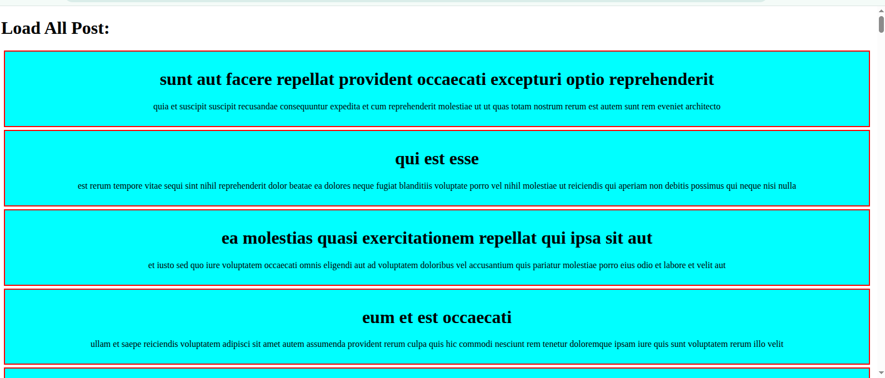
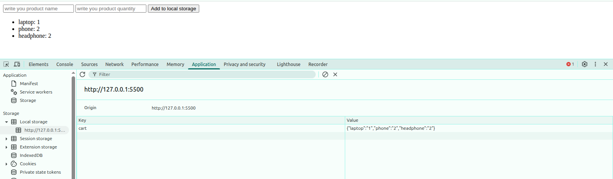
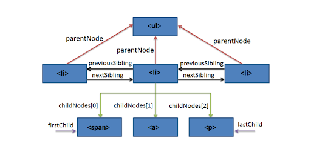
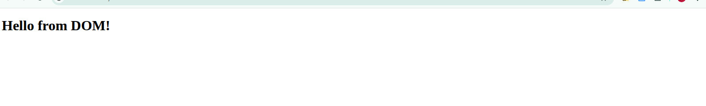
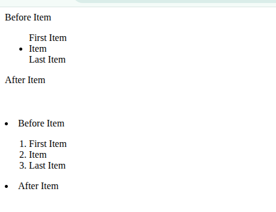
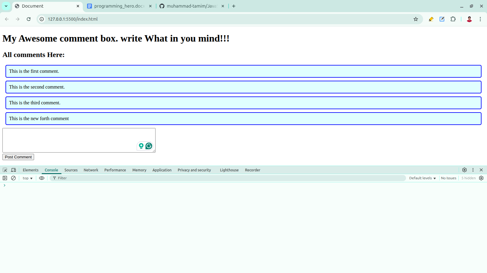

<h3 id="strict-mode" align="center">Strict Mode</h3>
<p>In JavaScript, "use strict"; is a directive that activates Strict Mode, which is a stricter set of rules for executing your JavaScript code.</p>

<p>It helps you</p>
<ul>
<li>Catch common mistakes earlier</li>
<li>Prevent silent errors</li>
<li>Write cleaner, safer code</li>
</ul>

<h4>Key Effects of Strict Mode</h4>
<ul>

<li>
<h4>No undeclared variables</h4>

<pre><code>
// without strict mode
x = 5;
console.log(x); // 5
</code></pre>

<pre><code>
// with strict mode
"use strict"

x = 5;
console.log(x); // ReferenceError: x is not defined
</code></pre>
</li>

<li>
<h4>No duplicate parameter names</h4>

<pre><code>
// without strict mode

function sum(a, a) {
    return a + a;
}

console.log(sum(2, 2)); // 4
</code></pre>

<pre><code>
// with strict mode

"use strict";
function sum(a, a) { // SyntaxError: Duplicate parameter name not allowed in this context
    return a + a;
}
console.log(sum(2, 2));
</code></pre>
</li>

</ul>
<hr>


<h3 id="destructuring" align="center">Destructuring</h3>
<p>Destructuring means breaking apart arrays or objects and assigning their values to variables in a clean and short way.</p>
<ul>
<li><h3 id="array-destructuring">Array Destructuring</h3></li>
<h4>Basic Syntax:</h4>

<pre><code>
const arr = [1, 2, 3];

const [a, b, c] = arr;
console.log(a); // 1
console.log(b); // 2
console.log(c); // 3
</code></pre>

<h4>Skip Items:</h4>

<pre><code>
const colors = ["red", "green", "blue"];

const [first, , third] = colors;

console.log(first); // red
console.log(third); // blue
</code></pre>


<h4>Default Values:</h4>

<pre><code>
const arr = [10];

const [x, y = 100] = arr;

console.log(x); // 10
console.log(y); // 100
</code></pre>

<h4>Swap Variables :</h4>

<pre><code>
let a = 1;
let b = 2;

[a, b] = [b, a];

console.log(a); // 2
console.log(b); // 1
</code></pre>

<h4>rest Operator (...):</h4>

<pre><code>
const nums = [1, 2, 3, 4];

const [first, ...rest] = nums;

console.log(first); // 1
console.log(rest);  // [2, 3, 4]
</code></pre>
<li><h3 id="object-destructuring">Object Destructuring</h3></li>

<h4>Basic Syntax:</h4>

<pre><code>
const person = {
  name: "Tamim",
  age: 21
};

const { name, age } = person;

console.log(name); // Tamim
console.log(age);  // 21
</code></pre>

<h4>Rename Variables:</h4>

<pre><code>
const person = {
  name: "Tamim",
  age: 21
};

const { name: fullName, age: years } = person;

console.log(fullName); // Tamim
console.log(years);    // 21
</code></pre>

<h4>Default Values:</h4>

<pre><code>
const person = {
  name: "Tamim"
};

const { name, age = 20 } = person;

console.log(name); // Tamim
console.log(age);  // 20
</code></pre>

<h4>Nested Destructuring:</h4>

<pre><code>
const user = {
  id: 1,
  profile: {
    username: "tamim",
    email: "tamim@example.com"
  }
};

const {
  profile: { username, email }
} = user;

console.log(username); // tamim
</code></pre>

<h4>Rest Operator in Object:</h4>

<pre><code>
const user = {
  name: "Tamim",
  age: 21,
  country: "BD"
};

const { name, ...others } = user;

console.log(name);   // Tamim
console.log(others); // { age: 21, country: "BD" }
</code></pre>

<li><h3 id="destructuring-function-parameters">Destructuring in Function Parameters</h3></li>

<h4>Array Parameters:</h4>

<pre><code>
function greet([first, second]) {
    console.log("Hello", first, second);
}
greet(["Tamim", "Ahmed"]); // Hello Tamim Ahmed
</code></pre>

<h4>Object Parameters:</h4>

<pre><code>
function displayUser({ name, age }) {
    console.log(`${name} is ${age} years old.`);
}

displayUser({ name: "Tamim", age: 21 }); // Tamim is 21 years old.
</code></pre>

</ul>
<hr>


<h3 id="error-handling" align="center">Error Handling</h3>

<p>try...catch is used to handle errors in JavaScript so your code doesn't crash. Instead of stopping the program when an error happens, you can catch the error and respond gracefully.</p>

<h4>Without try...catch :</h4>

<pre><code>
let x = y + 10; // Error: y is not defined
console.log("This line will not run");
</code></pre>

<h4>With try...catch :</h4>

<pre><code>
try {
    let x = y + 10; // Error here
} catch (err) {
    console.log("Something went wrong!");
}
console.log("This line will run");
</code></pre>

<h3>err vs err.message vs err.name</h4>

<pre><code>
try {
    let x = y + 10; // Error here
} catch (err) {
    console.log(err.name); // ReferenceError
    console.log(err.message); // y is not defined
    console.log(err); // full error message
    console.log(err.stack); // full error message
}
console.log("This line will run");
</code></pre>

<h3>Finally block:</h3>
<p>finally runs after try and catch, no matter what.</p>

<pre><code>
try {
    let result = 10 / 2;
    console.log(result);
} catch (err) {
    console.log("Error:", err.message);
} finally {
    console.log("Cleanup: This runs no matter what.");
}
/*
5
Cleanup: This runs no matter what.
*/
</code></pre>

<pre><code>
try {
    let result = 10 / y;
    console.log(result);
} catch (err) {
    console.log("Error:", err.message);
} finally {
    console.log("Cleanup: This runs no matter what.");
}
/*
Error: y is not defined
Cleanup: This runs no matter what.
*/
</code></pre>


<h3 id="common-js-errors">Common JS Errors:</h3>

<ul>
<li>
<h4>SyntaxError</h4>
<p>Syntax error happens when JavaScript code is not written correctly.</p>

<pre><code>
// Missing parenthesis:
console.log("Hello world"

// Unexpected token:
let a = 10
let b = 20;
console.log(a + b)

// Using reserved keywords for variable names:
let let = 5;

// not using quotes properly for string:
let greeting = "Hello;

// Invalid object literal:
let obj = { name: "Tamim", age: }; 
</code></pre>
</li>

<li>
<h4>ReferenceError</h4>
<p>Reference Error happens when you use a variable that hasn’t been declared.</p>

<pre><code>
// Undeclared variable:
console.log(x);

// Misspelled variable name:
let username = "Tamim";
console.log(usernme);

// Variable used outside its block:
{
    let a = 5;
}
console.log(a);

// Accessing variable before declaration: 
console.log(y);
let y = 10;

// Function-scoped variable not declared:
function test() {
    console.log(nonExistent);
}
test();
</code></pre>
</li>

<li>
<h4>TypeError</h4>
<p>Type Error happens when a value is used in an invalid way (e.g., calling non-function, accessing property of undefined, etc.)</p>
</li>

<pre><code>
// Calling something that's not a function:
let num = 10;
num();

// Accessing property of undefined:
let user;
console.log(user.name);

// Using string like an object:
let str = "hello";
str.push("!");

// Invalid assignment:
const age = 25;
age = 30;

// Accessing array index of null:
let arr = null;
arr[0];

// Incorrect method on type:
let number = 123;
number.toUpperCase();

// Using array as object incorrectly:
let nums = [1, 2, 3];
console.log(nums.name.first);
</code></pre>
</ul>

<hr>


<h3 id="import-and-export" align="center">JS Modules: Import and Export</h3>

<h3>Export:</h3>
<p>There are Three main ways to export from a file:</p>
<ol>
<li>Named Export: You export multiple values by name</li>

<pre><code>
// math.js
export const PI = 3.14;
export function add(x, y) {
  return x + y;
}
export const multiply = (x, y) => x * y;
</code></pre>
<li>Default Export: You export only one default value form a file</li>

<pre><code>
// greet.js
export default function greet(name) {
  return `Hello, ${name}`;
}
</code></pre>


<li>Name export and default export in a same file:</li>

<pre><code>
// utils.js
export const sayHi = () => console.log("Hi!");

export default function sayHello(name) {
  console.log(`Hello, ${name}`);
}
</code></pre>
<p>Note:  A file can have only one default export.</p>
</ol>

<h3>Import:</h3>

<pre><code>
import { PI, add, multiply } from './math.js';
import greet from './greet.js';
import sayHello, { sayHi } from './utils.js';

console.log(PI);          // 3.14
console.log(add(2, 3));   // 5
console.log(multiply(2, 3)); // 6
console.log(greet('Tamim')); // Hello, Tamim

sayHi(); // Hi!
sayHello('Tamim'); // Hello, Tamim
</code></pre>

<h4>You can Rename imported file name with as:</h4>

<pre><code>
import {add as sum} from './math.js';

console.log(sum(2, 3));   // 5
</code></pre>
<hr>


<h3 id="regular-expression" align="center">Regular Expression</h3>
<p>A regular expression (RegEx) is a pattern used to match character combinations in strings.</p>

<p>In JavaScript, RegEx is often used for:</p>
<ul>
<li>Validating input (e.g., email, phone number)</li>
<li>Searching/matching strings</li>
<li>Replacing patterns in text</li>
</ul>

<h3 id="common-regex-methods">Common RegEx Methods:</h3>
<ul>
<li>test() = Returns true if pattern matches</li>
<li>match() = Returns matching values (array or null)</li>
<li>replace() = Replace matched pattern</li>
<li>search() = Returns index of match or -1</li>
<li>split() = Split string by pattern</li>
</ul>

<pre><code>
const str = "I have a cat, a dog, and a cow.";
const pattern = /a/g;

/*
/a/ = matches the lowercase letter a
g = means global, so it finds all occurrences
*/

console.log("test():", pattern.test(str));       // true
console.log("match():", str.match(pattern));     // [ 'a', 'a', 'a', 'a', 'a' ]
console.log("replace():", str.replace(pattern, "*")); // I h*ve * c*t, * dog, *nd * cow.
console.log("search():", str.search(pattern));   // 3
console.log("split():", str.split(pattern));     // [ 'I h', 've ', ' c', 't, ', ' dog, ', 'nd ', ' cow.' ]
</code></pre>


<h3 id="anchors">Anchors:</h3>

<ul>

<li>^ = matches only the beginning of the entire string.</li>

<li>$ = matches only the end of the entire string.</li>

<li>\b = Word boundary (matches a boundary between a word character (a-z, A-Z, 0-9, _) and a non-word character like space, punctuation, etc. as a whole word, not inside others word)</li>
</ul>


<pre><code>
const str = "helloWorld hello world\nstart hello\nend";

console.log("^hello    :", str.match(/^hello/));
console.log("end$      :", str.match(/end$/));
console.log("\\bhello\\b:", str.match(/\bhello\b/g));

/*
^hello    : [
  'hello',
  index: 0,
  input: 'helloWorld hello world\nstart hello\nend',
  groups: undefined
]
end$      : [
  'end',
  index: 35,
  input: 'helloWorld hello world\nstart hello\nend',
  groups: undefined
]
\bhello\b: [ 'hello', 'hello' ]
*/
</code></pre>


<h3 id="flags">Flags:</h3>
<ul>
<li>g = Match all occurrences (not just the first one)</li>
<li>i = ignores the case</li>
<li>m = multiline (it changes how the ^ and $ anchors behave.)
<br>
without m (default behavior): 
<ul>
<li>^ matches only the beginning of the entire string.</li>
<li>$ matches only the end of the entire string.
</li>
</ul>
With m: 
<ul>
<li>^ matches the start of each line (right after a \n).</li>
<li>$ matches the end of each line (right before a \n).</li>
</ul>
</li>
</ul>

<pre><code>
const text = `Apple apple APPLE`;

console.log("g :", text.match(/apple/g));
console.log("i :", text.match(/apple/i));
console.log("gi:", text.match(/apple/gi));

/*
g : [ 'apple' ]
i : [ 'Apple', index: 0, input: 'Apple apple APPLE', groups: undefined ]
gi: [ 'Apple', 'apple', 'APPLE' ] 
*/
</code></pre>

<pre><code>
const str = "d\nhelloWorld hello world\nstart hello\nend";

console.log(str.match(/^hello/));
console.log(str.match(/^hello/m));

console.log(str.match(/hello$/));
console.log(str.match(/hello$/m));

/*
null
[
  'hello',
  index: 2,
  input: 'd\nhelloWorld hello world\nstart hello\nend',
  groups: undefined
]
null
[
  'hello',
  index: 31,
  input: 'd\nhelloWorld hello world\nstart hello\nend',
  groups: undefined
]
*/
</code></pre>


<h3 id="basic-patterns">Basic Patterns</h3>

<ul>

<li>
<h4>/abc/ = Matches the exact sequence "abc"</h4>

<pre><code>
const str1 = "I know my abc and 123.";
console.log(str1.match(/abc/));
/*
[
  'abc',
  index: 10,
  input: 'I know my abc and 123.',
  groups: undefined
]
*/
</code></pre>
</li>

<li>
<h4>/\d/ = Matches any digit (0–9)</h4>

<pre><code>
const str2 = "Room number is 405.";
console.log(str2.match(/\d/g));
// Output: [ '4', '0', '5' ]
</code></pre>
</li>

<li>
<h4>/\w/ → Matches any word character (a–z, A–Z, 0–9, _)</h4>

<pre><code>
const str3 = "Hi_123!";
console.log(str3.match(/\w/g));
// Output: [ 'H', 'i', '_', '1', '2', '3' ]
</code></pre>
</li>

<li>
<h4>/\s/ → Matches any whitespace character (space, tab, newline)</h4>

<pre><code>
const str4 = "Hello World! I am Tamim";
console.log(str4.match(/\s/g));
// Output: [ ' ', ' ', ' ', ' ' ]
</code></pre>
</li>

<li>
<h4>/./ → Matches any character (except newline)</h4>

<pre><code>
const str5 = "OK!";
console.log(str5.match(/./g));
// Output: [ 'O', 'K', '!' ]
</code></pre>
</li>

<li>
<h4>/[abc]/ → Matches a, b, or c</h4>

<pre><code>
const str6 = "bag of chips";
console.log(str6.match(/[abc]/g));
// Output: [ 'b', 'a', 'c' ]
</code></pre>
</li>

<li>
<h4>/[^abc]/ → Matches any character except a, b, or c</h4>

<pre><code>
const str7 = "abc123";
console.log(str7.match(/[^abc]/g));
// Output: [ '1', '2', '3' ]
</code></pre>
</li>

<li>
<h4>/[A-Z]/ → Matches any uppercase letter</h4>

<pre><code>
const str9 = "Hi There!";
console.log(str9.match(/[A-Z]/g));
// Output: [ 'H', 'T' ]
</code></pre>
</li>
</ul>


<h3 id="quantifiers">Quantifiers</h3>
<ul>
<li>/a+/ → 1 or more a</li>
<li>/a*/ → 0 or more a</li>
<li>/a?/ → 0 or 1 a</li>
<li>/a{2}/ → Exactly 2 as</li>
<li>/a{3,}/ → 3 or more as</li>
<li>/a{2,4}/ → Between 2 and 4 as</li>
</ul>

<pre><code>
const str = "aa aaaa a aaaa aaa aaaaaaa";

console.log("+     :", str.match(/a+/g));       // Match one or more continuous "a" characters.
console.log("*     :", str.match(/a*/g));       // Match zero or more continuous "a" characters.
console.log("?     :", str.match(/a?/g));       // Match zero or one "a" character.
console.log("{2}   :", str.match(/a{2}/g));     // Match exactly two "a" characters.
console.log("{3,}  :", str.match(/a{3,}/g));    // Match three or more "a" characters.
console.log("{2,4} :", str.match(/a{2,4}/g));   // Match between two and four "a" characters.

/*
+     : [ 'aa', 'aaaa', 'a', 'aaaa', 'aaa', 'aaaaaaa' ]
*     : [
  'aa',      '',
  'aaaa',    '',
  'a',       '',
  'aaaa',    '',
  'aaa',     '',
  'aaaaaaa', ''
]
?     : [
  'a', 'a', '',  'a', 'a', 'a', 'a',
  '',  'a', '',  'a', 'a', 'a', 'a',
  '',  'a', 'a', 'a', '',  'a', 'a',
  'a', 'a', 'a', 'a', 'a', ''
]
{2}   : [
  'aa', 'aa', 'aa',
  'aa', 'aa', 'aa',
  'aa', 'aa', 'aa'
]
{3,}  : [ 'aaaa', 'aaaa', 'aaa', 'aaaaaaa' ]
{2,4} : [ 'aa', 'aaaa', 'aaaa', 'aaa', 'aaaa', 'aaa' ]
*/
</code></pre>


<h3 id="escaping-special-characters">Escaping special characters</h3>
<p>If you want to match characters like ., ?, *, use a backslash(\)</p>

<pre><code>
let pattern = /\./;
console.log("google.com".match(pattern)); // [ '.', index: 6, input: 'google.com', groups: undefined ]
</code></pre>

<h3 id="real-world-examples">Ral world examples:</h3>
<ul>
<li>
<h4>Validate Email:</h4>

<pre><code>
const email = "tamim@gmail.com";
const emailPattern = /^[\w.-]+@[\w.-]+\.\w+$/;

console.log(emailPattern.test(email)); // true

/*
"tamim@gmail.com"

^           → Start of string
[\w.-]+     → "tamim"
@           → "@"
[\w.-]+     → "gmail"
\.          → "."
\w+         → "com"
$           → End of string 

 */
</code></pre>
</li>


<li>
<h4>Extract Digits</h4>

<pre><code>
let str = "Order #12345";
let digits = str.match(/\d+/); // ['12345']
console.log(digits); // [ '12345', index: 7, input: 'Order #12345', groups: undefined ]
console.log(digits[0]); // '12345'

/*
/d --> matches any digit (0-9)
+ --> matches one or more digits
/\d+/ --> matches one or more digits in a row
*/
</code></pre>
</li>

<li>
<h4>Remove Extra Spaces</h4>

<pre><code>
let messy = "  too    many    spaces ";
let clean = messy.replace(/\s+/g, " ").trim();
console.log(clean); // "too many spaces"

/*
\s --> Matches any whitespace character (space, tab, newline)
+ --> Matches one or more occurrences 
g --> Global search, match all occurrences in the string
*/
</code></pre>
</li>

</ul>
<hr>


<h3 id="asynchronous-JavaScript" align="center">Asynchronous and Synchronous JavaScript</h3>

<h3 id="synchronous-javascript" align="center">Synchronous JavaScript</h3>

<h4 id="single-threaded">Single Threaded:</h4>
<p>JavaScript is a single-threaded, synchronous language, which means it executes one task at a time, in a specific order from top to bottom.</p>

<pre><code>
console.log("Task 1");
console.log("Task 2");
console.log("Task 3");

/*
Task 1
Task 2
Task 3
*/

console.log(1);
console.log(2);
doSomething();
console.log(4);
console.log(5);
console.log(6);

function doSomething() {
    console.log(3);
}

/*
1
2
3
4
5
6
*/
</code></pre>


<h3 id="asynchronous-javascript"  align="center">Asynchronous JavaScript</h3>
<p>By default, JavaScript runs code in a synchronous way — meaning it executes one task at a time, in the order they appear.</p>
<p>However, JavaScript can also perform asynchronous tasks  like setTimeout(), setInterval(), promise, async/await etc.</p>
<p>Behind the scenes, when an asynchronous method is called:</p>
<ul>
<li>JavaScript hands it off to the browser (<a href="#web-api">Web API</a>)</li>
<li>Then continues to run other code without waiting. Once all synchronous tasks are done, the <a href="#event-loop">Event Loop</a> picks up the asynchronous callback and adds it to the call stack to execute.</li>
</ul>
<p>So, asynchronous methods like setTimeout() and setInterval() do not change the single-threaded, synchronous nature of JavaScript — they just work alongside it, using the event loop to manage timing and order.</p>


<h4 id="web-api">Web API:</h4>
<p>A Web API is a feature provided by the browser (or the environment like Node.js) that JavaScript can use to do extra things, like:</p>

<ul>
<li>setTimeout(), setInterval()</li>
<li>Make HTTP requests (fetch)</li>
<li>Handle user events (clicks, input)</li>
<li>Work with the DOM</li>
<li>Use browser storage (localStorage, sessionStorage)</li>
</ul>


<h4 id="event-loop">Event Loop:</h4>
<p>The event loop checks if JavaScript is done with all synchronous tasks, and if so, it moves asynchronous tasks (like timers or API calls) back into the code to be run.</p>

<p>Why Do We Need the Event Loop?</p>
<p>JavaScript is:</p>
<ul>
<li><strong>Single-threaded: </strong>can do only one thing at a time
</li>
<li><strong>Non-blocking: </strong>doesn’t wait for slow tasks (setTimeout() or fetch())
</li>
</ul>
<p>How Event Loop works:</p>

<p>After parsing, compiling, and interpreting the code, the JavaScript engine uses these key parts:</p>

<ul>
<li>Call Stack - runs your js code synchronously with FIFO structure</li>
<li>Web Apis - Handles async tasks </li>
<li>Callback Queue - When async tasks are ready, they’re added here</li>
<li>Event Loop - Constantly checks, is the call stack empty? If yes → moves tasks from callback queue into the stack to be run</li>
</ul>
<p>Example:</p>

<pre><code>
console.log("Start");

setTimeout(() => {
    console.log("Timer done");
}, 2000);

console.log("End");

/*
Start
End
Timer done
*/
</code></pre>


<p>Behind the Scenes:</p>
<ul>
<li>Start → Call Stack → runs</li>
<li>setTimeout() → Web API → starts timer</li>
<li>End → Call Stack → runs</li>
<li>After 2 sec, callback goes to Callback Queue</li>
<li>Event Loop sees the stack, if empty it moves callback to Call Stack → runs "Timer done"</li>
</ul>


<ol>
<li>
<h3 id="setTimeOut-setInterval">setTimeOut() and setInterval()</h3>

<h4>setTimeOut()</h4>
<p>setTimeout() runs a function once after a specified delay (in milliseconds).</p>

<pre><code>
console.log(1);

console.log(2);
setTimeout(() => {
    console.log(3)
});
console.log(4);
console.log(5);
console.log(6);

/*
1
2
4
5
6
3 - runs 0 second delay
*/
</code></pre>

<pre><code>
console.log(1);
console.log(2);
setTimeout(() => {
    console.log(3)
}, 4000);
console.log(4);
console.log(5);
console.log(6);

/*
1
2
4
5
6
3 - runs 4 second delay
*/
</code></pre>

<pre><code>
// With Parameters
function greet(name) {
    console.log("Hello, " + name);
}

setTimeout(greet, 3000, "Tamim"); // After 3 seconds
</code></pre>


<h4>setInterval()</h4>
<p>setInterval() runs a function again and again, with a fixed time delay between each call.</p>

<pre><code>
// runs infinitely with one seconde delay
setInterval(() => {
    console.log("I print every 1 second");
}, 1000);
</code></pre>

<pre><code>
// Count every second
let count = 1;
const id = setInterval(() => {
    console.log("Count:", count);
    count++;
}, 1000);
</code></pre>


<pre><code>
// Stop setInterval() with clearInterval(id)
let i = 1;
const id = setInterval(() => {
    console.log("i =", i);
    i++;
    if (i > 5) {
        clearInterval(id); // Stop after 5 times
    }
}, 1000);
</code></pre>
</li>
<li>
<h3 id="promise-fetch-async/await">Promise, Fetch, async/await</h3>

<p>Before learning about Promises, fetch(), and async/await, it’s important to understand the format of data that APIs usually return. Most APIs return data in JSON format:</p>

<h4 id="json">JSON</h4>
<p>JSON stands for JavaScript Object Notation — it's a lightweight data format used to store and exchange data, especially in APIs. JSON looks like JavaScript objects, but it's always a string With double quotes only ("").</p>

<h4 id="JSON.stringify()">JSON.stringify() — Convert JS → JSON string:</h4>

<pre><code>
const user = {
    name: "Tamim",
    age: 21
};

const jsonString = JSON.stringify(user);
console.log(jsonString); // {"name":"Tamim","age":21}
console.log(typeof jsonString); // string 
</code></pre>

<h4 id="JSON.parse()">JSON.parse() — Convert JSON string → JS object:</h4>

<pre><code>
const jsonStr = '{"name":"Tamim","age":21}';

const obj = JSON.parse(jsonStr);
console.log(obj); // { name: 'Tamim', age: 21 }
console.log(typeof obj); // object 
</code></pre>


<ul>
<li>
<h3 id="promise">Promise</h3>
<p>A Promise is a JavaScript object that represents the eventual completion or failure of an asynchronous operation.</p>

<h4>Promise States:</h4>
<ul>
  <li>Pending - operation initial stage</li>
  <li>Resolved(fulfilled) - if the operation is successful</li>
  <li>Rejected - if the operation fails</li>
</ul>

<h4>Basic Syntax:</h4>
<pre><code>
let promise = new Promise(function (resolve, reject) {
  // async task
});
</code></pre>

<p>You can use these methods to work with the result of a promise:</p>

<ul>
<li>.then() - Called when the promise is resolved (fulfilled)</li>
<li>.catch() - Called when the promise is rejected (error)</li>
<li>.finally() - Called regardless of whether the promise was fulfilled or rejected</li>
</ul>

<p>Example:</p>

<pre><code>
let promise = new Promise(function (resolve, reject) {
    let success = true;

    if (success) {
        resolve("Operation successful!");
    } else {
        reject("Operation failed.");
    }
});

promise
    .then((result) => {
        console.log(result);
    })
    .catch((error) => {
        console.log(error);
    })
    .finally(() => {
        console.log("Promise is settled (fulfilled or rejected).");
    });
</code></pre>

<pre><code>
// with Promise.all([]) --> Waits for all promises to resolve

const moneyRequest = new Promise((resolve, reject) => {
    setTimeout(() => resolve("Request submitted!"), 1000);
});

const transferMoney = new Promise((resolve, reject) => {
    setTimeout(() => resolve("Money transferred!"), 2000);
});

const payFee = new Promise((resolve, reject) => {
    setTimeout(() => resolve("Fee paid!"), 1500);
});

Promise.all([moneyRequest, transferMoney, payFee])
    .then((results) => {
        console.log(results);
    })
    .catch((error) => {
        console.log("Error: ", error);
    });

// [ 'Request submitted!', 'Money transferred!', 'Fee paid!' ]
</code></pre>
</li>
<li>
<h3 id="fetch">Fetch</h3>
<p>The fetch() method is used to make HTTP requests (like GET, POST, PUT, PATCH, DElETE etc.) to servers and APIs.It returns a Promise that resolves to the Response object.</p>

<h4>Basic GET Request:</h4>

<p>without Convert response to JSON:</p>

<pre><code>
fetch("https://jsonplaceholder.typicode.com/posts/1")
    .then(response => console.log(response))
    .catch(err => console.log(err))

/*
 Response {
  status: 200,
  statusText: 'OK',
  headers: Headers {
    date: 'Wed, 30 Jul 2025 17:07:22 GMT',
    'content-type': 'application/json; charset=utf-8',
    'transfer-encoding': 'chunked',
    connection: 'keep-alive',
    'access-control-allow-credentials': 'true',
    'cache-control': 'max-age=43200',
    etag: 'W/"124-yiKdLzqO5gfBrJFrcdJ8Yq0LGnU"',
    expires: '-1',
    nel: '{"report_to":"heroku-nel","response_headers":["Via"],"max_age":3600,"success_fraction":0.01,"failure_fraction":0.1}',
    pragma: 'no-cache',
    'report-to': '{"group":"heroku-nel","endpoints":[{"url":"https://nel.heroku.com/reports?s=kHphepdcLXRPrx%2BR4ZbooXWDa6BR1Tm0fJq5WhSVlp4%3D\\u0026sid=e11707d5-02a7-43ef-b45e-2cf4d2036f7d\\u0026ts=1753671479"}],"max_age":3600}',
    'reporting-endpoints': 'heroku-nel="https://nel.heroku.com/reports?s=kHphepdcLXRPrx%2BR4ZbooXWDa6BR1Tm0fJq5WhSVlp4%3D&sid=e11707d5-02a7-43ef-b45e-2cf4d2036f7d&ts=1753671479"',
    server: 'cloudflare',
    vary: 'Origin, Accept-Encoding',
    via: '2.0 heroku-router',
    'x-content-type-options': 'nosniff',
    'x-powered-by': 'Express',
    'x-ratelimit-limit': '1000',
    'x-ratelimit-remaining': '999',
    'x-ratelimit-reset': '1753671494',
    age: '22154',
    'cf-cache-status': 'HIT',
    'content-encoding': 'br',
    'cf-ray': '967673b27a628801-SIN',
    'alt-svc': 'h3=":443"; ma=86400'
  },
  body: ReadableStream { locked: false, state: 'readable', supportsBYOB: true },
  bodyUsed: false,
  ok: true,
  redirected: false,
  type: 'basic',
  url: 'https://jsonplaceholder.typicode.com/posts/1'
}
*/
</code></pre>

<p>With Convert response to JSON:</p>

<pre><code>
fetch("https://jsonplaceholder.typicode.com/posts/1")
    .then(response => response.json())  // Convert response to JSON
    .then(data => console.log(data))    // Handle the data
    .catch(error => console.error("Error:", error));

/*
{
  userId: 1,
  id: 1,
  title: 'sunt aut facere repellat provident occaecati excepturi 
  optio reprehenderit',
  body: 'quia et suscipit\n' +
    suscipit recusandae consequuntur expedita et cum\n' +
    'reprehenderit molestiae ut ut quas totam\n' +
    'nostrum rerum est autem sunt rem eveniet architecto'
}
*/
</code></pre>

<p>function to fetch user data from the API:</p>

<pre><code>
const handleLoadUser = () => {
    fetch("https://jsonplaceholder.typicode.com/users") // fetch  user data
        .then(res => res.json()) // Convert response to JSON
        .then(data => {
            console.log(data);
            displayUser(data);
        })
}

// function to display user data
const displayUser = (users) => {
    console.log(users); // Logs the entire user list
    console.log(users[0]) // logs the first user (index 0)
}
handleLoadUser();
</code></pre>


<p>Dynamically Display data:</p>

```html
<!DOCTYPE html>
<html lang="en">

<head>
    <meta charset="UTF-8">
    <meta name="viewport" content="width=device-width, initial-scale=1.0">
    <title>Document</title>
</head>

<body>
    <button id="btn">Click me for load user</button>

    <div>
        <ul id="users">

        </ul>
    </div>

    <script>
        document.getElementById("btn").addEventListener("click", () => {
            fetch("https://jsonplaceholder.typicode.com/users")
                .then(response => response.json())
                .then(data => showUser(data));
        })

        const showUser = (users) => {
            const userContainer = document.getElementById("users")

            for (const user of users) {
                const li = document.createElement("li");
                li.innerText = user.name;
                userContainer.appendChild(li)
            }
        }
    </script>
</body>

</html>
```


```html
<!DOCTYPE html>
<html lang="en">

<head>
    <meta charset="UTF-8">
    <meta name="viewport" content="width=device-width, initial-scale=1.0">
    <title>Document</title>
    <style>
        .card {
            border: 2px solid red;
            margin: 5px;
            padding: 10px;
            text-align: center;
            background-color: aqua;
        }
    </style>
</head>

<body>

    <h1>Load All Post:</h1>

    <div id="postContainer">

    </div>

    <script>
        const handlePost = () => {
            // Making a fetch request to get the posts form the JSONPlaceholder API
            fetch("https://jsonplaceholder.typicode.com/posts")
                .then(response => response.json())
                .then(data => displayPost(data));
        }


        const displayPost = (posts) => {
            const postContainer = document.getElementById("postContainer")

            for (const post of posts) {
                const div = document.createElement("div");
                div.classList.add("card")
                div.innerHTML = `
                <h1>${post.title}</h1>
                <p>${post.body}</p>
                `
                postContainer.appendChild(div);
            }
        }
        handlePost()
    </script>
</body>

</html>
```

</li>
<li>
<h4 id="async/await">async / await</h4>
<p>async and await are modern JavaScript keywords that allow you to write asynchronous code that looks and behaves like synchronous code. They are used to work with Promises more cleanly.</p>
<ul>
<li>async - Used to declare an async function that returns a Promise if the promise resolved.</li>
<li>await - Used inside an async function to pause execution until a Promise resolves.If the Promise is rejected, it throws an error that you can catch with try...catch.</li>
</ul>

<p><strong>Note:</strong> Normally, try...catch only works for synchronous code. However, when you use await, JavaScript pauses execution like it does for synchronous code — that allowing try...catch to catch async errors just like sync ones. This is why try...catch works with await, even though the operation is asynchronous.</p>
   
<pre><code>
// Without arrow function

async function fetchData() {
    try {
        const response = await fetch("https://jsonplaceholder.typicode.com/users/1");
        const data = await response.json();
        console.log(data);
    }
    catch (error) {
        console.error('Error:', error);
    }
}

fetchData();
</code></pre>

<pre><code>
// With arrow function

const fetchData = async () => {
    try {
        const response = await fetch("https://jsonplaceholder.typicode.com/users/1");
        const data = await response.json();
        console.log(data);
    }
    catch (error) {
        console.error('Error:', error);
    }
}

fetchData();
</code></pre>
</li>

</ul>
</ol>
<hr>


<h3 id="local-storage" align="center">Local Storage</h3>

<p>localStorage is a Web Storage API feature that allows you to store key-value pairs in the browser with no expiration date. Data stored in localStorage persists even after the browser is closed.</p>

<p><strong>Note:</strong> LocalStorage stores strings only</p>
<p>So, If you want to store objects, arrays, or any other non-string data types, you need to convert them into strings using JSON.stringify() before storing.</p>
<p>Similarly, when retrieving the data, use JSON.parse() to convert the string back into its original format.</p>

<h4>Local Storage Methods:</h4>
<ol>
<li>
<h4>setItem(key, value):</h4>
<p>Stores a key-value pair (as string) in local storage.</p>

```html
<!DOCTYPE html>
<html lang="en">

<head>
    <meta charset="UTF-8">
    <meta name="viewport" content="width=device-width, initial-scale=1.0">
    <title>Document</title>
</head>

<body>
    <script>
        const user = {
            username: "Tamim",
            country: "Bangladesh"
        };
        localStorage.setItem("user", JSON.stringify(user));
    </script>
</body>

</html>
```

</li>
<li>
<h4>getItem(key):</h4>
<p>Retrieves the value associated with a key.</p>

```html
<!DOCTYPE html>
<html lang="en">

<head>
    <meta charset="UTF-8">
    <meta name="viewport" content="width=device-width, initial-scale=1.0">
    <title>Document</title>
</head>

<body>
    <script>
        const user = {
            username: "Tamim",
            country: "Bangladesh"
        };
        localStorage.setItem("user", JSON.stringify(user));


        const userData = localStorage.getItem("user");
        console.log(userData);

        const userObj = JSON.parse(userData);
        console.log(userObj);
    </script>
</body>

</html>
```

</li>
<li>
<h4>removeItem(key):</h4>
<p>Removes a specific key-value pair from local storage.</p>

```html
<!DOCTYPE html>
<html lang="en">

<head>
    <meta charset="UTF-8">
    <meta name="viewport" content="width=device-width, initial-scale=1.0">
    <title>Document</title>
</head>

<body>
    <script>
        const user = {
            username: "Tamim",
            country: "Bangladesh"
        };
        const user2 = {
            username: "Nasrin",
            country: "Canada"
        }
        localStorage.setItem("user", JSON.stringify(user));
        localStorage.setItem("user2", JSON.stringify(user2));

        console.log(localStorage.getItem("user")) // {"username":"Tamim","country":"Bangladesh"}
        console.log(localStorage.getItem("user2")) // {"username":"Nasrin","country":"Canada"}

        localStorage.removeItem("user"); 

        console.log(localStorage.getItem("user")) // null
        console.log(localStorage.getItem("user2")) // {"username":"Nasrin","country":"Canada"}

    </script>
</body>

</html>
```
</li>
<li>
<h4>clear():</h4>
<p>Deletes all data from local storage.</p>

```html
<!DOCTYPE html>
<html lang="en">

<head>
    <meta charset="UTF-8">
    <meta name="viewport" content="width=device-width, initial-scale=1.0">
    <title>Document</title>
</head>

<body>
    <script>
        const user = {
            username: "Tamim",
            country: "Bangladesh"
        };
        const user2 = {
            username: "Nasrin",
            country: "Canada"
        }
        localStorage.setItem("user", JSON.stringify(user));
        localStorage.setItem("user2", JSON.stringify(user2));

        console.log(localStorage.getItem("user")) // {"username":"Tamim","country":"Bangladesh"}
        console.log(localStorage.getItem("user2")) // {"username":"Nasrin","country":"Canada"}

        localStorage.clear("user");

        console.log(localStorage.getItem("user")) // null
        console.log(localStorage.getItem("user2")) // null
    </script>
</body>

</html>
```
</li>
<li>
<h4>length:</h4>
<p>Returns the number of key-value pairs in storage.</p>

```html
<!DOCTYPE html>
<html lang="en">

<head>
    <meta charset="UTF-8">
    <meta name="viewport" content="width=device-width, initial-scale=1.0">
    <title>Document</title>
</head>

<body>
    <script>
        const user = {
            username: "Tamim",
            country: "Bangladesh"
        };
        const user2 = {
            username: "Nasrin",
            country: "Canada"
        }
        localStorage.setItem("user", JSON.stringify(user));
        localStorage.setItem("user2", JSON.stringify(user2));

        console.log(localStorage.length) // 2
    </script>
</body>

</html>
```
</li>
<li>
<h4>key(index):</h4>
<p>Returns the key name at the specified index.</p>

```html
<!DOCTYPE html>
<html lang="en">

<head>
    <meta charset="UTF-8">
    <meta name="viewport" content="width=device-width, initial-scale=1.0">
    <title>Document</title>
</head>

<body>
    <script>
        const user = {
            username: "Tamim",
            country: "Bangladesh"
        };
        const user2 = {
            username: "Nasrin",
            country: "Canada"
        }
        localStorage.setItem("user", JSON.stringify(user));
        localStorage.setItem("user2", JSON.stringify(user2));

        console.log(localStorage.key(0)) // user
        console.log(localStorage.key(1)) // user2
    </script>
</body>

</html>
```
</li>
</ol>

<h4>Update the Local Storage key and values:</h4>
<p>In localStorage, key name are immutable and values are mutable, thats means, you can't change the key name directly. If you want to change the key name, you must:</p>
<ul>
<li>Get the value of the old name</li>
<li>Save it under the new name</li>
<li>Remove the old name</li>
</ul>

```html
<!DOCTYPE html>
<html lang="en">

<head>
    <meta charset="UTF-8">
    <meta name="viewport" content="width=device-width, initial-scale=1.0">
    <title>Document</title>
</head>

<body>
    <script>
        const user = {
            userName: "Tamim",
            country: "Bangladesh"
        };

        localStorage.setItem("user", JSON.stringify(user));
        console.log(JSON.parse(localStorage.getItem("user"))) // {username: 'Tamim', country: 'Bangladesh'}

        // Change key name
        const oldValue = localStorage.getItem("user")
        localStorage.setItem("userData", oldValue);
        localStorage.removeItem("user");

        console.log(localStorage.getItem("user")) // null
        console.log(JSON.parse(localStorage.getItem("userData"))) // {username: 'Tamim', country: 'Bangladesh'}


        // change value
        const value = JSON.parse(localStorage.getItem("userData"));
        value.userName = "Muhammad Tamim";
        localStorage.setItem("userData", JSON.stringify(value))

        console.log(JSON.parse(localStorage.getItem("userData"))) // {userName: 'Muhammad Tamim', country: 'Bangladesh'}
    </script>
</body>

</html>
```

```html
<!DOCTYPE html>
<html lang="en">

<head>
    <meta charset="UTF-8">
    <meta name="viewport" content="width=device-width, initial-scale=1.0">
    <title>Document</title>
</head>

<body>

    <input type="text" id="productName" placeholder="write you product name">
    <input type="number" id="productQuantity" placeholder="write you product quantity">
    <input type="submit" id="btn" value="Add to local storage">

    <ul id="listContainer">

    </ul>

    <script>
        document.getElementById("btn").addEventListener("click", () => {
            // get the the input fields
            const productName = document.getElementById("productName");
            const productQuantity = document.getElementById("productQuantity");

            // get the input field value
            const name = productName.value;
            const quantity = productQuantity.value;

            // clear the input fields
            productName.value = "";
            productQuantity.value = "";

            // Initialize an empty cart object
            let cart = {};

            // check if the cart are already exists in the localStorage or not
            const checkChart = localStorage.getItem("cart");
            if (checkChart) {
                // if the cart value exist to the localStorage replace the cart = {} empty object to the local storage new value 
                cart = JSON.parse(checkChart);
            }

            // add/update chart object
            cart[name] = quantity;
            /*
            If the product name already exists, its quantity is updated.
            If the product name is new, it’s added alongside the old ones.
            */

            // convert the cart object into JSON String and store it in localStorage
            const convertObjToJsonString = JSON.stringify(cart);
            localStorage.setItem("cart", convertObjToJsonString);

            // get the cart ul list container
            const listContainer = document.getElementById("listContainer");
            listContainer.innerHTML = ""; // clear the list before re-render to avoid duplicate

            // add li to ul
            for (const product in cart) {
                const li = document.createElement("li");
                li.innerText = `${product}: ${cart[product]}`;
                listContainer.appendChild(li);
            }
        })
    </script>
</body>

</html>
```

<hr>


<!-- Part 2 -->
<h1 id="part-2-DOM" align="center">Part 2: DOM</h1>

<h2 id="dom-fundamentals" align="center">Introduction</h2>

<h3 id="what-is-dom">What is DOM:</h3>
<p>DOM (Document Object Model) is a programming interface provided by the browser that represents an HTML as a <a href="#hierarchical">hierarchical</a> tree structure where each element is a node. It allows JavaScript to access, manipulate, and update the html elements, structure, and style of a web page dynamically.</p>


<h3 id="dom-tree-structure">DOM Tree Structure:</h3>
<p>The DOM represents your document as a tree structure. Every HTML element becomes a "node" in this tree.</p>


<h4>Note:</h4>
<ul>
<li>Node: The generic term for any item in the DOM tree</li>
<li>Element Node: A specific type of node that represents HTML tags</li>
</ul>


<h3 id="parent-child-and-sibling-relationships">Parent, Child, and Sibling Relationships:</h3>


| 🔢 Category  | 🏷️ Property               | 🔍 Description                                                         |
| ----------- | ------------------------ | --------------------------------------------------------------------- |
| **Parent**  | `parentNode`             | Returns the parent **node** of the current node                       |
|             | `parentElement`          | Returns the parent **element**, or `null` if parent is not an element |
| **Child**   | `children`               | Returns a list of child **elements only**                             |
|             | `childNodes`             | Returns all child **nodes** (elements, text, comments, etc.)          |
|             | `firstElementChild`      | Returns the **first child element**                                   |
|             | `firstChild`             | Returns the **first child node** (could be text)                      |
|             | `lastElementChild`       | Returns the **last child element**                                    |
|             | `lastChild`              | Returns the **last child node** (could be text)                       |
| **Sibling** | `nextElementSibling`     | Returns the **next sibling element**                                  |
|             | `nextSibling`            | Returns the **next sibling node** (can be text)                       |
|             | `previousElementSibling` | Returns the **previous sibling element**                              |
|             | `previousSibling`        | Returns the **previous sibling node** (can be text)                   |


<h4>Example 1:</h4>

```html
<!DOCTYPE html>
<html lang="en">

<head>
    <meta charset="UTF-8">
    <meta name="viewport" content="width=device-width, initial-scale=1.0">
    <title>Document Object Model</title>
</head>

<body>
    <div id="parent">
        <p id="first-child">First paragraph</p>
        <p id="second-child">Second paragraph</p>
        <span id="last-child">Span element</span>
    </div>

    <script>
        const parent = document.getElementById('parent');
        const firstChild = document.getElementById('first-child');
        const secondChild = document.getElementById('second-child');
        const lastChild = document.getElementById('last-child');

        // Parent relationships
        console.log(firstChild.parentNode);        // The div element
        console.log(firstChild.parentElement);     // Also the div element

        // Child relationships
        console.log(parent.children);              // All child elements (gives a HTML Collections)
        console.log(parent.firstElementChild);     // First p element
        console.log(parent.lastElementChild);      // The span element

        // Sibling relationships
        console.log(firstChild.nextElementSibling);    // Second p element
        console.log(firstChild.previousElementSibling); // null (no previous sibling)
        console.log(secondChild.nextElementSibling);   // Span element
        console.log(secondChild.previousElementSibling); // First p element
    </script>
</body>

</html>
```


<p>In the above example:</p>
<ul>
<li>The div is the parent of all three elements inside it</li>
<li>The p and span elements are children of the div</li>
<li>The two p elements and the span are siblings to each other</li>
</ul>

<h4>Example 2:</h4>

```html
<!DOCTYPE html>
<html lang="en">

<head>
    <meta charset="UTF-8">
    <meta name="viewport" content="width=device-width, initial-scale=1.0">
    <title>Document</title>
</head>

<body>
    <header>
        <h1>Welcome to my DOM</h1>
        <p>Lorem ipsum dolor sit imamet consectetur adipisicing elit. Voluptatibus, natus! Dolorem voluptate provident rem
            eligendi eaque, odit fugiat sed tenetur corporis vel, laudantium veniam accusantium sunt adipisci blanditiis
            dolore vitae?</p>
    </header>
    <main id="main-container">
        <section>
            <h1>My Awesome DOM de baba</h1>
            <ul>
                <li>Jalali Set</li>
                <li>Shafayet</li>
                <li>bonobash</li>
                <li>DOM de re baba</li>
            </ul>
        </section>
        <section class="fruits-container">
            <h1 id="fruits-title" class="some-class random-class blue-bg">Fruits I like</h1>
            <ul>
                <li>Apple</li>
                <li>Banana</li>
                <li>Carrot</li>
            </ul>
        </section>
        <section id="places-container" class="large-text">
            <h1 id="places-title">Places I like to visit</h1>
            <ul id="places-list">
                <li class="important-places">Soondarban</li>
                <li class="important-places">bandorban</li>
                <li class="important-places">Kataban</li>
                <li class="other-place">shalbon</li>
            </ul>
        </section>
    </main>


    <script>
        const placesContainer = document.getElementById("places-container");
        console.log(placesContainer);
        console.log(placesContainer.childNodes);
        console.log(placesContainer.firstChild);
        console.log(placesContainer.childNodes[1]);
        console.log(placesContainer.childNodes[3]);
        console.log(placesContainer.childNodes[3].childNodes[5]);

        const placesUL = document.querySelector("#places-container");
        console.log(placesUL);
        const newLI = document.createElement("li");
        newLI.innerText = "Brand new place to go";
        placesUL.appendChild(newLI);
        const newLI2 = document.createElement("li");
        newLI2.innerText = "another dynamic li";
        placesUL.appendChild(newLI2);

        console.log(placesUL);
        console.log(placesUL.parentNode);
        console.log(placesUL.parentNode.parentNode);
    </script>
</body>

</html>
```


<h3 id="dom-collection">DOM Collection:</h3>
<p>A DOM Collection is a special array-like object that holds a group of nodes or elements from the Document Object Model (DOM).
DOM collection is array like means you can access items with indexes, and can use .length properties but since it's not actually array so, you can't use map(), filter(), find() etc, unless converted.</p>

<h4>Common DOM Collection Types:</h4>

| Collection       | Description                                                                  |
| ---------------- | ---------------------------------------------------------------------------- |
| `NodeList`       | Is a collection of nodes (can include elements, text nodes, comments, etc.). |
| `HTMLCollection` | An HTMLCollection contains only HTML elements (not text nodes or comments).  |
| `childNodes`     | NodeList of **all types** of child nodes                                     |
| `NamedNodeMap`   | Collection of attribute nodes of an element                                  |
| `DOMTokenList`   | Collection of classes                                                        |


  

<h3 id="document-object">Document Object:</h3>
<p>The document object is your entry point to the entire DOM. It represents the whole HTML document and provides methods to access and manipulate everything within it.</p>

```html
<!DOCTYPE html>
<html lang="en">

<head>
    <meta charset="UTF-8">
    <meta name="viewport" content="width=device-width, initial-scale=1.0">
    <title>Document Object Model</title>
</head>

<body>
    <h1>Welcome to My Page</h1>
    <p>This is a simple HTML document.</p>

    <script>
        // Document object properties
        console.log(document);                  // Document object
        console.log(document.documentElement);  // <html> element
        console.log(document.head);             // <head> element  
        console.log(document.body);             // <body> element
        console.log(document.title);            // Page title
        console.log(document.URL);              // Current URL
        console.log(document.domain);           // Domain name
        console.log(document.forms);            // All forms in the document
        console.log(document.images);           // All images in the document
        console.log(document.links);            // All links in the document
        console.log(document.scripts);          // All scripts in the document
    </script>
</body>

</html>
```


<h3 id="dom-vs-bom">DOM VS BOM:</h3>
<table>
<tr>
<th>DOM</th>
<th>BOM</th>
</tr>
<tr>
<td>Controls the document content</td>
<td>Controls browser features outside the document</td>
</tr>
<tr>
<td>Standardized (don't varies between browsers)</td>
<td>Not standardized (varies between browsers)</td>
</tr>
<tr>
<td>Accessed Using document object</td>
<td>Accessed Using window object</td>
</tr>
</table>

```html
<!DOCTYPE html>
<html lang="en">

<head>
    <meta charset="UTF-8">
    <meta name="viewport" content="width=device-width, initial-scale=1.0">
    <title>Document Object Model</title>
</head>

<body>
    <h1 id="myHeading"></h1>

    <script>
        // DOM
        const heading = document.getElementById("myHeading");
        heading.innerText = "Hello from DOM!";

        // BOM
        const url = window.location.href;
        console.log("Current URL:", url);

        window.alert("Welcome to BOM");
    </script>
</body>

</html>
```


      

<h3>Q&A:</h3>
<ul>
  <li>
    <p><strong>hierarchical: </strong>Hierarchical means things are arranged like a tree, where:</p>
    <ul>
      <li>One item is at the top (called the root).</li>
      <li>Other items are under it, like branches and sub-branches.</li>
      <li>Each item can have children and a parent.</li>
    </ul>
  </li>
</ul>
<hr>


<h2 id="dom-traversing" align="center">DOM Traversing</h2>
<p>DOM traversing means navigating the DOM tree from one node to another using relationships like parent, child, and sibling.</p>

<p>It allows you to:</p>

<ul>
<li>Find elements relative to a selected element</li>
<li>Move between nodes (parents, children, siblings)</li>
<li>Manipulate structure dynamically (add/remove/update nodes)</li>
</ul>


<h3 id="parentNode-vs-parentElement">parentNode vs parentElement:</h3>
<p>Both parentNode and parentElement are used to access the parent of a node in the DOM, But:</p>
<ul>
<li>parentNode returns any type of parent node.</li>
<li>parentElement returns only if the parent is an Element node</li>
</ul>


```html
<!DOCTYPE html>
<html lang="en">

<head>
    <meta charset="UTF-8">
    <meta name="viewport" content="width=device-width, initial-scale=1.0">
    <title>DOM Traversing</title>
</head>

<body>

    <div id="container">
        <p id="child">Hello</p>
    </div>


    <script>
        const child = document.getElementById("child");

        console.log(child.parentNode); // <div id="container">...</div>
        console.log(child.parentElement); // <div id="container">...</div>

        console.log(document.body.parentNode); // <html>...</html>
        console.log(document.body.parentElement); // <html>...</html>

        console.log(document.documentElement.parentNode); // #document (http://127.0.0.1:5500/index.html)
        console.log(document.documentElement.parentElement); // null
    </script>

</body>

</html>
```


<h3 id="childNodes-vs-children">childNodes vs children:</h3>
<ul>
<li>childNodes: Returns all types of nodes.</li>
<li>children: returns only element nodes.</li>
</ul>

```html
<!DOCTYPE html>
<html lang="en">

<head>
    <meta charset="UTF-8">
    <meta name="viewport" content="width=device-width, initial-scale=1.0">
    <title>DOM Traversing</title>
</head>

<body>

    <ul id="list">
        <li>Item 1</li>
        <li>Item 2</li>
        <!-- A comment -->
        <li>Item 3</li>
    </ul>


    <script>
        const list = document.getElementById("list");

        console.log(list.childNodes);
        // NodeList(9) [text, li, text, li, text, li, text, comment, text]

        console.log(list.children);
        // HTMLCollection(3) [li, li, li]

    </script>

</body>

</html>
```


<h3 id="firstChild-vs-firstElementChild">firstChild vs firstElementChild:</h3>
<ul>
<li>firstChild: Returns the first child node, which may be: (text, element etc)</li>
<li>firstElementChild: Returns only the first element child.</li>
</ul>

```html
<!DOCTYPE html>
<html lang="en">

<head>
    <meta charset="UTF-8">
    <meta name="viewport" content="width=device-width, initial-scale=1.0">
    <title>DOM Traversing</title>
</head>

<body>

    <div id="wrapper">
        <!-- whitespace -->
        <h2>Heading</h2>
    </div>


    <script>
        const wrapper = document.getElementById("wrapper");

        console.log(wrapper.firstChild);         // #text
        console.log(wrapper.firstElementChild);  // <h2>Heading</h2>

    </script>

</body> 

</html>
```


<h3 id="lastChild-vs-lastElementChild">lastChild vs lastElementChild:</h3>
<p>Same as above but accesses the last child node instead.</p>

```html
<!DOCTYPE html>
<html lang="en">

<head>
    <meta charset="UTF-8">
    <meta name="viewport" content="width=device-width, initial-scale=1.0">
    <title>DOM Traversing</title>
</head>

<body>

    <div id="wrapper">
        <!-- whitespace -->
        <h2>Heading</h2>
        <!-- comment -->
    </div>


    <script>
        const wrapper = document.getElementById("wrapper");

        console.log(wrapper.lastChild); // #text
        console.log(wrapper.lastElementChild); // <h2>Heading</h2>

    </script>

</body>

</html>
```


<h3 id="nextSibling-vs-nextElementSibling">nextSibling vs nextElementSibling:</h3>
<ul>
<li>nextSibling: Returns the next sibling node.</li>
<li>nextElementSibling: return only next sibling element node</li>
</ul>

```html
<!DOCTYPE html>
<html lang="en">

<head>
    <meta charset="UTF-8">
    <meta name="viewport" content="width=device-width, initial-scale=1.0">
    <title>DOM Traversing</title>
</head>

<body>

    <div>
        <p id="p1">One</p>
        <!-- comment -->
        <p id="p2">Two</p>
    </div>


    <script>
        const firstP = document.getElementById("p1");

        console.log(firstP.nextSibling);         // #text
        console.log(firstP.nextElementSibling);  // <p id="p2">Two</p>

    </script>

</body>

</html>
```


<h3 id="previousSibling-vs-previousElementSibling">previousSibling vs previousElementSibling:</h3>
<p>Same as above, but but accesses the previous sibling instead of next.</p>

```html
<!DOCTYPE html>
<html lang="en">

<head>
    <meta charset="UTF-8">
    <meta name="viewport" content="width=device-width, initial-scale=1.0">
    <title>DOM Traversing</title>
</head>

<body>

    <div>
        <p id="p1">One</p>
        <!-- comment -->
        <p id="p2">Two</p>
    </div>


    <script>
        const secondP = document.getElementById("p2");

        console.log(secondP.previousSibling);         // #text
        console.log(secondP.previousElementSibling);  // <p id="p1">One</p>

    </script>

</body>

</html>
```


<hr>


<h2 id="element-selecting-methods" align="center">Elements selecting methods</h2>

<ol>

<li>
<h4 id="getElementById()">getElementById():</h4>
<p>Selects a single element by its id attribute:</p>

```html
<!DOCTYPE html>
<html lang="en">

<head>
    <meta charset="UTF-8">
    <meta name="viewport" content="width=device-width, initial-scale=1.0">
    <title>DOM Elements selecting methods</title>
</head>

<body>
    <h1 id="title">Hello World</h1>

    <script>
        const element = document.getElementById("title");
        console.log(element); // Output: <h1 id="title">Hello World</h1>
        console.log(element.tagName); // Output: H1
        console.log(element.id); // Output: title
        console.log(element.className); // Output: (empty string, since no class is assigned)
        console.log(element.innerText) // output: Hello World
        console.log(element.innerHTML); // Output: Hello World
        console.log(element.textContent); // Output: Hello World
        console.log(element.outerHTML); // Output: <h1 id="title">Hello World
    </script>
</body>

</html>
```

</li>

<li>
<h4 id="getElementsByClassName()">getElementsByClassName()</h4>
<p>Selects all elements with the given class name:</p>

```html
<!DOCTYPE html>
<html lang="en">

<head>
    <meta charset="UTF-8">
    <meta name="viewport" content="width=device-width, initial-scale=1.0">
    <title>DOM Elements selecting methods</title>
</head>

<body>
    <p class="note">Note 1</p>
    <p class="note">Note 2</p>

    <script>
        const elements = document.getElementsByClassName("note");
        console.log(elements); // Output: HTMLCollection(2) [p.note, p.note]
        for (let el of elements) {
            console.log(el.innerHTML); // Output: Note 1, Note 2
        }
    </script>

</body>

</html>
```
</li>

<li>
<h4 id="getElementsByTagName()">getElementsByTagName():</h4>
<p>Selects all elements with the specified tag name:</p>

```html
<!DOCTYPE html>
<html lang="en">

<head>
    <meta charset="UTF-8">
    <meta name="viewport" content="width=device-width, initial-scale=1.0">
    <title>DOM Elements selecting methods</title>
</head>

<body>
    <ul>
        <li>Apple</li>
        <li>Banana</li>
    </ul>

    <script>
        const items = document.getElementsByTagName("li");
        console.log(items) // HTMLCollection(2) [li, li]
        for (let item of items) {
            console.log(item.innerHTML); // Output: Apple, Banana
        }
    </script>
</body>

</html>
```

```html
<!DOCTYPE html>
<html lang="en">

<head>
    <meta charset="UTF-8">
    <meta name="viewport" content="width=device-width, initial-scale=1.0">
    <title>Document</title>
</head>

<body>
    <header>
        <h1>Welcome to my DOM</h1>
    </header>

    <main>
        <h1>My Awesome DOM de baba</h1>
        <ul>
            <li>Jalali set</li>
            <li>Shafayet</li>
            <li>Bonobash</li>
        </ul>
    </main>

    <script>
        console.log(document.getElementsByTagName('h1'));

        const heading = document.getElementsByTagName('h1');
        console.log(heading);

        const liCollection = document.getElementsByTagName('li');
        for (const li of liCollection) {
            console.log(li);
        }
        for (const li of liCollection) {
            console.log(li.innerText);
        }
        const allHeadings = document.getElementsByTagName("h1");
        for (const h1 of allHeadings) {
            console.log(h1.innerText);
        }
    </script>
</body>

</html>
```


</li>

<li>
<h4 id="getElementsByName()">getElementsByName():</h4>
<p>Selects elements with a specific name attribute. Mostly used with input, code, textarea, or select :</p>

```html
<!DOCTYPE html>
<html lang="en">

<head>
    <meta charset="UTF-8">
    <meta name="viewport" content="width=device-width, initial-scale=1.0">
    <title>DOM Elements selecting methods</title>
</head>

<body>
    <input type="text" name="username" value="Muhammad">
    <input type="text" name="username" value="Tamim">

    <script>
        const inputs = document.getElementsByName("username");
        console.log(inputs); // NodeList(2) [input, input]
        console.log(inputs[0]); // This will log the first input element 
        console.log(inputs[1]); // This will log the second input element
        for (let input of inputs) {
            console.log(input); // This will log each input element 
        }
        inputs.forEach(input => input.value = "Tamim");
    </script>

</body>

</html>
```

</li>

<li>
<h4 id="querySelector()">querySelector():</h4>
<p>Selects the first element that matches a CSS selector:</p>

```html
<!DOCTYPE html>
<html lang="en">

<head>
    <meta charset="UTF-8">
    <meta name="viewport" content="width=device-width, initial-scale=1.0">
    <title>DOM Elements selecting methods</title>
</head>

<body>
    <div class="card">Card 1</div>
    <div class="card">Card 2</div>

    <div>
        <p>One</p>
        <p>Two</p>
    </div>

    <input type="text" name="userName" value="Tamim">
    <input type="text" name="age">

    <script>
        const firstCard = document.querySelector(".card");
        console.log(firstCard.textContent); // Output: Card 1

        const paragraph = document.querySelector("div > p");
        console.log(paragraph.innerHTML) // Output: One

        const input = document.querySelector("input[name='userName']");
        console.log(input.value); // Output: Tamim

        const input2 = document.querySelector("input[name='age']");
        input2.value = "25"; // Set value to 25
    </script>

</body>

</html>
```
</li>

<li>
<h4 id="querySelectorAll()">querySelectorAll():</h4>
<p>Selects all elements that match a CSS selector:</p>

```html
<!DOCTYPE html>
<html lang="en">

<head>
    <meta charset="UTF-8">
    <meta name="viewport" content="width=device-width, initial-scale=1.0">
    <title>DOM Elements selecting methods</title>
</head>

<body>
    <p class="note">Note A</p>
    <p class="note">Note B</p>

    <div>
        <p>One</p>
        <p>Two</p>
    </div>

    <script>
        const notes = document.querySelectorAll(".note");
        notes.forEach(note => console.log(note.innerHTML)); // Output: Note A, Note B

        const paragraphs = document.querySelectorAll("div > p");
        console.log(paragraphs); // NodeList(2) [p, p]
        for (const paragraph of paragraphs) {
            console.log(paragraph.innerHTML); // Output: One, Two
        }
    </script>

</body>

</html>
```
</li>

</ol>


<h3>Examples:</h3>

<ul>

<li>
<h4>All methods at a time:</h4>

```html
<!DOCTYPE html>
<html lang="en">

<head>
    <meta charset="UTF-8">
    <meta name="viewport" content="width=device-width, initial-scale=1.0">
    <title>Document</title>
</head>

<body>
    <header>
        <h1>Welcome to my DOM</h1>
        <p>Lorem ipsum dolor sit amet consectetur adipisicing elit. Voluptatibus, natus! Dolorem voluptate provident rem
            eligendi eaque, odit fugiat sed tenetur corporis vel, laudantium veniam accusantium sunt adipisci blanditiis
            dolore vitae?</p>
    </header>
    <main id="main-container">
        <section>
            <h1>My Awesome DOM de baba</h1>
            <ul>
                <li>Jalali Set</li>
                <li>Shafayet</li>
                <li>bonobash</li>
                <li>DOM de re baba</li>
            </ul>
        </section>
        <section class="fruits-container">
            <h1 id="fruits-title" class="some-class random-class blue-bg">Fruits I like</h1>
            <ul>
                <li>Apple</li>
                <li>Banana</li>
                <li>Carrot</li>
            </ul>
        </section>
        <section id="places-container" class="large-text">
            <h1 id="places-title">Places I like to visit</h1>
            <ul id="places-list">
                <li class="important-places">Soondarban</li>
                <li class="important-places">bandorban</li>
                <li class="important-places">Kataban</li>
                <li class="other-place">shalbon</li>
            </ul>
        </section>
    </main>


    <script>
        const liCollection = document.getElementsByTagName('li');
        console.log(liCollection);
        for (const li of liCollection) {
            console.log(li.innerText);
        }

        // option -1: getElementByTagName
        const allHeadings = document.getElementsByTagName('h1');
        for (const h1 of allHeadings) {
            console.log(h1.innerText);
        }

        // option -2: getElementById
        const fruitsTitle = document.getElementById('fruits-title');
        fruitsTitle.innerText = "Fruits changed by JS";

        // option -3: getElementsByClassName
        const places = document.getElementsByClassName('important-places');
        for (const place of places) {
            console.log(place.innerText);
        }

        // option -4: querySelector
        const placesContainer = document.querySelector('#places-container');
        console.log(placesContainer);

        // option -5: querySelectorAll
        const someLi = document.querySelectorAll('.fruits-container li');
        console.log(someLi);
        for (const li of someLi) {
            console.log(li.innerText);
        }
    </script>
</body>

</html>
```


</li>


<li>
<h4>change all the HTML elements in the page:</h4>

```html
<!DOCTYPE html>
<html lang="en">

<head>
    <meta charset="UTF-8">
    <meta name="viewport" content="width=device-width, initial-scale=1.0">
    <title>Document Object Model</title>
</head>

<body>
    <p id="demo">This is the original text.</p>
    <button id="changeTextBtn">Click Me</button>

    <script>
        document.getElementById("changeTextBtn").addEventListener("click", function () {
            document.getElementById("demo").innerText = "The text has been changed by js";
            // or
            /* document.getElementById("demo").innerContent = "The text has been changed by js";
             Note: we basically use innerText more than the innerContent 
            */
        });
    </script>
</body>

</html>
```


</li>

<li>
<h4>change the HTML attributes in the page:</h4>

```html
<!DOCTYPE html>
<html lang="en">

<head>
    <meta charset="UTF-8">
    <meta name="viewport" content="width=device-width, initial-scale=1.0">
    <title>Document Object Model</title>
</head>

<body>
    
    <button id="btn">Click Me</button>


    <script>
        document.getElementById("btn").addEventListener("click", function () {
            // update the attributes
            document.getElementById("myImage").src = "hasuApa.jpg";
            document.getElementById("myImage").width = "400";

            // set a new attribute and value
            document.getElementById("myImage").setAttribute("height", "400");
        })
    </script>
</body>

</html>
```


</li>

<li>
<h4>remove existing HTML elements:</h4>

```html
<!DOCTYPE html>
<html lang="en">

<head>
    <meta charset="UTF-8">
    <meta name="viewport" content="width=device-width, initial-scale=1.0">
    <title>Document Object Model</title>
</head>

<body>
    <div id="myDiv" style="width: 200px; height: 100px; background-color: lightblue;">
        <p>Click the button to change my color!</p>
    </div>

    <button id="btn">Click</button>

    <script>
        document.getElementById("btn").addEventListener("click", function () {
            document.getElementById("myDiv").remove();
        });
    </script>
</body>

</html>
```


</li>


<li>
<h4>add new HTML elements and attributes:</h4>

```html
<!DOCTYPE html>
<html lang="en">

<head>
    <meta charset="UTF-8">
    <meta name="viewport" content="width=device-width, initial-scale=1.0">
    <title>Document Object Model</title>
</head>

<body>
    <div id="divContainer1">

    </div>

    <button id="btn1">Click</button>

    <div id="divContainer2">

    </div>

    <button id="btn2">Click</button>


    <script>
        document.getElementById("btn1").addEventListener("click", function () {
            const newParagraph = document.createElement("p");
            newParagraph.innerText = "this is a new paragraph created by JS";
            document.getElementById("divContainer1").appendChild(newParagraph);

        });
        // alternatively you can use temple literal (backticks ``)
        document.getElementById("btn2").addEventListener("click", function () {
            document.getElementById("divContainer2").innerHTML += `
        <p>This a new paragraph created by backticks</p>
        `;
        });
    </script>
</body>

</html>
```


</li>


<li>
<h4>change all the CSS styles in the page:</h4>

```html
<!DOCTYPE html>
<html lang="en">

<head>
    <meta charset="UTF-8">
    <meta name="viewport" content="width=device-width, initial-scale=1.0">
    <title>Document Object Model</title>
</head>

<body>
    <div id="myDiv" style="width: 200px; height: 100px; background-color: lightblue;">
        <p>Click the button to change my color!</p>
    </div>

    <button id="btn">Click</button>

    <script>
        document.getElementById("btn").addEventListener("click", function () {
            document.getElementById("myDiv").style.backgroundColor = "yellow";
        });
    </script>
</body>

</html>
```


</li>

<li>
<h4>add, remove, or toggle a CSS class on a DOM element:</h4>

```html 
<!DOCTYPE html>
<html>

<head>
    <title>classList Example</title>
    <style>
        .active {
            color: green;
            font-weight: bold;
        }

        .hidden {
            display: none;
        }

        .highlight {
            background-color: yellow;
        }
    </style>
</head>

<body>
    <h1 id="title">Hello World</h1>
    <h1 class="hidden">This is hidden</h1>

    <button id="addBtn">Add Class</button>
    <button id="removeBtn">Remove Class</button>
    <button id="toggleBtn">Toggle Class</button>

    <script>
        const heading = document.getElementById("title");
        const hiddenHeading = document.querySelector("h1.hidden");

        // Add class
        document.getElementById("addBtn").addEventListener("click", () => {
            heading.classList.add("active"); // adds green + bold
        });

        // Remove class
        document.getElementById("removeBtn").addEventListener("click", () => {
            hiddenHeading.classList.remove("hidden"); // ensures it's visible
        });

        // Toggle class
        document.getElementById("toggleBtn").addEventListener("click", () => {
            heading.classList.toggle("highlight"); // yellow bg on/off
        });
    </script>
</body>

</html>
```


</li>

</ul>

<hr>


<h2 id="content-manipulation" align="center">Content Manipulation</h2>

<h3 id="innerHTML-vs-outerHTML-vs-textContent-vs-innerText">innerHTML vs outerHTML vs textContent vs innerText:</h3>

| Property      | Returns...                                 | Includes Tags | Includes Hidden Text  | Editable |
| ------------- | ------------------------------------------ | ------------- | --------------------- | -------- |
| `innerHTML`   | HTML content **inside** the element        | ✅ Yes         | ✅ Yes                 | ✅ Yes    |
| `outerHTML`   | Full HTML **including the element itself** | ✅ Yes         | ✅ Yes                 | ✅ Yes    |
| `textContent` | All text (even hidden) without HTML        | ❌ No          | ✅ Yes                 | ✅ Yes    |
| `innerText`   | Only **visible** text (like in UI)         | ❌ No          | ❌ No (ignores hidden) | ✅ Yes    |


```html
<!DOCTYPE html>
<html lang="en">

<head>
    <meta charset="UTF-8">
    <meta name="viewport" content="width=device-width, initial-scale=1.0">
    <title>DOM Traversing</title>
</head>

<body>

    <div id="demo">
        Hello <span style="display:none">Hidden</span> World
    </div>

    <script>
        const el = document.getElementById("demo");

        console.log(el.innerHTML);   // "Hello <span style="display:none">Hidden</span> World"
        console.log(el.outerHTML); // "<div id="demo">Hello <span style="display:none">Hidden</span> World</div>"
        console.log(el.textContent); // "Hello Hidden World"
        console.log(el.innerText);   // "Hello World"
    </script>

</body>

</html>
```

```html

```
<hr>


<h2 id="Element-Attributes-and-Properties" align="center">Element Attributes and Properties</h2>

<h3 id="element-attributes" align="center">Element Attributes<h3>

<h4 id="getAttribute()-setAttribute()-removeAttribute()-and-hasAttribute()">getAttribute(), setAttribute(), removeAttribute() and hasAttribute():</h4>

```html
<!DOCTYPE html>
<html lang="en">

<head>
    <meta charset="UTF-8">
    <meta name="viewport" content="width=device-width, initial-scale=1.0">
    <title>DOM Traversing</title>
</head>

<body>

    <a id="link" href="https://example.com">Visit</a>

    <input type="checkbox" checked>

    <script>
        const a = document.getElementById("link");

        console.log(a.getAttribute("href"));  // "https://example.com"
        a.setAttribute("target", "_blank");
        console.log(a.getAttribute("target")); // "_blank"

        a.removeAttribute("target");
        console.log(a.hasAttribute("target")); // false
        console.log(a.hasAttribute("href"));  // true


        const chk = document.querySelector("input");

        console.log(chk.hasAttribute("checked")); // true
        chk.removeAttribute("checked");

    </script>

</body>

</html>
```

<h4 id="attributes-property">attributes property:</h4>
<p>Returns a NamedNodeMap of all attributes on the element.</p>

```html
<!DOCTYPE html>
<html lang="en">

<head>
    <meta charset="UTF-8">
    <meta name="viewport" content="width=device-width, initial-scale=1.0">
    <title>DOM Traversing</title>
</head>

<body>

    <a id="link" href="https://example.com">Visit</a>


    <script>
        const a = document.getElementById("link");

        console.log(a.attributes); // NamedNodeMap {0: id, 1: href, id: id, href: href, length: 2}

        for (let attr of a.attributes) {
            console.log(attr.name + " = " + attr.value);
        }

        /*
        id = link
        href = https://example.com
        */
    </script>

</body>

</html>
```


<h3 id="element-properties" align="center">Element properties</h3>

<h4 id="id-className-classList">id, className, classList:</h4>

```html
<!DOCTYPE html>
<html lang="en">

<head>
    <meta charset="UTF-8">
    <meta name="viewport" content="width=device-width, initial-scale=1.0">
    <link href="https://cdn.jsdelivr.net/npm/daisyui@5" rel="stylesheet" type="text/css" />
    <script src="https://cdn.jsdelivr.net/npm/@tailwindcss/browser@4"></script>

    <title>Element Properties</title>
</head>

<body>

    <div id="box" class="text-red-500 bg-green-600 border-10 border-blue-500 p-6">Hello Worlds</div>

    <script>
        const box = document.getElementById("box");

        console.log(box.id); // box
        console.log(box.className); // text-red-500 bg-green-600 border-10 border-blue-500 p-6
        console.log(box.classList); 
        // DOMTokenList(5) ['text-red-500', 'bg-green-600', 'border-10', 'border-blue-500', 'p-6' value: 'text-red-500 bg-green-600 border-10 border-blue-500 p-6']

        // classList methods
        box.classList.add("text-6xl");
        box.classList.remove("text-red-500");
        console.log(box.classList.contains("text-6xl")); // true
        console.log(box.classList.contains("text-red-500")); // false
    </script>

</body>

</html>
```

<h3 id="tagName-vs-nodeName">tagName vs nodeName:</h3>
<p>Both give the tag name of an element, but nodeName works for any node, tagName only for elements node</p>

```html
<!DOCTYPE html>
<html lang="en">

<head>
    <meta charset="UTF-8">
    <meta name="viewport" content="width=device-width, initial-scale=1.0">
    <link href="https://cdn.jsdelivr.net/npm/daisyui@5" rel="stylesheet" type="text/css" />
    <script src="https://cdn.jsdelivr.net/npm/@tailwindcss/browser@4"></script>

    <title>Element Properties</title>
</head>

<body>
    <div id="myDiv">
        Hello, <span>World!</span>
    </div>

    <script>
        const divElement = document.getElementById("myDiv");

        // tagName and nodeName of the element
        console.log(divElement.tagName);     // DIV
        console.log(divElement.nodeName);   // DIV

        // Let's look at a text node
        const textNode = divElement.firstChild;

        console.log(textNode.nodeName);       // #text
        console.log(textNode.tagName); // This will be undefined

        // Let's check the <span> tag inside the div
        const spanElement = divElement.querySelector("span");
        console.log(spanElement.tagName);   // SPAN
        console.log(spanElement.nodeName); // SPAN
    </script>
</body>

</html>
```

<h3 id="nodeType-and-nodeValue">nodeType and nodeValue:</h3>

```html
<!DOCTYPE html>
<html lang="en">

<head>
    <meta charset="UTF-8">
    <meta name="viewport" content="width=device-width, initial-scale=1.0">
    <link href="https://cdn.jsdelivr.net/npm/daisyui@5" rel="stylesheet" type="text/css" />
    <script src="https://cdn.jsdelivr.net/npm/@tailwindcss/browser@4"></script>

    <title>Element Properties</title>
</head>

<body>
    <div id="box" class="text-red-500 bg-green-600 border-10 border-blue-500 p-6"></div>

    <script>
        console.log(box.nodeType);   // 1 (Element note)

        const textNode = document.createTextNode("Hello");
        console.log(textNode.nodeType);   // 3 (text node)
        console.log(textNode.nodeValue); // "Hello"
    </script>
</body>

</html>
```

```
1 → Element Node (<tag>)

3 → Text Node ("Text inside tag")

8 → Comment Node (<!-- comment -->)

9 → Document Node (document)
```

<h4 id="form-element-properties"> Form Element Properties:</h4>

```html
<!DOCTYPE html>
<html lang="en">

<head>
    <meta charset="UTF-8">
    <meta name="viewport" content="width=device-width, initial-scale=1.0">
    <link href="https://cdn.jsdelivr.net/npm/daisyui@5" rel="stylesheet" type="text/css" />
    <script src="https://cdn.jsdelivr.net/npm/@tailwindcss/browser@4"></script>

    <title>Element Properties</title>
</head>

<body>
    <input id="nameInput" value="Tamim">
    <input type="checkbox" id="subscribe" checked>
    <select id="options">
        <option selected>One</option>
        <option>Two</option>
    </select>

    <script>
        const input = document.getElementById("nameInput");
        console.log(input.value); // "Tamim"

        const checkbox = document.getElementById("subscribe");
        console.log(checkbox.checked); // true

        const select = document.getElementById("options");
        console.log(select.value); // "One"
    </script>
</body>

</html>
```

<hr>


<h2 id="css-and-class-styling" align="center">CSS and Class Styling</h2>
<h3 id="css-styling" align="center">CSS Styling</h3>

<h3 id="style-property">Style Property:</h3>
<p>style property is used to get or set inline styles of an HTML element using JavaScript.</p>

```html
<!DOCTYPE html>
<html lang="en">

<head>
    <meta charset="UTF-8">
    <meta name="viewport" content="width=device-width, initial-scale=1.0">
    <link href="https://cdn.jsdelivr.net/npm/daisyui@5" rel="stylesheet" type="text/css" />
    <script src="https://cdn.jsdelivr.net/npm/@tailwindcss/browser@4"></script>

    <title>Element Properties</title>
</head>

<body>
    <div id="box" style="color: red;">Hello</div>

    <script>
        const box = document.getElementById("box");

        console.log(box.style.color); // "red"
        box.style.backgroundColor = "yellow";
    </script>
</body>

</html>
```

```html
<!DOCTYPE html>
<html lang="en">

<head>
    <meta charset="UTF-8">
    <meta name="viewport" content="width=device-width, initial-scale=1.0">
    <title>Document</title>
</head>

<body>
    <header>
        <h1>Welcome to my DOM</h1>
        <p>Lorem ipsum dolor sit amet consectetur adipisicing elit. Voluptatibus, natus! Dolorem voluptate provident rem
            eligendi eaque, odit fugiat sed tenetur corporis vel, laudantium veniam accusantium sunt adipisci blanditiis
            dolore vitae?</p>
    </header>
    <main id="main-container">
        <section>
            <h1>My Awesome DOM de baba</h1>
            <ul>
                <li>Jalali Set</li>
                <li>Shafayet</li>
                <li>bonobash</li>
                <li>DOM de re baba</li>
            </ul>
        </section>
        <section class="fruits-container">
            <h1 id="fruits-title" class="some-class random-class blue-bg">Fruits I like</h1>
            <ul>
                <li>Apple</li>
                <li>Banana</li>
                <li>Carrot</li>
            </ul>
        </section>
        <section id="places-container" class="large-text">
            <h1 id="places-title">Places I like to visit</h1>
            <ul id="places-list">
                <li class="important-places">Soondarban</li>
                <li class="important-places">bandorban</li>
                <li class="important-places">Kataban</li>
                <li class="other-place">shalbon</li>
            </ul>
        </section>
    </main>


    <script>
        const sections = document.querySelectorAll("section")
        /*
        if we need classes just write it document.querySelectorAll(.className)
        if we need ids just write it document.querySelectorAll(#idName)
        */
        console.log(sections);
        for (const section of sections) {
            console.log(section);
        }
        for (const section of sections) {
            section.style.border = "2px solid red";
            section.style.borderRadius = '8px';
            section.style.padding = "20px";
            section.style.margin = "10px";
            section.style.backgroundColor = "skyBlue";
        }
        const placesContainer = document.getElementById("places-container");
        placesContainer.style.backgroundColor = "yellow";

        // add and remove css class
        placesContainer.classList.add("text-center");
        placesContainer.classList.remove("large-text");

    </script>
</body>

</html>
```


<p><strong>Note:</strong> JS follow camelCase css names:</p>

| CSS Name           | JavaScript Style Name |
| ------------------ | --------------------- |
| `background-color` | `backgroundColor`     |
| `font-size`        | `fontSize`            |
| `z-index`          | `zIndex`              |
| `border-radius`    | `borderRadius`        |


<h3 id="cssText-property">cssText property:</h3>
<ul>
<li>Lets you set multiple styles at once as a string.</li>
<li>Overwrites all existing inline styles.</li>
</ul>

```html
<!DOCTYPE html>
<html lang="en">

<head>
    <meta charset="UTF-8">
    <meta name="viewport" content="width=device-width, initial-scale=1.0">
    <link href="https://cdn.jsdelivr.net/npm/daisyui@5" rel="stylesheet" type="text/css" />
    <script src="https://cdn.jsdelivr.net/npm/@tailwindcss/browser@4"></script>

    <title>Element Properties</title>
</head>

<body>
    <div id="box" style="color: red;">Hello</div>

    <script>
        const box = document.getElementById("box");

        box.style.cssText = "color: white; background: black; padding: 10px;";
    </script>
</body>

</html>
```


<h3 id="class-styling" align="center">Class Styling:</h3>

<h4 id="className-property">className Property:</h4>

```html
<!DOCTYPE html>
<html lang="en">

<head>
    <meta charset="UTF-8">
    <meta name="viewport" content="width=device-width, initial-scale=1.0">
    <link href="https://cdn.jsdelivr.net/npm/daisyui@5" rel="stylesheet" type="text/css" />
    <script src="https://cdn.jsdelivr.net/npm/@tailwindcss/browser@4"></script>

    <title>Element Properties</title>
</head>

<body>
    <div id="card" class="text-6xl bg-red-500">Hello</div>


    <script>
        const card = document.getElementById("card");

        // Accessing and modifying class
        console.log(card.className);      // "text-6xl bg-red-500"
        card.className = "text-2xl bg-green-500";     // Replaces all classes
    </script>
</body>

</html>
```

<h4 id="classList-methods">classList methods</h4>
<p>classList gives you a powerful interface to manage individual classes.</p>

```html
<!DOCTYPE html>
<html lang="en">

<head>
    <meta charset="UTF-8">
    <meta name="viewport" content="width=device-width, initial-scale=1.0">
    <link href="https://cdn.jsdelivr.net/npm/daisyui@5" rel="stylesheet" type="text/css" />
    <script src="https://cdn.jsdelivr.net/npm/@tailwindcss/browser@4"></script>

    <title>Element Properties</title>
</head>

<body>
    <!DOCTYPE html>
    <html lang="en">

    <head>
        <meta charset="UTF-8">
        <meta name="viewport" content="width=device-width, initial-scale=1.0">
        <link href="https://cdn.jsdelivr.net/npm/daisyui@5" rel="stylesheet" type="text/css" />
        <script src="https://cdn.jsdelivr.net/npm/@tailwindcss/browser@4"></script>

        <title>Element Properties</title>
    </head>

    <body>
        <div id="card" class="text-6xl bg-red-500">Hello</div>


        <script>
            const card = document.getElementById("card");

            // Add class
            card.classList.add("text-white");

            // Remove class
            card.classList.remove("text-6xl");

            // Check if a class exists
            console.log(card.classList.contains("text-white")); // true

            // replace class
            card.classList.replace("bg-red-500", "bg-blue-500");
        </script>
    </body>

    </html>
</body>

</html>
```
<hr>


<h2 id="Creating-Adding-and-Removing-Elements-methods" align="center">Creating, Adding and Removing Elements methods<h2>

<h3 id="creating-elements" align="center">Creating Elements</h3>
<ul>

<li>
<h4 id="createElement()">createElement()</h4>
<ul>
<li>Creates a new element node.</li>
<li>Does not automatically add it to the DOM — you must insert it manually.</li>
</ul>

```html
<!DOCTYPE html>
<html lang="en">

<head>
    <meta charset="UTF-8">
    <meta name="viewport" content="width=device-width, initial-scale=1.0">
    <title>Element Properties</title>

    <link href="https://cdn.jsdelivr.net/npm/daisyui@5" rel="stylesheet" type="text/css" />
    <script src="https://cdn.jsdelivr.net/npm/@tailwindcss/browser@4"></script>
</head>

<body>

    <script>
        const div = document.createElement("div");
        div.innerText = "Hello World";
        // div.textContent = "Hello WOrld"
        div.className = "bg-blue-500 text-white p-4 rounded-lg shadow-lg";
        document.body.appendChild(div); // Adds to the page
    </script>
</body>

</html>
```

```html
<!DOCTYPE html>
<html lang="en">

<head>
    <meta charset="UTF-8">
    <meta name="viewport" content="width=device-width, initial-scale=1.0">
    <title>Document</title>
</head>

<body>
    <header>
        <h1>Welcome to my DOM</h1>
        <p>Lorem ipsum dolor sit amet consectetur adipisicing elit. Voluptatibus, natus! Dolorem voluptate provident rem
            eligendi eaque, odit fugiat sed tenetur corporis vel, laudantium veniam accusantium sunt adipisci blanditiis
            dolore vitae?</p>
    </header>
    <main id="main-container">
        <section>
            <h1>My Awesome DOM de baba</h1>
            <ul>
                <li>Jalali Set</li>
                <li>Shafayet</li>
                <li>bonobash</li>
                <li>DOM de re baba</li>
            </ul>
        </section>
        <section class="fruits-container">
            <h1 id="fruits-title" class="some-class random-class blue-bg">Fruits I like</h1>
            <ul>
                <li>Apple</li>
                <li>Banana</li>
                <li>Carrot</li>
            </ul>
        </section>
        <section id="places-container" class="large-text">
            <h1 id="places-title">Places I like to visit</h1>
            <ul id="places-list">
                <li class="important-places">Soondarban</li>
                <li class="important-places">bandorban</li>
                <li class="important-places">Kataban</li>
                <li class="other-place">shalbon</li>
            </ul>
        </section>
    </main>


    <script>
        // where to add
        const placesList = document.getElementById("places-list");
        // what to add
        const li = document.createElement("li");
        li.innerText = "pahertoli";
        // add the child
        placesList.appendChild(li);
    </script>
</body>

</html>
```

```html
<!DOCTYPE html>
<html lang="en">

<head>
    <meta charset="UTF-8">
    <meta name="viewport" content="width=device-width, initial-scale=1.0">
    <title>Document</title>
</head>

<body>
    <header>
        <h1>Welcome to my DOM</h1>
        <p>Lorem ipsum dolor sit amet consectetur adipisicing elit. Voluptatibus, natus! Dolorem voluptate provident rem
            eligendi eaque, odit fugiat sed tenetur corporis vel, laudantium veniam accusantium sunt adipisci blanditiis
            dolore vitae?</p>
    </header>
    <main id="main-container">
        <section>
            <h1>My Awesome DOM de baba</h1>
            <ul>
                <li>Jalali Set</li>
                <li>Shafayet</li>
                <li>bonobash</li>
                <li>DOM de re baba</li>
            </ul>
        </section>
        <section class="fruits-container">
            <h1 id="fruits-title" class="some-class random-class blue-bg">Fruits I like</h1>
            <ul>
                <li>Apple</li>
                <li>Banana</li>
                <li>Carrot</li>
            </ul>
        </section>
        <section id="places-container" class="large-text">
            <h1 id="places-title">Places I like to visit</h1>
            <ul id="places-list">
                <li class="important-places">Soondarban</li>
                <li class="important-places">bandorban</li>
                <li class="important-places">Kataban</li>
                <li class="other-place">shalbon</li>
            </ul>
        </section>
    </main>


    <script>
        const mainContainer = document.getElementById("main-container");

        const section = document.createElement("section");
        const h1 = document.createElement("h1");
        h1.innerText = "Favorite Food list";
        section.appendChild(h1);

        const ul = document.createElement("ul");
        section.appendChild(ul);

        const li1 = document.createElement("li");
        li1.innerText = "biriyani";
        ul.appendChild(li1);

        const li2 = document.createElement("li");
        li2.innerText = "kaschi";
        ul.appendChild(li2);

        const li3 = document.createElement("li");
        li3.innerText = "morogPolaw";
        ul.appendChild(li3);

        mainContainer.appendChild(section);
        console.log(document.getElementsByTagName("section.innerHTML"));

        // Set Inner HTML Directly
        const sectionDress = document.createElement("section");
        sectionDress.innerHTML = `
        <h1>My Dress Section </h2>
            <ul>
                <li>T-shirt</li>    
                <li>longi</li>    
                <li>sendel genji</li>    
            </ul>
        `
        mainContainer.appendChild(sectionDress)
    </script>
</body>

</html>
```
</li>

<li>
<h4 id="createTextNode()">createTextNode()</h4>
<ul><li>Creates a text node (just text, no HTML).</li></ul>

```html
<!DOCTYPE html>
<html lang="en">

<head>
    <meta charset="UTF-8">
    <meta name="viewport" content="width=device-width, initial-scale=1.0">
    <title>Element Properties</title>

    <link href="https://cdn.jsdelivr.net/npm/daisyui@5" rel="stylesheet" type="text/css" />
    <script src="https://cdn.jsdelivr.net/npm/@tailwindcss/browser@4"></script>
</head>

<body>

    <script>
        const p = document.createElement("p");
        const text = document.createTextNode("This is a text node");
        p.appendChild(text);
        document.body.appendChild(p);
    </script>
</body>

</html>
```
</li>

<li>
<h4 id="createDocumentFragment()">createDocumentFragment()</h4>
<ul>
<li>A lightweight container for temporary DOM storage.</li>
<li>Useful for inserting many nodes at once.</li>
</ul>

```html
<!DOCTYPE html>
<html lang="en">

<head>
    <meta charset="UTF-8">
    <meta name="viewport" content="width=device-width, initial-scale=1.0">
    <title>Element Properties</title>
</head>

<body>
    <ul id="myList"></ul>

    <script>
        const fragment = document.createDocumentFragment();

        for (let i = 1; i <= 3; i++) {
            let li = document.createElement("li");
            li.innerText = `Item ${i}`;
            fragment.appendChild(li);
        }

        document.getElementById("myList").appendChild(fragment);

    </script>
</body>

</html>
```
</li>

<li>
<h4 id="cloneNode()">cloneNode()</h4>
<ul>
<li>Creates a copy of an element.</li>
<li>cloneNode(true) → deep clone (includes children).</li>
<li>cloneNode(false) → shallow clone (element only).</li>
</ul>

```html
<!DOCTYPE html>
<html lang="en">

<head>
    <meta charset="UTF-8">
    <meta name="viewport" content="width=device-width, initial-scale=1.0">
    <title>Element Properties</title>

    <link href="https://cdn.jsdelivr.net/npm/daisyui@5" rel="stylesheet" type="text/css" />
    <script src="https://cdn.jsdelivr.net/npm/@tailwindcss/browser@4"></script>
</head>

<body>
    <div id="original">
        <h2>Hello</h2>
        <p>This is a paragraph.</p>
    </div>

    <script>
        const original = document.getElementById("original");

        // Shallow Clone (no children)
        const shallowClone = original.cloneNode(false);
        document.body.appendChild(shallowClone); // nothing show in the page
        console.log("Shallow Clone:", shallowClone.outerHTML);
        /*
        Shallow Clone: <div id="original"></div>
        */

        // Deep Clone (includes children)
        const deepClone = original.cloneNode(true);
        document.body.appendChild(deepClone);
        console.log("Deep Clone:", deepClone.outerHTML);
        /*
        Deep Clone: <div id="original">
            <h2>Hello</h2>
            <p>This is a paragraph.</p>
        </div>
        */
    </script>
</body>

</html>
```
</li>

</ul>


<h3 id="adding-elements" align="center">Adding Elements</h3>
<ul>

<li>
<h4>appendChild()</h4>
<ul><li>Adds a node as the last child of a parent.</li></ul>

```html
<!DOCTYPE html>
<html lang="en">

<head>
    <meta charset="UTF-8">
    <meta name="viewport" content="width=device-width, initial-scale=1.0">
    <title>Element Properties</title>
</head>

<body>
    <ul>
        <li>Hello</li>
    </ul>

    <script>
        const li = document.createElement("li");
        li.innerText = "Hi";
        document.querySelector("ul").appendChild(li);
    </script>
</body>

</html>
```
</li>

<li>
<h4 id="insertBefore()">insertBefore()</h4>
<ul><li>Inserts a node before a reference node.</li></ul>

```html
<!DOCTYPE html>
<html lang="en">

<head>
    <meta charset="UTF-8">
    <meta name="viewport" content="width=device-width, initial-scale=1.0">
    <title>Element Properties</title>
</head>

<body>
    <ul>
        <li>Hello</li>
    </ul>

    <script>
        const ul = document.querySelector("ul");
        const li = document.createElement("li");
        li.innerText = "Hi";
        ul.insertBefore(li, ul.firstChild);
    </script>
</body>

</html>
```
</li>

<li>
<h4 id="insertAdjacentElement()">insertAdjacentElement()</h4>
<ul>
<li>Inserts an element relative to another element.</li>
<li>Position Options:</li>
<ul>
<li>"beforebegin" → before element itself</li>
<li>"afterbegin" → inside element, before first child</li>
<li>"beforeend" → inside element, after last child</li>
<li>"afterend" → after element itself</li>
</ul>
</ul>

```html
<!DOCTYPE html>
<html lang="en">

<head>
    <meta charset="UTF-8">
    <meta name="viewport" content="width=device-width, initial-scale=1.0">
    <title>Element Properties</title>

    <link href="https://cdn.jsdelivr.net/npm/daisyui@5" rel="stylesheet" type="text/css" />
    <script src="https://cdn.jsdelivr.net/npm/@tailwindcss/browser@4"></script>
</head>

<body>
    <div id="target">
        <p>Target Element</p>
    </div>

    <script>
        const target = document.getElementById("target");

        // beforebegin
        const beforeBeginEl = document.createElement("div");
        beforeBeginEl.textContent = '1. beforebegin';
        target.insertAdjacentElement("beforebegin", beforeBeginEl);

        // afterbegin
        const afterBeginEl = document.createElement("div");
        afterBeginEl.textContent = '2. afterbegin';
        target.insertAdjacentElement("afterbegin", afterBeginEl);

        // beforeend
        const beforeEndEl = document.createElement("div");
        beforeEndEl.textContent = '3. beforeend';
        target.insertAdjacentElement("beforeend", beforeEndEl);

        // afterend
        const afterEndEl = document.createElement("div");
        afterEndEl.textContent = '4. afterend';
        target.insertAdjacentElement("afterend", afterEndEl);
    </script>
</body>

</html>
```
</li>

<li>
<h4 id="insertAdjacentHTML()">insertAdjacentHTML()</h4>
<ul><li>Same as insertAdjacentElement(), but here you can inset HTML directly at a position:</li></ul>

```html
<!DOCTYPE html>
<html lang="en">

<head>
    <meta charset="UTF-8">
    <meta name="viewport" content="width=device-width, initial-scale=1.0">
    <title>Element Properties</title>

    <link href="https://cdn.jsdelivr.net/npm/daisyui@5" rel="stylesheet" type="text/css" />
    <script src="https://cdn.jsdelivr.net/npm/@tailwindcss/browser@4"></script>
</head>

<body>
    <div id="target">
        <p>Target Element</p>
    </div>

    <script>
        const target = document.getElementById("target");

        // beforebegin
        target.insertAdjacentHTML("beforebegin", "<div>1. beforebegin</div>");

        // afterbegin
        target.insertAdjacentHTML("afterbegin", "<div>2. afterbegin</div>");

        // beforeend
        target.insertAdjacentHTML("beforeend", "<div>3. beforeend</div>");

        // afterend
        target.insertAdjacentHTML("afterend", "<div>4. afterend</div>");
    </script>
</body>

</html>
```
</li>

<li>
<h4 id="insertAdjacentText()">insertAdjacentText()</h4>
<ul><li>Same as insertAdjacentElement() and insertAdjacentHTML(), but here you just inset plain text at a position:</li></ul>

```html
<!DOCTYPE html>
<html lang="en">

<head>
    <meta charset="UTF-8">
    <meta name="viewport" content="width=device-width, initial-scale=1.0">
    <title>Element Properties</title>

    <link href="https://cdn.jsdelivr.net/npm/daisyui@5" rel="stylesheet" type="text/css" />
    <script src="https://cdn.jsdelivr.net/npm/@tailwindcss/browser@4"></script>
</head>

<body>
    <div id="target">
        <p>Target Element</p>
    </div>

    <script>
        const target = document.getElementById("target");

        // beforebegin
        target.insertAdjacentText("beforebegin", "1. beforebegin");

        // afterbegin
        target.insertAdjacentText("afterbegin", "2. afterbegin");

        // beforeend
        target.insertAdjacentText("beforeend", "3. beforeend");

        // afterend
        target.insertAdjacentText("afterend", "4. afterend");
    </script>
</body>

</html>
```

</li>

<li>
<h4 id="before()-parpend()-append()-after()">before(), parpend(), append(), after()</h4>
<p>Can insert nodes or strings directly.</p>
<ul>
<li>before() → before element itself</li>
<li>prepend() → inside element, before first child</li>
<li>append() → inside element, after last child</li>
<li>after() → after element itself</li>
</ul>

```html
<!DOCTYPE html>
<html lang="en">

<head>
    <meta charset="UTF-8">
    <meta name="viewport" content="width=device-width, initial-scale=1.0">
    <title>Element Properties</title>
</head>

<body>
    <ul id="ul">
        <li>Item</li>
    </ul>
    <br><br>
    <br><br>
    <ol id="ol">
        <li>Item</li>
    </ol>

    <script>
        const UlList = document.querySelector("ul");

        // create string directly
        UlList.before("Before Item");
        UlList.prepend("First Item ");
        UlList.append("Last Item");
        UlList.after("After Item");


        const olList = document.querySelector("ol");

        // Create elements directly
        const beforeItem = document.createElement("li");
        beforeItem.textContent = "Before Item";
        olList.before(beforeItem);

        const firstItem = document.createElement("li");
        firstItem.textContent = "First Item";
        olList.prepend(firstItem);

        const lastItem = document.createElement("li");
        lastItem.textContent = "Last Item";
        olList.append(lastItem);

        const afterItem = document.createElement("li");
        afterItem.textContent = "After Item";
        olList.after(afterItem);


    </script>
</body>

</html>
```

</li>

</ul>


<h3 id="removing-elements" align="center">Removing Elements</h3>
<ul>
<li>
<h4>removeChild()</h4>
<ul><li>Removes a child node from its parent.</li></ul>

```html
<!DOCTYPE html>
<html lang="en">

<head>
    <meta charset="UTF-8">
    <meta name="viewport" content="width=device-width, initial-scale=1.0">
    <title>Element Properties</title>

    <link href="https://cdn.jsdelivr.net/npm/daisyui@5" rel="stylesheet" type="text/css" />
    <script src="https://cdn.jsdelivr.net/npm/@tailwindcss/browser@4"></script>
</head>

<body>
    <ul>
        <li>Hello</li>
        <li>World</li>
    </ul>

    <script>
        const list = document.querySelector("ul");
        const lastItem = list.lastElementChild;
        list.removeChild(lastItem);
    </script>
</body>

</html>
```
</li>

<li>
<h4 id="remove()">remove()</h4>
<ul><li>Removes the element directly.</li></ul>

```html
<!DOCTYPE html>
<html lang="en">

<head>
    <meta charset="UTF-8">
    <meta name="viewport" content="width=device-width, initial-scale=1.0">
    <title>Element Properties</title>

    <link href="https://cdn.jsdelivr.net/npm/daisyui@5" rel="stylesheet" type="text/css" />
    <script src="https://cdn.jsdelivr.net/npm/@tailwindcss/browser@4"></script>
</head>

<body>
    <ul>
        <li>Hello</li>
        <li>World</li>
    </ul>

    <script>
        document.querySelector("ul").remove();
    </script>
</body>

</html>
```
</li>
<li>
<h4 id="replaceChild()">replaceChild()</h4>
<ul><li>Replaces one child with another.</li></ul>

```html
<!DOCTYPE html>
<html lang="en">

<head>
    <meta charset="UTF-8">
    <meta name="viewport" content="width=device-width, initial-scale=1.0">
    <title>Element Properties</title>

    <link href="https://cdn.jsdelivr.net/npm/daisyui@5" rel="stylesheet" type="text/css" />
    <script src="https://cdn.jsdelivr.net/npm/@tailwindcss/browser@4"></script>
</head>

<body>
    <ul>
        <li>Hello</li>
        <li>World</li>
    </ul>

    <script>
        const list = document.querySelector("ul");
        const oldItem = list.lastElementChild;
        const newItem = document.createElement("li");
        newItem.textContent = "New Item";
        list.replaceChild(newItem, oldItem);
    </script>
</body>

</html>
```
</li>

<li>
<h4 id="replaceWith()">replaceWith()</h4>
<ul><li>Replaces an element directly.</li></ul>

```html
<!DOCTYPE html>
<html lang="en">

<head>
    <meta charset="UTF-8">
    <meta name="viewport" content="width=device-width, initial-scale=1.0">
    <title>Element Properties</title>

    <link href="https://cdn.jsdelivr.net/npm/daisyui@5" rel="stylesheet" type="text/css" />
    <script src="https://cdn.jsdelivr.net/npm/@tailwindcss/browser@4"></script>
</head>

<body>
    <p>Hello World</p>

    <script>
        const p = document.querySelector("p");
        const h = document.createElement("h1");
        h.innerText = "Hello World 2";

        p.replaceWith(h);
    </script>
</body>

</html>
```
</li>
</ul>

<hr>


<h2 id="event" align="center">Event</h2>


<h3  align="center" id="event-basic">Event Basic</h3>

<h4 id="what-is-event">What is events:</h4>
<p>Events are signals that something has happened — like a button click, key press, page load, etc. You can "listen" for these events and run code in response.</p>

<h4 id="event-object">Event Object:</h4>
<p>Every event has an associated event object that contains information about the event.</p>

```html
<!DOCTYPE html>
<html lang="en">

<head>
    <meta charset="UTF-8">
    <meta name="viewport" content="width=device-width, initial-scale=1.0">
    <title>Title</title>
</head>

<body>
    <button id="myBtn">Click Me</button>

    <script>
        document.getElementById('myBtn').addEventListener('click', function (event) {
            console.log(event); // Event object - PointerEvent {isTrusted: true, …}
            console.log(event.type); // click
            console.log(event.target); // Button element - <button id="myBtn">Click Me</button>
        });
    </script>
</body>

</html>
```

<h4 id="preventDefault()">preventDefault():</h4>
<p>Stops the browser’s default behavior.</p>

```html
<!DOCTYPE html>
<html lang="en">

<head>
    <meta charset="UTF-8">
    <meta name="viewport" content="width=device-width, initial-scale=1.0">
    <title>Title</title>
</head>

<body>
    <a href="https://example.com" id="link">Click Me</a>

    <script>
        document.getElementById("link").addEventListener("click", (event) => {
            event.preventDefault(); // Prevents redirect
            alert("Default action prevented!");
        });
    </script>

</body>

</html>
```


<h3 align="center" id="adding-event-listeners">Adding Events</h3>

<h4 id="addEventListener()">addEventListener():</h4>

```html
<!DOCTYPE html>
<html lang="en">

<head>
    <meta charset="UTF-8">
    <meta name="viewport" content="width=device-width, initial-scale=1.0">
    <title>Title</title>
</head>

<body>
    <button id="btns">Click Me</button>

    <script>
        document.getElementById("btns").addEventListener("click", function () {
            alert("Button clicked");
        });
    </script>
</body>

</html>
```

```html
<!DOCTYPE html>
<html lang="en">

<head>
    <meta charset="UTF-8">
    <meta name="viewport" content="width=device-width, initial-scale=1.0">
    <title>Document</title>
</head>

<h1 id="heading-text">Event Handler</h1>
<button id="btn-update-heading">Update Heading</button> <br><br>

<h1 id="heading-text2">Event Handler</h1>
<button id="btn-update-heading2">Update Heading</button> <br><br>

<p id="no-name">No Name</p>
<input type="text" id="input-field">
<button id="btn">Update</button>

<script>
    document.getElementById("btn-update-heading").addEventListener("click", function () {
        const h1 = document.getElementsByTagName("h1");
        h1[0].innerText = "I am change by the event handler";
    })

    document.getElementById("btn-update-heading2").addEventListener("click", function () {
        const originalHeading = document.getElementById("heading-text2");
        originalHeading.innerText = "I am changed by the event handler";
    })

    document.getElementById("btn").addEventListener("click", () => {
        const getInputFieldValue = document.getElementById("input-field").value;
        const setName = document.getElementById("no-name");
        setName.innerText = getInputFieldValue;
    })
</script>
</body>

</html>
```


<h4 id="removeEventListener()">removeEventListener():</h4>
<p>To remove the event listener, you need to use the same function reference for both addEventListener() and removeEventListener().</p>

```html
<!DOCTYPE html>
<html lang="en">

<head>
    <meta charset="UTF-8">
    <meta name="viewport" content="width=device-width, initial-scale=1.0">
    <title>Title</title>
</head>

<body>
    <button id="btns">Click Me</button>

    <script>
        /*
        document.getElementById("btns").addEventListener("click", function () {
            alert("Button clicked");
        });
        document.getElementById("btns").removeEventListener("click", function () {
            alert("Button clicked");
        });
        */
        // The above removeEventListener will not work because the function reference is different.
        // To remove the event listener, you need to use the same function reference for both cases.
        const alertFunction = () => {
            alert("Button clicked");
        };
        document.getElementById("btns").addEventListener("click", alertFunction);
        document.getElementById("btns").removeEventListener("click", alertFunction);
    </script>
</body>

</html>
```

<h4 id="onClick-vs-addEventListener()">onClick vs addEventListener():</h4>

<p>With onclick perperty you can't add multiple event handler function. If you assign more than one evet handler to onclick, it overwrites the previous one.</p>

```html
<!DOCTYPE html>
<html lang="en">

<head>
    <meta charset="UTF-8">
    <meta name="viewport" content="width=device-width, initial-scale=1.0">
    <title>Title</title>
</head>

<body>
    <button id="btn" onclick="alert('Inline clicked')">Click Me</button>

    <script>
        const btn = document.getElementById("btn");

        btn.onclick = function () {
            console.log("First handler");
        };

        btn.onclick = function () {
            console.log("Second handler"); // Only this one runs
        };
    </script>

</body>

</html>
```

<p>But, with addEventListener() methods you can add multiple event handler function.</p>

```html
<!DOCTYPE html>
<html lang="en">

<head>
    <meta charset="UTF-8">
    <meta name="viewport" content="width=device-width, initial-scale=1.0">
    <title>Title</title>
</head>

<body>
    <button id="btn">Click Me</button>

    <script>
        const btn = document.getElementById("btn");

        btn.addEventListener("click", function () {
            console.log("First handler");
        });

        btn.addEventListener("click", function () {
            console.log("Second handler");
        });
    </script>
</body>

</html>
```

<p>Add a events on a button with onClick event handler and addEventListener() method:</p>

```html
<!DOCTYPE html>
<html lang="en">

<head>
    <meta charset="UTF-8">
    <meta name="viewport" content="width=device-width, initial-scale=1.0">
    <title>Document</title>
</head>

<body>
    <!-- Option 1 -->
    <button onclick="console.log(3)">Click Me</button>
    <button onclick="console.log(7)">Click Me</button>
    <button onclick="console.log('I am Clicked')">Click Me</button>

    <!-- option 2 -->
    <button onclick="makeYellow()">Make Yellow</button>
    <button onclick="makeRed()">Make Red</button>

    <!-- option 3 -->
    <button id="btn-make-blue">Make Blue</button>
    <button id="btn-make-purple">Make Purple</button>

    <!-- option 4 -->
    <button id="btn-make-green">Make Green</button>
    <button id="btn-make-pink">Make Pink</button>

    <script>
        // option 2
        function makeYellow() {
            document.body.style.backgroundColor = "yellow";
        }
        function makeRed() {
            document.body.style.backgroundColor = "red";
        }

        // option 3
        const btnMakeBlue = document.getElementById("btn-make-blue");
        btnMakeBlue.onclick = function () {
            document.body.style.backgroundColor = "blue";
        }

        const btnMakePurple = document.getElementById("btn-make-purple");
        btnMakePurple.onclick = function () {
            document.body.style.backgroundColor = "purple";
        }

        // option 4 (best practice)
        document.getElementById("btn-make-green").addEventListener("click", function () {
            document.body.style.backgroundColor = "green";
        });

        document.getElementById("btn-make-pink").addEventListener("click", () => {
            document.body.style.backgroundColor = "pink";
        });
    </script>
</body>

</html>
```

<h3 align="center" id="common-events">Common Events</h3>
 <ul>
  <li><strong>Mouse Events</strong>
    <ul>
      <li><code>click</code> – Single click on an element</li>
      <li><code>dblclick</code> – Double click</li>
      <li><code>mousedown</code> – Mouse button pressed</li>
      <li><code>mouseup</code> – Mouse button released</li>
      <li><code>mousemove</code> – Mouse moves over an element</li>
      <li><code>mouseenter</code> – Mouse enters an element (no bubbling)</li>
      <li><code>mouseleave</code> – Mouse leaves an element (no bubbling)</li>
      <li><code>mouseover</code> – Mouse moves onto an element</li>
      <li><code>mouseout</code> – Mouse moves off an element</li>
      <li><code>contextmenu</code> – Right-click opens context menu</li>
    </ul>
  </li>

  <li><strong>Keyboard Events</strong>
    <ul>
      <li><code>keydown</code> – Key is pressed</li>
      <li><code>keypress</code> – Key is pressed (deprecated)</li>
      <li><code>keyup</code> – Key is released</li>
    </ul>
  </li>

  <li><strong>Form Events</strong>
    <ul>
      <li><code>submit</code> – Form is submitted</li>
      <li><code>reset</code> – Form is reset</li>
      <li><code>change</code> – Form element value changes</li>
      <li><code>input</code> – User input changes (real-time)</li>
      <li><code>focus</code> – Element gains focus</li>
      <li><code>blur</code> – Element loses focus</li>
      <li><code>focusin</code> – Focus enters a descendant (bubbles)</li>
      <li><code>focusout</code> – Focus leaves a descendant (bubbles)</li>
    </ul>
  </li>

  <li><strong>Clipboard Events</strong>
    <ul>
      <li><code>copy</code> – User copies content</li>
      <li><code>cut</code> – User cuts content</li>
      <li><code>paste</code> – User pastes content</li>
    </ul>
  </li>

  <li><strong>Drag and Drop Events</strong>
    <ul>
      <li><code>drag</code> – Element is being dragged</li>
      <li><code>dragstart</code> – Dragging starts</li>
      <li><code>dragend</code> – Dragging ends</li>
      <li><code>dragenter</code> – Dragged item enters drop target</li>
      <li><code>dragleave</code> – Dragged item leaves drop target</li>
      <li><code>dragover</code> – Dragged item is over drop target</li>
      <li><code>drop</code> – Dragged item is dropped</li>
    </ul>
  </li>

  <li><strong>Touch Events (Mobile)</strong>
    <ul>
      <li><code>touchstart</code> – Finger touches screen</li>
      <li><code>touchend</code> – Finger is lifted off screen</li>
      <li><code>touchmove</code> – Finger moves on screen</li>
      <li><code>touchcancel</code> – Touch is canceled</li>
    </ul>
  </li>

  <li><strong>Pointer Events</strong>
    <ul>
      <li><code>pointerdown</code> – Pointer is pressed</li>
      <li><code>pointerup</code> – Pointer is released</li>
      <li><code>pointermove</code> – Pointer moves</li>
      <li><code>pointerover</code> – Pointer enters element</li>
      <li><code>pointerout</code> – Pointer leaves element</li>
      <li><code>pointerenter</code> – Pointer enters (no bubbling)</li>
      <li><code>pointerleave</code> – Pointer leaves (no bubbling)</li>
      <li><code>pointercancel</code> – Pointer action canceled</li>
    </ul>
  </li>

  <li><strong>Focus Events</strong>
    <ul>
      <li><code>focus</code> – Element gets focus</li>
      <li><code>blur</code> – Element loses focus</li>
      <li><code>focusin</code> – Focus enters child (bubbles)</li>
      <li><code>focusout</code> – Focus leaves child (bubbles)</li>
    </ul>
  </li>

  <li><strong>Window Events</strong>
    <ul>
      <li><code>load</code> – Page or resource loaded</li>
      <li><code>unload</code> – Page is unloading (deprecated)</li>
      <li><code>beforeunload</code> – User tries to leave page</li>
      <li><code>resize</code> – Window is resized</li>
      <li><code>scroll</code> – User scrolls page or element</li>
      <li><code>error</code> – Error loading resource</li>
      <li><code>hashchange</code> – URL hash (#) changes</li>
      <li><code>popstate</code> – History changes (back/forward)</li>
    </ul>
  </li>

  <li><strong>Media Events</strong>
    <ul>
      <li><code>play</code> – Media playback starts</li>
      <li><code>pause</code> – Media is paused</li>
      <li><code>ended</code> – Media has finished playing</li>
      <li><code>volumechange</code> – Volume is changed</li>
      <li><code>timeupdate</code> – Current playback time updates</li>
      <li><code>durationchange</code> – Media duration changes</li>
      <li><code>loadeddata</code> – Media data loaded</li>
      <li><code>loadedmetadata</code> – Media metadata loaded</li>
      <li><code>seeking</code> – Seeking begins</li>
      <li><code>seeked</code> – Seeking ends</li>
      <li><code>stalled</code> – Media data stalled</li>
      <li><code>suspend</code> – Loading is suspended</li>
      <li><code>waiting</code> – Waiting for data</li>
    </ul>
  </li>

  <li><strong>Animation Events</strong>
    <ul>
      <li><code>animationstart</code> – CSS animation starts</li>
      <li><code>animationend</code> – CSS animation ends</li>
      <li><code>animationiteration</code> – Animation repeats</li>
    </ul>
  </li>

  <li><strong>Transition Events</strong>
    <ul>
      <li><code>transitionstart</code> – CSS transition starts</li>
      <li><code>transitionend</code> – CSS transition ends</li>
      <li><code>transitionrun</code> – Transition is running</li>
      <li><code>transitioncancel</code> – Transition canceled</li>
    </ul>
  </li>

  <li><strong>Wheel Events</strong>
    <ul>
      <li><code>wheel</code> – Mouse wheel is used</li>
    </ul>
  </li>

  <li><strong>Composition Events</strong>
    <ul>
      <li><code>compositionstart</code> – Text input starts (IME)</li>
      <li><code>compositionupdate</code> – Text input updates</li>
      <li><code>compositionend</code> – Text input ends</li>
    </ul>
  </li>

  <li><strong>Other Events</strong>
    <ul>
      <li><code>DOMContentLoaded</code> – HTML loaded and parsed</li>
      <li><code>visibilitychange</code> – Tab becomes hidden or visible</li>
      <li><code>online</code> – Browser goes online</li>
      <li><code>offline</code> – Browser goes offline</li>
      <li><code>message</code> – Message received (e.g., from iframe)</li>
      <li><code>storage</code> – Local/session storage changed</li>
      <li><code>animationcancel</code> – Animation is canceled</li>
      <li><code>toggle</code> – `details` element is toggled</li>
    </ul>
  </li>
</ul>


<h3 align="center" id="event-flow">Event Flow</h3>
<p>Event Flow describes how events travel through the DOM tree. When you click, type, or interact with a webpage, the event doesn’t go straight to the target element. It flows through three phases:</p>

<ol>
<li>Capturing: Event starts from the root and goes down.</li>
<li>Target: The actual element that triggered the event.</li>
<li>Bubbling: Event goes back up to the root.</li>
</ol>

```html
<!DOCTYPE html>
<html>

<body>
    <div id="outer">
        <div id="inner">
            <button id="button">Click me</button>
        </div>
    </div>
    <script>
        document.getElementById("outer").addEventListener("click", () => {
            console.log("Outer Div")
        })
        document.getElementById("inner").addEventListener("click", () => {
            console.log("Inner Div")
        })
        document.getElementById("button").addEventListener("click", () => {
            console.log("Button")
        })
    </script>
</body>

</html>
```


<p>When You click the button, the event flow would be:</p>
<ol>
<li>Capturing: document → outer div → inner div → button</li>
<li>Target: button (the actual target)</li>
<li>Bubbling: button → inner div → outer div → document</li>
</ol>


<h4 id="useCapture-paramenter">UseCapture paramenter:</h4>
<p>In the event flow phase, the useCapture parameter controls when the event handler runs:</p>
<ul>
<li>If useCapture is set to true, the event listener executes during the capturing phase </li>
<li>If useCapture is set to false (default), the listener runs during the bubbling phase </li>
</ul>

```html
<!DOCTYPE html>
<html>

<body>
    <div id="outer">
        <div id="inner">
            <button id="button">Click me</button>
        </div>
    </div>
    <script>
        document.getElementById("outer").addEventListener("click", () => {
            console.log("Outer Div")
        }, true)
        document.getElementById("inner").addEventListener("click", () => {
            console.log("Inner Div")
        })
        document.getElementById("button").addEventListener("click", () => {
            console.log("Button")
        })
        /*
        Outer Div
        Button
        Inner Div
        */
    </script>
</body>

</html>
```
```html
<!DOCTYPE html>
<html>

<body>
    <div id="outer">
        <div id="inner">
            <button id="button">Click me</button>
        </div>
    </div>
    <script>
        document.getElementById("outer").addEventListener("click", () => {
            console.log("Outer Div")
        })
        document.getElementById("inner").addEventListener("click", () => {
            console.log("Inner Div")
        }, true)
        document.getElementById("button").addEventListener("click", () => {
            console.log("Button")
        })
        /*
        Inner Div
        Button
        Outer Div
        */
    </script>
</body>

</html>
```

<h4 id="stopPropagation()">stopPropagation():</h4>
<p>event.stopPropagation() method used to stop the event from bubbling up.</p>

```html
<!DOCTYPE html>
<html>

<body>
    <div id="outer">
        <div id="inner">
            <button id="button">Click me</button>
        </div>
    </div>
    <script>
        document.getElementById("outer").addEventListener("click", () => {
            console.log("Outer Div")
        });

        document.getElementById("inner").addEventListener("click", () => {
            console.log("Inner Div")
        });

        document.getElementById("button").addEventListener("click", (event) => {
            console.log("Button");
            event.stopPropagation(); // Stop the event here
        });

        // output: Button
    </script>
</body>

</html>

```

<h4 id="stopImmediatePropagation()">stopImmediatePropagation():</h4>
<p>Does everything stopPropagation() does, plus It also stops other listeners on the same element from executing.</p>

<p>with stopPropagation()</p>

```html
<!DOCTYPE html>
<html>

<body>
    <div id="outer">
        <div id="inner">
            <button id="button">Click me</button>
        </div>
    </div>

    <script>
        document.getElementById("outer").addEventListener("click", () => {
            console.log("Outer Div");
        });

        document.getElementById("inner").addEventListener("click", () => {
            console.log("Inner Div");
        });

        // Two handlers on the same button
        document.getElementById("button").addEventListener("click", (event) => {
            console.log("Button Handler 1");
            event.stopPropagation();
        });

        document.getElementById("button").addEventListener("click", () => {
            console.log("Button Handler 2");
        });

        /*
        Button Handler 1
        Button Handler 2
        */
    </script>
</body>

</html>
```
<p>With stopImmediatePropagation()</p>

```html
<!DOCTYPE html>
<html>

<body>
    <div id="outer">
        <div id="inner">
            <button id="button">Click me</button>
        </div>
    </div>

    <script>
        document.getElementById("outer").addEventListener("click", () => {
            console.log("Outer Div");
        });

        document.getElementById("inner").addEventListener("click", () => {
            console.log("Inner Div");
        });

        // Two handlers on the same button
        document.getElementById("button").addEventListener("click", (event) => {
            console.log("Button Handler 1");
            event.stopImmediatePropagation();
        });

        document.getElementById("button").addEventListener("click", () => {
            console.log("Button Handler 2");
        });

        /*
        Button Handler 1
        */
    </script>
</body>

</html>
```


<h4 id="event-delegation">Event Delegation:</h4>
<p>Event Delegation is a technique where you attach a single event listener to a parent element instead of attaching listeners to each child element individually. This takes advantage of event bubbling, where an event on a child element "bubbles up" to its parent.</p>

<p>Without Delegation</p>

```html
<!DOCTYPE html>
<html lang="en">

<head>
    <meta charset="UTF-8">
    <meta name="viewport" content="width=device-width, initial-scale=1.0">
    <title>Title</title>
</head>

<body>

    <ul>
        <li>Item 1</li>
        <li>Item 2</li>
        <li>Item 3</li>
    </ul>

    <script>
        const items = document.querySelectorAll("li");
        // items.forEach(item => {
        //     item.addEventListener("click", function () {
        //         alert("You clicked " + item.textContent);
        //     });
        // });
        // or
        for (const item of items) {
            item.addEventListener("click", () => {
                alert(`You clicked ${item.innerText}`); 
            })
        }
    </script>
</body>

</html>
```
<p>Problems:</P>
<ul>
<li>You must manually attach listeners to every li.</il>
<li>Won’t work for new li that added dynamically.</li>
</ul>

<p>With Delegation:</p>

```html
<!DOCTYPE html>
<html lang="en">

<head>
    <meta charset="UTF-8">
    <meta name="viewport" content="width=device-width, initial-scale=1.0">
    <title>Title</title>
</head>

<body>

    <ul id="list">
        <li>Item 1</li>
        <li>Item 2</li>
        <li>Item 3</li>
    </ul>

    <script>
        const list = document.getElementById("list");

        list.addEventListener("click", (e) => {
            console.log(e.target.tagName) // LI
            if (e.target.tagName === "LI") {
                alert("You Clicked " + event.target.innerText);
            }
        })

    </script>
</body>

</html>
```

<ul>
<li>Capturing Phase : document → html → body → ul → li (clicked)
</li>
<li>Target Phase : li (Item 2)</li>
<li>Bubbling Phase : li → ul → body → html → document
</li>
</ul>


<p>Witout Delegation (Won’t work for new li that added dynamically.):</p>

```html
<!DOCTYPE html>
<html lang="en">

<head>
    <meta charset="UTF-8">
    <meta name="viewport" content="width=device-width, initial-scale=1.0">
    <title>Title</title>
</head>

<body>

    <ul id="todo-list">
        <li>Task 1</li>
    </ul>
    <button id="add-task">Add Task</button>

    <script>
        const list = document.getElementById("todo-list");
        const addTask = document.getElementById("add-task");

        addTask.addEventListener("click", function () {
            const li = document.createElement("li");
            li.textContent = "New Task";
            list.appendChild(li);
        });

        const items = document.querySelectorAll("li");
        items.forEach(item => {
            item.addEventListener("click", function () {
                alert("You clicked " + item.textContent);
            });
        });
    </script>

</body>

</html>
```

<p>With Delegations:</p>

```html
<!DOCTYPE html>
<html lang="en">

<head>
    <meta charset="UTF-8">
    <meta name="viewport" content="width=device-width, initial-scale=1.0">
    <title>Title</title>
</head>

<body>

    <ul id="todo-list">
        <li>Task 1</li>
    </ul>
    <button id="add-task">Add Task</button>

    <script>
        const list = document.getElementById("todo-list");
        const addTask = document.getElementById("add-task");

        addTask.addEventListener("click", function () {
            const li = document.createElement("li");
            li.innerText = "New Task";
            list.appendChild(li);
        });

        list.addEventListener("click", function (e) {
            if (e.target.tagName === "LI") {
                alert("Clicked: " + e.target.textContent);
            }
        });
    </script>

</body>

</html>
```


<h3 id="event-examples">Event Examples:</h3>

<h4 id="create-a-comment-box-and-display-comment">create a comment box and display comment:</h4>

```html
<!DOCTYPE html>
<html lang="en">

<head>
    <meta charset="UTF-8">
    <meta name="viewport" content="width=device-width, initial-scale=1.0">
    <title>Document</title>
    <style>
        .comment {
            border: 2px solid blue;
            background-color: lightcyan;
            margin: 10px;
            padding: 10px;
            border-radius: 5px;
        }
    </style>
</head>

<body>
    <h1>My Awesome comment box. write What in you mind!!!</h1>

    <section>
        <h2>All comments Here:</h2>

        <div id="comment-container">
            <p class="comment">This is the first comment.</p>
            <p class="comment">This is the second comment.</p>
            <p class="comment">This is the third comment.</p>
        </div>

        <textarea name="" id="comment-text-box" cols="60" rows="5"></textarea>
        <br>
        <button id="btn-post-comment">Post Comment</button>
    </section>

    <script>
        // step 1: set a event handler to the button
        document.getElementById("btn-post-comment").addEventListener("click", () => {
            // step 2: get the text, written in the comment text area
            const commentTextBox = document.getElementById("comment-text-box");
            const newComment = commentTextBox.value;
            // step 3: get the parent node where to publish comment
            const commentContainer = document.getElementById("comment-container");
            //step 4: create a comment paragraph and add the "comment" class to it for style
            const commentElement = document.createElement('p');
            commentElement.classList.add("comment");
            // step 5: set the text get form the newComment
            commentElement.innerText = newComment;
            // step 6: append the new p tag to the parent node
            commentContainer.appendChild(commentElement);
            // step 7: clean the text area
            commentTextBox.value = "";
        })
    </script>
</body>

</html>
```



<h4 id="simple-delete-confirmation-button">Simple delete confirmation button:</h4>

```html
<!DOCTYPE html>
<html lang="en">

<head>
    <meta charset="UTF-8">
    <meta name="viewport" content="width=device-width, initial-scale=1.0">
    <title>Document</title>
    <style>
        .comment {
            border: 2px solid blue;
            background-color: lightcyan;
            margin: 10px;
            padding: 10px;
            border-radius: 5px;
        }
    </style>
</head>

<body>
    <h1 id="secret-info">My Secret Info</h1>

    <input type="text" id="input-delete" placeholder="write delete">
    <button id="btn-delete" disabled>Delete</button>

    <script>
        document.getElementById("input-delete").addEventListener("keyup", (event) => {

            const text = event.target.value;
            console.log(text);
            const btnDelete = document.getElementById("btn-delete");

            if (text === "delete") {
                btnDelete.removeAttribute("disabled");
                const secretInfo = document.getElementById("secret-info");
                secretInfo.style.display = "none";
            }
            else {
                btnDelete.setAttribute("disabled", true);
            }
        })
    </script>
</body>

</html>
```


<hr>
