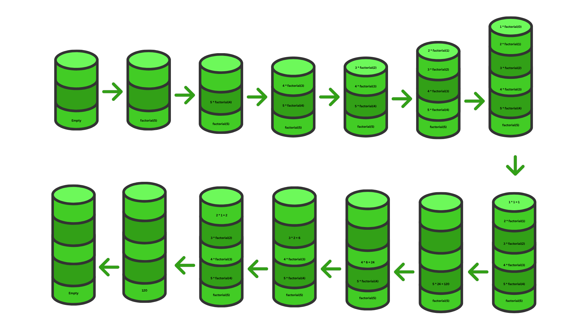

## 1.8. string

string Represents text, enclosed in single or double quotes.  

```js
let name = "Tamim";
let myName = 'tamim';
```

### Quotes:

JavaScript supports three types of quotes for working with strings.

1.  Single Quotes (''):

```js
const name = 'Tamim';
console.log(name); // Tamim
```

1.  Double Quotes (""):

```js
const language = "JavaScript";
console.log(language); // JavaScript
```

3.  Backticks (``):

Backticks are more powerful than single/double quotes. They were introduced in ES6 (2015) and allow for:

-  Multiline Strings (No need for \n):

```js
const multiline = `This is line 1
This is line 2
This is line 3`;
console.log(multiline);
```

-  Insert Variables Directly:

```js
const name = "Tamim";
const age = 20;

const info = `My name is ${name} and I am ${age} years old.`;
console.log(info);
// My name is Tamim and I am 20 years old.
```

-  Expression Evaluation:

```js
console.log(`5 + 7 = ${5 + 7}`); // 5 + 7 = 12
```

### String Property:

.length is the only string property, and it’s very commonly used.

```js
const str = "JavaScript";
console.log(str.length); // 10
```

### String Methods:

- **Case Conversion:**
    
    ```js
    console.log("hello".toUpperCase()); // "HELLO"
    console.log("WORLD".toLowerCase()); // "world"
    console.log('Interface'[0].toLowerCase()); // 'i'
    ```
    
- **Searching in Strings:**
    
    ```js
    console.log("JavaScript".includes("Script")); // true
    console.log("JavaScript".startsWith("Java")); // true
    console.log("JavaScript".endsWith("Script")); // true
    console.log("hello world".indexOf("world")); // 6
    ```
    
    Note: indexOf() method searches a string for a specific substring and returns the index (position) of the first match of found and -1 if nothing can be found.
    
    syntax:
    
    ```js
    string.indexOf(searchValue, startIndex);
    ```
    
    -  searchValue – the substring to find
    -  startIndex (optional) – where to start the search (default is 0)
    
    ```js
    console.log("banana".indexOf("a"));      // 1 → first "a"
    console.log("banana".indexOf("a", 2));   // 3 → next "a" after index 2
    console.log("banana".indexOf("z"));      // -1 → not found
    ```
    
- **Extracting Part of a String:**
    
    slice(start, end):
    
    The slice() method returns a part of the string, starting from the given start index and ending just before the end index. If the second argument is not provided, the method extracts characters from the start index to the end of the string. Additionally, slice() supports negative values, which count from the end of the string instead of the beginning.
    
    ```js
    const text = "JavaScript";
    
    console.log(text.slice(0, 4));    // "Java" (from index 0 to 3)
    console.log(text.slice(4))        // "Script" (from index 4 to the end)
    console.log(text.slice(-4, -1));  // "rip" (start at the 4th position from the right, end at the 2nd position from the right)
    ```
    
- **Joining and Splitting:**
    
    ```js
    const sentence = "I love JavaScript";
    const words = sentence.split(" "); // ["I", "love", "JavaScript"]
    console.log(words.join("-"));      // "I-love-JavaScript"
    ```
    
- **trim() - for removing white space before and after:**
    
    ```js
    const str = " hello world! ";
    const trimmedStr = str.trim();
    console.log(trimmedStr); // Output: "hello world!"
    ```
    
- **trimStart()/trimEnd() or trimLeft()/trimRight()- for removing white space from specific side:**
    
    ```js
    const str = "          hello world! ";
    console.log(str) // Output: "          hello world! "
    
    const trimmedStr = str.trimStart();
    const trimmedEndStr = str.trimEnd();
    console.log(trimmedStr); // Output: "hello world! "
    console.log(trimmedEndStr); // Output: "          hello world!"
    ```
    
- **Replacing and Repeating:**
    
    ```js
    let str = "purple-color";
    let result = str.replace("-color", "");
    console.log(result); // "purple"
    
    /*
    We replaced "-color" with an empty string"" →  An empty string "" is not " " (a space), or any characters. empty string means nothing.
    
    So we’re left with only "purple".
    */
        
    console.log("I like cats. cats are sweet".replace("cats", "dogs")); // I like dogs. cats are sweet
    console.log("I like cats. cats are sweet".replaceAll('cats', "dogs")); // "I like dogs. dogs are sweet"
    console.log("ha".repeat(3)); // "hahaha"
    ```
    
- **includes, startsWith, endsWith:**
    
    ```js
    const message = "Hello, Tamim!";
    console.log(message.includes("Tamim")); // true
    console.log(message.includes("hello")); // false (case-sensitive)
    
    const greeting = "JavaScript is fun!";
    console.log(greeting.startsWith("Java"));   // true
    console.log(greeting.startsWith("Script")); // false
    console.log(greeting.startsWith("Script", 4)); // true (starts checking from index 4)
    
    const fileName = "report.pdf";
    console.log(fileName.endsWith(".pdf"));  // true
    console.log(fileName.endsWith(".txt"));  // false
    console.log("JavaScript".endsWith("Script", 10)); // true
    console.log("JavaScript".endsWith("Java", 4));    // true
    ```
    
- **concat:**
    
    ```js
    const str1 = "Hello";
    const str2 = "World";
    const result = str1.concat(" ", str2);
    console.log(result); // "Hello World"
    
    const result2 = "I".concat(" love", " JavaScript");
    console.log(result2); // "I love JavaScript"
    ```
    
- **String Reverse:**
    
    ```js
    const sentence = 'hello';
    let reverse = '';
    for (const letter of sentence) {
        reverse = letter + reverse;
    }
    console.log(reverse); // olleh
    
    
    // or using build in methods
    const str = "hello";
    const reversed = str.split("").reverse().join("");
    console.log(reversed); // Output: "olleh"
    
    const split = str.split("");
    console.log(split); // Output: ['h', 'e', 'l', 'l', 'o']
    
    const reversedArray = split.reverse();
    console.log(reversedArray); // Output: ['o', 'l', 'l', 'e', 'h']
    
    const joined = reversedArray.join("");
    console.log(joined); // Output: "olleh"
    ```
    
- **padStart** 
    padStart is a string method that ensures a string reaches a certain length by adding characters to the start of the string.
    
    syntax:

    ```str.padStart(targetLength, padString)```

    - targetLength → the final desired length of the string.
    - padString → the character(s) to add at the start (default is space " " if not specified).

    ```js
        let num = "5";
        console.log(num.padStart(3, "0")); // "005"
    ```

    - Original string: "5" (length 1)
    - Target length: 3
    - Pad with "0" at the start until length becomes 3 → "005"

### Strings are immutable:

That's mean you can't change characters directly:

```js
let str = "Hello";
str[0] = "Y";
console.log(str); // "Hello" (not "Yello")
```

You must create a new string instead:

```js
let str = "Hello";
let newStr = "Y" + str.slice(1);
console.log(newStr); // "Yello"
```


## 1.7. function

A Function is a block of reusable code that perform a specific task when it is called.

```js
function calcSum(a, b) {
    console.log(a + b);
}

calcSum(1, 2); // 3
```

**Note:**

*   1, 2 are arguments
*   a, b are parameters

### 1.7.1. What is the difference between return and no return in a function?

```js
function calcSum(a, b) {
    const result = a + b;
}

console.log(calcSum(1, 2)); // undefined
```

In this example, the function calculates something, but it doesn't return anything. So when we call sum(1, 2), the calculation happens inside the function, but we can’t access or use the result outside. we just call the function, and that’s all — no control or output comes back.

```js
function calcSum(a, b) {
    const result = a + b;
    return result;
}

console.log(calcSum(1, 2)); // 3
const functionResult = calcSum(3, 4);
console.log(functionResult + 5); // 12

```

In this example, the function not only does the work, but it also returns the result to us. This means we can store it, reuse it, or do more operations with it.

You can think of it like this:

We order a coffee from a robot. The robot’s job is to make the coffee. But the robot’s owner teaches it something special, When someone orders coffee, don’t just make it — also serve it on the table.

That’s how `return` works in a function.

*   Without `return`, the robot just makes the coffee — but you don’t get it.
*   With `return`, the robot makes the coffee and gives it to you.

so,

If a function returns a value, you can store it in a variable and use it for further operations. If a function does not return anything, you just call the function, but you can’t use its output for further operations.

### 1.7.2. Default Parameter:

In JavaScript, default parameters allow you to set default values for function parameters. If no arguments is passed when the function is called, the default parameter will be used.

```
function showGreet(name = "Guest") {
  console.log("Hello, " + name + "!");
}
showGreet("Tamim"); // Output: Hello, Tamim!
showGreet();        // Output: Hello, Guest!
```

### 1.7.3. CallBack Function

A callback is a function passed as an argument to another function, to be called later.

```js
// A function that takes another function as a callback
function greet(name, callback) {
  console.log("Hello " + name);
  callback(); // calling the callback
}

// Passing a function as a callback
function sayGoodbye() {
  console.log("Goodbye!");
}

greet("Tamim", sayGoodbye);

// Output:
// Hello Tamim
// Goodbye!
```


### 1.7.4. Arrow Function:

Arrow functions are a shorter way to write functions in JavaScript. They were introduced in ES6.

Examples:

```
const greet = () => console.log("Hello!");
greet(); // Output: Hello!


const greet2 = () => {
    console.log("Hello!");
};
greet2(); // Output: Hello!


const square = x => x * x;
console.log(square(5)); // Output: 25


const multiply = (a, b) => {
    const result = a * b;
    return result;
};
console.log(multiply(3, 4)); // Output: 12
```

### 1.7.5. Difference between arrow function and normal function

- Normal function: Must use return.
- Arrow function: Can omit {} and return for single-expression functions.

```js
// Normal function
function multiply(a, b) {
  return a * b;
}

// Arrow function with implicit return
const multiplyArrow = (a, b) => a * b;
```

- Normal functions: this depends on how the function is called.
- Arrow functions: this depends on where the function is defined (lexical scope).

```js
const person = {
  name: "Alice",
  greetNormal: function() {
    setTimeout(function() {
      console.log("Normal: " + this.name); // undefined, because setTimeout fuciton dont have name property
    }, 1000);
  },
  greetArrow: function() {
    setTimeout(() => {
      console.log("Arrow: " + this.name); // Alice
    }, 1000);
  }
};

person.greetNormal();
person.greetArrow();
```

- Normal function: arguments is available.
- Arrow function: arguments is not available.

```js
function normalFunc(a, b) {
  console.log(arguments); // [1, 2]
}
normalFunc(1, 2);

const arrowFunc = (a, b) => console.log(arguments); // ReferenceError
arrowFunc(1, 2);
```

- Normal function: Can be used as a constructor
- Arrow function: Cannot be used as a constructor.

```js
function Person(name, age) {
  this.name = name;
  this.age = age;
}

const p1 = new Person("Alice", 25);
console.log(p1.name); // Alice
console.log(p1.age);  // 25
```

```js
const PersonArrow = (name, age) => {
  this.name = name;
  this.age = age;
};

const p2 = new PersonArrow("Bob", 30); // ❌ TypeError: PersonArrow is not a constructor
console.log(p2.name); 
console.log(p2.age);  
```

- Arrow functions are ideal for callbacks, especially with array methods like map, filter, forEach.
- normal function are not ideal for callback

```js
const numbers = [1, 2, 3, 4, 5];

const squaredNormal = numbers.map(function(num) {
  return num * num;
});

console.log(squaredNormal); // [1, 4, 9, 16, 25]
```

```js
const numbers = [1, 2, 3, 4, 5];

const squaredArrow = numbers.map(num => num * num);

console.log(squaredArrow); // [1, 4, 9, 16, 25]
```


### 1.7.6. Recursion

Recursion is a technique where a function calls itself.

```js
function a() {
    const a = 10;
    console.log('inside a', a);
}
function b() {
    const b = 20;
    a();
    console.log('inside b', b);
}

function c() {
    const c = 30;
    b();
    console.log('inside c', c);
}
c();

/*
inside a 10
inside b 20
inside c 30
*/
```

#### 1.7.6.1. what is Call Stack:

A call stack is a data structure that keeps track of function calls in a Last-In-First-Out (LIFO) manner. When a recursive function calls itself, here's what happens:

*   New Frame Creation: Each function call creates a new "stack frame" containing the function's parameters, local variables, and return address
*   Stack Growth: These frames pile up on top of each other as the recursion goes deeper
*   Base Case Reached: When the base case is hit, the recursion stops adding new frames
*   Stack Unwinding: Functions start returning values and their frames are removed from the stack in reverse order

  

#### 1.7.6.2. How the recursion Works:

A recursive function typically has two main components:

1.  **Base Case:** The part where the recursive function stops the recursion based on a condition. It ensures that the function does not call itself indefinitely, which prevents a stack overflow.
    - **Stack OverFlow:** A stack overflow is an error that happens when the call stack gets too full.
    
    ```js
    function greeting() {
        console.log("Hello, world!");
        greeting();
    }
    greeting(); // RangeError: Maximum call stack size exceeded
    ```
2.  **Recursive Case:** The part where the recursive function calls itself.
    

#### 1.7.6.3. Find Factorial Using Recursion:

```

function factorial(n) {
  if (n === 0) { // base case
    return 1; 
  }
  return n * factorial(n - 1); // recursive case
}

console.log(factorial(5)); // 120
```

call stack:




    

### 1.7.7. Closure

A closure is a function technique that remembers the variables from its outer scope, even after that outer function has finished executing.

#### 1.7.7.1. Closure Features

*   Keeps scope alive - Inner function remembers variables from outer scope
*   Useful in data hiding - Helps in making private variables
*   Doesn’t lose data - Keeps values even after outer is gone

```js
function outer() {
    let name = "Tamim"; // outer variable

    function inner() {
        console.log("Hello " + name); // inner uses outer variable
    }

    return inner; // return inner function
}

const greet = outer(); // outer() is called, inner() is returned

greet(); // Hello Tamim 
```

```js
function secretCounter() {
    let count = 0;

    return function () {
        count++;
        console.log("Count is: " + count);
    };
}

const counter = secretCounter();

counter(); // Count is: 1
counter(); // Count is: 2
counter(); // Count is: 3
```


## 1.5. Iterables 

An iterable is any object (like Array, String, Set, Map, NodeList, HTMLCollection, etc.) that has a special method Symbol.iterator.

- When this method is called, it returns an iterator.
  - Iterator = An object that provides a way to access iterable items one by one using a next() method.
    - Each call to next() returns a result object:
      - value → the current element
      - done → false if there are more elements, true when iteration is finished

JavaScript features like for...of loop, spread operator (...), and destructuring automatically use this Symbol.iterator under the hood.

for quick preview: 
- Iterable an object with Symbol.iterator
- Iterator an object returned by calling Symbol.iterator

```js
let str = "Hi";

let iterator = str[Symbol.iterator](); // get iterator object
console.log(iterator.next()); // { value: 'H', done: false }
console.log(iterator.next()); // { value: 'i', done: false }
console.log(iterator.next()); // { value: undefined, done: true }

// Used automatically by for...of
for (let ch of str) {
  console.log(ch); 
}
// H
// i
```

```js
let str = "ABC";
console.log([...str]);  
// [ 'A', 'B', 'C' ]
```

```js
let arr = [1, 2, 3];
let [a, b] = arr;

console.log(a, b); // 1 2
```

```js
let mySet = new Set([1, 2, 2, 3]);

for (let val of mySet) {
    console.log(val); // 1 2 3
}
```

```js
let myMap = new Map([
    ["name", "Alice"],
    ["age", 22]
]);

for (let [key, value] of myMap) {
    console.log(key, ":", value);
}
/*
name : Alice
age : 22
*/
```

Note:
Even though Array, Set, and Map have a .forEach() method that lets you iterate over their elements, it is not part of the iterable protocol.

- .forEach() is a separate method that executes a callback for each element.
- It works differently from for...of and does not rely on Symbol.iterator.
- It is only available on Array, Set, and Map.

## 1.4. Loops

### 1.4.1. for loop:

```js
for (let i = 0; i < 5; i++) {
    console.log(i); // 0 1 2 3 4
}

// With break and continue

for (let i = 1; i <= 10; i++) {
  if (i % 2 === 0) {
    continue; // skip even numbers
  }

  if (i === 7) {
    break; // stop the loop when i is 7
  }

  console.log(i);
}
/*
1
3
5
*/
```

### 1.4.2. while loop:

```js
let i = 0;
while (i < 5) {
    console.log(i); // 0 1 2 3 4
    i++;
}
```

### 1.4.3. do while loop:

```js
let i = 0;
do {
    console.log(i); // 0 1 2 3 4
    i++;
} while (i < 5);
```

### 1.4.4. for..of loop ( for iterables) :

```js
// with array
const arr = ['a', 'b', 'c'];

for (const element of arr) {
    console.log(element); //  a b c
}

// with string
const str = 'hello';

for (const value of str) {
    console.log(value); // h e l l o
}
```

### 1.4.5. forEach method (only for array):

```js
const nums = [1, 2, 3];
nums.forEach(function (num) {
    console.log(num); // 1 2 3
});

// or

const num2 = [4, 5, 6];
num2.forEach(num2 => console.log(num2)) // 4 5 6
Note: It does not support break or continue.
```

### 1.4.6. for..in loop (for objects):

```
const obj = {
    a: 1,
    b: 2
};

for (const key in obj) {
    console.log(key, obj[key]);
}
/*
key = a
key = b

obj[key] = obj[a] = 1
obj[key] = obj[b] = 2
*/
```

**Iterable:** An iterable(array, string) is something that you can use in a for...of loop to get values one by one.

Or you can say:

If we use a for...of loop on arrays or strings, we get one value at a time — That’s because arrays and strings are iterables, and the act of looping one-by-one is called iteration.


## 1.11. set
A Set in JavaScript is a collection of unique values (no duplicates allowed).

- Stores unique values
- Methods: add, delete, has, clear
- Iteration: for...of, forEach
- Use cases: remove duplicates, track unique items

### 1.11.1. creating a set

```js
// Create an empty Set
const mySet = new Set();

// Create a Set with initial values
const numbers = new Set([1, 2, 3, 4, 4, 5]); // duplicates ignored

console.log(numbers); // Set(5) {1, 2, 3, 4, 5}
```

### 1.11.2. Adding & Removing Values

```js
const fruits = new Set();

fruits.add("Apple");
fruits.add("Banana");
fruits.add("Apple"); // ignored, already exists

console.log(fruits); // Set(2) {"Apple", "Banana"}

// Remove a value
fruits.delete("Banana");
console.log(fruits); // Set(1) {"Apple"}

// Clear all values
fruits.clear();
console.log(fruits); // Set(0) {}
```

### 1.11.3. Checking & Size

```js
const letters = new Set(["a", "b", "c"]);

console.log(letters.has("b")); // true
console.log(letters.has("z")); // false

console.log(letters.size); // 3
```

### 1.11.4. Iterating Over a Set

```js
const colors = new Set(["red", "green", "blue"]);

// Using for...of
for (let color of colors) {
  console.log(color);
}

// Using forEach
colors.forEach((value) => {
  console.log(value);
});
```

### 1.11.5. Convert Set ↔ Array

```js
const nums = [1, 2, 2, 3, 4, 4];
const uniqueNums = new Set(nums); // remove duplicates
console.log(uniqueNums); // Set {1, 2, 3, 4}

// Convert back to array
const uniqueArray = [...uniqueNums];
console.log(uniqueArray); // [1, 2, 3, 4]
```


## 1.12. map
A Map in JavaScript is a collection of key-value pairs.

- Stores key-value pairs
- Unlike objects(keys must be Strings or Symbols only), her keys can be any type.
- Methods: set, get, delete, has, clear
- Iteration: for...of, forEach
- Use cases: frequency count, caching, dictionary-like storage

### 1.12.1. Creating a Map

```js
// Empty Map
const myMap = new Map();

// Map with initial key-value pairs
const user = new Map([
  ["name", "Alice"],
  ["age", 25]
]);

console.log(user); // Map(2) {"name" => "Alice", "age" => 25}
```

### 1.12.2. Adding & Updating Values

```js
const student = new Map();

student.set("name", "Bob");
student.set("age", 21);

// Update existing key
student.set("age", 22);

console.log(student);
// Map(2) {"name" => "Bob", "age" => 22}
```

### 1.12.3. Getting & Checking Values

```js
console.log(student.get("name")); // Bob
console.log(student.has("age"));  // true
console.log(student.has("roll")); // false

console.log(student.size); // 2
```

### 1.12.4. Deleting & Clearing

```js
student.delete("age");
console.log(student); // Map(1) {"name" => "Bob"}

student.clear();
console.log(student); // Map(0) {}
```

### 1.12.5. Iterating Over a Map

```js
const person = new Map([
  ["name", "Alice"],
  ["age", 25],
  ["city", "New York"]
]);

// for...of
for (let [key, value] of person) {
  console.log(`${key}: ${value}`);
}

// forEach
person.forEach((value, key) => {
  console.log(`${key}: ${value}`);
});
```

## 1.13. constructor function
A constructor function is a special function used to create multiple similar objects.
- By convention, constructor function names start with an uppercase letter (Person) to distinguish them from normal functions.

### 1.13.1. Why Do We Use Constructor Functions?
Suppose we want multiple similar objects:

```js
const person1 = { name: "Alice", age: 25 };
const person2 = { name: "Bob", age: 30 };
```
For 2 objects, it’s fine. But for hundreds of objects, manually creating each object is tedious and repetitive.

fot the solution we ca use constructor function:

```js
function Person(name, age) {
  this.name = name;
  this.age = age;
}

const p1 = new Person("Alice", 25);
const p2 = new Person("Bob", 30);

console.log(p1.name); // Alice
console.log(p2.age);  // 30
```

**explanation:**
here, 
- Person is a constructor function
- this refers to the new object that will be created when we use new Person(...). In other words, when you do new Person("Alice", 25), a fresh object is created, and this points to that object.
`const p1 = new Person("Alice", 25);`
- The new keyword does several things: 
  - Creates a new empty object.
  - Sets the prototype of the new object to Person.prototype.
  - Calls the Person function with this pointing to the new object.
  - Returns the new object automatically (unless you explicitly return something else).
So after this line:

```js
p1 = {
  name: "Alice",
  age: 25
}
```
Similarly, `p2 = new Person("Bob", 30)` creates another object:

```js
p2 = {
  name: "Bob",
  age: 30
}
```

### 1.13.2. Methods in Constructor Functions
#### 1.13.2.1. Adding Methods Inside Constructor

```js
function Person(name, age) {
  this.name = name;
  this.age = age;
  this.sayHello = function() {
    console.log(`Hello, I'm ${this.name}`);
  };
}

const p1 = new Person("Bob", 30);
const p2 = new Person("tamim", 30);
p1.sayHello(); // Hello, I'm Bob
p2.sayHello(); // Hello, I'm tamim
```


#### 1.13.2.2. Adding methods to prototype

```js
function Person(name, age) {
  this.name = name;
  this.age = age;
}

// Adding method to prototype
Person.prototype.sayHello = function() {
  console.log(`Hello, I'm ${this.name}`);
};

const p1 = new Person("Charlie", 35);
const p2 = new Person("tamim", 35);
p2.sayHello(); // Hello, I'm Charlie
p2.sayHello(); // Hello, I'm tamim
```
Notice we didn’t define sayHello inside the constructor.It’s shared via the prototype, so memory isn’t wasted creating a new function for every object.


### 1.13.3. Prototype 

A prototype is an object that is associated with every function and object in JavaScript. It allows objects to share properties and methods instead of each object having its own copy.

In constructor functions, the prototype property is used to attach methods or properties shared by all instances.

```js
function Person(name, age) {
  this.name = name;
  this.age = age;
  this.sayHello = function() {
    console.log(`Hello, I'm ${this.name}`);
  };
}

const p1 = new Person("Bob", 30);
const p2 = new Person("tamim", 30);
p1.sayHello(); // Hello, I'm Bob
p2.sayHello(); // Hello, I'm tamim
```

In this example we don't use prototype and every time if we create a new object using new keyword the sayHello method is created for that object and take a space to our memory. If you create 1000 objects, you have 1000 copies of the same function in memory 

to solve this problem, we can  use prototype

```js
function Person(name, age) {
  this.name = name;
  this.age = age;
}

// Adding a method to the prototype
Person.prototype.greet = function() {
  console.log(`Hi, I am ${this.name}`);
};

const p1 = new Person("Alice", 25);
const p2 = new Person("Bob", 30);

p1.greet(); // Hi, I am Alice
p2.greet(); // Hi, I am Bob
```

now, 
- p1 and p2 do not have their own greet method.
- They share the same greet method via Person.prototype.
- This saves memory because only one copy of the function exists.

#### prototype chain
The prototype chain is the mechanism JavaScript uses to look up properties and methods on objects.

When you try to access a property/method on an object:

- JavaScript checks the object itself.
- If not found, it checks the object’s prototype.
- If still not found, it checks the prototype’s prototype.
- This continues until it reaches Object.prototype.

This chain of references is called the prototype chain.

```js
function Person(name) {
  this.name = name;
}

Person.prototype.greet = function() {
  console.log(`Hi, I am ${this.name}`);
};

const p1 = new Person("Alice");

// Accessing method from prototype
p1.greet(); // Hi, I am Alice

// Accessing method from Object.prototype
console.log(p1.toString()); // "[object Object]"
```

## 1.14. class

A class is a template for creating multiple similar objects with shared properties and methods.

```

class Player {
    constructor(name, runs, wickets) {
        this.name = name;
        this.runs = runs;
        this.wickets = wickets;
    }
}

const tam = new Player('Tam', 5000, 2);
console.log(tam);
const mash = new Player('Mash', 3200, 180);
console.log(mash);

/*
Player { name: 'Tam', runs: 5000, wickets: 2 }
Player { name: 'Mash', runs: 3200, wickets: 180 }
*/
```

Here,

*   class Player — Defines a class named Player. It's a template for creating player objects.
*   constructor() — A special method inside the class that sets up the object’s properties when a new object is created. It does not create the object itself; it just defines how the object should be built.
*   this.name, this.runs, this.wickets — These are properties that will be assigned to each object.
*   new Player() — The new keyword is what actually creates a new object using the class template and runs the constructor() to initialize it.

#### 1.14.0.1. Class Methods:

In JavaScript classes, we don’t use the function keyword when defining methods.But in regular objects, the function keyword is required.

```

class Player {
    constructor(name, runs, wickets) {
        this.name = name;
        this.runs = runs;
        this.wickets = wickets;
    }

    addRun(run) {
        this.runs = this.runs + run;
    }
}

const player1 = new Player("Tamim", 5000, 100);
player1.addRun(200);
player1.addRun(31);
console.log(player1);

// Player { name: 'Tamim', runs: 5231, wickets: 100 }
```

```

class BankAccount {
    constructor(owner, balance) {
        this.owner = owner;
        this.balance = balance;
    }

    deposit(amount) {
        this.balance += amount;
        return this.balance;
    }

    withdraw(amount) {
        if (this.balance >= amount) {
            this.balance -= amount;
            return amount;
        } else {
            return 'Insufficient Balance';
        }
    }
}

const myAccount = new BankAccount('Leo', 5000);
myAccount.deposit(2000);
myAccount.withdraw(500);
console.log(myAccount);

// BankAccount { owner: 'Leo', balance: 6500 }
```

```

// Parent Class or super class
class Gadget {
    constructor(brand, model, price) {
        this.brand = brand;
        this.model = model;
        this.price = price;
    }
}

// Child Class: Laptop
class Laptop extends Gadget {
    constructor(brand, model, price, keyboardLight) {
        super(brand, model, price);
        this.keyboardLight = keyboardLight;
    }
}

// Child Class: Phone
class Phone extends Gadget {
    constructor(brand, model, price, hasFaceUnlock) {
        super(brand, model, price);
        this.hasFaceUnlock = hasFaceUnlock;
    }
}

// Child Class: Tablet
class Tablet extends Gadget {
    constructor(brand, model, price, hasPen) {
        super(brand, model, price);
        this.hasPen = hasPen;
    }
}

const myLaptop = new Laptop("Dell", "XPS 15", 1500, true);
console.log(myLaptop);

const myPhone = new Phone("Apple", "iPhone 14", 999, true);
console.log(myPhone);


const myTablet = new Tablet("Samsung", "Galaxy Tab S8", 700, true);
console.log(myTablet);

/*
Laptop {
  brand: 'Dell',
  model: 'XPS 15',
  price: 1500,
  keyboardLight: true
}
Phone {
  brand: 'Apple',
  model: 'iPhone 14',
  price: 999,
  hasFaceUnlock: true
}
Tablet {
  brand: 'Samsung',
  model: 'Galaxy Tab S8',
  price: 700,
  hasPen: true
}
*/
```

here

*   Extends Gadget → This makes Laptop, phone, tablet inherit from the Gadget class.
*   super(brand, model, price) → Calls the parent constructor so we don't repeat code.


##  1.15. OPP in js

Object-Oriented Programming is a programming paradigm based on the concept of "objects" that contain properties and methods. JavaScript supports OOP through prototypes and, since ES6, through classes.

### 1.15.1. Object and properties
#### 1.15.1.1. creating objects
##### 1.15.1.1.1. using general object literal syntax

```jss
const person = {
    name: "John",
    age: 30,
    greet: function() {
        return `Hello, I'm ${this.name}`;
    }
};

console.log(person.name); // "John"
console.log(person.greet()); // "Hello, I'm John"
```
##### 1.15.1.1.2. Using Object Constructor

```js
const person = new Object();
person.name = "John";
person.age = 30;
person.greet = function() {
    return `Hello, I'm ${this.name}`;
};

console.log(person.name); // "John"
console.log(person.greet()); // "Hello, I'm John"
```

##### 1.15.1.1.3. Using Object.create()

```js
const personPrototype = {
    greet: function() {
        return `Hello, I'm ${this.name}`;
    }
};

const person = Object.create(personPrototype);
person.name = "John";
person.age = 30;

console.log(person.name); // "John"
console.log(person.greet()); // "Hello, I'm John"
```
#### 1.15.1.2. Properties
##### 1.15.1.2.1. Property Access

```js
const car = {
    brand: "Toyota",
    model: "Corolla",
    year: 2020
};

// Dot notation
console.log(car.brand); // "Toyota"

// Bracket notation
console.log(car["model"]); // "Corolla"

// Dynamic property access
const property = "year";
console.log(car[property]); // 2020
```

##### 1.15.1.2.2. Property Descriptors

```js
const obj = {};

Object.defineProperty(obj, 'name', {
    value: 'John',
    writable: true,      // Can be changed
    enumerable: true,    // Shows up in for...in loops
    configurable: true   // Can be deleted or reconfigured
});

// Check property descriptor
console.log(Object.getOwnPropertyDescriptor(obj, 'name'));
```

### 1.15.2. Constructor Functions
Constructor functions are the traditional way to create objects in JavaScript before ES6 classes.

#### 1.15.2.1. Basic Constructor Function

```js
function Person(name, age) {
    this.name = name;
    this.age = age;
    this.greet = function() {
        return `Hello, I'm ${this.name}`;
    };
}

const person1 = new Person("Alice", 25);
const person2 = new Person("Bob", 30);

console.log(person1.greet()); // "Hello, I'm Alice"
console.log(person2.greet()); // "Hello, I'm Bob"
```

#### 1.15.2.2. Adding Methods to Prototype

```js
function Car(brand, model, year) {
    this.brand = brand;
    this.model = model;
    this.year = year;
}

// Add methods to prototype (more memory efficient)
Car.prototype.getInfo = function() {
    return `${this.year} ${this.brand} ${this.model}`;
};

Car.prototype.start = function() {
    return `${this.brand} ${this.model} is starting...`;
};

const myCar = new Car("Honda", "Civic", 2021);
console.log(myCar.getInfo()); // "2021 Honda Civic"
console.log(myCar.start()); // "Honda Civic is starting..."
```

#### 1.15.2.3. Constructor Function vs Regular Function

```js
function Person(name) {
    this.name = name;
}

// Called as constructor
const person = new Person("John");
console.log(person.name); // "John"

// Called as regular function (problematic)
const result = Person("Jane");
console.log(result); // undefined
console.log(window.name); // "Jane" (in browser) - pollutes global scope
```

### 1.15.3. ES6 Classes
ES6 introduced class syntax, which is syntactic sugar over prototype-based inheritance.

#### 1.15.3.1. Basic Class Syntax

```js
class Person {
    constructor(name, age) {
        this.name = name;
        this.age = age;
    }
    
    greet() {
        return `Hello, I'm ${this.name}`;
    }
    
    getAge() {
        return this.age;
    }
    
    // Static method
    static species() {
        return "Homo sapiens";
    }
}

const person = new Person("Alice", 25);
console.log(person.greet()); // "Hello, I'm Alice"
console.log(Person.species()); // "Homo sapiens"
```

#### 1.15.3.2. Class Expressions

```js
// Named class expression
const Person = class PersonClass {
    constructor(name) {
        this.name = name;
    }
    
    greet() {
        return `Hello, I'm ${this.name}`;
    }
};

// Anonymous class expression
const Animal = class {
    constructor(species) {
        this.species = species;
    }
};
```

#### 1.15.3.3. Getters and Setters

```js
class Rectangle {
    constructor(width, height) {
        this._width = width;
        this._height = height;
    }
    
    get width() {
        return this._width;
    }
    
    set width(value) {
        if (value > 0) {
            this._width = value;
        } else {
            throw new Error("Width must be positive");
        }
    }
    
    get area() {
        return this._width * this._height;
    }
}

const rect = new Rectangle(5, 3);
console.log(rect.area); // 15
rect.width = 10;
console.log(rect.area); // 30
```


### 1.15.4. The Four Pillars of OOP

####  1.15.4.1. Encapsulation
Encapsulation is about bundling data and methods together and restricting access to internal details.

##### 1.15.4.1.1. Private Fields (ES2022)

```js
class BankAccount {
    #balance = 0; // Private field
    #accountNumber; // Private field
    
    constructor(accountNumber, initialBalance = 0) {
        this.#accountNumber = accountNumber;
        this.#balance = initialBalance;
    }
    
    deposit(amount) {
        if (amount > 0) {
            this.#balance += amount;
            return this.#balance;
        }
        throw new Error("Amount must be positive");
    }
    
    withdraw(amount) {
        if (amount > 0 && amount <= this.#balance) {
            this.#balance -= amount;
            return this.#balance;
        }
        throw new Error("Invalid withdrawal amount");
    }
    
    getBalance() {
        return this.#balance;
    }
    
    // Private method
    #validateAmount(amount) {
        return amount > 0;
    }
}

const account = new BankAccount("123456", 1000);
console.log(account.getBalance()); // 1000
account.deposit(500);
console.log(account.getBalance()); // 1500
// console.log(account.#balance); // SyntaxError: Private field '#balance' must be declared in an enclosing class
```

##### 1.15.4.1.2. Traditional Encapsulation (Using Closures)

```js
function createBankAccount(initialBalance = 0) {
    let balance = initialBalance;
    
    return {
        deposit(amount) {
            if (amount > 0) {
                balance += amount;
                return balance;
            }
            throw new Error("Amount must be positive");
        },
        
        withdraw(amount) {
            if (amount > 0 && amount <= balance) {
                balance -= amount;
                return balance;
            }
            throw new Error("Invalid withdrawal amount");
        },
        
        getBalance() {
            return balance;
        }
    };
}

const account = createBankAccount(1000);
console.log(account.getBalance()); // 1000
```

####  1.15.4.2. Inheritance
Inheritance allows classes to inherit properties and methods from other classes.

##### 1.15.4.2.1. Class Inheritance

```js
class Animal {
    constructor(name, species) {
        this.name = name;
        this.species = species;
    }
    
    makeSound() {
        return "Some generic animal sound";
    }
    
    getInfo() {
        return `${this.name} is a ${this.species}`;
    }
}

class Dog extends Animal {
    constructor(name, breed) {
        super(name, "Dog"); // Call parent constructor
        this.breed = breed;
    }
    
    makeSound() {
        return "Woof! Woof!";
    }
    
    fetch() {
        return `${this.name} is fetching the ball!`;
    }
}

class Cat extends Animal {
    constructor(name, breed) {
        super(name, "Cat");
        this.breed = breed;
    }
    
    makeSound() {
        return "Meow!";
    }
    
    climb() {
        return `${this.name} is climbing a tree!`;
    }
}

const dog = new Dog("Buddy", "Golden Retriever");
const cat = new Cat("Whiskers", "Persian");

console.log(dog.getInfo()); // "Buddy is a Dog"
console.log(dog.makeSound()); // "Woof! Woof!"
console.log(dog.fetch()); // "Buddy is fetching the ball!"

console.log(cat.makeSound()); // "Meow!"
console.log(cat.climb()); // "Whiskers is climbing a tree!"
```

##### 1.15.4.2.2. Prototype-based Inheritance

```js
function Animal(name, species) {
    this.name = name;
    this.species = species;
}

Animal.prototype.makeSound = function() {
    return "Some generic animal sound";
};

Animal.prototype.getInfo = function() {
    return `${this.name} is a ${this.species}`;
};

function Dog(name, breed) {
    Animal.call(this, name, "Dog"); // Call parent constructor
    this.breed = breed;
}

// Set up inheritance
Dog.prototype = Object.create(Animal.prototype);
Dog.prototype.constructor = Dog;

Dog.prototype.makeSound = function() {
    return "Woof! Woof!";
};

Dog.prototype.fetch = function() {
    return `${this.name} is fetching the ball!`;
};

const dog = new Dog("Max", "Labrador");
console.log(dog.getInfo()); // "Max is a Dog"
console.log(dog.makeSound()); // "Woof! Woof!"
```

####  1.15.4.3. Polymorphism
Polymorphism allows objects of different types to be treated as instances of the same type.

```js
class Shape {
    constructor(name) {
        this.name = name;
    }
    
    area() {
        throw new Error("Area method must be implemented");
    }
    
    perimeter() {
        throw new Error("Perimeter method must be implemented");
    }
}

class Circle extends Shape {
    constructor(radius) {
        super("Circle");
        this.radius = radius;
    }
    
    area() {
        return Math.PI * this.radius ** 2;
    }
    
    perimeter() {
        return 2 * Math.PI * this.radius;
    }
}

class Rectangle extends Shape {
    constructor(width, height) {
        super("Rectangle");
        this.width = width;
        this.height = height;
    }
    
    area() {
        return this.width * this.height;
    }
    
    perimeter() {
        return 2 * (this.width + this.height);
    }
}

class Triangle extends Shape {
    constructor(a, b, c) {
        super("Triangle");
        this.a = a;
        this.b = b;
        this.c = c;
    }
    
    area() {
        const s = (this.a + this.b + this.c) / 2;
        return Math.sqrt(s * (s - this.a) * (s - this.b) * (s - this.c));
    }
    
    perimeter() {
        return this.a + this.b + this.c;
    }
}

// Polymorphism in action
const shapes = [
    new Circle(5),
    new Rectangle(4, 6),
    new Triangle(3, 4, 5)
];

shapes.forEach(shape => {
    console.log(`${shape.name}: Area = ${shape.area().toFixed(2)}, Perimeter = ${shape.perimeter().toFixed(2)}`);
});
```

####  1.15.4.4. Abstraction
Abstraction hides complex implementation details and shows only essential features.

```js
// Abstract class (by convention - JS doesn't have true abstract classes)
class Vehicle {
    constructor(make, model) {
        if (this.constructor === Vehicle) {
            throw new Error("Cannot instantiate abstract class Vehicle");
        }
        this.make = make;
        this.model = model;
    }
    
    // Abstract methods (must be implemented by subclasses)
    start() {
        throw new Error("start() method must be implemented");
    }
    
    stop() {
        throw new Error("stop() method must be implemented");
    }
    
    // Concrete method
    getInfo() {
        return `${this.make} ${this.model}`;
    }
}

class Car extends Vehicle {
    constructor(make, model, doors) {
        super(make, model);
        this.doors = doors;
    }
    
    start() {
        return `${this.getInfo()} car is starting with ignition`;
    }
    
    stop() {
        return `${this.getInfo()} car is stopping`;
    }
}

class Motorcycle extends Vehicle {
    constructor(make, model, engineSize) {
        super(make, model);
        this.engineSize = engineSize;
    }
    
    start() {
        return `${this.getInfo()} motorcycle is starting with kick/button`;
    }
    
    stop() {
        return `${this.getInfo()} motorcycle is stopping`;
    }
}

const car = new Car("Honda", "Civic", 4);
const bike = new Motorcycle("Yamaha", "R1", "1000cc");

console.log(car.start()); // "Honda Civic car is starting with ignition"
console.log(bike.start()); // "Yamaha R1 motorcycle is starting with kick/button"
```

### 1.15.5. Prototypes and Inheritance

#### 1.15.5.1. Understanding Prototypes

```js
// Every function has a prototype property
function Person(name) {
    this.name = name;
}

Person.prototype.greet = function() {
    return `Hello, I'm ${this.name}`;
};

const person1 = new Person("Alice");
const person2 = new Person("Bob");

console.log(person1.greet()); // "Hello, I'm Alice"
console.log(person1.__proto__ === Person.prototype); // true
console.log(person1.constructor === Person); // true
```

#### 1.15.5.2. Prototype Chain

```js
function Animal(name) {
    this.name = name;
}

Animal.prototype.eat = function() {
    return `${this.name} is eating`;
};

function Dog(name, breed) {
    Animal.call(this, name);
    this.breed = breed;
}

// Create prototype chain
Dog.prototype = Object.create(Animal.prototype);
Dog.prototype.constructor = Dog;

Dog.prototype.bark = function() {
    return `${this.name} is barking`;
};

const dog = new Dog("Buddy", "Golden Retriever");

console.log(dog.eat()); // "Buddy is eating" (inherited from Animal)
console.log(dog.bark()); // "Buddy is barking" (own method)

// Prototype chain: dog -> Dog.prototype -> Animal.prototype -> Object.prototype -> null
```

#### 1.15.5.3. Modern Prototype Methods

```js
// Object.create()
const animalPrototype = {
    eat() {
        return `${this.name} is eating`;
    },
    sleep() {
        return `${this.name} is sleeping`;
    }
};

const dog = Object.create(animalPrototype);
dog.name = "Buddy";
dog.bark = function() {
    return `${this.name} is barking`;
};

// Object.setPrototypeOf() (not recommended for performance)
const cat = { name: "Whiskers" };
Object.setPrototypeOf(cat, animalPrototype);

// Object.getPrototypeOf()
console.log(Object.getPrototypeOf(dog) === animalPrototype); // true
```


### 1.15.6. Advanced OOP Concepts

```js
// Mixin pattern - adding functionality to classes
const Flyable = {
    fly() {
        return `${this.name} is flying`;
    },
    land() {
        return `${this.name} is landing`;
    }
};

const Swimmable = {
    swim() {
        return `${this.name} is swimming`;
    },
    dive() {
        return `${this.name} is diving`;
    }
};

class Bird {
    constructor(name) {
        this.name = name;
    }
}

class Fish {
    constructor(name) {
        this.name = name;
    }
}

class Duck {
    constructor(name) {
        this.name = name;
    }
}

// Apply mixins
Object.assign(Bird.prototype, Flyable);
Object.assign(Fish.prototype, Swimmable);
Object.assign(Duck.prototype, Flyable, Swimmable);

const eagle = new Bird("Eagle");
const shark = new Fish("Shark");
const duck = new Duck("Donald");

console.log(eagle.fly()); // "Eagle is flying"
console.log(shark.swim()); // "Shark is swimming"
console.log(duck.fly()); // "Donald is flying"
console.log(duck.swim()); // "Donald is swimming"
```

#### 1.15.6.1. Composition over Inheritance

```js
// Composition approach
class Engine {
    constructor(horsepower) {
        this.horsepower = horsepower;
    }
    
    start() {
        return "Engine started";
    }
    
    stop() {
        return "Engine stopped";
    }
}

class GPS {
    navigate(destination) {
        return `Navigating to ${destination}`;
    }
}

class Car {
    constructor(make, model, horsepower) {
        this.make = make;
        this.model = model;
        this.engine = new Engine(horsepower); // Composition
        this.gps = new GPS(); // Composition
    }
    
    start() {
        return this.engine.start();
    }
    
    navigateTo(destination) {
        return this.gps.navigate(destination);
    }
    
    getInfo() {
        return `${this.make} ${this.model} with ${this.engine.horsepower}HP engine`;
    }
}

const car = new Car("Toyota", "Camry", 200);
console.log(car.start()); // "Engine started"
console.log(car.navigateTo("Home")); // "Navigating to Home"
```

#### 1.15.6.2. Method Chaining

```js
class Calculator {
    constructor(value = 0) {
        this.value = value;
    }
    
    add(num) {
        this.value += num;
        return this; // Return this for chaining
    }
    
    subtract(num) {
        this.value -= num;
        return this;
    }
    
    multiply(num) {
        this.value *= num;
        return this;
    }
    
    divide(num) {
        if (num !== 0) {
            this.value /= num;
        }
        return this;
    }
    
    result() {
        return this.value;
    }
    
    reset() {
        this.value = 0;
        return this;
    }
}

const calc = new Calculator(10);
const result = calc
    .add(5)      // 15
    .multiply(2) // 30
    .subtract(5) // 25
    .divide(5)   // 5
    .result();   // 5

console.log(result); // 5
```

#### 1.15.6.3. Factory Pattern

```js
class Car {
    constructor(make, model, type) {
        this.make = make;
        this.model = model;
        this.type = type;
    }
    
    getInfo() {
        return `${this.make} ${this.model} (${this.type})`;
    }
}

class CarFactory {
    static createCar(type, make, model) {
        switch (type.toLowerCase()) {
            case 'sedan':
                return new Car(make, model, 'Sedan');
            case 'suv':
                return new Car(make, model, 'SUV');
            case 'hatchback':
                return new Car(make, model, 'Hatchback');
            default:
                throw new Error(`Unknown car type: ${type}`);
        }
    }
}

const sedan = CarFactory.createCar('sedan', 'Honda', 'Civic');
const suv = CarFactory.createCar('suv', 'Toyota', 'RAV4');

console.log(sedan.getInfo()); // "Honda Civic (Sedan)"
console.log(suv.getInfo()); // "Toyota RAV4 (SUV)"
```

### 1.15.7. Design Patterns

#### 1.15.7.1. Singleton Pattern

```js
class Database {
    constructor() {
        if (Database.instance) {
            return Database.instance;
        }
        
        this.connection = "Connected to database";
        Database.instance = this;
    }
    
    query(sql) {
        return `Executing: ${sql}`;
    }
    
    static getInstance() {
        if (!Database.instance) {
            Database.instance = new Database();
        }
        return Database.instance;
    }
}

const db1 = new Database();
const db2 = new Database();
const db3 = Database.getInstance();

console.log(db1 === db2); // true
console.log(db1 === db3); // true
```

#### 1.15.7.2. Observer Pattern

```js
class EventEmitter {
    constructor() {
        this.events = {};
    }
    
    on(event, listener) {
        if (!this.events[event]) {
            this.events[event] = [];
        }
        this.events[event].push(listener);
    }
    
    off(event, listenerToRemove) {
        if (!this.events[event]) return;
        
        this.events[event] = this.events[event].filter(
            listener => listener !== listenerToRemove
        );
    }
    
    emit(event, data) {
        if (!this.events[event]) return;
        
        this.events[event].forEach(listener => listener(data));
    }
}

class NewsAgency extends EventEmitter {
    constructor() {
        super();
        this.news = "";
    }
    
    setNews(news) {
        this.news = news;
        this.emit('news', news);
    }
}

class NewsChannel {
    constructor(name) {
        this.name = name;
    }
    
    update(news) {
        console.log(`${this.name} received news: ${news}`);
    }
}

const agency = new NewsAgency();
const cnn = new NewsChannel("CNN");
const bbc = new NewsChannel("BBC");

agency.on('news', (news) => cnn.update(news));
agency.on('news', (news) => bbc.update(news));

agency.setNews("Breaking: Major scientific discovery!");
```

#### 1.15.7.3. Strategy Pattern

```js
class PaymentStrategy {
    pay(amount) {
        throw new Error("pay method must be implemented");
    }
}

class CreditCardPayment extends PaymentStrategy {
    constructor(cardNumber, cvv) {
        super();
        this.cardNumber = cardNumber;
        this.cvv = cvv;
    }
    
    pay(amount) {
        return `Paid $${amount} using Credit Card ending in ${this.cardNumber.slice(-4)}`;
    }
}

class PayPalPayment extends PaymentStrategy {
    constructor(email) {
        super();
        this.email = email;
    }
    
    pay(amount) {
        return `Paid $${amount} using PayPal account ${this.email}`;
    }
}

class CryptoPayment extends PaymentStrategy {
    constructor(walletAddress) {
        super();
        this.walletAddress = walletAddress;
    }
    
    pay(amount) {
        return `Paid $${amount} using Crypto wallet ${this.walletAddress.slice(0, 10)}...`;
    }
}

class ShoppingCart {
    constructor() {
        this.items = [];
        this.paymentStrategy = null;
    }
    
    addItem(item, price) {
        this.items.push({ item, price });
    }
    
    setPaymentStrategy(strategy) {
        this.paymentStrategy = strategy;
    }
    
    checkout() {
        const total = this.items.reduce((sum, item) => sum + item.price, 0);
        return this.paymentStrategy.pay(total);
    }
}

const cart = new ShoppingCart();
cart.addItem("Laptop", 999);
cart.addItem("Mouse", 25);

// Pay with credit card
cart.setPaymentStrategy(new CreditCardPayment("1234567890123456", "123"));
console.log(cart.checkout()); // "Paid $1024 using Credit Card ending in 3456"

// Pay with PayPal
cart.setPaymentStrategy(new PayPalPayment("user@example.com"));
console.log(cart.checkout()); // "Paid $1024 using PayPal account user@example.com"
```

### 1.15.8. Best Practices

#### 1.15.8.1. Use Meaningful Names

```js
// Bad
class P {
    constructor(n, a) {
        this.n = n;
        this.a = a;
    }
    
    g() {
        return `${this.n} is ${this.a} years old`;
    }
}

// Good
class Person {
    constructor(name, age) {
        this.name = name;
        this.age = age;
    }
    
    getDescription() {
        return `${this.name} is ${this.age} years old`;
    }
}
```

####  1.15.8.2. Follow Single Responsibility Principle

```js
// Bad - Class doing too many things
class User {
    constructor(name, email) {
        this.name = name;
        this.email = email;
    }
    
    save() {
        // Save user to database
        console.log("Saving user to database");
    }
    
    sendEmail() {
        // Send email to user
        console.log("Sending email");
    }
    
    validateEmail() {
        // Validate email format
        return /\S+@\S+\.\S+/.test(this.email);
    }
    
    hashPassword(password) {
        // Hash password
        return "hashed_" + password;
    }
}

// Good - Separated responsibilities
class User {
    constructor(name, email) {
        this.name = name;
        this.email = email;
    }
    
    getInfo() {
        return `${this.name} (${this.email})`;
    }
}

class UserRepository {
    save(user) {
        console.log("Saving user to database");
    }
    
    findByEmail(email) {
        // Find user by email
    }
}

class EmailService {
    send(user, message) {
        console.log(`Sending email to ${user.email}`);
    }
}

class EmailValidator {
    static validate(email) {
        return /\S+@\S+\.\S+/.test(email);
    }
}

class PasswordService {
    static hash(password) {
        return "hashed_" + password;
    }
}
```

###### 1.15.8.2.0.1. Use Composition When Appropriate

```js
// Instead of deep inheritance hierarchies, use composition
class Engine {
    constructor(type, horsepower) {
        this.type = type;
        this.horsepower = horsepower;
    }
    
    start() {
        return `${this.type} engine started`;
    }
}

class Transmission {
    constructor(type) {
        this.type = type;
    }
    
    shift(gear) {
        return `Shifted to ${gear} gear`;
    }
}

class Vehicle {
    constructor(make, model, engine, transmission) {
        this.make = make;
        this.model = model;
        this.engine = engine;
        this.transmission = transmission;
    }
    
    start() {
        return this.engine.start();
    }
    
    shift(gear) {
        return this.transmission.shift(gear);
    }
}

const v6Engine = new Engine("V6", 280);
const automaticTrans = new Transmission("Automatic");
const car = new Vehicle("Honda", "Accord", v6Engine, automaticTrans);
```

#### 1.15.8.3. Use Private Members for Internal State

```js
class Counter {
    #count = 0; // Private field
    #maxCount; // Private field
    
    constructor(maxCount = 100) {
        this.#maxCount = maxCount;
    }
    
    increment() {
        if (this.#count < this.#maxCount) {
            this.#count++;
        }
        return this;
    }
    
    decrement() {
        if (this.#count > 0) {
            this.#count--;
        }
        return this;
    }
    
    get value() {
        return this.#count;
    }
    
    // Private method
    #validate() {
        return this.#count >= 0 && this.#count <= this.#maxCount;
    }
}
```

###  1.15.9. Examples

#### 1.15.9.1. E-commerce System

```js
class Product {
    constructor(id, name, price, category) {
        this.id = id;
        this.name = name;
        this.price = price;
        this.category = category;
    }
    
    getInfo() {
        return `${this.name} - $${this.price} (${this.category})`;
    }
}

class CartItem {
    constructor(product, quantity) {
        this.product = product;
        this.quantity = quantity;
    }
    
    getTotalPrice() {
        return this.product.price * this.quantity;
    }
}

class ShoppingCart {
    constructor() {
        this.items = [];
    }
    
    addItem(product, quantity = 1) {
        const existingItem = this.items.find(item => item.product.id === product.id);
        
        if (existingItem) {
            existingItem.quantity += quantity;
        } else {
            this.items.push(new CartItem(product, quantity));
        }
    }
    
    removeItem(productId) {
        this.items = this.items.filter(item => item.product.id !== productId);
    }
    
    updateQuantity(productId, quantity) {
        const item = this.items.find(item => item.product.id === productId);
        if (item) {
            item.quantity = quantity;
        }
    }
    
    getTotalPrice() {
        return this.items.reduce((total, item) => total + item.getTotalPrice(), 0);
    }
    
    getItemCount() {
        return this.items.reduce((count, item) => count + item.quantity, 0);
    }
    
    clear() {
        this.items = [];
    }
    
    getItems() {
        return [...this.items]; // Return copy to prevent external modification
    }
}

class Customer {
    constructor(id, name, email, address) {
        this.id = id;
        this.name = name;
        this.email = email;
        this.address = address;
        this.orderHistory = [];
    }
    
    addOrder(order) {
        this.orderHistory.push(order);
    }
    
    getOrderHistory() {
        return [...this.orderHistory];
    }
}

class Order {
    constructor(customer, cart) {
        this.id = Date.now(); // Simple ID generation
        this.customer = customer;
        this.items = cart.getItems();
        this.totalAmount = cart.getTotalPrice();
        this.status = 'pending';
        this.orderDate = new Date();
    }
    
    updateStatus(status) {
        this.status = status;
    }
    
    getOrderSummary() {
        return {
            id: this.id,
            customer: this.customer.name,
            items: this.items.length,
            total: this.totalAmount,
            status: this.status,
            date: this.orderDate
        };
    }
}

// Usage Example
const laptop = new Product(1, "Gaming Laptop", 1299, "Electronics");
const mouse = new Product(2, "Wireless Mouse", 29, "Electronics");
const book = new Product(3, "JavaScript Guide", 45, "Books");

const customer = new Customer(1, "John Doe", "john@example.com", "123 Main St");
const cart = new ShoppingCart();

cart.addItem(laptop, 1);
cart.addItem(mouse, 2);
cart.addItem(book, 1);

console.log(`Cart total: ${cart.getTotalPrice()}`); // Cart total: $1402
console.log(`Items in cart: ${cart.getItemCount()}`); // Items in cart: 4

const order = new Order(customer, cart);
customer.addOrder(order);

console.log(order.getOrderSummary());
```

### 1.15.10. Task Management System

```js
class Task {
    constructor(id, title, description, priority = 'medium') {
        this.id = id;
        this.title = title;
        this.description = description;
        this.priority = priority;
        this.status = 'pending';
        this.createdAt = new Date();
        this.completedAt = null;
        this.assignee = null;
    }
    
    assignTo(user) {
        this.assignee = user;
    }
    
    markComplete() {
        this.status = 'completed';
        this.completedAt = new Date();
    }
    
    markInProgress() {
        this.status = 'in-progress';
    }
    
    updatePriority(priority) {
        const validPriorities = ['low', 'medium', 'high', 'urgent'];
        if (validPriorities.includes(priority)) {
            this.priority = priority;
        }
    }
    
    getTimeToComplete() {
        if (this.completedAt && this.createdAt) {
            return this.completedAt.getTime() - this.createdAt.getTime();
        }
        return null;
    }
}

class User {
    constructor(id, name, email, role = 'member') {
        this.id = id;
        this.name = name;
        this.email = email;
        this.role = role;
        this.assignedTasks = [];
    }
    
    assignTask(task) {
        this.assignedTasks.push(task);
        task.assignTo(this);
    }
    
    getTasksByStatus(status) {
        return this.assignedTasks.filter(task => task.status === status);
    }
    
    completeTask(taskId) {
        const task = this.assignedTasks.find(task => task.id === taskId);
        if (task) {
            task.markComplete();
        }
    }
}

class Project {
    constructor(id, name, description, manager) {
        this.id = id;
        this.name = name;
        this.description = description;
        this.manager = manager;
        this.tasks = [];
        this.members = [manager];
        this.createdAt = new Date();
    }
    
    addMember(user) {
        if (!this.members.includes(user)) {
            this.members.push(user);
        }
    }
    
    removeMember(user) {
        this.members = this.members.filter(member => member.id !== user.id);
    }
    
    addTask(task) {
        this.tasks.push(task);
    }
    
    removeTask(taskId) {
        this.tasks = this.tasks.filter(task => task.id !== taskId);
    }
    
    getTasksByPriority(priority) {
        return this.tasks.filter(task => task.priority === priority);
    }
    
    getTasksByStatus(status) {
        return this.tasks.filter(task => task.status === status);
    }
    
    getCompletionRate() {
        if (this.tasks.length === 0) return 0;
        const completedTasks = this.getTasksByStatus('completed').length;
        return (completedTasks / this.tasks.length) * 100;
    }
    
    getProjectStats() {
        return {
            totalTasks: this.tasks.length,
            completed: this.getTasksByStatus('completed').length,
            inProgress: this.getTasksByStatus('in-progress').length,
            pending: this.getTasksByStatus('pending').length,
            completionRate: this.getCompletionRate()
        };
    }
}

class TaskManager {
    constructor() {
        this.projects = [];
        this.users = [];
        this.nextTaskId = 1;
        this.nextProjectId = 1;
        this.nextUserId = 1;
    }
    
    createUser(name, email, role) {
        const user = new User(this.nextUserId++, name, email, role);
        this.users.push(user);
        return user;
    }
    
    createProject(name, description, manager) {
        const project = new Project(this.nextProjectId++, name, description, manager);
        this.projects.push(project);
        return project;
    }
    
    createTask(title, description, priority) {
        return new Task(this.nextTaskId++, title, description, priority);
    }
    
    getUserById(id) {
        return this.users.find(user => user.id === id);
    }
    
    getProjectById(id) {
        return this.projects.find(project => project.id === id);
    }
    
    getOverallStats() {
        const totalTasks = this.projects.reduce((sum, project) => sum + project.tasks.length, 0);
        const totalCompleted = this.projects.reduce((sum, project) => 
            sum + project.getTasksByStatus('completed').length, 0);
        
        return {
            totalProjects: this.projects.length,
            totalUsers: this.users.length,
            totalTasks,
            totalCompleted,
            overallCompletionRate: totalTasks > 0 ? (totalCompleted / totalTasks) * 100 : 0
        };
    }
}

// Usage Example
const taskManager = new TaskManager();

// Create users
const alice = taskManager.createUser("Alice Johnson", "alice@company.com", "manager");
const bob = taskManager.createUser("Bob Smith", "bob@company.com", "developer");
const charlie = taskManager.createUser("Charlie Brown", "charlie@company.com", "designer");

// Create project
const webProject = taskManager.createProject(
    "Website Redesign", 
    "Complete redesign of company website", 
    alice
);

webProject.addMember(bob);
webProject.addMember(charlie);

// Create and assign tasks
const task1 = taskManager.createTask("Design mockups", "Create initial design mockups", "high");
const task2 = taskManager.createTask("Setup development environment", "Configure dev tools", "medium");
const task3 = taskManager.createTask("Implement homepage", "Code the new homepage", "high");

webProject.addTask(task1);
webProject.addTask(task2);
webProject.addTask(task3);

charlie.assignTask(task1);
bob.assignTask(task2);
bob.assignTask(task3);

// Update task statuses
task1.markInProgress();
task2.markComplete();

console.log("Project Stats:", webProject.getProjectStats());
console.log("Overall Stats:", taskManager.getOverallStats());
```

### 1.15.11. Banking System

```js
// Abstract Account class
class Account {
    constructor(accountNumber, accountHolder, initialBalance = 0) {
        if (this.constructor === Account) {
            throw new Error("Cannot instantiate abstract Account class");
        }
        this.accountNumber = accountNumber;
        this.accountHolder = accountHolder;
        this.balance = initialBalance;
        this.transactions = [];
        this.createdAt = new Date();
        this.isActive = true;
    }
    
    deposit(amount) {
        if (amount <= 0) {
            throw new Error("Deposit amount must be positive");
        }
        if (!this.isActive) {
            throw new Error("Account is not active");
        }
        
        this.balance += amount;
        this.addTransaction('deposit', amount);
        return this.balance;
    }
    
    withdraw(amount) {
        if (amount <= 0) {
            throw new Error("Withdrawal amount must be positive");
        }
        if (!this.isActive) {
            throw new Error("Account is not active");
        }
        if (amount > this.getAvailableBalance()) {
            throw new Error("Insufficient funds");
        }
        
        this.balance -= amount;
        this.addTransaction('withdrawal', amount);
        return this.balance;
    }
    
    addTransaction(type, amount, description = '') {
        this.transactions.push({
            id: Date.now(),
            type,
            amount,
            description,
            balance: this.balance,
            timestamp: new Date()
        });
    }
    
    getBalance() {
        return this.balance;
    }
    
    // Abstract method - must be implemented by subclasses
    getAvailableBalance() {
        throw new Error("getAvailableBalance() must be implemented");
    }
    
    getTransactionHistory() {
        return [...this.transactions];
    }
    
    closeAccount() {
        this.isActive = false;
    }
    
    getAccountInfo() {
        return {
            accountNumber: this.accountNumber,
            accountHolder: this.accountHolder,
            balance: this.balance,
            type: this.constructor.name,
            isActive: this.isActive,
            createdAt: this.createdAt
        };
    }
}

class SavingsAccount extends Account {
    constructor(accountNumber, accountHolder, initialBalance = 0, interestRate = 0.02) {
        super(accountNumber, accountHolder, initialBalance);
        this.interestRate = interestRate;
        this.minimumBalance = 100;
    }
    
    getAvailableBalance() {
        return Math.max(0, this.balance - this.minimumBalance);
    }
    
    addInterest() {
        const interest = this.balance * this.interestRate;
        this.balance += interest;
        this.addTransaction('interest', interest, 'Monthly interest');
        return interest;
    }
    
    withdraw(amount) {
        if (this.balance - amount < this.minimumBalance) {
            throw new Error(`Withdrawal would violate minimum balance of ${this.minimumBalance}`);
        }
        return super.withdraw(amount);
    }
}

class CheckingAccount extends Account {
    constructor(accountNumber, accountHolder, initialBalance = 0, overdraftLimit = 500) {
        super(accountNumber, accountHolder, initialBalance);
        this.overdraftLimit = overdraftLimit;
        this.monthlyFee = 12;
    }
    
    getAvailableBalance() {
        return this.balance + this.overdraftLimit;
    }
    
    withdraw(amount) {
        if (amount > this.getAvailableBalance()) {
            throw new Error(`Withdrawal exceeds overdraft limit of ${this.overdraftLimit}`);
        }
        
        this.balance -= amount;
        this.addTransaction('withdrawal', amount);
        
        // Apply overdraft fee if balance goes negative
        if (this.balance < 0) {
            const overdraftFee = 35;
            this.balance -= overdraftFee;
            this.addTransaction('fee', overdraftFee, 'Overdraft fee');
        }
        
        return this.balance;
    }
    
    applyMonthlyFee() {
        this.balance -= this.monthlyFee;
        this.addTransaction('fee', this.monthlyFee, 'Monthly maintenance fee');
    }
}

class BusinessAccount extends Account {
    constructor(accountNumber, businessName, initialBalance = 0) {
        super(accountNumber, businessName, initialBalance);
        this.transactionLimit = 100; // transactions per month
        this.monthlyTransactionCount = 0;
        this.transactionFee = 0.50;
    }
    
    getAvailableBalance() {
        return this.balance;
    }
    
    deposit(amount) {
        const result = super.deposit(amount);
        this.incrementTransactionCount();
        return result;
    }
    
    withdraw(amount) {
        const result = super.withdraw(amount);
        this.incrementTransactionCount();
        return result;
    }
    
    incrementTransactionCount() {
        this.monthlyTransactionCount++;
        if (this.monthlyTransactionCount > this.transactionLimit) {
            this.balance -= this.transactionFee;
            this.addTransaction('fee', this.transactionFee, 'Excess transaction fee');
        }
    }
    
    resetMonthlyTransactionCount() {
        this.monthlyTransactionCount = 0;
    }
}

class Bank {
    constructor(name) {
        this.name = name;
        this.accounts = [];
        this.nextAccountNumber = 1000;
    }
    
    createSavingsAccount(accountHolder, initialBalance, interestRate) {
        const account = new SavingsAccount(
            this.generateAccountNumber(),
            accountHolder,
            initialBalance,
            interestRate
        );
        this.accounts.push(account);
        return account;
    }
    
    createCheckingAccount(accountHolder, initialBalance, overdraftLimit) {
        const account = new CheckingAccount(
            this.generateAccountNumber(),
            accountHolder,
            initialBalance,
            overdraftLimit
        );
        this.accounts.push(account);
        return account;
    }
    
    createBusinessAccount(businessName, initialBalance) {
        const account = new BusinessAccount(
            this.generateAccountNumber(),
            businessName,
            initialBalance
        );
        this.accounts.push(account);
        return account;
    }
    
    generateAccountNumber() {
        return `ACC${this.nextAccountNumber++}`;
    }
    
    findAccount(accountNumber) {
        return this.accounts.find(account => account.accountNumber === accountNumber);
    }
    
    transfer(fromAccountNumber, toAccountNumber, amount) {
        const fromAccount = this.findAccount(fromAccountNumber);
        const toAccount = this.findAccount(toAccountNumber);
        
        if (!fromAccount || !toAccount) {
            throw new Error("One or both accounts not found");
        }
        
        fromAccount.withdraw(amount);
        toAccount.deposit(amount);
        
        fromAccount.addTransaction('transfer_out', amount, `Transfer to ${toAccountNumber}`);
        toAccount.addTransaction('transfer_in', amount, `Transfer from ${fromAccountNumber}`);
        
        return true;
    }
    
    getTotalAssets() {
        return this.accounts.reduce((total, account) => total + account.getBalance(), 0);
    }
    
    getAccountsByType(accountType) {
        return this.accounts.filter(account => account instanceof accountType);
    }
    
    applyMonthlyInterest() {
        this.getAccountsByType(SavingsAccount).forEach(account => {
            if (account.isActive) {
                account.addInterest();
            }
        });
    }
    
    applyMonthlyFees() {
        this.getAccountsByType(CheckingAccount).forEach(account => {
            if (account.isActive) {
                account.applyMonthlyFee();
            }
        });
        
        this.getAccountsByType(BusinessAccount).forEach(account => {
            if (account.isActive) {
                account.resetMonthlyTransactionCount();
            }
        });
    }
}

// Usage Example
const myBank = new Bank("First National Bank");

// Create accounts
const johnSavings = myBank.createSavingsAccount("John Doe", 1000, 0.025);
const johnChecking = myBank.createCheckingAccount("John Doe", 500, 1000);
const acmeBusinessAccount = myBank.createBusinessAccount("Acme Corp", 10000);

console.log("John's Savings:", johnSavings.getAccountInfo());
console.log("John's Checking:", johnChecking.getAccountInfo());

// Perform transactions
johnSavings.deposit(200);
johnChecking.withdraw(100);
myBank.transfer(johnSavings.accountNumber, johnChecking.accountNumber, 300);

console.log("After transactions:");
console.log("Savings Balance:", johnSavings.getBalance());
console.log("Checking Balance:", johnChecking.getBalance());
console.log("Bank Total Assets:", myBank.getTotalAssets());

// Apply monthly operations
myBank.applyMonthlyInterest();
myBank.applyMonthlyFees();

console.log("After monthly operations:");
console.log("Savings Balance:", johnSavings.getBalance());
console.log("Checking Balance:", johnChecking.getBalance());
```


